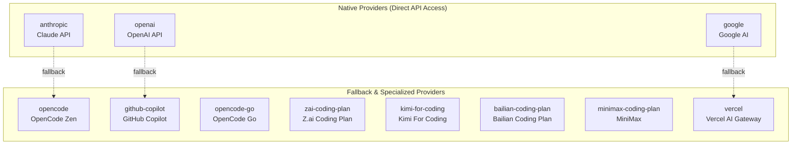
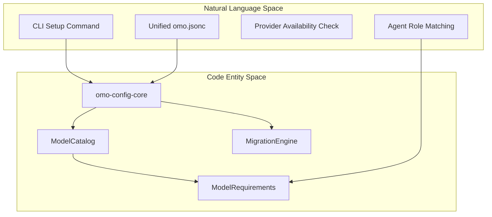
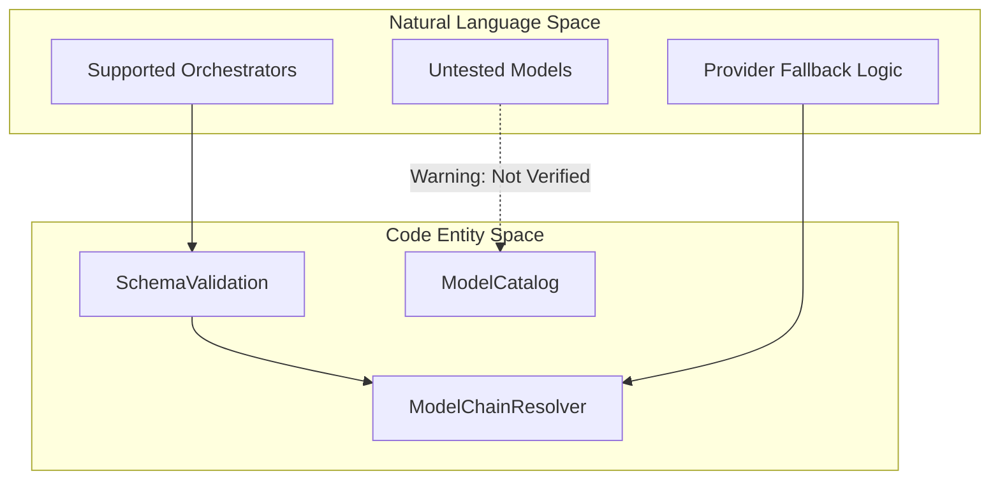

# Provider Authentication

Relevant source files

The following files were used as context for generating this wiki page:

- [.agents/skills/work-with-pr-workspace/iteration-1/eval-5/with_skill/outputs/execution-plan.md](https://github.com/code-yeongyu/oh-my-openagent/blob/HEAD/.agents/skills/work-with-pr-workspace/iteration-1/eval-5/with_skill/outputs/execution-plan.md)
- [.omo/evidence/20260730-fix-6338-oracle-temperature/codex-p2-suffix-provider-lookup-20260804.md](https://github.com/code-yeongyu/oh-my-openagent/blob/HEAD/.omo/evidence/20260730-fix-6338-oracle-temperature/codex-p2-suffix-provider-lookup-20260804.md)
- [.omo/evidence/20260809-omo-agent-toolkit-rename/task-5.txt](https://github.com/code-yeongyu/oh-my-openagent/blob/HEAD/.omo/evidence/20260809-omo-agent-toolkit-rename/task-5.txt)
- [.omo/evidence/task-1-senpi-model-chain-overhaul.txt](https://github.com/code-yeongyu/oh-my-openagent/blob/HEAD/.omo/evidence/task-1-senpi-model-chain-overhaul.txt)
- [.opencode/skills/work-with-pr-workspace/iteration-1/eval-5/with_skill/outputs/execution-plan.md](https://github.com/code-yeongyu/oh-my-openagent/blob/HEAD/.opencode/skills/work-with-pr-workspace/iteration-1/eval-5/with_skill/outputs/execution-plan.md)
- [CHANGELOG.md](https://github.com/code-yeongyu/oh-my-openagent/blob/HEAD/CHANGELOG.md)
- [README.ja.md](https://github.com/code-yeongyu/oh-my-openagent/blob/HEAD/README.ja.md)
- [README.ko.md](https://github.com/code-yeongyu/oh-my-openagent/blob/HEAD/README.ko.md)
- [README.md](https://github.com/code-yeongyu/oh-my-openagent/blob/HEAD/README.md)
- [README.ru.md](https://github.com/code-yeongyu/oh-my-openagent/blob/HEAD/README.ru.md)
- [README.zh-cn.md](https://github.com/code-yeongyu/oh-my-openagent/blob/HEAD/README.zh-cn.md)
- [assets/oh-my-opencode.schema.json](https://github.com/code-yeongyu/oh-my-openagent/blob/HEAD/assets/oh-my-opencode.schema.json)
- [docs/examples/coding-focused.jsonc](https://github.com/code-yeongyu/oh-my-openagent/blob/HEAD/docs/examples/coding-focused.jsonc)
- [docs/examples/default.jsonc](https://github.com/code-yeongyu/oh-my-openagent/blob/HEAD/docs/examples/default.jsonc)
- [docs/examples/planning-focused.jsonc](https://github.com/code-yeongyu/oh-my-openagent/blob/HEAD/docs/examples/planning-focused.jsonc)
- [docs/guide/agent-model-matching.md](https://github.com/code-yeongyu/oh-my-openagent/blob/HEAD/docs/guide/agent-model-matching.md)
- [docs/guide/installation.md](https://github.com/code-yeongyu/oh-my-openagent/blob/HEAD/docs/guide/installation.md)
- [docs/guide/orchestration.md](https://github.com/code-yeongyu/oh-my-openagent/blob/HEAD/docs/guide/orchestration.md)
- [docs/guide/overview.md](https://github.com/code-yeongyu/oh-my-openagent/blob/HEAD/docs/guide/overview.md)
- [docs/guide/team-mode.md](https://github.com/code-yeongyu/oh-my-openagent/blob/HEAD/docs/guide/team-mode.md)
- [docs/reference/cli.md](https://github.com/code-yeongyu/oh-my-openagent/blob/HEAD/docs/reference/cli.md)
- [docs/reference/codex-telemetry.md](https://github.com/code-yeongyu/oh-my-openagent/blob/HEAD/docs/reference/codex-telemetry.md)
- [docs/reference/configuration.md](https://github.com/code-yeongyu/oh-my-openagent/blob/HEAD/docs/reference/configuration.md)
- [docs/reference/features.md](https://github.com/code-yeongyu/oh-my-openagent/blob/HEAD/docs/reference/features.md)
- [docs/reference/known-issues.md](https://github.com/code-yeongyu/oh-my-openagent/blob/HEAD/docs/reference/known-issues.md)
- [docs/reference/prompt-async-gate-rfc.md](https://github.com/code-yeongyu/oh-my-openagent/blob/HEAD/docs/reference/prompt-async-gate-rfc.md)
- [docs/reference/rules-injection-cross-module-comparison.md](https://github.com/code-yeongyu/oh-my-openagent/blob/HEAD/docs/reference/rules-injection-cross-module-comparison.md)
- [packages/model-core/src/model-capabilities-bundled-snapshot.test.ts](https://github.com/code-yeongyu/oh-my-openagent/blob/HEAD/packages/model-core/src/model-capabilities-bundled-snapshot.test.ts)
- [packages/model-core/src/model-capabilities-openai-fast-aliases.test.ts](https://github.com/code-yeongyu/oh-my-openagent/blob/HEAD/packages/model-core/src/model-capabilities-openai-fast-aliases.test.ts)
- [packages/model-core/src/model-capabilities-suffixed-provider-lookup.test.ts](https://github.com/code-yeongyu/oh-my-openagent/blob/HEAD/packages/model-core/src/model-capabilities-suffixed-provider-lookup.test.ts)
- [packages/model-core/src/model-capabilities/bundled-snapshot.ts](https://github.com/code-yeongyu/oh-my-openagent/blob/HEAD/packages/model-core/src/model-capabilities/bundled-snapshot.ts)
- [packages/model-core/src/model-capabilities/get-model-capabilities.ts](https://github.com/code-yeongyu/oh-my-openagent/blob/HEAD/packages/model-core/src/model-capabilities/get-model-capabilities.ts)
- [packages/model-core/src/model-capability-aliases.test.ts](https://github.com/code-yeongyu/oh-my-openagent/blob/HEAD/packages/model-core/src/model-capability-aliases.test.ts)
- [packages/model-core/src/model-capability-aliases.ts](https://github.com/code-yeongyu/oh-my-openagent/blob/HEAD/packages/model-core/src/model-capability-aliases.ts)
- [packages/model-core/src/model-capability-guardrails.ts](https://github.com/code-yeongyu/oh-my-openagent/blob/HEAD/packages/model-core/src/model-capability-guardrails.ts)
- [packages/model-core/src/provider-model-id-transform.test.ts](https://github.com/code-yeongyu/oh-my-openagent/blob/HEAD/packages/model-core/src/provider-model-id-transform.test.ts)
- [packages/model-core/src/provider-model-id-transform.ts](https://github.com/code-yeongyu/oh-my-openagent/blob/HEAD/packages/model-core/src/provider-model-id-transform.ts)
- [packages/omo-codex/README.md](https://github.com/code-yeongyu/oh-my-openagent/blob/HEAD/packages/omo-codex/README.md)
- [packages/omo-codex/plugin/README.md](https://github.com/code-yeongyu/oh-my-openagent/blob/HEAD/packages/omo-codex/plugin/README.md)
- [packages/omo-codex/tsconfig.json](https://github.com/code-yeongyu/oh-my-openagent/blob/HEAD/packages/omo-codex/tsconfig.json)
- [packages/omo-opencode/src/cli/doctor/checks/model-resolution.test.ts](https://github.com/code-yeongyu/oh-my-openagent/blob/HEAD/packages/omo-opencode/src/cli/doctor/checks/model-resolution.test.ts)
- [packages/omo-opencode/src/generated/model-capabilities.generated.json](https://github.com/code-yeongyu/oh-my-openagent/blob/HEAD/packages/omo-opencode/src/generated/model-capabilities.generated.json)
- [packages/omo-opencode/src/shared/markdown-link-audit.test.ts](https://github.com/code-yeongyu/oh-my-openagent/blob/HEAD/packages/omo-opencode/src/shared/markdown-link-audit.test.ts)
- [postinstall.test.ts](https://github.com/code-yeongyu/oh-my-openagent/blob/HEAD/postinstall.test.ts)

This page describes how `oh-my-openagent` detects and configures AI model providers during installation and at runtime. Provider authentication itself is handled by the OpenCode host; this system identifies which providers are available to generate an optimal, multi-tier model configuration and manages model metadata caches.

For information about model selection and fallback chains, see **Model Resolution and Fallback (2.5)**. For the overall installation process, see **CLI Installation (7.1)**.

## Overview

`oh-my-openagent` supports multiple AI model providers through OpenCode's provider system. During installation, the CLI detects authenticated providers and generates a tailored configuration that assigns the best available models to each agent and category.

The system distinguishes between **native providers** (Anthropic, OpenAI, Google) and **fallback/proxy providers** (OpenCode Zen, GitHub Copilot, Kimi, etc.). Native providers offer direct API access, while fallback providers offer proxy access or specific specialized models.

Sources: [README.md:103-110](https://github.com/code-yeongyu/oh-my-openagent/blob/HEAD/README.md#L103-L110), [docs/guide/installation.md:3-8](https://github.com/code-yeongyu/oh-my-openagent/blob/HEAD/docs/guide/installation.md#L3-L8), [docs/reference/configuration.md:79-97](https://github.com/code-yeongyu/oh-my-openagent/blob/HEAD/docs/reference/configuration.md#L79-L97)

## Supported Providers

### Provider Categories

Sources: [docs/reference/features.md:9-23](https://github.com/code-yeongyu/oh-my-openagent/blob/HEAD/docs/reference/features.md#L9-L23), [docs/reference/configuration.md:114-137](https://github.com/code-yeongyu/oh-my-openagent/blob/HEAD/docs/reference/configuration.md#L114-L137)

### Provider Availability Detection

The system tracks provider availability to determine the fallback chains generated in the final configuration. While specific CLI flags often drive the TUI installation, the core logic relies on identifying active model paths.

| Provider ID | Primary Role in oMo | Recommended Models |
|------------|-------------|----------------------|
| `anthropic` | Primary orchestration (Sisyphus/Prometheus) | `claude-opus-5`, `claude-sonnet-5` [docs/reference/features.md:11-23](https://github.com/code-yeongyu/oh-my-openagent/blob/HEAD/docs/reference/features.md#L11-L23) |
| `openai` | High-IQ reasoning for Hephaestus and Oracle | `gpt-5.6-sol`, `gpt-5.4-nano` [docs/reference/features.md:11-23](https://github.com/code-yeongyu/oh-my-openagent/blob/HEAD/docs/reference/features.md#L11-L23) |
| `google` | UI generation and multimodal tasks | `gemini-3.1-pro` [docs/reference/features.md:15-21](https://github.com/code-yeongyu/oh-my-openagent/blob/HEAD/docs/reference/features.md#L15-L21) |
| `github-copilot` | General fallback for all agents | `claude-opus-5`, `gpt-5.6-sol`, `grok-code-fast-1` [docs/reference/features.md:11-15](https://github.com/code-yeongyu/oh-my-openagent/blob/HEAD/docs/reference/features.md#L11-L15), [docs/reference/configuration.md:124-124](https://github.com/code-yeongyu/oh-my-openagent/blob/HEAD/docs/reference/configuration.md#L124) |
| `opencode` | Proxy for Claude/GPT models | `opencode/big-pickle`, `opencode/gpt-5-nano` [docs/reference/features.md:13-23](https://github.com/code-yeongyu/oh-my-openagent/blob/HEAD/docs/reference/features.md#L13-L23) |
| `zai-coding-plan`| Specialized coding models | `glm-5.2`, `glm-4.6v` [docs/reference/features.md:13-18](https://github.com/code-yeongyu/oh-my-openagent/blob/HEAD/docs/reference/features.md#L13-L18) |
| `kimi-for-coding`| Sisyphus/Prometheus fallback | `kimi-k3` [docs/reference/features.md:13-20](https://github.com/code-yeongyu/oh-my-openagent/blob/HEAD/docs/reference/features.md#L13-L20) |
| `minimax-coding-plan`| Fast utility fallback | `MiniMax-M3` [docs/reference/features.md:16-23](https://github.com/code-yeongyu/oh-my-openagent/blob/HEAD/docs/reference/features.md#L16-L23) |

Sources: [docs/reference/features.md:9-23](https://github.com/code-yeongyu/oh-my-openagent/blob/HEAD/docs/reference/features.md#L9-L23), [docs/guide/agent-model-matching.md:11-20](https://github.com/code-yeongyu/oh-my-openagent/blob/HEAD/docs/guide/agent-model-matching.md#L11-L20), [docs/reference/configuration.md:79-137](https://github.com/code-yeongyu/oh-my-openagent/blob/HEAD/docs/reference/configuration.md#L79-L137)

## Detection and Generation Logic

The system identifies model capabilities using a multi-tier resolution strategy. It combines runtime metadata from the provider, static snapshots of known model capabilities, and heuristic family detection.

### Configuration Discovery and Mapping

The system uses `omo-config-core` to load settings from `~/.omo/omo.jsonc` or project-local `.omo/omo.jsonc` [docs/reference/configuration.md:49-50](https://github.com/code-yeongyu/oh-my-openagent/blob/HEAD/docs/reference/configuration.md#L49-L50). The runtime recognizes both the new name and legacy `oh-my-opencode.jsonc` via the `MigrationEngine` [docs/reference/configuration.md:96-104](https://github.com/code-yeongyu/oh-my-openagent/blob/HEAD/docs/reference/configuration.md#L96-L104).

Sources: [docs/reference/configuration.md:47-61](https://github.com/code-yeongyu/oh-my-openagent/blob/HEAD/docs/reference/configuration.md#L47-L61), [docs/reference/configuration.md:96-104](https://github.com/code-yeongyu/oh-my-openagent/blob/HEAD/docs/reference/configuration.md#L96-L104), [assets/oh-my-opencode.schema.json:102-182](https://github.com/code-yeongyu/oh-my-openagent/blob/HEAD/assets/oh-my-opencode.schema.json#L102-L182)

## Model Capability Resolution

Once a provider is authenticated, the system resolves specific capabilities like thinking (reasoning) support, tool call availability, and token limits. These are defined in the schema and validated during configuration loading.

| Feature | Schema Definition | Role |
|-------|---------------|-----------------|
| **Thinking/Reasoning** | `thinking` object | Controls reasoning budget tokens [assets/oh-my-opencode.schema.json:175-193](https://github.com/code-yeongyu/oh-my-openagent/blob/HEAD/assets/oh-my-opencode.schema.json#L175-L193) |
| **Reasoning Effort** | `reasoningEffort` | Sets complexity levels (none, minimal, low, medium, high, xhigh, max) [assets/oh-my-opencode.schema.json:150-161](https://github.com/code-yeongyu/oh-my-openagent/blob/HEAD/assets/oh-my-opencode.schema.json#L150-L161) |
| **Variants** | `variant` string | Selects model sub-types [assets/oh-my-opencode.schema.json:147-149](https://github.com/code-yeongyu/oh-my-openagent/blob/HEAD/assets/oh-my-opencode.schema.json#L147-L149) |
| **Tool Calls** | `disabled_tools` | Defines tool restrictions [assets/oh-my-opencode.schema.json:71-76](https://github.com/code-yeongyu/oh-my-openagent/blob/HEAD/assets/oh-my-opencode.schema.json#L71-L76) |

Sources: [assets/oh-my-opencode.schema.json:125-193](https://github.com/code-yeongyu/oh-my-openagent/blob/HEAD/assets/oh-my-opencode.schema.json#L125-L193), [docs/reference/configuration.md:74-77](https://github.com/code-yeongyu/oh-my-openagent/blob/HEAD/docs/reference/configuration.md#L74-L77)

## Multi-Model Verification Logic

The system includes guardrails to ensure that model overrides and built-in requirements remain aligned with known provider capabilities. Sisyphus, for instance, is only maintainer-verified on a narrow set of models including Claude Opus 5, Kimi K3, and GPT 5.6 Sol [docs/guide/agent-model-matching.md:11-18](https://github.com/code-yeongyu/oh-my-openagent/blob/HEAD/docs/guide/agent-model-matching.md#L11-L18).

The `model_fallback` flag in the configuration schema enables or disables the automatic iteration through fallback models when a primary provider fails [assets/oh-my-opencode.schema.json:96-98](https://github.com/code-yeongyu/oh-my-openagent/blob/HEAD/assets/oh-my-opencode.schema.json#L96-L98).

Sources: [assets/oh-my-opencode.schema.json:96-98](https://github.com/code-yeongyu/oh-my-openagent/blob/HEAD/assets/oh-my-opencode.schema.json#L96-L98), [docs/guide/agent-model-matching.md:7-36](https://github.com/code-yeongyu/oh-my-openagent/blob/HEAD/docs/guide/agent-model-matching.md#L7-L36), [docs/reference/configuration.md:32-34](https://github.com/code-yeongyu/oh-my-openagent/blob/HEAD/docs/reference/configuration.md#L32-L34)

## Recommended Stack and Fallback Priority

For the best experience, the installation TUI prioritizes native providers. If no native providers are found, it falls back to a sequence of proxy and utility providers.

| Priority | Provider Group | Key Models |
|-----------|------|----------------------|
| **1. Native** | Anthropic, OpenAI, Google | `claude-opus-5`, `gpt-5.6-sol`, `gemini-3.1-pro` [docs/reference/features.md:11-21](https://github.com/code-yeongyu/oh-my-openagent/blob/HEAD/docs/reference/features.md#L11-L21) |
| **2. Proxy** | GitHub Copilot, OpenCode Zen | `github-copilot/grok-code-fast-1`, `opencode/big-pickle` [docs/reference/configuration.md:124-124](https://github.com/code-yeongyu/oh-my-openagent/blob/HEAD/docs/reference/configuration.md#L124), [docs/reference/features.md:13-23](https://github.com/code-yeongyu/oh-my-openagent/blob/HEAD/docs/reference/features.md#L13-L23) |
| **3. Specialized** | Kimi, GLM, Qwen | `kimi-k3`, `glm-5.2`, `qwen3.7-plus` [docs/reference/features.md:13-19](https://github.com/code-yeongyu/oh-my-openagent/blob/HEAD/docs/reference/features.md#L13-L19) |
| **4. Utility** | MiniMax, DeepSeek, Vercel | `MiniMax-M3`, `deepseek-v4-flash`, `vercel/` gateway routes [docs/reference/features.md:16-23](https://github.com/code-yeongyu/oh-my-openagent/blob/HEAD/docs/reference/features.md#L16-L23) |

Sources: [docs/reference/features.md:9-23](https://github.com/code-yeongyu/oh-my-openagent/blob/HEAD/docs/reference/features.md#L9-L23), [docs/guide/agent-model-matching.md:11-22](https://github.com/code-yeongyu/oh-my-openagent/blob/HEAD/docs/guide/agent-model-matching.md#L11-L22), [docs/reference/configuration.md:74-77](https://github.com/code-yeongyu/oh-my-openagent/blob/HEAD/docs/reference/configuration.md#L74-L77)