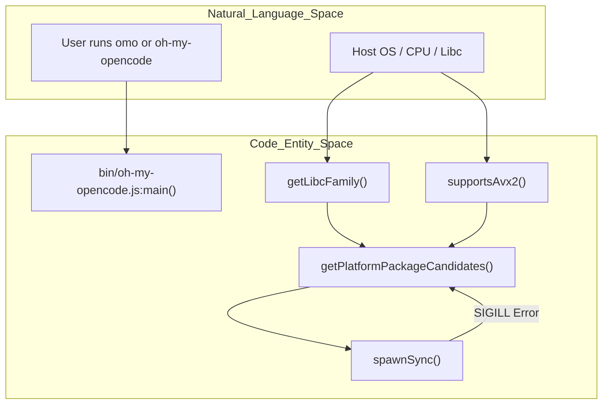
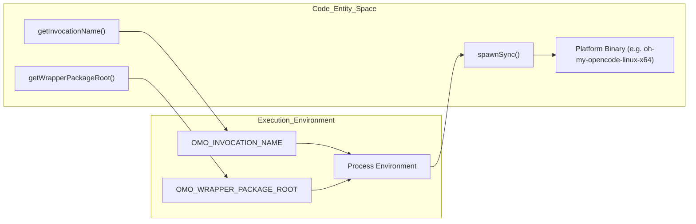

# Platform Binaries

Relevant source files

The following files were used as context for generating this wiki page:

- [.github/scripts/write-job-summary.sh](https://github.com/code-yeongyu/oh-my-openagent/blob/HEAD/.github/scripts/write-job-summary.sh)
- [.github/workflows/ci.yml](https://github.com/code-yeongyu/oh-my-openagent/blob/HEAD/.github/workflows/ci.yml)
- [.github/workflows/cla.yml](https://github.com/code-yeongyu/oh-my-openagent/blob/HEAD/.github/workflows/cla.yml)
- [.github/workflows/lint-workflows.yml](https://github.com/code-yeongyu/oh-my-openagent/blob/HEAD/.github/workflows/lint-workflows.yml)
- [.github/workflows/package-labels.yml](https://github.com/code-yeongyu/oh-my-openagent/blob/HEAD/.github/workflows/package-labels.yml)
- [.github/workflows/publish-platform.yml](https://github.com/code-yeongyu/oh-my-openagent/blob/HEAD/.github/workflows/publish-platform.yml)
- [.github/workflows/publish.yml](https://github.com/code-yeongyu/oh-my-openagent/blob/HEAD/.github/workflows/publish.yml)
- [.github/workflows/refresh-model-capabilities.yml](https://github.com/code-yeongyu/oh-my-openagent/blob/HEAD/.github/workflows/refresh-model-capabilities.yml)
- [.github/workflows/sisyphus-agent.yml](https://github.com/code-yeongyu/oh-my-openagent/blob/HEAD/.github/workflows/sisyphus-agent.yml)
- [.github/workflows/web-ci.yml](https://github.com/code-yeongyu/oh-my-openagent/blob/HEAD/.github/workflows/web-ci.yml)
- [.github/workflows/web-deploy.yml](https://github.com/code-yeongyu/oh-my-openagent/blob/HEAD/.github/workflows/web-deploy.yml)
- [CLA.md](https://github.com/code-yeongyu/oh-my-openagent/blob/HEAD/CLA.md)
- [bin/oh-my-opencode.js](https://github.com/code-yeongyu/oh-my-openagent/blob/HEAD/bin/oh-my-opencode.js)
- [bin/oh-my-opencode.test.ts](https://github.com/code-yeongyu/oh-my-openagent/blob/HEAD/bin/oh-my-opencode.test.ts)
- [bin/platform.d.ts](https://github.com/code-yeongyu/oh-my-openagent/blob/HEAD/bin/platform.d.ts)
- [bin/platform.js](https://github.com/code-yeongyu/oh-my-openagent/blob/HEAD/bin/platform.js)
- [bin/platform.test.ts](https://github.com/code-yeongyu/oh-my-openagent/blob/HEAD/bin/platform.test.ts)
- [docs/reference/lazycodex-npm-reservation.md](https://github.com/code-yeongyu/oh-my-openagent/blob/HEAD/docs/reference/lazycodex-npm-reservation.md)
- [packages/oh-my-opencode-darwin-arm64/package.json](https://github.com/code-yeongyu/oh-my-openagent/blob/HEAD/packages/oh-my-opencode-darwin-arm64/package.json)
- [packages/oh-my-opencode-darwin-x64-baseline/package.json](https://github.com/code-yeongyu/oh-my-openagent/blob/HEAD/packages/oh-my-opencode-darwin-x64-baseline/package.json)
- [packages/oh-my-opencode-darwin-x64/package.json](https://github.com/code-yeongyu/oh-my-openagent/blob/HEAD/packages/oh-my-opencode-darwin-x64/package.json)
- [packages/oh-my-opencode-linux-arm64-musl/package.json](https://github.com/code-yeongyu/oh-my-openagent/blob/HEAD/packages/oh-my-opencode-linux-arm64-musl/package.json)
- [packages/oh-my-opencode-linux-arm64/package.json](https://github.com/code-yeongyu/oh-my-openagent/blob/HEAD/packages/oh-my-opencode-linux-arm64/package.json)
- [packages/oh-my-opencode-linux-x64-baseline/package.json](https://github.com/code-yeongyu/oh-my-openagent/blob/HEAD/packages/oh-my-opencode-linux-x64-baseline/package.json)
- [packages/oh-my-opencode-linux-x64-musl-baseline/package.json](https://github.com/code-yeongyu/oh-my-openagent/blob/HEAD/packages/oh-my-opencode-linux-x64-musl-baseline/package.json)
- [packages/oh-my-opencode-linux-x64-musl/package.json](https://github.com/code-yeongyu/oh-my-openagent/blob/HEAD/packages/oh-my-opencode-linux-x64-musl/package.json)
- [packages/oh-my-opencode-linux-x64/package.json](https://github.com/code-yeongyu/oh-my-openagent/blob/HEAD/packages/oh-my-opencode-linux-x64/package.json)
- [packages/oh-my-opencode-windows-arm64/bin/.gitkeep](https://github.com/code-yeongyu/oh-my-openagent/blob/HEAD/packages/oh-my-opencode-windows-arm64/bin/.gitkeep)
- [packages/oh-my-opencode-windows-x64-baseline/package.json](https://github.com/code-yeongyu/oh-my-openagent/blob/HEAD/packages/oh-my-opencode-windows-x64-baseline/package.json)
- [packages/oh-my-opencode-windows-x64/package.json](https://github.com/code-yeongyu/oh-my-openagent/blob/HEAD/packages/oh-my-opencode-windows-x64/package.json)
- [postinstall.mjs](https://github.com/code-yeongyu/oh-my-openagent/blob/HEAD/postinstall.mjs)
- [script/build-binaries.test.ts](https://github.com/code-yeongyu/oh-my-openagent/blob/HEAD/script/build-binaries.test.ts)
- [script/build-binaries.ts](https://github.com/code-yeongyu/oh-my-openagent/blob/HEAD/script/build-binaries.ts)
- [script/build-cli-node.test.ts](https://github.com/code-yeongyu/oh-my-openagent/blob/HEAD/script/build-cli-node.test.ts)
- [script/build-cli-node.ts](https://github.com/code-yeongyu/oh-my-openagent/blob/HEAD/script/build-cli-node.ts)
- [script/codex-test-script.test.ts](https://github.com/code-yeongyu/oh-my-openagent/blob/HEAD/script/codex-test-script.test.ts)
- [script/package-labels-workflow.test.ts](https://github.com/code-yeongyu/oh-my-openagent/blob/HEAD/script/package-labels-workflow.test.ts)
- [script/package-layout.test.ts](https://github.com/code-yeongyu/oh-my-openagent/blob/HEAD/script/package-layout.test.ts)
- [script/publish-lazycodex-sync-workflow.test.ts](https://github.com/code-yeongyu/oh-my-openagent/blob/HEAD/script/publish-lazycodex-sync-workflow.test.ts)
- [script/publish-lazycodex-workflow.test.ts](https://github.com/code-yeongyu/oh-my-openagent/blob/HEAD/script/publish-lazycodex-workflow.test.ts)
- [script/publish-workflow.test.ts](https://github.com/code-yeongyu/oh-my-openagent/blob/HEAD/script/publish-workflow.test.ts)
- [script/publish.ts](https://github.com/code-yeongyu/oh-my-openagent/blob/HEAD/script/publish.ts)
- [script/remove-stale-self-package-tests.test.ts](https://github.com/code-yeongyu/oh-my-openagent/blob/HEAD/script/remove-stale-self-package-tests.test.ts)
- [script/remove-stale-self-package-tests.ts](https://github.com/code-yeongyu/oh-my-openagent/blob/HEAD/script/remove-stale-self-package-tests.ts)
- [script/senpi-test-script.test.ts](https://github.com/code-yeongyu/oh-my-openagent/blob/HEAD/script/senpi-test-script.test.ts)

This page documents the platform-specific binary distribution system for Oh My OpenCode. It explains the 11 platform packages, the `bin/oh-my-opencode.js` wrapper script, runtime CPU feature detection (AVX2), and the libc resolution logic.

---

## Overview

Oh My OpenCode is distributed as a main package plus 11 optional platform-specific packages [packages/oh-my-opencode-linux-x64/package.json:1-4](https://github.com/code-yeongyu/oh-my-openagent/blob/HEAD/packages/oh-my-opencode-linux-x64/package.json#L1-L4). Each platform package contains a pre-compiled binary tailored for specific operating systems, CPU architectures, and C standard libraries.

A lightweight Node.js wrapper script, `bin/oh-my-opencode.js`, acts as the entry point. It detects the host environment at runtime and spawns the most appropriate platform binary [bin/oh-my-opencode.js:3-15](https://github.com/code-yeongyu/oh-my-openagent/blob/HEAD/bin/oh-my-opencode.js#L3-L15).

This architecture provides:
- **Zero runtime compilation**: Binaries are pre-compiled and ready to execute.
- **Optimal CPU performance**: AVX2-enabled binaries for modern CPUs, with `-baseline` variants for older hardware [packages/oh-my-opencode-linux-x64-baseline/package.json:4-4](https://github.com/code-yeongyu/oh-my-openagent/blob/HEAD/packages/oh-my-opencode-linux-x64-baseline/package.json#L4).
- **Libc Compatibility**: Specific support for both `glibc` and `musl` on Linux [packages/oh-my-opencode-linux-x64-musl/package.json:16-18](https://github.com/code-yeongyu/oh-my-openagent/blob/HEAD/packages/oh-my-opencode-linux-x64-musl/package.json#L16-L18).

**Sources:** [bin/oh-my-opencode.js:1-15](https://github.com/code-yeongyu/oh-my-openagent/blob/HEAD/bin/oh-my-opencode.js#L1-L15), [packages/oh-my-opencode-linux-x64/package.json:1-22](https://github.com/code-yeongyu/oh-my-openagent/blob/HEAD/packages/oh-my-opencode-linux-x64/package.json#L1-L22)

---

## Package Architecture

### Platform Package Matrix

The system maintains a set of variants to cover major desktop and server environments, defined in the publish orchestration scripts [script/publish.ts:13-26](https://github.com/code-yeongyu/oh-my-openagent/blob/HEAD/script/publish.ts#L13-L26).

| Platform Package | OS | Architecture | libc | AVX2 |
|-----------------|-----|--------------|------|------|
| `oh-my-opencode-darwin-arm64` | macOS | ARM64 | - | N/A |
| `oh-my-opencode-darwin-x64` | macOS | x64 | - | Yes |
| `oh-my-opencode-darwin-x64-baseline` | macOS | x64 | - | No |
| `oh-my-opencode-linux-x64` | Linux | x64 | glibc | Yes |
| `oh-my-opencode-linux-x64-baseline` | Linux | x64 | glibc | No |
| `oh-my-opencode-linux-arm64` | Linux | ARM64 | glibc | N/A |
| `oh-my-opencode-linux-x64-musl` | Linux | x64 | musl | Yes |
| `oh-my-opencode-linux-x64-musl-baseline` | Linux | x64 | musl | No |
| `oh-my-opencode-linux-arm64-musl` | Linux | ARM64 | musl | N/A |
| `oh-my-opencode-windows-x64` | Windows | x64 | - | Yes |
| `oh-my-opencode-windows-x64-baseline` | Windows | x64 | - | No |
| `oh-my-opencode-windows-arm64` | Windows | ARM64 | - | N/A |

**Sources:** [script/publish.ts:13-26](https://github.com/code-yeongyu/oh-my-openagent/blob/HEAD/script/publish.ts#L13-L26), [packages/oh-my-opencode-darwin-arm64/package.json:10-15](https://github.com/code-yeongyu/oh-my-openagent/blob/HEAD/packages/oh-my-opencode-darwin-arm64/package.json#L10-L15), [packages/oh-my-opencode-linux-x64/package.json:10-18](https://github.com/code-yeongyu/oh-my-openagent/blob/HEAD/packages/oh-my-opencode-linux-x64/package.json#L10-L18), [packages/oh-my-opencode-linux-x64-musl/package.json:10-18](https://github.com/code-yeongyu/oh-my-openagent/blob/HEAD/packages/oh-my-opencode-linux-x64-musl/package.json#L10-L18), [packages/oh-my-opencode-windows-x64-baseline/package.json:1-15](https://github.com/code-yeongyu/oh-my-openagent/blob/HEAD/packages/oh-my-opencode-windows-x64-baseline/package.json#L1-L15), [packages/oh-my-opencode-linux-x64-baseline/package.json:1-22](https://github.com/code-yeongyu/oh-my-openagent/blob/HEAD/packages/oh-my-opencode-linux-x64-baseline/package.json#L1-L22)

### Metadata Constraints

Each package's `package.json` uses the `os`, `cpu`, and `libc` fields to allow package managers to filter installations based on the host system [packages/oh-my-opencode-linux-arm64/package.json:10-18](https://github.com/code-yeongyu/oh-my-openagent/blob/HEAD/packages/oh-my-opencode-linux-arm64/package.json#L10-L18).

- **Linux Libc**: Uses `glibc` [packages/oh-my-opencode-linux-x64/package.json:17-17](https://github.com/code-yeongyu/oh-my-openagent/blob/HEAD/packages/oh-my-opencode-linux-x64/package.json#L17) or `musl` [packages/oh-my-opencode-linux-x64-musl/package.json:17-17](https://github.com/code-yeongyu/oh-my-openagent/blob/HEAD/packages/oh-my-opencode-linux-x64-musl/package.json#L17).
- **Baseline Variants**: Specifically tagged in the description as "no AVX2" for compatibility with older x64 processors [packages/oh-my-opencode-linux-x64-baseline/package.json:4-4](https://github.com/code-yeongyu/oh-my-openagent/blob/HEAD/packages/oh-my-opencode-linux-x64-baseline/package.json#L4).

---

## Runtime Selection Logic

The `bin/oh-my-opencode.js` wrapper script performs a multi-step detection process to locate the best binary.

### 1. Feature Detection

The script probes the system for specific capabilities:
- **Libc Family**: On Linux, it attempts to detect the libc family (`glibc` or `musl`) using `detect-libc` [bin/oh-my-opencode.js:23-35](https://github.com/code-yeongyu/oh-my-openagent/blob/HEAD/bin/oh-my-opencode.js#L23-L35).
- **AVX2 Support**:
    - **Linux**: Reads `/proc/cpuinfo` and checks for the `avx2` flag [bin/oh-my-opencode.js:46-53](https://github.com/code-yeongyu/oh-my-openagent/blob/HEAD/bin/oh-my-opencode.js#L46-L53).
    - **macOS**: Executes `sysctl -n machdep.cpu.leaf7_features` [bin/oh-my-opencode.js:55-65](https://github.com/code-yeongyu/oh-my-openagent/blob/HEAD/bin/oh-my-opencode.js#L55-L65).
    - **Force Baseline**: Users can bypass detection by setting `OH_MY_OPENCODE_FORCE_BASELINE=1` [bin/oh-my-opencode.js:42-44](https://github.com/code-yeongyu/oh-my-openagent/blob/HEAD/bin/oh-my-opencode.js#L42-L44).

### 2. Candidate Resolution

The function `getPlatformPackageCandidates` (imported from `bin/platform.js`) generates a prioritized list of package names [bin/oh-my-opencode.js:164-172](https://github.com/code-yeongyu/oh-my-openagent/blob/HEAD/bin/oh-my-opencode.js#L164-L172). If AVX2 is supported, the standard package is preferred; otherwise, the `-baseline` variant is prioritized [bin/oh-my-opencode.js:162-172](https://github.com/code-yeongyu/oh-my-openagent/blob/HEAD/bin/oh-my-opencode.js#L162-L172).

### 3. Execution and Fallback

The wrapper attempts to execute the resolved binary using `spawnSync` [bin/oh-my-opencode.js:206-209](https://github.com/code-yeongyu/oh-my-openagent/blob/HEAD/bin/oh-my-opencode.js#L206-L209). If a binary fails with `SIGILL` (Illegal Instruction), the script automatically falls back to the next candidate in the list (typically the baseline version) [bin/oh-my-opencode.js:221-223](https://github.com/code-yeongyu/oh-my-openagent/blob/HEAD/bin/oh-my-opencode.js#L221-L223).

### Runtime Selection Data Flow

Title: Runtime Platform Detection and Binary Selection

**Sources:** [bin/oh-my-opencode.js:23-68](https://github.com/code-yeongyu/oh-my-openagent/blob/HEAD/bin/oh-my-opencode.js#L23-L68), [bin/oh-my-opencode.js:154-176](https://github.com/code-yeongyu/oh-my-openagent/blob/HEAD/bin/oh-my-opencode.js#L154-L176), [bin/oh-my-opencode.js:203-230](https://github.com/code-yeongyu/oh-my-openagent/blob/HEAD/bin/oh-my-opencode.js#L203-L230)

---

## Invocation Routing

The wrapper detects how it was called (e.g., via `omo`, `oh-my-opencode`, or `lazycodex`) to provide context to the underlying binary [bin/oh-my-opencode.js:139-152](https://github.com/code-yeongyu/oh-my-openagent/blob/HEAD/bin/oh-my-opencode.js#L139-L152).

- **Invocation Name**: Determined via `process.argv[1]` or the `OMO_INVOCATION_NAME` environment variable [bin/oh-my-opencode.js:140-152](https://github.com/code-yeongyu/oh-my-openagent/blob/HEAD/bin/oh-my-opencode.js#L140-L152).
- **LazyCodex Installer**: If invoked as `lazycodex` or `lazycodex-ai` with `update` or `uninstall` commands, the script triggers a specialized local installer [bin/oh-my-opencode.js:111-131](https://github.com/code-yeongyu/oh-my-openagent/blob/HEAD/bin/oh-my-opencode.js#L111-L131).
- **Environment Propagation**: The `OMO_INVOCATION_NAME` and `OMO_WRAPPER_PACKAGE_ROOT` are passed to the child process environment [bin/oh-my-opencode.js:197-201](https://github.com/code-yeongyu/oh-my-openagent/blob/HEAD/bin/oh-my-opencode.js#L197-L201).

### Binary Execution Context

Title: Environment Propagation to Platform Binary

**Sources:** [bin/oh-my-opencode.js:94-96](https://github.com/code-yeongyu/oh-my-openagent/blob/HEAD/bin/oh-my-opencode.js#L94-L96), [bin/oh-my-opencode.js:139-152](https://github.com/code-yeongyu/oh-my-openagent/blob/HEAD/bin/oh-my-opencode.js#L139-L152), [bin/oh-my-opencode.js:197-209](https://github.com/code-yeongyu/oh-my-openagent/blob/HEAD/bin/oh-my-opencode.js#L197-L209)

---

## Build and Publishing Pipeline

The binaries are built using GitHub Actions to ensure native compatibility for each target platform [ .github/workflows/publish-platform.yml:37-47](https://github.com/code-yeongyu/oh-my-openagent/blob/HEAD/.github/workflows/publish-platform.yml#L37-L47).

1. **Build Job**: Runs on `ubuntu-latest`, `macos-latest`, and `windows-latest` matrix [ .github/workflows/publish-platform.yml:39-47](https://github.com/code-yeongyu/oh-my-openagent/blob/HEAD/.github/workflows/publish-platform.yml#L39-L47).
2. **Binary Generation**: Executes `bun run build:binaries` which compiles the launcher into a standalone binary [ .github/workflows/publish-platform.yml:145-146](https://github.com/code-yeongyu/oh-my-openagent/blob/HEAD/.github/workflows/publish-platform.yml#L145-L146).
3. **Artifact Compression**: Unix platforms use `tar.gz` while Windows uses `7z` [ .github/workflows/publish-platform.yml:164-169](https://github.com/code-yeongyu/oh-my-openagent/blob/HEAD/.github/workflows/publish-platform.yml#L164-L169).
4. **npm Publishing**: The `publish-platform` job uses GitHub OIDC to securely publish each platform package to npm [ .github/workflows/publish-platform.yml:236-240](https://github.com/code-yeongyu/oh-my-openagent/blob/HEAD/.github/workflows/publish-platform.yml#L236-L240).

**Sources:** [ .github/workflows/publish-platform.yml:31-47](https://github.com/code-yeongyu/oh-my-openagent/blob/HEAD/.github/workflows/publish-platform.yml#L31-L47), [ .github/workflows/publish-platform.yml:134-149](https://github.com/code-yeongyu/oh-my-openagent/blob/HEAD/.github/workflows/publish-platform.yml#L134-L149), [ .github/workflows/publish-platform.yml:236-240](https://github.com/code-yeongyu/oh-my-openagent/blob/HEAD/.github/workflows/publish-platform.yml#L236-L240)

---

## Error Handling

The wrapper provides actionable feedback if binaries are missing or incompatible:
1. **Missing Binary**: If `require.resolve` fails for all candidates, it prints the host platform details and the installation command [bin/oh-my-opencode.js:188-195](https://github.com/code-yeongyu/oh-my-openagent/blob/HEAD/bin/oh-my-opencode.js#L188-L195).
2. **Execution Failure**: If the binary exists but cannot be executed (e.g., permission issues), it exits with code `2` [bin/oh-my-opencode.js:211-218](https://github.com/code-yeongyu/oh-my-openagent/blob/HEAD/bin/oh-my-opencode.js#L211-L218).
3. **Signal Mapping**: Process signals (SIGINT, SIGTERM, SIGILL, SIGKILL) are mapped to standard exit codes (128 + signal number) via `getSignalExitCode` [bin/oh-my-opencode.js:70-79](https://github.com/code-yeongyu/oh-my-openagent/blob/HEAD/bin/oh-my-opencode.js#L70-L79).

**Sources:** [bin/oh-my-opencode.js:70-79](https://github.com/code-yeongyu/oh-my-openagent/blob/HEAD/bin/oh-my-opencode.js#L70-L79), [bin/oh-my-opencode.js:188-195](https://github.com/code-yeongyu/oh-my-openagent/blob/HEAD/bin/oh-my-opencode.js#L188-L195), [bin/oh-my-opencode.js:211-230](https://github.com/code-yeongyu/oh-my-openagent/blob/HEAD/bin/oh-my-opencode.js#L211-L230)