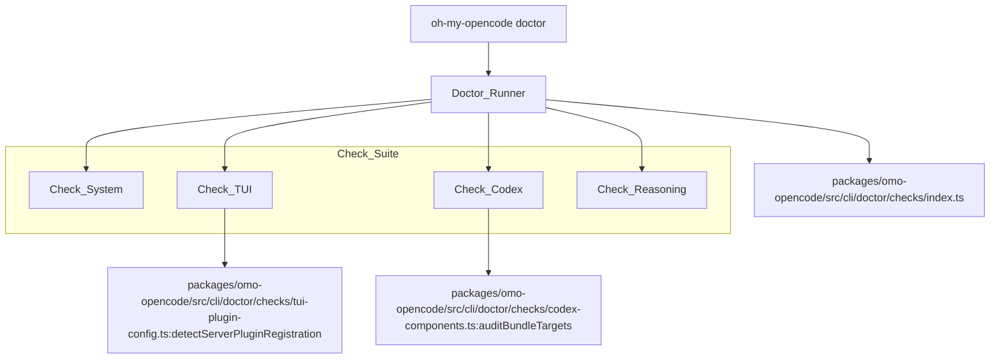
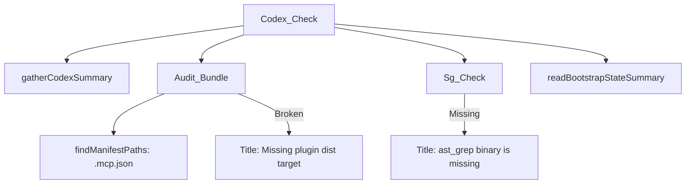

# Troubleshooting Installation

Relevant source files

The following files were used as context for generating this wiki page:

- [.agents/skills/work-with-pr-workspace/iteration-1/eval-5/with_skill/outputs/execution-plan.md](https://github.com/code-yeongyu/oh-my-openagent/blob/HEAD/.agents/skills/work-with-pr-workspace/iteration-1/eval-5/with_skill/outputs/execution-plan.md)
- [.omo/evidence/20260809-omo-agent-toolkit-rename/task-5.txt](https://github.com/code-yeongyu/oh-my-openagent/blob/HEAD/.omo/evidence/20260809-omo-agent-toolkit-rename/task-5.txt)
- [.omo/evidence/20260809-omo-ai-beta-release/task-13.txt](https://github.com/code-yeongyu/oh-my-openagent/blob/HEAD/.omo/evidence/20260809-omo-ai-beta-release/task-13.txt)
- [.omo/evidence/20260809-omo-ai-beta-release/task-14.txt](https://github.com/code-yeongyu/oh-my-openagent/blob/HEAD/.omo/evidence/20260809-omo-ai-beta-release/task-14.txt)
- [.omo/evidence/20260809-omo-ai-beta-release/task-6.txt](https://github.com/code-yeongyu/oh-my-openagent/blob/HEAD/.omo/evidence/20260809-omo-ai-beta-release/task-6.txt)
- [.omo/evidence/20260812-omo-native-bun-update/windows-ci-fix.txt](https://github.com/code-yeongyu/oh-my-openagent/blob/HEAD/.omo/evidence/20260812-omo-native-bun-update/windows-ci-fix.txt)
- [.opencode/skills/work-with-pr-workspace/iteration-1/eval-5/with_skill/outputs/execution-plan.md](https://github.com/code-yeongyu/oh-my-openagent/blob/HEAD/.opencode/skills/work-with-pr-workspace/iteration-1/eval-5/with_skill/outputs/execution-plan.md)
- [CHANGELOG.md](https://github.com/code-yeongyu/oh-my-openagent/blob/HEAD/CHANGELOG.md)
- [README.ja.md](https://github.com/code-yeongyu/oh-my-openagent/blob/HEAD/README.ja.md)
- [README.ko.md](https://github.com/code-yeongyu/oh-my-openagent/blob/HEAD/README.ko.md)
- [README.md](https://github.com/code-yeongyu/oh-my-openagent/blob/HEAD/README.md)
- [README.ru.md](https://github.com/code-yeongyu/oh-my-openagent/blob/HEAD/README.ru.md)
- [README.zh-cn.md](https://github.com/code-yeongyu/oh-my-openagent/blob/HEAD/README.zh-cn.md)
- [assets/oh-my-opencode.schema.json](https://github.com/code-yeongyu/oh-my-openagent/blob/HEAD/assets/oh-my-opencode.schema.json)
- [docs/examples/coding-focused.jsonc](https://github.com/code-yeongyu/oh-my-openagent/blob/HEAD/docs/examples/coding-focused.jsonc)
- [docs/examples/default.jsonc](https://github.com/code-yeongyu/oh-my-openagent/blob/HEAD/docs/examples/default.jsonc)
- [docs/examples/planning-focused.jsonc](https://github.com/code-yeongyu/oh-my-openagent/blob/HEAD/docs/examples/planning-focused.jsonc)
- [docs/guide/agent-model-matching.md](https://github.com/code-yeongyu/oh-my-openagent/blob/HEAD/docs/guide/agent-model-matching.md)
- [docs/guide/installation.md](https://github.com/code-yeongyu/oh-my-openagent/blob/HEAD/docs/guide/installation.md)
- [docs/guide/orchestration.md](https://github.com/code-yeongyu/oh-my-openagent/blob/HEAD/docs/guide/orchestration.md)
- [docs/guide/overview.md](https://github.com/code-yeongyu/oh-my-openagent/blob/HEAD/docs/guide/overview.md)
- [docs/guide/team-mode.md](https://github.com/code-yeongyu/oh-my-openagent/blob/HEAD/docs/guide/team-mode.md)
- [docs/reference/cli.md](https://github.com/code-yeongyu/oh-my-openagent/blob/HEAD/docs/reference/cli.md)
- [docs/reference/codex-telemetry.md](https://github.com/code-yeongyu/oh-my-openagent/blob/HEAD/docs/reference/codex-telemetry.md)
- [docs/reference/configuration.md](https://github.com/code-yeongyu/oh-my-openagent/blob/HEAD/docs/reference/configuration.md)
- [docs/reference/features.md](https://github.com/code-yeongyu/oh-my-openagent/blob/HEAD/docs/reference/features.md)
- [docs/reference/known-issues.md](https://github.com/code-yeongyu/oh-my-openagent/blob/HEAD/docs/reference/known-issues.md)
- [docs/reference/prompt-async-gate-rfc.md](https://github.com/code-yeongyu/oh-my-openagent/blob/HEAD/docs/reference/prompt-async-gate-rfc.md)
- [docs/reference/rules-injection-cross-module-comparison.md](https://github.com/code-yeongyu/oh-my-openagent/blob/HEAD/docs/reference/rules-injection-cross-module-comparison.md)
- [packages/omo-codex/README.md](https://github.com/code-yeongyu/oh-my-openagent/blob/HEAD/packages/omo-codex/README.md)
- [packages/omo-codex/plugin/README.md](https://github.com/code-yeongyu/oh-my-openagent/blob/HEAD/packages/omo-codex/plugin/README.md)
- [packages/omo-codex/tsconfig.json](https://github.com/code-yeongyu/oh-my-openagent/blob/HEAD/packages/omo-codex/tsconfig.json)
- [packages/omo-native/.gitignore](https://github.com/code-yeongyu/oh-my-openagent/blob/HEAD/packages/omo-native/.gitignore)
- [packages/omo-native/bin/lib/doctor.js](https://github.com/code-yeongyu/oh-my-openagent/blob/HEAD/packages/omo-native/bin/lib/doctor.js)
- [packages/omo-native/bin/lib/launcher.js](https://github.com/code-yeongyu/oh-my-openagent/blob/HEAD/packages/omo-native/bin/lib/launcher.js)
- [packages/omo-native/bin/lib/setup-detect.js](https://github.com/code-yeongyu/oh-my-openagent/blob/HEAD/packages/omo-native/bin/lib/setup-detect.js)
- [packages/omo-native/bin/lib/setup-import.js](https://github.com/code-yeongyu/oh-my-openagent/blob/HEAD/packages/omo-native/bin/lib/setup-import.js)
- [packages/omo-native/bin/lib/setup-models.js](https://github.com/code-yeongyu/oh-my-openagent/blob/HEAD/packages/omo-native/bin/lib/setup-models.js)
- [packages/omo-native/bin/lib/setup-report.js](https://github.com/code-yeongyu/oh-my-openagent/blob/HEAD/packages/omo-native/bin/lib/setup-report.js)
- [packages/omo-native/bin/omo.js](https://github.com/code-yeongyu/oh-my-openagent/blob/HEAD/packages/omo-native/bin/omo.js)
- [packages/omo-native/test/brand-contract-pin.test.ts](https://github.com/code-yeongyu/oh-my-openagent/blob/HEAD/packages/omo-native/test/brand-contract-pin.test.ts)
- [packages/omo-native/test/launcher.test.ts](https://github.com/code-yeongyu/oh-my-openagent/blob/HEAD/packages/omo-native/test/launcher.test.ts)
- [packages/omo-native/test/payload.test.ts](https://github.com/code-yeongyu/oh-my-openagent/blob/HEAD/packages/omo-native/test/payload.test.ts)
- [packages/omo-native/test/setup-detect.test.ts](https://github.com/code-yeongyu/oh-my-openagent/blob/HEAD/packages/omo-native/test/setup-detect.test.ts)
- [packages/omo-native/test/setup-import.test.ts](https://github.com/code-yeongyu/oh-my-openagent/blob/HEAD/packages/omo-native/test/setup-import.test.ts)
- [packages/omo-native/test/sqlite-import-discipline.test.ts](https://github.com/code-yeongyu/oh-my-openagent/blob/HEAD/packages/omo-native/test/sqlite-import-discipline.test.ts)
- [packages/omo-native/test/tty-driver.py](https://github.com/code-yeongyu/oh-my-openagent/blob/HEAD/packages/omo-native/test/tty-driver.py)
- [packages/omo-opencode/src/shared/markdown-link-audit.test.ts](https://github.com/code-yeongyu/oh-my-openagent/blob/HEAD/packages/omo-opencode/src/shared/markdown-link-audit.test.ts)
- [packages/omo-senpi/src/install/local-launcher.test.ts](https://github.com/code-yeongyu/oh-my-openagent/blob/HEAD/packages/omo-senpi/src/install/local-launcher.test.ts)
- [packages/omo-senpi/src/install/local-launcher.ts](https://github.com/code-yeongyu/oh-my-openagent/blob/HEAD/packages/omo-senpi/src/install/local-launcher.ts)
- [postinstall.test.ts](https://github.com/code-yeongyu/oh-my-openagent/blob/HEAD/postinstall.test.ts)
- [script/build-omo-native.ts](https://github.com/code-yeongyu/oh-my-openagent/blob/HEAD/script/build-omo-native.ts)

This page documents common installation issues, diagnostic procedures, and resolutions for `oh-my-openagent`. The system relies on a multi-tier verification process involving platform-specific binaries, tool dependencies (LSP, AST-grep), and model resolution chains across multiple providers.

## Diagnostic System: `doctor`

The primary tool for troubleshooting is the built-in `doctor` command. It executes a suite of parallel checks to verify system integrity, configuration validity, tool availability, and model resolution.

### Doctor Check Architecture

The `doctor` runner executes several categories of checks grouped into **System**, **Config**, **Tools**, and **Models**. The diagnostic process verifies system information like OpenCode paths and versions, configuration validity, and model resolution logic. It specifically inspects `oh-my-openagent/tui` registration in `tui.json` to catch incomplete UI installs [packages/omo-opencode/src/cli/doctor/checks/tui-plugin-config.ts:160-198](https://github.com/code-yeongyu/oh-my-openagent/blob/HEAD/packages/omo-opencode/src/cli/doctor/checks/tui-plugin-config.ts#L160-L198) and audits Codex components for missing bundle targets [packages/omo-opencode/src/cli/doctor/checks/codex-components.ts:63-80](https://github.com/code-yeongyu/oh-my-openagent/blob/HEAD/packages/omo-opencode/src/cli/doctor/checks/codex-components.ts#L63-L80).

Recent updates have added specific surfacing for **deprecated reasoning keys**, reporting exact file and key paths to facilitate cleanup before the removal window closes [CHANGELOG.md:14-15](https://github.com/code-yeongyu/oh-my-openagent/blob/HEAD/CHANGELOG.md#L14-L15). The `omo-native` package also includes a `doctor.js` implementation for standalone CLI diagnostics [packages/omo-native/bin/lib/doctor.js](https://github.com/code-yeongyu/oh-my-openagent/blob/HEAD/packages/omo-native/bin/lib/doctor.js).

**Diagram: Doctor Execution Flow**

Sources: [packages/omo-opencode/src/cli/doctor/index.ts:6-16](https://github.com/code-yeongyu/oh-my-openagent/blob/HEAD/packages/omo-opencode/src/cli/doctor/index.ts#L6-L16), [packages/omo-opencode/src/cli/doctor/checks/tui-plugin-config.ts:160-198](https://github.com/code-yeongyu/oh-my-openagent/blob/HEAD/packages/omo-opencode/src/cli/doctor/checks/tui-plugin-config.ts#L160-L198), [packages/omo-opencode/src/cli/doctor/checks/codex-components.ts:46-80](https://github.com/code-yeongyu/oh-my-openagent/blob/HEAD/packages/omo-opencode/src/cli/doctor/checks/codex-components.ts#L46-L80), [CHANGELOG.md:14-15](https://github.com/code-yeongyu/oh-my-openagent/blob/HEAD/CHANGELOG.md#L14-L15), [packages/omo-native/bin/lib/doctor.js](https://github.com/code-yeongyu/oh-my-openagent/blob/HEAD/packages/omo-native/bin/lib/doctor.js)

## Common Installation Issues

### 1. TUI Plugin Registration Failure
A common issue is the missing registration of the TUI component in OpenCode's `tui.json`. The `checkTuiPluginConfig` function verifies if the plugin is registered in both `opencode.json` (server) and `tui.json` (UI) [packages/omo-opencode/src/cli/doctor/checks/tui-plugin-config.ts:200-210](https://github.com/code-yeongyu/oh-my-openagent/blob/HEAD/packages/omo-opencode/src/cli/doctor/checks/tui-plugin-config.ts#L200-L210).

| Issue | Symptom | Resolution |
| :--- | :--- | :--- |
| **Missing TUI Entry** | UI features missing or "TUI plugin entry missing" warning | Run `doctor` and apply the fix to run `ensureTuiPluginEntry` [packages/omo-opencode/src/cli/config-manager/add-tui-plugin-to-tui-config.ts:39-54](https://github.com/code-yeongyu/oh-my-openagent/blob/HEAD/packages/omo-opencode/src/cli/config-manager/add-tui-plugin-to-tui-config.ts#L39-L54). |
| **Unresolvable Subpath** | "Named package subpath TUI entry is unresolvable" | The doctor flags entries like `oh-my-opencode/tui` if the package does not explicitly export a `./tui` subpath in `package.json` [packages/omo-opencode/src/cli/doctor/checks/tui-plugin-config.ts:49-65](https://github.com/code-yeongyu/oh-my-openagent/blob/HEAD/packages/omo-opencode/src/cli/doctor/checks/tui-plugin-config.ts#L49-L65). |
| **Legacy Registration** | Warning about legacy plugin names | The `doctor` command detects if the plugin is registered under `LEGACY_PLUGIN_NAME` instead of the canonical `PLUGIN_NAME` [packages/omo-opencode/src/cli/doctor/checks/tui-plugin-config.ts:67-71](https://github.com/code-yeongyu/oh-my-openagent/blob/HEAD/packages/omo-opencode/src/cli/doctor/checks/tui-plugin-config.ts#L67-L71). |

Sources: [packages/omo-opencode/src/cli/doctor/checks/tui-plugin-config.ts:160-198](https://github.com/code-yeongyu/oh-my-openagent/blob/HEAD/packages/omo-opencode/src/cli/doctor/checks/tui-plugin-config.ts#L160-L198), [packages/omo-opencode/src/cli/config-manager/add-tui-plugin-to-tui-config.ts:39-54](https://github.com/code-yeongyu/oh-my-openagent/blob/HEAD/packages/omo-opencode/src/cli/config-manager/add-tui-plugin-to-tui-config.ts#L39-L54)

### 2. Configuration Migration Failures
The system has moved to a unified `omo.jsonc` surface. At startup, a **lock-and-journal migration engine** attempts to migrate legacy `oh-my-openagent.json[c]` or `oh-my-opencode.json[c]` files into `~/.omo/omo.jsonc` [docs/reference/configuration.md:96-104](https://github.com/code-yeongyu/oh-my-openagent/blob/HEAD/docs/reference/configuration.md#L96-L104).

- **Migration Blocked**: If a newer `omo.jsonc` already exists, the migration engine may skip legacy files and issue diagnostics. It uses a no-clobber conflict policy [docs/reference/configuration.md:100-101](https://github.com/code-yeongyu/oh-my-openagent/blob/HEAD/docs/reference/configuration.md#L100-L101).
- **Rollback**: Backups are stored under `~/.omo/migration-backup-<timestamp>-opencode-config/` [docs/reference/configuration.md:102](https://github.com/code-yeongyu/oh-my-openagent/blob/HEAD/docs/reference/configuration.md#L102).
- **Manual Migration**: Run `oh-my-openagent config migrate` with `--dry-run` to inspect changes [docs/reference/configuration.md:103](https://github.com/code-yeongyu/oh-my-openagent/blob/HEAD/docs/reference/configuration.md#L103).
- **Harness-Specific Blocks**: Configuration is now resolved using `[opencode]`, `[senpi]`, and `[codex]` blocks within the unified file [docs/reference/configuration.md:57-61](https://github.com/code-yeongyu/oh-my-openagent/blob/HEAD/docs/reference/configuration.md#L57-L61).

Sources: [docs/reference/configuration.md:96-104](https://github.com/code-yeongyu/oh-my-openagent/blob/HEAD/docs/reference/configuration.md#L96-L104), [CHANGELOG.md:12-23](https://github.com/code-yeongyu/oh-my-openagent/blob/HEAD/CHANGELOG.md#L12-L23), [docs/reference/configuration.md:47-51](https://github.com/code-yeongyu/oh-my-openagent/blob/HEAD/docs/reference/configuration.md#L47-L51)

### 3. Codex Component and Bootstrap Issues
For Codex users, the system relies on a bootstrap process to provision binaries like `ast-grep` (sg). The `checkCodexComponents` utility audits the `~/.codex` directory for broken or missing plugin bundle targets [packages/omo-opencode/src/cli/doctor/checks/codex-components.ts:50-80](https://github.com/code-yeongyu/oh-my-openagent/blob/HEAD/packages/omo-opencode/src/cli/doctor/checks/codex-components.ts#L50-L80).

**Diagram: Codex Component Verification**

If `ast_grep` is missing, the `ast-grep` skill runs in a degraded state until the LazyCodex bootstrap provisions the runtime [packages/omo-opencode/src/cli/doctor/checks/codex-components.ts:92-100](https://github.com/code-yeongyu/oh-my-openagent/blob/HEAD/packages/omo-opencode/src/cli/doctor/checks/codex-components.ts#L92-L100). On Windows, users should ensure Git Bash is installed and reachable via `OMO_CODEX_GIT_BASH_PATH` [docs/guide/installation.md:45-60](https://github.com/code-yeongyu/oh-my-openagent/blob/HEAD/docs/guide/installation.md#L45-L60).

Sources: [packages/omo-opencode/src/cli/doctor/checks/codex-components.ts:46-116](https://github.com/code-yeongyu/oh-my-openagent/blob/HEAD/packages/omo-opencode/src/cli/doctor/checks/codex-components.ts#L46-L116), [docs/guide/installation.md:45-60](https://github.com/code-yeongyu/oh-my-openagent/blob/HEAD/docs/guide/installation.md#L45-L60)

### 4. Platform Binary and Launcher Errors
The `omo-native` package uses a specialized launcher to resolve the correct runtime for different environments (bun, npm, global vs local).

- **Launcher Path Resolution**: The `omo` binary uses `updateTarget` and `launcher.js` to determine the execution path [packages/omo-native/bin/lib/package-paths.js](https://github.com/code-yeongyu/oh-my-openagent/blob/HEAD/packages/omo-native/bin/lib/package-paths.js), [packages/omo-native/bin/lib/launcher.js](https://github.com/code-yeongyu/oh-my-openagent/blob/HEAD/packages/omo-native/bin/lib/launcher.js).
- **AVX2 Detection**: On certain platforms, binary selection depends on AVX2 instruction set availability to avoid illegal instruction crashes.
- **Environment Conflicts**: Inherited `OMO_BIN` or `SENPI_BIN` variables can leak into sub-processes. The launcher is designed to replace these with its own verified entries [packages/omo-native/test/launcher.test.ts:150-165](https://github.com/code-yeongyu/oh-my-openagent/blob/HEAD/packages/omo-native/test/launcher.test.ts#L150-L165).

Sources: [packages/omo-native/bin/lib/launcher.js](https://github.com/code-yeongyu/oh-my-openagent/blob/HEAD/packages/omo-native/bin/lib/launcher.js), [packages/omo-native/test/launcher.test.ts:135-170](https://github.com/code-yeongyu/oh-my-openagent/blob/HEAD/packages/omo-native/test/launcher.test.ts#L135-L170)

## Skill Loading and Shadowing Conflicts

The system resolves skills from multiple scopes (user, project, global, plugin). A common troubleshooting scenario involves a local project skill shadowing a bundled shared skill [packages/omo-opencode/src/plugin/skill-context-shared-skill.test.ts:198-202](https://github.com/code-yeongyu/oh-my-openagent/blob/HEAD/packages/omo-opencode/src/plugin/skill-context-shared-skill.test.ts#L198-L202).

- **Shadowing**: Local skills defined in `.opencode/skills/` (or legacy `.agents/skills/`) take precedence over bundled shared skills [packages/omo-opencode/src/plugin/skill-context.ts:130-136](https://github.com/code-yeongyu/oh-my-openagent/blob/HEAD/packages/omo-opencode/src/plugin/skill-context.ts#L130-L136).
- **Bare Names**: `shared/<name>` skill invocations no longer resolve; skills must be invoked by their **bare name** (e.g., `ulw-plan`) [CHANGELOG.md:23](https://github.com/code-yeongyu/oh-my-openagent/blob/HEAD/CHANGELOG.md#L23).
- **Normalization**: The system enforces lowercase normalization for skill names; mixed-case skill names in the filesystem may be filtered out or blocked [packages/omo-opencode/src/plugin/skill-context-shared-skill.test.ts:95-105](https://github.com/code-yeongyu/oh-my-openagent/blob/HEAD/packages/omo-opencode/src/plugin/skill-context-shared-skill.test.ts#L95-L105).

Sources: [packages/omo-opencode/src/plugin/skill-context.ts:101-191](https://github.com/code-yeongyu/oh-my-openagent/blob/HEAD/packages/omo-opencode/src/plugin/skill-context.ts#L101-L191), [CHANGELOG.md:23](https://github.com/code-yeongyu/oh-my-openagent/blob/HEAD/CHANGELOG.md#L23)

## Provider-Specific Issues

### Ollama Streaming Workarounds
Ollama and some local providers have non-standard streaming behaviors that can break response parsing. OMO includes specific logic to handle these cases, but users may need to disable streaming if IntentGate fails to classify intents correctly.

### Anthropic Blocking
Anthropic has historically blocked OpenCode/OMO traffic. If you encounter `403 Forbidden` errors specifically with Claude models, verify if your IP or API key is restricted. The system provides `kimi-k3` and `gpt-5.6-sol` as high-tier fallbacks for these scenarios [docs/guide/agent-model-matching.md:11-18](https://github.com/code-yeongyu/oh-my-openagent/blob/HEAD/docs/guide/agent-model-matching.md#L11-L18).

## Known Runtime Issues

The following issues are tracked in the current release [docs/reference/known-issues.md:1-65](https://github.com/code-yeongyu/oh-my-openagent/blob/HEAD/docs/reference/known-issues.md#L1-L65):

- **#5911: Worktree Status**: Agent-managed git worktree handoff can ignore dirty filesystem changes if commit ancestry matches [docs/reference/known-issues.md:5-10](https://github.com/code-yeongyu/oh-my-openagent/blob/HEAD/docs/reference/known-issues.md#L5-L10).
- **#5850: Planner Conflict**: The `ulw` planner can accidentally trigger native OpenCode plan mode (writing to `.opencode/plans/`) instead of OMO mode (`.omo/plans/`) [docs/reference/known-issues.md:12-17](https://github.com/code-yeongyu/oh-my-openagent/blob/HEAD/docs/reference/known-issues.md#L12-L17).
- **#5806: Mode Persistence**: `ulw` mode is edge-triggered per message and does not automatically persist across follow-up turns unless the keyword is repeated [docs/reference/known-issues.md:41-45](https://github.com/code-yeongyu/oh-my-openagent/blob/HEAD/docs/reference/known-issues.md#L41-L45).
- **#5746: Tmux Pane Attachment**: Subagent panes in tmux may show "Focus this pane to attach" until manually focused by the user [docs/reference/known-issues.md:26-31](https://github.com/code-yeongyu/oh-my-openagent/blob/HEAD/docs/reference/known-issues.md#L26-L31).
- **#5529: GPT-5.5 Reasoning**: Some OpenAI-compatible providers reject tool requests when `reasoning_effort` is present, causing Sisyphus failures [docs/reference/known-issues.md:54-59](https://github.com/code-yeongyu/oh-my-openagent/blob/HEAD/docs/reference/known-issues.md#L54-L59).
- **#5809: cmux Placeholder**: Subagent panes created inside `cmux` may never transition from the "Focus to attach" placeholder due to `respawn-pane` incompatibilities [docs/reference/known-issues.md:32-38](https://github.com/code-yeongyu/oh-my-openagent/blob/HEAD/docs/reference/known-issues.md#L32-L38).

Sources: [docs/reference/known-issues.md:1-65](https://github.com/code-yeongyu/oh-my-openagent/blob/HEAD/docs/reference/known-issues.md#L1-L65)

## Post-Installation Verification

After installation, run the following to confirm the environment:
1. `oh-my-opencode doctor`: Comprehensive check of TUI, Codex components, and system paths.
2. `oh-my-opencode config migrate --dry-run`: Verifies that legacy configuration is ready for the unified schema [docs/reference/configuration.md:103](https://github.com/code-yeongyu/oh-my-openagent/blob/HEAD/docs/reference/configuration.md#L103).
3. `opencode models`: List available models to verify provider authentication and connectivity [docs/reference/configuration.md:92](https://github.com/code-yeongyu/oh-my-openagent/blob/HEAD/docs/reference/configuration.md#L92).
4. `omo --version`: Verify the native launcher is correctly resolving the `omo-ai` package [packages/omo-native/test/launcher.test.ts:65-70](https://github.com/code-yeongyu/oh-my-openagent/blob/HEAD/packages/omo-native/test/launcher.test.ts#L65-L70).

Sources: [packages/omo-opencode/src/cli/doctor/index.ts:6-16](https://github.com/code-yeongyu/oh-my-openagent/blob/HEAD/packages/omo-opencode/src/cli/doctor/index.ts#L6-L16), [docs/reference/configuration.md:92-104](https://github.com/code-yeongyu/oh-my-openagent/blob/HEAD/docs/reference/configuration.md#L92-L104), [packages/omo-native/test/launcher.test.ts:65-70](https://github.com/code-yeongyu/oh-my-openagent/blob/HEAD/packages/omo-native/test/launcher.test.ts#L65-L70)