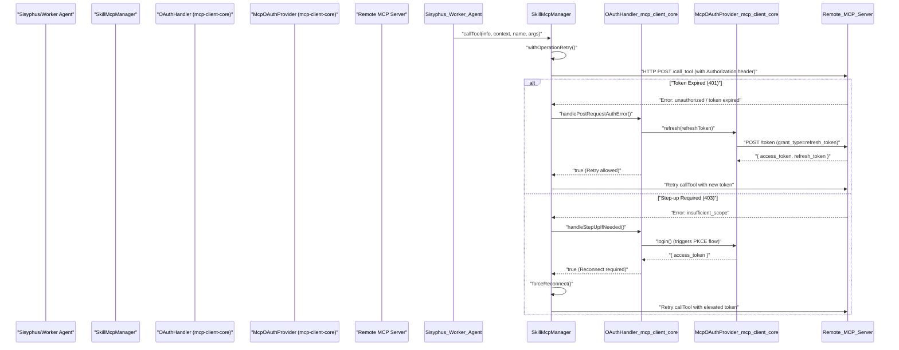
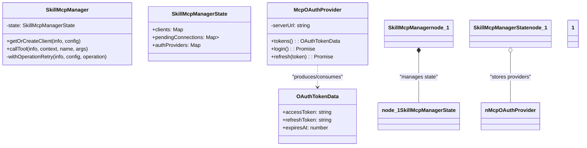

# MCP OAuth Authentication

Relevant source files

The following files were used as context for generating this wiki page:

- [.agents/skills/work-with-pr-workspace/iteration-1/eval-5/with_skill/outputs/execution-plan.md](https://github.com/code-yeongyu/oh-my-openagent/blob/HEAD/.agents/skills/work-with-pr-workspace/iteration-1/eval-5/with_skill/outputs/execution-plan.md)
- [.omo/evidence/20260809-omo-agent-toolkit-rename/task-5.txt](https://github.com/code-yeongyu/oh-my-openagent/blob/HEAD/.omo/evidence/20260809-omo-agent-toolkit-rename/task-5.txt)
- [.opencode/skills/work-with-pr-workspace/iteration-1/eval-5/with_skill/outputs/execution-plan.md](https://github.com/code-yeongyu/oh-my-openagent/blob/HEAD/.opencode/skills/work-with-pr-workspace/iteration-1/eval-5/with_skill/outputs/execution-plan.md)
- [CHANGELOG.md](https://github.com/code-yeongyu/oh-my-openagent/blob/HEAD/CHANGELOG.md)
- [README.ja.md](https://github.com/code-yeongyu/oh-my-openagent/blob/HEAD/README.ja.md)
- [README.ko.md](https://github.com/code-yeongyu/oh-my-openagent/blob/HEAD/README.ko.md)
- [README.md](https://github.com/code-yeongyu/oh-my-openagent/blob/HEAD/README.md)
- [README.ru.md](https://github.com/code-yeongyu/oh-my-openagent/blob/HEAD/README.ru.md)
- [README.zh-cn.md](https://github.com/code-yeongyu/oh-my-openagent/blob/HEAD/README.zh-cn.md)
- [assets/oh-my-opencode.schema.json](https://github.com/code-yeongyu/oh-my-openagent/blob/HEAD/assets/oh-my-opencode.schema.json)
- [docs/examples/coding-focused.jsonc](https://github.com/code-yeongyu/oh-my-openagent/blob/HEAD/docs/examples/coding-focused.jsonc)
- [docs/examples/default.jsonc](https://github.com/code-yeongyu/oh-my-openagent/blob/HEAD/docs/examples/default.jsonc)
- [docs/examples/planning-focused.jsonc](https://github.com/code-yeongyu/oh-my-openagent/blob/HEAD/docs/examples/planning-focused.jsonc)
- [docs/guide/agent-model-matching.md](https://github.com/code-yeongyu/oh-my-openagent/blob/HEAD/docs/guide/agent-model-matching.md)
- [docs/guide/installation.md](https://github.com/code-yeongyu/oh-my-openagent/blob/HEAD/docs/guide/installation.md)
- [docs/guide/orchestration.md](https://github.com/code-yeongyu/oh-my-openagent/blob/HEAD/docs/guide/orchestration.md)
- [docs/guide/overview.md](https://github.com/code-yeongyu/oh-my-openagent/blob/HEAD/docs/guide/overview.md)
- [docs/guide/team-mode.md](https://github.com/code-yeongyu/oh-my-openagent/blob/HEAD/docs/guide/team-mode.md)
- [docs/reference/cli.md](https://github.com/code-yeongyu/oh-my-openagent/blob/HEAD/docs/reference/cli.md)
- [docs/reference/codex-telemetry.md](https://github.com/code-yeongyu/oh-my-openagent/blob/HEAD/docs/reference/codex-telemetry.md)
- [docs/reference/configuration.md](https://github.com/code-yeongyu/oh-my-openagent/blob/HEAD/docs/reference/configuration.md)
- [docs/reference/features.md](https://github.com/code-yeongyu/oh-my-openagent/blob/HEAD/docs/reference/features.md)
- [docs/reference/known-issues.md](https://github.com/code-yeongyu/oh-my-openagent/blob/HEAD/docs/reference/known-issues.md)
- [docs/reference/prompt-async-gate-rfc.md](https://github.com/code-yeongyu/oh-my-openagent/blob/HEAD/docs/reference/prompt-async-gate-rfc.md)
- [docs/reference/rules-injection-cross-module-comparison.md](https://github.com/code-yeongyu/oh-my-openagent/blob/HEAD/docs/reference/rules-injection-cross-module-comparison.md)
- [packages/omo-codex/README.md](https://github.com/code-yeongyu/oh-my-openagent/blob/HEAD/packages/omo-codex/README.md)
- [packages/omo-codex/plugin/README.md](https://github.com/code-yeongyu/oh-my-openagent/blob/HEAD/packages/omo-codex/plugin/README.md)
- [packages/omo-codex/tsconfig.json](https://github.com/code-yeongyu/oh-my-openagent/blob/HEAD/packages/omo-codex/tsconfig.json)
- [packages/omo-config-core/src/index.ts](https://github.com/code-yeongyu/oh-my-openagent/blob/HEAD/packages/omo-config-core/src/index.ts)
- [packages/omo-config-core/src/internal/index.ts](https://github.com/code-yeongyu/oh-my-openagent/blob/HEAD/packages/omo-config-core/src/internal/index.ts)
- [packages/omo-config-core/src/internal/jsonc-parse.ts](https://github.com/code-yeongyu/oh-my-openagent/blob/HEAD/packages/omo-config-core/src/internal/jsonc-parse.ts)
- [packages/omo-config-core/src/internal/plain-object.ts](https://github.com/code-yeongyu/oh-my-openagent/blob/HEAD/packages/omo-config-core/src/internal/plain-object.ts)
- [packages/omo-config-core/src/internal/posix-path.ts](https://github.com/code-yeongyu/oh-my-openagent/blob/HEAD/packages/omo-config-core/src/internal/posix-path.ts)
- [packages/omo-config-core/src/loader/legacy-user-config-purge.test.ts](https://github.com/code-yeongyu/oh-my-openagent/blob/HEAD/packages/omo-config-core/src/loader/legacy-user-config-purge.test.ts)
- [packages/omo-config-core/src/loader/loader.test.ts](https://github.com/code-yeongyu/oh-my-openagent/blob/HEAD/packages/omo-config-core/src/loader/loader.test.ts)
- [packages/omo-config-core/src/loader/paths.test.ts](https://github.com/code-yeongyu/oh-my-openagent/blob/HEAD/packages/omo-config-core/src/loader/paths.test.ts)
- [packages/omo-config-core/src/loader/paths.ts](https://github.com/code-yeongyu/oh-my-openagent/blob/HEAD/packages/omo-config-core/src/loader/paths.ts)
- [packages/omo-config-core/src/loader/project-config-path-discovery.test.ts](https://github.com/code-yeongyu/oh-my-openagent/blob/HEAD/packages/omo-config-core/src/loader/project-config-path-discovery.test.ts)
- [packages/omo-config-core/src/loader/resolution.test.ts](https://github.com/code-yeongyu/oh-my-openagent/blob/HEAD/packages/omo-config-core/src/loader/resolution.test.ts)
- [packages/omo-config-core/src/loader/types.ts](https://github.com/code-yeongyu/oh-my-openagent/blob/HEAD/packages/omo-config-core/src/loader/types.ts)
- [packages/omo-config-core/src/migration/backup-move.ts](https://github.com/code-yeongyu/oh-my-openagent/blob/HEAD/packages/omo-config-core/src/migration/backup-move.ts)
- [packages/omo-config-core/src/migration/batch.test.ts](https://github.com/code-yeongyu/oh-my-openagent/blob/HEAD/packages/omo-config-core/src/migration/batch.test.ts)
- [packages/omo-config-core/src/migration/batch.ts](https://github.com/code-yeongyu/oh-my-openagent/blob/HEAD/packages/omo-config-core/src/migration/batch.ts)
- [packages/omo-config-core/src/migration/commit.ts](https://github.com/code-yeongyu/oh-my-openagent/blob/HEAD/packages/omo-config-core/src/migration/commit.ts)
- [packages/omo-config-core/src/migration/engine.ts](https://github.com/code-yeongyu/oh-my-openagent/blob/HEAD/packages/omo-config-core/src/migration/engine.ts)
- [packages/omo-config-core/src/migration/journal.ts](https://github.com/code-yeongyu/oh-my-openagent/blob/HEAD/packages/omo-config-core/src/migration/journal.ts)
- [packages/omo-config-core/src/migration/lock.test.ts](https://github.com/code-yeongyu/oh-my-openagent/blob/HEAD/packages/omo-config-core/src/migration/lock.test.ts)
- [packages/omo-config-core/src/migration/lock.ts](https://github.com/code-yeongyu/oh-my-openagent/blob/HEAD/packages/omo-config-core/src/migration/lock.ts)
- [packages/omo-config-core/src/migration/merge-commit.test.ts](https://github.com/code-yeongyu/oh-my-openagent/blob/HEAD/packages/omo-config-core/src/migration/merge-commit.test.ts)
- [packages/omo-config-core/src/migration/merge.ts](https://github.com/code-yeongyu/oh-my-openagent/blob/HEAD/packages/omo-config-core/src/migration/merge.ts)
- [packages/omo-config-core/src/migration/migration-test-support.ts](https://github.com/code-yeongyu/oh-my-openagent/blob/HEAD/packages/omo-config-core/src/migration/migration-test-support.ts)
- [packages/omo-config-core/src/migration/predicate.test.ts](https://github.com/code-yeongyu/oh-my-openagent/blob/HEAD/packages/omo-config-core/src/migration/predicate.test.ts)
- [packages/omo-config-core/src/migration/predicate.ts](https://github.com/code-yeongyu/oh-my-openagent/blob/HEAD/packages/omo-config-core/src/migration/predicate.ts)
- [packages/omo-config-core/src/migration/recovery.test.ts](https://github.com/code-yeongyu/oh-my-openagent/blob/HEAD/packages/omo-config-core/src/migration/recovery.test.ts)
- [packages/omo-config-core/src/migration/recovery.ts](https://github.com/code-yeongyu/oh-my-openagent/blob/HEAD/packages/omo-config-core/src/migration/recovery.ts)
- [packages/omo-config-core/src/migration/transaction.test.ts](https://github.com/code-yeongyu/oh-my-openagent/blob/HEAD/packages/omo-config-core/src/migration/transaction.test.ts)
- [packages/omo-config-core/src/migration/types.ts](https://github.com/code-yeongyu/oh-my-openagent/blob/HEAD/packages/omo-config-core/src/migration/types.ts)
- [packages/omo-config-core/src/models/index.ts](https://github.com/code-yeongyu/oh-my-openagent/blob/HEAD/packages/omo-config-core/src/models/index.ts)
- [packages/omo-config-core/src/models/model-catalog-cycles.ts](https://github.com/code-yeongyu/oh-my-openagent/blob/HEAD/packages/omo-config-core/src/models/model-catalog-cycles.ts)
- [packages/omo-config-core/src/models/model-reference-resolution.test.ts](https://github.com/code-yeongyu/oh-my-openagent/blob/HEAD/packages/omo-config-core/src/models/model-reference-resolution.test.ts)
- [packages/omo-config-core/src/models/model-reference-resolution.ts](https://github.com/code-yeongyu/oh-my-openagent/blob/HEAD/packages/omo-config-core/src/models/model-reference-resolution.ts)
- [packages/omo-config-core/src/writer/types.ts](https://github.com/code-yeongyu/oh-my-openagent/blob/HEAD/packages/omo-config-core/src/writer/types.ts)
- [packages/omo-config-core/src/writer/writer-security.test.ts](https://github.com/code-yeongyu/oh-my-openagent/blob/HEAD/packages/omo-config-core/src/writer/writer-security.test.ts)
- [packages/omo-config-core/src/writer/writer.test.ts](https://github.com/code-yeongyu/oh-my-openagent/blob/HEAD/packages/omo-config-core/src/writer/writer.test.ts)
- [packages/omo-config-core/src/writer/writer.ts](https://github.com/code-yeongyu/oh-my-openagent/blob/HEAD/packages/omo-config-core/src/writer/writer.ts)
- [packages/omo-opencode/src/shared/markdown-link-audit.test.ts](https://github.com/code-yeongyu/oh-my-openagent/blob/HEAD/packages/omo-opencode/src/shared/markdown-link-audit.test.ts)
- [packages/omo-opencode/src/startup-migration.test.ts](https://github.com/code-yeongyu/oh-my-openagent/blob/HEAD/packages/omo-opencode/src/startup-migration.test.ts)
- [postinstall.test.ts](https://github.com/code-yeongyu/oh-my-openagent/blob/HEAD/postinstall.test.ts)

The `oh-my-openagent` system provides a robust implementation for handling authenticated Model Context Protocol (MCP) servers. This implementation supports **OAuth 2.0** with **Proof Key for Code Exchange (PKCE)** and **Dynamic Client Registration (DCR)**, ensuring secure authorization flows for third-party MCP tools and services within the agentic ecosystem.

## Overview and Purpose

Authenticated MCP servers require a standardized way to handle user authorization without exposing long-lived credentials to the agent. The system implements a flow that allows users to authenticate against MCP servers, manage tokens locally, and perform "step-up" authentication when higher privilege levels are required by a specific tool or resource. Following the package layering refactor, these primitives are housed in the `mcp-client-core` package.

### Key Components
- **SkillMcpManager**: An OpenCode adapter that orchestrates connections and manages the lifecycle of MCP clients, including OAuth-enabled ones.
- **McpOAuthProvider**: Implements the PKCE flow, token refreshing, and storage logic, provided by `mcp-client-core`.
- **PKCE Flow**: Secure authorization without a client secret, using a code verifier and challenge to mitigate interception attacks.
- **DCR**: Automatic registration of the client with the MCP server using discovery metadata (RFC 7591).
- **OAuthHandler**: Intercepts MCP errors (like 401 Unauthorized) to trigger refresh or step-up flows.

Sources: [docs/reference/configuration.md:29-31](https://github.com/code-yeongyu/oh-my-openagent/blob/HEAD/docs/reference/configuration.md#L29-L31), [assets/oh-my-opencode.schema.json:32-38](https://github.com/code-yeongyu/oh-my-openagent/blob/HEAD/assets/oh-my-opencode.schema.json#L32-L38)

## Authentication Data Flow

The following diagram illustrates the interaction between the `SkillMcpManager`, the `McpOAuthProvider`, and the remote MCP server during an authenticated request.

### OAuth Request and Error Handling (Code Entity Space)

Sources: [docs/guide/orchestration.md:67-71](https://github.com/code-yeongyu/oh-my-openagent/blob/HEAD/docs/guide/orchestration.md#L67-L71), [docs/reference/configuration.md:29-31](https://github.com/code-yeongyu/oh-my-openagent/blob/HEAD/docs/reference/configuration.md#L29-L31)

## Implementation Details

### PKCE and Dynamic Client Registration
To support various MCP server implementations without hardcoding secrets, the system utilizes **Dynamic Client Registration (DCR)** (RFC 7591). Upon the first login attempt to a new server, the agent registers itself to obtain a `client_id`.

The **PKCE (Proof Key for Code Exchange)** extension is used to mitigate authorization code injection attacks. This is critical as the CLI operates in a public client environment where client secrets cannot be securely stored. The system generates a `code_verifier` and a corresponding `code_challenge` using SHA256.

### Connection Management
The `SkillMcpManager` maintains a state of active connections and prevents race conditions during setup. It distinguishes between local `stdio` and remote `http` (SSE) connections. The system allows disabling specific MCPs via the `disabled_mcps` array in the configuration [assets/oh-my-opencode.schema.json:32-38](https://github.com/code-yeongyu/oh-my-openagent/blob/HEAD/assets/oh-my-opencode.schema.json#L32-L38).

### Token Management and Storage
Tokens are persisted locally to avoid frequent re-authentication. 

- **Token Refresh**: The system automatically attempts to use the `refresh_token` if a request fails with an authentication error.
- **Security**: Sensitive data like Authorization headers and API keys are redacted in logs and error messages to prevent leakage.
- **Environment Allowlist**: For security, `mcp_env_allowlist` is restricted to user-only configuration (e.g., `~/.omo/omo.jsonc`) and cannot be extended by project-level walked configs [docs/reference/configuration.md:78-81](https://github.com/code-yeongyu/oh-my-openagent/blob/HEAD/docs/reference/configuration.md#L78-L81), [assets/oh-my-opencode.schema.json:83-88](https://github.com/code-yeongyu/oh-my-openagent/blob/HEAD/assets/oh-my-opencode.schema.json#L83-L88).

Sources: [docs/reference/configuration.md:78-81](https://github.com/code-yeongyu/oh-my-openagent/blob/HEAD/docs/reference/configuration.md#L78-L81), [assets/oh-my-opencode.schema.json:32-38](https://github.com/code-yeongyu/oh-my-openagent/blob/HEAD/assets/oh-my-opencode.schema.json#L32-L38), [assets/oh-my-opencode.schema.json:83-88](https://github.com/code-yeongyu/oh-my-openagent/blob/HEAD/assets/oh-my-opencode.schema.json#L83-L88)

## Step-up Authentication and Retries

Certain MCP tools may require "Step-up Authentication" if a specific action requires a higher scope than what was initially granted. 
1. The MCP server returns an error indicating insufficient scope or a specific "step-up" requirement.
2. `withOperationRetry` catches the error and calls `handleStepUpIfNeeded`.
3. The `McpOAuthProvider` initiates a new login flow with the expanded scopes.
4. Upon success, the manager forces a reconnection to the server to apply the new credentials.

### Connection State Class Diagram (Code Entity Space)

Sources: [docs/reference/configuration.md:29-31](https://github.com/code-yeongyu/oh-my-openagent/blob/HEAD/docs/reference/configuration.md#L29-L31), [docs/guide/orchestration.md:67-71](https://github.com/code-yeongyu/oh-my-openagent/blob/HEAD/docs/guide/orchestration.md#L67-L71)

## CLI Commands for MCP OAuth

The system provides CLI utilities for managing these authenticated sessions. The CLI binary and runtime recognize both legacy and new names [docs/guide/installation.md:16](https://github.com/code-yeongyu/oh-my-openagent/blob/HEAD/docs/guide/installation.md#L16).

| Command | Action | Implementation Detail |
| :--- | :--- | :--- |
| `mcp oauth login` | Initiates PKCE flow | Triggers the `login()` sequence for a specific MCP server |
| `mcp oauth logout` | Clears local tokens | Removes stored credentials and disconnects active sessions |
| `mcp oauth status` | Checks token validity | Reports connection status and expiration info for registered servers |

Sources: [docs/guide/installation.md:16](https://github.com/code-yeongyu/oh-my-openagent/blob/HEAD/docs/guide/installation.md#L16), [docs/reference/configuration.md:92](https://github.com/code-yeongyu/oh-my-openagent/blob/HEAD/docs/reference/configuration.md#L92)