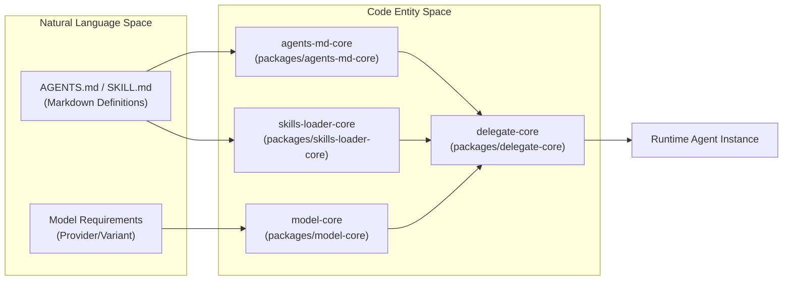
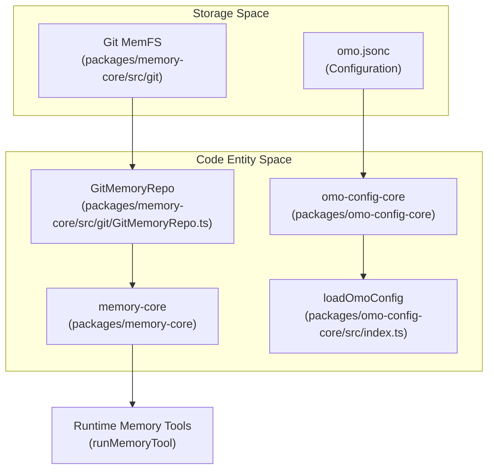

# Development Guide

<details>
<summary>Relevant source files</summary>

The following files were used as context for generating this wiki page:

- [.agents/skills/codex-qa/references/docker-qa.md](https://github.com/code-yeongyu/oh-my-openagent/blob/HEAD/.agents/skills/codex-qa/references/docker-qa.md)
- [.agents/skills/opencode-qa/references/docker-qa.md](https://github.com/code-yeongyu/oh-my-openagent/blob/HEAD/.agents/skills/opencode-qa/references/docker-qa.md)
- [.claude/settings.json](https://github.com/code-yeongyu/oh-my-openagent/blob/HEAD/.claude/settings.json)
- [.codex/setup.sh](https://github.com/code-yeongyu/oh-my-openagent/blob/HEAD/.codex/setup.sh)
- [.cursor/environment.json](https://github.com/code-yeongyu/oh-my-openagent/blob/HEAD/.cursor/environment.json)
- [.devcontainer/Dockerfile](https://github.com/code-yeongyu/oh-my-openagent/blob/HEAD/.devcontainer/Dockerfile)
- [.devcontainer/README.md](https://github.com/code-yeongyu/oh-my-openagent/blob/HEAD/.devcontainer/README.md)
- [.devcontainer/devcontainer.json](https://github.com/code-yeongyu/oh-my-openagent/blob/HEAD/.devcontainer/devcontainer.json)
- [.devcontainer/qa-entrypoint.sh](https://github.com/code-yeongyu/oh-my-openagent/blob/HEAD/.devcontainer/qa-entrypoint.sh)
- [.devcontainer/qa.Dockerfile](https://github.com/code-yeongyu/oh-my-openagent/blob/HEAD/.devcontainer/qa.Dockerfile)
- [.env.example](https://github.com/code-yeongyu/oh-my-openagent/blob/HEAD/.env.example)
- [.omo/evidence/20260812-init-deep/hierarchy-green.txt](https://github.com/code-yeongyu/oh-my-openagent/blob/HEAD/.omo/evidence/20260812-init-deep/hierarchy-green.txt)
- [.omo/evidence/20260812-init-deep/hierarchy-red.txt](https://github.com/code-yeongyu/oh-my-openagent/blob/HEAD/.omo/evidence/20260812-init-deep/hierarchy-red.txt)
- [.omo/evidence/20260812-init-deep/manual-review.md](https://github.com/code-yeongyu/oh-my-openagent/blob/HEAD/.omo/evidence/20260812-init-deep/manual-review.md)
- [.omo/evidence/20260812-init-deep/qa-summary.md](https://github.com/code-yeongyu/oh-my-openagent/blob/HEAD/.omo/evidence/20260812-init-deep/qa-summary.md)
- [.omo/evidence/20260812-init-deep/scoring.md](https://github.com/code-yeongyu/oh-my-openagent/blob/HEAD/.omo/evidence/20260812-init-deep/scoring.md)
- [.omo/evidence/20260812-init-deep/validation-green.txt](https://github.com/code-yeongyu/oh-my-openagent/blob/HEAD/.omo/evidence/20260812-init-deep/validation-green.txt)
- [.omo/evidence/20260812-init-deep/validation-red.txt](https://github.com/code-yeongyu/oh-my-openagent/blob/HEAD/.omo/evidence/20260812-init-deep/validation-red.txt)
- [AGENTS.md](https://github.com/code-yeongyu/oh-my-openagent/blob/HEAD/AGENTS.md)
- [CLAUDE.md](https://github.com/code-yeongyu/oh-my-openagent/blob/HEAD/CLAUDE.md)
- [CONTRIBUTING.md](https://github.com/code-yeongyu/oh-my-openagent/blob/HEAD/CONTRIBUTING.md)
- [packages/AGENTS.md](https://github.com/code-yeongyu/oh-my-openagent/blob/HEAD/packages/AGENTS.md)
- [packages/memory-core/AGENTS.md](https://github.com/code-yeongyu/oh-my-openagent/blob/HEAD/packages/memory-core/AGENTS.md)
- [script/agent-cleanup-hook.test.ts](https://github.com/code-yeongyu/oh-my-openagent/blob/HEAD/script/agent-cleanup-hook.test.ts)
- [script/agent-env.test.ts](https://github.com/code-yeongyu/oh-my-openagent/blob/HEAD/script/agent-env.test.ts)
- [script/agent-harness-wiring.test.ts](https://github.com/code-yeongyu/oh-my-openagent/blob/HEAD/script/agent-harness-wiring.test.ts)
- [script/agent/cleanup-hook.sh](https://github.com/code-yeongyu/oh-my-openagent/blob/HEAD/script/agent/cleanup-hook.sh)
- [script/agent/cleanup.sh](https://github.com/code-yeongyu/oh-my-openagent/blob/HEAD/script/agent/cleanup.sh)
- [script/agent/docker-dev.sh](https://github.com/code-yeongyu/oh-my-openagent/blob/HEAD/script/agent/docker-dev.sh)
- [script/agent/qa-docker.sh](https://github.com/code-yeongyu/oh-my-openagent/blob/HEAD/script/agent/qa-docker.sh)
- [script/agent/qa-sandbox.sh](https://github.com/code-yeongyu/oh-my-openagent/blob/HEAD/script/agent/qa-sandbox.sh)
- [script/agent/setup.sh](https://github.com/code-yeongyu/oh-my-openagent/blob/HEAD/script/agent/setup.sh)
- [script/agents-md-dev-env.test.ts](https://github.com/code-yeongyu/oh-my-openagent/blob/HEAD/script/agents-md-dev-env.test.ts)

</details>


This page provides a high-level overview of the development workflow, project conventions, and guidelines for contributing to the `oh-my-openagent` codebase. It introduces the core architectural patterns such as the layered monorepo design and explains how the project is organized, built, and tested. For deep technical details and specific workflows, this page links to dedicated child pages.

For more detailed coverage, see the following child pages:
- [Project Structure](45_8.1-project-structure.md) — Directory layout, the 20-package core layer refactor, the `.agents/` vs `.opencode/` migration, and the role of `AGENTS.md` discovery files. [packages/AGENTS.md:15-16](https://github.com/code-yeongyu/oh-my-openagent/blob/HEAD/packages/AGENTS.md#L15-L16), [AGENTS.md:3-3](https://github.com/code-yeongyu/oh-my-openagent/blob/HEAD/AGENTS.md#L3), [AGENTS.md:51-53](https://github.com/code-yeongyu/oh-my-openagent/blob/HEAD/AGENTS.md#L51-L53)
- [Building and Publishing](46_8.2-building-and-publishing.md) — Build pipeline, GitHub Actions workflows, npm publishing, and platform binary distribution. [packages/AGENTS.md:20-26](https://github.com/code-yeongyu/oh-my-openagent/blob/HEAD/packages/AGENTS.md#L20-L26)
- [Testing](47_8.3-testing.md) — Test structure, mock-heavy isolation, integration test locations, running tests with Bun, and QA evidence requirements (`.omo/evidence/`). [AGENTS.md:11-13](https://github.com/code-yeongyu/oh-my-openagent/blob/HEAD/AGENTS.md#L11-L13), [AGENTS.md:29-38](https://github.com/code-yeongyu/oh-my-openagent/blob/HEAD/AGENTS.md#L29-L38)
- [Contributing](48_8.4-contributing.md) — CLA signature process, contribution workflow, and code review expectations. [CONTRIBUTING.md:1-28](https://github.com/code-yeongyu/oh-my-openagent/blob/HEAD/CONTRIBUTING.md#L1-L28), [AGENTS.md:39-57](https://github.com/code-yeongyu/oh-my-openagent/blob/HEAD/AGENTS.md#L39-L57)
- [Marketing Website](49_8.5-marketing-website.md) — Documentation for the Next.js 15 marketing site (`web/`) stack and deployment workflow. [packages/AGENTS.md:18-18](https://github.com/code-yeongyu/oh-my-openagent/blob/HEAD/packages/AGENTS.md#L18)

---

## Development Environment Setup

### Runtime and Tooling
The project uses **Bun** as the primary runtime and package manager, pinned to version **1.3.12** [CONTRIBUTING.md:63-63](https://github.com/code-yeongyu/oh-my-openagent/blob/HEAD/CONTRIBUTING.md#L63). **Node 24** is required for specific vendored packages like `lsp-tools-mcp` and `lsp-daemon` [CONTRIBUTING.md:64-65](https://github.com/code-yeongyu/oh-my-openagent/blob/HEAD/CONTRIBUTING.md#L64-L65).

The single source of truth for setting up a working tree is the `script/agent/setup.sh` bootstrap script [CONTRIBUTING.md:127-127](https://github.com/code-yeongyu/oh-my-openagent/blob/HEAD/CONTRIBUTING.md#L127). It handles tool verification, dependency installation, and submodule initialization for frontend references [script/agent/setup.sh:25-36](https://github.com/code-yeongyu/oh-my-openagent/blob/HEAD/script/agent/setup.sh#L25-L36).

```bash
# Recommended bootstrap
script/agent/setup.sh

# Manual commands
bun install
bun run build
bun test
```

The project supports several containerized and cloud-based development environments, including GitHub Codespaces and VS Code Dev Containers, all of which delegate to the shared setup script [CONTRIBUTING.md:133-142](https://github.com/code-yeongyu/oh-my-openagent/blob/HEAD/CONTRIBUTING.md#L133-L142).

**Sources:** [CONTRIBUTING.md:61-83](https://github.com/code-yeongyu/oh-my-openagent/blob/HEAD/CONTRIBUTING.md#L61-L83), [script/agent/setup.sh:1-78](https://github.com/code-yeongyu/oh-my-openagent/blob/HEAD/script/agent/setup.sh#L1-L78), [script/agent-harness-wiring.test.ts:21-69](https://github.com/code-yeongyu/oh-my-openagent/blob/HEAD/script/agent-harness-wiring.test.ts#L21-L69)

---

## Project Structure Overview

The codebase is a monorepo with 43 sibling packages organized into layered roles following a strict DAG (Directed Acyclic Graph) dependency rule [packages/AGENTS.md:7-15](https://github.com/code-yeongyu/oh-my-openagent/blob/HEAD/packages/AGENTS.md#L7-L15).

### Package Roles

| Role | Count | Description |
| :--- | :--- | :--- |
| **Platform launchers** | 12 | OS/Arch/Variant specific packages selected at install time [packages/AGENTS.md:20-21](https://github.com/code-yeongyu/oh-my-openagent/blob/HEAD/packages/AGENTS.md#L20-L21). |
| **MCP packages** | 4 | stdio MCP servers (LSP, Git-Bash, LSP-Daemon, AST-Grep) [packages/AGENTS.md:27-34](https://github.com/code-yeongyu/oh-my-openagent/blob/HEAD/packages/AGENTS.md#L27-L34). |
| **Core packages** | 20 | Pure TypeScript logic (e.g., `model-core`, `hashline-core`, `rules-engine`, `omo-config-core`, `memory-core`) [packages/AGENTS.md:36-55](https://github.com/code-yeongyu/oh-my-openagent/blob/HEAD/packages/AGENTS.md#L36-L55). |
| **Adapters** | 5 | Harness-specific glue for OpenCode, Codex, and Senpi [packages/AGENTS.md:16-16](https://github.com/code-yeongyu/oh-my-openagent/blob/HEAD/packages/AGENTS.md#L16). |
| **Skills** | 1 | `shared-skills` bundle containing cross-harness markdown prompts and logic [packages/AGENTS.md:17-17](https://github.com/code-yeongyu/oh-my-openagent/blob/HEAD/packages/AGENTS.md#L17). |

**Sources:** [packages/AGENTS.md:1-55](https://github.com/code-yeongyu/oh-my-openagent/blob/HEAD/packages/AGENTS.md#L1-L55)

---

## Factory-Based Architecture

The system uses core packages to bridge natural language instructions and model selection into executable code entities across different harnesses.

### Agent Factory
Agents are orchestrated through a multi-model system where `agents-md-core` handles discovery and `model-core` handles resolution.

**Agent Orchestration Bridge**


**Sources:** [packages/AGENTS.md:35-55](https://github.com/code-yeongyu/oh-my-openagent/blob/HEAD/packages/AGENTS.md#L35-L55), [packages/model-core/AGENTS.md:1-10](https://github.com/code-yeongyu/oh-my-openagent/blob/HEAD/packages/model-core/AGENTS.md#L1-L10)

### Config and Memory Factories
Configuration is managed by `omo-config-core`, which provides a harness-neutral `omo.jsonc` schema and resolution model [packages/omo-config-core/AGENTS.md:1-7](https://github.com/code-yeongyu/oh-my-openagent/blob/HEAD/packages/omo-config-core/AGENTS.md#L1-L7). Agent memory is managed by `memory-core` via a git-backed MemFS [packages/memory-core/AGENTS.md:5-7](https://github.com/code-yeongyu/oh-my-openagent/blob/HEAD/packages/memory-core/AGENTS.md#L5-L7).

**Memory and Config Bridge**


**Sources:** [packages/memory-core/AGENTS.md:1-65](https://github.com/code-yeongyu/oh-my-openagent/blob/HEAD/packages/memory-core/AGENTS.md#L1-L65), [packages/omo-config-core/AGENTS.md:1-51](https://github.com/code-yeongyu/oh-my-openagent/blob/HEAD/packages/omo-config-core/AGENTS.md#L1-L51), [packages/AGENTS.md:43-48](https://github.com/code-yeongyu/oh-my-openagent/blob/HEAD/packages/AGENTS.md#L43-L48)

---

## Build and Release Pipeline

### Build Process
The build produces an ESM-based `dist/index.js` as the main entry for the OpenCode plugin [packages/AGENTS.md:7-7](https://github.com/code-yeongyu/oh-my-openagent/blob/HEAD/packages/AGENTS.md#L7).
- **Vendored Packages:** LSP tools and daemons are Node-targeted and built with `npm` [packages/AGENTS.md:31-33](https://github.com/code-yeongyu/oh-my-openagent/blob/HEAD/packages/AGENTS.md#L31-L33).
- **Platform Binaries:** 12 platform launcher packages are generated and published, targeting specific OS/Arch combinations [packages/AGENTS.md:20-23](https://github.com/code-yeongyu/oh-my-openagent/blob/HEAD/packages/AGENTS.md#L20-L23).

### Release Management
Releases are distributed as `oh-my-opencode` and `lazycodex-ai` npm packages.
- **LazyCodex Sync:** The `omo-codex` plugin bundle is staged as part of the release artifacts [packages/AGENTS.md:7-7](https://github.com/code-yeongyu/oh-my-openagent/blob/HEAD/packages/AGENTS.md#L7).

**Sources:** [packages/AGENTS.md:7-26](https://github.com/code-yeongyu/oh-my-openagent/blob/HEAD/packages/AGENTS.md#L7-L26), [CONTRIBUTING.md:87-95](https://github.com/code-yeongyu/oh-my-openagent/blob/HEAD/CONTRIBUTING.md#L87-L95)

---

## Testing and QA Discipline

### Testing
The codebase uses `bun test` for its primary testing suite [CONTRIBUTING.md:63-63](https://github.com/code-yeongyu/oh-my-openagent/blob/HEAD/CONTRIBUTING.md#L63).
- **Core Suite:** Core packages like `memory-core` maintain high coverage and harness neutrality [packages/memory-core/AGENTS.md:73-82](https://github.com/code-yeongyu/oh-my-openagent/blob/HEAD/packages/memory-core/AGENTS.md#L73-L82).
- **Environment Tests:** Scripts verify dev-environment integrity and cross-harness wiring [script/agent-env.test.ts:8-37](https://github.com/code-yeongyu/oh-my-openagent/blob/HEAD/script/agent-env.test.ts#L8-L37), [script/agent-harness-wiring.test.ts:21-69](https://github.com/code-yeongyu/oh-my-openagent/blob/HEAD/script/agent-harness-wiring.test.ts#L21-L69).

### QA Mandate
**QA is mandatory and non-negotiable.** Every change to OpenCode or Codex components requires recorded evidence [AGENTS.md:7-13](https://github.com/code-yeongyu/oh-my-openagent/blob/HEAD/AGENTS.md#L7-L13).
- **Isolation:** QA must run in isolated XDG sandboxes using `script/agent/qa-sandbox.sh` to avoid polluting real user data [CONTRIBUTING.md:154-160](https://github.com/code-yeongyu/oh-my-openagent/blob/HEAD/CONTRIBUTING.md#L154-L160), [AGENTS.md:18-18](https://github.com/code-yeongyu/oh-my-openagent/blob/HEAD/AGENTS.md#L18).
- **Evidence:** All artifacts must be stored in `.omo/evidence/` or the commit is disallowed [AGENTS.md:29-38](https://github.com/code-yeongyu/oh-my-openagent/blob/HEAD/AGENTS.md#L29-L38).

**Sources:** [AGENTS.md:7-38](https://github.com/code-yeongyu/oh-my-openagent/blob/HEAD/AGENTS.md#L7-L38), [CONTRIBUTING.md:154-160](https://github.com/code-yeongyu/oh-my-openagent/blob/HEAD/CONTRIBUTING.md#L154-L160), [script/agent/qa-sandbox.sh:1-56](https://github.com/code-yeongyu/oh-my-openagent/blob/HEAD/script/agent/qa-sandbox.sh#L1-L56)

---

## Contributing Guidelines

1. **Language:** English is the primary language for all communications [CONTRIBUTING.md:34-36](https://github.com/code-yeongyu/oh-my-openagent/blob/HEAD/CONTRIBUTING.md#L34-L36).
2. **Workflow:** Use isolated git worktrees for all implementation tasks [AGENTS.md:46-46](https://github.com/code-yeongyu/oh-my-openagent/blob/HEAD/AGENTS.md#L46).
3. **PR Process:** Open a reviewer-readable PR and fix CI before merging [AGENTS.md:47-47](https://github.com/code-yeongyu/oh-my-openagent/blob/HEAD/AGENTS.md#L47).
4. **Merge Policy:** Land PRs with merge commits; never squash-merge or rebase-merge to preserve history [AGENTS.md:57-57](https://github.com/code-yeongyu/oh-my-openagent/blob/HEAD/AGENTS.md#L57).

**Sources:** [CONTRIBUTING.md:1-59](https://github.com/code-yeongyu/oh-my-openagent/blob/HEAD/CONTRIBUTING.md#L1-L59), [AGENTS.md:39-57](https://github.com/code-yeongyu/oh-my-openagent/blob/HEAD/AGENTS.md#L39-L57)43:T3a6c,#