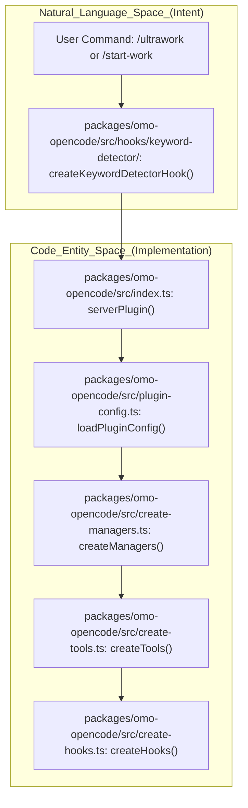
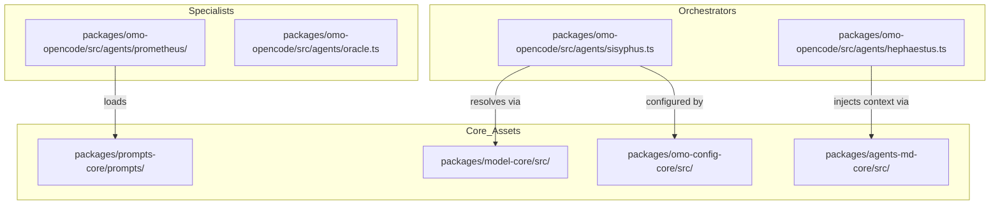
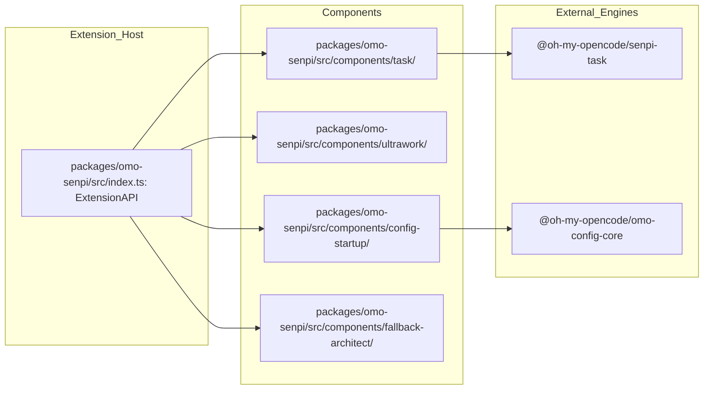

# Project Structure

<details>
<summary>Relevant source files</summary>

The following files were used as context for generating this wiki page:

- [.agents/skills/codex-qa/references/docker-qa.md](https://github.com/code-yeongyu/oh-my-openagent/blob/HEAD/.agents/skills/codex-qa/references/docker-qa.md)
- [.agents/skills/opencode-qa/references/docker-qa.md](https://github.com/code-yeongyu/oh-my-openagent/blob/HEAD/.agents/skills/opencode-qa/references/docker-qa.md)
- [.claude/settings.json](https://github.com/code-yeongyu/oh-my-openagent/blob/HEAD/.claude/settings.json)
- [.codex/setup.sh](https://github.com/code-yeongyu/oh-my-openagent/blob/HEAD/.codex/setup.sh)
- [.cursor/environment.json](https://github.com/code-yeongyu/oh-my-openagent/blob/HEAD/.cursor/environment.json)
- [.devcontainer/Dockerfile](https://github.com/code-yeongyu/oh-my-openagent/blob/HEAD/.devcontainer/Dockerfile)
- [.devcontainer/README.md](https://github.com/code-yeongyu/oh-my-openagent/blob/HEAD/.devcontainer/README.md)
- [.devcontainer/devcontainer.json](https://github.com/code-yeongyu/oh-my-openagent/blob/HEAD/.devcontainer/devcontainer.json)
- [.devcontainer/qa-entrypoint.sh](https://github.com/code-yeongyu/oh-my-openagent/blob/HEAD/.devcontainer/qa-entrypoint.sh)
- [.devcontainer/qa.Dockerfile](https://github.com/code-yeongyu/oh-my-openagent/blob/HEAD/.devcontainer/qa.Dockerfile)
- [.env.example](https://github.com/code-yeongyu/oh-my-openagent/blob/HEAD/.env.example)
- [.omo/evidence/20260727-codegraph-1.5.0-bump/README.md](https://github.com/code-yeongyu/oh-my-openagent/blob/HEAD/.omo/evidence/20260727-codegraph-1.5.0-bump/README.md)
- [.omo/evidence/20260809-omo-ai-beta-release/task-1.txt](https://github.com/code-yeongyu/oh-my-openagent/blob/HEAD/.omo/evidence/20260809-omo-ai-beta-release/task-1.txt)
- [.omo/evidence/20260809-omo-ai-beta-release/task-5.txt](https://github.com/code-yeongyu/oh-my-openagent/blob/HEAD/.omo/evidence/20260809-omo-ai-beta-release/task-5.txt)
- [.omo/evidence/20260812-init-deep/hierarchy-green.txt](https://github.com/code-yeongyu/oh-my-openagent/blob/HEAD/.omo/evidence/20260812-init-deep/hierarchy-green.txt)
- [.omo/evidence/20260812-init-deep/hierarchy-red.txt](https://github.com/code-yeongyu/oh-my-openagent/blob/HEAD/.omo/evidence/20260812-init-deep/hierarchy-red.txt)
- [.omo/evidence/20260812-init-deep/manual-review.md](https://github.com/code-yeongyu/oh-my-openagent/blob/HEAD/.omo/evidence/20260812-init-deep/manual-review.md)
- [.omo/evidence/20260812-init-deep/qa-summary.md](https://github.com/code-yeongyu/oh-my-openagent/blob/HEAD/.omo/evidence/20260812-init-deep/qa-summary.md)
- [.omo/evidence/20260812-init-deep/scoring.md](https://github.com/code-yeongyu/oh-my-openagent/blob/HEAD/.omo/evidence/20260812-init-deep/scoring.md)
- [.omo/evidence/20260812-init-deep/validation-green.txt](https://github.com/code-yeongyu/oh-my-openagent/blob/HEAD/.omo/evidence/20260812-init-deep/validation-green.txt)
- [.omo/evidence/20260812-init-deep/validation-red.txt](https://github.com/code-yeongyu/oh-my-openagent/blob/HEAD/.omo/evidence/20260812-init-deep/validation-red.txt)
- [AGENTS.md](https://github.com/code-yeongyu/oh-my-openagent/blob/HEAD/AGENTS.md)
- [CLAUDE.md](https://github.com/code-yeongyu/oh-my-openagent/blob/HEAD/CLAUDE.md)
- [CONTRIBUTING.md](https://github.com/code-yeongyu/oh-my-openagent/blob/HEAD/CONTRIBUTING.md)
- [THIRD-PARTY-NOTICES.md](https://github.com/code-yeongyu/oh-my-openagent/blob/HEAD/THIRD-PARTY-NOTICES.md)
- [docs/reference/omo-ai-publishing.md](https://github.com/code-yeongyu/oh-my-openagent/blob/HEAD/docs/reference/omo-ai-publishing.md)
- [docs/reference/re-export-shim-inventory.md](https://github.com/code-yeongyu/oh-my-openagent/blob/HEAD/docs/reference/re-export-shim-inventory.md)
- [docs/reference/release-process.md](https://github.com/code-yeongyu/oh-my-openagent/blob/HEAD/docs/reference/release-process.md)
- [docs/reference/shared-core-multi-pr.md](https://github.com/code-yeongyu/oh-my-openagent/blob/HEAD/docs/reference/shared-core-multi-pr.md)
- [packages/AGENTS.md](https://github.com/code-yeongyu/oh-my-openagent/blob/HEAD/packages/AGENTS.md)
- [packages/memory-core/AGENTS.md](https://github.com/code-yeongyu/oh-my-openagent/blob/HEAD/packages/memory-core/AGENTS.md)
- [packages/omo-codex/THIRD-PARTY-NOTICES.md](https://github.com/code-yeongyu/oh-my-openagent/blob/HEAD/packages/omo-codex/THIRD-PARTY-NOTICES.md)
- [packages/omo-codex/plugin/components/codegraph/NODE-RUNTIME-LICENSES.md](https://github.com/code-yeongyu/oh-my-openagent/blob/HEAD/packages/omo-codex/plugin/components/codegraph/NODE-RUNTIME-LICENSES.md)
- [packages/omo-codex/plugin/components/codegraph/NOTICE](https://github.com/code-yeongyu/oh-my-openagent/blob/HEAD/packages/omo-codex/plugin/components/codegraph/NOTICE)
- [packages/omo-codex/plugin/components/codegraph/test/package-runtime.test.ts](https://github.com/code-yeongyu/oh-my-openagent/blob/HEAD/packages/omo-codex/plugin/components/codegraph/test/package-runtime.test.ts)
- [packages/omo-codex/plugin/components/codegraph/test/session-start-trust-boundary.test.ts](https://github.com/code-yeongyu/oh-my-openagent/blob/HEAD/packages/omo-codex/plugin/components/codegraph/test/session-start-trust-boundary.test.ts)
- [packages/omo-codex/plugin/components/start-work-continuation/.npmignore](https://github.com/code-yeongyu/oh-my-openagent/blob/HEAD/packages/omo-codex/plugin/components/start-work-continuation/.npmignore)
- [packages/omo-codex/plugin/components/telemetry/LICENSE](https://github.com/code-yeongyu/oh-my-openagent/blob/HEAD/packages/omo-codex/plugin/components/telemetry/LICENSE)
- [packages/omo-codex/plugin/components/telemetry/NOTICE](https://github.com/code-yeongyu/oh-my-openagent/blob/HEAD/packages/omo-codex/plugin/components/telemetry/NOTICE)
- [packages/omo-codex/plugin/components/ulw-loop/.npmignore](https://github.com/code-yeongyu/oh-my-openagent/blob/HEAD/packages/omo-codex/plugin/components/ulw-loop/.npmignore)
- [packages/omo-codex/plugin/shared/src/config-loader.ts](https://github.com/code-yeongyu/oh-my-openagent/blob/HEAD/packages/omo-codex/plugin/shared/src/config-loader.ts)
- [packages/omo-native/AGENTS.md](https://github.com/code-yeongyu/oh-my-openagent/blob/HEAD/packages/omo-native/AGENTS.md)
- [packages/omo-native/tsconfig.json](https://github.com/code-yeongyu/oh-my-openagent/blob/HEAD/packages/omo-native/tsconfig.json)
- [packages/omo-opencode/src/shared-skills-package.test.ts](https://github.com/code-yeongyu/oh-my-openagent/blob/HEAD/packages/omo-opencode/src/shared-skills-package.test.ts)
- [script/agent-cleanup-hook.test.ts](https://github.com/code-yeongyu/oh-my-openagent/blob/HEAD/script/agent-cleanup-hook.test.ts)
- [script/agent-env.test.ts](https://github.com/code-yeongyu/oh-my-openagent/blob/HEAD/script/agent-env.test.ts)
- [script/agent-harness-wiring.test.ts](https://github.com/code-yeongyu/oh-my-openagent/blob/HEAD/script/agent-harness-wiring.test.ts)
- [script/agent/cleanup-hook.sh](https://github.com/code-yeongyu/oh-my-openagent/blob/HEAD/script/agent/cleanup-hook.sh)
- [script/agent/cleanup.sh](https://github.com/code-yeongyu/oh-my-openagent/blob/HEAD/script/agent/cleanup.sh)
- [script/agent/docker-dev.sh](https://github.com/code-yeongyu/oh-my-openagent/blob/HEAD/script/agent/docker-dev.sh)
- [script/agent/qa-docker.sh](https://github.com/code-yeongyu/oh-my-openagent/blob/HEAD/script/agent/qa-docker.sh)
- [script/agent/qa-sandbox.sh](https://github.com/code-yeongyu/oh-my-openagent/blob/HEAD/script/agent/qa-sandbox.sh)
- [script/agent/setup.sh](https://github.com/code-yeongyu/oh-my-openagent/blob/HEAD/script/agent/setup.sh)
- [script/agents-md-dev-env.test.ts](https://github.com/code-yeongyu/oh-my-openagent/blob/HEAD/script/agents-md-dev-env.test.ts)
- [script/package-registration-audit.test.ts](https://github.com/code-yeongyu/oh-my-openagent/blob/HEAD/script/package-registration-audit.test.ts)
- [script/shared-core-extraction-guard.test.ts](https://github.com/code-yeongyu/oh-my-openagent/blob/HEAD/script/shared-core-extraction-guard.test.ts)
- [scripts/check-third-party-notices.mjs](https://github.com/code-yeongyu/oh-my-openagent/blob/HEAD/scripts/check-third-party-notices.mjs)
- [scripts/check-third-party-notices.test.mjs](https://github.com/code-yeongyu/oh-my-openagent/blob/HEAD/scripts/check-third-party-notices.test.mjs)
- [scripts/third-party-notice-requirements.mjs](https://github.com/code-yeongyu/oh-my-openagent/blob/HEAD/scripts/third-party-notice-requirements.mjs)

</details>


This page documents the physical file and directory organization of the `oh-my-openagent` repository. The codebase has undergone a significant architectural refactor, moving from a monolithic structure to a layered monorepo design with 43 sibling packages to support multiple agent harnesses, including OpenCode (Ultimate Edition), Codex CLI (Light Edition), and Senpi. [packages/AGENTS.md:5-8](https://github.com/code-yeongyu/oh-my-openagent/blob/HEAD/packages/AGENTS.md#L5-L8), [packages/AGENTS.md:16-16](https://github.com/code-yeongyu/oh-my-openagent/blob/HEAD/packages/AGENTS.md#L16)

## Repository Organization

The project is a monorepo managed via Bun workspaces, containing sibling packages categorized into roles: Core, MCP, Adapters, Platform Binaries, Skills, and Web. [packages/AGENTS.md:9-18](https://github.com/code-yeongyu/oh-my-openagent/blob/HEAD/packages/AGENTS.md#L9-L18), [script/package-registration-audit.test.ts:7-45](https://github.com/code-yeongyu/oh-my-openagent/blob/HEAD/script/package-registration-audit.test.ts#L7-L45)

### Top-Level Directory Structure

```text
oh-my-opencode/
├── packages/               # 43 layered pkgs: Core → MCP → Adapters → Platform
│   ├── omo-opencode/       # ★ OpenCode plugin adapter (Ultimate edition)
│   ├── omo-codex/          # Codex CLI adapter (Light edition / lazycodex)
│   ├── omo-senpi/          # Senpi native TypeScript extension adapter
│   ├── omo-native/         # omo-ai CLI (Beta channel distribution)
│   ├── shared-skills/      # Cross-harness SKILL.md bundle
│   └── core-*              # 19+ harness-neutral logic packages
├── script/                 # Build, setup, and QA automation
├── docs/                   # User-facing documentation and reference
├── dist/                   # Main build output (bundled from omo-opencode)
├── bin/                    # Entry point shims (oh-my-opencode, omo, lazycodex)
├── .omo/                   # AI workspace (evidence/, plans/, tasks/)
├── .opencode/              # Legacy project-scope skills + commands
└── .agents/                # Target project-scope skills + commands (Migration Target)
```

**Sources:** [packages/AGENTS.md:9-18](https://github.com/code-yeongyu/oh-my-openagent/blob/HEAD/packages/AGENTS.md#L9-L18), [packages/omo-native/AGENTS.md:3-7](https://github.com/code-yeongyu/oh-my-openagent/blob/HEAD/packages/omo-native/AGENTS.md#L3-L7), [AGENTS.md:15-26](https://github.com/code-yeongyu/oh-my-openagent/blob/HEAD/AGENTS.md#L15-L26)

### 19-Package Core Layer Refactor

The system is partitioned into "Core" packages that are strictly harness-neutral. These provide the primitives used by the OpenCode, Codex, and Senpi adapters. [packages/AGENTS.md:36-61](https://github.com/code-yeongyu/oh-my-openagent/blob/HEAD/packages/AGENTS.md#L36-L61), [script/shared-core-extraction-guard.test.ts:5-26](https://github.com/code-yeongyu/oh-my-openagent/blob/HEAD/script/shared-core-extraction-guard.test.ts#L5-L26)

| Role | Count | Purpose | Key Packages |
|------|-------|---------|--------------|
| **Core** | 20 | Harness-neutral logic and primitives. | `utils`, `model-core`, `prompts-core`, `rules-engine`, `hashline-core`, `boulder-state`, `telemetry-core`, `omo-config-core`, `lsp-core`, `mcp-stdio-core`, `tmux-core`, `skills-loader-core`, `mcp-client-core`, `openclaw-core`, `team-core`, `delegate-core`, `agents-md-core`, `comment-checker-core`, `claude-code-compat-core`, `memory-core` |
| **MCP** | 4 | Standalone tools served via Model Context Protocol. | `lsp-tools-mcp`, `git-bash-mcp`, `lsp-daemon`, `ast-grep-mcp` |
| **Adapters** | 7 | Harness-specific shims and entry points. | `omo-opencode`, `omo-codex`, `omo-senpi`, `pi-goal`, `pi-webfetch`, `omo-native`, `senpi-task` |
| **Platform** | 12 | OS/Arch-specific Node-compatible launchers. | `oh-my-opencode-linux-x64`, `oh-my-opencode-darwin-arm64` |

**Sources:** [packages/AGENTS.md:11-18](https://github.com/code-yeongyu/oh-my-openagent/blob/HEAD/packages/AGENTS.md#L11-L18), [packages/AGENTS.md:36-61](https://github.com/code-yeongyu/oh-my-openagent/blob/HEAD/packages/AGENTS.md#L36-L61), [script/package-registration-audit.test.ts:7-44](https://github.com/code-yeongyu/oh-my-openagent/blob/HEAD/script/package-registration-audit.test.ts#L7-L44)

## Core Architectural Flow

The system bridges high-level natural language intent to specific code entities through a staged initialization pipeline.

**Diagram: Intent to Code Entity Bridge**



**Sources:** [packages/omo-opencode/src/AGENTS.md:39-51](https://github.com/code-yeongyu/oh-my-openagent/blob/HEAD/packages/omo-opencode/src/AGENTS.md#L39-L51), [packages/omo-opencode/src/AGENTS.md:73-97](https://github.com/code-yeongyu/oh-my-openagent/blob/HEAD/packages/omo-opencode/src/AGENTS.md#L73-L97), [packages/omo-opencode/src/AGENTS.md:28-37](https://github.com/code-yeongyu/oh-my-openagent/blob/HEAD/packages/omo-opencode/src/AGENTS.md#L28-L37)

## Agent System (`src/agents/`)

The `agents/` directory in the `omo-opencode` adapter defines the orchestrators and specialists. These combine harness-neutral prompts from `packages/prompts-core/` with specific tool restrictions and model requirements. [packages/AGENTS.md:42-42](https://github.com/code-yeongyu/oh-my-openagent/blob/HEAD/packages/AGENTS.md#L42), [packages/omo-opencode/src/agents/AGENTS.md:10-16](https://github.com/code-yeongyu/oh-my-openagent/blob/HEAD/packages/omo-opencode/src/agents/AGENTS.md#L10-L16)

**Diagram: Agent-to-Core Mapping**



**Sources:** [packages/AGENTS.md:40-44](https://github.com/code-yeongyu/oh-my-openagent/blob/HEAD/packages/AGENTS.md#L40-L44), [packages/omo-opencode/src/AGENTS.md:73-84](https://github.com/code-yeongyu/oh-my-openagent/blob/HEAD/packages/omo-opencode/src/AGENTS.md#L73-L84), [packages/omo-opencode/src/agents/AGENTS.md:10-33](https://github.com/code-yeongyu/oh-my-openagent/blob/HEAD/packages/omo-opencode/src/agents/AGENTS.md#L10-L33)

## Hook System (`src/hooks/`)

The hook system employs a multi-tier composition producing over 54 hooks. [packages/omo-opencode/src/hooks/AGENTS.md:1-7](https://github.com/code-yeongyu/oh-my-openagent/blob/HEAD/packages/omo-opencode/src/hooks/AGENTS.md#L1-L7)

| Tier | Purpose | Implementation |
|------|---------|----------------|
| **Session** | Lifecycle and model switching. | `createSessionHooks()` |
| **Tool Guard** | Safety and validation. | `createToolGuardHooks()` |
| **Transform** | Message/Context mutation. | `createTransformHooks()` |
| **Continuation**| Task persistence (Boulder). | `createContinuationHooks()` |
| **Skill** | Skill-aware command triggers. | `createSkillHooks()` |

**Sources:** [packages/omo-opencode/src/AGENTS.md:73-102](https://github.com/code-yeongyu/oh-my-openagent/blob/HEAD/packages/omo-opencode/src/AGENTS.md#L73-L102), [packages/omo-opencode/src/hooks/AGENTS.md:11-22](https://github.com/code-yeongyu/oh-my-openagent/blob/HEAD/packages/omo-opencode/src/hooks/AGENTS.md#L11-L22)

## Adapter-Specific Structures

### Codex (Light Edition)
The Codex adapter (`omo-codex`) focuses on a "Light" footprint, vendoring a Codex plugin namespace `omo`. [packages/AGENTS.md:16-16](https://github.com/code-yeongyu/oh-my-openagent/blob/HEAD/packages/AGENTS.md#L16) It includes deterministic per-component checks and a `config.toml` landing verification. [AGENTS.md:22-26](https://github.com/code-yeongyu/oh-my-openagent/blob/HEAD/AGENTS.md#L22-L26)

### Senpi Adapter
The `omo-senpi` package provides a native extension adapter with components like `ultrawork`, `ulw-loop`, and `fallback-architect`. [packages/omo-senpi/AGENTS.md:13-13](https://github.com/code-yeongyu/oh-my-openagent/blob/HEAD/packages/omo-senpi/AGENTS.md#L13) It consumes the `senpi-task` engine for multi-agent coordination. [packages/AGENTS.md:16-16](https://github.com/code-yeongyu/oh-my-openagent/blob/HEAD/packages/AGENTS.md#L16)

**Diagram: Senpi Component Architecture**



**Sources:** [packages/omo-senpi/AGENTS.md:12-16](https://github.com/code-yeongyu/oh-my-openagent/blob/HEAD/packages/omo-senpi/AGENTS.md#L12-L16), [packages/senpi-task/AGENTS.md:7-17](https://github.com/code-yeongyu/oh-my-openagent/blob/HEAD/packages/senpi-task/AGENTS.md#L7-L17)

### omo-native (omo-ai CLI)
The `omo-native` package publishes the `omo-ai` package (bin `omo`) on the beta channel. [packages/omo-native/AGENTS.md:3-5](https://github.com/code-yeongyu/oh-my-openagent/blob/HEAD/packages/omo-native/AGENTS.md#L3-L5) The launcher in `bin/omo.js` injects a `SENPI_BRAND` profile and handles dispatch, doctor, and setup commands. [packages/omo-native/AGENTS.md:9-10](https://github.com/code-yeongyu/oh-my-openagent/blob/HEAD/packages/omo-native/AGENTS.md#L9-L10)

## Project-Scope Skills and Commands

*   **Migration**: `.opencode/` is the legacy layout. `.agents/` is the future-proof target for the multi-harness refactor, supporting project-scope skills and commands. [AGENTS.md:17-25](https://github.com/code-yeongyu/oh-my-openagent/blob/HEAD/AGENTS.md#L17-L25)
*   **Shared Skills**: `packages/shared-skills/` contains the cross-harness `SKILL.md` bundle (e.g., `programming`, `debugging`, `refactor`) shared between all editions. [packages/omo-opencode/src/shared-skills-package.test.ts:38-58](https://github.com/code-yeongyu/oh-my-openagent/blob/HEAD/packages/omo-opencode/src/shared-skills-package.test.ts#L38-L58)
*   **Discovery**: `skills-loader-core` manages the discovery and matching of these skills at runtime. [packages/AGENTS.md:15-15](https://github.com/code-yeongyu/oh-my-openagent/blob/HEAD/packages/AGENTS.md#L15)

**Sources:** [packages/AGENTS.md:17-17](https://github.com/code-yeongyu/oh-my-openagent/blob/HEAD/packages/AGENTS.md#L17), [packages/omo-opencode/src/shared-skills-package.test.ts:5-34](https://github.com/code-yeongyu/oh-my-openagent/blob/HEAD/packages/omo-opencode/src/shared-skills-package.test.ts#L5-L34)

## Development Environment Setup

The project uses a standardized devcontainer and script-based setup to ensure consistency across GitHub Codespaces, VS Code Dev Containers, and local environments. [CONTRIBUTING.md:123-132](https://github.com/code-yeongyu/oh-my-openagent/blob/HEAD/CONTRIBUTING.md#L123-L132)

*   **Devcontainer**: Uses `.devcontainer/Dockerfile` based on Node 24 + Bun 1.3.12 + tmux. [CONTRIBUTING.md:135-135](https://github.com/code-yeongyu/oh-my-openagent/blob/HEAD/CONTRIBUTING.md#L135)
*   **Setup Script**: `script/agent/setup.sh` handles `bun install`, submodule initialization for frontend provenance, and builds. [CONTRIBUTING.md:125-127](https://github.com/code-yeongyu/oh-my-openagent/blob/HEAD/CONTRIBUTING.md#L125-L127), [script/agent-env.test.ts:22-36](https://github.com/code-yeongyu/oh-my-openagent/blob/HEAD/script/agent-env.test.ts#L22-L36)
*   **QA Sandbox**: `script/agent/qa-sandbox.sh` isolates `XDG_*` and `CODEX_HOME` directories to prevent polluting real user configurations during testing. [CONTRIBUTING.md:154-160](https://github.com/code-yeongyu/oh-my-openagent/blob/HEAD/CONTRIBUTING.md#L154-L160), [script/agent-env.test.ts:42-55](https://github.com/code-yeongyu/oh-my-openagent/blob/HEAD/script/agent-env.test.ts#L42-L55)

**Sources:** [CONTRIBUTING.md:123-142](https://github.com/code-yeongyu/oh-my-openagent/blob/HEAD/CONTRIBUTING.md#L123-L142), [script/agent-env.test.ts:22-36](https://github.com/code-yeongyu/oh-my-openagent/blob/HEAD/script/agent-env.test.ts#L22-L36), [script/agent-env.test.ts:42-55](https://github.com/code-yeongyu/oh-my-openagent/blob/HEAD/script/agent-env.test.ts#L42-L55)44:T3921,# Building and Publishing

<details>
<summary>Relevant source files</summary>

The following fi