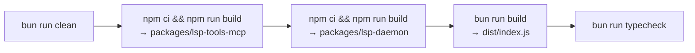
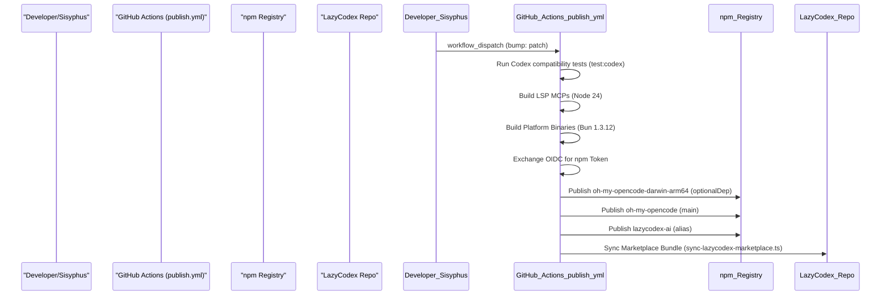

# Building and Publishing

Relevant source files

The following files were used as context for generating this wiki page:

- [.agents/command/.npmignore](https://github.com/code-yeongyu/oh-my-openagent/blob/HEAD/.agents/command/.npmignore)
- [.agents/skills/.npmignore](https://github.com/code-yeongyu/oh-my-openagent/blob/HEAD/.agents/skills/.npmignore)
- [.github/scripts/write-job-summary.sh](https://github.com/code-yeongyu/oh-my-openagent/blob/HEAD/.github/scripts/write-job-summary.sh)
- [.github/workflows/ci.yml](https://github.com/code-yeongyu/oh-my-openagent/blob/HEAD/.github/workflows/ci.yml)
- [.github/workflows/cla.yml](https://github.com/code-yeongyu/oh-my-openagent/blob/HEAD/.github/workflows/cla.yml)
- [.github/workflows/lint-workflows.yml](https://github.com/code-yeongyu/oh-my-openagent/blob/HEAD/.github/workflows/lint-workflows.yml)
- [.github/workflows/package-labels.yml](https://github.com/code-yeongyu/oh-my-openagent/blob/HEAD/.github/workflows/package-labels.yml)
- [.github/workflows/publish-platform.yml](https://github.com/code-yeongyu/oh-my-openagent/blob/HEAD/.github/workflows/publish-platform.yml)
- [.github/workflows/publish.yml](https://github.com/code-yeongyu/oh-my-openagent/blob/HEAD/.github/workflows/publish.yml)
- [.github/workflows/refresh-model-capabilities.yml](https://github.com/code-yeongyu/oh-my-openagent/blob/HEAD/.github/workflows/refresh-model-capabilities.yml)
- [.github/workflows/sisyphus-agent.yml](https://github.com/code-yeongyu/oh-my-openagent/blob/HEAD/.github/workflows/sisyphus-agent.yml)
- [.github/workflows/web-ci.yml](https://github.com/code-yeongyu/oh-my-openagent/blob/HEAD/.github/workflows/web-ci.yml)
- [.github/workflows/web-deploy.yml](https://github.com/code-yeongyu/oh-my-openagent/blob/HEAD/.github/workflows/web-deploy.yml)
- [.omo/evidence/20260809-omo-ai-beta-release/task-10.txt](https://github.com/code-yeongyu/oh-my-openagent/blob/HEAD/.omo/evidence/20260809-omo-ai-beta-release/task-10.txt)
- [.opencode/command/.npmignore](https://github.com/code-yeongyu/oh-my-openagent/blob/HEAD/.opencode/command/.npmignore)
- [.opencode/skills/.npmignore](https://github.com/code-yeongyu/oh-my-openagent/blob/HEAD/.opencode/skills/.npmignore)
- [CLA.md](https://github.com/code-yeongyu/oh-my-openagent/blob/HEAD/CLA.md)
- [bin/oh-my-opencode.js](https://github.com/code-yeongyu/oh-my-openagent/blob/HEAD/bin/oh-my-opencode.js)
- [bin/oh-my-opencode.test.ts](https://github.com/code-yeongyu/oh-my-openagent/blob/HEAD/bin/oh-my-opencode.test.ts)
- [bin/platform.d.ts](https://github.com/code-yeongyu/oh-my-openagent/blob/HEAD/bin/platform.d.ts)
- [bin/platform.js](https://github.com/code-yeongyu/oh-my-openagent/blob/HEAD/bin/platform.js)
- [bin/platform.test.ts](https://github.com/code-yeongyu/oh-my-openagent/blob/HEAD/bin/platform.test.ts)
- [docs/reference/lazycodex-npm-reservation.md](https://github.com/code-yeongyu/oh-my-openagent/blob/HEAD/docs/reference/lazycodex-npm-reservation.md)
- [packages/memory-core/src/compile/cache.test.ts](https://github.com/code-yeongyu/oh-my-openagent/blob/HEAD/packages/memory-core/src/compile/cache.test.ts)
- [packages/oh-my-opencode-windows-arm64/bin/.gitkeep](https://github.com/code-yeongyu/oh-my-openagent/blob/HEAD/packages/oh-my-opencode-windows-arm64/bin/.gitkeep)
- [postinstall.mjs](https://github.com/code-yeongyu/oh-my-openagent/blob/HEAD/postinstall.mjs)
- [script/build-binaries.test.ts](https://github.com/code-yeongyu/oh-my-openagent/blob/HEAD/script/build-binaries.test.ts)
- [script/build-binaries.ts](https://github.com/code-yeongyu/oh-my-openagent/blob/HEAD/script/build-binaries.ts)
- [script/build-cli-node.test.ts](https://github.com/code-yeongyu/oh-my-openagent/blob/HEAD/script/build-cli-node.test.ts)
- [script/build-cli-node.ts](https://github.com/code-yeongyu/oh-my-openagent/blob/HEAD/script/build-cli-node.ts)
- [script/build-schema-document.ts](https://github.com/code-yeongyu/oh-my-openagent/blob/HEAD/script/build-schema-document.ts)
- [script/build-schema.test.ts](https://github.com/code-yeongyu/oh-my-openagent/blob/HEAD/script/build-schema.test.ts)
- [script/build-schema.ts](https://github.com/code-yeongyu/oh-my-openagent/blob/HEAD/script/build-schema.ts)
- [script/ci-job-summary-workflow.test.ts](https://github.com/code-yeongyu/oh-my-openagent/blob/HEAD/script/ci-job-summary-workflow.test.ts)
- [script/codex-test-script.test.ts](https://github.com/code-yeongyu/oh-my-openagent/blob/HEAD/script/codex-test-script.test.ts)
- [script/lazycodex-marketplace-validation.pin.test.ts](https://github.com/code-yeongyu/oh-my-openagent/blob/HEAD/script/lazycodex-marketplace-validation.pin.test.ts)
- [script/lazycodex-marketplace-validation.ts](https://github.com/code-yeongyu/oh-my-openagent/blob/HEAD/script/lazycodex-marketplace-validation.ts)
- [script/lazycodex-runtime-dists.ts](https://github.com/code-yeongyu/oh-my-openagent/blob/HEAD/script/lazycodex-runtime-dists.ts)
- [script/omo-ai-ci-job.test.ts](https://github.com/code-yeongyu/oh-my-openagent/blob/HEAD/script/omo-ai-ci-job.test.ts)
- [script/package-labels-workflow.test.ts](https://github.com/code-yeongyu/oh-my-openagent/blob/HEAD/script/package-labels-workflow.test.ts)
- [script/package-layout-exclusion.test.ts](https://github.com/code-yeongyu/oh-my-openagent/blob/HEAD/script/package-layout-exclusion.test.ts)
- [script/package-layout.test.ts](https://github.com/code-yeongyu/oh-my-openagent/blob/HEAD/script/package-layout.test.ts)
- [script/publish-lazycodex-sync-workflow.test.ts](https://github.com/code-yeongyu/oh-my-openagent/blob/HEAD/script/publish-lazycodex-sync-workflow.test.ts)
- [script/publish-lazycodex-workflow.test.ts](https://github.com/code-yeongyu/oh-my-openagent/blob/HEAD/script/publish-lazycodex-workflow.test.ts)
- [script/publish-workflow.test.ts](https://github.com/code-yeongyu/oh-my-openagent/blob/HEAD/script/publish-workflow.test.ts)
- [script/publish.ts](https://github.com/code-yeongyu/oh-my-openagent/blob/HEAD/script/publish.ts)
- [script/remove-stale-self-package-tests.test.ts](https://github.com/code-yeongyu/oh-my-openagent/blob/HEAD/script/remove-stale-self-package-tests.test.ts)
- [script/remove-stale-self-package-tests.ts](https://github.com/code-yeongyu/oh-my-openagent/blob/HEAD/script/remove-stale-self-package-tests.ts)
- [script/script-typecheck.test.ts](https://github.com/code-yeongyu/oh-my-openagent/blob/HEAD/script/script-typecheck.test.ts)
- [script/senpi-test-script.test.ts](https://github.com/code-yeongyu/oh-my-openagent/blob/HEAD/script/senpi-test-script.test.ts)
- [script/sync-lazycodex-marketplace-root-cli.test.ts](https://github.com/code-yeongyu/oh-my-openagent/blob/HEAD/script/sync-lazycodex-marketplace-root-cli.test.ts)
- [script/sync-lazycodex-marketplace.test.ts](https://github.com/code-yeongyu/oh-my-openagent/blob/HEAD/script/sync-lazycodex-marketplace.test.ts)
- [script/sync-lazycodex-marketplace.ts](https://github.com/code-yeongyu/oh-my-openagent/blob/HEAD/script/sync-lazycodex-marketplace.ts)
- [script/tsconfig.json](https://github.com/code-yeongyu/oh-my-openagent/blob/HEAD/script/tsconfig.json)

This page documents the build and publishing infrastructure for Oh My OpenCode, which uses a multi-package distribution strategy with platform-specific binaries. The system publishes a main npm package (`oh-my-opencode` and its alias `oh-my-openagent`) that depends on 12 optional platform-specific packages containing native Bun binaries compiled for different operating systems and architectures.

For information about runtime platform detection and binary selection, see [7.3 Platform Binaries](41_7.3-platform-binaries.md). For the project source code organization, see [8.1 Project Structure](45_8.1-project-structure.md).

## Package Architecture

Oh My OpenCode uses a **main + optional dependencies** pattern where the main package contains TypeScript source and metadata, while platform-specific packages contain pre-compiled native binaries.

### Package Structure

```mermaid
graph TB
    MainPkg["oh-my-opencode<br/>(main package)"]
    
    subgraph node_12_Optional_Dependencies ["12 Optional Dependencies"]
        Darwin1["oh-my-opencode-darwin-arm64"]
        Darwin2["oh-my-opencode-darwin-x64"]
        Darwin3["oh-my-opencode-darwin-x64-baseline"]
        Linux1["oh-my-opencode-linux-x64"]
        Linux2["oh-my-opencode-linux-x64-baseline"]
        Linux3["oh-my-opencode-linux-arm64"]
        Linux4["oh-my-opencode-linux-x64-musl"]
        Linux5["oh-my-opencode-linux-x64-musl-baseline"]
        Linux6["oh-my-opencode-linux-arm64-musl"]
        Win1["oh-my-opencode-windows-x64"]
        Win2["oh-my-opencode-windows-x64-baseline"]
        Win3["oh-my-opencode-windows-arm64"]
    end
    
    MainPkg -->|"optionalDependencies"| Darwin1
    MainPkg -->|"optionalDependencies"| Darwin2
    MainPkg -->|"optionalDependencies"| Darwin3
    MainPkg -->|"optionalDependencies"| Linux1
    MainPkg -->|"optionalDependencies"| Linux2
    MainPkg -->|"optionalDependencies"| Linux3
    MainPkg -->|"optionalDependencies"| Linux4
    MainPkg -->|"optionalDependencies"| Linux5
    MainPkg -->|"optionalDependencies"| Linux6
    MainPkg -->|"optionalDependencies"| Win1
    MainPkg -->|"optionalDependencies"| Win2
    MainPkg -->|"optionalDependencies"| Win3
    
    Wrapper["bin/oh-my-opencode.js<br/>(wrapper script)"]
    
    MainPkg --> Wrapper
```

**Sources:** [script/publish.ts:13-26](https://github.com/code-yeongyu/oh-my-openagent/blob/HEAD/script/publish.ts#L13-L26), [.github/workflows/publish.yml:193-201](https://github.com/code-yeongyu/oh-my-openagent/blob/HEAD/.github/workflows/publish.yml#L193-L201)

### Version Synchronization

All packages maintain synchronized versions. The main package lists each platform package in `optionalDependencies` with exact version matching. The `publish.yml` workflow and `script/publish.ts` automate this by updating the main `package.json` and all platform-specific `package.json` files simultaneously.

| Package Type | Version Source | Example |
|-------------|----------------|---------|
| Main package | `package.json` | `"version": "4.16.3"` |
| Platform packages | `packages/*/package.json` | `"version": "4.16.3"` |
| Optional dependencies | `package.json` | `"oh-my-opencode-darwin-arm64": "4.16.3"` |

**Sources:** [script/publish.ts:70-97](https://github.com/code-yeongyu/oh-my-openagent/blob/HEAD/script/publish.ts#L70-L97), [.github/workflows/publish-platform.yml:118-132](https://github.com/code-yeongyu/oh-my-openagent/blob/HEAD/.github/workflows/publish-platform.yml#L118-L132)

## Build Pipeline

### Main Package Build

The main package build process compiles TypeScript sources, generates type declarations, and builds internal MCP sub-packages.

**Build Targets:**

**Key Build Requirements:**
- **Vendored Packages:** `lsp-tools-mcp` and `lsp-daemon` must be built using Node 24 before main tests or typechecking can occur [script/publish-workflow.test.ts:85-105](https://github.com/code-yeongyu/oh-my-openagent/blob/HEAD/script/publish-workflow.test.ts#L85-L105), [.github/workflows/publish.yml:56-65](https://github.com/code-yeongyu/oh-my-openagent/blob/HEAD/.github/workflows/publish.yml#L56-L65).
- **Bun Version:** The build environment is pinned to Bun `1.3.12` [.github/workflows/ci.yml:90-92](https://github.com/code-yeongyu/oh-my-openagent/blob/HEAD/.github/workflows/ci.yml#L90-L92), [script/publish-workflow.test.ts:10-10](https://github.com/code-yeongyu/oh-my-openagent/blob/HEAD/script/publish-workflow.test.ts#L10).
- **Codex Materialization:** Shared upstreams are materialized to ensure plugin assets are available [script/package-layout.test.ts:10-28](https://github.com/code-yeongyu/oh-my-openagent/blob/HEAD/script/package-layout.test.ts#L10-L28).

**Sources:** [.github/workflows/publish.yml:44-65](https://github.com/code-yeongyu/oh-my-openagent/blob/HEAD/.github/workflows/publish.yml#L44-L65), [.github/workflows/ci.yml:90-116](https://github.com/code-yeongyu/oh-my-openagent/blob/HEAD/.github/workflows/ci.yml#L90-L116), [script/publish-workflow.test.ts:85-105](https://github.com/code-yeongyu/oh-my-openagent/blob/HEAD/script/publish-workflow.test.ts#L85-L105)

### Platform Binary Compilation

Platform binaries are compiled using Bun's native compilation capabilities, managed during the `publish-platform.yml` workflow.

- **Cross-Platform Matrix:** Binaries are built on `windows-latest`, `macos-latest`, and `ubuntu-latest` to avoid cross-compilation issues like segfaults [.github/workflows/publish-platform.yml:37-46](https://github.com/code-yeongyu/oh-my-openagent/blob/HEAD/.github/workflows/publish-platform.yml#L37-L46).
- **Launcher Build:** The JS launcher is built using `bun run build:binaries` [.github/workflows/publish-platform.yml:144-144](https://github.com/code-yeongyu/oh-my-openagent/blob/HEAD/.github/workflows/publish-platform.yml#L144).
- **Baseline Targets:** Specific builds are generated for `x64-baseline` targets (Linux, Windows, macOS) to ensure compatibility with CPUs lacking AVX2 [script/build-binaries.test.ts:14-19](https://github.com/code-yeongyu/oh-my-openagent/blob/HEAD/script/build-binaries.test.ts#L14-L19), [.github/workflows/publish-platform.yml:46-46](https://github.com/code-yeongyu/oh-my-openagent/blob/HEAD/.github/workflows/publish-platform.yml#L46).
- **Windows-on-ARM:** A `windows-arm64` package is included [.github/workflows/publish-platform.yml:46-46](https://github.com/code-yeongyu/oh-my-openagent/blob/HEAD/.github/workflows/publish-platform.yml#L46).

**Sources:** [.github/workflows/publish-platform.yml:37-185](https://github.com/code-yeongyu/oh-my-openagent/blob/HEAD/.github/workflows/publish-platform.yml#L37-L185), [script/build-binaries.test.ts:14-19](https://github.com/code-yeongyu/oh-my-openagent/blob/HEAD/script/build-binaries.test.ts#L14-L19)

## GitHub Actions Workflows

### Primary Workflow: `publish.yml`

The main publishing workflow orchestrates testing, versioning, and distribution. It supports manual dispatch with version overrides or automatic bumps (major, minor, patch) [.github/workflows/publish.yml:6-19](https://github.com/code-yeongyu/oh-my-openagent/blob/HEAD/.github/workflows/publish.yml#L6-L19).

**Key Release Gates:**
- **Codex Compatibility:** Runs `bun run test:codex` across Ubuntu, macOS, and Windows matrix before any publish job can start [.github/workflows/publish.yml:117-158](https://github.com/code-yeongyu/oh-my-openagent/blob/HEAD/.github/workflows/publish.yml#L117-L158), [script/publish-workflow.test.ts:107-141](https://github.com/code-yeongyu/oh-my-openagent/blob/HEAD/script/publish-workflow.test.ts#L107-L141).
- **Preflight Trust:** Verifies npm OIDC trusted publisher status for all 24+ packages (including platform packages and `lazycodex-ai` alias) [.github/workflows/publish.yml:160-224](https://github.com/code-yeongyu/oh-my-openagent/blob/HEAD/.github/workflows/publish.yml#L160-L224).
- **Release Metadata:** Resolves the next version and dist-tag (e.g., `beta` vs `latest`) [.github/workflows/publish.yml:226-261](https://github.com/code-yeongyu/oh-my-openagent/blob/HEAD/.github/workflows/publish.yml#L226-L261).
- **Provenance-Safe Dispatch:** For stable releases, the workflow performs a source-pinned follow-up run to ensure provenance links to the exact release SHA [script/publish-workflow.test.ts:123-150](https://github.com/code-yeongyu/oh-my-openagent/blob/HEAD/script/publish-workflow.test.ts#L123-L150).

**Sources:** [.github/workflows/publish.yml:1-261](https://github.com/code-yeongyu/oh-my-openagent/blob/HEAD/.github/workflows/publish.yml#L1-L261), [script/publish-workflow.test.ts:107-150](https://github.com/code-yeongyu/oh-my-openagent/blob/HEAD/script/publish-workflow.test.ts#L107-L150)

### CI Workflow: `ci.yml`

The CI workflow runs on pushes and PRs to `master` and `dev` branches [.github/workflows/ci.yml:3-7](https://github.com/code-yeongyu/oh-my-openagent/blob/HEAD/.github/workflows/ci.yml#L3-L7).

- **Branch Guard:** Blocks and auto-closes PRs targeting the `master` branch, requiring contributors to target `dev` [.github/workflows/ci.yml:15-52](https://github.com/code-yeongyu/oh-my-openagent/blob/HEAD/.github/workflows/ci.yml#L15-L52).
- **Cross-OS Tests:** Runs the full `bun test` suite on Ubuntu, macOS, and Windows [.github/workflows/ci.yml:76-123](https://github.com/code-yeongyu/oh-my-openagent/blob/HEAD/.github/workflows/ci.yml#L76-L123).
- **Typecheck Gate:** Executes `bun run typecheck` across the workspace matrix to ensure shared package changes don't break adapters [.github/workflows/ci.yml:125-163](https://github.com/code-yeongyu/oh-my-openagent/blob/HEAD/.github/workflows/ci.yml#L125-L163).

**Sources:** [.github/workflows/ci.yml:1-163](https://github.com/code-yeongyu/oh-my-openagent/blob/HEAD/.github/workflows/ci.yml#L1-L163)

## AI-Assisted Release Management: Sisyphus Agent

The `sisyphus-agent.yml` workflow allows the Sisyphus AI agent to interact with the repository for automated maintenance.

- **Trigger:** Mentioning `@sisyphus-dev-ai` in an issue comment (restricted to maintainers) [.github/workflows/sisyphus-agent.yml:11-23](https://github.com/code-yeongyu/oh-my-openagent/blob/HEAD/.github/workflows/sisyphus-agent.yml#L11-L23).
- **Identity:** Commits are made as `sisyphus-dev-ai` using a dedicated Personal Access Token (PAT) [.github/workflows/sisyphus-agent.yml:29-47](https://github.com/code-yeongyu/oh-my-openagent/blob/HEAD/.github/workflows/sisyphus-agent.yml#L29-L47).
- **Environment:** Provisions `tmux`, OpenCode, and local `oh-my-opencode` build to allow the agent to run and test its own changes [.github/workflows/sisyphus-agent.yml:49-115](https://github.com/code-yeongyu/oh-my-openagent/blob/HEAD/.github/workflows/sisyphus-agent.yml#L49-L115).

**Sources:** [.github/workflows/sisyphus-agent.yml:1-115](https://github.com/code-yeongyu/oh-my-openagent/blob/HEAD/.github/workflows/sisyphus-agent.yml#L1-L115)

## LazyCodex Marketplace Sync

A specialized pipeline manages the synchronization of the `omo-codex` payload to the LazyCodex marketplace.

- **Marketplace Sync:** The `publish.yml` workflow pushes updates to the `code-yeongyu/lazycodex` repository using the `LAZYCODEX_SYNC_TOKEN` secret [.github/workflows/publish.yml:168-176](https://github.com/code-yeongyu/oh-my-openagent/blob/HEAD/.github/workflows/publish.yml#L168-L176).
- **Alias Publishing:** Automatically publishes the `lazycodex-ai` npm alias alongside the main package [.github/workflows/publish.yml:25-29](https://github.com/code-yeongyu/oh-my-openagent/blob/HEAD/.github/workflows/publish.yml#L25-L29).
- **Codex Plugin Stamping:** The workflow stamps the version into the Codex plugin metadata files: `packages/omo-codex/plugin/.codex-plugin/plugin.json` and `packages/omo-codex/plugin/package.json` [script/publish-lazycodex-workflow.test.ts:76-78](https://github.com/code-yeongyu/oh-my-openagent/blob/HEAD/script/publish-lazycodex-workflow.test.ts#L76-L78).
- **Validation:** The sync process includes building all necessary MCP runtimes (`lsp-tools-mcp`, `lsp-daemon`, `git-bash-mcp`) before executing the sync script `script/sync-lazycodex-marketplace.ts` [script/publish-lazycodex-workflow.test.ts:84-90](https://github.com/code-yeongyu/oh-my-openagent/blob/HEAD/script/publish-lazycodex-workflow.test.ts#L84-L90).
- **Payload Rewriting:** The sync script rewrites MCP manifest paths (e.g., from `../../git-bash-mcp/dist/cli.js` to `./components/git-bash-mcp/dist/cli.js`) to ensure relative paths resolve within the flattened marketplace bundle [script/sync-lazycodex-marketplace.ts:28-32](https://github.com/code-yeongyu/oh-my-openagent/blob/HEAD/script/sync-lazycodex-marketplace.ts#L28-L32).

**Sources:** [script/publish-lazycodex-workflow.test.ts:49-122](https://github.com/code-yeongyu/oh-my-openagent/blob/HEAD/script/publish-lazycodex-workflow.test.ts#L49-L122), [script/sync-lazycodex-marketplace.ts:1-95](https://github.com/code-yeongyu/oh-my-openagent/blob/HEAD/script/sync-lazycodex-marketplace.ts#L1-L95), [.github/workflows/publish.yml:164-172](https://github.com/code-yeongyu/oh-my-openagent/blob/HEAD/.github/workflows/publish.yml#L164-L172)

## npm Trusted Publishing (OIDC)

The workflows utilize npm's Trusted Publishing via OpenID Connect (OIDC).

- **OIDC Token Exchange:** The `preflight-trust` job requests an OIDC token from GitHub and attempts to exchange it for an npm publishing token for every package in the registry [.github/workflows/publish.yml:184-210](https://github.com/code-yeongyu/oh-my-openagent/blob/HEAD/.github/workflows/publish.yml#L184-L210).
- **Provenance:** Packages are published with `--provenance` to link the npm artifact back to the specific GitHub Action run [script/publish.ts:211-220](https://github.com/code-yeongyu/oh-my-openagent/blob/HEAD/script/publish.ts#L211-L220).

**Sources:** [.github/workflows/publish.yml:175-207](https://github.com/code-yeongyu/oh-my-openagent/blob/HEAD/.github/workflows/publish.yml#L175-L207), [script/publish.ts:211-220](https://github.com/code-yeongyu/oh-my-openagent/blob/HEAD/script/publish.ts#L211-L220)

## Release Execution Flow

The following diagram illustrates the data flow from code change to npm registry.

**Sources:** [.github/workflows/publish.yml:1-261](https://github.com/code-yeongyu/oh-my-openagent/blob/HEAD/.github/workflows/publish.yml#L1-L261), [script/publish.ts:1-250](https://github.com/code-yeongyu/oh-my-openagent/blob/HEAD/script/publish.ts#L1-L250), [script/sync-lazycodex-marketplace.ts:50-95](https://github.com/code-yeongyu/oh-my-openagent/blob/HEAD/script/sync-lazycodex-marketplace.ts#L50-L95)45:T3f