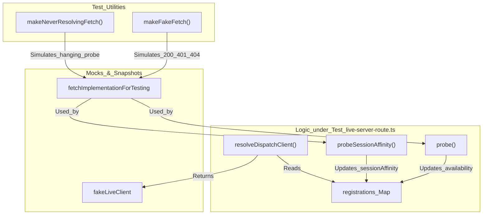
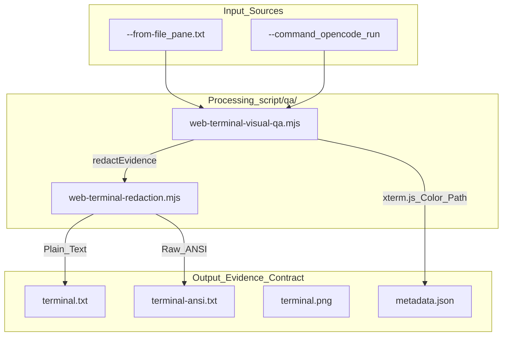

# Testing

Relevant source files

The following files were used as context for generating this wiki page:

- [.agents/skills/codex-qa/SKILL.md](https://github.com/code-yeongyu/oh-my-openagent/blob/HEAD/.agents/skills/codex-qa/SKILL.md)
- [.agents/skills/codex-qa/references/app-server.md](https://github.com/code-yeongyu/oh-my-openagent/blob/HEAD/.agents/skills/codex-qa/references/app-server.md)
- [.agents/skills/codex-qa/references/components-hooks.md](https://github.com/code-yeongyu/oh-my-openagent/blob/HEAD/.agents/skills/codex-qa/references/components-hooks.md)
- [.agents/skills/codex-qa/references/logging-debug.md](https://github.com/code-yeongyu/oh-my-openagent/blob/HEAD/.agents/skills/codex-qa/references/logging-debug.md)
- [.agents/skills/codex-qa/scripts/app-server-drive.sh](https://github.com/code-yeongyu/oh-my-openagent/blob/HEAD/.agents/skills/codex-qa/scripts/app-server-drive.sh)
- [.agents/skills/codex-qa/scripts/hook-unit-probe.sh](https://github.com/code-yeongyu/oh-my-openagent/blob/HEAD/.agents/skills/codex-qa/scripts/hook-unit-probe.sh)
- [.agents/skills/codex-qa/scripts/install-verify.sh](https://github.com/code-yeongyu/oh-my-openagent/blob/HEAD/.agents/skills/codex-qa/scripts/install-verify.sh)
- [.agents/skills/codex-qa/scripts/lib/app-server-client.mjs](https://github.com/code-yeongyu/oh-my-openagent/blob/HEAD/.agents/skills/codex-qa/scripts/lib/app-server-client.mjs)
- [.agents/skills/codex-qa/scripts/lib/app-server-client.test.js](https://github.com/code-yeongyu/oh-my-openagent/blob/HEAD/.agents/skills/codex-qa/scripts/lib/app-server-client.test.js)
- [.agents/skills/opencode-qa/SKILL.md](https://github.com/code-yeongyu/oh-my-openagent/blob/HEAD/.agents/skills/opencode-qa/SKILL.md)
- [.agents/skills/opencode-qa/references/tui-tmux.md](https://github.com/code-yeongyu/oh-my-openagent/blob/HEAD/.agents/skills/opencode-qa/references/tui-tmux.md)
- [.agents/skills/opencode-qa/scripts/lib/fake-openai-branches.mjs](https://github.com/code-yeongyu/oh-my-openagent/blob/HEAD/.agents/skills/opencode-qa/scripts/lib/fake-openai-branches.mjs)
- [.agents/skills/opencode-qa/scripts/lib/fake-openai-events.mjs](https://github.com/code-yeongyu/oh-my-openagent/blob/HEAD/.agents/skills/opencode-qa/scripts/lib/fake-openai-events.mjs)
- [.agents/skills/opencode-qa/scripts/lib/fake-openai-server.mjs](https://github.com/code-yeongyu/oh-my-openagent/blob/HEAD/.agents/skills/opencode-qa/scripts/lib/fake-openai-server.mjs)
- [.agents/skills/opencode-qa/scripts/serve-wake-split-probe.sh](https://github.com/code-yeongyu/oh-my-openagent/blob/HEAD/.agents/skills/opencode-qa/scripts/serve-wake-split-probe.sh)
- [.omo/evidence/omo-senpi-adapter/20260729-pr6451-review-fixes/README.md](https://github.com/code-yeongyu/oh-my-openagent/blob/HEAD/.omo/evidence/omo-senpi-adapter/20260729-pr6451-review-fixes/README.md)
- [.omo/evidence/omo-senpi-adapter/20260729-pr6451-review-fixes/team-e2e-macos.json](https://github.com/code-yeongyu/oh-my-openagent/blob/HEAD/.omo/evidence/omo-senpi-adapter/20260729-pr6451-review-fixes/team-e2e-macos.json)
- [.omo/evidence/omo-senpi-adapter/20260729-windows-team-crash-recovery/README.md](https://github.com/code-yeongyu/oh-my-openagent/blob/HEAD/.omo/evidence/omo-senpi-adapter/20260729-windows-team-crash-recovery/README.md)
- [.omo/evidence/omo-senpi-adapter/20260729-windows-team-crash-recovery/crash-recovery.json](https://github.com/code-yeongyu/oh-my-openagent/blob/HEAD/.omo/evidence/omo-senpi-adapter/20260729-windows-team-crash-recovery/crash-recovery.json)
- [.omo/evidence/omo-senpi-adapter/20260729-windows-team-crash-recovery/team-e2e.json](https://github.com/code-yeongyu/oh-my-openagent/blob/HEAD/.omo/evidence/omo-senpi-adapter/20260729-windows-team-crash-recovery/team-e2e.json)
- [ROADMAP.md](https://github.com/code-yeongyu/oh-my-openagent/blob/HEAD/ROADMAP.md)
- [assets/AGENTS.md](https://github.com/code-yeongyu/oh-my-openagent/blob/HEAD/assets/AGENTS.md)
- [bin/AGENTS.md](https://github.com/code-yeongyu/oh-my-openagent/blob/HEAD/bin/AGENTS.md)
- [bunfig.toml](https://github.com/code-yeongyu/oh-my-openagent/blob/HEAD/bunfig.toml)
- [docs/reference/web-terminal-visual-qa.md](https://github.com/code-yeongyu/oh-my-openagent/blob/HEAD/docs/reference/web-terminal-visual-qa.md)
- [packages/claude-code-compat-core/AGENTS.md](https://github.com/code-yeongyu/oh-my-openagent/blob/HEAD/packages/claude-code-compat-core/AGENTS.md)
- [packages/lsp-core/AGENTS.md](https://github.com/code-yeongyu/oh-my-openagent/blob/HEAD/packages/lsp-core/AGENTS.md)
- [packages/lsp-tools-mcp/AGENTS.md](https://github.com/code-yeongyu/oh-my-openagent/blob/HEAD/packages/lsp-tools-mcp/AGENTS.md)
- [packages/lsp-tools-mcp/README.md](https://github.com/code-yeongyu/oh-my-openagent/blob/HEAD/packages/lsp-tools-mcp/README.md)
- [packages/mcp-client-core/AGENTS.md](https://github.com/code-yeongyu/oh-my-openagent/blob/HEAD/packages/mcp-client-core/AGENTS.md)
- [packages/omo-codex/scripts/install-marketplace-cache.test.mjs](https://github.com/code-yeongyu/oh-my-openagent/blob/HEAD/packages/omo-codex/scripts/install-marketplace-cache.test.mjs)
- [packages/omo-opencode/src/hooks/shared/prompt-async-gate-live-routing.test.ts](https://github.com/code-yeongyu/oh-my-openagent/blob/HEAD/packages/omo-opencode/src/hooks/shared/prompt-async-gate-live-routing.test.ts)
- [packages/omo-opencode/src/shared/live-server-route-probe.test.ts](https://github.com/code-yeongyu/oh-my-openagent/blob/HEAD/packages/omo-opencode/src/shared/live-server-route-probe.test.ts)
- [packages/omo-opencode/src/shared/live-server-route.test.ts](https://github.com/code-yeongyu/oh-my-openagent/blob/HEAD/packages/omo-opencode/src/shared/live-server-route.test.ts)
- [packages/omo-opencode/src/shared/live-server-route.ts](https://github.com/code-yeongyu/oh-my-openagent/blob/HEAD/packages/omo-opencode/src/shared/live-server-route.ts)
- [packages/omo-opencode/src/shared/prompt-async-gate-client-identity.test.ts](https://github.com/code-yeongyu/oh-my-openagent/blob/HEAD/packages/omo-opencode/src/shared/prompt-async-gate-client-identity.test.ts)
- [packages/omo-opencode/src/shared/prompt-async-gate.ts](https://github.com/code-yeongyu/oh-my-openagent/blob/HEAD/packages/omo-opencode/src/shared/prompt-async-gate.ts)
- [packages/omo-senpi/scripts/qa/task-e2e-analysis.mjs](https://github.com/code-yeongyu/oh-my-openagent/blob/HEAD/packages/omo-senpi/scripts/qa/task-e2e-analysis.mjs)
- [packages/omo-senpi/scripts/qa/task-e2e-analysis.test.mjs](https://github.com/code-yeongyu/oh-my-openagent/blob/HEAD/packages/omo-senpi/scripts/qa/task-e2e-analysis.test.mjs)
- [packages/omo-senpi/scripts/qa/task-e2e-mock-provider.ts](https://github.com/code-yeongyu/oh-my-openagent/blob/HEAD/packages/omo-senpi/scripts/qa/task-e2e-mock-provider.ts)
- [packages/omo-senpi/scripts/qa/task-e2e.mjs](https://github.com/code-yeongyu/oh-my-openagent/blob/HEAD/packages/omo-senpi/scripts/qa/task-e2e.mjs)
- [packages/omo-senpi/scripts/qa/task-tui-e2e.mjs](https://github.com/code-yeongyu/oh-my-openagent/blob/HEAD/packages/omo-senpi/scripts/qa/task-tui-e2e.mjs)
- [packages/omo-senpi/scripts/qa/task-tui-scenarios.mjs](https://github.com/code-yeongyu/oh-my-openagent/blob/HEAD/packages/omo-senpi/scripts/qa/task-tui-scenarios.mjs)
- [packages/omo-senpi/scripts/qa/team-e2e-analysis.mjs](https://github.com/code-yeongyu/oh-my-openagent/blob/HEAD/packages/omo-senpi/scripts/qa/team-e2e-analysis.mjs)
- [packages/omo-senpi/scripts/qa/team-e2e-analysis.test.mjs](https://github.com/code-yeongyu/oh-my-openagent/blob/HEAD/packages/omo-senpi/scripts/qa/team-e2e-analysis.test.mjs)
- [packages/omo-senpi/scripts/qa/team-e2e-crash-state.mjs](https://github.com/code-yeongyu/oh-my-openagent/blob/HEAD/packages/omo-senpi/scripts/qa/team-e2e-crash-state.mjs)
- [packages/omo-senpi/scripts/qa/team-e2e-crash.mjs](https://github.com/code-yeongyu/oh-my-openagent/blob/HEAD/packages/omo-senpi/scripts/qa/team-e2e-crash.mjs)
- [packages/omo-senpi/scripts/qa/team-e2e-mock-provider.ts](https://github.com/code-yeongyu/oh-my-openagent/blob/HEAD/packages/omo-senpi/scripts/qa/team-e2e-mock-provider.ts)
- [packages/omo-senpi/scripts/qa/team-e2e-process.mjs](https://github.com/code-yeongyu/oh-my-openagent/blob/HEAD/packages/omo-senpi/scripts/qa/team-e2e-process.mjs)
- [packages/omo-senpi/scripts/qa/team-e2e-runtime.mjs](https://github.com/code-yeongyu/oh-my-openagent/blob/HEAD/packages/omo-senpi/scripts/qa/team-e2e-runtime.mjs)
- [packages/omo-senpi/scripts/qa/team-e2e-runtime.test.ts](https://github.com/code-yeongyu/oh-my-openagent/blob/HEAD/packages/omo-senpi/scripts/qa/team-e2e-runtime.test.ts)
- [packages/omo-senpi/scripts/qa/team-e2e-scripts.mjs](https://github.com/code-yeongyu/oh-my-openagent/blob/HEAD/packages/omo-senpi/scripts/qa/team-e2e-scripts.mjs)
- [packages/omo-senpi/scripts/qa/team-e2e-support.mjs](https://github.com/code-yeongyu/oh-my-openagent/blob/HEAD/packages/omo-senpi/scripts/qa/team-e2e-support.mjs)
- [packages/omo-senpi/scripts/qa/team-e2e-support.test.ts](https://github.com/code-yeongyu/oh-my-openagent/blob/HEAD/packages/omo-senpi/scripts/qa/team-e2e-support.test.ts)
- [packages/omo-senpi/scripts/qa/team-e2e.mjs](https://github.com/code-yeongyu/oh-my-openagent/blob/HEAD/packages/omo-senpi/scripts/qa/team-e2e.mjs)
- [packages/openclaw-core/AGENTS.md](https://github.com/code-yeongyu/oh-my-openagent/blob/HEAD/packages/openclaw-core/AGENTS.md)
- [packages/rules-engine/AGENTS.md](https://github.com/code-yeongyu/oh-my-openagent/blob/HEAD/packages/rules-engine/AGENTS.md)
- [packages/senpi-task/src/tools/team/lifecycle-precedence.test.ts](https://github.com/code-yeongyu/oh-my-openagent/blob/HEAD/packages/senpi-task/src/tools/team/lifecycle-precedence.test.ts)
- [packages/skills-loader-core/AGENTS.md](https://github.com/code-yeongyu/oh-my-openagent/blob/HEAD/packages/skills-loader-core/AGENTS.md)
- [packages/team-core/AGENTS.md](https://github.com/code-yeongyu/oh-my-openagent/blob/HEAD/packages/team-core/AGENTS.md)
- [script/qa/web-terminal-redaction.d.mts](https://github.com/code-yeongyu/oh-my-openagent/blob/HEAD/script/qa/web-terminal-redaction.d.mts)
- [script/qa/web-terminal-redaction.mjs](https://github.com/code-yeongyu/oh-my-openagent/blob/HEAD/script/qa/web-terminal-redaction.mjs)
- [script/qa/web-terminal-visual-qa.mjs](https://github.com/code-yeongyu/oh-my-openagent/blob/HEAD/script/qa/web-terminal-visual-qa.mjs)
- [script/test-environment-isolation.test.ts](https://github.com/code-yeongyu/oh-my-openagent/blob/HEAD/script/test-environment-isolation.test.ts)
- [script/web-terminal-visual-qa.test.ts](https://github.com/code-yeongyu/oh-my-openagent/blob/HEAD/script/web-terminal-visual-qa.test.ts)
- [scripts/AGENTS.md](https://github.com/code-yeongyu/oh-my-openagent/blob/HEAD/scripts/AGENTS.md)
- [test-setup.ts](https://github.com/code-yeongyu/oh-my-openagent/blob/HEAD/test-setup.ts)
- [tests/AGENTS.md](https://github.com/code-yeongyu/oh-my-openagent/blob/HEAD/tests/AGENTS.md)
- [tests/hashline/bun.lock](https://github.com/code-yeongyu/oh-my-openagent/blob/HEAD/tests/hashline/bun.lock)
- [tests/hashline/headless.ts](https://github.com/code-yeongyu/oh-my-openagent/blob/HEAD/tests/hashline/headless.ts)
- [tests/hashline/package.json](https://github.com/code-yeongyu/oh-my-openagent/blob/HEAD/tests/hashline/package.json)
- [tests/hashline/test-edge-cases.ts](https://github.com/code-yeongyu/oh-my-openagent/blob/HEAD/tests/hashline/test-edge-cases.ts)
- [tests/hashline/test-edit-ops.ts](https://github.com/code-yeongyu/oh-my-openagent/blob/HEAD/tests/hashline/test-edit-ops.ts)
- [tests/hashline/test-environment.test.ts](https://github.com/code-yeongyu/oh-my-openagent/blob/HEAD/tests/hashline/test-environment.test.ts)
- [tests/hashline/test-environment.ts](https://github.com/code-yeongyu/oh-my-openagent/blob/HEAD/tests/hashline/test-environment.ts)
- [tests/hashline/test-multi-model.ts](https://github.com/code-yeongyu/oh-my-openagent/blob/HEAD/tests/hashline/test-multi-model.ts)

This document covers the testing infrastructure, patterns, and conventions used in the `oh-my-openagent` codebase. It explains the test structure, mock-heavy isolation strategies, integration tests in `tests/hashline/`, visual QA helpers, end-to-end task testing, and how tests are executed using Bun.

---

## Test Framework and Environment

The project utilizes **Bun's built-in test runner** (`bun:test`) for all unit and integration tests. The test suite is designed to run in a fast, concurrent environment while strictly checking TypeScript types.

### Test Environment Management

The `test-setup.ts` file provides a consistent baseline for every test execution, configured via `bunfig.toml` [bunfig.toml:1-3](https://github.com/code-yeongyu/oh-my-openagent/blob/HEAD/bunfig.toml#L1-L3).

| Feature | Implementation |
| :--- | :--- |
| **Global Setup** | `test-setup.ts` handles environment snapshots and cache cleanup [test-setup.ts:1-11](https://github.com/code-yeongyu/oh-my-openagent/blob/HEAD/test-setup.ts#L1-L11) |
| **Global Resets** | Clears singleton states for `ClaudeSessionState`, `TaskToastManager`, and `ModelFallbackState` before each test [test-setup.ts:7-9](https://github.com/code-yeongyu/oh-my-openagent/blob/HEAD/test-setup.ts#L7-L9), [test-setup.ts:90-102](https://github.com/code-yeongyu/oh-my-openagent/blob/HEAD/test-setup.ts#L90-L102) |
| **Filesystem Cleanup** | Automatically removes the OMO cache directory and rules injector storage [test-setup.ts:82-89](https://github.com/code-yeongyu/oh-my-openagent/blob/HEAD/test-setup.ts#L82-L89), [test-setup.ts:94-95](https://github.com/code-yeongyu/oh-my-openagent/blob/HEAD/test-setup.ts#L94-L95) |
| **Env Snapshotting** | Captures `process.env` and restores it afterward, allowing tests to safely modify environment variables [test-setup.ts:90-91](https://github.com/code-yeongyu/oh-my-openagent/blob/HEAD/test-setup.ts#L90-L91), [test-setup.ts:104-121](https://github.com/code-yeongyu/oh-my-openagent/blob/HEAD/test-setup.ts#L104-L121) |
| **Module Lifecycle** | Uses `installModuleMockLifecycle` to ensure all `mock.module` calls are cleared between runs [test-setup.ts:15-15](https://github.com/code-yeongyu/oh-my-openagent/blob/HEAD/test-setup.ts#L15), [test-setup.ts:140-145](https://github.com/code-yeongyu/oh-my-openagent/blob/HEAD/test-setup.ts#L140-L145) |
| **Hermetic Home** | Points `HOME` and `USERPROFILE` to a per-process temp dir to prevent local user skills from leaking into tests [test-setup.ts:63-65](https://github.com/code-yeongyu/oh-my-openagent/blob/HEAD/test-setup.ts#L63-L65) |

### LSP Daemon Pre-requisite
Integration tests for installers require the vendored `lsp-daemon`. The setup script ensures this is built via `npm ci && npm run build` in `packages/lsp-daemon` before tests start [test-setup.ts:19-38](https://github.com/code-yeongyu/oh-my-openagent/blob/HEAD/test-setup.ts#L19-L38).

Sources: [test-setup.ts:1-147](https://github.com/code-yeongyu/oh-my-openagent/blob/HEAD/test-setup.ts#L1-L147), [bunfig.toml:1-7](https://github.com/code-yeongyu/oh-my-openagent/blob/HEAD/bunfig.toml#L1-L7)

---

## Mock-Heavy Test Isolation

For high-level orchestration modules, the project uses a "mock-heavy" approach. This ensures that the plugin bootstrap logic and complex routing can be verified without spawning real background processes or making network calls.

### Live Server Routing Tests
The routing logic that decides whether to dispatch a prompt to a live server or an in-process client is heavily tested via mocks [packages/omo-opencode/src/shared/live-server-route.test.ts:62-78](https://github.com/code-yeongyu/oh-my-openagent/blob/HEAD/packages/omo-opencode/src/shared/live-server-route.test.ts#L62-L78).
*   **Identity Passthrough**: Returns the in-process client if the object identity doesn't match the registered one [packages/omo-opencode/src/shared/live-server-route.test.ts:80-95](https://github.com/code-yeongyu/oh-my-openagent/blob/HEAD/packages/omo-opencode/src/shared/live-server-route.test.ts#L80-L95).
*   **Probe Timeouts**: Validates that the router falls back to "in-process" within 1500ms if the health check probe hangs [packages/omo-opencode/src/shared/live-server-route.ts:10-10](https://github.com/code-yeongyu/oh-my-openagent/blob/HEAD/packages/omo-opencode/src/shared/live-server-route.ts#L10), [packages/omo-opencode/src/shared/live-server-route.test.ts:41-51](https://github.com/code-yeongyu/oh-my-openagent/blob/HEAD/packages/omo-opencode/src/shared/live-server-route.test.ts#L41-L51).
*   **Session Affinity**: Before trusting the live route, the system confirms the listener can resolve the target session; a 404 response demotes the route [packages/omo-opencode/src/shared/live-server-route.ts:148-180](https://github.com/code-yeongyu/oh-my-openagent/blob/HEAD/packages/omo-opencode/src/shared/live-server-route.ts#L148-L180).

**Natural Language to Code Entity Space: Routing Test Architecture**

Sources: [packages/omo-opencode/src/shared/live-server-route.ts:1-210](https://github.com/code-yeongyu/oh-my-openagent/blob/HEAD/packages/omo-opencode/src/shared/live-server-route.ts#L1-L210), [packages/omo-opencode/src/shared/live-server-route.test.ts:1-183](https://github.com/code-yeongyu/oh-my-openagent/blob/HEAD/packages/omo-opencode/src/shared/live-server-route.test.ts#L1-L183)

---

## Integration Tests: hashline and QA Harness

The project includes specialized integration test suites for complex features like the Hash-Anchored Edit system and cross-platform agent wiring.

### Visual QA and TUI Evidence
The project uses a specialized helper, `web-terminal-visual-qa.mjs`, to exercise the evidence contract and redaction in CI [script/web-terminal-visual-qa.test.ts:28-30](https://github.com/code-yeongyu/oh-my-openagent/blob/HEAD/script/web-terminal-visual-qa.test.ts#L28-L30).
*   **Redaction**: Automatically redacts secrets like `OPENAI_API_KEY`, `ghp_` tokens, or `sk-` keys before writing evidence [script/web-terminal-visual-qa.test.ts:79-104](https://github.com/code-yeongyu/oh-my-openagent/blob/HEAD/script/web-terminal-visual-qa.test.ts#L79-L104).
*   **Evidence Contract**: Each run produces `terminal.txt`, `terminal-ansi.txt`, and `metadata.json` in the evidence directory [script/web-terminal-visual-qa.test.ts:43-46](https://github.com/code-yeongyu/oh-my-openagent/blob/HEAD/script/web-terminal-visual-qa.test.ts#L43-L46).
*   **Assertions**: Tests verify that secrets are masked in both text and ANSI outputs and that `metadata.json` contains redaction statistics [script/web-terminal-visual-qa.test.ts:95-104](https://github.com/code-yeongyu/oh-my-openagent/blob/HEAD/script/web-terminal-visual-qa.test.ts#L95-L104).

**Natural Language to Code Entity Space: TUI Visual QA Flow**

Sources: [script/web-terminal-visual-qa.test.ts:1-133](https://github.com/code-yeongyu/oh-my-openagent/blob/HEAD/script/web-terminal-visual-qa.test.ts#L1-L133), [script/qa/web-terminal-redaction.mjs:6-6](https://github.com/code-yeongyu/oh-my-openagent/blob/HEAD/script/qa/web-terminal-redaction.mjs#L6)

### Senpi Task E2E Sandbox
For the Senpi adapter, a comprehensive E2E suite (`task-e2e.mjs`) validates the background task lifecycle using a mock provider [packages/omo-senpi/scripts/qa/task-e2e.mjs:38-40](https://github.com/code-yeongyu/oh-my-openagent/blob/HEAD/packages/omo-senpi/scripts/qa/task-e2e.mjs#L38-L40).
*   **Mock Provider**: `task-e2e-mock-provider.ts` uses a "leak-proof" selector to branch behavior between parent and child turns based on a `CHILD_IDENTITY` line [packages/omo-senpi/scripts/qa/task-e2e-mock-provider.ts:31-33](https://github.com/code-yeongyu/oh-my-openagent/blob/HEAD/packages/omo-senpi/scripts/qa/task-e2e-mock-provider.ts#L31-L33).
*   **Pollution Attribution**: `task-e2e-analysis.mjs` takes directory snapshots before and after runs to ensure no machine-global config or state was polluted, excluding shared diagnostic logs [packages/omo-senpi/scripts/qa/task-e2e-analysis.mjs:20-22](https://github.com/code-yeongyu/oh-my-openagent/blob/HEAD/packages/omo-senpi/scripts/qa/task-e2e-analysis.mjs#L20-L22), [packages/omo-senpi/scripts/qa/task-e2e-analysis.mjs:73-78](https://github.com/code-yeongyu/oh-my-openagent/blob/HEAD/packages/omo-senpi/scripts/qa/task-e2e-analysis.mjs#L73-L78).
*   **Scenario Verification**: Validates complex flows like `followup_revive` (resident session revival) and `unconditional_wake` (parent notification on task completion) [packages/omo-senpi/scripts/qa/task-e2e.mjs:114-120](https://github.com/code-yeongyu/oh-my-openagent/blob/HEAD/packages/omo-senpi/scripts/qa/task-e2e.mjs#L114-L120).

### Split-Probe QA (opencode-qa)
`serve-wake-split-probe.sh` is a specialized harness that proves whether background notifications correctly route through the live listener or accidentally fork a second LLM runner [.agents/skills/opencode-qa/scripts/serve-wake-split-probe.sh:5-13](https://github.com/code-yeongyu/oh-my-openagent/blob/HEAD/.agents/skills/opencode-qa/scripts/serve-wake-split-probe.sh#L5-L13).
*   **Fake LLM**: Uses `fake-openai-server.mjs` to simulate LLM responses, allowing deterministic testing of the "reproduced" vs "fixed" states [.agents/skills/opencode-qa/scripts/serve-wake-split-probe.sh:110-158](https://github.com/code-yeongyu/oh-my-openagent/blob/HEAD/.agents/skills/opencode-qa/scripts/serve-wake-split-probe.sh#L110-L158).
*   **Config Merging**: Dynamically merges `OMO_SANDBOX_OMO_CONFIG` into the sandbox configuration to test specific agent overrides [.agents/skills/opencode-qa/scripts/serve-wake-split-probe.sh:173-189](https://github.com/code-yeongyu/oh-my-openagent/blob/HEAD/.agents/skills/opencode-qa/scripts/serve-wake-split-probe.sh#L173-L189).

---

## Running Tests

Tests are executed using Bun. Specific scripts are available for different components.

| Command | Purpose |
| :--- | :--- |
| `bun test` | Runs the main test suite across all packages. |
| `bun test script/web-terminal-visual-qa.test.ts` | Executes unit tests for the visual QA rendering logic [script/web-terminal-visual-qa.test.ts:53-53](https://github.com/code-yeongyu/oh-my-openagent/blob/HEAD/script/web-terminal-visual-qa.test.ts#L53) |
| `node packages/omo-senpi/scripts/qa/task-tui-e2e.mjs --self-test` | Runs self-tests for the Senpi TUI scenario parser [packages/omo-senpi/scripts/qa/task-tui-e2e.mjs:161-165](https://github.com/code-yeongyu/oh-my-openagent/blob/HEAD/packages/omo-senpi/scripts/qa/task-tui-e2e.mjs#L161-L165) |
| `bash .agents/skills/opencode-qa/scripts/serve-wake-split-probe.sh --self-test` | Runs the wake-split probe regression check [.agents/skills/opencode-qa/scripts/serve-wake-split-probe.sh:64-67](https://github.com/code-yeongyu/oh-my-openagent/blob/HEAD/.agents/skills/opencode-qa/scripts/serve-wake-split-probe.sh#L64-L67). |

### Test Filtering
The project excludes non-test directories like `dist/**`, `packages/web/**`, and `packages/lsp-daemon/**` from the default test runner to improve performance [bunfig.toml:1-3](https://github.com/code-yeongyu/oh-my-openagent/blob/HEAD/bunfig.toml#L1-L3).

Sources: [bunfig.toml:1-7](https://github.com/code-yeongyu/oh-my-openagent/blob/HEAD/bunfig.toml#L1-L7), [packages/omo-senpi/scripts/qa/task-e2e.mjs:1-162](https://github.com/code-yeongyu/oh-my-openagent/blob/HEAD/packages/omo-senpi/scripts/qa/task-e2e.mjs#L1-L162), [packages/omo-senpi/scripts/qa/task-tui-e2e.mjs:1-165](https://github.com/code-yeongyu/oh-my-openagent/blob/HEAD/packages/omo-senpi/scripts/qa/task-tui-e2e.mjs#L1-L165), [packages/omo-senpi/scripts/qa/task-e2e-analysis.mjs:1-165](https://github.com/code-yeongyu/oh-my-openagent/blob/HEAD/packages/omo-senpi/scripts/qa/task-e2e-analysis.mjs#L1-L165)