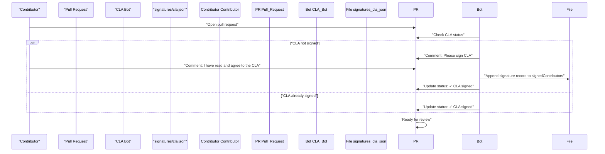
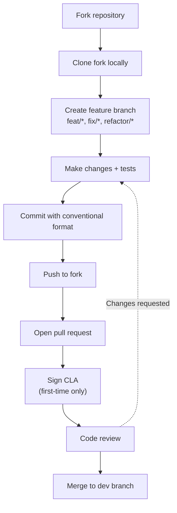
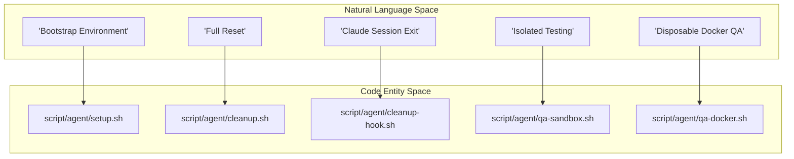
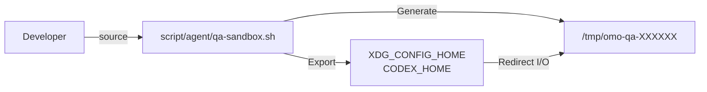

# Contributing

<details>
<summary>Relevant source files</summary>

The following files were used as context for generating this wiki page:

- [.agents/skills/codex-qa/references/docker-qa.md](https://github.com/code-yeongyu/oh-my-openagent/blob/HEAD/.agents/skills/codex-qa/references/docker-qa.md)
- [.agents/skills/opencode-qa/references/docker-qa.md](https://github.com/code-yeongyu/oh-my-openagent/blob/HEAD/.agents/skills/opencode-qa/references/docker-qa.md)
- [.claude/settings.json](https://github.com/code-yeongyu/oh-my-openagent/blob/HEAD/.claude/settings.json)
- [.codex/setup.sh](https://github.com/code-yeongyu/oh-my-openagent/blob/HEAD/.codex/setup.sh)
- [.cursor/environment.json](https://github.com/code-yeongyu/oh-my-openagent/blob/HEAD/.cursor/environment.json)
- [.devcontainer/Dockerfile](https://github.com/code-yeongyu/oh-my-openagent/blob/HEAD/.devcontainer/Dockerfile)
- [.devcontainer/README.md](https://github.com/code-yeongyu/oh-my-openagent/blob/HEAD/.devcontainer/README.md)
- [.devcontainer/devcontainer.json](https://github.com/code-yeongyu/oh-my-openagent/blob/HEAD/.devcontainer/devcontainer.json)
- [.devcontainer/qa-entrypoint.sh](https://github.com/code-yeongyu/oh-my-openagent/blob/HEAD/.devcontainer/qa-entrypoint.sh)
- [.devcontainer/qa.Dockerfile](https://github.com/code-yeongyu/oh-my-openagent/blob/HEAD/.devcontainer/qa.Dockerfile)
- [.env.example](https://github.com/code-yeongyu/oh-my-openagent/blob/HEAD/.env.example)
- [CLAUDE.md](https://github.com/code-yeongyu/oh-my-openagent/blob/HEAD/CLAUDE.md)
- [CONTRIBUTING.md](https://github.com/code-yeongyu/oh-my-openagent/blob/HEAD/CONTRIBUTING.md)
- [script/agent-cleanup-hook.test.ts](https://github.com/code-yeongyu/oh-my-openagent/blob/HEAD/script/agent-cleanup-hook.test.ts)
- [script/agent-env.test.ts](https://github.com/code-yeongyu/oh-my-openagent/blob/HEAD/script/agent-env.test.ts)
- [script/agent-harness-wiring.test.ts](https://github.com/code-yeongyu/oh-my-openagent/blob/HEAD/script/agent-harness-wiring.test.ts)
- [script/agent/cleanup-hook.sh](https://github.com/code-yeongyu/oh-my-openagent/blob/HEAD/script/agent/cleanup-hook.sh)
- [script/agent/cleanup.sh](https://github.com/code-yeongyu/oh-my-openagent/blob/HEAD/script/agent/cleanup.sh)
- [script/agent/docker-dev.sh](https://github.com/code-yeongyu/oh-my-openagent/blob/HEAD/script/agent/docker-dev.sh)
- [script/agent/qa-docker.sh](https://github.com/code-yeongyu/oh-my-openagent/blob/HEAD/script/agent/qa-docker.sh)
- [script/agent/qa-sandbox.sh](https://github.com/code-yeongyu/oh-my-openagent/blob/HEAD/script/agent/qa-sandbox.sh)
- [script/agent/setup.sh](https://github.com/code-yeongyu/oh-my-openagent/blob/HEAD/script/agent/setup.sh)
- [script/agents-md-dev-env.test.ts](https://github.com/code-yeongyu/oh-my-openagent/blob/HEAD/script/agents-md-dev-env.test.ts)
- [signatures/cla.json](https://github.com/code-yeongyu/oh-my-openagent/blob/HEAD/signatures/cla.json)

</details>


This page documents the contribution process for `oh-my-openagent`, including the CLA signature requirement, pull request workflow, code review expectations, and the technical conventions governing the project's development environment.

---

## CLA Signature Requirement

All external contributors must sign a Contributor License Agreement (CLA) before their pull requests can be merged. The CLA signature is tracked in `signatures/cla.json`, which maintains a record of all contributors who have signed, including their GitHub username, user ID, comment ID, timestamp, repository ID, and pull request number [signatures/cla.json:1-10](https://github.com/code-yeongyu/oh-my-openagent/blob/HEAD/signatures/cla.json#L1-L10).

### CLA Signature Process

Title: CLA Signature Workflow


**Sources:** [signatures/cla.json:1-10](https://github.com/code-yeongyu/oh-my-openagent/blob/HEAD/signatures/cla.json#L1-L10)

### CLA Signature Record Format

Each signature entry in `signedContributors` contains metadata required for legal verification of the contribution.

| Field | Type | Description |
|-------|------|-------------|
| `name` | string | GitHub username of the contributor [signatures/cla.json:4](https://github.com/code-yeongyu/oh-my-openagent/blob/HEAD/signatures/cla.json#L4) |
| `id` | number | Unique GitHub user ID [signatures/cla.json:5](https://github.com/code-yeongyu/oh-my-openagent/blob/HEAD/signatures/cla.json#L5) |
| `comment_id` | number | ID of the GitHub comment where the CLA was accepted [signatures/cla.json:6](https://github.com/code-yeongyu/oh-my-openagent/blob/HEAD/signatures/cla.json#L6) |
| `created_at` | string | ISO 8601 timestamp of the signature [signatures/cla.json:7](https://github.com/code-yeongyu/oh-my-openagent/blob/HEAD/signatures/cla.json#L7) |
| `repoId` | number | Internal repository ID (1108837393) [signatures/cla.json:8](https://github.com/code-yeongyu/oh-my-openagent/blob/HEAD/signatures/cla.json#L8) |
| `pullRequestNo` | number | The specific PR number where the signature was captured [signatures/cla.json:9](https://github.com/code-yeongyu/oh-my-openagent/blob/HEAD/signatures/cla.json#L9) |

**Sources:** [signatures/cla.json:1-10](https://github.com/code-yeongyu/oh-my-openagent/blob/HEAD/signatures/cla.json#L1-L10)

---

## Contribution Workflow

Title: Developer Contribution Lifecycle


### Development Prerequisites

The project strictly uses **Bun** as the package manager and runtime. 

1. **Bun**: 1.3.12 (CI-pinned) is the only package manager for the workspace [CONTRIBUTING.md:63](https://github.com/code-yeongyu/oh-my-openagent/blob/HEAD/CONTRIBUTING.md#L63).
2. **Node**: Version 24 is required for vendored packages (e.g., `lsp-tools-mcp`, `lsp-daemon`, `git-bash-mcp`) and the Codex plugin build [CONTRIBUTING.md:64](https://github.com/code-yeongyu/oh-my-openagent/blob/HEAD/CONTRIBUTING.md#L64).
3. **Git Submodules**: Required for frontend brand references [CONTRIBUTING.md:85](https://github.com/code-yeongyu/oh-my-openagent/blob/HEAD/CONTRIBUTING.md#L85).
4. **tmux**: Optional, but required for `interactive_bash` and Team Mode visualization [CONTRIBUTING.md:66](https://github.com/code-yeongyu/oh-my-openagent/blob/HEAD/CONTRIBUTING.md#L66).

```bash
# Setup
git clone --recurse-submodules https://github.com/code-yeongyu/oh-my-openagent.git
cd oh-my-openagent
bun install
bun run build
```

**Sources:** [CONTRIBUTING.md:61-86](https://github.com/code-yeongyu/oh-my-openagent/blob/HEAD/CONTRIBUTING.md#L61-L86)

---

## Development Environment Setup

The single source of truth for all development environments is the `script/agent/` dev-environment contract [CONTRIBUTING.md:142](https://github.com/code-yeongyu/oh-my-openagent/blob/HEAD/CONTRIBUTING.md#L142).

### Core Setup Scripts
- **`script/agent/setup.sh`**: Verifies toolchain (Bun 1.3.12, Node 24, Git), installs dependencies with `--ignore-scripts`, initializes submodules [script/agent/setup.sh:66](https://github.com/code-yeongyu/oh-my-openagent/blob/HEAD/script/agent/setup.sh#L66), materializes frontend references via `node packages/shared-skills/scripts/materialize-frontend-refs.mjs` [script/agent/setup.sh:68](https://github.com/code-yeongyu/oh-my-openagent/blob/HEAD/script/agent/setup.sh#L68), and builds the plugin if `dist/index.js` is missing [script/agent/setup.sh:70-75](https://github.com/code-yeongyu/oh-my-openagent/blob/HEAD/script/agent/setup.sh#L70-L75).
- **`script/agent/cleanup.sh`**: Removes transient artifacts. Use `--deep` to also remove `node_modules` and `dist` [CONTRIBUTING.md:128](https://github.com/code-yeongyu/oh-my-openagent/blob/HEAD/CONTRIBUTING.md#L128).
- **`script/agent/cleanup-hook.sh`**: A non-blocking launcher for `cleanup.sh` designed for Claude Code `SessionEnd` hooks to ensure cleanup doesn't block shutdown [script/agent/cleanup-hook.sh:2-10](https://github.com/code-yeongyu/oh-my-openagent/blob/HEAD/script/agent/cleanup-hook.sh#L2-L10).

### Harness Integration
The environment is wired into multiple platforms via specific configuration files:
- **GitHub Codespaces / Dev Containers**: Uses `.devcontainer/devcontainer.json` to run `setup.sh` as a `postCreateCommand` [script/agent-harness-wiring.test.ts:58-69](https://github.com/code-yeongyu/oh-my-openagent/blob/HEAD/script/agent-harness-wiring.test.ts#L58-L69).
- **Claude Code**: Uses `.claude/settings.json` for `SessionStart` (setup) and `SessionEnd` (cleanup via `cleanup-hook.sh`) [script/agent-harness-wiring.test.ts:33-45](https://github.com/code-yeongyu/oh-my-openagent/blob/HEAD/script/agent-harness-wiring.test.ts#L33-L45).
- **Cursor**: Uses `.cursor/environment.json` to run the setup script on environment creation [script/agent-harness-wiring.test.ts:22-31](https://github.com/code-yeongyu/oh-my-openagent/blob/HEAD/script/agent-harness-wiring.test.ts#L22-L31).
- **Codex App**: Uses `.codex/setup.sh` at the project root which delegates to the shared bootstrap [script/agent-harness-wiring.test.ts:47-56](https://github.com/code-yeongyu/oh-my-openagent/blob/HEAD/script/agent-harness-wiring.test.ts#L47-L56).

Title: Environment Script Association


**Sources:** [CONTRIBUTING.md:124-142](https://github.com/code-yeongyu/oh-my-openagent/blob/HEAD/CONTRIBUTING.md#L124-L142), [script/agent/setup.sh:1-78](https://github.com/code-yeongyu/oh-my-openagent/blob/HEAD/script/agent/setup.sh#L1-L78), [script/agent-harness-wiring.test.ts:21-70](https://github.com/code-yeongyu/oh-my-openagent/blob/HEAD/script/agent-harness-wiring.test.ts#L21-L70), [script/agent-harness-wiring.test.ts:33-45](https://github.com/code-yeongyu/oh-my-openagent/blob/HEAD/script/agent-harness-wiring.test.ts#L33-L45), [script/agent/cleanup-hook.sh:1-46](https://github.com/code-yeongyu/oh-my-openagent/blob/HEAD/script/agent/cleanup-hook.sh#L1-L46)

---

## Code Style and Conventions

| Category | Rule |
| :--- | :--- |
| **Language Policy** | **English only** for all communications (Issues, PRs, Comments) [CONTRIBUTING.md:36-43](https://github.com/code-yeongyu/oh-my-openagent/blob/HEAD/CONTRIBUTING.md#L36-L43) |
| **Package Manager** | **Bun only**; never use npm or yarn [CONTRIBUTING.md:78-79](https://github.com/code-yeongyu/oh-my-openagent/blob/HEAD/CONTRIBUTING.md#L78-L79) |
| **Credentials** | Use `.env` (copied from `.env.example`) for API keys; never commit keys [CONTRIBUTING.md:146-152](https://github.com/code-yeongyu/oh-my-openagent/blob/HEAD/CONTRIBUTING.md#L146-L152) |
| **Pathing** | Use absolute paths for local plugin loading in `opencode.jsonc` [CONTRIBUTING.md:115](https://github.com/code-yeongyu/oh-my-openagent/blob/HEAD/CONTRIBUTING.md#L115) |

**Sources:** [CONTRIBUTING.md:34-59](https://github.com/code-yeongyu/oh-my-openagent/blob/HEAD/CONTRIBUTING.md#L34-L59), [CONTRIBUTING.md:144-152](https://github.com/code-yeongyu/oh-my-openagent/blob/HEAD/CONTRIBUTING.md#L144-L152)

---

## QA Discipline and Testing

### QA Sandbox Isolation
For testing that must not touch the host's real configuration, use `source script/agent/qa-sandbox.sh` [CONTRIBUTING.md:154-157](https://github.com/code-yeongyu/oh-my-openagent/blob/HEAD/CONTRIBUTING.md#L154-L157).
- Exports isolated `XDG_*` directories (Data, Config, Cache, State) [script/agent-env.test.ts:47-49](https://github.com/code-yeongyu/oh-my-openagent/blob/HEAD/script/agent-env.test.ts#L47-L49).
- Points `CODEX_HOME` to a `mktemp` directory [script/agent-env.test.ts:46-50](https://github.com/code-yeongyu/oh-my-openagent/blob/HEAD/script/agent-env.test.ts#L46-L50).
- Sets `OPENCODE_DISABLE_AUTOUPDATE=1` and `OPENCODE_DISABLE_MODELS_FETCH=1` [script/agent-env.test.ts:51-52](https://github.com/code-yeongyu/oh-my-openagent/blob/HEAD/script/agent-env.test.ts#L51-L52).

### Docker QA Harness
For full structural isolation, `script/agent/qa-docker.sh` provides a disposable container environment [script/agent/qa-docker.sh:2-15](https://github.com/code-yeongyu/oh-my-openagent/blob/HEAD/script/agent/qa-docker.sh#L2-L15).
- Builds `omo-qa` image (from `.devcontainer/qa.Dockerfile`) containing the latest `opencode-ai` and `@openai/codex` [script/agent/qa-docker.sh:54-57](https://github.com/code-yeongyu/oh-my-openagent/blob/HEAD/script/agent/qa-docker.sh#L54-L57).
- Mounts host config (`~/.config/opencode`, `~/.codex`) as read-only and copies them to the container home [script/agent/qa-docker.sh:60-63](https://github.com/code-yeongyu/oh-my-openagent/blob/HEAD/script/agent/qa-docker.sh#L60-L63).
- Supports modes: `shell`, `serve` (HTTP API), `codex` (app-server driving via `app-server-drive.sh`), and `exec` [script/agent/qa-docker.sh:79-111](https://github.com/code-yeongyu/oh-my-openagent/blob/HEAD/script/agent/qa-docker.sh#L79-L111).

Title: QA Sandbox Data Flow


**Sources:** [CONTRIBUTING.md:154-160](https://github.com/code-yeongyu/oh-my-openagent/blob/HEAD/CONTRIBUTING.md#L154-L160), [script/agent/qa-docker.sh:1-112](https://github.com/code-yeongyu/oh-my-openagent/blob/HEAD/script/agent/qa-docker.sh#L1-L112), [.agents/skills/opencode-qa/references/docker-qa.md:1-45](https://github.com/code-yeongyu/oh-my-openagent/blob/HEAD/.agents/skills/opencode-qa/references/docker-qa.md#L1-L45), [script/agent-env.test.ts:39-56](https://github.com/code-yeongyu/oh-my-openagent/blob/HEAD/script/agent-env.test.ts#L39-L56)

---

## Code Review Expectations

### PR Checklist
- [ ] English language used throughout [CONTRIBUTING.md:36](https://github.com/code-yeongyu/oh-my-openagent/blob/HEAD/CONTRIBUTING.md#L36).
- [ ] `bun run build` succeeds [CONTRIBUTING.md:94](https://github.com/code-yeongyu/oh-my-openagent/blob/HEAD/CONTRIBUTING.md#L94).
- [ ] `bun test` passes (verified by `script/agent/setup.sh` readiness) [script/agent/setup.sh:77](https://github.com/code-yeongyu/oh-my-openagent/blob/HEAD/script/agent/setup.sh#L77).
- [ ] Submodules are correctly initialized and frontend references materialized via `script/agent/setup.sh` [script/agent/setup.sh:65-68](https://github.com/code-yeongyu/oh-my-openagent/blob/HEAD/script/agent/setup.sh#L65-L68).
- [ ] No sensitive credentials in `.env` are committed [CONTRIBUTING.md:146](https://github.com/code-yeongyu/oh-my-openagent/blob/HEAD/CONTRIBUTING.md#L146).

**Sources:** [CONTRIBUTING.md:25-27](https://github.com/code-yeongyu/oh-my-openagent/blob/HEAD/CONTRIBUTING.md#L25-L27), [script/agent/setup.sh:77-78](https://github.com/code-yeongyu/oh-my-openagent/blob/HEAD/script/agent/setup.sh#L77-L78), [CONTRIBUTING.md:34-43](https://github.com/code-yeongyu/oh-my-openagent/blob/HEAD/CONTRIBUTING.md#L34-L43)47:T