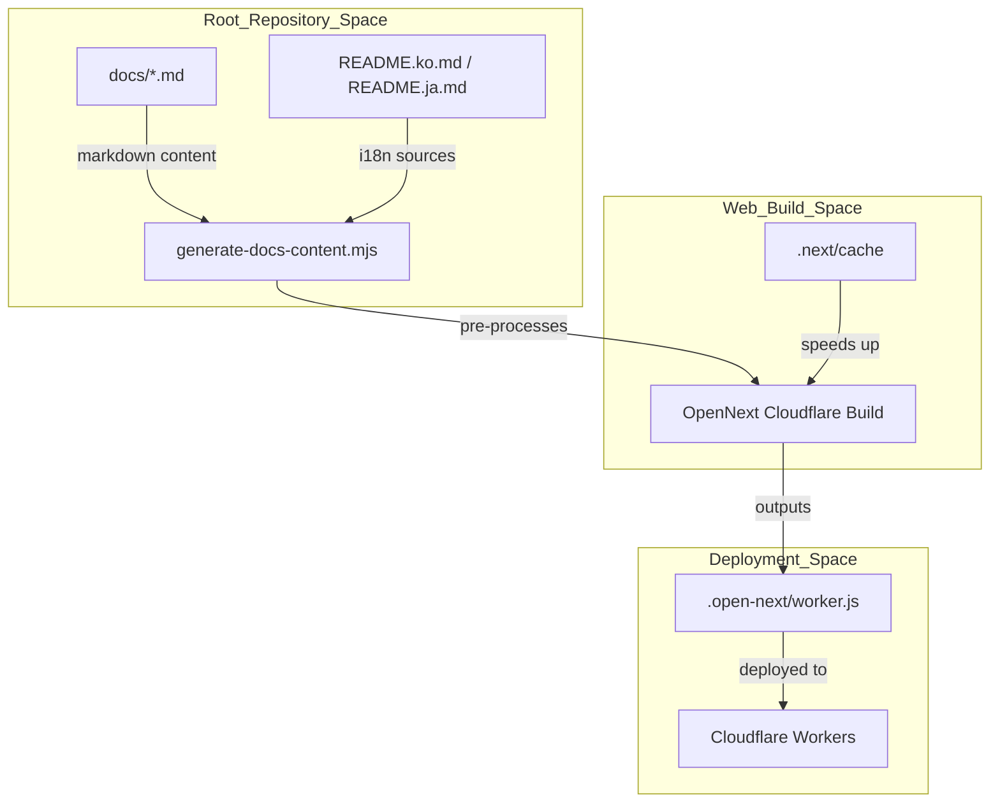
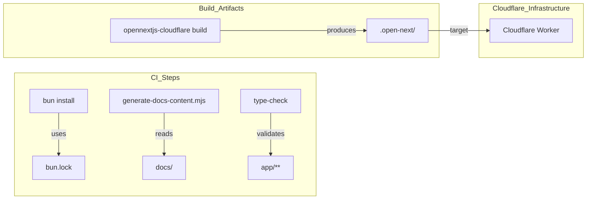
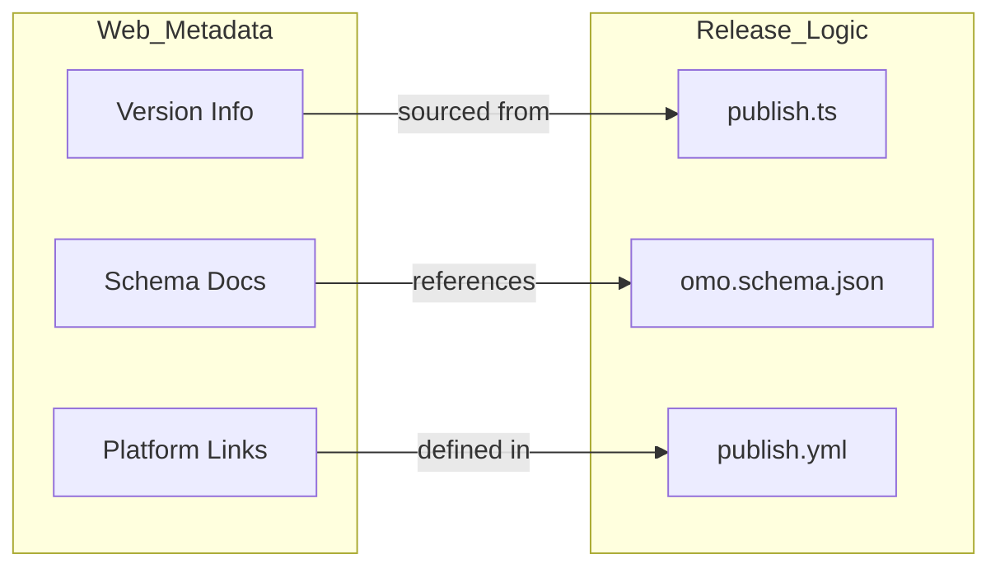

# Marketing Website

Relevant source files

The following files were used as context for generating this wiki page:

- [.agents/skills/work-with-pr-workspace/iteration-1/eval-5/with_skill/outputs/execution-plan.md](https://github.com/code-yeongyu/oh-my-openagent/blob/HEAD/.agents/skills/work-with-pr-workspace/iteration-1/eval-5/with_skill/outputs/execution-plan.md)
- [.github/scripts/write-job-summary.sh](https://github.com/code-yeongyu/oh-my-openagent/blob/HEAD/.github/scripts/write-job-summary.sh)
- [.github/workflows/ci.yml](https://github.com/code-yeongyu/oh-my-openagent/blob/HEAD/.github/workflows/ci.yml)
- [.github/workflows/cla.yml](https://github.com/code-yeongyu/oh-my-openagent/blob/HEAD/.github/workflows/cla.yml)
- [.github/workflows/lint-workflows.yml](https://github.com/code-yeongyu/oh-my-openagent/blob/HEAD/.github/workflows/lint-workflows.yml)
- [.github/workflows/package-labels.yml](https://github.com/code-yeongyu/oh-my-openagent/blob/HEAD/.github/workflows/package-labels.yml)
- [.github/workflows/publish-platform.yml](https://github.com/code-yeongyu/oh-my-openagent/blob/HEAD/.github/workflows/publish-platform.yml)
- [.github/workflows/publish.yml](https://github.com/code-yeongyu/oh-my-openagent/blob/HEAD/.github/workflows/publish.yml)
- [.github/workflows/refresh-model-capabilities.yml](https://github.com/code-yeongyu/oh-my-openagent/blob/HEAD/.github/workflows/refresh-model-capabilities.yml)
- [.github/workflows/sisyphus-agent.yml](https://github.com/code-yeongyu/oh-my-openagent/blob/HEAD/.github/workflows/sisyphus-agent.yml)
- [.github/workflows/web-ci.yml](https://github.com/code-yeongyu/oh-my-openagent/blob/HEAD/.github/workflows/web-ci.yml)
- [.github/workflows/web-deploy.yml](https://github.com/code-yeongyu/oh-my-openagent/blob/HEAD/.github/workflows/web-deploy.yml)
- [.omo/evidence/20260809-omo-agent-toolkit-rename/task-5.txt](https://github.com/code-yeongyu/oh-my-openagent/blob/HEAD/.omo/evidence/20260809-omo-agent-toolkit-rename/task-5.txt)
- [.opencode/skills/work-with-pr-workspace/iteration-1/eval-5/with_skill/outputs/execution-plan.md](https://github.com/code-yeongyu/oh-my-openagent/blob/HEAD/.opencode/skills/work-with-pr-workspace/iteration-1/eval-5/with_skill/outputs/execution-plan.md)
- [CHANGELOG.md](https://github.com/code-yeongyu/oh-my-openagent/blob/HEAD/CHANGELOG.md)
- [CLA.md](https://github.com/code-yeongyu/oh-my-openagent/blob/HEAD/CLA.md)
- [README.ja.md](https://github.com/code-yeongyu/oh-my-openagent/blob/HEAD/README.ja.md)
- [README.ko.md](https://github.com/code-yeongyu/oh-my-openagent/blob/HEAD/README.ko.md)
- [README.md](https://github.com/code-yeongyu/oh-my-openagent/blob/HEAD/README.md)
- [README.ru.md](https://github.com/code-yeongyu/oh-my-openagent/blob/HEAD/README.ru.md)
- [README.zh-cn.md](https://github.com/code-yeongyu/oh-my-openagent/blob/HEAD/README.zh-cn.md)
- [assets/oh-my-opencode.schema.json](https://github.com/code-yeongyu/oh-my-openagent/blob/HEAD/assets/oh-my-opencode.schema.json)
- [bin/oh-my-opencode.js](https://github.com/code-yeongyu/oh-my-openagent/blob/HEAD/bin/oh-my-opencode.js)
- [bin/oh-my-opencode.test.ts](https://github.com/code-yeongyu/oh-my-openagent/blob/HEAD/bin/oh-my-opencode.test.ts)
- [bin/platform.d.ts](https://github.com/code-yeongyu/oh-my-openagent/blob/HEAD/bin/platform.d.ts)
- [bin/platform.js](https://github.com/code-yeongyu/oh-my-openagent/blob/HEAD/bin/platform.js)
- [bin/platform.test.ts](https://github.com/code-yeongyu/oh-my-openagent/blob/HEAD/bin/platform.test.ts)
- [docs/examples/coding-focused.jsonc](https://github.com/code-yeongyu/oh-my-openagent/blob/HEAD/docs/examples/coding-focused.jsonc)
- [docs/examples/default.jsonc](https://github.com/code-yeongyu/oh-my-openagent/blob/HEAD/docs/examples/default.jsonc)
- [docs/examples/planning-focused.jsonc](https://github.com/code-yeongyu/oh-my-openagent/blob/HEAD/docs/examples/planning-focused.jsonc)
- [docs/guide/agent-model-matching.md](https://github.com/code-yeongyu/oh-my-openagent/blob/HEAD/docs/guide/agent-model-matching.md)
- [docs/guide/installation.md](https://github.com/code-yeongyu/oh-my-openagent/blob/HEAD/docs/guide/installation.md)
- [docs/guide/orchestration.md](https://github.com/code-yeongyu/oh-my-openagent/blob/HEAD/docs/guide/orchestration.md)
- [docs/guide/overview.md](https://github.com/code-yeongyu/oh-my-openagent/blob/HEAD/docs/guide/overview.md)
- [docs/guide/team-mode.md](https://github.com/code-yeongyu/oh-my-openagent/blob/HEAD/docs/guide/team-mode.md)
- [docs/reference/cli.md](https://github.com/code-yeongyu/oh-my-openagent/blob/HEAD/docs/reference/cli.md)
- [docs/reference/codex-telemetry.md](https://github.com/code-yeongyu/oh-my-openagent/blob/HEAD/docs/reference/codex-telemetry.md)
- [docs/reference/configuration.md](https://github.com/code-yeongyu/oh-my-openagent/blob/HEAD/docs/reference/configuration.md)
- [docs/reference/features.md](https://github.com/code-yeongyu/oh-my-openagent/blob/HEAD/docs/reference/features.md)
- [docs/reference/known-issues.md](https://github.com/code-yeongyu/oh-my-openagent/blob/HEAD/docs/reference/known-issues.md)
- [docs/reference/lazycodex-npm-reservation.md](https://github.com/code-yeongyu/oh-my-openagent/blob/HEAD/docs/reference/lazycodex-npm-reservation.md)
- [docs/reference/prompt-async-gate-rfc.md](https://github.com/code-yeongyu/oh-my-openagent/blob/HEAD/docs/reference/prompt-async-gate-rfc.md)
- [docs/reference/rules-injection-cross-module-comparison.md](https://github.com/code-yeongyu/oh-my-openagent/blob/HEAD/docs/reference/rules-injection-cross-module-comparison.md)
- [packages/oh-my-opencode-windows-arm64/bin/.gitkeep](https://github.com/code-yeongyu/oh-my-openagent/blob/HEAD/packages/oh-my-opencode-windows-arm64/bin/.gitkeep)
- [packages/omo-codex/README.md](https://github.com/code-yeongyu/oh-my-openagent/blob/HEAD/packages/omo-codex/README.md)
- [packages/omo-codex/plugin/README.md](https://github.com/code-yeongyu/oh-my-openagent/blob/HEAD/packages/omo-codex/plugin/README.md)
- [packages/omo-codex/tsconfig.json](https://github.com/code-yeongyu/oh-my-openagent/blob/HEAD/packages/omo-codex/tsconfig.json)
- [packages/omo-opencode/src/shared/markdown-link-audit.test.ts](https://github.com/code-yeongyu/oh-my-openagent/blob/HEAD/packages/omo-opencode/src/shared/markdown-link-audit.test.ts)
- [postinstall.mjs](https://github.com/code-yeongyu/oh-my-openagent/blob/HEAD/postinstall.mjs)
- [postinstall.test.ts](https://github.com/code-yeongyu/oh-my-openagent/blob/HEAD/postinstall.test.ts)
- [script/build-binaries.test.ts](https://github.com/code-yeongyu/oh-my-openagent/blob/HEAD/script/build-binaries.test.ts)
- [script/build-binaries.ts](https://github.com/code-yeongyu/oh-my-openagent/blob/HEAD/script/build-binaries.ts)
- [script/build-cli-node.test.ts](https://github.com/code-yeongyu/oh-my-openagent/blob/HEAD/script/build-cli-node.test.ts)
- [script/build-cli-node.ts](https://github.com/code-yeongyu/oh-my-openagent/blob/HEAD/script/build-cli-node.ts)
- [script/codex-test-script.test.ts](https://github.com/code-yeongyu/oh-my-openagent/blob/HEAD/script/codex-test-script.test.ts)
- [script/package-labels-workflow.test.ts](https://github.com/code-yeongyu/oh-my-openagent/blob/HEAD/script/package-labels-workflow.test.ts)
- [script/package-layout.test.ts](https://github.com/code-yeongyu/oh-my-openagent/blob/HEAD/script/package-layout.test.ts)
- [script/publish-lazycodex-sync-workflow.test.ts](https://github.com/code-yeongyu/oh-my-openagent/blob/HEAD/script/publish-lazycodex-sync-workflow.test.ts)
- [script/publish-lazycodex-workflow.test.ts](https://github.com/code-yeongyu/oh-my-openagent/blob/HEAD/script/publish-lazycodex-workflow.test.ts)
- [script/publish-workflow.test.ts](https://github.com/code-yeongyu/oh-my-openagent/blob/HEAD/script/publish-workflow.test.ts)
- [script/publish.ts](https://github.com/code-yeongyu/oh-my-openagent/blob/HEAD/script/publish.ts)
- [script/remove-stale-self-package-tests.test.ts](https://github.com/code-yeongyu/oh-my-openagent/blob/HEAD/script/remove-stale-self-package-tests.test.ts)
- [script/remove-stale-self-package-tests.ts](https://github.com/code-yeongyu/oh-my-openagent/blob/HEAD/script/remove-stale-self-package-tests.ts)
- [script/senpi-test-script.test.ts](https://github.com/code-yeongyu/oh-my-openagent/blob/HEAD/script/senpi-test-script.test.ts)

The marketing website for **oh-my-openagent** (accessible at [omo.dev](https://omo.dev) and [lazycodex.ai](https://lazycodex.ai)) serves as the public-facing documentation hub, landing page, and metadata provider for the ecosystem. It is a modern web application built with **Next.js 15**, optimized for high performance and global accessibility via **Cloudflare Workers**. It provides internationalization (i18n) support and dynamically renders documentation content sourced from the repository's guides and reference files [README.md:62-70](https://github.com/code-yeongyu/oh-my-openagent/blob/HEAD/README.md#L62-L70).

## Technical Stack

The website leverages a modern frontend stack designed for speed, type safety, and seamless deployment within the Cloudflare ecosystem.

| Component | Technology | Role |
| :--- | :--- | :--- |
| **Framework** | Next.js 15 | Core application framework |
| **Runtime** | Cloudflare Workers | Serverless execution environment via `@opennextjs/cloudflare` |
| **I18n** | next-intl | Internationalization and localization management (EN, KO, JA, ZH-CN) |
| **Styling** | Tailwind CSS 4 | Utility-first CSS framework |
| **Package Manager** | Bun | Dependency management and build execution (v1.3.12) |
| **Deployment** | Wrangler | Cloudflare CLI for Worker configuration |

The `Web CI` workflow confirms the stack requirements, specifically targeting the `packages/web` directory and utilizing `oven-sh/setup-bun@v2` with version `1.3.12` [.github/workflows/web-ci.yml:29-35](https://github.com/code-yeongyu/oh-my-openagent/blob/HEAD/.github/workflows/web-ci.yml#L29-L35).

Sources: [.github/workflows/web-ci.yml:1-35](https://github.com/code-yeongyu/oh-my-openagent/blob/HEAD/.github/workflows/web-ci.yml#L1-L35), [README.md:71](https://github.com/code-yeongyu/oh-my-openagent/blob/HEAD/README.md#L71)

## Architecture and Data Flow

The website functions as a documentation consumer. It processes markdown files from the codebase and renders them to maintain consistency with the CLI's TUI and the `AGENTS.md` instruction files [docs/reference/features.md:47-50](https://github.com/code-yeongyu/oh-my-openagent/blob/HEAD/docs/reference/features.md#L47-L50).

### Content Generation and Build Pipeline

The marketing site's content is synchronized with the core repository through a pre-build script `generate-docs-content.mjs`. This script extracts documentation from the root `docs/` directory and prepares it for the Next.js static generation process [.github/workflows/web-ci.yml:48-50](https://github.com/code-yeongyu/oh-my-openagent/blob/HEAD/.github/workflows/web-ci.yml#L48-L50).

Title: Documentation Sync to Web Space

Sources: [.github/workflows/web-ci.yml:40-64](https://github.com/code-yeongyu/oh-my-openagent/blob/HEAD/.github/workflows/web-ci.yml#L40-L64), [README.ko.md:1-71](https://github.com/code-yeongyu/oh-my-openagent/blob/HEAD/README.ko.md#L1-L71), [README.ja.md:1-72](https://github.com/code-yeongyu/oh-my-openagent/blob/HEAD/README.ja.md#L1-L72)

## Deployment Workflow

The website is deployed to Cloudflare Workers using the OpenNext adapter. The build process is validated in CI to ensure that formatting, linting, and type-checking pass before any deployment [.github/workflows/web-ci.yml:51-58](https://github.com/code-yeongyu/oh-my-openagent/blob/HEAD/.github/workflows/web-ci.yml#L51-L58).

### CI/CD Integration
The repository contains dedicated GitHub Actions for web maintenance:
- **Web CI**: Handles dependency installation, documentation generation, and build checks for the web package [.github/workflows/web-ci.yml:1-75](https://github.com/code-yeongyu/oh-my-openagent/blob/HEAD/.github/workflows/web-ci.yml#L1-L75).
- **Caching Strategy**: The workflow utilizes `actions/cache@v5` to store the Next.js build cache, keyed by configuration files like `next.config.ts` and `open-next.config.ts` [.github/workflows/web-ci.yml:40-47](https://github.com/code-yeongyu/oh-my-openagent/blob/HEAD/.github/workflows/web-ci.yml#L40-L47).
- **OpenNext Build**: The final step in the CI pipeline executes `bunx opennextjs-cloudflare build` to verify Cloudflare compatibility [.github/workflows/web-ci.yml:60-64](https://github.com/code-yeongyu/oh-my-openagent/blob/HEAD/.github/workflows/web-ci.yml#L60-L64).
- **Web Deploy**: A separate workflow (`web-deploy.yml`) handles the actual production push to Cloudflare [.github/workflows/web-deploy.yml:1-20](https://github.com/code-yeongyu/oh-my-openagent/blob/HEAD/.github/workflows/web-deploy.yml#L1-L20).

Title: Web Build Entity Mapping

Sources: [.github/workflows/web-ci.yml:37-64](https://github.com/code-yeongyu/oh-my-openagent/blob/HEAD/.github/workflows/web-ci.yml#L37-L64), [.github/workflows/web-deploy.yml:1-20](https://github.com/code-yeongyu/oh-my-openagent/blob/HEAD/.github/workflows/web-deploy.yml#L1-L20)

## Relationship to the npm Package

The marketing website acts as the primary landing page for the `oh-my-opencode` and `oh-my-openagent` packages, as well as the `lazycodex-ai` alias [README.md:1-9](https://github.com/code-yeongyu/oh-my-openagent/blob/HEAD/README.md#L1-L9).

1. **Version Synchronization**: The release workflow ensures that versions are bumped across all packages, including the 11 platform-specific binaries (e.g., `darwin-arm64`, `linux-x64-musl`), which the website then references for download links [.github/workflows/publish.yml:193-201](https://github.com/code-yeongyu/oh-my-openagent/blob/HEAD/.github/workflows/publish.yml#L193-L201).
2. **Schema Documentation**: The website hosts the configuration schemas, specifically the unified `omo.schema.json` which governs the `omo.jsonc` configuration system [docs/reference/configuration.md:84-90](https://github.com/code-yeongyu/oh-my-openagent/blob/HEAD/docs/reference/configuration.md#L84-L90).
3. **Download API**: The site provides an API endpoint for npm download badges (`omo.dev/api/npm-downloads`) displayed in the README [README.md:62](https://github.com/code-yeongyu/oh-my-openagent/blob/HEAD/README.md#L62).
4. **Release Provenance**: The website links to the GitHub releases created by the `publish` workflow, which includes OIDC-backed provenance for the npm packages [.github/workflows/publish.yml:184-210](https://github.com/code-yeongyu/oh-my-openagent/blob/HEAD/.github/workflows/publish.yml#L184-L210).

Title: Web to Core Package Mapping

Sources: [.github/workflows/publish.yml:1-41](https://github.com/code-yeongyu/oh-my-openagent/blob/HEAD/.github/workflows/publish.yml#L1-L41), [script/publish.ts:7-26](https://github.com/code-yeongyu/oh-my-openagent/blob/HEAD/script/publish.ts#L7-L26), [assets/oh-my-opencode.schema.json:1-10](https://github.com/code-yeongyu/oh-my-openagent/blob/HEAD/assets/oh-my-opencode.schema.json#L1-L10), [docs/reference/configuration.md:1-10](https://github.com/code-yeongyu/oh-my-openagent/blob/HEAD/docs/reference/configuration.md#L1-L10)