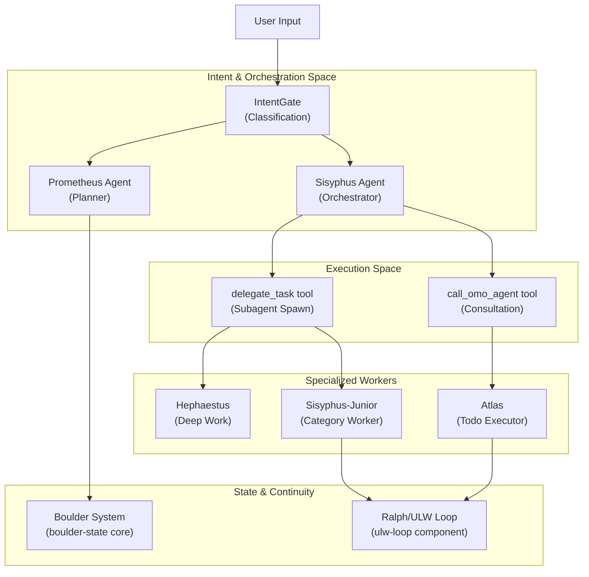
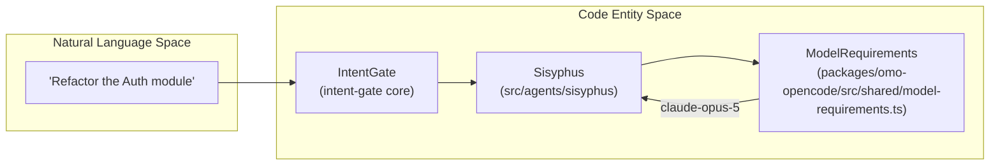

# Usage Workflows

Relevant source files

The following files were used as context for generating this wiki page:

- [.agents/skills/work-with-pr-workspace/iteration-1/eval-5/with_skill/outputs/execution-plan.md](https://github.com/code-yeongyu/oh-my-openagent/blob/HEAD/.agents/skills/work-with-pr-workspace/iteration-1/eval-5/with_skill/outputs/execution-plan.md)
- [.omo/evidence/20260809-omo-agent-toolkit-rename/task-5.txt](https://github.com/code-yeongyu/oh-my-openagent/blob/HEAD/.omo/evidence/20260809-omo-agent-toolkit-rename/task-5.txt)
- [.omo/evidence/20260810-omo-native-telemetry/task-3.md](https://github.com/code-yeongyu/oh-my-openagent/blob/HEAD/.omo/evidence/20260810-omo-native-telemetry/task-3.md)
- [.opencode/skills/work-with-pr-workspace/iteration-1/eval-5/with_skill/outputs/execution-plan.md](https://github.com/code-yeongyu/oh-my-openagent/blob/HEAD/.opencode/skills/work-with-pr-workspace/iteration-1/eval-5/with_skill/outputs/execution-plan.md)
- [CHANGELOG.md](https://github.com/code-yeongyu/oh-my-openagent/blob/HEAD/CHANGELOG.md)
- [README.ja.md](https://github.com/code-yeongyu/oh-my-openagent/blob/HEAD/README.ja.md)
- [README.ko.md](https://github.com/code-yeongyu/oh-my-openagent/blob/HEAD/README.ko.md)
- [README.md](https://github.com/code-yeongyu/oh-my-openagent/blob/HEAD/README.md)
- [README.ru.md](https://github.com/code-yeongyu/oh-my-openagent/blob/HEAD/README.ru.md)
- [README.zh-cn.md](https://github.com/code-yeongyu/oh-my-openagent/blob/HEAD/README.zh-cn.md)
- [assets/oh-my-opencode.schema.json](https://github.com/code-yeongyu/oh-my-openagent/blob/HEAD/assets/oh-my-opencode.schema.json)
- [docs/examples/coding-focused.jsonc](https://github.com/code-yeongyu/oh-my-openagent/blob/HEAD/docs/examples/coding-focused.jsonc)
- [docs/examples/default.jsonc](https://github.com/code-yeongyu/oh-my-openagent/blob/HEAD/docs/examples/default.jsonc)
- [docs/examples/planning-focused.jsonc](https://github.com/code-yeongyu/oh-my-openagent/blob/HEAD/docs/examples/planning-focused.jsonc)
- [docs/guide/agent-model-matching.md](https://github.com/code-yeongyu/oh-my-openagent/blob/HEAD/docs/guide/agent-model-matching.md)
- [docs/guide/installation.md](https://github.com/code-yeongyu/oh-my-openagent/blob/HEAD/docs/guide/installation.md)
- [docs/guide/orchestration.md](https://github.com/code-yeongyu/oh-my-openagent/blob/HEAD/docs/guide/orchestration.md)
- [docs/guide/overview.md](https://github.com/code-yeongyu/oh-my-openagent/blob/HEAD/docs/guide/overview.md)
- [docs/guide/team-mode.md](https://github.com/code-yeongyu/oh-my-openagent/blob/HEAD/docs/guide/team-mode.md)
- [docs/reference/cli.md](https://github.com/code-yeongyu/oh-my-openagent/blob/HEAD/docs/reference/cli.md)
- [docs/reference/codex-telemetry.md](https://github.com/code-yeongyu/oh-my-openagent/blob/HEAD/docs/reference/codex-telemetry.md)
- [docs/reference/configuration.md](https://github.com/code-yeongyu/oh-my-openagent/blob/HEAD/docs/reference/configuration.md)
- [docs/reference/features.md](https://github.com/code-yeongyu/oh-my-openagent/blob/HEAD/docs/reference/features.md)
- [docs/reference/known-issues.md](https://github.com/code-yeongyu/oh-my-openagent/blob/HEAD/docs/reference/known-issues.md)
- [docs/reference/prompt-async-gate-rfc.md](https://github.com/code-yeongyu/oh-my-openagent/blob/HEAD/docs/reference/prompt-async-gate-rfc.md)
- [docs/reference/rules-injection-cross-module-comparison.md](https://github.com/code-yeongyu/oh-my-openagent/blob/HEAD/docs/reference/rules-injection-cross-module-comparison.md)
- [packages/omo-codex/README.md](https://github.com/code-yeongyu/oh-my-openagent/blob/HEAD/packages/omo-codex/README.md)
- [packages/omo-codex/plugin/README.md](https://github.com/code-yeongyu/oh-my-openagent/blob/HEAD/packages/omo-codex/plugin/README.md)
- [packages/omo-codex/plugin/components/ultrawork/directive.md](https://github.com/code-yeongyu/oh-my-openagent/blob/HEAD/packages/omo-codex/plugin/components/ultrawork/directive.md)
- [packages/omo-codex/plugin/components/ultrawork/skills/ultrawork/SKILL.md](https://github.com/code-yeongyu/oh-my-openagent/blob/HEAD/packages/omo-codex/plugin/components/ultrawork/skills/ultrawork/SKILL.md)
- [packages/omo-codex/plugin/components/ulw-loop/directive.md](https://github.com/code-yeongyu/oh-my-openagent/blob/HEAD/packages/omo-codex/plugin/components/ulw-loop/directive.md)
- [packages/omo-codex/tsconfig.json](https://github.com/code-yeongyu/oh-my-openagent/blob/HEAD/packages/omo-codex/tsconfig.json)
- [packages/omo-opencode/src/shared/markdown-link-audit.test.ts](https://github.com/code-yeongyu/oh-my-openagent/blob/HEAD/packages/omo-opencode/src/shared/markdown-link-audit.test.ts)
- [packages/omo-senpi/plugin/scripts/embed-directive.mjs](https://github.com/code-yeongyu/oh-my-openagent/blob/HEAD/packages/omo-senpi/plugin/scripts/embed-directive.mjs)
- [packages/omo-senpi/skills/ultrawork/SKILL.md](https://github.com/code-yeongyu/oh-my-openagent/blob/HEAD/packages/omo-senpi/skills/ultrawork/SKILL.md)
- [packages/omo-senpi/src/components/ultrawork/generated-directive.ts](https://github.com/code-yeongyu/oh-my-openagent/blob/HEAD/packages/omo-senpi/src/components/ultrawork/generated-directive.ts)
- [packages/omo-senpi/src/components/ultrawork/index.ts](https://github.com/code-yeongyu/oh-my-openagent/blob/HEAD/packages/omo-senpi/src/components/ultrawork/index.ts)
- [packages/omo-senpi/src/components/ultrawork/ultrawork-arming.test.ts](https://github.com/code-yeongyu/oh-my-openagent/blob/HEAD/packages/omo-senpi/src/components/ultrawork/ultrawork-arming.test.ts)
- [packages/omo-senpi/src/components/ultrawork/ultrawork.test-support.ts](https://github.com/code-yeongyu/oh-my-openagent/blob/HEAD/packages/omo-senpi/src/components/ultrawork/ultrawork.test-support.ts)
- [packages/omo-senpi/src/components/ultrawork/ultrawork.test.ts](https://github.com/code-yeongyu/oh-my-openagent/blob/HEAD/packages/omo-senpi/src/components/ultrawork/ultrawork.test.ts)
- [packages/prompts-core/prompts/ultrawork/codex.md](https://github.com/code-yeongyu/oh-my-openagent/blob/HEAD/packages/prompts-core/prompts/ultrawork/codex.md)
- [packages/prompts-core/prompts/ultrawork/default.md](https://github.com/code-yeongyu/oh-my-openagent/blob/HEAD/packages/prompts-core/prompts/ultrawork/default.md)
- [packages/prompts-core/prompts/ultrawork/gemini.md](https://github.com/code-yeongyu/oh-my-openagent/blob/HEAD/packages/prompts-core/prompts/ultrawork/gemini.md)
- [packages/prompts-core/prompts/ultrawork/glm.md](https://github.com/code-yeongyu/oh-my-openagent/blob/HEAD/packages/prompts-core/prompts/ultrawork/glm.md)
- [packages/prompts-core/prompts/ultrawork/gpt.md](https://github.com/code-yeongyu/oh-my-openagent/blob/HEAD/packages/prompts-core/prompts/ultrawork/gpt.md)
- [postinstall.test.ts](https://github.com/code-yeongyu/oh-my-openagent/blob/HEAD/postinstall.test.ts)

This document covers common usage patterns and end-to-end workflows for different development scenarios in `oh-my-openagent`. It explains how agents are invoked, how work is delegated, and how the system ensures task completion through specialized orchestration layers.

For detailed information about individual agents and their specializations, see [Agents](11_3-agents.md). For configuration of workflow behavior, see [Configuration Reference](30_6-configuration-reference.md). For the underlying architecture of agent orchestration, see [Agent Orchestration](06_2.2-agent-orchestration.md).

## Overview

`oh-my-openagent` provides five primary workflow patterns, each optimized for different development scenarios:

| Workflow | Primary Agent | Entry Point | Use Case |
|----------|---------------|-------------|----------|
| **Ultrawork Mode** | Sisyphus | `/ultrawork` or `ulw` | Aggressive parallel execution until task completion [docs/guide/overview.md:134-140](https://github.com/code-yeongyu/oh-my-openagent/blob/HEAD/docs/guide/overview.md#L134-L140) |
| **Planning Workflow** | Prometheus | `@plan` / `/start-work` | Strategic planning and interview-mode requirement gathering [docs/guide/orchestration.md:106-111](https://github.com/code-yeongyu/oh-my-openagent/blob/HEAD/docs/guide/orchestration.md#L106-L111) |
| **Deep Work** | Hephaestus | `Ask @hephaestus` | Autonomous deep work and end-to-end execution [docs/guide/overview.md:91-97](https://github.com/code-yeongyu/oh-my-openagent/blob/HEAD/docs/guide/overview.md#L91-L97) |
| **Consultation** | Oracle, Explore | `@oracle`, `@explore` | Architecture decisions and codebase search [docs/reference/features.md:38-42](https://github.com/code-yeongyu/oh-my-openagent/blob/HEAD/docs/reference/features.md#L38-L42) |
| **CI/Headless** | CLI Runner | `oh-my-opencode run` | Automated/Non-interactive task execution and JSON output [README.md:109-112](https://github.com/code-yeongyu/oh-my-openagent/blob/HEAD/README.md#L109-L112) |

All workflows share common infrastructure:
- **IntentGate**: Classifies user intent to route requests to the correct agent or category [docs/guide/overview.md:57-59](https://github.com/code-yeongyu/oh-my-openagent/blob/HEAD/docs/guide/overview.md#L57-L59).
- **Boulder (boulder-state)**: A mechanism that tracks work progress to ensure session continuity and todo enforcement [docs/reference/configuration.md:104-104](https://github.com/code-yeongyu/oh-my-openagent/blob/HEAD/docs/reference/configuration.md#L104).
- **Category System**: Routes tasks by intent (e.g., `visual-engineering`, `ultrabrain`) to optimized models [docs/guide/overview.md:101-104](https://github.com/code-yeongyu/oh-my-openagent/blob/HEAD/docs/guide/overview.md#L101-L104).

Sources: [docs/guide/overview.md:132-153](https://github.com/code-yeongyu/oh-my-openagent/blob/HEAD/docs/guide/overview.md#L132-L153), [docs/guide/orchestration.md:7-26](https://github.com/code-yeongyu/oh-my-openagent/blob/HEAD/docs/guide/orchestration.md#L7-L26), [docs/reference/configuration.md:104-104](https://github.com/code-yeongyu/oh-my-openagent/blob/HEAD/docs/reference/configuration.md#L104)

## Workflow Execution Model

The following diagram bridges the user's natural language intent to the underlying code entities and orchestration logic within the `oh-my-openagent` ecosystem.

**Diagram: Workflow Execution Flow with Code Entities**

Sources: [docs/guide/overview.md:48-67](https://github.com/code-yeongyu/oh-my-openagent/blob/HEAD/docs/guide/overview.md#L48-L67), [docs/guide/orchestration.md:30-76](https://github.com/code-yeongyu/oh-my-openagent/blob/HEAD/docs/guide/orchestration.md#L30-L76), [docs/reference/features.md:7-32](https://github.com/code-yeongyu/oh-my-openagent/blob/HEAD/docs/reference/features.md#L7-L32), [docs/reference/configuration.md:104-104](https://github.com/code-yeongyu/oh-my-openagent/blob/HEAD/docs/reference/configuration.md#L104)

---

## Sub-Pages

### 9.1 [Ultrawork Mode](51_9.1-ultrawork-mode.md)
Ultrawork mode (activated by `/ultrawork` or `ulw`) is the "just do it" mode. It engages Sisyphus to explore the codebase, research patterns, implement features, and verify results automatically [docs/guide/overview.md:134-140](https://github.com/code-yeongyu/oh-my-openagent/blob/HEAD/docs/guide/overview.md#L134-L140). In the Codex Light edition, it relies on the `ultrawork` component and its specific `directive.md` for outcome-first execution [packages/omo-codex/plugin/components/ultrawork/directive.md:3-6](https://github.com/code-yeongyu/oh-my-openagent/blob/HEAD/packages/omo-codex/plugin/components/ultrawork/directive.md#L3-L6). It can be configured via `default_mode` to auto-activate on every session [assets/oh-my-opencode.schema.json:14-16](https://github.com/code-yeongyu/oh-my-openagent/blob/HEAD/assets/oh-my-opencode.schema.json#L14-L16).

For details, see [Ultrawork Mode](51_9.1-ultrawork-mode.md).
Sources: [docs/guide/overview.md:77-90](https://github.com/code-yeongyu/oh-my-openagent/blob/HEAD/docs/guide/overview.md#L77-L90), [assets/oh-my-opencode.schema.json:14-31](https://github.com/code-yeongyu/oh-my-openagent/blob/HEAD/assets/oh-my-opencode.schema.json#L14-L31), [packages/omo-codex/plugin/components/ultrawork/directive.md:1-24](https://github.com/code-yeongyu/oh-my-openagent/blob/HEAD/packages/omo-codex/plugin/components/ultrawork/directive.md#L1-L24)

### 9.2 [Planning Workflow](52_9.2-planning-workflow.md)
The planning workflow uses Prometheus to interview the user and identify scope, ambiguities, and technical approaches [docs/guide/orchestration.md:106-111](https://github.com/code-yeongyu/oh-my-openagent/blob/HEAD/docs/guide/orchestration.md#L106-L111). Once a plan is generated in `.omo/plans/`, the `/start-work` command activates Atlas to coordinate the execution of the plan's todo items [docs/guide/orchestration.md:112-117](https://github.com/code-yeongyu/oh-my-openagent/blob/HEAD/docs/guide/orchestration.md#L112-L117). The workflow often involves Metis for gap analysis and Momus for plan review [docs/guide/orchestration.md:38-40](https://github.com/code-yeongyu/oh-my-openagent/blob/HEAD/docs/guide/orchestration.md#L38-L40).

For details, see [Planning Workflow](52_9.2-planning-workflow.md).
Sources: [docs/guide/orchestration.md:104-142](https://github.com/code-yeongyu/oh-my-openagent/blob/HEAD/docs/guide/orchestration.md#L104-L142), [docs/guide/overview.md:106-117](https://github.com/code-yeongyu/oh-my-openagent/blob/HEAD/docs/guide/overview.md#L106-L117)

### 9.3 [Deep Work with Hephaestus](53_9.3-deep-work-with-hephaestus.md)
Hephaestus is the autonomous deep worker optimized for GPT-5.6 Sol [docs/guide/overview.md:91-97](https://github.com/code-yeongyu/oh-my-openagent/blob/HEAD/docs/guide/overview.md#L91-L97). This workflow is designed for complex debugging and architectural reasoning where the agent works independently for extended periods, researching patterns before taking action [docs/guide/agent-model-matching.md:64-73](https://github.com/code-yeongyu/oh-my-openagent/blob/HEAD/docs/guide/agent-model-matching.md#L64-L73). It uses a goal-driven execution model rather than a recipe-following one [docs/guide/overview.md:96-98](https://github.com/code-yeongyu/oh-my-openagent/blob/HEAD/docs/guide/overview.md#L96-L98).

For details, see [Deep Work with Hephaestus](53_9.3-deep-work-with-hephaestus.md).
Sources: [docs/guide/overview.md:91-98](https://github.com/code-yeongyu/oh-my-openagent/blob/HEAD/docs/guide/overview.md#L91-L98), [docs/guide/agent-model-matching.md:64-75](https://github.com/code-yeongyu/oh-my-openagent/blob/HEAD/docs/guide/agent-model-matching.md#L64-L75)

### 9.4 [Debugging and Consultation](54_9.4-debugging-and-consultation.md)
This workflow uses specialized agents for targeted assistance. **Oracle** provides high-IQ architectural consultation [docs/reference/features.md:15](https://github.com/code-yeongyu/oh-my-openagent/blob/HEAD/docs/reference/features.md#L15), while **Librarian** handles documentation lookups and OSS examples [docs/reference/features.md:16](https://github.com/code-yeongyu/oh-my-openagent/blob/HEAD/docs/reference/features.md#L16). The `debugging` skill can be loaded to provide hypothesis-driven runtime debugging workflows [docs/reference/configuration.md:21-23](https://github.com/code-yeongyu/oh-my-openagent/blob/HEAD/docs/reference/configuration.md#L21-L23). These agents have specific tool restrictions, typically being read-only to prevent unintended modifications [docs/reference/features.md:37-44](https://github.com/code-yeongyu/oh-my-openagent/blob/HEAD/docs/reference/features.md#L37-L44).

For details, see [Debugging and Consultation](54_9.4-debugging-and-consultation.md).
Sources: [docs/reference/features.md:13-17](https://github.com/code-yeongyu/oh-my-openagent/blob/HEAD/docs/reference/features.md#L13-L17), [docs/guide/overview.md:118-128](https://github.com/code-yeongyu/oh-my-openagent/blob/HEAD/docs/guide/overview.md#L118-L128), [docs/reference/features.md:37-45](https://github.com/code-yeongyu/oh-my-openagent/blob/HEAD/docs/reference/features.md#L37-L45)

### 9.5 [Non-Interactive and CI Mode](55_9.5-non-interactive-and-ci-mode.md)
The `oh-my-opencode run` command enables automated workflows suitable for CI pipelines. It supports event streaming, completion detection, and JSON output for integration with external automation tools [README.md:109-112](https://github.com/code-yeongyu/oh-my-openagent/blob/HEAD/README.md#L109-L112). This mode leverages the same orchestration logic but without the interactive TUI requirements, often used with `--no-tui` and `--codex-autonomous` flags in Light edition [docs/guide/installation.md:37-39](https://github.com/code-yeongyu/oh-my-openagent/blob/HEAD/docs/guide/installation.md#L37-L39).

For details, see [Non-Interactive and CI Mode](55_9.5-non-interactive-and-ci-mode.md).
Sources: [README.md:103-112](https://github.com/code-yeongyu/oh-my-openagent/blob/HEAD/README.md#L103-L112), [docs/guide/installation.md:31-39](https://github.com/code-yeongyu/oh-my-openagent/blob/HEAD/docs/guide/installation.md#L31-L39)

---

## Model-Agent Alignment

Every workflow is underpinned by specific model-agent pairings to ensure the "personality" of the model matches the requirements of the task.

| Agent | Model Family | Working Style |
|-------|--------------|---------------|
| **Sisyphus** | Claude / Kimi | Mechanics-driven: Follows complex 1,100-line checklists [docs/guide/agent-model-matching.md:51-56](https://github.com/code-yeongyu/oh-my-openagent/blob/HEAD/docs/guide/agent-model-matching.md#L51-L56) |
| **Hephaestus** | GPT-5.x | Principle-driven: Autonomous execution with minimal hand-holding [docs/guide/agent-model-matching.md:68-73](https://github.com/code-yeongyu/oh-my-openagent/blob/HEAD/docs/guide/agent-model-matching.md#L68-L73) |
| **Prometheus** | Claude / GPT | Strategic: Interview-based discovery and planning [docs/guide/orchestration.md:38-38](https://github.com/code-yeongyu/oh-my-openagent/blob/HEAD/docs/guide/orchestration.md#L38) |
| **Explore/Librarian** | GPT-5.6 Luna | Speed-driven: Fast codebase grep and documentation search [docs/reference/features.md:16-17](https://github.com/code-yeongyu/oh-my-openagent/blob/HEAD/docs/reference/features.md#L16-L17) |

**Diagram: Intent to Model Resolution**

Sources: [docs/guide/agent-model-matching.md:39-45](https://github.com/code-yeongyu/oh-my-openagent/blob/HEAD/docs/guide/agent-model-matching.md#L39-L45), [docs/guide/agent-model-matching.md:77-79](https://github.com/code-yeongyu/oh-my-openagent/blob/HEAD/docs/guide/agent-model-matching.md#L77-L79), [docs/reference/features.md:11-32](https://github.com/code-yeongyu/oh-my-openagent/blob/HEAD/docs/reference/features.md#L11-L32), [docs/guide/orchestration.md:80-80](https://github.com/code-yeongyu/oh-my-openagent/blob/HEAD/docs/guide/orchestration.md#L80)