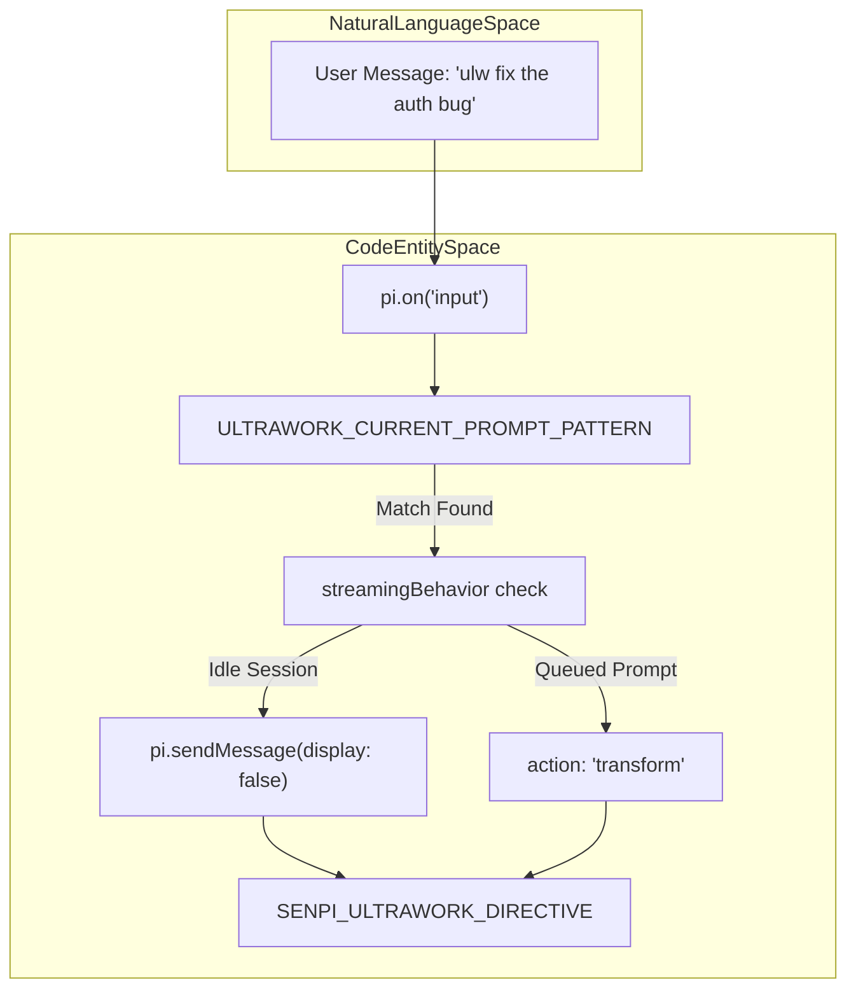
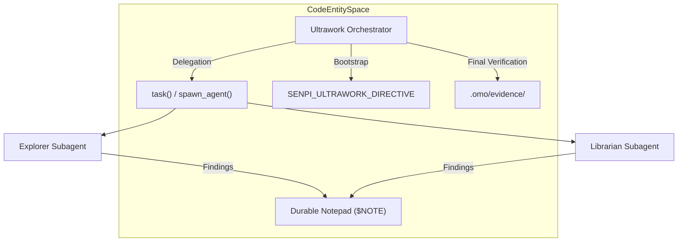

# Ultrawork Mode

Relevant source files

The following files were used as context for generating this wiki page:

- [.omo/evidence/20260810-omo-native-telemetry/task-3.md](https://github.com/code-yeongyu/oh-my-openagent/blob/HEAD/.omo/evidence/20260810-omo-native-telemetry/task-3.md)
- [packages/omo-codex/plugin/components/ultrawork/agents/explorer.toml](https://github.com/code-yeongyu/oh-my-openagent/blob/HEAD/packages/omo-codex/plugin/components/ultrawork/agents/explorer.toml)
- [packages/omo-codex/plugin/components/ultrawork/agents/librarian.toml](https://github.com/code-yeongyu/oh-my-openagent/blob/HEAD/packages/omo-codex/plugin/components/ultrawork/agents/librarian.toml)
- [packages/omo-codex/plugin/components/ultrawork/agents/metis.toml](https://github.com/code-yeongyu/oh-my-openagent/blob/HEAD/packages/omo-codex/plugin/components/ultrawork/agents/metis.toml)
- [packages/omo-codex/plugin/components/ultrawork/agents/momus.toml](https://github.com/code-yeongyu/oh-my-openagent/blob/HEAD/packages/omo-codex/plugin/components/ultrawork/agents/momus.toml)
- [packages/omo-codex/plugin/components/ultrawork/agents/plan.toml](https://github.com/code-yeongyu/oh-my-openagent/blob/HEAD/packages/omo-codex/plugin/components/ultrawork/agents/plan.toml)
- [packages/omo-codex/plugin/components/ultrawork/directive.md](https://github.com/code-yeongyu/oh-my-openagent/blob/HEAD/packages/omo-codex/plugin/components/ultrawork/directive.md)
- [packages/omo-codex/plugin/components/ultrawork/scripts/sync-directive.mjs](https://github.com/code-yeongyu/oh-my-openagent/blob/HEAD/packages/omo-codex/plugin/components/ultrawork/scripts/sync-directive.mjs)
- [packages/omo-codex/plugin/components/ultrawork/skills/ultrawork/SKILL.md](https://github.com/code-yeongyu/oh-my-openagent/blob/HEAD/packages/omo-codex/plugin/components/ultrawork/skills/ultrawork/SKILL.md)
- [packages/omo-codex/plugin/components/ultrawork/src/cli.ts](https://github.com/code-yeongyu/oh-my-openagent/blob/HEAD/packages/omo-codex/plugin/components/ultrawork/src/cli.ts)
- [packages/omo-codex/plugin/components/ultrawork/src/codex-hook.ts](https://github.com/code-yeongyu/oh-my-openagent/blob/HEAD/packages/omo-codex/plugin/components/ultrawork/src/codex-hook.ts)
- [packages/omo-codex/plugin/components/ultrawork/src/directive.ts](https://github.com/code-yeongyu/oh-my-openagent/blob/HEAD/packages/omo-codex/plugin/components/ultrawork/src/directive.ts)
- [packages/omo-codex/plugin/components/ultrawork/src/skill-pointer.ts](https://github.com/code-yeongyu/oh-my-openagent/blob/HEAD/packages/omo-codex/plugin/components/ultrawork/src/skill-pointer.ts)
- [packages/omo-codex/plugin/components/ultrawork/test/codex-hook-test-helpers.ts](https://github.com/code-yeongyu/oh-my-openagent/blob/HEAD/packages/omo-codex/plugin/components/ultrawork/test/codex-hook-test-helpers.ts)
- [packages/omo-codex/plugin/components/ultrawork/test/codex-hook-trigger-policy.test.ts](https://github.com/code-yeongyu/oh-my-openagent/blob/HEAD/packages/omo-codex/plugin/components/ultrawork/test/codex-hook-trigger-policy.test.ts)
- [packages/omo-codex/plugin/components/ultrawork/test/codex-hook.test.ts](https://github.com/code-yeongyu/oh-my-openagent/blob/HEAD/packages/omo-codex/plugin/components/ultrawork/test/codex-hook.test.ts)
- [packages/omo-codex/plugin/components/ultrawork/test/directive-source.test.ts](https://github.com/code-yeongyu/oh-my-openagent/blob/HEAD/packages/omo-codex/plugin/components/ultrawork/test/directive-source.test.ts)
- [packages/omo-codex/plugin/components/ultrawork/test/package-smoke.test.ts](https://github.com/code-yeongyu/oh-my-openagent/blob/HEAD/packages/omo-codex/plugin/components/ultrawork/test/package-smoke.test.ts)
- [packages/omo-codex/plugin/components/ultrawork/test/skill-pointer.test.ts](https://github.com/code-yeongyu/oh-my-openagent/blob/HEAD/packages/omo-codex/plugin/components/ultrawork/test/skill-pointer.test.ts)
- [packages/omo-codex/plugin/components/ulw-loop/directive.md](https://github.com/code-yeongyu/oh-my-openagent/blob/HEAD/packages/omo-codex/plugin/components/ulw-loop/directive.md)
- [packages/omo-senpi/plugin/scripts/embed-directive.mjs](https://github.com/code-yeongyu/oh-my-openagent/blob/HEAD/packages/omo-senpi/plugin/scripts/embed-directive.mjs)
- [packages/omo-senpi/skills/ultrawork/SKILL.md](https://github.com/code-yeongyu/oh-my-openagent/blob/HEAD/packages/omo-senpi/skills/ultrawork/SKILL.md)
- [packages/omo-senpi/src/components/ultrawork/generated-directive.ts](https://github.com/code-yeongyu/oh-my-openagent/blob/HEAD/packages/omo-senpi/src/components/ultrawork/generated-directive.ts)
- [packages/omo-senpi/src/components/ultrawork/index.ts](https://github.com/code-yeongyu/oh-my-openagent/blob/HEAD/packages/omo-senpi/src/components/ultrawork/index.ts)
- [packages/omo-senpi/src/components/ultrawork/ultrawork-arming.test.ts](https://github.com/code-yeongyu/oh-my-openagent/blob/HEAD/packages/omo-senpi/src/components/ultrawork/ultrawork-arming.test.ts)
- [packages/omo-senpi/src/components/ultrawork/ultrawork.test-support.ts](https://github.com/code-yeongyu/oh-my-openagent/blob/HEAD/packages/omo-senpi/src/components/ultrawork/ultrawork.test-support.ts)
- [packages/omo-senpi/src/components/ultrawork/ultrawork.test.ts](https://github.com/code-yeongyu/oh-my-openagent/blob/HEAD/packages/omo-senpi/src/components/ultrawork/ultrawork.test.ts)
- [packages/prompts-core/prompts/ultrawork/codex.md](https://github.com/code-yeongyu/oh-my-openagent/blob/HEAD/packages/prompts-core/prompts/ultrawork/codex.md)
- [packages/prompts-core/prompts/ultrawork/default.md](https://github.com/code-yeongyu/oh-my-openagent/blob/HEAD/packages/prompts-core/prompts/ultrawork/default.md)
- [packages/prompts-core/prompts/ultrawork/gemini.md](https://github.com/code-yeongyu/oh-my-openagent/blob/HEAD/packages/prompts-core/prompts/ultrawork/gemini.md)
- [packages/prompts-core/prompts/ultrawork/glm.md](https://github.com/code-yeongyu/oh-my-openagent/blob/HEAD/packages/prompts-core/prompts/ultrawork/glm.md)
- [packages/prompts-core/prompts/ultrawork/gpt.md](https://github.com/code-yeongyu/oh-my-openagent/blob/HEAD/packages/prompts-core/prompts/ultrawork/gpt.md)

Ultrawork mode is the primary autonomous workflow in `oh-my-openagent`, designed to engage all available agents in aggressive parallel execution until a task reaches completion. It transforms the AI from a simple chat assistant into a multi-agent orchestrator that manages background tasks, specialized experts, and iterative loops with an "outcome-first, evidence-bound" discipline.

---

## Overview

Ultrawork mode (`/ultrawork` or `ulw`) activates a high-rigor multi-agent system that:

1.  **Enforces Orchestration**: The agent acts as a conductor, delegating all implementation, testing, and QA to subagents via the `multi_agent_v1.spawn_agent` (Codex) or `task()` (OpenCode/Senpi) tools [packages/omo-senpi/src/components/ultrawork/generated-directive.ts:135-145](https://github.com/code-yeongyu/oh-my-openagent/blob/HEAD/packages/omo-senpi/src/components/ultrawork/generated-directive.ts#L135-L145).
2.  **Mandates Evidence**: Completion is defined by observable evidence (HTTP calls, tmux transcripts, browser screenshots) rather than just passing tests. "TESTS ALONE NEVER PROVE DONE" [packages/omo-codex/plugin/components/ultrawork/directive.md:15-17](https://github.com/code-yeongyu/oh-my-openagent/blob/HEAD/packages/omo-codex/plugin/components/ultrawork/directive.md#L15-L17).
3.  **Tiered Rigor**: Automatically classifies tasks into **LIGHT** (narrow changes, direct planning) or **HEAVY** (architectural changes, multi-agent wave planning via the `plan` agent) [packages/prompts-core/prompts/ultrawork/codex.md:25-50](https://github.com/code-yeongyu/oh-my-openagent/blob/HEAD/packages/prompts-core/prompts/ultrawork/codex.md#L25-L50).
4.  **Durable Memory**: Uses a persistent notepad (via `mktemp`) to survive context window compactions and maintain state across turns [packages/omo-codex/plugin/components/ultrawork/directive.md:144-165](https://github.com/code-yeongyu/oh-my-openagent/blob/HEAD/packages/omo-codex/plugin/components/ultrawork/directive.md#L144-L165).
5.  **Auto-Activation**: Can be set via the `default_mode` configuration to auto-activate on every session, ensuring high-rigor discipline by default [packages/omo-codex/plugin/components/ultrawork/skills/ultrawork/SKILL.md:3-6](https://github.com/code-yeongyu/oh-my-openagent/blob/HEAD/packages/omo-codex/plugin/components/ultrawork/skills/ultrawork/SKILL.md#L3-L6).

Sources: [packages/omo-codex/plugin/components/ultrawork/directive.md:1-165](https://github.com/code-yeongyu/oh-my-openagent/blob/HEAD/packages/omo-codex/plugin/components/ultrawork/directive.md#L1-L165), [packages/prompts-core/prompts/ultrawork/codex.md:1-120](https://github.com/code-yeongyu/oh-my-openagent/blob/HEAD/packages/prompts-core/prompts/ultrawork/codex.md#L1-L120), [packages/omo-senpi/src/components/ultrawork/generated-directive.ts:11-50](https://github.com/code-yeongyu/oh-my-openagent/blob/HEAD/packages/omo-senpi/src/components/ultrawork/generated-directive.ts#L11-L50)

---

## Triggering and Detection

### Invocation and Hook Logic

Ultrawork is triggered when the user includes `ulw` or `ultrawork` in their prompt. The system uses regex patterns to detect these triggers while avoiding false positives like the `ulw-` skill family (e.g., `ulw-plan`) [packages/omo-senpi/src/components/ultrawork/index.ts:7-8](https://github.com/code-yeongyu/oh-my-openagent/blob/HEAD/packages/omo-senpi/src/components/ultrawork/index.ts#L7-L8).

**Natural Language to Code Entity Space: Keyword Detection & Directive Injection**

### Harness-Specific Injection
*   **Codex/OpenCode**: Injects the directive via a `UserPromptSubmit` hook [packages/omo-codex/plugin/components/ultrawork/src/codex-hook.ts:3-10](https://github.com/code-yeongyu/oh-my-openagent/blob/HEAD/packages/omo-codex/plugin/components/ultrawork/src/codex-hook.ts#L3-L10). It ensures idempotency by checking for existing `<ultrawork-mode>` tags in the transcript [packages/omo-codex/plugin/components/ultrawork/test/codex-hook.test.ts:56-76](https://github.com/code-yeongyu/oh-my-openagent/blob/HEAD/packages/omo-codex/plugin/components/ultrawork/test/codex-hook.test.ts#L56-L76). The hook is bundled as a CLI tool `omo-ultrawork` which executes during the prompt submission lifecycle [packages/omo-codex/plugin/components/ultrawork/test/package-smoke.test.ts:27-37](https://github.com/code-yeongyu/oh-my-openagent/blob/HEAD/packages/omo-codex/plugin/components/ultrawork/test/package-smoke.test.ts#L27-L37).
*   **Senpi**: Handles triggers via `createUltraworkComponent` [packages/omo-senpi/src/components/ultrawork/index.ts:120-141](https://github.com/code-yeongyu/oh-my-openagent/blob/HEAD/packages/omo-senpi/src/components/ultrawork/index.ts#L120-L141). If the session is idle, it sends the directive as a **hidden custom message** (`omo-ultrawork:directive`, `display: false`) so it doesn't clutter the UI [packages/omo-senpi/src/components/ultrawork/index.ts:12-13](https://github.com/code-yeongyu/oh-my-openagent/blob/HEAD/packages/omo-senpi/src/components/ultrawork/index.ts#L12-L13). If the prompt is queued (mid-stream), it appends the directive atomically to the prompt text using an `action: "transform"` result [packages/omo-senpi/src/components/ultrawork/index.ts:54-55](https://github.com/code-yeongyu/oh-my-openagent/blob/HEAD/packages/omo-senpi/src/components/ultrawork/index.ts#L54-L55).

### Session Arming Ledger
To prevent redundant token burn (re-injecting ~17KB of rules), the Senpi harness maintains a `SessionArming` ledger [packages/omo-senpi/src/components/ultrawork/index.ts:65-72](https://github.com/code-yeongyu/oh-my-openagent/blob/HEAD/packages/omo-senpi/src/components/ultrawork/index.ts#L65-L72). This ledger is stored on `globalThis` using a `Symbol.for("omo.ultrawork.arming")` to survive extension reloads [packages/omo-senpi/src/components/ultrawork/index.ts:87-92](https://github.com/code-yeongyu/oh-my-openagent/blob/HEAD/packages/omo-senpi/src/components/ultrawork/index.ts#L87-L92). It tracks which sessions have already received the full directive and instead provides a short `ULTRAWORK_REMINDER` for subsequent turns [packages/omo-senpi/src/components/ultrawork/index.ts:19-20](https://github.com/code-yeongyu/oh-my-openagent/blob/HEAD/packages/omo-senpi/src/components/ultrawork/index.ts#L19-L20).

Sources: [packages/omo-senpi/src/components/ultrawork/index.ts:7-141](https://github.com/code-yeongyu/oh-my-openagent/blob/HEAD/packages/omo-senpi/src/components/ultrawork/index.ts#L7-L141), [packages/omo-senpi/src/components/ultrawork/generated-directive.ts:1-9](https://github.com/code-yeongyu/oh-my-openagent/blob/HEAD/packages/omo-senpi/src/components/ultrawork/generated-directive.ts#L1-L9), [packages/omo-codex/plugin/components/ultrawork/skills/ultrawork/SKILL.md:1-6](https://github.com/code-yeongyu/oh-my-openagent/blob/HEAD/packages/omo-codex/plugin/components/ultrawork/skills/ultrawork/SKILL.md#L1-L6), [packages/omo-codex/plugin/components/ultrawork/test/package-smoke.test.ts:27-37](https://github.com/code-yeongyu/oh-my-openagent/blob/HEAD/packages/omo-codex/plugin/components/ultrawork/test/package-smoke.test.ts#L27-L37), [packages/omo-codex/plugin/components/ultrawork/test/codex-hook.test.ts:56-76](https://github.com/code-yeongyu/oh-my-openagent/blob/HEAD/packages/omo-codex/plugin/components/ultrawork/test/codex-hook.test.ts#L56-L76)

---

## The Ultrawork Execution Loop

Once activated, the agent follows a strict protocol defined in the model-specific prompts [packages/prompts-core/prompts/ultrawork/gpt.md:75-114](https://github.com/code-yeongyu/oh-my-openagent/blob/HEAD/packages/prompts-core/prompts/ultrawork/gpt.md#L75-L114).

### 1. Bootstrap and Tier Triage
The agent must survey available skills and classify the work tier. **HEAVY** tasks (e.g., new modules, auth changes, DB migrations) mandate the `plan` agent to create a parallel task graph [packages/omo-senpi/src/components/ultrawork/generated-directive.ts:27-50](https://github.com/code-yeongyu/oh-my-openagent/blob/HEAD/packages/omo-senpi/src/components/ultrawork/generated-directive.ts#L27-L50).

### 2. Intent Gating (Gemini/GPT-5)
Specific models like Gemini include an **Intent Gate**. The agent must explicitly classify the intent (research, implementation, fix, etc.) before any tool calls are permitted [packages/prompts-core/prompts/ultrawork/gemini.md:7-35](https://github.com/code-yeongyu/oh-my-openagent/blob/HEAD/packages/prompts-core/prompts/ultrawork/gemini.md#L7-L35).

### 3. Parallel Delegation
The orchestrator spawns specialized subagents. Subagents are judged by their returned **EVIDENCE** against their **STOP WHEN** conditions, not by their self-reports [packages/prompts-core/prompts/ultrawork/gpt.md:106-108](https://github.com/code-yeongyu/oh-my-openagent/blob/HEAD/packages/prompts-core/prompts/ultrawork/gpt.md#L106-L108).

| Specialist | Role | Invocation Example |
| :--- | :--- | :--- |
| **Explore** | Deep codebase search | `task(subagent_type="explore", ...)` [packages/prompts-core/prompts/ultrawork/gpt.md:87](https://github.com/code-yeongyu/oh-my-openagent/blob/HEAD/packages/prompts-core/prompts/ultrawork/gpt.md#L87) |
| **Librarian** | External docs/API refs | `task(subagent_type="librarian", ...)` [packages/prompts-core/prompts/ultrawork/gpt.md:88](https://github.com/code-yeongyu/oh-my-openagent/blob/HEAD/packages/prompts-core/prompts/ultrawork/gpt.md#L88) |
| **Oracle** | Architecture/Review | `task(subagent_type="oracle", ...)` [packages/prompts-core/prompts/ultrawork/gpt.md:64](https://github.com/code-yeongyu/oh-my-openagent/blob/HEAD/packages/prompts-core/prompts/ultrawork/gpt.md#L64) |
| **Plan** | Parallel Task Graph | `task(subagent_type="plan", ...)` [packages/prompts-core/prompts/ultrawork/gpt.md:65](https://github.com/code-yeongyu/oh-my-openagent/blob/HEAD/packages/prompts-core/prompts/ultrawork/gpt.md#L65) |

**Natural Language to Code Entity Space: Task Lifecycle**

Sources: [packages/prompts-core/prompts/ultrawork/gpt.md:40-114](https://github.com/code-yeongyu/oh-my-openagent/blob/HEAD/packages/prompts-core/prompts/ultrawork/gpt.md#L40-L114), [packages/prompts-core/prompts/ultrawork/gemini.md:7-35](https://github.com/code-yeongyu/oh-my-openagent/blob/HEAD/packages/prompts-core/prompts/ultrawork/gemini.md#L7-L35), [packages/omo-senpi/src/components/ultrawork/generated-directive.ts:11-50](https://github.com/code-yeongyu/oh-my-openagent/blob/HEAD/packages/omo-senpi/src/components/ultrawork/generated-directive.ts#L11-L50)

---

## Manual-QA channels

Ultrawork mode rejects "looks correct" as a valid status. Agents must drive real surfaces through the **# Manual-QA channels** protocol [packages/omo-senpi/src/components/ultrawork/generated-directive.ts:60-82](https://github.com/code-yeongyu/oh-my-openagent/blob/HEAD/packages/omo-senpi/src/components/ultrawork/generated-directive.ts#L60-L82).

| Channel | Method | Artifact Requirement |
| :--- | :--- | :--- |
| **1. HTTP call** | `curl -i` / Playwright | Status line + Headers + Body [packages/omo-senpi/src/components/ultrawork/generated-directive.ts:64-66](https://github.com/code-yeongyu/oh-my-openagent/blob/HEAD/packages/omo-senpi/src/components/ultrawork/generated-directive.ts#L64-L66) |
| **2. Terminal / TUI** | `web-terminal-visual-qa.mjs` | xterm.js Screenshot (Never `capture-pane`) [packages/omo-senpi/src/components/ultrawork/generated-directive.ts:67-70](https://github.com/code-yeongyu/oh-my-openagent/blob/HEAD/packages/omo-senpi/src/components/ultrawork/generated-directive.ts#L67-L70) |
| **3. Browser use** | `control-in-app-browser` | Action log + Screenshot path [packages/omo-senpi/src/components/ultrawork/generated-directive.ts:71-77](https://github.com/code-yeongyu/oh-my-openagent/blob/HEAD/packages/omo-senpi/src/components/ultrawork/generated-directive.ts#L71-L77) |
| **4. Computer use** | OS-level GUI automation | Action log + Screenshot [packages/omo-senpi/src/components/ultrawork/generated-directive.ts:78-82](https://github.com/code-yeongyu/oh-my-openagent/blob/HEAD/packages/omo-senpi/src/components/ultrawork/generated-directive.ts#L78-L82) |

**Visual QA Discipline**: For TUI applications, agents must use `node script/qa/web-terminal-visual-qa.mjs` to ensure truecolor and wide-glyph fidelity, as `tmux capture-pane` is considered insufficient for visual evidence [packages/omo-senpi/src/components/ultrawork/generated-directive.ts:98-104](https://github.com/code-yeongyu/oh-my-openagent/blob/HEAD/packages/omo-senpi/src/components/ultrawork/generated-directive.ts#L98-L104).

Sources: [packages/omo-senpi/src/components/ultrawork/generated-directive.ts:60-104](https://github.com/code-yeongyu/oh-my-openagent/blob/HEAD/packages/omo-senpi/src/components/ultrawork/generated-directive.ts#L60-L104), [packages/omo-codex/plugin/components/ultrawork/directive.md:52-96](https://github.com/code-yeongyu/oh-my-openagent/blob/HEAD/packages/omo-codex/plugin/components/ultrawork/directive.md#L52-L96)

---

## Continuity and State Management

Ultrawork mode relies on a durable notepad and session guidance to handle long-running tasks.

1.  **The Durable Notepad**: A temporary file created via `mktemp -t ulw-...` stored in the `$NOTE` environment variable. It tracks the Plan, Scenarios, and Findings [packages/prompts-core/prompts/ultrawork/gpt.md:115-117](https://github.com/code-yeongyu/oh-my-openagent/blob/HEAD/packages/prompts-core/prompts/ultrawork/gpt.md#L115-L117).
2.  **Memory Management**: In Senpi, agents are instructed to "ALWAYS ACTIVELY RECORD AND REFERENCE MEMORY" to save durable facts and decisions [packages/omo-senpi/src/components/ultrawork/generated-directive.ts:15-16](https://github.com/code-yeongyu/oh-my-openagent/blob/HEAD/packages/omo-senpi/src/components/ultrawork/generated-directive.ts#L15-L16).
3.  **Forbidden Tokens**: In Senpi Ultrawork, specific tokens like `multi_agent`, `spawn_agent`, and `codex` are forbidden to prevent the model from attempting to use Codex-specific tools in a Senpi environment [packages/omo-senpi/src/components/ultrawork/generated-directive.ts:1-9](https://github.com/code-yeongyu/oh-my-openagent/blob/HEAD/packages/omo-senpi/src/components/ultrawork/generated-directive.ts#L1-L9).
4.  **Certainty Protocol**: Agents are strictly forbidden from starting implementation until they achieve 100% certainty via exploration. "EXPLORE FIRST using tools (grep, file reads, explore agents)" [packages/prompts-core/prompts/ultrawork/gpt.md:30-34](https://github.com/code-yeongyu/oh-my-openagent/blob/HEAD/packages/prompts-core/prompts/ultrawork/gpt.md#L30-L34).

Sources: [packages/prompts-core/prompts/ultrawork/gpt.md:115-120](https://github.com/code-yeongyu/oh-my-openagent/blob/HEAD/packages/prompts-core/prompts/ultrawork/gpt.md#L115-L120), [packages/omo-senpi/src/components/ultrawork/generated-directive.ts:1-16](https://github.com/code-yeongyu/oh-my-openagent/blob/HEAD/packages/omo-senpi/src/components/ultrawork/generated-directive.ts#L1-L16), [packages/prompts-core/prompts/ultrawork/gpt.md:30-37](https://github.com/code-yeongyu/oh-my-openagent/blob/HEAD/packages/prompts-core/prompts/ultrawork/gpt.md#L30-L37)