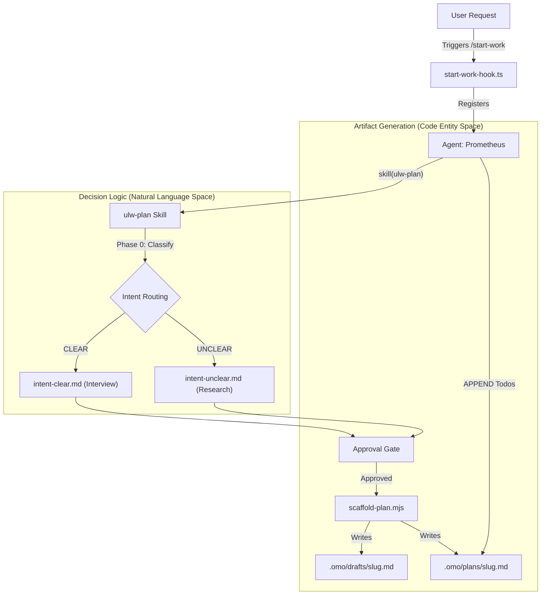
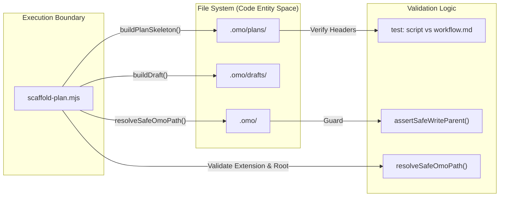

# Planning Workflow

Relevant source files

The following files were used as context for generating this wiki page:

- [packages/omo-codex/plugin/components/ultrawork/skills/ulw-plan/SKILL.md](https://github.com/code-yeongyu/oh-my-openagent/blob/HEAD/packages/omo-codex/plugin/components/ultrawork/skills/ulw-plan/SKILL.md)
- [packages/omo-codex/plugin/components/ultrawork/skills/ulw-plan/references/full-workflow.md](https://github.com/code-yeongyu/oh-my-openagent/blob/HEAD/packages/omo-codex/plugin/components/ultrawork/skills/ulw-plan/references/full-workflow.md)
- [packages/omo-codex/plugin/components/ultrawork/skills/ulw-plan/references/intent-clear.md](https://github.com/code-yeongyu/oh-my-openagent/blob/HEAD/packages/omo-codex/plugin/components/ultrawork/skills/ulw-plan/references/intent-clear.md)
- [packages/omo-codex/plugin/components/ultrawork/skills/ulw-plan/references/intent-unclear.md](https://github.com/code-yeongyu/oh-my-openagent/blob/HEAD/packages/omo-codex/plugin/components/ultrawork/skills/ulw-plan/references/intent-unclear.md)
- [packages/omo-codex/plugin/components/ultrawork/skills/ulw-plan/scripts/scaffold-plan.mjs](https://github.com/code-yeongyu/oh-my-openagent/blob/HEAD/packages/omo-codex/plugin/components/ultrawork/skills/ulw-plan/scripts/scaffold-plan.mjs)
- [packages/omo-codex/plugin/skills/ulw-plan/SKILL.md](https://github.com/code-yeongyu/oh-my-openagent/blob/HEAD/packages/omo-codex/plugin/skills/ulw-plan/SKILL.md)
- [packages/omo-codex/plugin/test/scaffold-plan.test.mjs](https://github.com/code-yeongyu/oh-my-openagent/blob/HEAD/packages/omo-codex/plugin/test/scaffold-plan.test.mjs)
- [packages/omo-codex/plugin/test/ulw-plan-review-state-contract.test.mjs](https://github.com/code-yeongyu/oh-my-openagent/blob/HEAD/packages/omo-codex/plugin/test/ulw-plan-review-state-contract.test.mjs)
- [packages/omo-opencode/src/agents/index.ts](https://github.com/code-yeongyu/oh-my-openagent/blob/HEAD/packages/omo-opencode/src/agents/index.ts)
- [packages/omo-opencode/src/agents/prometheus/index.ts](https://github.com/code-yeongyu/oh-my-openagent/blob/HEAD/packages/omo-opencode/src/agents/prometheus/index.ts)
- [packages/omo-opencode/src/agents/prometheus/system-prompt.test.ts](https://github.com/code-yeongyu/oh-my-openagent/blob/HEAD/packages/omo-opencode/src/agents/prometheus/system-prompt.test.ts)
- [packages/omo-opencode/src/agents/prometheus/system-prompt.ts](https://github.com/code-yeongyu/oh-my-openagent/blob/HEAD/packages/omo-opencode/src/agents/prometheus/system-prompt.ts)
- [packages/omo-opencode/src/shared/dist-bundle-prompt-content.test.ts](https://github.com/code-yeongyu/oh-my-openagent/blob/HEAD/packages/omo-opencode/src/shared/dist-bundle-prompt-content.test.ts)
- [packages/prompts-core/prompts/prometheus/default.md](https://github.com/code-yeongyu/oh-my-openagent/blob/HEAD/packages/prompts-core/prompts/prometheus/default.md)
- [packages/prompts-core/src/prometheus-prompts.ts](https://github.com/code-yeongyu/oh-my-openagent/blob/HEAD/packages/prompts-core/src/prometheus-prompts.ts)
- [packages/shared-skills/skills/ulw-plan/SKILL.md](https://github.com/code-yeongyu/oh-my-openagent/blob/HEAD/packages/shared-skills/skills/ulw-plan/SKILL.md)
- [packages/shared-skills/skills/ulw-plan/references/full-workflow.md](https://github.com/code-yeongyu/oh-my-openagent/blob/HEAD/packages/shared-skills/skills/ulw-plan/references/full-workflow.md)
- [packages/shared-skills/skills/ulw-plan/references/intent-clear.md](https://github.com/code-yeongyu/oh-my-openagent/blob/HEAD/packages/shared-skills/skills/ulw-plan/references/intent-clear.md)
- [packages/shared-skills/skills/ulw-plan/references/intent-unclear.md](https://github.com/code-yeongyu/oh-my-openagent/blob/HEAD/packages/shared-skills/skills/ulw-plan/references/intent-unclear.md)
- [packages/shared-skills/skills/ulw-plan/scripts/scaffold-plan.mjs](https://github.com/code-yeongyu/oh-my-openagent/blob/HEAD/packages/shared-skills/skills/ulw-plan/scripts/scaffold-plan.mjs)
- [packages/shared-skills/skills/visual-qa/SKILL.md](https://github.com/code-yeongyu/oh-my-openagent/blob/HEAD/packages/shared-skills/skills/visual-qa/SKILL.md)

## Purpose and Scope

The planning workflow is a strategic "interview-mode" phase powered by the **Prometheus** agent system. It enables users to refine requirements, conduct pre-implementation research, and generate detailed, decision-complete work plans before any code execution begins. This workflow is typically initiated via the `/start-work` command [packages/omo-opencode/src/hooks/start-work/start-work-hook.ts:177-180](https://github.com/code-yeongyu/oh-my-openagent/blob/HEAD/packages/omo-opencode/src/hooks/start-work/start-work-hook.ts#L177-L180), requesting a plan from Prometheus, or triggers like "plan this" and "interview me" [packages/shared-skills/skills/ulw-plan/SKILL.md:1-3](https://github.com/code-yeongyu/oh-my-openagent/blob/HEAD/packages/shared-skills/skills/ulw-plan/SKILL.md#L1-L3).

The workflow utilizes a specialized hierarchy and the `ulw-plan` skill:
1.  **Prometheus**: The strategic planning consultant [packages/shared-skills/skills/ulw-plan/SKILL.md:10-12](https://github.com/code-yeongyu/oh-my-openagent/blob/HEAD/packages/shared-skills/skills/ulw-plan/SKILL.md#L10-L12).
2.  **Metis**: A mandatory reviewer subagent used for gap analysis before plan finalization [packages/shared-skills/skills/ulw-plan/references/full-workflow.md:19-20](https://github.com/code-yeongyu/oh-my-openagent/blob/HEAD/packages/shared-skills/skills/ulw-plan/references/full-workflow.md#L19-L20).
3.  **Momus**: A dual-pass high-accuracy reviewer that ensures plan executability [packages/shared-skills/skills/ulw-plan/references/full-workflow.md:58-62](https://github.com/code-yeongyu/oh-my-openagent/blob/HEAD/packages/shared-skills/skills/ulw-plan/references/full-workflow.md#L58-L62).

The final output is a structured markdown plan in `.omo/plans/` which serves as the source of truth for execution agents [packages/shared-skills/skills/ulw-plan/SKILL.md:10-12](https://github.com/code-yeongyu/oh-my-openagent/blob/HEAD/packages/shared-skills/skills/ulw-plan/SKILL.md#L10-L12).

Sources: [packages/shared-skills/skills/ulw-plan/SKILL.md:1-15](https://github.com/code-yeongyu/oh-my-openagent/blob/HEAD/packages/shared-skills/skills/ulw-plan/SKILL.md#L1-L15), [packages/shared-skills/skills/ulw-plan/references/full-workflow.md:1-30](https://github.com/code-yeongyu/oh-my-openagent/blob/HEAD/packages/shared-skills/skills/ulw-plan/references/full-workflow.md#L1-L30), [packages/omo-opencode/src/hooks/start-work/start-work-hook.ts:157-185](https://github.com/code-yeongyu/oh-my-openagent/blob/HEAD/packages/omo-opencode/src/hooks/start-work/start-work-hook.ts#L157-L185)

---

## Planning Agents

### Prometheus — Strategic Planner
Prometheus is a dedicated planning agent that refuses to write implementation code. Its primary goal is to produce "decision-complete" plans where the executor needs zero judgment calls [packages/shared-skills/skills/ulw-plan/references/full-workflow.md:15-17](https://github.com/code-yeongyu/oh-my-openagent/blob/HEAD/packages/shared-skills/skills/ulw-plan/references/full-workflow.md#L15-L17).

**Key Constraints:**
- **Planner Identity**: Prometheus is restricted to file operations within `.md` artifacts under the `.omo/` directory [packages/shared-skills/skills/ulw-plan/SKILL.md:10-12](https://github.com/code-yeongyu/oh-my-openagent/blob/HEAD/packages/shared-skills/skills/ulw-plan/SKILL.md#L10-L12).
- **Sticky Mode**: "Plan mode is sticky"—even if a user says "do X" / "fix X" / "just do it," Prometheus interprets this as "plan X" [packages/shared-skills/skills/ulw-plan/SKILL.md:12-14](https://github.com/code-yeongyu/oh-my-openagent/blob/HEAD/packages/shared-skills/skills/ulw-plan/SKILL.md#L12-L14).
- **Forbidden Actions**: Prometheus never edits product code and never implements features, even by proxy through subagents [packages/shared-skills/skills/ulw-plan/SKILL.md:12-13](https://github.com/code-yeongyu/oh-my-openagent/blob/HEAD/packages/shared-skills/skills/ulw-plan/SKILL.md#L12-L13).
- **Subagent Policy**: The system prompt explicitly closes the "implement-by-proxy" loophole; no subagent dispatched by Prometheus is allowed to perform implementation [packages/prompts-core/prompts/prometheus/default.md:3-4](https://github.com/code-yeongyu/oh-my-openagent/blob/HEAD/packages/prompts-core/prompts/prometheus/default.md#L3-L4), [packages/omo-opencode/src/agents/prometheus/system-prompt.test.ts:32-37](https://github.com/code-yeongyu/oh-my-openagent/blob/HEAD/packages/omo-opencode/src/agents/prometheus/system-prompt.test.ts#L32-L37).

**Skill Integration:**
Prometheus's behavior is governed by the `ulw-plan` skill. This skill provides the logic for exploration, intent routing, and the approval gate [packages/shared-skills/skills/ulw-plan/SKILL.md:1-6](https://github.com/code-yeongyu/oh-my-openagent/blob/HEAD/packages/shared-skills/skills/ulw-plan/SKILL.md#L1-L6).

Sources: [packages/shared-skills/skills/ulw-plan/SKILL.md:8-15](https://github.com/code-yeongyu/oh-my-openagent/blob/HEAD/packages/shared-skills/skills/ulw-plan/SKILL.md#L8-L15), [packages/shared-skills/skills/ulw-plan/references/full-workflow.md:12-17](https://github.com/code-yeongyu/oh-my-openagent/blob/HEAD/packages/shared-skills/skills/ulw-plan/references/full-workflow.md#L12-L17), [packages/prompts-core/prompts/prometheus/default.md:1-6](https://github.com/code-yeongyu/oh-my-openagent/blob/HEAD/packages/prompts-core/prompts/prometheus/default.md#L1-L6), [packages/omo-opencode/src/agents/prometheus/system-prompt.test.ts:20-37](https://github.com/code-yeongyu/oh-my-openagent/blob/HEAD/packages/omo-opencode/src/agents/prometheus/system-prompt.test.ts#L20-L37)

---

## Workflow Phases

### 1. Classify and Ground (Phase 0 & 1)
Prometheus classifies the depth of the interview based on the request size: **Trivial** (single file), **Standard** (1-5 files), or **Architecture** (5+ modules) [packages/shared-skills/skills/ulw-plan/references/full-workflow.md:18-19](https://github.com/code-yeongyu/oh-my-openagent/blob/HEAD/packages/shared-skills/skills/ulw-plan/references/full-workflow.md#L18-L19). It then "grounds" by exploring the repo to eliminate discoverable facts before asking the user any questions [packages/shared-skills/skills/ulw-plan/SKILL.md:54-55](https://github.com/code-yeongyu/oh-my-openagent/blob/HEAD/packages/shared-skills/skills/ulw-plan/SKILL.md#L54-L55). 

For Architecture-scale requests or bootstrap scenarios, it runs a **dynamic adversarial workflow** involving five host subagents [packages/shared-skills/skills/ulw-plan/references/full-workflow.md:24-25](https://github.com/code-yeongyu/oh-my-openagent/blob/HEAD/packages/shared-skills/skills/ulw-plan/references/full-workflow.md#L24-L25):
1.  **Collect**: Repo implementation surface, tests, external claims [packages/shared-skills/skills/ulw-plan/references/full-workflow.md:26](https://github.com/code-yeongyu/oh-my-openagent/blob/HEAD/packages/shared-skills/skills/ulw-plan/references/full-workflow.md#L26).
2.  **Verify**: Falsify collected context; return verdict and confidence [packages/shared-skills/skills/ulw-plan/references/full-workflow.md:27](https://github.com/code-yeongyu/oh-my-openagent/blob/HEAD/packages/shared-skills/skills/ulw-plan/references/full-workflow.md#L27).
3.  **Design**: Implementation waves and dependency matrix [packages/shared-skills/skills/ulw-plan/references/full-workflow.md:28](https://github.com/code-yeongyu/oh-my-openagent/blob/HEAD/packages/shared-skills/skills/ulw-plan/references/full-workflow.md#L28).
4.  **Adversarial**: Reject plans with stale state or missing done-claim verification [packages/shared-skills/skills/ulw-plan/references/full-workflow.md:29](https://github.com/code-yeongyu/oh-my-openagent/blob/HEAD/packages/shared-skills/skills/ulw-plan/references/full-workflow.md#L29).
5.  **Synthesize**: One plan with baked-in evidence [packages/shared-skills/skills/ulw-plan/references/full-workflow.md:30](https://github.com/code-yeongyu/oh-my-openagent/blob/HEAD/packages/shared-skills/skills/ulw-plan/references/full-workflow.md#L30).

### 2. Intent Routing (Phase 2)
Prometheus selects one of two routing paths based on the clarity of the desired outcome [packages/shared-skills/skills/ulw-plan/SKILL.md:16-18](https://github.com/code-yeongyu/oh-my-openagent/blob/HEAD/packages/shared-skills/skills/ulw-plan/SKILL.md#L16-L18):
- **CLEAR**: The user knows the outcome. Prometheus asks only about owner-decisions (tradeoffs/preferences) using a "Two Filters" protocol [packages/shared-skills/skills/ulw-plan/SKILL.md:36-37](https://github.com/code-yeongyu/oh-my-openagent/blob/HEAD/packages/shared-skills/skills/ulw-plan/SKILL.md#L36-L37).
- **UNCLEAR**: The outcome is fuzzy (e.g., "make auth better"). Prometheus researches maximally, adopts defensible best-practice defaults, and records them in an **Open-assumptions ledger** [packages/shared-skills/skills/ulw-plan/references/intent-unclear.md:12-23](https://github.com/code-yeongyu/oh-my-openagent/blob/HEAD/packages/shared-skills/skills/ulw-plan/references/intent-unclear.md#L12-L23).

### 3. Approval Gate (Mandatory)
Before writing the final plan, Prometheus must present a brief and wait for explicit user approval [packages/shared-skills/skills/ulw-plan/references/intent-unclear.md:34-36](https://github.com/code-yeongyu/oh-my-openagent/blob/HEAD/packages/shared-skills/skills/ulw-plan/references/intent-unclear.md#L34-L36). This gate is recorded in a durable draft file at `.omo/drafts/<slug>.md` to ensure the session can resume after context compaction [packages/shared-skills/skills/ulw-plan/references/full-workflow.md:41-43](https://github.com/code-yeongyu/oh-my-openagent/blob/HEAD/packages/shared-skills/skills/ulw-plan/references/full-workflow.md#L41-L43).

### 4. Plan Generation and High-Accuracy Review (Phase 3 & 4)
After approval, Prometheus executes the scaffolding script:
`node "<skill-root>/scripts/scaffold-plan.mjs" <slug> [--clear|--unclear] --draft-only [--review-required]` [packages/shared-skills/skills/ulw-plan/SKILL.md:55-59](https://github.com/code-yeongyu/oh-my-openagent/blob/HEAD/packages/shared-skills/skills/ulw-plan/SKILL.md#L55-L59).

If `review_required` is true or intent is UNCLEAR, a **High-accuracy review** is triggered via a dual-pass system involving `momus` and an independent reviewer (e.g., `oracle` or `codex-cli`) [packages/shared-skills/skills/ulw-plan/references/full-workflow.md:58-62](https://github.com/code-yeongyu/oh-my-openagent/blob/HEAD/packages/shared-skills/skills/ulw-plan/references/full-workflow.md#L58-L62).

Sources: [packages/shared-skills/skills/ulw-plan/SKILL.md:16-59](https://github.com/code-yeongyu/oh-my-openagent/blob/HEAD/packages/shared-skills/skills/ulw-plan/SKILL.md#L16-L59), [packages/shared-skills/skills/ulw-plan/references/full-workflow.md:18-60](https://github.com/code-yeongyu/oh-my-openagent/blob/HEAD/packages/shared-skills/skills/ulw-plan/references/full-workflow.md#L18-L60), [packages/shared-skills/skills/ulw-plan/references/intent-unclear.md:10-36](https://github.com/code-yeongyu/oh-my-openagent/blob/HEAD/packages/shared-skills/skills/ulw-plan/references/intent-unclear.md#L10-L36)

---

## Technical Implementation: Scaffolding and Artifacts

The `scaffold-plan.mjs` script is the deterministic generator for plan skeletons and is verified against `full-workflow.md` to prevent drift [packages/omo-codex/plugin/test/scaffold-plan.test.mjs:13-23](https://github.com/code-yeongyu/oh-my-openagent/blob/HEAD/packages/omo-codex/plugin/test/scaffold-plan.test.mjs#L13-L23). It enforces a strict **Write Boundary**, ensuring Prometheus only writes `.md` files under the `.omo/` directory [packages/shared-skills/skills/ulw-plan/scripts/scaffold-plan.mjs:77-90](https://github.com/code-yeongyu/oh-my-openagent/blob/HEAD/packages/shared-skills/skills/ulw-plan/scripts/scaffold-plan.mjs#L77-L90).

### Plan Structure
A decision-complete plan generated by `scaffold-plan.mjs` includes the following `PLAN_SECTION_HEADERS` [packages/shared-skills/skills/ulw-plan/scripts/scaffold-plan.mjs:29-38](https://github.com/code-yeongyu/oh-my-openagent/blob/HEAD/packages/shared-skills/skills/ulw-plan/scripts/scaffold-plan.mjs#L29-L38):
- `## TL;DR (For humans)`: Leading section for human veto of defaults [packages/omo-codex/plugin/test/scaffold-plan.test.mjs:25-36](https://github.com/code-yeongyu/oh-my-openagent/blob/HEAD/packages/omo-codex/plugin/test/scaffold-plan.test.mjs#L25-L36).
- `## Scope`
- `## Verification strategy`
- `## Execution strategy`
- `## Todos`
- `## Final verification wave`: Includes F1-F4 compliance audits [packages/shared-skills/skills/ulw-plan/scripts/scaffold-plan.mjs:40-45](https://github.com/code-yeongyu/oh-my-openagent/blob/HEAD/packages/shared-skills/skills/ulw-plan/scripts/scaffold-plan.mjs#L40-L45).
- `## Commit strategy`
- `## Success criteria`

### Review State Contract
The workflow maintains a durable JSON contract for review rounds to survive session compaction. The `ulw-plan-review-request-state-contract` defines the initial state for review requests [packages/shared-skills/skills/ulw-plan/references/full-workflow.md:45-63](https://github.com/code-yeongyu/oh-my-openagent/blob/HEAD/packages/shared-skills/skills/ulw-plan/references/full-workflow.md#L45-L63).

| Field | Description |
| :--- | :--- |
| `phase` | Current lifecycle phase (e.g., `review_requested`, `review_round_initialized`) |
| `review_required` | Boolean flag indicating if high-accuracy review is mandatory |
| `plan_sha256` | Hash of the plan to ensure review integrity |
| `review.momus` | Status and result of the native Momus pass |
| `review.independent` | Status and result of the independent pass |

Sources: [packages/shared-skills/skills/ulw-plan/scripts/scaffold-plan.mjs:1-150](https://github.com/code-yeongyu/oh-my-openagent/blob/HEAD/packages/shared-skills/skills/ulw-plan/scripts/scaffold-plan.mjs#L1-L150), [packages/shared-skills/skills/ulw-plan/references/full-workflow.md:45-75](https://github.com/code-yeongyu/oh-my-openagent/blob/HEAD/packages/shared-skills/skills/ulw-plan/references/full-workflow.md#L45-L75), [packages/omo-codex/plugin/test/scaffold-plan.test.mjs:1-120](https://github.com/code-yeongyu/oh-my-openagent/blob/HEAD/packages/omo-codex/plugin/test/scaffold-plan.test.mjs#L1-L120)

---

## Diagrams

### Intent Routing to Artifact Generation
This diagram shows how Prometheus moves from Natural Language requirements to Code Entity artifacts using the `ulw-plan` skill.

Sources: [packages/shared-skills/skills/ulw-plan/SKILL.md:16-42](https://github.com/code-yeongyu/oh-my-openagent/blob/HEAD/packages/shared-skills/skills/ulw-plan/SKILL.md#L16-L42), [packages/shared-skills/skills/ulw-plan/references/full-workflow.md:10-60](https://github.com/code-yeongyu/oh-my-openagent/blob/HEAD/packages/shared-skills/skills/ulw-plan/references/full-workflow.md#L10-L60), [packages/omo-opencode/src/hooks/start-work/start-work-hook.ts:157-185](https://github.com/code-yeongyu/oh-my-openagent/blob/HEAD/packages/omo-opencode/src/hooks/start-work/start-work-hook.ts#L157-L185)

### Plan Storage and Safety Lifecycle
This diagram illustrates the lifecycle of a plan artifact and the safety boundaries enforced by the system.

Sources: [packages/shared-skills/skills/ulw-plan/scripts/scaffold-plan.mjs:77-134](https://github.com/code-yeongyu/oh-my-openagent/blob/HEAD/packages/shared-skills/skills/ulw-plan/scripts/scaffold-plan.mjs#L77-L134), [packages/omo-codex/plugin/test/scaffold-plan.test.mjs:13-95](https://github.com/code-yeongyu/oh-my-openagent/blob/HEAD/packages/omo-codex/plugin/test/scaffold-plan.test.mjs#L13-L95), [packages/shared-skills/skills/ulw-plan/SKILL.md:39-42](https://github.com/code-yeongyu/oh-my-openagent/blob/HEAD/packages/shared-skills/skills/ulw-plan/SKILL.md#L39-L42)

---

## Summary of Key Entities

| Code Entity | Role | Source |
| :--- | :--- | :--- |
| `Prometheus` | The primary agent responsible for strategic planning and consultation. | [packages/shared-skills/skills/ulw-plan/SKILL.md:10](https://github.com/code-yeongyu/oh-my-openagent/blob/HEAD/packages/shared-skills/skills/ulw-plan/SKILL.md#L10) |
| `ulw-plan` | The core skill that defines the explore-first planning methodology. | [packages/shared-skills/skills/ulw-plan/SKILL.md:1](https://github.com/code-yeongyu/oh-my-openagent/blob/HEAD/packages/shared-skills/skills/ulw-plan/SKILL.md#L1) |
| `scaffold-plan.mjs` | Deterministic generator for plan skeletons and durable drafts. | [packages/shared-skills/skills/ulw-plan/scripts/scaffold-plan.mjs:2](https://github.com/code-yeongyu/oh-my-openagent/blob/HEAD/packages/shared-skills/skills/ulw-plan/scripts/scaffold-plan.mjs#L2) |
| `PLAN_SECTION_HEADERS` | Canonical list of required sections in a decision-complete plan. | [packages/shared-skills/skills/ulw-plan/scripts/scaffold-plan.mjs:29](https://github.com/code-yeongyu/oh-my-openagent/blob/HEAD/packages/shared-skills/skills/ulw-plan/scripts/scaffold-plan.mjs#L29) |
| `resolveSafeOmoPath` | Enforcement function that restricts planning writes to `.omo/`. | [packages/shared-skills/skills/ulw-plan/scripts/scaffold-plan.mjs:77](https://github.com/code-yeongyu/oh-my-openagent/blob/HEAD/packages/shared-skills/skills/ulw-plan/scripts/scaffold-plan.mjs#L77) |
| `isUlwArtifact` | Function to identify if a file is a valid plan or draft artifact. | [packages/shared-skills/skills/ulw-plan/scripts/scaffold-plan.mjs:148](https://github.com/code-yeongyu/oh-my-openagent/blob/HEAD/packages/shared-skills/skills/ulw-plan/scripts/scaffold-plan.mjs#L148) |
| `start-work-hook.ts` | The entry point for the planning workflow via the `/start-work` command. | [packages/omo-opencode/src/hooks/start-work/start-work-hook.ts:19](https://github.com/code-yeongyu/oh-my-openagent/blob/HEAD/packages/omo-opencode/src/hooks/start-work/start-work-hook.ts#L19) |
| `getPrometheusPrompt` | Generates the system prompt for Prometheus, enforcing the planner persona. | [packages/omo-opencode/src/agents/prometheus/system-prompt.ts:4](https://github.com/code-yeongyu/oh-my-openagent/blob/HEAD/packages/omo-opencode/src/agents/prometheus/system-prompt.ts#L4) |

Sources: [packages/shared-skills/skills/ulw-plan/SKILL.md:1-60](https://github.com/code-yeongyu/oh-my-openagent/blob/HEAD/packages/shared-skills/skills/ulw-plan/SKILL.md#L1-L60), [packages/shared-skills/skills/ulw-plan/scripts/scaffold-plan.mjs:1-160](https://github.com/code-yeongyu/oh-my-openagent/blob/HEAD/packages/shared-skills/skills/ulw-plan/scripts/scaffold-plan.mjs#L1-L160), [packages/shared-skills/skills/ulw-plan/references/full-workflow.md:1-100](https://github.com/code-yeongyu/oh-my-openagent/blob/HEAD/packages/shared-skills/skills/ulw-plan/references/full-workflow.md#L1-L100), [packages/omo-opencode/src/hooks/start-work/start-work-hook.ts:1-200](https://github.com/code-yeongyu/oh-my-openagent/blob/HEAD/packages/omo-opencode/src/hooks/start-work/start-work-hook.ts#L1-L200), [packages/omo-opencode/src/agents/prometheus/system-prompt.ts:1-50](https://github.com/code-yeongyu/oh-my-openagent/blob/HEAD/packages/omo-opencode/src/agents/prometheus/system-prompt.ts#L1-L50)4b:T