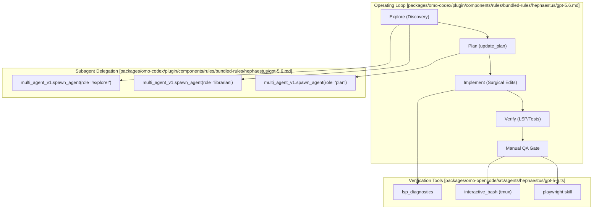
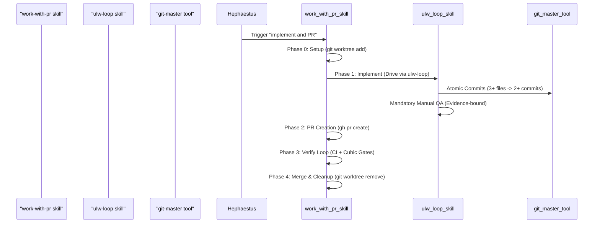

# Deep Work with Hephaestus

Relevant source files

The following files were used as context for generating this wiki page:

- [.agents/skills/work-with-pr-workspace/evals/evals.json](https://github.com/code-yeongyu/oh-my-openagent/blob/HEAD/.agents/skills/work-with-pr-workspace/evals/evals.json)
- [.agents/skills/work-with-pr/SKILL.md](https://github.com/code-yeongyu/oh-my-openagent/blob/HEAD/.agents/skills/work-with-pr/SKILL.md)
- [.omo/rules/test-discipline.md](https://github.com/code-yeongyu/oh-my-openagent/blob/HEAD/.omo/rules/test-discipline.md)
- [.opencode/skills/github-triage/SKILL.md](https://github.com/code-yeongyu/oh-my-openagent/blob/HEAD/.opencode/skills/github-triage/SKILL.md)
- [.opencode/skills/github-triage/scripts/gh_fetch.py](https://github.com/code-yeongyu/oh-my-openagent/blob/HEAD/.opencode/skills/github-triage/scripts/gh_fetch.py)
- [.opencode/skills/work-with-pr-workspace/evals/evals.json](https://github.com/code-yeongyu/oh-my-openagent/blob/HEAD/.opencode/skills/work-with-pr-workspace/evals/evals.json)
- [.opencode/skills/work-with-pr/SKILL.md](https://github.com/code-yeongyu/oh-my-openagent/blob/HEAD/.opencode/skills/work-with-pr/SKILL.md)
- [packages/omo-codex/plugin/components/rules/bundled-rules/hephaestus/gpt-5.5.md](https://github.com/code-yeongyu/oh-my-openagent/blob/HEAD/packages/omo-codex/plugin/components/rules/bundled-rules/hephaestus/gpt-5.5.md)
- [packages/omo-codex/plugin/components/rules/bundled-rules/hephaestus/gpt-5.6.md](https://github.com/code-yeongyu/oh-my-openagent/blob/HEAD/packages/omo-codex/plugin/components/rules/bundled-rules/hephaestus/gpt-5.6.md)
- [packages/omo-opencode/src/agents/hephaestus/delegation-table-contract.test.ts](https://github.com/code-yeongyu/oh-my-openagent/blob/HEAD/packages/omo-opencode/src/agents/hephaestus/delegation-table-contract.test.ts)
- [packages/omo-opencode/src/agents/hephaestus/gpt-5-5.ts](https://github.com/code-yeongyu/oh-my-openagent/blob/HEAD/packages/omo-opencode/src/agents/hephaestus/gpt-5-5.ts)
- [packages/omo-opencode/src/agents/hephaestus/gpt-5-6.ts](https://github.com/code-yeongyu/oh-my-openagent/blob/HEAD/packages/omo-opencode/src/agents/hephaestus/gpt-5-6.ts)
- [packages/omo-opencode/src/features/opencode-skill-loader/project-skill-tool-references.test.ts](https://github.com/code-yeongyu/oh-my-openagent/blob/HEAD/packages/omo-opencode/src/features/opencode-skill-loader/project-skill-tool-references.test.ts)
- [packages/omo-opencode/src/tools/AGENTS.md](https://github.com/code-yeongyu/oh-my-openagent/blob/HEAD/packages/omo-opencode/src/tools/AGENTS.md)
- [packages/omo-opencode/src/tools/delegate-task/anthropic-categories.ts](https://github.com/code-yeongyu/oh-my-openagent/blob/HEAD/packages/omo-opencode/src/tools/delegate-task/anthropic-categories.ts)
- [packages/omo-opencode/src/tools/delegate-task/builtin-categories.ts](https://github.com/code-yeongyu/oh-my-openagent/blob/HEAD/packages/omo-opencode/src/tools/delegate-task/builtin-categories.ts)
- [packages/omo-opencode/src/tools/delegate-task/builtin-category-definition.ts](https://github.com/code-yeongyu/oh-my-openagent/blob/HEAD/packages/omo-opencode/src/tools/delegate-task/builtin-category-definition.ts)
- [packages/omo-opencode/src/tools/delegate-task/categories.ts](https://github.com/code-yeongyu/oh-my-openagent/blob/HEAD/packages/omo-opencode/src/tools/delegate-task/categories.ts)
- [packages/omo-opencode/src/tools/delegate-task/category-routing-policy.test.ts](https://github.com/code-yeongyu/oh-my-openagent/blob/HEAD/packages/omo-opencode/src/tools/delegate-task/category-routing-policy.test.ts)
- [packages/omo-opencode/src/tools/delegate-task/constants.ts](https://github.com/code-yeongyu/oh-my-openagent/blob/HEAD/packages/omo-opencode/src/tools/delegate-task/constants.ts)
- [packages/omo-opencode/src/tools/delegate-task/google-categories.ts](https://github.com/code-yeongyu/oh-my-openagent/blob/HEAD/packages/omo-opencode/src/tools/delegate-task/google-categories.ts)
- [packages/omo-opencode/src/tools/delegate-task/kimi-categories.ts](https://github.com/code-yeongyu/oh-my-openagent/blob/HEAD/packages/omo-opencode/src/tools/delegate-task/kimi-categories.ts)
- [packages/omo-opencode/src/tools/delegate-task/openai-categories.ts](https://github.com/code-yeongyu/oh-my-openagent/blob/HEAD/packages/omo-opencode/src/tools/delegate-task/openai-categories.ts)
- [packages/omo-opencode/src/tools/delegate-task/tools.test.ts](https://github.com/code-yeongyu/oh-my-openagent/blob/HEAD/packages/omo-opencode/src/tools/delegate-task/tools.test.ts)
- [packages/shared-skills/skills/programming/SKILL.md](https://github.com/code-yeongyu/oh-my-openagent/blob/HEAD/packages/shared-skills/skills/programming/SKILL.md)
- [packages/shared-skills/skills/programming/references/code-smells.md](https://github.com/code-yeongyu/oh-my-openagent/blob/HEAD/packages/shared-skills/skills/programming/references/code-smells.md)
- [packages/shared-skills/skills/programming/references/logging.md](https://github.com/code-yeongyu/oh-my-openagent/blob/HEAD/packages/shared-skills/skills/programming/references/logging.md)
- [packages/shared-skills/skills/refactor/SKILL.md](https://github.com/code-yeongyu/oh-my-openagent/blob/HEAD/packages/shared-skills/skills/refactor/SKILL.md)
- [packages/skills-loader-core/src/features/builtin-skills/skills/review-work.ts](https://github.com/code-yeongyu/oh-my-openagent/blob/HEAD/packages/skills-loader-core/src/features/builtin-skills/skills/review-work.ts)
- [packages/skills-loader-core/src/features/opencode-skill-loader/project-skill-tool-references.test.ts](https://github.com/code-yeongyu/oh-my-openagent/blob/HEAD/packages/skills-loader-core/src/features/opencode-skill-loader/project-skill-tool-references.test.ts)

This page documents how to delegate autonomous deep work tasks to **Hephaestus**, the specialized deep worker agent in the `oh-my-openagent` system. For strategic planning before execution, see **9.2 Planning Workflow**. For general task delegation using categories and skills, see **4.1 Task Delegation**.

## Overview

Hephaestus is an autonomous deep worker agent optimized for end-to-end problem-solving that requires exploration, research, implementation, and mandatory manual verification. Unlike category-based delegation (which spawns `sisyphus-junior` variants) or Oracle (which is read-only), Hephaestus operates with full edit permissions and is designed for tasks where the orchestrator hands off complete ownership of a problem [packages/omo-codex/plugin/components/rules/bundled-rules/hephaestus/gpt-5.6.md:6-6](https://github.com/code-yeongyu/oh-my-openagent/blob/HEAD/packages/omo-codex/plugin/components/rules/bundled-rules/hephaestus/gpt-5.6.md#L6).

**Key characteristics:**
- **Model Optimization**: Hephaestus features model-specific prompt architectures for GPT-5.6, GPT-5.5, and generic GPT models [packages/omo-opencode/src/agents/hephaestus/gpt-5-6.ts:23-27](https://github.com/code-yeongyu/oh-my-openagent/blob/HEAD/packages/omo-opencode/src/agents/hephaestus/gpt-5-6.ts#L23-L27). It is specifically calibrated for the GPT-5.x flagship line to handle deep, autonomous exploration [packages/omo-opencode/src/agents/hephaestus/gpt-5-6.ts:28-28](https://github.com/code-yeongyu/oh-my-openagent/blob/HEAD/packages/omo-opencode/src/agents/hephaestus/gpt-5-6.ts#L28).
- **Autonomy**: Hephaestus receives goals, not recipe-like instructions, and is expected to execute them end-to-end [packages/omo-codex/plugin/components/rules/bundled-rules/hephaestus/gpt-5.6.md:6-6](https://github.com/code-yeongyu/oh-my-openagent/blob/HEAD/packages/omo-codex/plugin/components/rules/bundled-rules/hephaestus/gpt-5.6.md#L6). It uses "Code Mode" aggressively for bounded discovery [packages/omo-codex/plugin/components/rules/bundled-rules/hephaestus/gpt-5.6.md:22-22](https://github.com/code-yeongyu/oh-my-openagent/blob/HEAD/packages/omo-codex/plugin/components/rules/bundled-rules/hephaestus/gpt-5.6.md#L22).
- **Task Tracking**: Hephaestus manages multi-step work through structured task or todo systems via `task_create` and `task_update` [packages/omo-opencode/src/agents/hephaestus/gpt-5-6.ts:15-21](https://github.com/code-yeongyu/oh-my-openagent/blob/HEAD/packages/omo-opencode/src/agents/hephaestus/gpt-5-6.ts#L15-L21).
- **Manual QA Gate**: A core tenet of Hephaestus is that "done" is only achieved when the artifact is driven through its matching surface (TUI, Web UI, API) and observed working [packages/omo-codex/plugin/components/rules/bundled-rules/hephaestus/gpt-5.5.md:63-71](https://github.com/code-yeongyu/oh-my-openagent/blob/HEAD/packages/omo-codex/plugin/components/rules/bundled-rules/hephaestus/gpt-5.5.md#L63-L71).

**Sources:** [packages/omo-codex/plugin/components/rules/bundled-rules/hephaestus/gpt-5.6.md:6-22](https://github.com/code-yeongyu/oh-my-openagent/blob/HEAD/packages/omo-codex/plugin/components/rules/bundled-rules/hephaestus/gpt-5.6.md#L6-L22), [packages/omo-opencode/src/agents/hephaestus/gpt-5-6.ts:15-28](https://github.com/code-yeongyu/oh-my-openagent/blob/HEAD/packages/omo-opencode/src/agents/hephaestus/gpt-5-6.ts#L15-L28), [packages/omo-codex/plugin/components/rules/bundled-rules/hephaestus/gpt-5.5.md:63-71](https://github.com/code-yeongyu/oh-my-openagent/blob/HEAD/packages/omo-codex/plugin/components/rules/bundled-rules/hephaestus/gpt-5.5.md#L63-L71)

---

## Agent Comparison Matrix

Understanding when to use Hephaestus vs. other delegation mechanisms is critical for orchestration logic. Hephaestus is the specialized Craftsman of the system, built as a GPT-native alternative to the Claude-optimized Sisyphus.

| Delegation Type | Role | Permissions | Best For | Code Entity |
|---|---|---|---|---|
| **Hephaestus** | Deep Worker | Full edit | Autonomous end-to-end execution & Manual QA | `HEPHAESTUS_GPT_5_6_TEMPLATE` [packages/omo-opencode/src/agents/hephaestus/gpt-5-6.ts:28-82](https://github.com/code-yeongyu/oh-my-openagent/blob/HEAD/packages/omo-opencode/src/agents/hephaestus/gpt-5-6.ts#L28-L82) |
| **Explorer** | Investigator | Read-only | Codebase pattern search and symbol discovery | `explorer` [packages/omo-codex/plugin/components/rules/bundled-rules/hephaestus/gpt-5.6.md:36-36](https://github.com/code-yeongyu/oh-my-openagent/blob/HEAD/packages/omo-codex/plugin/components/rules/bundled-rules/hephaestus/gpt-5.6.md#L36) |
| **Librarian** | Researcher | Read-only | External documentation and API contracts | `librarian` [packages/omo-codex/plugin/components/rules/bundled-rules/hephaestus/gpt-5.6.md:37-37](https://github.com/code-yeongyu/oh-my-openagent/blob/HEAD/packages/omo-codex/plugin/components/rules/bundled-rules/hephaestus/gpt-5.6.md#L37) |
| **Oracle** | Consultant | Read-only | Architecture consultation and high-IQ review | `buildOracleSection` [packages/omo-opencode/src/agents/hephaestus/gpt-5-6.ts:11-11](https://github.com/code-yeongyu/oh-my-openagent/blob/HEAD/packages/omo-opencode/src/agents/hephaestus/gpt-5-6.ts#L11) |
| **Prometheus** | Strategist | Read-only | Strategic planning and interview-mode design | `plan` [packages/omo-codex/plugin/components/rules/bundled-rules/hephaestus/gpt-5.6.md:38-38](https://github.com/code-yeongyu/oh-my-openagent/blob/HEAD/packages/omo-codex/plugin/components/rules/bundled-rules/hephaestus/gpt-5.6.md#L38) |

**Decision criteria:**
- Use **Hephaestus** when: The task requires deep architectural reasoning or complex debugging across many files.
- Use **Sisyphus** when: The task requires heavy coordination, multi-step instruction following, or complex delegation patterns.

**Sources:** [packages/omo-codex/plugin/components/rules/bundled-rules/hephaestus/gpt-5.6.md:36-38](https://github.com/code-yeongyu/oh-my-openagent/blob/HEAD/packages/omo-codex/plugin/components/rules/bundled-rules/hephaestus/gpt-5.6.md#L36-L38), [packages/omo-opencode/src/agents/hephaestus/gpt-5-6.ts:11-82](https://github.com/code-yeongyu/oh-my-openagent/blob/HEAD/packages/omo-opencode/src/agents/hephaestus/gpt-5-6.ts#L11-L82)

---

## Operating Loop and Discovery

Hephaestus follows a strict operating loop to ensure systematic progress and high-fidelity results.

Title: "Hephaestus Operating Loop and Subagent Delegation"

**Discovery Principles:**
- **No Speculation**: Hephaestus must verify with tools and re-read on every hand-off [packages/omo-codex/plugin/components/rules/bundled-rules/hephaestus/gpt-5.6.md:22-22](https://github.com/code-yeongyu/oh-my-openagent/blob/HEAD/packages/omo-codex/plugin/components/rules/bundled-rules/hephaestus/gpt-5.6.md#L22).
- **Batching**: When multiple independent tool calls produce results that can be reduced, Hephaestus makes ONE `exec` JavaScript program using `Promise.all` or a Python script with `concurrent.futures` to batch commands [packages/omo-codex/plugin/components/rules/bundled-rules/hephaestus/gpt-5.6.md:22-22](https://github.com/code-yeongyu/oh-my-openagent/blob/HEAD/packages/omo-codex/plugin/components/rules/bundled-rules/hephaestus/gpt-5.6.md#L22).
- **LSP Integration**: Use LSP for symbols (definitions, references, rename impact) instead of text search [packages/omo-codex/plugin/components/rules/bundled-rules/hephaestus/gpt-5.6.md:22-22](https://github.com/code-yeongyu/oh-my-openagent/blob/HEAD/packages/omo-codex/plugin/components/rules/bundled-rules/hephaestus/gpt-5.6.md#L22).

**Sources:** [packages/omo-codex/plugin/components/rules/bundled-rules/hephaestus/gpt-5.6.md:22-31](https://github.com/code-yeongyu/oh-my-openagent/blob/HEAD/packages/omo-codex/plugin/components/rules/bundled-rules/hephaestus/gpt-5.6.md#L22-L31), [packages/omo-opencode/src/agents/hephaestus/gpt-5-6.ts:62-82](https://github.com/code-yeongyu/oh-my-openagent/blob/HEAD/packages/omo-opencode/src/agents/hephaestus/gpt-5-6.ts#L62-L82)

---

## Advanced Workflow: Full PR Lifecycle

For complex implementations, Hephaestus utilizes the `work-with-pr` skill to manage the entire lifecycle in isolated worktrees [.opencode/skills/work-with-pr/SKILL.md:3-3](https://github.com/code-yeongyu/oh-my-openagent/blob/HEAD/.opencode/skills/work-with-pr/SKILL.md#L3).

Title: "PR Lifecycle Workflow with Hephaestus"

**Work-With-PR Mechanics:**
- **Atomic PRs**: Decomposes one task into the smallest atomic, independently-mergeable PRs [.opencode/skills/work-with-pr/SKILL.md:3-3](https://github.com/code-yeongyu/oh-my-openagent/blob/HEAD/.opencode/skills/work-with-pr/SKILL.md#L3).
- **Isolation**: Creates fresh isolated worktrees sibling to the repo using `git worktree add` to avoid uncommitted work interference and enable parallelism [.opencode/skills/work-with-pr/SKILL.md:32-32](https://github.com/code-yeongyu/oh-my-openagent/blob/HEAD/.opencode/skills/work-with-pr/SKILL.md#L32), [.opencode/skills/work-with-pr/SKILL.md:72-72](https://github.com/code-yeongyu/oh-my-openagent/blob/HEAD/.opencode/skills/work-with-pr/SKILL.md#L72).
- **Evidence-Bound QA**: No change is considered done until manual QA evidence is written to disk [.opencode/skills/work-with-pr/SKILL.md:91-94](https://github.com/code-yeongyu/oh-my-openagent/blob/HEAD/.opencode/skills/work-with-pr/SKILL.md#L91-L94).
- **Verification Loop**: An unbounded loop that cycles through CI (`gh pr checks`) and Cubic (AI reviewer) gates until both pass [.opencode/skills/work-with-pr/SKILL.md:8-8](https://github.com/code-yeongyu/oh-my-openagent/blob/HEAD/.opencode/skills/work-with-pr/SKILL.md#L8), [.opencode/skills/work-with-pr/SKILL.md:20-21](https://github.com/code-yeongyu/oh-my-openagent/blob/HEAD/.opencode/skills/work-with-pr/SKILL.md#L20-L21).

**Sources:** [.opencode/skills/work-with-pr/SKILL.md:1-24](https://github.com/code-yeongyu/oh-my-openagent/blob/HEAD/.opencode/skills/work-with-pr/SKILL.md#L1-L24), [.opencode/skills/work-with-pr/SKILL.md:30-44](https://github.com/code-yeongyu/oh-my-openagent/blob/HEAD/.opencode/skills/work-with-pr/SKILL.md#L30-L44), [.opencode/skills/work-with-pr/SKILL.md:89-112](https://github.com/code-yeongyu/oh-my-openagent/blob/HEAD/.opencode/skills/work-with-pr/SKILL.md#L89-L112)

---

## Manual QA Gate Requirements

Hephaestus is prohibited from reporting "done" based solely on source code reading or green unit tests. The "Manual QA Gate" requires personal observation of the artifact working this turn [packages/omo-codex/plugin/components/rules/bundled-rules/hephaestus/gpt-5.6.md:47-48](https://github.com/code-yeongyu/oh-my-openagent/blob/HEAD/packages/omo-codex/plugin/components/rules/bundled-rules/hephaestus/gpt-5.6.md#L47-L48).

| Surface Type | Verification Method |
|---|---|
| **TUI / CLI / Binary** | Run in `interactive_bash` (tmux); check happy path and bad inputs [packages/omo-opencode/src/agents/hephaestus/gpt-5-6.ts:80-80](https://github.com/code-yeongyu/oh-my-openagent/blob/HEAD/packages/omo-opencode/src/agents/hephaestus/gpt-5-6.ts#L80). |
| **Web UI** | Use `playwright` skill to drive a real browser; watch console logs [packages/omo-opencode/src/agents/hephaestus/gpt-5-6.ts:81-81](https://github.com/code-yeongyu/oh-my-openagent/blob/HEAD/packages/omo-opencode/src/agents/hephaestus/gpt-5-6.ts#L81). |
| **HTTP API / Service** | `curl` the live process [packages/omo-codex/plugin/components/rules/bundled-rules/hephaestus/gpt-5.6.md:51-51](https://github.com/code-yeongyu/oh-my-openagent/blob/HEAD/packages/omo-codex/plugin/components/rules/bundled-rules/hephaestus/gpt-5.6.md#L51). |
| **Library / SDK** | Write and run a minimal end-to-end driver script [packages/omo-codex/plugin/components/rules/bundled-rules/hephaestus/gpt-5.6.md:52-52](https://github.com/code-yeongyu/oh-my-openagent/blob/HEAD/packages/omo-codex/plugin/components/rules/bundled-rules/hephaestus/gpt-5.6.md#L52). |

**Sources:** [packages/omo-codex/plugin/components/rules/bundled-rules/hephaestus/gpt-5.6.md:45-55](https://github.com/code-yeongyu/oh-my-openagent/blob/HEAD/packages/omo-codex/plugin/components/rules/bundled-rules/hephaestus/gpt-5.6.md#L45-L55), [packages/omo-opencode/src/agents/hephaestus/gpt-5-6.ts:76-82](https://github.com/code-yeongyu/oh-my-openagent/blob/HEAD/packages/omo-opencode/src/agents/hephaestus/gpt-5-6.ts#L76-L82)