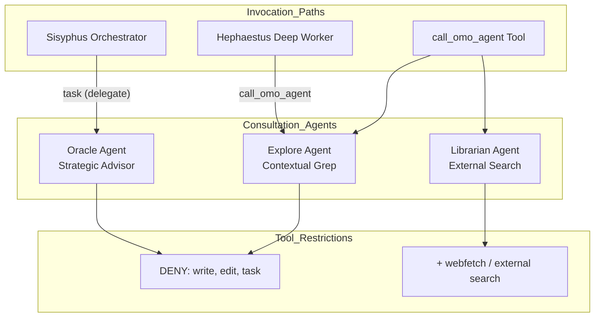
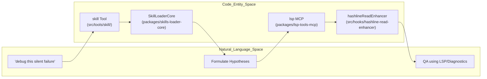

# Debugging and Consultation

Relevant source files

The following files were used as context for generating this wiki page:

- [packages/ast-grep-mcp/AGENTS.md](https://github.com/code-yeongyu/oh-my-openagent/blob/HEAD/packages/ast-grep-mcp/AGENTS.md)
- [packages/omo-opencode/src/AGENTS.md](https://github.com/code-yeongyu/oh-my-openagent/blob/HEAD/packages/omo-opencode/src/AGENTS.md)
- [packages/omo-opencode/src/agents/AGENTS.md](https://github.com/code-yeongyu/oh-my-openagent/blob/HEAD/packages/omo-opencode/src/agents/AGENTS.md)
- [packages/omo-opencode/src/agents/prometheus/AGENTS.md](https://github.com/code-yeongyu/oh-my-openagent/blob/HEAD/packages/omo-opencode/src/agents/prometheus/AGENTS.md)
- [packages/omo-opencode/src/config-migration/AGENTS.md](https://github.com/code-yeongyu/oh-my-openagent/blob/HEAD/packages/omo-opencode/src/config-migration/AGENTS.md)
- [packages/omo-opencode/src/features/AGENTS.md](https://github.com/code-yeongyu/oh-my-openagent/blob/HEAD/packages/omo-opencode/src/features/AGENTS.md)
- [packages/omo-opencode/src/features/boulder-state/AGENTS.md](https://github.com/code-yeongyu/oh-my-openagent/blob/HEAD/packages/omo-opencode/src/features/boulder-state/AGENTS.md)
- [packages/omo-opencode/src/features/team-mode/AGENTS.md](https://github.com/code-yeongyu/oh-my-openagent/blob/HEAD/packages/omo-opencode/src/features/team-mode/AGENTS.md)
- [packages/omo-opencode/src/hooks/AGENTS.md](https://github.com/code-yeongyu/oh-my-openagent/blob/HEAD/packages/omo-opencode/src/hooks/AGENTS.md)
- [packages/omo-opencode/src/hooks/auto-update-checker/AGENTS.md](https://github.com/code-yeongyu/oh-my-openagent/blob/HEAD/packages/omo-opencode/src/hooks/auto-update-checker/AGENTS.md)
- [packages/omo-opencode/src/hooks/keyword-detector/AGENTS.md](https://github.com/code-yeongyu/oh-my-openagent/blob/HEAD/packages/omo-opencode/src/hooks/keyword-detector/AGENTS.md)
- [packages/omo-opencode/src/tools/AGENTS.md](https://github.com/code-yeongyu/oh-my-openagent/blob/HEAD/packages/omo-opencode/src/tools/AGENTS.md)
- [packages/omo-opencode/src/tools/delegate-task/anthropic-categories.ts](https://github.com/code-yeongyu/oh-my-openagent/blob/HEAD/packages/omo-opencode/src/tools/delegate-task/anthropic-categories.ts)
- [packages/omo-opencode/src/tools/delegate-task/builtin-categories.ts](https://github.com/code-yeongyu/oh-my-openagent/blob/HEAD/packages/omo-opencode/src/tools/delegate-task/builtin-categories.ts)
- [packages/omo-opencode/src/tools/delegate-task/builtin-category-definition.ts](https://github.com/code-yeongyu/oh-my-openagent/blob/HEAD/packages/omo-opencode/src/tools/delegate-task/builtin-category-definition.ts)
- [packages/omo-opencode/src/tools/delegate-task/categories.ts](https://github.com/code-yeongyu/oh-my-openagent/blob/HEAD/packages/omo-opencode/src/tools/delegate-task/categories.ts)
- [packages/omo-opencode/src/tools/delegate-task/category-routing-policy.test.ts](https://github.com/code-yeongyu/oh-my-openagent/blob/HEAD/packages/omo-opencode/src/tools/delegate-task/category-routing-policy.test.ts)
- [packages/omo-opencode/src/tools/delegate-task/constants.ts](https://github.com/code-yeongyu/oh-my-openagent/blob/HEAD/packages/omo-opencode/src/tools/delegate-task/constants.ts)
- [packages/omo-opencode/src/tools/delegate-task/google-categories.ts](https://github.com/code-yeongyu/oh-my-openagent/blob/HEAD/packages/omo-opencode/src/tools/delegate-task/google-categories.ts)
- [packages/omo-opencode/src/tools/delegate-task/kimi-categories.ts](https://github.com/code-yeongyu/oh-my-openagent/blob/HEAD/packages/omo-opencode/src/tools/delegate-task/kimi-categories.ts)
- [packages/omo-opencode/src/tools/delegate-task/openai-categories.ts](https://github.com/code-yeongyu/oh-my-openagent/blob/HEAD/packages/omo-opencode/src/tools/delegate-task/openai-categories.ts)
- [packages/omo-opencode/src/tools/delegate-task/tools.test.ts](https://github.com/code-yeongyu/oh-my-openagent/blob/HEAD/packages/omo-opencode/src/tools/delegate-task/tools.test.ts)

This page documents the specialized read-only agents and skills designed for debugging problems and consulting on technical decisions: **Oracle**, **Explore**, **Librarian**, and the **debugging** skill. These components complement the execution-focused agents (Sisyphus, Hephaestus) by providing investigation, analysis, and consultation capabilities without modifying code.

---

## Agent Overview

The consultation system consists of specialized read-only agents designed for specific investigation patterns. These agents are typically invoked via the `call_omo_agent` tool or delegated through orchestrators using the `task` (delegate-task) tool [packages/omo-opencode/src/tools/AGENTS.md:18-19](https://github.com/code-yeongyu/oh-my-openagent/blob/HEAD/packages/omo-opencode/src/tools/AGENTS.md#L18-L19).

| Agent | Key Identifier | Primary Model | Mode | Purpose |
|-------|-------|------|------|---------|
| **Oracle** | `oracle` | `gpt-5.6-sol` (xhigh) | `subagent` | Strategic consultation, architecture decisions, hard debugging. [packages/omo-opencode/src/agents/AGENTS.md:24](https://github.com/code-yeongyu/oh-my-openagent/blob/HEAD/packages/omo-opencode/src/agents/AGENTS.md#L24) |
| **Explore** | `explore` | `gpt-5.6-luna-fast` | `subagent` | Codebase search, symbol navigation, contextual grep. [packages/omo-opencode/src/agents/AGENTS.md:26](https://github.com/code-yeongyu/oh-my-openagent/blob/HEAD/packages/omo-opencode/src/agents/AGENTS.md#L26) |
| **Librarian** | `librarian` | `gpt-5.6-luna-fast` | `subagent` | External documentation, open-source reference, library internals. [packages/omo-opencode/src/agents/AGENTS.md:25](https://github.com/code-yeongyu/oh-my-openagent/blob/HEAD/packages/omo-opencode/src/agents/AGENTS.md#L25) |
| **Metis** | `metis` | `claude-opus-5` (high) | `subagent` | Pre-planning analyst and consultant. [packages/omo-opencode/src/agents/AGENTS.md:28](https://github.com/code-yeongyu/oh-my-openagent/blob/HEAD/packages/omo-opencode/src/agents/AGENTS.md#L28) |
| **Momus** | `momus` | `gpt-5.6-terra` (high) | `subagent` | Plan reviewer; verifies references and startability. [packages/omo-opencode/src/agents/AGENTS.md:29](https://github.com/code-yeongyu/oh-my-openagent/blob/HEAD/packages/omo-opencode/src/agents/AGENTS.md#L29) |

### Consultation Agent Hierarchy

Consultation agents are explicitly restricted from modifying the filesystem to ensure they remain safe for investigative work.

Title: Agent Delegation and Tool Access Flow

**Sources:** [packages/omo-opencode/src/agents/AGENTS.md:24-26](https://github.com/code-yeongyu/oh-my-openagent/blob/HEAD/packages/omo-opencode/src/agents/AGENTS.md#L24-L26), [packages/omo-opencode/src/shared/agent-tool-restrictions.ts:36-42](https://github.com/code-yeongyu/oh-my-openagent/blob/HEAD/packages/omo-opencode/src/shared/agent-tool-restrictions.ts#L36-L42), [packages/omo-opencode/src/tools/AGENTS.md:18-19](https://github.com/code-yeongyu/oh-my-openagent/blob/HEAD/packages/omo-opencode/src/tools/AGENTS.md#L18-L19)

---

## Explore: Codebase Search Specialist

Explore is a contextual search specialist that answers "Where is X?" and "Which file contains Y?" through rapid codebase navigation.

### Strategy and Tools
- **Read-Only Enforcement**: Explore is strictly denied `write`, `edit`, and `task` tools [packages/omo-opencode/src/agents/AGENTS.md:42](https://github.com/code-yeongyu/oh-my-openagent/blob/HEAD/packages/omo-opencode/src/agents/AGENTS.md#L42).
- **Tool Selection**: Leverages `grep` and `glob` for broad searches [packages/omo-opencode/src/tools/AGENTS.md:15](https://github.com/code-yeongyu/oh-my-openagent/blob/HEAD/packages/omo-opencode/src/tools/AGENTS.md#L15).
- **Structural Search**: Accesses AST-aware code search through the `ast-grep` skill using the `sg` binary provisioned at session startup [packages/omo-opencode/src/hooks/AGENTS.md:36](https://github.com/code-yeongyu/oh-my-openagent/blob/HEAD/packages/omo-opencode/src/hooks/AGENTS.md#L36), [packages/omo-opencode/src/tools/AGENTS.md:21](https://github.com/code-yeongyu/oh-my-openagent/blob/HEAD/packages/omo-opencode/src/tools/AGENTS.md#L21).
- **Model Routing**: Uses `gpt-5.6-luna-fast` by default with a fallback chain starting with `qwen3.7-plus` [packages/omo-opencode/src/agents/AGENTS.md:26](https://github.com/code-yeongyu/oh-my-openagent/blob/HEAD/packages/omo-opencode/src/agents/AGENTS.md#L26).

**Sources:** [packages/omo-opencode/src/agents/AGENTS.md:26-42](https://github.com/code-yeongyu/oh-my-openagent/blob/HEAD/packages/omo-opencode/src/agents/AGENTS.md#L26-L42), [packages/omo-opencode/src/tools/AGENTS.md:15-21](https://github.com/code-yeongyu/oh-my-openagent/blob/HEAD/packages/omo-opencode/src/tools/AGENTS.md#L15-L21)

---

## Librarian: External Reference Specialist

Librarian specializes in documentation lookup and retrieving information from external sources, specifically for libraries, OSS projects, and vendor APIs.

### Research Protocol
- **External Tools**: Unlike other subagents, Librarian is optimized for external search and documentation retrieval [packages/omo-opencode/src/agents/AGENTS.md:25](https://github.com/code-yeongyu/oh-my-openagent/blob/HEAD/packages/omo-opencode/src/agents/AGENTS.md#L25).
- **Tool Restrictions**: Like Explore, it is strictly read-only and cannot delegate further tasks (`deny: task, call_omo_agent`) [packages/omo-opencode/src/agents/AGENTS.md:41](https://github.com/code-yeongyu/oh-my-openagent/blob/HEAD/packages/omo-opencode/src/agents/AGENTS.md#L41).
- **Model Configuration**: Defaults to `gpt-5.6-luna-fast` at `0.1` temperature for high-fidelity information retrieval [packages/omo-opencode/src/agents/AGENTS.md:25](https://github.com/code-yeongyu/oh-my-openagent/blob/HEAD/packages/omo-opencode/src/agents/AGENTS.md#L25).

**Sources:** [packages/omo-opencode/src/agents/AGENTS.md:25-41](https://github.com/code-yeongyu/oh-my-openagent/blob/HEAD/packages/omo-opencode/src/agents/AGENTS.md#L25-L41)

---

## Debugging Skill: Hypothesis-Driven Investigation

The `debugging` skill (part of the shared-skills library) provides a mandatory protocol for runtime debugging across any language or environment.

### Integration and Workflow
- **Discovery**: Loaded via the `skill` tool or automatically suggested by the `categorySkillReminder` hook [packages/omo-opencode/src/hooks/AGENTS.md:98](https://github.com/code-yeongyu/oh-my-openagent/blob/HEAD/packages/omo-opencode/src/hooks/AGENTS.md#L98), [packages/omo-opencode/src/tools/AGENTS.md:19](https://github.com/code-yeongyu/oh-my-openagent/blob/HEAD/packages/omo-opencode/src/tools/AGENTS.md#L19).
- **Runtime Truth**: The skill emphasizes using `interactive_bash` (via tmux integration) to observe live state rather than relying solely on static code analysis [packages/omo-opencode/src/hooks/AGENTS.md:39](https://github.com/code-yeongyu/oh-my-openagent/blob/HEAD/packages/omo-opencode/src/hooks/AGENTS.md#L39), [packages/omo-opencode/src/tools/AGENTS.md:28](https://github.com/code-yeongyu/oh-my-openagent/blob/HEAD/packages/omo-opencode/src/tools/AGENTS.md#L28).
- **Tool Support**: Complements native tools like `hashline_edit` (which provides `LINE#ID` content hashing) to ensure that investigative reads and subsequent edits remain synchronized [packages/omo-opencode/src/hooks/AGENTS.md:71](https://github.com/code-yeongyu/oh-my-openagent/blob/HEAD/packages/omo-opencode/src/hooks/AGENTS.md#L71), [packages/omo-opencode/src/tools/AGENTS.md:30](https://github.com/code-yeongyu/oh-my-openagent/blob/HEAD/packages/omo-opencode/src/tools/AGENTS.md#L30).

Title: Debugging Skill Logic and Entity Mapping

**Sources:** [packages/omo-opencode/src/features/AGENTS.md:16](https://github.com/code-yeongyu/oh-my-openagent/blob/HEAD/packages/omo-opencode/src/features/AGENTS.md#L16), [packages/omo-opencode/src/hooks/AGENTS.md:71](https://github.com/code-yeongyu/oh-my-openagent/blob/HEAD/packages/omo-opencode/src/hooks/AGENTS.md#L71), [packages/omo-opencode/src/tools/AGENTS.md:19-21](https://github.com/code-yeongyu/oh-my-openagent/blob/HEAD/packages/omo-opencode/src/tools/AGENTS.md#L19-L21)

---

## Strategic Consultation and Planning

### Oracle
The **Oracle** agent serves as the high-tier strategic advisor. It uses `gpt-5.6-sol` (xhigh) to process complex architectural questions. It is restricted from execution tools (`write`, `edit`) to maintain a pure consultation role [packages/omo-opencode/src/agents/AGENTS.md:24,40](https://github.com/code-yeongyu/oh-my-openagent/blob/HEAD/packages/omo-opencode/src/agents/AGENTS.md#L24).

### Prometheus (Strategic Planner)
Prometheus is the interview-mode strategic planner. It uses the `ulw-plan` skill to engage in a pre-planning phase before any code is touched [packages/omo-opencode/src/agents/prometheus/AGENTS.md:12-15](https://github.com/code-yeongyu/oh-my-openagent/blob/HEAD/packages/omo-opencode/src/agents/prometheus/AGENTS.md#L12-L15).
- **Constraint**: Prometheus is restricted to writing `.md` files only, typically under `.omo/plans/` [packages/omo-opencode/src/agents/prometheus/AGENTS.md:50-53](https://github.com/code-yeongyu/oh-my-openagent/blob/HEAD/packages/omo-opencode/src/agents/prometheus/AGENTS.md#L50-L53).
- **Approval Loop**: It requires explicit user approval via the `/start-work` command before workers like Hephaestus are engaged [packages/omo-opencode/src/hooks/AGENTS.md:43](https://github.com/code-yeongyu/oh-my-openagent/blob/HEAD/packages/omo-opencode/src/hooks/AGENTS.md#L43), [packages/omo-opencode/src/agents/prometheus/AGENTS.md:46](https://github.com/code-yeongyu/oh-my-openagent/blob/HEAD/packages/omo-opencode/src/agents/prometheus/AGENTS.md#L46).

**Sources:** [packages/omo-opencode/src/agents/AGENTS.md:31](https://github.com/code-yeongyu/oh-my-openagent/blob/HEAD/packages/omo-opencode/src/agents/AGENTS.md#L31), [packages/omo-opencode/src/agents/prometheus/AGENTS.md:10-60](https://github.com/code-yeongyu/oh-my-openagent/blob/HEAD/packages/omo-opencode/src/agents/prometheus/AGENTS.md#L10-L60), [packages/omo-opencode/src/hooks/AGENTS.md:43-44](https://github.com/code-yeongyu/oh-my-openagent/blob/HEAD/packages/omo-opencode/src/hooks/AGENTS.md#L43-L44)