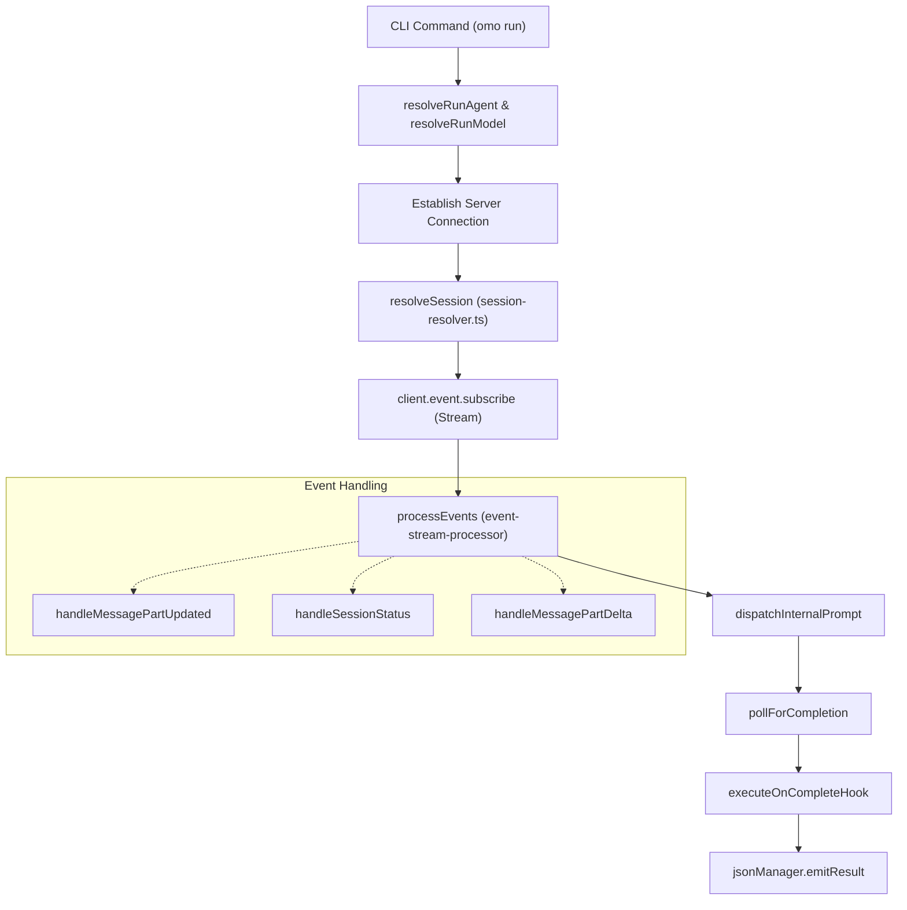
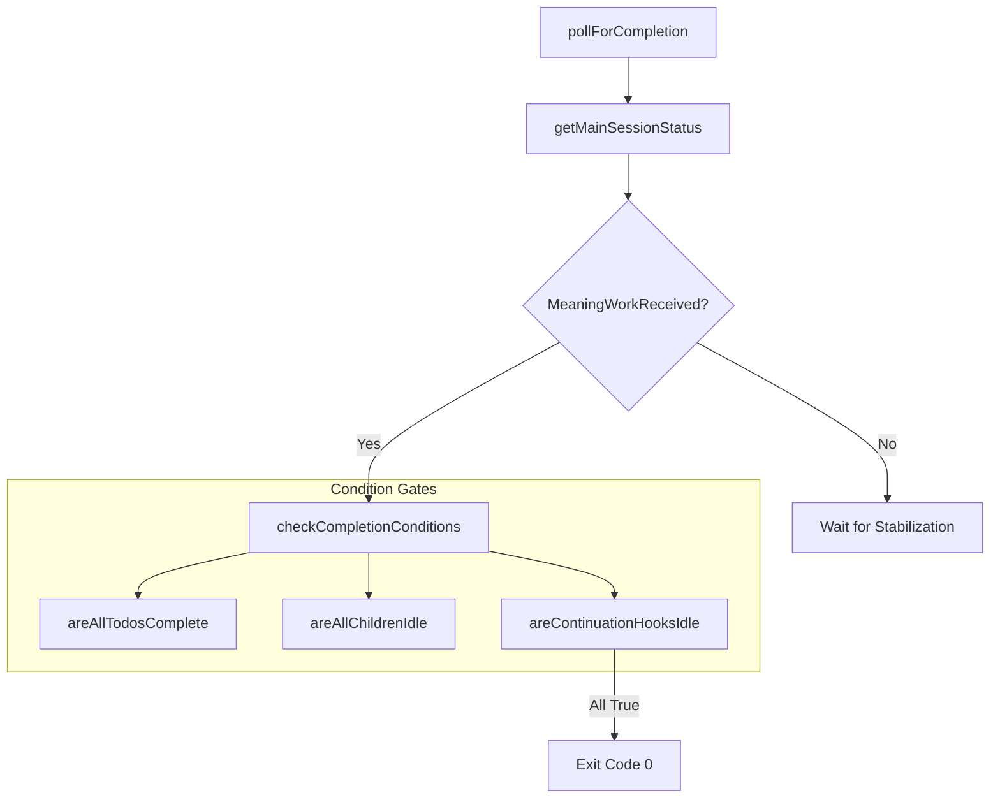
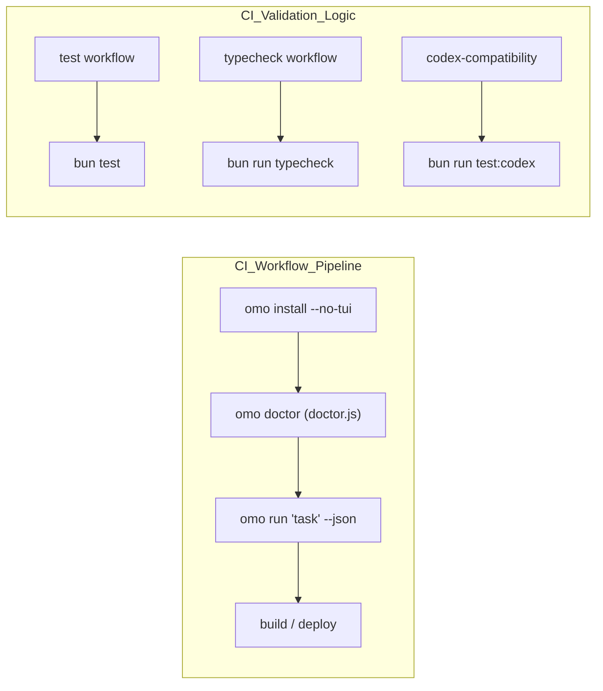

# Non-Interactive and CI Mode

Relevant source files

The following files were used as context for generating this wiki page:

- [.agents/skills/work-with-pr-workspace/iteration-1/eval-5/with_skill/outputs/execution-plan.md](https://github.com/code-yeongyu/oh-my-openagent/blob/HEAD/.agents/skills/work-with-pr-workspace/iteration-1/eval-5/with_skill/outputs/execution-plan.md)
- [.omo/evidence/20260809-omo-agent-toolkit-rename/task-5.txt](https://github.com/code-yeongyu/oh-my-openagent/blob/HEAD/.omo/evidence/20260809-omo-agent-toolkit-rename/task-5.txt)
- [.omo/evidence/20260809-omo-ai-beta-release/task-13.txt](https://github.com/code-yeongyu/oh-my-openagent/blob/HEAD/.omo/evidence/20260809-omo-ai-beta-release/task-13.txt)
- [.omo/evidence/20260809-omo-ai-beta-release/task-14.txt](https://github.com/code-yeongyu/oh-my-openagent/blob/HEAD/.omo/evidence/20260809-omo-ai-beta-release/task-14.txt)
- [.omo/evidence/20260809-omo-ai-beta-release/task-6.txt](https://github.com/code-yeongyu/oh-my-openagent/blob/HEAD/.omo/evidence/20260809-omo-ai-beta-release/task-6.txt)
- [.omo/evidence/20260812-omo-native-bun-update/windows-ci-fix.txt](https://github.com/code-yeongyu/oh-my-openagent/blob/HEAD/.omo/evidence/20260812-omo-native-bun-update/windows-ci-fix.txt)
- [.opencode/skills/work-with-pr-workspace/iteration-1/eval-5/with_skill/outputs/execution-plan.md](https://github.com/code-yeongyu/oh-my-openagent/blob/HEAD/.opencode/skills/work-with-pr-workspace/iteration-1/eval-5/with_skill/outputs/execution-plan.md)
- [CHANGELOG.md](https://github.com/code-yeongyu/oh-my-openagent/blob/HEAD/CHANGELOG.md)
- [README.ja.md](https://github.com/code-yeongyu/oh-my-openagent/blob/HEAD/README.ja.md)
- [README.ko.md](https://github.com/code-yeongyu/oh-my-openagent/blob/HEAD/README.ko.md)
- [README.md](https://github.com/code-yeongyu/oh-my-openagent/blob/HEAD/README.md)
- [README.ru.md](https://github.com/code-yeongyu/oh-my-openagent/blob/HEAD/README.ru.md)
- [README.zh-cn.md](https://github.com/code-yeongyu/oh-my-openagent/blob/HEAD/README.zh-cn.md)
- [assets/oh-my-opencode.schema.json](https://github.com/code-yeongyu/oh-my-openagent/blob/HEAD/assets/oh-my-opencode.schema.json)
- [docs/examples/coding-focused.jsonc](https://github.com/code-yeongyu/oh-my-openagent/blob/HEAD/docs/examples/coding-focused.jsonc)
- [docs/examples/default.jsonc](https://github.com/code-yeongyu/oh-my-openagent/blob/HEAD/docs/examples/default.jsonc)
- [docs/examples/planning-focused.jsonc](https://github.com/code-yeongyu/oh-my-openagent/blob/HEAD/docs/examples/planning-focused.jsonc)
- [docs/guide/agent-model-matching.md](https://github.com/code-yeongyu/oh-my-openagent/blob/HEAD/docs/guide/agent-model-matching.md)
- [docs/guide/installation.md](https://github.com/code-yeongyu/oh-my-openagent/blob/HEAD/docs/guide/installation.md)
- [docs/guide/orchestration.md](https://github.com/code-yeongyu/oh-my-openagent/blob/HEAD/docs/guide/orchestration.md)
- [docs/guide/overview.md](https://github.com/code-yeongyu/oh-my-openagent/blob/HEAD/docs/guide/overview.md)
- [docs/guide/team-mode.md](https://github.com/code-yeongyu/oh-my-openagent/blob/HEAD/docs/guide/team-mode.md)
- [docs/reference/cli.md](https://github.com/code-yeongyu/oh-my-openagent/blob/HEAD/docs/reference/cli.md)
- [docs/reference/codex-telemetry.md](https://github.com/code-yeongyu/oh-my-openagent/blob/HEAD/docs/reference/codex-telemetry.md)
- [docs/reference/configuration.md](https://github.com/code-yeongyu/oh-my-openagent/blob/HEAD/docs/reference/configuration.md)
- [docs/reference/features.md](https://github.com/code-yeongyu/oh-my-openagent/blob/HEAD/docs/reference/features.md)
- [docs/reference/known-issues.md](https://github.com/code-yeongyu/oh-my-openagent/blob/HEAD/docs/reference/known-issues.md)
- [docs/reference/prompt-async-gate-rfc.md](https://github.com/code-yeongyu/oh-my-openagent/blob/HEAD/docs/reference/prompt-async-gate-rfc.md)
- [docs/reference/rules-injection-cross-module-comparison.md](https://github.com/code-yeongyu/oh-my-openagent/blob/HEAD/docs/reference/rules-injection-cross-module-comparison.md)
- [packages/omo-codex/README.md](https://github.com/code-yeongyu/oh-my-openagent/blob/HEAD/packages/omo-codex/README.md)
- [packages/omo-codex/plugin/README.md](https://github.com/code-yeongyu/oh-my-openagent/blob/HEAD/packages/omo-codex/plugin/README.md)
- [packages/omo-codex/tsconfig.json](https://github.com/code-yeongyu/oh-my-openagent/blob/HEAD/packages/omo-codex/tsconfig.json)
- [packages/omo-native/.gitignore](https://github.com/code-yeongyu/oh-my-openagent/blob/HEAD/packages/omo-native/.gitignore)
- [packages/omo-native/bin/lib/doctor.js](https://github.com/code-yeongyu/oh-my-openagent/blob/HEAD/packages/omo-native/bin/lib/doctor.js)
- [packages/omo-native/bin/lib/launcher.js](https://github.com/code-yeongyu/oh-my-openagent/blob/HEAD/packages/omo-native/bin/lib/launcher.js)
- [packages/omo-native/bin/lib/setup-detect.js](https://github.com/code-yeongyu/oh-my-openagent/blob/HEAD/packages/omo-native/bin/lib/setup-detect.js)
- [packages/omo-native/bin/lib/setup-import.js](https://github.com/code-yeongyu/oh-my-openagent/blob/HEAD/packages/omo-native/bin/lib/setup-import.js)
- [packages/omo-native/bin/lib/setup-models.js](https://github.com/code-yeongyu/oh-my-openagent/blob/HEAD/packages/omo-native/bin/lib/setup-models.js)
- [packages/omo-native/bin/lib/setup-report.js](https://github.com/code-yeongyu/oh-my-openagent/blob/HEAD/packages/omo-native/bin/lib/setup-report.js)
- [packages/omo-native/bin/omo.js](https://github.com/code-yeongyu/oh-my-openagent/blob/HEAD/packages/omo-native/bin/omo.js)
- [packages/omo-native/test/brand-contract-pin.test.ts](https://github.com/code-yeongyu/oh-my-openagent/blob/HEAD/packages/omo-native/test/brand-contract-pin.test.ts)
- [packages/omo-native/test/launcher.test.ts](https://github.com/code-yeongyu/oh-my-openagent/blob/HEAD/packages/omo-native/test/launcher.test.ts)
- [packages/omo-native/test/payload.test.ts](https://github.com/code-yeongyu/oh-my-openagent/blob/HEAD/packages/omo-native/test/payload.test.ts)
- [packages/omo-native/test/setup-detect.test.ts](https://github.com/code-yeongyu/oh-my-openagent/blob/HEAD/packages/omo-native/test/setup-detect.test.ts)
- [packages/omo-native/test/setup-import.test.ts](https://github.com/code-yeongyu/oh-my-openagent/blob/HEAD/packages/omo-native/test/setup-import.test.ts)
- [packages/omo-native/test/sqlite-import-discipline.test.ts](https://github.com/code-yeongyu/oh-my-openagent/blob/HEAD/packages/omo-native/test/sqlite-import-discipline.test.ts)
- [packages/omo-native/test/tty-driver.py](https://github.com/code-yeongyu/oh-my-openagent/blob/HEAD/packages/omo-native/test/tty-driver.py)
- [packages/omo-opencode/src/shared/markdown-link-audit.test.ts](https://github.com/code-yeongyu/oh-my-openagent/blob/HEAD/packages/omo-opencode/src/shared/markdown-link-audit.test.ts)
- [packages/omo-senpi/src/install/local-launcher.test.ts](https://github.com/code-yeongyu/oh-my-openagent/blob/HEAD/packages/omo-senpi/src/install/local-launcher.test.ts)
- [packages/omo-senpi/src/install/local-launcher.ts](https://github.com/code-yeongyu/oh-my-openagent/blob/HEAD/packages/omo-senpi/src/install/local-launcher.ts)
- [postinstall.test.ts](https://github.com/code-yeongyu/oh-my-openagent/blob/HEAD/postinstall.test.ts)
- [script/build-omo-native.ts](https://github.com/code-yeongyu/oh-my-openagent/blob/HEAD/script/build-omo-native.ts)

Non-Interactive and CI mode allows `oh-my-opencode` (and its dual-published alias `oh-my-openagent`) to be executed as a headless process. This is designed for automated workflows, GitHub Actions, and integration into CI/CD pipelines where a human is not present to provide input. It provides a robust mechanism for triggering agent tasks via the command line, streaming events to `stdout`, and programmatically detecting task completion through structured JSON output.

## Overview of the `run` Command

The core entry point for non-interactive execution is the `run` command. When invoked, the runner sets specific environment variables to signal a non-interactive context to the rest of the system:
*   `OPENCODE_CLI_RUN_MODE = "true"`
*   `OPENCODE_CLIENT = "run"`

This mode is optimized for completion enforcement, ensuring the process exits only when all todos are resolved and background child sessions are idle. The system leverages the **Background Task System** managed by `BackgroundManager` to handle concurrent execution in these headless environments [docs/reference/configuration.md:17-19](https://github.com/code-yeongyu/oh-my-openagent/blob/HEAD/docs/reference/configuration.md#L17-L19).

### Data Flow: CLI to Event Loop

The `run` command follows a linear initialization path before entering a polling-based completion loop. It resolves the target agent and model using the provided flags or the **5-tier model resolution priority system** [docs/reference/configuration.md:15-16](https://github.com/code-yeongyu/oh-my-openagent/blob/HEAD/docs/reference/configuration.md#L15-L16). In CI environments, the `omo-native` launcher ensures the correct runtime environment is established before handing off to the `senpi` core [packages/omo-native/bin/lib/launcher.js:1-10](https://github.com/code-yeongyu/oh-my-openagent/blob/HEAD/packages/omo-native/bin/lib/launcher.js#L1-L10).

**Title: Run Command Execution Flow**

Sources: [docs/reference/configuration.md:14-29](https://github.com/code-yeongyu/oh-my-openagent/blob/HEAD/docs/reference/configuration.md#L14-L29), [docs/guide/orchestration.md:67-78](https://github.com/code-yeongyu/oh-my-openagent/blob/HEAD/docs/guide/orchestration.md#L67-L78), [docs/reference/configuration.md:15-16](https://github.com/code-yeongyu/oh-my-openagent/blob/HEAD/docs/reference/configuration.md#L15-L16), [packages/omo-native/bin/lib/launcher.js:1-10](https://github.com/code-yeongyu/oh-my-openagent/blob/HEAD/packages/omo-native/bin/lib/launcher.js#L1-L10)

## Event Streaming and State Management

Non-interactive mode relies on a real-time event stream from the OpenCode server. The system consumes this stream to update a local state object that tracks the lifecycle of the remote session.

### Event State Entity
The internal state tracks the lifecycle of the remote session to determine when it is safe to exit.

| Property | Role |
| :--- | :--- |
| `mainSessionIdle` | Boolean indicating if the server-side session is currently `idle`. |
| `hasReceivedMeaningfulWork` | Set to `true` once the agent sends text, reasoning, or tool calls. |
| `currentTool` | Tracks the currently executing tool to prevent premature exit. |
| `lastEventTimestamp` | Used by the watchdog to detect hung connections. |
| `messageCount` | Tracks total assistant messages for final summary reporting. |

Sources: [docs/reference/configuration.md:128-144](https://github.com/code-yeongyu/oh-my-openagent/blob/HEAD/docs/reference/configuration.md#L128-L144), [docs/guide/orchestration.md:100-111](https://github.com/code-yeongyu/oh-my-openagent/blob/HEAD/docs/guide/orchestration.md#L100-L111)

## Completion Detection Logic

Detecting "completion" in an autonomous agent system is complex because a session might be `idle` while waiting for a background task or a continuation hook (like a "Boulder" or "Ralph Loop"). The system must distinguish between a finished task and a momentary pause in activity.

The completion logic implements a multi-gate verification process:

1.  **Error Gate**: If a session error is detected, it exits with a non-zero code after a grace period.
2.  **Activity Gate**: If the session is `busy` or a tool is active, the completion check is skipped.
3.  **Meaningful Work Gate**: To prevent exiting before the agent starts, the system waits for meaningful work or a secondary timeout.
4.  **Condition Gate**: Verifies business logic, such as todos and child sessions.

### Completion Conditions Hierarchy

The system aggregates checks for todos, child sessions, and active hooks using the session state.

**Title: pollForCompletion Logic Gates**

Sources: [docs/reference/configuration.md:141-143](https://github.com/code-yeongyu/oh-my-openagent/blob/HEAD/docs/reference/configuration.md#L141-L143), [docs/guide/orchestration.md:151-165](https://github.com/code-yeongyu/oh-my-openagent/blob/HEAD/docs/guide/orchestration.md#L151-L165)

## Continuation State Monitoring

The system monitors external state to determine if the agent is part of a larger workflow that hasn't finished.

*   **Boulder Mechanism**: Long-running multi-session plans tracked via `todoContinuationEnforcer` [docs/reference/configuration.md:19-19](https://github.com/code-yeongyu/oh-my-openagent/blob/HEAD/docs/reference/configuration.md#L19).
*   **Ralph Loop / ULW Loop**: Continuous iteration loops that prevent the process from exiting until the objective is met [docs/guide/installation.md:5-6](https://github.com/code-yeongyu/oh-my-openagent/blob/HEAD/docs/guide/installation.md#L5-L6).
*   **Hook Markers**: Indicators from specific hooks, such as `atlasHook` or `backgroundNotificationHook`, that work is pending in the background [assets/oh-my-opencode.schema.json:51-56](https://github.com/code-yeongyu/oh-my-openagent/blob/HEAD/assets/oh-my-opencode.schema.json#L51-L56).

Sources: [docs/guide/installation.md:5-6](https://github.com/code-yeongyu/oh-my-openagent/blob/HEAD/docs/guide/installation.md#L5-L6), [assets/oh-my-opencode.schema.json:51-56](https://github.com/code-yeongyu/oh-my-openagent/blob/HEAD/assets/oh-my-opencode.schema.json#L51-L56), [docs/reference/configuration.md:19-19](https://github.com/code-yeongyu/oh-my-openagent/blob/HEAD/docs/reference/configuration.md#L19)

## CI Pipeline Integration

For CI environments, `oh-my-opencode run` provides specialized output and lifecycle hooks. The CLI includes diagnostic capabilities via the `doctor` command (implemented in `packages/omo-native/bin/lib/doctor.js`) to check environment health, provider availability, and model setup before execution [README.ko.md:135-135](https://github.com/code-yeongyu/oh-my-openagent/blob/HEAD/README.ko.md#L135), [packages/omo-native/bin/lib/doctor.js:1-20](https://github.com/code-yeongyu/oh-my-openagent/blob/HEAD/packages/omo-native/bin/lib/doctor.js#L1-L20).

### CI Workflow Example
A typical CI integration involves installing the plugin non-interactively and then executing a run command. The system is validated through comprehensive CI workflows that include building packages and running test suites across multiple platforms [README.md:61-70](https://github.com/code-yeongyu/oh-my-openagent/blob/HEAD/README.md#L61-L70).

**Title: CI Job Dependencies and Pipeline Validation**

Sources: [docs/guide/installation.md:33-39](https://github.com/code-yeongyu/oh-my-openagent/blob/HEAD/docs/guide/installation.md#L33-L39), [README.md:61-70](https://github.com/code-yeongyu/oh-my-openagent/blob/HEAD/README.md#L61-L70), [README.ko.md:135-135](https://github.com/code-yeongyu/oh-my-openagent/blob/HEAD/README.ko.md#L135), [packages/omo-native/bin/lib/doctor.js:1-20](https://github.com/code-yeongyu/oh-my-openagent/blob/HEAD/packages/omo-native/bin/lib/doctor.js#L1-L20)

### JSON Output and Completion Hooks
When the `--json` flag is used, the runner outputs a structured JSON result. The system allows executing shell commands once the agent finishes its task to facilitate pipeline transitions.

### Non-Interactive Installation
For automated setup, the `install` command supports a `--no-tui` flag and subscription-specific flags to bypass interactive prompts. For Codex-specific CI, the `--codex-autonomous` flag configures the environment with full permissions (`approval_policy = "never"`, `sandbox_mode = "danger-full-access"`) and hidden warnings [docs/guide/installation.md:33-39](https://github.com/code-yeongyu/oh-my-openagent/blob/HEAD/docs/guide/installation.md#L33-L39). The installer also handles platform-specific binary selection for the 11 supported platforms, including ARM64 and MUSL variants [docs/guide/installation.md:10-14](https://github.com/code-yeongyu/oh-my-openagent/blob/HEAD/docs/guide/installation.md#L10-L14).

Sources: [docs/guide/installation.md:33-39](https://github.com/code-yeongyu/oh-my-openagent/blob/HEAD/docs/guide/installation.md#L33-L39), [docs/guide/installation.md:10-14](https://github.com/code-yeongyu/oh-my-openagent/blob/HEAD/docs/guide/installation.md#L10-L14)