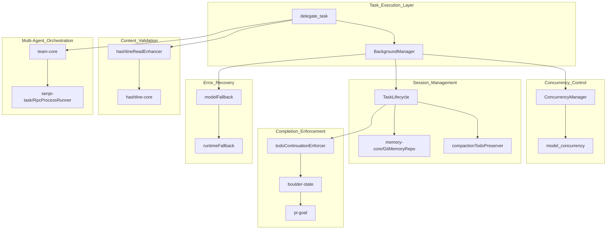
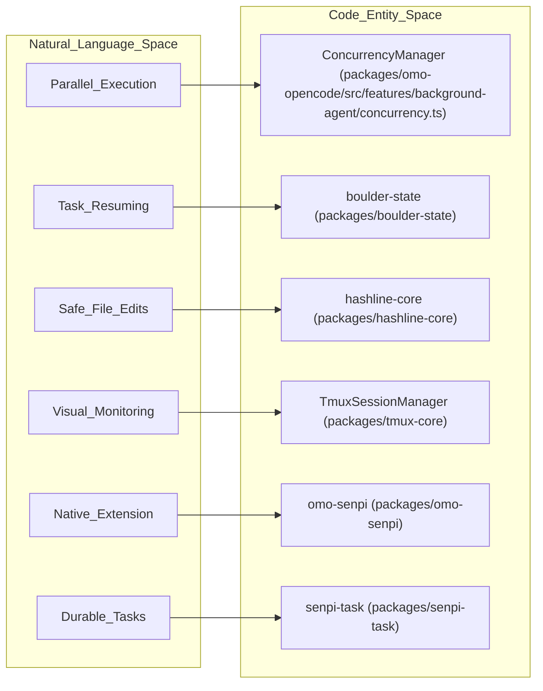

# Advanced Topics

Relevant source files

The following files were used as context for generating this wiki page:

- [.omo/evidence/20260812-init-deep/hierarchy-green.txt](https://github.com/code-yeongyu/oh-my-openagent/blob/HEAD/.omo/evidence/20260812-init-deep/hierarchy-green.txt)
- [.omo/evidence/20260812-init-deep/hierarchy-red.txt](https://github.com/code-yeongyu/oh-my-openagent/blob/HEAD/.omo/evidence/20260812-init-deep/hierarchy-red.txt)
- [.omo/evidence/20260812-init-deep/manual-review.md](https://github.com/code-yeongyu/oh-my-openagent/blob/HEAD/.omo/evidence/20260812-init-deep/manual-review.md)
- [.omo/evidence/20260812-init-deep/qa-summary.md](https://github.com/code-yeongyu/oh-my-openagent/blob/HEAD/.omo/evidence/20260812-init-deep/qa-summary.md)
- [.omo/evidence/20260812-init-deep/scoring.md](https://github.com/code-yeongyu/oh-my-openagent/blob/HEAD/.omo/evidence/20260812-init-deep/scoring.md)
- [.omo/evidence/20260812-init-deep/validation-green.txt](https://github.com/code-yeongyu/oh-my-openagent/blob/HEAD/.omo/evidence/20260812-init-deep/validation-green.txt)
- [.omo/evidence/20260812-init-deep/validation-red.txt](https://github.com/code-yeongyu/oh-my-openagent/blob/HEAD/.omo/evidence/20260812-init-deep/validation-red.txt)
- [AGENTS.md](https://github.com/code-yeongyu/oh-my-openagent/blob/HEAD/AGENTS.md)
- [bun.lock](https://github.com/code-yeongyu/oh-my-openagent/blob/HEAD/bun.lock)
- [package.json](https://github.com/code-yeongyu/oh-my-openagent/blob/HEAD/package.json)
- [packages/AGENTS.md](https://github.com/code-yeongyu/oh-my-openagent/blob/HEAD/packages/AGENTS.md)
- [packages/memory-core/AGENTS.md](https://github.com/code-yeongyu/oh-my-openagent/blob/HEAD/packages/memory-core/AGENTS.md)
- [packages/omo-codex/scripts/install-dist/install-local.mjs](https://github.com/code-yeongyu/oh-my-openagent/blob/HEAD/packages/omo-codex/scripts/install-dist/install-local.mjs)
- [packages/omo-native/package.json](https://github.com/code-yeongyu/oh-my-openagent/blob/HEAD/packages/omo-native/package.json)
- [packages/omo-native/test/package-shape.test.ts](https://github.com/code-yeongyu/oh-my-openagent/blob/HEAD/packages/omo-native/test/package-shape.test.ts)
- [packages/omo-native/test/senpi-pin.test.ts](https://github.com/code-yeongyu/oh-my-openagent/blob/HEAD/packages/omo-native/test/senpi-pin.test.ts)
- [packages/omo-senpi/package.json](https://github.com/code-yeongyu/oh-my-openagent/blob/HEAD/packages/omo-senpi/package.json)
- [packages/omo-senpi/plugin/package.json](https://github.com/code-yeongyu/oh-my-openagent/blob/HEAD/packages/omo-senpi/plugin/package.json)
- [packages/omo-senpi/src/package-shape.test.ts](https://github.com/code-yeongyu/oh-my-openagent/blob/HEAD/packages/omo-senpi/src/package-shape.test.ts)
- [packages/senpi-task/package.json](https://github.com/code-yeongyu/oh-my-openagent/blob/HEAD/packages/senpi-task/package.json)

This page covers advanced technical systems within oh-my-openagent that enable production-grade reliability, concurrency control, and error recovery. These systems operate beneath the agent and tool layers to ensure stable, deterministic execution.

For basic agent orchestration concepts, see [Agent Orchestration](06_2.2-agent-orchestration.md). For hook system mechanics, see [Hook System](25_5-hook-system.md). For configuration of these features, see [Configuration Reference](30_6-configuration-reference.md).

## Overview of Advanced Systems

The plugin implements twelve core advanced systems that work in concert:

1.  **Concurrency and Parallelism** — Resource-limited parallel task execution via `BackgroundManager` and `ConcurrencyManager` [packages/omo-opencode/src/features/background-agent/manager.ts:56-56](https://github.com/code-yeongyu/oh-my-openagent/blob/HEAD/packages/omo-opencode/src/features/background-agent/manager.ts#L56).
2.  **Session Continuity** — Persistent session context through delegation chains and context preservation hooks [packages/omo-opencode/src/hooks/AGENTS.md:92-97](https://github.com/code-yeongyu/oh-my-openagent/blob/HEAD/packages/omo-opencode/src/hooks/AGENTS.md#L92-L97).
3.  **Hashline Edit System** — Content-hash validation preventing stale-line errors via `LINE#ID` hashing [packages/omo-opencode/src/hooks/AGENTS.md:71-71](https://github.com/code-yeongyu/oh-my-openagent/blob/HEAD/packages/omo-opencode/src/hooks/AGENTS.md#L71).
4.  **Ralph Loop and Todo Enforcement** — Completion guarantees through the `todoContinuationEnforcer` (Boulder) mechanism [packages/omo-opencode/src/hooks/AGENTS.md:96-96](https://github.com/code-yeongyu/oh-my-openagent/blob/HEAD/packages/omo-opencode/src/hooks/AGENTS.md#L96).
5.  **Model Error Recovery** — Multi-tier fallback strategies for provider and runtime failures [packages/omo-opencode/src/hooks/AGENTS.md:48-52](https://github.com/code-yeongyu/oh-my-openagent/blob/HEAD/packages/omo-opencode/src/hooks/AGENTS.md#L48-L52).
6.  **Tmux Subagent Integration** — Visual monitoring and pane management for background tasks via `TmuxSessionManager` [packages/omo-opencode/src/features/AGENTS.md:15-15](https://github.com/code-yeongyu/oh-my-openagent/blob/HEAD/packages/omo-opencode/src/features/AGENTS.md#L15).
7.  **Team Mode** — High-scale parallel multi-agent coordination with worktree isolation and mailbox communication [packages/omo-opencode/src/features/team-mode/AGENTS.md:7-9](https://github.com/code-yeongyu/oh-my-openagent/blob/HEAD/packages/omo-opencode/src/features/team-mode/AGENTS.md#L7-L9).
8.  **LazyCodex (omo-codex) Light Edition** — A portable component architecture for the OpenAI Codex CLI [packages/AGENTS.md:16-16](https://github.com/code-yeongyu/oh-my-openagent/blob/HEAD/packages/AGENTS.md#L16).
9.  **Senpi (omo-senpi) Adapter** — Native adapter for Senpi/Pi extension environments [packages/AGENTS.md:16-16](https://github.com/code-yeongyu/oh-my-openagent/blob/HEAD/packages/AGENTS.md#L16).
10. **Senpi Task Engine** — A durable task state machine and steering engine powering multi-agent coordination [packages/AGENTS.md:16-16](https://github.com/code-yeongyu/oh-my-openagent/blob/HEAD/packages/AGENTS.md#L16).
11. **Agent Memory System** — Git-backed markdown MemFS for long-term agent reflection and recall [packages/AGENTS.md:48-48](https://github.com/code-yeongyu/oh-my-openagent/blob/HEAD/packages/AGENTS.md#L48).
12. **omo-native (Native CLI)** — The Senpi-based native OMO harness and `omo-ai` launcher [packages/omo-native/package.json:2-8](https://github.com/code-yeongyu/oh-my-openagent/blob/HEAD/packages/omo-native/package.json#L2-L8).

These systems are transparent to end users but critical for plugin reliability.

---

## System Interdependencies

The following diagram illustrates how high-level tools interact with internal managers and hooks to ensure system stability.

Title: System Component Interdependency Map

**Sources:** [packages/omo-opencode/src/hooks/AGENTS.md:26-103](https://github.com/code-yeongyu/oh-my-openagent/blob/HEAD/packages/omo-opencode/src/hooks/AGENTS.md#L26-L103), [packages/omo-opencode/src/features/AGENTS.md:37-59](https://github.com/code-yeongyu/oh-my-openagent/blob/HEAD/packages/omo-opencode/src/features/AGENTS.md#L37-L59), [packages/AGENTS.md:35-61](https://github.com/code-yeongyu/oh-my-openagent/blob/HEAD/packages/AGENTS.md#L35-L61), [packages/senpi-task/package.json:28-30](https://github.com/code-yeongyu/oh-my-openagent/blob/HEAD/packages/senpi-task/package.json#L28-L30)

---

## Concurrency and Parallelism

The system uses a sophisticated concurrency control mechanism to manage resource-heavy agent tasks.

*   **Concurrency Limits**: Tasks are subject to limits per model and provider. The `ConcurrencyManager` manages a queue-per-key architecture, typically defaulting to 5 concurrent tasks per model/provider [packages/omo-opencode/src/features/background-agent/manager.ts:56-56](https://github.com/code-yeongyu/oh-my-openagent/blob/HEAD/packages/omo-opencode/src/features/background-agent/manager.ts#L56), [packages/omo-opencode/src/features/AGENTS.md:43-43](https://github.com/code-yeongyu/oh-my-openagent/blob/HEAD/packages/omo-opencode/src/features/AGENTS.md#L43).
*   **Execution Queues**: The FIFO queue prevents rate-limiting by serializing requests to the same provider/model key [packages/omo-opencode/src/features/AGENTS.md:43-43](https://github.com/code-yeongyu/oh-my-openagent/blob/HEAD/packages/omo-opencode/src/features/AGENTS.md#L43).
*   **Parallel Agents**: The system supports firing multiple agents in parallel, especially in `ultrawork` and `team-mode` [packages/omo-opencode/src/hooks/keyword-detector/AGENTS.md:15-15](https://github.com/code-yeongyu/oh-my-openagent/blob/HEAD/packages/omo-opencode/src/hooks/keyword-detector/AGENTS.md#L15).

For details, see [Concurrency and Parallelism](57_10.1-concurrency-and-parallelism.md).

**Sources:** [packages/omo-opencode/src/features/background-agent/manager.ts:56-56](https://github.com/code-yeongyu/oh-my-openagent/blob/HEAD/packages/omo-opencode/src/features/background-agent/manager.ts#L56), [packages/omo-opencode/src/features/AGENTS.md:43-43](https://github.com/code-yeongyu/oh-my-openagent/blob/HEAD/packages/omo-opencode/src/features/AGENTS.md#L43), [packages/omo-opencode/src/hooks/keyword-detector/AGENTS.md:15-15](https://github.com/code-yeongyu/oh-my-openagent/blob/HEAD/packages/omo-opencode/src/hooks/keyword-detector/AGENTS.md#L15)

---

## Session Continuity

Session continuity preserves agent context across complex delegation chains and prevents work loss.

*   **Context Preservation**: Compaction hooks ensure that critical context, such as active todos and goals, are preserved even when the model's context window is rotated [packages/omo-opencode/src/hooks/AGENTS.md:92-97](https://github.com/code-yeongyu/oh-my-openagent/blob/HEAD/packages/omo-opencode/src/hooks/AGENTS.md#L92-L97).
*   **Task Resuming**: The `taskResumeInfo` hook injects task context on session resume [packages/omo-opencode/src/hooks/AGENTS.md:47-47](https://github.com/code-yeongyu/oh-my-openagent/blob/HEAD/packages/omo-opencode/src/hooks/AGENTS.md#L47).
*   **State Management**: Core packages like `boulder-state` and `senpi-task` provide the persistent work tracking required for long-term task continuity [packages/AGENTS.md:47-47](https://github.com/code-yeongyu/oh-my-openagent/blob/HEAD/packages/AGENTS.md#L47), [packages/AGENTS.md:16-16](https://github.com/code-yeongyu/oh-my-openagent/blob/HEAD/packages/AGENTS.md#L16).

For details, see [Session Continuity](58_10.2-session-continuity.md).

**Sources:** [packages/omo-opencode/src/hooks/AGENTS.md:47-97](https://github.com/code-yeongyu/oh-my-openagent/blob/HEAD/packages/omo-opencode/src/hooks/AGENTS.md#L47-L97), [packages/AGENTS.md:16-47](https://github.com/code-yeongyu/oh-my-openagent/blob/HEAD/packages/AGENTS.md#L16-L47)

---

## Hashline Edit System

The `hashline_edit` tool provides a robust alternative to standard file writing by using `LINE#ID` content hashing to prevent stale edits.

*   **Hash Anchoring**: The `hashlineReadEnhancer` tags every Read output with content hashes [packages/omo-opencode/src/hooks/AGENTS.md:71-71](https://github.com/code-yeongyu/oh-my-openagent/blob/HEAD/packages/omo-opencode/src/hooks/AGENTS.md#L71).
*   **Core Logic**: Implementation resides in the `hashline-core` package, which provides primitives for diffing and validation shared across adapters [packages/AGENTS.md:46-46](https://github.com/code-yeongyu/oh-my-openagent/blob/HEAD/packages/AGENTS.md#L46).
*   **Error Recovery**: The `editErrorRecovery` hook automatically attempts to fix failed file edits [packages/omo-opencode/src/hooks/AGENTS.md:41-41](https://github.com/code-yeongyu/oh-my-openagent/blob/HEAD/packages/omo-opencode/src/hooks/AGENTS.md#L41).

For details, see [Hashline Edit System](59_10.3-hashline-edit-system.md).

**Sources:** [packages/omo-opencode/src/hooks/AGENTS.md:41-71](https://github.com/code-yeongyu/oh-my-openagent/blob/HEAD/packages/omo-opencode/src/hooks/AGENTS.md#L41-L71), [packages/AGENTS.md:46-46](https://github.com/code-yeongyu/oh-my-openagent/blob/HEAD/packages/AGENTS.md#L46)

---

## Ralph Loop and Todo Enforcement

The "Ralph Loop" (superseded by `goal` and `ulw-loop`) and the Boulder mechanism ensure that agents drive tasks to completion without stalling.

*   **Todo Enforcement**: The `todoContinuationEnforcer` (Boulder) monitors task state and forces continuation if todos remain incomplete [packages/omo-opencode/src/hooks/AGENTS.md:96-96](https://github.com/code-yeongyu/oh-my-openagent/blob/HEAD/packages/omo-opencode/src/hooks/AGENTS.md#L96).
*   **Persistent Goals**: The `pi-goal` package provides persistent Codex-style goal tools and continuation [packages/AGENTS.md:16-16](https://github.com/code-yeongyu/oh-my-openagent/blob/HEAD/packages/AGENTS.md#L16).
*   **Loop Trigger**: Users can engage this mode via the `ultrawork` keyword, which injects orchestration prompts [packages/omo-opencode/src/hooks/keyword-detector/AGENTS.md:15-15](https://github.com/code-yeongyu/oh-my-openagent/blob/HEAD/packages/omo-opencode/src/hooks/keyword-detector/AGENTS.md#L15).

For details, see [Ralph Loop and Todo Enforcement](60_10.4-ralph-loop-and-todo-enforcement.md).

**Sources:** [packages/omo-opencode/src/hooks/AGENTS.md:40-96](https://github.com/code-yeongyu/oh-my-openagent/blob/HEAD/packages/omo-opencode/src/hooks/AGENTS.md#L40-L96), [packages/omo-opencode/src/hooks/keyword-detector/AGENTS.md:15-15](https://github.com/code-yeongyu/oh-my-openagent/blob/HEAD/packages/omo-opencode/src/hooks/keyword-detector/AGENTS.md#L15), [packages/AGENTS.md:16-16](https://github.com/code-yeongyu/oh-my-openagent/blob/HEAD/packages/AGENTS.md#L16)

---

## Model Error Recovery

The plugin implements a multi-tier fallback hierarchy to handle provider outages and model-specific errors.

*   **Proactive Fallback**: The `modelFallback` hook handles provider-level proactive switches during session parameterization [packages/omo-opencode/src/hooks/AGENTS.md:48-48](https://github.com/code-yeongyu/oh-my-openagent/blob/HEAD/packages/omo-opencode/src/hooks/AGENTS.md#L48).
*   **Reactive Fallback**: The `runtimeFallback` hook performs reactive auto-switching on live API provider errors [packages/omo-opencode/src/hooks/AGENTS.md:52-52](https://github.com/code-yeongyu/oh-my-openagent/blob/HEAD/packages/omo-opencode/src/hooks/AGENTS.md#L52).
*   **Context Recovery**: The `anthropicContextWindowLimitRecovery` hook implements specific strategies (truncation, compaction) for context window exhaustion [packages/omo-opencode/src/hooks/AGENTS.md:33-33](https://github.com/code-yeongyu/oh-my-openagent/blob/HEAD/packages/omo-opencode/src/hooks/AGENTS.md#L33).

For details, see [Model Error Recovery](61_10.5-model-error-recovery.md).

**Sources:** [packages/omo-opencode/src/hooks/AGENTS.md:33-52](https://github.com/code-yeongyu/oh-my-openagent/blob/HEAD/packages/omo-opencode/src/hooks/AGENTS.md#L33-L52)

---

## Tmux Subagent Integration

For complex, long-running tasks, the `tmux` integration provides a visual interface for monitoring background agents in separate panes.

*   **Pane Management**: The `TmuxSessionManager` plans the grid layout and spawns background agents into their own tmux panes [packages/omo-opencode/src/features/AGENTS.md:15-15](https://github.com/code-yeongyu/oh-my-openagent/blob/HEAD/packages/omo-opencode/src/features/AGENTS.md#L15), [packages/omo-opencode/src/features/background-agent/manager.ts:101-101](https://github.com/code-yeongyu/oh-my-openagent/blob/HEAD/packages/omo-opencode/src/features/background-agent/manager.ts#L101).
*   **Core Primitives**: Harness-neutral tmux session, pane, and layout primitives live in the `tmux-core` package [packages/AGENTS.md:51-51](https://github.com/code-yeongyu/oh-my-openagent/blob/HEAD/packages/AGENTS.md#L51).
*   **Interactive Sessions**: The `interactiveBashSession` hook manages the lifecycle of tmux sessions for interactive tools [packages/omo-opencode/src/hooks/AGENTS.md:39-39](https://github.com/code-yeongyu/oh-my-openagent/blob/HEAD/packages/omo-opencode/src/hooks/AGENTS.md#L39).

For details, see [Tmux Subagent Integration](62_10.6-tmux-subagent-integration.md).

**Sources:** [packages/omo-opencode/src/features/AGENTS.md:15-15](https://github.com/code-yeongyu/oh-my-openagent/blob/HEAD/packages/omo-opencode/src/features/AGENTS.md#L15), [packages/AGENTS.md:51-51](https://github.com/code-yeongyu/oh-my-openagent/blob/HEAD/packages/AGENTS.md#L51), [packages/omo-opencode/src/hooks/AGENTS.md:39-39](https://github.com/code-yeongyu/oh-my-openagent/blob/HEAD/packages/omo-opencode/src/hooks/AGENTS.md#L39)

---

## Team Mode

Team Mode is a high-scale orchestration system for coordinating up to 8 agents in parallel within isolated worktrees.

*   **Team Lifecycle**: Managed via `team-core`, including member roles and mailbox communication [packages/AGENTS.md:15-15](https://github.com/code-yeongyu/oh-my-openagent/blob/HEAD/packages/AGENTS.md#L15).
*   **Worktree Isolation**: Each team member operates in its own git worktree to prevent file system conflicts [packages/omo-opencode/src/features/team-mode/AGENTS.md:113-113](https://github.com/code-yeongyu/oh-my-openagent/blob/HEAD/packages/omo-opencode/src/features/team-mode/AGENTS.md#L113).
*   **Mailbox**: Communication is handled through a mailbox injector that facilitates inter-agent messaging [packages/omo-opencode/src/features/team-mode/AGENTS.md:97-98](https://github.com/code-yeongyu/oh-my-openagent/blob/HEAD/packages/omo-opencode/src/features/team-mode/AGENTS.md#L97-L98).

For details, see [Team Mode](63_10.7-team-mode.md).

**Sources:** [packages/omo-opencode/src/features/team-mode/AGENTS.md:33-113](https://github.com/code-yeongyu/oh-my-openagent/blob/HEAD/packages/omo-opencode/src/features/team-mode/AGENTS.md#L33-L113), [packages/AGENTS.md:15-15](https://github.com/code-yeongyu/oh-my-openagent/blob/HEAD/packages/AGENTS.md#L15)

---

## Senpi (omo-senpi) and Native CLI

The Senpi ecosystem provides a native TypeScript extension adapter and a dedicated CLI launcher.

*   **Adapter Architecture**: `omo-senpi` acts as the native adapter, consuming core packages like `lsp-core`, `telemetry-core`, and `senpi-task` [packages/omo-senpi/package.json:29-43](https://github.com/code-yeongyu/oh-my-openagent/blob/HEAD/packages/omo-senpi/package.json#L29-L43).
*   **Task Engine**: The `senpi-task` package provides a harness-coupled task state machine with `InProcessRunner` and `RpcProcessRunner` capabilities [packages/senpi-task/package.json:6-30](https://github.com/code-yeongyu/oh-my-openagent/blob/HEAD/packages/senpi-task/package.json#L6-L30).
*   **Native CLI**: The `omo-ai` package (omo-native) provides the `omo` binary, pinning a specific version of `@code-yeongyu/senpi` [packages/omo-native/package.json:2-17](https://github.com/code-yeongyu/oh-my-openagent/blob/HEAD/packages/omo-native/package.json#L2-L17), [packages/omo-native/test/package-shape.test.ts:26-27](https://github.com/code-yeongyu/oh-my-openagent/blob/HEAD/packages/omo-native/test/package-shape.test.ts#L26-L27).

For details, see [Senpi (omo-senpi) Adapter](65_10.9-senpi-omo-senpi-adapter.md), [Senpi Task Engine](66_10.10-senpi-task-engine.md), and [omo-native (Native CLI)](68_10.12-omo-native-native-cli.md).

**Sources:** [packages/omo-senpi/package.json:29-43](https://github.com/code-yeongyu/oh-my-openagent/blob/HEAD/packages/omo-senpi/package.json#L29-L43), [packages/senpi-task/package.json:6-30](https://github.com/code-yeongyu/oh-my-openagent/blob/HEAD/packages/senpi-task/package.json#L6-L30), [packages/omo-native/package.json:2-17](https://github.com/code-yeongyu/oh-my-openagent/blob/HEAD/packages/omo-native/package.json#L2-L17)

---

## Advanced Code Entity Mapping

This diagram bridges natural language features to the specific TypeScript modules and core packages that implement them.

Title: Bridge Diagram: Features to Code Entities

**Sources:** [packages/AGENTS.md:15-61](https://github.com/code-yeongyu/oh-my-openagent/blob/HEAD/packages/AGENTS.md#L15-L61), [packages/omo-opencode/src/hooks/AGENTS.md:26-53](https://github.com/code-yeongyu/oh-my-openagent/blob/HEAD/packages/omo-opencode/src/hooks/AGENTS.md#L26-L53), [packages/omo-opencode/src/features/background-agent/manager.ts:56-56](https://github.com/code-yeongyu/oh-my-openagent/blob/HEAD/packages/omo-opencode/src/features/background-agent/manager.ts#L56), [packages/omo-senpi/package.json:2-6](https://github.com/code-yeongyu/oh-my-openagent/blob/HEAD/packages/omo-senpi/package.json#L2-L6), [packages/senpi-task/package.json:2-6](https://github.com/code-yeongyu/oh-my-openagent/blob/HEAD/packages/senpi-task/package.json#L2-L6)4f:T35a2,# Concurrency a