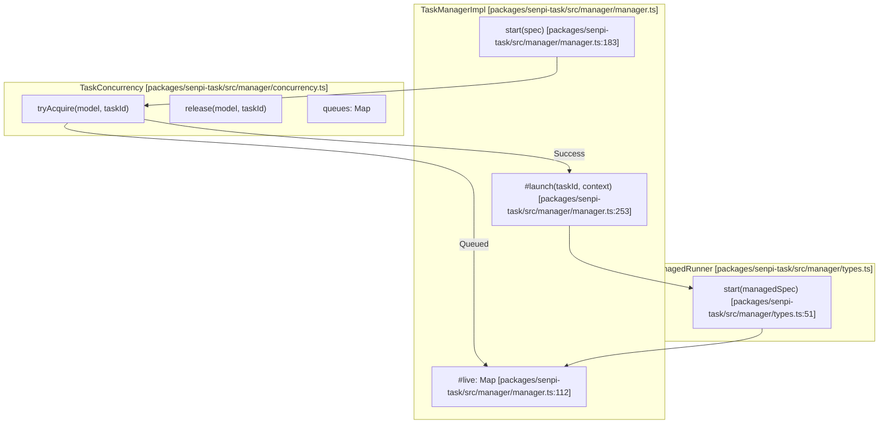
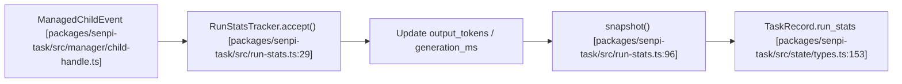
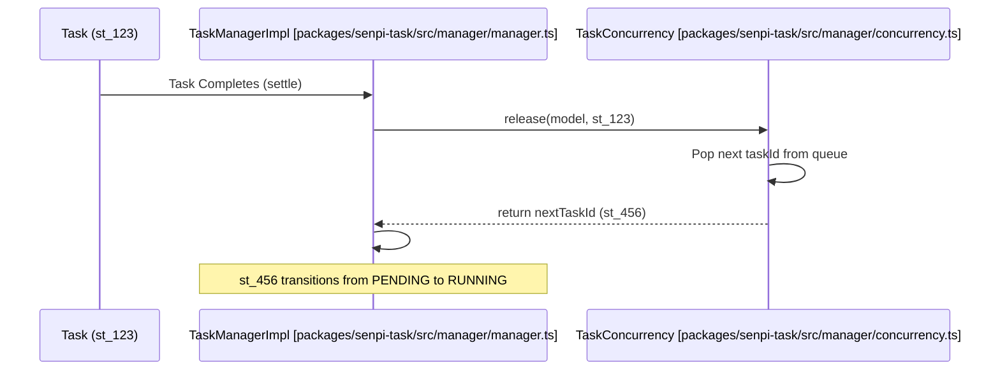

# Concurrency and Parallelism

Relevant source files

The following files were used as context for generating this wiki page:

- [packages/omo-opencode/src/features/background-agent/background-task-marker.ts](https://github.com/code-yeongyu/oh-my-openagent/blob/HEAD/packages/omo-opencode/src/features/background-agent/background-task-marker.ts)
- [packages/omo-opencode/src/features/background-agent/error-classifier.test.ts](https://github.com/code-yeongyu/oh-my-openagent/blob/HEAD/packages/omo-opencode/src/features/background-agent/error-classifier.test.ts)
- [packages/omo-opencode/src/features/background-agent/error-classifier.ts](https://github.com/code-yeongyu/oh-my-openagent/blob/HEAD/packages/omo-opencode/src/features/background-agent/error-classifier.ts)
- [packages/omo-opencode/src/features/background-agent/manager-continuation-marker.test.ts](https://github.com/code-yeongyu/oh-my-openagent/blob/HEAD/packages/omo-opencode/src/features/background-agent/manager-continuation-marker.test.ts)
- [packages/omo-opencode/src/features/background-agent/manager.test.ts](https://github.com/code-yeongyu/oh-my-openagent/blob/HEAD/packages/omo-opencode/src/features/background-agent/manager.test.ts)
- [packages/omo-opencode/src/features/background-agent/manager.ts](https://github.com/code-yeongyu/oh-my-openagent/blob/HEAD/packages/omo-opencode/src/features/background-agent/manager.ts)
- [packages/omo-opencode/src/features/background-agent/parent-wake-active-defer-ceiling.test.ts](https://github.com/code-yeongyu/oh-my-openagent/blob/HEAD/packages/omo-opencode/src/features/background-agent/parent-wake-active-defer-ceiling.test.ts)
- [packages/omo-opencode/src/features/background-agent/parent-wake-active-turn-event.test.ts](https://github.com/code-yeongyu/oh-my-openagent/blob/HEAD/packages/omo-opencode/src/features/background-agent/parent-wake-active-turn-event.test.ts)
- [packages/omo-opencode/src/features/background-agent/parent-wake-assistant-text-race.test.ts](https://github.com/code-yeongyu/oh-my-openagent/blob/HEAD/packages/omo-opencode/src/features/background-agent/parent-wake-assistant-text-race.test.ts)
- [packages/omo-opencode/src/features/background-agent/parent-wake-dedupe.ts](https://github.com/code-yeongyu/oh-my-openagent/blob/HEAD/packages/omo-opencode/src/features/background-agent/parent-wake-dedupe.ts)
- [packages/omo-opencode/src/features/background-agent/parent-wake-dispatched-tracker.ts](https://github.com/code-yeongyu/oh-my-openagent/blob/HEAD/packages/omo-opencode/src/features/background-agent/parent-wake-dispatched-tracker.ts)
- [packages/omo-opencode/src/features/background-agent/parent-wake-flush-runner.ts](https://github.com/code-yeongyu/oh-my-openagent/blob/HEAD/packages/omo-opencode/src/features/background-agent/parent-wake-flush-runner.ts)
- [packages/omo-opencode/src/features/background-agent/parent-wake-inflight-dispatch.test.ts](https://github.com/code-yeongyu/oh-my-openagent/blob/HEAD/packages/omo-opencode/src/features/background-agent/parent-wake-inflight-dispatch.test.ts)
- [packages/omo-opencode/src/features/background-agent/parent-wake-late-error-recovery.test.ts](https://github.com/code-yeongyu/oh-my-openagent/blob/HEAD/packages/omo-opencode/src/features/background-agent/parent-wake-late-error-recovery.test.ts)
- [packages/omo-opencode/src/features/background-agent/parent-wake-notifier-types.ts](https://github.com/code-yeongyu/oh-my-openagent/blob/HEAD/packages/omo-opencode/src/features/background-agent/parent-wake-notifier-types.ts)
- [packages/omo-opencode/src/features/background-agent/parent-wake-notifier.ts](https://github.com/code-yeongyu/oh-my-openagent/blob/HEAD/packages/omo-opencode/src/features/background-agent/parent-wake-notifier.ts)
- [packages/omo-opencode/src/features/background-agent/parent-wake-pending-queue.ts](https://github.com/code-yeongyu/oh-my-openagent/blob/HEAD/packages/omo-opencode/src/features/background-agent/parent-wake-pending-queue.ts)
- [packages/omo-opencode/src/features/background-agent/parent-wake-window-recovery.ts](https://github.com/code-yeongyu/oh-my-openagent/blob/HEAD/packages/omo-opencode/src/features/background-agent/parent-wake-window-recovery.ts)
- [packages/omo-opencode/src/features/background-agent/parent-wake-window-requeue.test.ts](https://github.com/code-yeongyu/oh-my-openagent/blob/HEAD/packages/omo-opencode/src/features/background-agent/parent-wake-window-requeue.test.ts)
- [packages/omo-senpi/scripts/qa/task-stats-renderer.mjs](https://github.com/code-yeongyu/oh-my-openagent/blob/HEAD/packages/omo-senpi/scripts/qa/task-stats-renderer.mjs)
- [packages/senpi-task/src/completion.test.ts](https://github.com/code-yeongyu/oh-my-openagent/blob/HEAD/packages/senpi-task/src/completion.test.ts)
- [packages/senpi-task/src/completion/model-visibility.test.ts](https://github.com/code-yeongyu/oh-my-openagent/blob/HEAD/packages/senpi-task/src/completion/model-visibility.test.ts)
- [packages/senpi-task/src/manager/__fixtures__/manager-fakes.ts](https://github.com/code-yeongyu/oh-my-openagent/blob/HEAD/packages/senpi-task/src/manager/__fixtures__/manager-fakes.ts)
- [packages/senpi-task/src/manager/child-handle.ts](https://github.com/code-yeongyu/oh-my-openagent/blob/HEAD/packages/senpi-task/src/manager/child-handle.ts)
- [packages/senpi-task/src/manager/manager-fallback.test.ts](https://github.com/code-yeongyu/oh-my-openagent/blob/HEAD/packages/senpi-task/src/manager/manager-fallback.test.ts)
- [packages/senpi-task/src/manager/manager-helpers.ts](https://github.com/code-yeongyu/oh-my-openagent/blob/HEAD/packages/senpi-task/src/manager/manager-helpers.ts)
- [packages/senpi-task/src/manager/manager-hygiene.test.ts](https://github.com/code-yeongyu/oh-my-openagent/blob/HEAD/packages/senpi-task/src/manager/manager-hygiene.test.ts)
- [packages/senpi-task/src/manager/manager-respawn-spec.test.ts](https://github.com/code-yeongyu/oh-my-openagent/blob/HEAD/packages/senpi-task/src/manager/manager-respawn-spec.test.ts)
- [packages/senpi-task/src/manager/manager.test.ts](https://github.com/code-yeongyu/oh-my-openagent/blob/HEAD/packages/senpi-task/src/manager/manager.test.ts)
- [packages/senpi-task/src/manager/manager.ts](https://github.com/code-yeongyu/oh-my-openagent/blob/HEAD/packages/senpi-task/src/manager/manager.ts)
- [packages/senpi-task/src/manager/run-stats-wiring.test.ts](https://github.com/code-yeongyu/oh-my-openagent/blob/HEAD/packages/senpi-task/src/manager/run-stats-wiring.test.ts)
- [packages/senpi-task/src/manager/start-failure-security.test.ts](https://github.com/code-yeongyu/oh-my-openagent/blob/HEAD/packages/senpi-task/src/manager/start-failure-security.test.ts)
- [packages/senpi-task/src/manager/types.ts](https://github.com/code-yeongyu/oh-my-openagent/blob/HEAD/packages/senpi-task/src/manager/types.ts)
- [packages/senpi-task/src/run-stats-eval.test.ts](https://github.com/code-yeongyu/oh-my-openagent/blob/HEAD/packages/senpi-task/src/run-stats-eval.test.ts)
- [packages/senpi-task/src/run-stats.test.ts](https://github.com/code-yeongyu/oh-my-openagent/blob/HEAD/packages/senpi-task/src/run-stats.test.ts)
- [packages/senpi-task/src/run-stats.ts](https://github.com/code-yeongyu/oh-my-openagent/blob/HEAD/packages/senpi-task/src/run-stats.ts)
- [packages/senpi-task/src/state/record.ts](https://github.com/code-yeongyu/oh-my-openagent/blob/HEAD/packages/senpi-task/src/state/record.ts)
- [packages/senpi-task/src/state/run-stats-record.test.ts](https://github.com/code-yeongyu/oh-my-openagent/blob/HEAD/packages/senpi-task/src/state/run-stats-record.test.ts)
- [packages/senpi-task/src/state/types.ts](https://github.com/code-yeongyu/oh-my-openagent/blob/HEAD/packages/senpi-task/src/state/types.ts)
- [packages/senpi-task/src/store/record-parse.ts](https://github.com/code-yeongyu/oh-my-openagent/blob/HEAD/packages/senpi-task/src/store/record-parse.ts)
- [packages/senpi-task/src/tools/task/model-visibility.test.ts](https://github.com/code-yeongyu/oh-my-openagent/blob/HEAD/packages/senpi-task/src/tools/task/model-visibility.test.ts)

This page explains the concurrency control system in Oh My OpenCode, focusing on how background and synchronous tasks are queued, limited, and executed in parallel. The system uses a slot-based concurrency manager to prevent overwhelming model providers while maximizing throughput.

For information about background task lifecycle and notification, see [Background Task System](https://github.com/code-yeongyu/oh-my-openagent/blob/HEAD/2.3). For task delegation mechanics, see [Task Delegation](https://github.com/code-yeongyu/oh-my-openagent/blob/HEAD/4.1).

## Overview

The Oh My OpenCode system executes multiple AI agent tasks concurrently while respecting provider-level and model-level rate limits. The core components are:

- **`TaskConcurrency`**: Enforces per-key slot limits (defaulting to 5 or as configured per model/provider) [packages/senpi-task/src/manager/manager.ts:144-148](https://github.com/code-yeongyu/oh-my-openagent/blob/HEAD/packages/senpi-task/src/manager/manager.ts#L144-L148).
- **`TaskManager`**: Orchestrates task queuing, execution, and handle management [packages/senpi-task/src/manager/manager.ts:104](https://github.com/code-yeongyu/oh-my-openagent/blob/HEAD/packages/senpi-task/src/manager/manager.ts#L104).
- **Queue-per-key architecture**: Maintains separate FIFO queues for each concurrency key [packages/senpi-task/src/manager/concurrency.ts:46](https://github.com/code-yeongyu/oh-my-openagent/blob/HEAD/packages/senpi-task/src/manager/concurrency.ts#L46).
- **Slot acquisition**: Tasks block in a "pending" status until a slot becomes available via the `TaskConcurrency` manager [packages/senpi-task/src/manager/manager.test.ts:120-141](https://github.com/code-yeongyu/oh-my-openagent/blob/HEAD/packages/senpi-task/src/manager/manager.test.ts#L120-L141).
- **Run Stats Tracking**: Accumulates performance and usage data (TPS, tokens, cost) in parallel for every active task [packages/senpi-task/src/run-stats.ts:12](https://github.com/code-yeongyu/oh-my-openagent/blob/HEAD/packages/senpi-task/src/run-stats.ts#L12).

Sources: [packages/senpi-task/src/manager/manager.ts:104-148](https://github.com/code-yeongyu/oh-my-openagent/blob/HEAD/packages/senpi-task/src/manager/manager.ts#L104-L148), [packages/senpi-task/src/manager/concurrency.ts:46](https://github.com/code-yeongyu/oh-my-openagent/blob/HEAD/packages/senpi-task/src/manager/concurrency.ts#L46), [packages/senpi-task/src/run-stats.ts:9-27](https://github.com/code-yeongyu/oh-my-openagent/blob/HEAD/packages/senpi-task/src/run-stats.ts#L9-L27)

## Concurrency Architecture

The concurrency system separates concerns between limiting (`TaskConcurrency`) and task orchestration (`TaskManagerImpl`).

**Diagram: Concurrency Control Architecture**

The `TaskManagerImpl` delegates slot enforcement to `TaskConcurrency`. When a task is started via `start` [packages/senpi-task/src/manager/manager.ts:183](https://github.com/code-yeongyu/oh-my-openagent/blob/HEAD/packages/senpi-task/src/manager/manager.ts#L183), it attempts to acquire a slot. If no slot is available, the task is placed in a queue and marked as `pending` [packages/senpi-task/src/manager/manager.test.ts:131](https://github.com/code-yeongyu/oh-my-openagent/blob/HEAD/packages/senpi-task/src/manager/manager.test.ts#L131).

Sources: [packages/senpi-task/src/manager/manager.ts:104-260](https://github.com/code-yeongyu/oh-my-openagent/blob/HEAD/packages/senpi-task/src/manager/manager.ts#L104-L260), [packages/senpi-task/src/manager/concurrency.ts:1-60](https://github.com/code-yeongyu/oh-my-openagent/blob/HEAD/packages/senpi-task/src/manager/concurrency.ts#L1-L60), [packages/senpi-task/src/manager/types.ts:50-55](https://github.com/code-yeongyu/oh-my-openagent/blob/HEAD/packages/senpi-task/src/manager/types.ts#L50-L55)

## Concurrency Keys and Limits

Tasks are limited based on their **model identifier**. The `TaskConcurrency` class manages these limits using three tiers of configuration:

| Limit Type | Source | Default |
|------------|--------|---------|
| `model_concurrency` | Config map (e.g., `gpt-4o: 2`) | User defined [packages/senpi-task/src/manager/manager.ts:147](https://github.com/code-yeongyu/oh-my-openagent/blob/HEAD/packages/senpi-task/src/manager/manager.ts#L147) |
| `provider_concurrency` | Config map (e.g., `anthropic: 10`) | User defined [packages/senpi-task/src/manager/manager.ts:146](https://github.com/code-yeongyu/oh-my-openagent/blob/HEAD/packages/senpi-task/src/manager/manager.ts#L146) |
| `default_concurrency` | Global fallback | 5 [packages/senpi-task/src/manager/manager.ts:145](https://github.com/code-yeongyu/oh-my-openagent/blob/HEAD/packages/senpi-task/src/manager/manager.ts#L145) |

The system resolves the specific limit for a model by checking the model-specific limit first, then the provider prefix (e.g., `anthropic/`), and finally falling back to the default.

Sources: [packages/senpi-task/src/manager/manager.ts:144-148](https://github.com/code-yeongyu/oh-my-openagent/blob/HEAD/packages/senpi-task/src/manager/manager.ts#L144-L148), [packages/senpi-task/src/manager/concurrency.ts:65-80](https://github.com/code-yeongyu/oh-my-openagent/blob/HEAD/packages/senpi-task/src/manager/concurrency.ts#L65-L80)

## Run Statistics and Throughput

To monitor parallel execution efficiency, the `RunStatsTracker` captures metrics for every task in real-time.

### Tokens Per Second (TPS)
The system measures `tokens_per_second` by tracking "generation windows"—the time elapsed between a message start (or tool end) and the assistant's message completion [packages/senpi-task/src/run-stats.ts:9-20](https://github.com/code-yeongyu/oh-my-openagent/blob/HEAD/packages/senpi-task/src/run-stats.ts#L9-L20). 

### Parallel Usage Accumulation
- **`turns`**: Incremented on `message_end` [packages/senpi-task/src/run-stats.ts:76](https://github.com/code-yeongyu/oh-my-openagent/blob/HEAD/packages/senpi-task/src/run-stats.ts#L76).
- **`cost_usd`**: Summed from provider-reported usage facts [packages/senpi-task/src/run-stats.ts:84-87](https://github.com/code-yeongyu/oh-my-openagent/blob/HEAD/packages/senpi-task/src/run-stats.ts#L84-L87).
- **`cache_hit_rate_run`**: Aggregated across all turns to show total context caching efficiency [packages/senpi-task/src/run-stats.ts:93](https://github.com/code-yeongyu/oh-my-openagent/blob/HEAD/packages/senpi-task/src/run-stats.ts#L93).

**Diagram: Parallel Metrics Collection**

Sources: [packages/senpi-task/src/run-stats.ts:9-128](https://github.com/code-yeongyu/oh-my-openagent/blob/HEAD/packages/senpi-task/src/run-stats.ts#L9-L128), [packages/senpi-task/src/state/types.ts:48-64](https://github.com/code-yeongyu/oh-my-openagent/blob/HEAD/packages/senpi-task/src/state/types.ts#L48-L64)

## Task Queue Processing

When a task slot is released, the `TaskManager` automatically promotes the next task in the queue for that model.

**Diagram: Queue Promotion Flow**

Sources: [packages/senpi-task/src/manager/manager.ts:270-300](https://github.com/code-yeongyu/oh-my-openagent/blob/HEAD/packages/senpi-task/src/manager/manager.ts#L270-L300), [packages/senpi-task/src/manager/concurrency.ts:50-60](https://github.com/code-yeongyu/oh-my-openagent/blob/HEAD/packages/senpi-task/src/manager/concurrency.ts#L50-L60)

## Parent Wake and Notification Concurrency

In the OpenCode harness, a specialized `ParentWakeNotifier` manages updates to parent sessions from multiple background children.

- **`ParentWakePendingQueue`**: Manages FIFO queuing of notifications to avoid colliding prompts in the parent session [packages/omo-opencode/src/features/background-agent/parent-wake-pending-queue.ts:6](https://github.com/code-yeongyu/oh-my-openagent/blob/HEAD/packages/omo-opencode/src/features/background-agent/parent-wake-pending-queue.ts#L6).
- **Safety Windows**: The `ParentWakeFlushRunner` defers notifications if the parent session is currently active or if a user message just arrived (`userMessageInProgressWindowMs`) [packages/omo-opencode/src/features/background-agent/parent-wake-flush-runner.ts:93-113](https://github.com/code-yeongyu/oh-my-openagent/blob/HEAD/packages/omo-opencode/src/features/background-agent/parent-wake-flush-runner.ts#L93-L113).
- **Redundancy Filtering**: `ParentWakeDispatchedTracker` prevents duplicate notifications for the same event [packages/omo-opencode/src/features/background-agent/parent-wake-dispatched-tracker.ts:4](https://github.com/code-yeongyu/oh-my-openagent/blob/HEAD/packages/omo-opencode/src/features/background-agent/parent-wake-dispatched-tracker.ts#L4).

Sources: [packages/omo-opencode/src/features/background-agent/parent-wake-flush-runner.ts:93-113](https://github.com/code-yeongyu/oh-my-openagent/blob/HEAD/packages/omo-opencode/src/features/background-agent/parent-wake-flush-runner.ts#L93-L113), [packages/omo-opencode/src/features/background-agent/parent-wake-pending-queue.ts:6](https://github.com/code-yeongyu/oh-my-openagent/blob/HEAD/packages/omo-opencode/src/features/background-agent/parent-wake-pending-queue.ts#L6), [packages/omo-opencode/src/features/background-agent/parent-wake-notifier.ts:18-50](https://github.com/code-yeongyu/oh-my-openagent/blob/HEAD/packages/omo-opencode/src/features/background-agent/parent-wake-notifier.ts#L18-L50)

## Concurrency Limits and Error Handling

If the system cannot start a task due to infrastructure limits, it provides specific failure results:

- **`depth_denied`**: The task exceeds the maximum allowed delegation depth [packages/senpi-task/src/manager/types.ts:125-129](https://github.com/code-yeongyu/oh-my-openagent/blob/HEAD/packages/senpi-task/src/manager/types.ts#L125-L129).
- **`residency_denied`**: The host environment cannot admit another resident process [packages/senpi-task/src/manager/types.ts:143](https://github.com/code-yeongyu/oh-my-openagent/blob/HEAD/packages/senpi-task/src/manager/types.ts#L143).
- **`start_failed`**: The runner (In-Process or RPC) failed to initialize the session [packages/senpi-task/src/manager/types.ts:131-142](https://github.com/code-yeongyu/oh-my-openagent/blob/HEAD/packages/senpi-task/src/manager/types.ts#L131-L142).

Sources: [packages/senpi-task/src/manager/types.ts:114-144](https://github.com/code-yeongyu/oh-my-openagent/blob/HEAD/packages/senpi-task/src/manager/types.ts#L114-L144), [packages/senpi-task/src/manager/manager.ts:85-101](https://github.com/code-yeongyu/oh-my-openagent/blob/HEAD/packages/senpi-task/src/manager/manager.ts#L85-L101)50