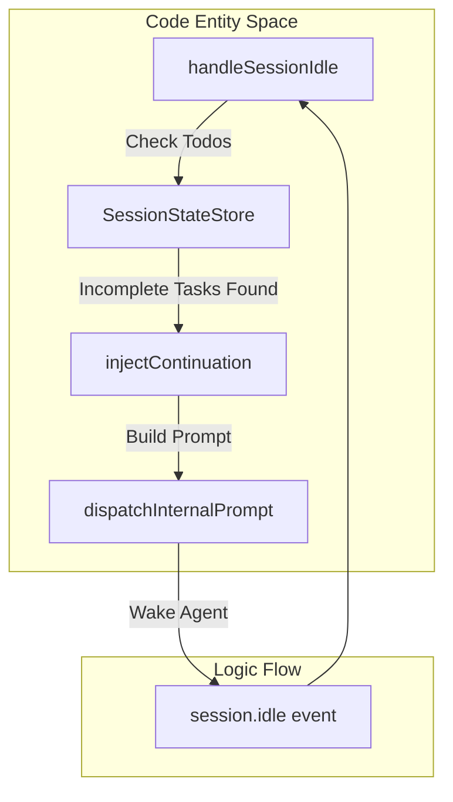
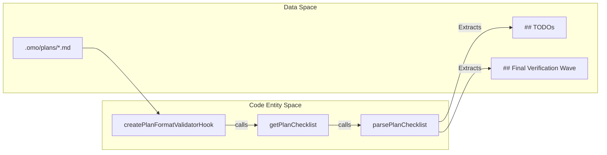
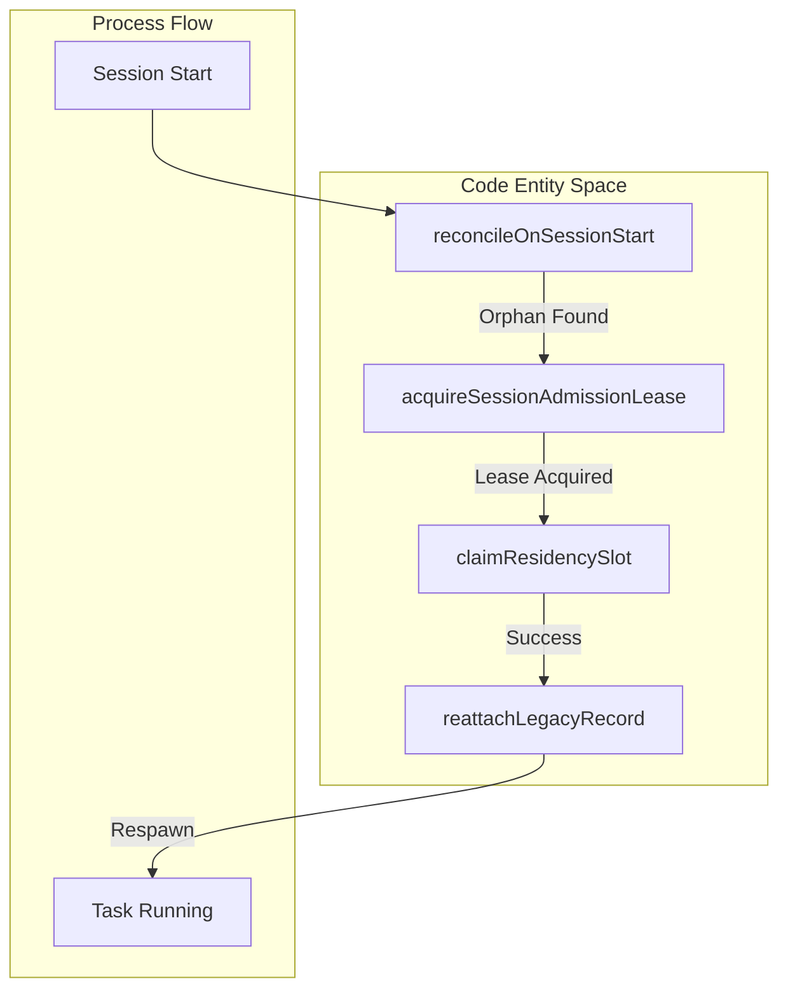

# Session Continuity

Relevant source files

The following files were used as context for generating this wiki page:

- [.omo/evidence/task-13-subagent-session-resume-revival.txt](https://github.com/code-yeongyu/oh-my-openagent/blob/HEAD/.omo/evidence/task-13-subagent-session-resume-revival.txt)
- [.omo/evidence/task-15-subagent-session-resume-revival.txt](https://github.com/code-yeongyu/oh-my-openagent/blob/HEAD/.omo/evidence/task-15-subagent-session-resume-revival.txt)
- [.omo/evidence/task-16-subagent-session-resume-revival.txt](https://github.com/code-yeongyu/oh-my-openagent/blob/HEAD/.omo/evidence/task-16-subagent-session-resume-revival.txt)
- [packages/boulder-state/index.d.ts](https://github.com/code-yeongyu/oh-my-openagent/blob/HEAD/packages/boulder-state/index.d.ts)
- [packages/boulder-state/src/index.ts](https://github.com/code-yeongyu/oh-my-openagent/blob/HEAD/packages/boulder-state/src/index.ts)
- [packages/boulder-state/src/plan-checklist.test.ts](https://github.com/code-yeongyu/oh-my-openagent/blob/HEAD/packages/boulder-state/src/plan-checklist.test.ts)
- [packages/boulder-state/src/plan-checklist.ts](https://github.com/code-yeongyu/oh-my-openagent/blob/HEAD/packages/boulder-state/src/plan-checklist.ts)
- [packages/boulder-state/src/read-state.test.ts](https://github.com/code-yeongyu/oh-my-openagent/blob/HEAD/packages/boulder-state/src/read-state.test.ts)
- [packages/boulder-state/src/storage/index.ts](https://github.com/code-yeongyu/oh-my-openagent/blob/HEAD/packages/boulder-state/src/storage/index.ts)
- [packages/boulder-state/src/storage/plan-progress.ts](https://github.com/code-yeongyu/oh-my-openagent/blob/HEAD/packages/boulder-state/src/storage/plan-progress.ts)
- [packages/boulder-state/src/storage/read-state.ts](https://github.com/code-yeongyu/oh-my-openagent/blob/HEAD/packages/boulder-state/src/storage/read-state.ts)
- [packages/boulder-state/src/storage/session.ts](https://github.com/code-yeongyu/oh-my-openagent/blob/HEAD/packages/boulder-state/src/storage/session.ts)
- [packages/boulder-state/src/storage/shared.ts](https://github.com/code-yeongyu/oh-my-openagent/blob/HEAD/packages/boulder-state/src/storage/shared.ts)
- [packages/boulder-state/src/storage/task.ts](https://github.com/code-yeongyu/oh-my-openagent/blob/HEAD/packages/boulder-state/src/storage/task.ts)
- [packages/boulder-state/src/storage/write-state.ts](https://github.com/code-yeongyu/oh-my-openagent/blob/HEAD/packages/boulder-state/src/storage/write-state.ts)
- [packages/boulder-state/src/top-level-task.ts](https://github.com/code-yeongyu/oh-my-openagent/blob/HEAD/packages/boulder-state/src/top-level-task.ts)
- [packages/boulder-state/src/types.ts](https://github.com/code-yeongyu/oh-my-openagent/blob/HEAD/packages/boulder-state/src/types.ts)
- [packages/omo-codex/plugin/components/start-work-continuation/src/boulder-reader.ts](https://github.com/code-yeongyu/oh-my-openagent/blob/HEAD/packages/omo-codex/plugin/components/start-work-continuation/src/boulder-reader.ts)
- [packages/omo-codex/plugin/components/start-work-continuation/src/index.ts](https://github.com/code-yeongyu/oh-my-openagent/blob/HEAD/packages/omo-codex/plugin/components/start-work-continuation/src/index.ts)
- [packages/omo-codex/plugin/components/start-work-continuation/src/plan-checklist.ts](https://github.com/code-yeongyu/oh-my-openagent/blob/HEAD/packages/omo-codex/plugin/components/start-work-continuation/src/plan-checklist.ts)
- [packages/omo-codex/plugin/components/start-work-continuation/test/boulder-reader.test.ts](https://github.com/code-yeongyu/oh-my-openagent/blob/HEAD/packages/omo-codex/plugin/components/start-work-continuation/test/boulder-reader.test.ts)
- [packages/omo-codex/plugin/components/start-work-continuation/test/cli.test.ts](https://github.com/code-yeongyu/oh-my-openagent/blob/HEAD/packages/omo-codex/plugin/components/start-work-continuation/test/cli.test.ts)
- [packages/omo-codex/plugin/components/start-work-continuation/test/fixtures/plan-scaffold.md](https://github.com/code-yeongyu/oh-my-openagent/blob/HEAD/packages/omo-codex/plugin/components/start-work-continuation/test/fixtures/plan-scaffold.md)
- [packages/omo-opencode/src/features/boulder-state/storage.test.ts](https://github.com/code-yeongyu/oh-my-openagent/blob/HEAD/packages/omo-opencode/src/features/boulder-state/storage.test.ts)
- [packages/omo-opencode/src/features/boulder-state/top-level-task.test.ts](https://github.com/code-yeongyu/oh-my-openagent/blob/HEAD/packages/omo-opencode/src/features/boulder-state/top-level-task.test.ts)
- [packages/omo-opencode/src/hooks/plan-format-validator/hook.test.ts](https://github.com/code-yeongyu/oh-my-openagent/blob/HEAD/packages/omo-opencode/src/hooks/plan-format-validator/hook.test.ts)
- [packages/omo-opencode/src/hooks/plan-format-validator/hook.ts](https://github.com/code-yeongyu/oh-my-openagent/blob/HEAD/packages/omo-opencode/src/hooks/plan-format-validator/hook.ts)
- [packages/omo-senpi/scripts/qa/task-fallback-notification.mjs](https://github.com/code-yeongyu/oh-my-openagent/blob/HEAD/packages/omo-senpi/scripts/qa/task-fallback-notification.mjs)
- [packages/omo-senpi/src/components/task/session-transition-bridge.test.ts](https://github.com/code-yeongyu/oh-my-openagent/blob/HEAD/packages/omo-senpi/src/components/task/session-transition-bridge.test.ts)
- [packages/omo-senpi/src/components/task/task-component.test.ts](https://github.com/code-yeongyu/oh-my-openagent/blob/HEAD/packages/omo-senpi/src/components/task/task-component.test.ts)
- [packages/senpi-task/changes.md](https://github.com/code-yeongyu/oh-my-openagent/blob/HEAD/packages/senpi-task/changes.md)
- [packages/senpi-task/src/completion/index.ts](https://github.com/code-yeongyu/oh-my-openagent/blob/HEAD/packages/senpi-task/src/completion/index.ts)
- [packages/senpi-task/src/completion/notifier-buffer-dedupe.test.ts](https://github.com/code-yeongyu/oh-my-openagent/blob/HEAD/packages/senpi-task/src/completion/notifier-buffer-dedupe.test.ts)
- [packages/senpi-task/src/completion/notifier-reconcile-unnotified.test.ts](https://github.com/code-yeongyu/oh-my-openagent/blob/HEAD/packages/senpi-task/src/completion/notifier-reconcile-unnotified.test.ts)
- [packages/senpi-task/src/completion/notifier-retry.test.ts](https://github.com/code-yeongyu/oh-my-openagent/blob/HEAD/packages/senpi-task/src/completion/notifier-retry.test.ts)
- [packages/senpi-task/src/completion/notifier.test.ts](https://github.com/code-yeongyu/oh-my-openagent/blob/HEAD/packages/senpi-task/src/completion/notifier.test.ts)
- [packages/senpi-task/src/completion/notifier.ts](https://github.com/code-yeongyu/oh-my-openagent/blob/HEAD/packages/senpi-task/src/completion/notifier.ts)
- [packages/senpi-task/src/completion/routing.test.ts](https://github.com/code-yeongyu/oh-my-openagent/blob/HEAD/packages/senpi-task/src/completion/routing.test.ts)
- [packages/senpi-task/src/completion/routing.ts](https://github.com/code-yeongyu/oh-my-openagent/blob/HEAD/packages/senpi-task/src/completion/routing.ts)
- [packages/senpi-task/src/completion/types.ts](https://github.com/code-yeongyu/oh-my-openagent/blob/HEAD/packages/senpi-task/src/completion/types.ts)
- [packages/senpi-task/src/completion/unconditional-wake.test.ts](https://github.com/code-yeongyu/oh-my-openagent/blob/HEAD/packages/senpi-task/src/completion/unconditional-wake.test.ts)
- [packages/senpi-task/src/lifecycle/__fixtures__/lifecycle-fakes.ts](https://github.com/code-yeongyu/oh-my-openagent/blob/HEAD/packages/senpi-task/src/lifecycle/__fixtures__/lifecycle-fakes.ts)
- [packages/senpi-task/src/lifecycle/__fixtures__/reconcile-race-worker.ts](https://github.com/code-yeongyu/oh-my-openagent/blob/HEAD/packages/senpi-task/src/lifecycle/__fixtures__/reconcile-race-worker.ts)
- [packages/senpi-task/src/lifecycle/context.ts](https://github.com/code-yeongyu/oh-my-openagent/blob/HEAD/packages/senpi-task/src/lifecycle/context.ts)
- [packages/senpi-task/src/lifecycle/create.ts](https://github.com/code-yeongyu/oh-my-openagent/blob/HEAD/packages/senpi-task/src/lifecycle/create.ts)
- [packages/senpi-task/src/lifecycle/destroy.test.ts](https://github.com/code-yeongyu/oh-my-openagent/blob/HEAD/packages/senpi-task/src/lifecycle/destroy.test.ts)
- [packages/senpi-task/src/lifecycle/destroy.ts](https://github.com/code-yeongyu/oh-my-openagent/blob/HEAD/packages/senpi-task/src/lifecycle/destroy.ts)
- [packages/senpi-task/src/lifecycle/index.ts](https://github.com/code-yeongyu/oh-my-openagent/blob/HEAD/packages/senpi-task/src/lifecycle/index.ts)
- [packages/senpi-task/src/lifecycle/port.ts](https://github.com/code-yeongyu/oh-my-openagent/blob/HEAD/packages/senpi-task/src/lifecycle/port.ts)
- [packages/senpi-task/src/lifecycle/reconcile-multi-session.test.ts](https://github.com/code-yeongyu/oh-my-openagent/blob/HEAD/packages/senpi-task/src/lifecycle/reconcile-multi-session.test.ts)
- [packages/senpi-task/src/lifecycle/reconcile-reclamation.ts](https://github.com/code-yeongyu/oh-my-openagent/blob/HEAD/packages/senpi-task/src/lifecycle/reconcile-reclamation.ts)
- [packages/senpi-task/src/lifecycle/reconcile-revival.test.ts](https://github.com/code-yeongyu/oh-my-openagent/blob/HEAD/packages/senpi-task/src/lifecycle/reconcile-revival.test.ts)
- [packages/senpi-task/src/lifecycle/reconcile-revival.ts](https://github.com/code-yeongyu/oh-my-openagent/blob/HEAD/packages/senpi-task/src/lifecycle/reconcile-revival.ts)
- [packages/senpi-task/src/lifecycle/reconcile.test.ts](https://github.com/code-yeongyu/oh-my-openagent/blob/HEAD/packages/senpi-task/src/lifecycle/reconcile.test.ts)
- [packages/senpi-task/src/lifecycle/reconcile.ts](https://github.com/code-yeongyu/oh-my-openagent/blob/HEAD/packages/senpi-task/src/lifecycle/reconcile.ts)
- [packages/senpi-task/src/lifecycle/residency.test.ts](https://github.com/code-yeongyu/oh-my-openagent/blob/HEAD/packages/senpi-task/src/lifecycle/residency.test.ts)
- [packages/senpi-task/src/lifecycle/residency.ts](https://github.com/code-yeongyu/oh-my-openagent/blob/HEAD/packages/senpi-task/src/lifecycle/residency.ts)
- [packages/senpi-task/src/lifecycle/shutdown.test.ts](https://github.com/code-yeongyu/oh-my-openagent/blob/HEAD/packages/senpi-task/src/lifecycle/shutdown.test.ts)
- [packages/senpi-task/src/lifecycle/shutdown.ts](https://github.com/code-yeongyu/oh-my-openagent/blob/HEAD/packages/senpi-task/src/lifecycle/shutdown.ts)
- [packages/senpi-task/src/lifecycle/ttl.test.ts](https://github.com/code-yeongyu/oh-my-openagent/blob/HEAD/packages/senpi-task/src/lifecycle/ttl.test.ts)
- [packages/senpi-task/src/lifecycle/ttl.ts](https://github.com/code-yeongyu/oh-my-openagent/blob/HEAD/packages/senpi-task/src/lifecycle/ttl.ts)
- [packages/senpi-task/src/lifecycle/types.ts](https://github.com/code-yeongyu/oh-my-openagent/blob/HEAD/packages/senpi-task/src/lifecycle/types.ts)
- [packages/senpi-task/src/manager/manager-respawn.ts](https://github.com/code-yeongyu/oh-my-openagent/blob/HEAD/packages/senpi-task/src/manager/manager-respawn.ts)
- [packages/senpi-task/src/store/record-parse-v1.test.ts](https://github.com/code-yeongyu/oh-my-openagent/blob/HEAD/packages/senpi-task/src/store/record-parse-v1.test.ts)
- [packages/senpi-task/src/store/record-store.test.ts](https://github.com/code-yeongyu/oh-my-openagent/blob/HEAD/packages/senpi-task/src/store/record-store.test.ts)
- [packages/senpi-task/src/store/record-store.ts](https://github.com/code-yeongyu/oh-my-openagent/blob/HEAD/packages/senpi-task/src/store/record-store.ts)
- [packages/senpi-task/src/store/types.ts](https://github.com/code-yeongyu/oh-my-openagent/blob/HEAD/packages/senpi-task/src/store/types.ts)
- [packages/senpi-task/src/team/fallback-notification.test.ts](https://github.com/code-yeongyu/oh-my-openagent/blob/HEAD/packages/senpi-task/src/team/fallback-notification.test.ts)

## Purpose and Scope

Session continuity enables reusing existing agent sessions to continue work with full context preservation. Instead of spawning a new agent for every follow-up task, agents can resume from their previous state, maintaining conversation history, tool usage patterns, and accumulated knowledge. This mechanism is critical for handling token limits through compaction while preserving task state, and for enabling iterative refinement workflows across background tasks.

This page covers the session lifecycle, the `todoContinuationEnforcer` (Boulder), context preservation during compaction, and the automated resume mechanisms triggered by session idle events and process reconciliation.

---

## Todo Continuation Enforcer (Boulder)

The `todoContinuationEnforcer` is a core hook system designed to ensure that agents do not stop until all tasks in their `todo` list are complete [packages/omo-opencode/src/hooks/todo-continuation-enforcer/idle-event.ts:7-17](https://github.com/code-yeongyu/oh-my-openagent/blob/HEAD/packages/omo-opencode/src/hooks/todo-continuation-enforcer/idle-event.ts#L7-L17). It monitors the session state and injects continuation prompts when the session becomes idle but has remaining work.

### Lifecycle and State Management

The system tracks session state using a `SessionStateStore`, which maintains information about consecutive failures, token limits, and whether the agent is in a recovery phase [packages/omo-opencode/src/hooks/todo-continuation-enforcer/types.ts:25-47](https://github.com/code-yeongyu/oh-my-openagent/blob/HEAD/packages/omo-opencode/src/hooks/todo-continuation-enforcer/types.ts#L25-L47).

**Diagram: Todo Continuation Lifecycle**
**Sources:** [packages/omo-opencode/src/hooks/todo-continuation-enforcer/idle-event.ts:20-140](https://github.com/code-yeongyu/oh-my-openagent/blob/HEAD/packages/omo-opencode/src/hooks/todo-continuation-enforcer/idle-event.ts#L20-L140), [packages/omo-opencode/src/hooks/todo-continuation-enforcer/continuation-injection.ts:51-175](https://github.com/code-yeongyu/oh-my-openagent/blob/HEAD/packages/omo-opencode/src/hooks/todo-continuation-enforcer/continuation-injection.ts#L51-L175)

### Interruption Handling
To prevent the agent from loop-locking against a user's will, the system detects "genuine user interruptions." If a user sends a message while a continuation countdown is active, the enforcer pauses the continuation lifecycle [packages/omo-opencode/src/hooks/todo-continuation-enforcer/non-idle-events.ts:59-74](https://github.com/code-yeongyu/oh-my-openagent/blob/HEAD/packages/omo-opencode/src/hooks/todo-continuation-enforcer/non-idle-events.ts#L59-L74).

- **Grace Period**: Messages sent within `COUNTDOWN_GRACE_PERIOD_MS` (200ms) of a countdown start are ignored to avoid race conditions with internal wakes [packages/omo-opencode/src/hooks/todo-continuation-enforcer/non-idle-events.ts:135-141](https://github.com/code-yeongyu/oh-my-openagent/blob/HEAD/packages/omo-opencode/src/hooks/todo-continuation-enforcer/non-idle-events.ts#L135-L141).
- **Synthetic Detection**: The system distinguishes between real user messages and internal "synthetic" messages (used for waking agents) using the `OMO_INTERNAL_INITIATOR_MARKER` [packages/omo-opencode/src/hooks/todo-continuation-enforcer/non-idle-events.ts:109-118](https://github.com/code-yeongyu/oh-my-openagent/blob/HEAD/packages/omo-opencode/src/hooks/todo-continuation-enforcer/non-idle-events.ts#L109-L118).

**Sources:** [packages/omo-opencode/src/hooks/todo-continuation-enforcer/non-idle-events.ts:1-150](https://github.com/code-yeongyu/oh-my-openagent/blob/HEAD/packages/omo-opencode/src/hooks/todo-continuation-enforcer/non-idle-events.ts#L1-L150), [packages/omo-opencode/src/hooks/todo-continuation-enforcer/constants.ts:7-15](https://github.com/code-yeongyu/oh-my-openagent/blob/HEAD/packages/omo-opencode/src/hooks/todo-continuation-enforcer/constants.ts#L7-L15)

---

## Compaction Hooks and Context Preservation

When a session context window fills up, the platform triggers a `session.compacted` event. This can cause the agent to lose its "working memory" regarding current progress.

### Compaction Guard
The `armCompactionGuard` function is called when a session is compacted [packages/omo-opencode/src/hooks/todo-continuation-enforcer/handler.ts:135-143](https://github.com/code-yeongyu/oh-my-openagent/blob/HEAD/packages/omo-opencode/src/hooks/todo-continuation-enforcer/handler.ts#L135-L143). It increments a `compactionEpoch` in the session state. Before injecting a continuation, the system checks if the agent's identity or tools were lost during compaction. If the agent is unknown post-compaction, the injection is skipped to prevent corrupted prompts [packages/omo-opencode/src/hooks/todo-continuation-enforcer/continuation-injection.ts:156-161](https://github.com/code-yeongyu/oh-my-openagent/blob/HEAD/packages/omo-opencode/src/hooks/todo-continuation-enforcer/continuation-injection.ts#L156-L161).

### Context Injectors
Specialized hooks ensure state survives:
- **preemptiveCompaction**: Triggers before a hard limit is hit to summarize current status [packages/omo-opencode/src/hooks/AGENTS.md:30-30](https://github.com/code-yeongyu/oh-my-openagent/blob/HEAD/packages/omo-opencode/src/hooks/AGENTS.md#L30).
- **compactionTodoPreserver**: Ensures the `todo` list is explicitly restated in the new context window [packages/omo-opencode/src/hooks/AGENTS.md:96-96](https://github.com/code-yeongyu/oh-my-openagent/blob/HEAD/packages/omo-opencode/src/hooks/AGENTS.md#L96).

---

## Plan Continuity and Validation

For complex tasks managed via `.omo/plans/*.md` files, the system uses the `boulder-state` package to parse progress.

### Structured Plan Parsing
The `parsePlanChecklist` function analyzes Markdown plans, specifically looking for `## TODOs` and `## Final Verification Wave` sections [packages/boulder-state/src/plan-checklist.ts:50-57](https://github.com/code-yeongyu/oh-my-openagent/blob/HEAD/packages/boulder-state/src/plan-checklist.ts#L50-L57). It identifies the `nextTaskLabel` by finding the first unchecked item in these sections [packages/boulder-state/src/plan-checklist.ts:108-113](https://github.com/code-yeongyu/oh-my-openagent/blob/HEAD/packages/boulder-state/src/plan-checklist.ts#L108-L113).

### Plan Format Validator Hook
To prevent agents from breaking continuity by using malformed task labels, the `planFormatValidator` hook monitors tool execution [packages/omo-opencode/src/hooks/plan-format-validator/hook.ts:166-171](https://github.com/code-yeongyu/oh-my-openagent/blob/HEAD/packages/omo-opencode/src/hooks/plan-format-validator/hook.ts#L166-L171). 
- **Validation**: It ensures checkboxes under `## TODOs` start with `1.`, `2.`, etc., and `## Final Verification Wave` tasks start with `F1.`, `F2.` [packages/omo-opencode/src/hooks/plan-format-validator/hook.ts:122-126](https://github.com/code-yeongyu/oh-my-openagent/blob/HEAD/packages/omo-opencode/src/hooks/plan-format-validator/hook.ts#L122-L126).
- **Feedback**: If a `Write` or `Edit` operation creates malformed rows, the hook appends a `<plan-format-warning>` to the tool output, instructing the agent to fix the format so progress tracking continues [packages/omo-opencode/src/hooks/plan-format-validator/hook.ts:199-199](https://github.com/code-yeongyu/oh-my-openagent/blob/HEAD/packages/omo-opencode/src/hooks/plan-format-validator/hook.ts#L199).

**Diagram: Plan Parsing and Validation Bridge**
**Sources:** [packages/boulder-state/src/plan-checklist.ts:35-57](https://github.com/code-yeongyu/oh-my-openagent/blob/HEAD/packages/boulder-state/src/plan-checklist.ts#L35-L57), [packages/omo-opencode/src/hooks/plan-format-validator/hook.ts:166-202](https://github.com/code-yeongyu/oh-my-openagent/blob/HEAD/packages/omo-opencode/src/hooks/plan-format-validator/hook.ts#L166-L202)

---

## Task Lifecycle and Process Reconciliation

In the `senpi-task` engine, session continuity extends to surviving process restarts and multi-session environments.

### Reconcile on Session Start
When a new session starts, `reconcileOnSessionStart` scans persisted task records to identify orphans from previous processes [packages/senpi-task/src/lifecycle/reconcile.ts:16-19](https://github.com/code-yeongyu/oh-my-openagent/blob/HEAD/packages/senpi-task/src/lifecycle/reconcile.ts#L16-L19).
- **Resumption**: If a record has a valid `sessionPath` and the process is dead, the engine triggers a `reattachLegacyRecord` flow to respawn the task using its last known state [packages/senpi-task/src/lifecycle/reconcile.ts:142-144](https://github.com/code-yeongyu/oh-my-openagent/blob/HEAD/packages/senpi-task/src/lifecycle/reconcile.ts#L142-L144).
- **Multi-session Protection**: The engine prevents "hostile takeovers" of tasks belonging to live sibling sessions in multi-session hosts by checking ownership before reclamation [packages/senpi-task/src/lifecycle/reconcile.ts:53-64](https://github.com/code-yeongyu/oh-my-openagent/blob/HEAD/packages/senpi-task/src/lifecycle/reconcile.ts#L53-L64).

### Residency and Admission
The `admitResident` logic governs how many active agent sessions can be maintained [packages/senpi-task/src/lifecycle/residency.ts:14-17](https://github.com/code-yeongyu/oh-my-openagent/blob/HEAD/packages/senpi-task/src/lifecycle/residency.ts#L14-L17).
- **LRU Eviction**: When the residency cap (`residency_max_children`) is reached, the system uses an "Oldest-First" scan to evict the most stale terminal resident to make room for new work [packages/senpi-task/src/lifecycle/residency.ts:44-48](https://github.com/code-yeongyu/oh-my-openagent/blob/HEAD/packages/senpi-task/src/lifecycle/residency.ts#L44-L48).
- **Admission Lease**: Reconciliation and revival of suspended batches are protected by a `SessionAdmissionLease` to prevent race conditions during session resumption [packages/senpi-task/src/lifecycle/residency.ts:123-124](https://github.com/code-yeongyu/oh-my-openagent/blob/HEAD/packages/senpi-task/src/lifecycle/residency.ts#L123-L124).

**Diagram: Task Process Reconciliation**
**Sources:** [packages/senpi-task/src/lifecycle/reconcile.ts:16-75](https://github.com/code-yeongyu/oh-my-openagent/blob/HEAD/packages/senpi-task/src/lifecycle/reconcile.ts#L16-L75), [packages/senpi-task/src/lifecycle/residency.ts:86-101](https://github.com/code-yeongyu/oh-my-openagent/blob/HEAD/packages/senpi-task/src/lifecycle/residency.ts#L86-L101)

---

## Resumption Mechanisms

### Session ID Reuse
The `task` tool and `call_omo_agent` tool accept an optional `session_id`. When provided, the tool sends a new prompt to the existing session, preserving history. The `BackgroundManager` tracks these sessions and maps them to parent sessions [packages/omo-opencode/src/features/background-agent/manager.ts:35-36](https://github.com/code-yeongyu/oh-my-openagent/blob/HEAD/packages/omo-opencode/src/features/background-agent/manager.ts#L35-L36).

### Recovery Strategies
1. **Exponential Backoff**: Continuation injections use a cooldown period that doubles with each consecutive failure, starting from `CONTINUATION_COOLDOWN_MS` [packages/omo-opencode/src/hooks/todo-continuation-enforcer/idle-event.ts:160-165](https://github.com/code-yeongyu/oh-my-openagent/blob/HEAD/packages/omo-opencode/src/hooks/todo-continuation-enforcer/idle-event.ts#L160-L165).
2. **Stagnation Detection**: If the number of incomplete todos does not change over multiple turns, the `shouldStopForStagnation` check prevents the agent from spinning indefinitely on the same task [packages/omo-opencode/src/hooks/todo-continuation-enforcer/idle-event.ts:16-16](https://github.com/code-yeongyu/oh-my-openagent/blob/HEAD/packages/omo-opencode/src/hooks/todo-continuation-enforcer/idle-event.ts#L16).
3. **Token Limit Recovery**: If a `MessageAbortedError` or token limit error is detected via `session.error`, the enforcer marks the session as `tokenLimitDetected` and stops further injections to avoid worsening context overflow [packages/omo-opencode/src/hooks/todo-continuation-enforcer/handler.ts:96-100](https://github.com/code-yeongyu/oh-my-openagent/blob/HEAD/packages/omo-opencode/src/hooks/todo-continuation-enforcer/handler.ts#L96-L100).
4. **Notification Reconcile**: Terminal background tasks that failed to notify the parent due to a crash are recovered via `reconcileUnnotifiedNotifications` upon session restart [packages/senpi-task/src/completion/notifier.ts:160-168](https://github.com/code-yeongyu/oh-my-openagent/blob/HEAD/packages/senpi-task/src/completion/notifier.ts#L160-L168).

**Sources:** [packages/omo-opencode/src/hooks/todo-continuation-enforcer/idle-event.ts:1-180](https://github.com/code-yeongyu/oh-my-openagent/blob/HEAD/packages/omo-opencode/src/hooks/todo-continuation-enforcer/idle-event.ts#L1-L180), [packages/omo-opencode/src/hooks/todo-continuation-enforcer/handler.ts:76-115](https://github.com/code-yeongyu/oh-my-openagent/blob/HEAD/packages/omo-opencode/src/hooks/todo-continuation-enforcer/handler.ts#L76-L115), [packages/senpi-task/src/lifecycle/reconcile.ts:16-49](https://github.com/code-yeongyu/oh-my-openagent/blob/HEAD/packages/senpi-task/src/lifecycle/reconcile.ts#L16-L49), [packages/senpi-task/src/completion/notifier.ts:160-171](https://github.com/code-yeongyu/oh-my-openagent/blob/HEAD/packages/senpi-task/src/completion/notifier.ts#L160-L171)