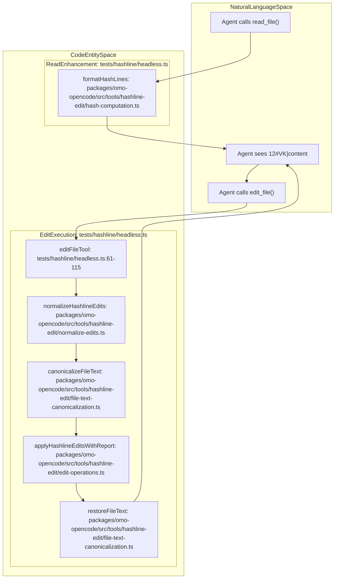
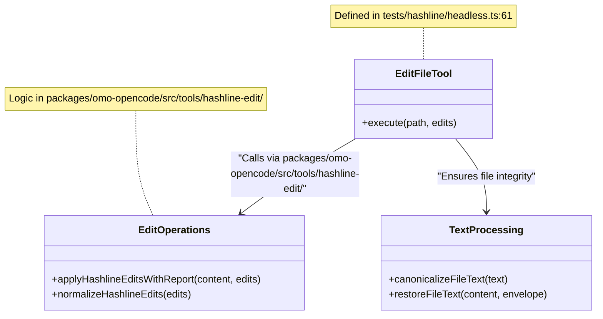

# Hashline Edit System

Relevant source files

The following files were used as context for generating this wiki page:

- [ROADMAP.md](https://github.com/code-yeongyu/oh-my-openagent/blob/HEAD/ROADMAP.md)
- [assets/AGENTS.md](https://github.com/code-yeongyu/oh-my-openagent/blob/HEAD/assets/AGENTS.md)
- [bin/AGENTS.md](https://github.com/code-yeongyu/oh-my-openagent/blob/HEAD/bin/AGENTS.md)
- [packages/boulder-state/index.d.ts](https://github.com/code-yeongyu/oh-my-openagent/blob/HEAD/packages/boulder-state/index.d.ts)
- [packages/boulder-state/src/index.ts](https://github.com/code-yeongyu/oh-my-openagent/blob/HEAD/packages/boulder-state/src/index.ts)
- [packages/boulder-state/src/plan-checklist.test.ts](https://github.com/code-yeongyu/oh-my-openagent/blob/HEAD/packages/boulder-state/src/plan-checklist.test.ts)
- [packages/boulder-state/src/plan-checklist.ts](https://github.com/code-yeongyu/oh-my-openagent/blob/HEAD/packages/boulder-state/src/plan-checklist.ts)
- [packages/boulder-state/src/read-state.test.ts](https://github.com/code-yeongyu/oh-my-openagent/blob/HEAD/packages/boulder-state/src/read-state.test.ts)
- [packages/boulder-state/src/storage/index.ts](https://github.com/code-yeongyu/oh-my-openagent/blob/HEAD/packages/boulder-state/src/storage/index.ts)
- [packages/boulder-state/src/storage/plan-progress.ts](https://github.com/code-yeongyu/oh-my-openagent/blob/HEAD/packages/boulder-state/src/storage/plan-progress.ts)
- [packages/boulder-state/src/storage/read-state.ts](https://github.com/code-yeongyu/oh-my-openagent/blob/HEAD/packages/boulder-state/src/storage/read-state.ts)
- [packages/boulder-state/src/storage/session.ts](https://github.com/code-yeongyu/oh-my-openagent/blob/HEAD/packages/boulder-state/src/storage/session.ts)
- [packages/boulder-state/src/storage/shared.ts](https://github.com/code-yeongyu/oh-my-openagent/blob/HEAD/packages/boulder-state/src/storage/shared.ts)
- [packages/boulder-state/src/storage/task.ts](https://github.com/code-yeongyu/oh-my-openagent/blob/HEAD/packages/boulder-state/src/storage/task.ts)
- [packages/boulder-state/src/storage/write-state.ts](https://github.com/code-yeongyu/oh-my-openagent/blob/HEAD/packages/boulder-state/src/storage/write-state.ts)
- [packages/boulder-state/src/top-level-task.ts](https://github.com/code-yeongyu/oh-my-openagent/blob/HEAD/packages/boulder-state/src/top-level-task.ts)
- [packages/boulder-state/src/types.ts](https://github.com/code-yeongyu/oh-my-openagent/blob/HEAD/packages/boulder-state/src/types.ts)
- [packages/claude-code-compat-core/AGENTS.md](https://github.com/code-yeongyu/oh-my-openagent/blob/HEAD/packages/claude-code-compat-core/AGENTS.md)
- [packages/lsp-core/AGENTS.md](https://github.com/code-yeongyu/oh-my-openagent/blob/HEAD/packages/lsp-core/AGENTS.md)
- [packages/lsp-tools-mcp/AGENTS.md](https://github.com/code-yeongyu/oh-my-openagent/blob/HEAD/packages/lsp-tools-mcp/AGENTS.md)
- [packages/lsp-tools-mcp/README.md](https://github.com/code-yeongyu/oh-my-openagent/blob/HEAD/packages/lsp-tools-mcp/README.md)
- [packages/mcp-client-core/AGENTS.md](https://github.com/code-yeongyu/oh-my-openagent/blob/HEAD/packages/mcp-client-core/AGENTS.md)
- [packages/omo-codex/plugin/components/start-work-continuation/src/boulder-reader.ts](https://github.com/code-yeongyu/oh-my-openagent/blob/HEAD/packages/omo-codex/plugin/components/start-work-continuation/src/boulder-reader.ts)
- [packages/omo-codex/plugin/components/start-work-continuation/src/index.ts](https://github.com/code-yeongyu/oh-my-openagent/blob/HEAD/packages/omo-codex/plugin/components/start-work-continuation/src/index.ts)
- [packages/omo-codex/plugin/components/start-work-continuation/src/plan-checklist.ts](https://github.com/code-yeongyu/oh-my-openagent/blob/HEAD/packages/omo-codex/plugin/components/start-work-continuation/src/plan-checklist.ts)
- [packages/omo-codex/plugin/components/start-work-continuation/test/boulder-reader.test.ts](https://github.com/code-yeongyu/oh-my-openagent/blob/HEAD/packages/omo-codex/plugin/components/start-work-continuation/test/boulder-reader.test.ts)
- [packages/omo-codex/plugin/components/start-work-continuation/test/cli.test.ts](https://github.com/code-yeongyu/oh-my-openagent/blob/HEAD/packages/omo-codex/plugin/components/start-work-continuation/test/cli.test.ts)
- [packages/omo-codex/plugin/components/start-work-continuation/test/fixtures/plan-scaffold.md](https://github.com/code-yeongyu/oh-my-openagent/blob/HEAD/packages/omo-codex/plugin/components/start-work-continuation/test/fixtures/plan-scaffold.md)
- [packages/omo-opencode/src/features/boulder-state/storage.test.ts](https://github.com/code-yeongyu/oh-my-openagent/blob/HEAD/packages/omo-opencode/src/features/boulder-state/storage.test.ts)
- [packages/omo-opencode/src/features/boulder-state/top-level-task.test.ts](https://github.com/code-yeongyu/oh-my-openagent/blob/HEAD/packages/omo-opencode/src/features/boulder-state/top-level-task.test.ts)
- [packages/omo-opencode/src/hooks/plan-format-validator/hook.test.ts](https://github.com/code-yeongyu/oh-my-openagent/blob/HEAD/packages/omo-opencode/src/hooks/plan-format-validator/hook.test.ts)
- [packages/omo-opencode/src/hooks/plan-format-validator/hook.ts](https://github.com/code-yeongyu/oh-my-openagent/blob/HEAD/packages/omo-opencode/src/hooks/plan-format-validator/hook.ts)
- [packages/openclaw-core/AGENTS.md](https://github.com/code-yeongyu/oh-my-openagent/blob/HEAD/packages/openclaw-core/AGENTS.md)
- [packages/rules-engine/AGENTS.md](https://github.com/code-yeongyu/oh-my-openagent/blob/HEAD/packages/rules-engine/AGENTS.md)
- [packages/skills-loader-core/AGENTS.md](https://github.com/code-yeongyu/oh-my-openagent/blob/HEAD/packages/skills-loader-core/AGENTS.md)
- [packages/team-core/AGENTS.md](https://github.com/code-yeongyu/oh-my-openagent/blob/HEAD/packages/team-core/AGENTS.md)
- [scripts/AGENTS.md](https://github.com/code-yeongyu/oh-my-openagent/blob/HEAD/scripts/AGENTS.md)
- [tests/AGENTS.md](https://github.com/code-yeongyu/oh-my-openagent/blob/HEAD/tests/AGENTS.md)
- [tests/hashline/bun.lock](https://github.com/code-yeongyu/oh-my-openagent/blob/HEAD/tests/hashline/bun.lock)
- [tests/hashline/headless.ts](https://github.com/code-yeongyu/oh-my-openagent/blob/HEAD/tests/hashline/headless.ts)
- [tests/hashline/package.json](https://github.com/code-yeongyu/oh-my-openagent/blob/HEAD/tests/hashline/package.json)
- [tests/hashline/test-edge-cases.ts](https://github.com/code-yeongyu/oh-my-openagent/blob/HEAD/tests/hashline/test-edge-cases.ts)
- [tests/hashline/test-edit-ops.ts](https://github.com/code-yeongyu/oh-my-openagent/blob/HEAD/tests/hashline/test-edit-ops.ts)
- [tests/hashline/test-environment.test.ts](https://github.com/code-yeongyu/oh-my-openagent/blob/HEAD/tests/hashline/test-environment.test.ts)
- [tests/hashline/test-environment.ts](https://github.com/code-yeongyu/oh-my-openagent/blob/HEAD/tests/hashline/test-environment.ts)
- [tests/hashline/test-multi-model.ts](https://github.com/code-yeongyu/oh-my-openagent/blob/HEAD/tests/hashline/test-multi-model.ts)

## Purpose and Scope

The Hashline Edit System solves the "harness problem" — the fundamental issue where language models fail to reliably edit files because they must reproduce exact line content they saw earlier. This system introduces content-based line identifiers (`LINE#ID` format) that enable surgical edits without requiring exact text reproduction.

The system uses a deterministic 2-character CID (Content Identifier) hash per line. These hashes are injected into `read` tool outputs via a hook and validated by the `hashline_edit` tool before any modification is applied. This approach is inspired by `oh-my-pi`'s methodology for robust code manipulation. The core logic is encapsulated in the `hashline-core` package, ensuring harness-neutral primitives for diffing and hashing [ROADMAP.md:44-44](https://github.com/code-yeongyu/oh-my-openagent/blob/HEAD/ROADMAP.md#L44).

**Sources**: [ROADMAP.md:44-44](https://github.com/code-yeongyu/oh-my-openagent/blob/HEAD/ROADMAP.md#L44)

## The Harness Problem

Traditional file editing tools require language models to reproduce exact file content when specifying which lines to modify. This approach fails because:

1.  **Whitespace ambiguity**: Models cannot reliably reproduce exact spacing/indentation.
2.  **Context drift**: File content may change between read and edit operations.
3.  **Stale references**: Line numbers shift as edits are made.
4.  **No verification**: Tools accept edits even when the target content doesn't match.

The result: agents frequently corrupt files by editing wrong lines, introducing syntax errors, or losing data. The Hashline Edit System is a first-party runtime capability [ROADMAP.md:60-60](https://github.com/code-yeongyu/oh-my-openagent/blob/HEAD/ROADMAP.md#L60) that provides a robust alternative to standard `Write` or `Edit` operations.

**Sources**: [ROADMAP.md:60-60](https://github.com/code-yeongyu/oh-my-openagent/blob/HEAD/ROADMAP.md#L60)

## System Architecture

The hashline edit system consists of a read enhancement hook that injects content hashes, an edit tool that validates hashes before applying changes, and a robust validation engine. The system is tested extensively via a headless benchmarking suite to ensure reliability across different model families [tests/AGENTS.md:13-19](https://github.com/code-yeongyu/oh-my-openagent/blob/HEAD/tests/AGENTS.md#L13-L19).

### Component Interaction and Data Flow

The following diagram illustrates the flow from the initial `read` call to the eventual `hashline_edit` execution, bridging the Natural Language Space (Agent) and Code Entity Space (Implementation).

Title: "Hashline Edit Data Flow"

**Sources**: [tests/hashline/headless.ts:45-59](https://github.com/code-yeongyu/oh-my-openagent/blob/HEAD/tests/hashline/headless.ts#L45-L59), [tests/hashline/headless.ts:61-115](https://github.com/code-yeongyu/oh-my-openagent/blob/HEAD/tests/hashline/headless.ts#L61-L115), [tests/AGENTS.md:13-19](https://github.com/code-yeongyu/oh-my-openagent/blob/HEAD/tests/AGENTS.md#L13-L19)

## Hash Computation and Injection

### Hash Algorithm

The system uses a deterministic 2-character CID hash per line, implemented in `formatHashLines` [tests/hashline/headless.ts:8-8](https://github.com/code-yeongyu/oh-my-openagent/blob/HEAD/tests/hashline/headless.ts#L8).

*   **Significant Lines**: Lines containing alphanumeric characters are hashed based on content only (ignoring trailing whitespace).
*   **Non-Significant Lines**: Punctuation-only lines (like `{}` or `]`) include the line number in the seed to prevent collisions.
*   **Legacy Support**: The system handles common model mistakes by providing `LINE#ID` anchors that models can reference without re-typing the code block perfectly.

### The Read Tool Integration

In the headless test environment, the `readFileTool` wraps the core hashing logic. It reads the file from disk, splits it into lines, and passes it to `formatHashLines` to generate the tagged output for the agent [tests/hashline/headless.ts:45-59](https://github.com/code-yeongyu/oh-my-openagent/blob/HEAD/tests/hashline/headless.ts#L45-L59).

**Sources**: [tests/hashline/headless.ts:8-8](https://github.com/code-yeongyu/oh-my-openagent/blob/HEAD/tests/hashline/headless.ts#L8), [tests/hashline/headless.ts:45-59](https://github.com/code-yeongyu/oh-my-openagent/blob/HEAD/tests/hashline/headless.ts#L45-L59)

## Edit Tool Operations

The `editFileTool` is the primary interface for code manipulation in the Hashline system [tests/hashline/headless.ts:61-115](https://github.com/code-yeongyu/oh-my-openagent/blob/HEAD/tests/hashline/headless.ts#L61-L115). It uses `HASHLINE_EDIT_DESCRIPTION` to instruct models on how to use anchors [tests/hashline/headless.ts:12-12](https://github.com/code-yeongyu/oh-my-openagent/blob/HEAD/tests/hashline/headless.ts#L12).

### Operation Types

The tool supports three primary operations defined in its input schema [tests/hashline/headless.ts:63-73](https://github.com/code-yeongyu/oh-my-openagent/blob/HEAD/tests/hashline/headless.ts#L63-L73):

| Operation | Anchor (`pos`) | Range End (`end`) | Behavior |
| :--- | :--- | :--- | :--- |
| **replace** | Required | Optional | Replaces line at `pos` (or range `pos`..`end`) with new content. |
| **append** | Optional | N/A | Inserts after `pos`. If no `pos`, appends to EOF. |
| **prepend** | Optional | N/A | Inserts before `pos`. If no `pos`, prepends to BOF. |

### Edit Validation and Execution Flow

Before any changes are written, the system performs a multi-stage validation:

1.  **Normalization**: `normalizeHashlineEdits` ensures the `edits` array is in a consistent format for the engine [tests/hashline/headless.ts:85-85](https://github.com/code-yeongyu/oh-my-openagent/blob/HEAD/tests/hashline/headless.ts#L85).
2.  **Canonicalization**: `canonicalizeFileText` handles line endings (CRLF/LF) and BOM to ensure the hash computation matches the agent's view [tests/hashline/headless.ts:94-94](https://github.com/code-yeongyu/oh-my-openagent/blob/HEAD/tests/hashline/headless.ts#L94).
3.  **Application**: `applyHashlineEditsWithReport` performs the surgical replacement and generates a report on what changed [tests/hashline/headless.ts:95-95](https://github.com/code-yeongyu/oh-my-openagent/blob/HEAD/tests/hashline/headless.ts#L95).
4.  **Restoration**: `restoreFileText` puts the canonicalized content back into its original format (e.g., restoring original line endings) before writing to disk [tests/hashline/headless.ts:101-101](https://github.com/code-yeongyu/oh-my-openagent/blob/HEAD/tests/hashline/headless.ts#L101).

Title: "Hashline Edit Implementation"

**Sources**: [tests/hashline/headless.ts:61-115](https://github.com/code-yeongyu/oh-my-openagent/blob/HEAD/tests/hashline/headless.ts#L61-L115), [tests/hashline/headless.ts:85-101](https://github.com/code-yeongyu/oh-my-openagent/blob/HEAD/tests/hashline/headless.ts#L85-L101)

## Benchmarking and Verification

The system includes a comprehensive test suite to verify performance across models [tests/AGENTS.md:13-19](https://github.com/code-yeongyu/oh-my-openagent/blob/HEAD/tests/AGENTS.md#L13-L19).

*   **Headless Runner**: `tests/hashline/headless.ts` provides a standalone agent loop using `ai` SDK and `zod` to perform complex tasks and verify edit accuracy [tests/hashline/headless.ts:4-7](https://github.com/code-yeongyu/oh-my-openagent/blob/HEAD/tests/hashline/headless.ts#L4-L7).
*   **Environment Validation**: `test-environment.ts` ensures that the testing harness has valid API keys and base URLs before starting live model calls [tests/hashline/headless.ts:13-13](https://github.com/code-yeongyu/oh-my-openagent/blob/HEAD/tests/hashline/headless.ts#L13).
*   **Sandbox Requirements**: The Hashline fixture imports adapter-internal paths and performs live network calls. It is designed to be run from a disposable full-repository copy inside a filesystem-isolated VM or container [tests/AGENTS.md:33-33](https://github.com/code-yeongyu/oh-my-openagent/blob/HEAD/tests/AGENTS.md#L33).
*   **Cross-Model Testing**: Specialized scripts like `test-multi-model.ts` exercise the system across different provider families to ensure the `LINE#ID` format is universally understood [tests/AGENTS.md:13-19](https://github.com/code-yeongyu/oh-my-openagent/blob/HEAD/tests/AGENTS.md#L13-L19).

**Sources**: [tests/hashline/headless.ts:4-13](https://github.com/code-yeongyu/oh-my-openagent/blob/HEAD/tests/hashline/headless.ts#L4-L13), [tests/AGENTS.md:13-19](https://github.com/code-yeongyu/oh-my-openagent/blob/HEAD/tests/AGENTS.md#L13-L19), [tests/AGENTS.md:33-33](https://github.com/code-yeongyu/oh-my-openagent/blob/HEAD/tests/AGENTS.md#L33)52