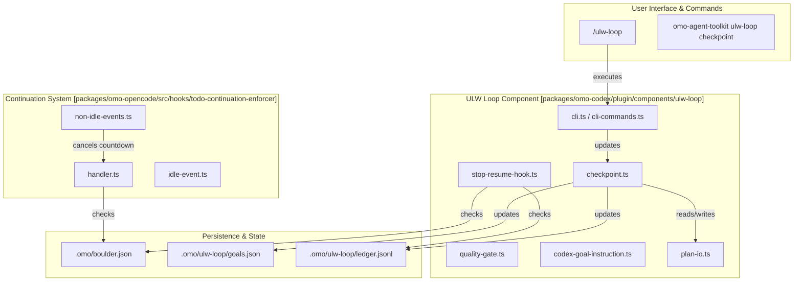
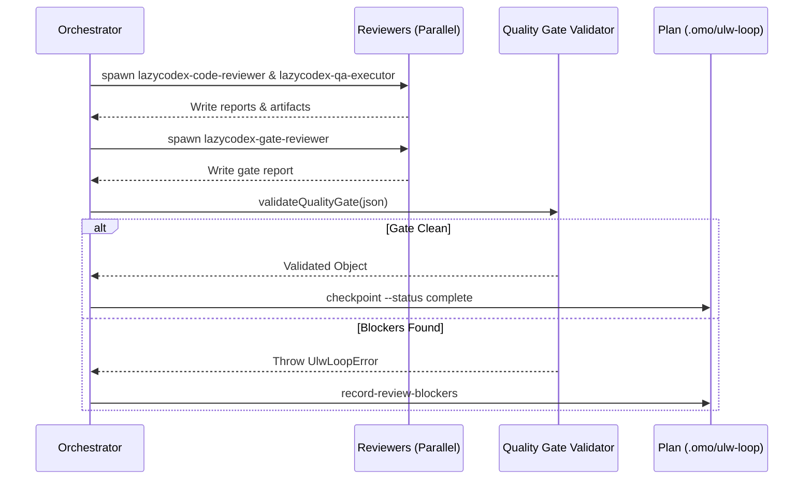

# Ralph Loop and Todo Enforcement

Relevant source files

The following files were used as context for generating this wiki page:

- [packages/omo-codex/MARKETPLACE.md](https://github.com/code-yeongyu/oh-my-openagent/blob/HEAD/packages/omo-codex/MARKETPLACE.md)
- [packages/omo-codex/plugin/components/comment-checker/README.md](https://github.com/code-yeongyu/oh-my-openagent/blob/HEAD/packages/omo-codex/plugin/components/comment-checker/README.md)
- [packages/omo-codex/plugin/components/lsp/README.md](https://github.com/code-yeongyu/oh-my-openagent/blob/HEAD/packages/omo-codex/plugin/components/lsp/README.md)
- [packages/omo-codex/plugin/components/rules/README.md](https://github.com/code-yeongyu/oh-my-openagent/blob/HEAD/packages/omo-codex/plugin/components/rules/README.md)
- [packages/omo-codex/plugin/components/ultrawork/CHANGELOG.md](https://github.com/code-yeongyu/oh-my-openagent/blob/HEAD/packages/omo-codex/plugin/components/ultrawork/CHANGELOG.md)
- [packages/omo-codex/plugin/components/ultrawork/README.md](https://github.com/code-yeongyu/oh-my-openagent/blob/HEAD/packages/omo-codex/plugin/components/ultrawork/README.md)
- [packages/omo-codex/plugin/components/ulw-loop/.gitattributes](https://github.com/code-yeongyu/oh-my-openagent/blob/HEAD/packages/omo-codex/plugin/components/ulw-loop/.gitattributes)
- [packages/omo-codex/plugin/components/ulw-loop/.gitignore](https://github.com/code-yeongyu/oh-my-openagent/blob/HEAD/packages/omo-codex/plugin/components/ulw-loop/.gitignore)
- [packages/omo-codex/plugin/components/ulw-loop/AGENTS.md](https://github.com/code-yeongyu/oh-my-openagent/blob/HEAD/packages/omo-codex/plugin/components/ulw-loop/AGENTS.md)
- [packages/omo-codex/plugin/components/ulw-loop/CHANGELOG.md](https://github.com/code-yeongyu/oh-my-openagent/blob/HEAD/packages/omo-codex/plugin/components/ulw-loop/CHANGELOG.md)
- [packages/omo-codex/plugin/components/ulw-loop/LICENSE](https://github.com/code-yeongyu/oh-my-openagent/blob/HEAD/packages/omo-codex/plugin/components/ulw-loop/LICENSE)
- [packages/omo-codex/plugin/components/ulw-loop/NOTICE](https://github.com/code-yeongyu/oh-my-openagent/blob/HEAD/packages/omo-codex/plugin/components/ulw-loop/NOTICE)
- [packages/omo-codex/plugin/components/ulw-loop/README.md](https://github.com/code-yeongyu/oh-my-openagent/blob/HEAD/packages/omo-codex/plugin/components/ulw-loop/README.md)
- [packages/omo-codex/plugin/components/ulw-loop/biome.json](https://github.com/code-yeongyu/oh-my-openagent/blob/HEAD/packages/omo-codex/plugin/components/ulw-loop/biome.json)
- [packages/omo-codex/plugin/components/ulw-loop/src/.gitkeep](https://github.com/code-yeongyu/oh-my-openagent/blob/HEAD/packages/omo-codex/plugin/components/ulw-loop/src/.gitkeep)
- [packages/omo-codex/plugin/components/ulw-loop/src/checkpoint.ts](https://github.com/code-yeongyu/oh-my-openagent/blob/HEAD/packages/omo-codex/plugin/components/ulw-loop/src/checkpoint.ts)
- [packages/omo-codex/plugin/components/ulw-loop/src/cli-arg-parser.ts](https://github.com/code-yeongyu/oh-my-openagent/blob/HEAD/packages/omo-codex/plugin/components/ulw-loop/src/cli-arg-parser.ts)
- [packages/omo-codex/plugin/components/ulw-loop/src/cli-commands.ts](https://github.com/code-yeongyu/oh-my-openagent/blob/HEAD/packages/omo-codex/plugin/components/ulw-loop/src/cli-commands.ts)
- [packages/omo-codex/plugin/components/ulw-loop/src/cli-output.ts](https://github.com/code-yeongyu/oh-my-openagent/blob/HEAD/packages/omo-codex/plugin/components/ulw-loop/src/cli-output.ts)
- [packages/omo-codex/plugin/components/ulw-loop/src/cli-steering.ts](https://github.com/code-yeongyu/oh-my-openagent/blob/HEAD/packages/omo-codex/plugin/components/ulw-loop/src/cli-steering.ts)
- [packages/omo-codex/plugin/components/ulw-loop/src/cli-subcommands.ts](https://github.com/code-yeongyu/oh-my-openagent/blob/HEAD/packages/omo-codex/plugin/components/ulw-loop/src/cli-subcommands.ts)
- [packages/omo-codex/plugin/components/ulw-loop/src/cli.ts](https://github.com/code-yeongyu/oh-my-openagent/blob/HEAD/packages/omo-codex/plugin/components/ulw-loop/src/cli.ts)
- [packages/omo-codex/plugin/components/ulw-loop/src/codex-goal-instruction.ts](https://github.com/code-yeongyu/oh-my-openagent/blob/HEAD/packages/omo-codex/plugin/components/ulw-loop/src/codex-goal-instruction.ts)
- [packages/omo-codex/plugin/components/ulw-loop/src/codex-goal-snapshot.ts](https://github.com/code-yeongyu/oh-my-openagent/blob/HEAD/packages/omo-codex/plugin/components/ulw-loop/src/codex-goal-snapshot.ts)
- [packages/omo-codex/plugin/components/ulw-loop/src/constants.ts](https://github.com/code-yeongyu/oh-my-openagent/blob/HEAD/packages/omo-codex/plugin/components/ulw-loop/src/constants.ts)
- [packages/omo-codex/plugin/components/ulw-loop/src/domain-types.ts](https://github.com/code-yeongyu/oh-my-openagent/blob/HEAD/packages/omo-codex/plugin/components/ulw-loop/src/domain-types.ts)
- [packages/omo-codex/plugin/components/ulw-loop/src/evidence.ts](https://github.com/code-yeongyu/oh-my-openagent/blob/HEAD/packages/omo-codex/plugin/components/ulw-loop/src/evidence.ts)
- [packages/omo-codex/plugin/components/ulw-loop/src/goal-status.ts](https://github.com/code-yeongyu/oh-my-openagent/blob/HEAD/packages/omo-codex/plugin/components/ulw-loop/src/goal-status.ts)
- [packages/omo-codex/plugin/components/ulw-loop/src/paths.ts](https://github.com/code-yeongyu/oh-my-openagent/blob/HEAD/packages/omo-codex/plugin/components/ulw-loop/src/paths.ts)
- [packages/omo-codex/plugin/components/ulw-loop/src/plan-crud.ts](https://github.com/code-yeongyu/oh-my-openagent/blob/HEAD/packages/omo-codex/plugin/components/ulw-loop/src/plan-crud.ts)
- [packages/omo-codex/plugin/components/ulw-loop/src/plan-io.ts](https://github.com/code-yeongyu/oh-my-openagent/blob/HEAD/packages/omo-codex/plugin/components/ulw-loop/src/plan-io.ts)
- [packages/omo-codex/plugin/components/ulw-loop/src/quality-gate-blockers.ts](https://github.com/code-yeongyu/oh-my-openagent/blob/HEAD/packages/omo-codex/plugin/components/ulw-loop/src/quality-gate-blockers.ts)
- [packages/omo-codex/plugin/components/ulw-loop/src/quality-gate-fields.ts](https://github.com/code-yeongyu/oh-my-openagent/blob/HEAD/packages/omo-codex/plugin/components/ulw-loop/src/quality-gate-fields.ts)
- [packages/omo-codex/plugin/components/ulw-loop/src/quality-gate.ts](https://github.com/code-yeongyu/oh-my-openagent/blob/HEAD/packages/omo-codex/plugin/components/ulw-loop/src/quality-gate.ts)
- [packages/omo-codex/plugin/components/ulw-loop/src/runtime.ts](https://github.com/code-yeongyu/oh-my-openagent/blob/HEAD/packages/omo-codex/plugin/components/ulw-loop/src/runtime.ts)
- [packages/omo-codex/plugin/components/ulw-loop/src/spawn-guard.ts](https://github.com/code-yeongyu/oh-my-openagent/blob/HEAD/packages/omo-codex/plugin/components/ulw-loop/src/spawn-guard.ts)
- [packages/omo-codex/plugin/components/ulw-loop/src/steering-batch.ts](https://github.com/code-yeongyu/oh-my-openagent/blob/HEAD/packages/omo-codex/plugin/components/ulw-loop/src/steering-batch.ts)
- [packages/omo-codex/plugin/components/ulw-loop/src/steering-mutations.ts](https://github.com/code-yeongyu/oh-my-openagent/blob/HEAD/packages/omo-codex/plugin/components/ulw-loop/src/steering-mutations.ts)
- [packages/omo-codex/plugin/components/ulw-loop/src/steering.ts](https://github.com/code-yeongyu/oh-my-openagent/blob/HEAD/packages/omo-codex/plugin/components/ulw-loop/src/steering.ts)
- [packages/omo-codex/plugin/components/ulw-loop/src/stop-resume-hook.ts](https://github.com/code-yeongyu/oh-my-openagent/blob/HEAD/packages/omo-codex/plugin/components/ulw-loop/src/stop-resume-hook.ts)
- [packages/omo-codex/plugin/components/ulw-loop/src/validation-batch.ts](https://github.com/code-yeongyu/oh-my-openagent/blob/HEAD/packages/omo-codex/plugin/components/ulw-loop/src/validation-batch.ts)
- [packages/omo-codex/plugin/components/ulw-loop/test/checkpoint-continuation.test.ts](https://github.com/code-yeongyu/oh-my-openagent/blob/HEAD/packages/omo-codex/plugin/components/ulw-loop/test/checkpoint-continuation.test.ts)
- [packages/omo-codex/plugin/components/ulw-loop/test/checkpoint-final.test.ts](https://github.com/code-yeongyu/oh-my-openagent/blob/HEAD/packages/omo-codex/plugin/components/ulw-loop/test/checkpoint-final.test.ts)
- [packages/omo-codex/plugin/components/ulw-loop/test/checkpoint-status.test.ts](https://github.com/code-yeongyu/oh-my-openagent/blob/HEAD/packages/omo-codex/plugin/components/ulw-loop/test/checkpoint-status.test.ts)
- [packages/omo-codex/plugin/components/ulw-loop/test/cli-checkpoint.test.ts](https://github.com/code-yeongyu/oh-my-openagent/blob/HEAD/packages/omo-codex/plugin/components/ulw-loop/test/cli-checkpoint.test.ts)
- [packages/omo-codex/plugin/components/ulw-loop/test/cli-commands.test.ts](https://github.com/code-yeongyu/oh-my-openagent/blob/HEAD/packages/omo-codex/plugin/components/ulw-loop/test/cli-commands.test.ts)
- [packages/omo-codex/plugin/components/ulw-loop/test/cli-complete-goals.test.ts](https://github.com/code-yeongyu/oh-my-openagent/blob/HEAD/packages/omo-codex/plugin/components/ulw-loop/test/cli-complete-goals.test.ts)
- [packages/omo-codex/plugin/components/ulw-loop/test/cli-create-goals.test.ts](https://github.com/code-yeongyu/oh-my-openagent/blob/HEAD/packages/omo-codex/plugin/components/ulw-loop/test/cli-create-goals.test.ts)
- [packages/omo-codex/plugin/components/ulw-loop/test/cli-entrypoint.test.ts](https://github.com/code-yeongyu/oh-my-openagent/blob/HEAD/packages/omo-codex/plugin/components/ulw-loop/test/cli-entrypoint.test.ts)
- [packages/omo-codex/plugin/components/ulw-loop/test/cli-json-errors.test.ts](https://github.com/code-yeongyu/oh-my-openagent/blob/HEAD/packages/omo-codex/plugin/components/ulw-loop/test/cli-json-errors.test.ts)
- [packages/omo-codex/plugin/components/ulw-loop/test/cli-steering-batch.test.ts](https://github.com/code-yeongyu/oh-my-openagent/blob/HEAD/packages/omo-codex/plugin/components/ulw-loop/test/cli-steering-batch.test.ts)
- [packages/omo-codex/plugin/components/ulw-loop/test/cli-steering-kind-guidance.test.ts](https://github.com/code-yeongyu/oh-my-openagent/blob/HEAD/packages/omo-codex/plugin/components/ulw-loop/test/cli-steering-kind-guidance.test.ts)
- [packages/omo-codex/plugin/components/ulw-loop/test/cli-validation-batch.test.ts](https://github.com/code-yeongyu/oh-my-openagent/blob/HEAD/packages/omo-codex/plugin/components/ulw-loop/test/cli-validation-batch.test.ts)
- [packages/omo-codex/plugin/components/ulw-loop/test/codex-goal-instruction.test.ts](https://github.com/code-yeongyu/oh-my-openagent/blob/HEAD/packages/omo-codex/plugin/components/ulw-loop/test/codex-goal-instruction.test.ts)
- [packages/omo-codex/plugin/components/ulw-loop/test/fixtures/quality-gate-builder.ts](https://github.com/code-yeongyu/oh-my-openagent/blob/HEAD/packages/omo-codex/plugin/components/ulw-loop/test/fixtures/quality-gate-builder.ts)
- [packages/omo-codex/plugin/components/ulw-loop/test/fixtures/sample-quality-gate.json](https://github.com/code-yeongyu/oh-my-openagent/blob/HEAD/packages/omo-codex/plugin/components/ulw-loop/test/fixtures/sample-quality-gate.json)
- [packages/omo-codex/plugin/components/ulw-loop/test/paths.test.ts](https://github.com/code-yeongyu/oh-my-openagent/blob/HEAD/packages/omo-codex/plugin/components/ulw-loop/test/paths.test.ts)
- [packages/omo-codex/plugin/components/ulw-loop/test/quality-gate-doc.test.ts](https://github.com/code-yeongyu/oh-my-openagent/blob/HEAD/packages/omo-codex/plugin/components/ulw-loop/test/quality-gate-doc.test.ts)
- [packages/omo-codex/plugin/components/ulw-loop/test/quality-gate.test.ts](https://github.com/code-yeongyu/oh-my-openagent/blob/HEAD/packages/omo-codex/plugin/components/ulw-loop/test/quality-gate.test.ts)
- [packages/omo-codex/plugin/components/ulw-loop/test/spawn-guard.test.ts](https://github.com/code-yeongyu/oh-my-openagent/blob/HEAD/packages/omo-codex/plugin/components/ulw-loop/test/spawn-guard.test.ts)
- [packages/omo-codex/plugin/components/ulw-loop/test/steering-batch.test.ts](https://github.com/code-yeongyu/oh-my-openagent/blob/HEAD/packages/omo-codex/plugin/components/ulw-loop/test/steering-batch.test.ts)
- [packages/omo-codex/plugin/components/ulw-loop/test/stop-resume-hook.test.ts](https://github.com/code-yeongyu/oh-my-openagent/blob/HEAD/packages/omo-codex/plugin/components/ulw-loop/test/stop-resume-hook.test.ts)
- [packages/omo-codex/plugin/components/ulw-loop/test/validation-batch-checkpoint.test.ts](https://github.com/code-yeongyu/oh-my-openagent/blob/HEAD/packages/omo-codex/plugin/components/ulw-loop/test/validation-batch-checkpoint.test.ts)
- [packages/omo-codex/plugin/components/ulw-loop/test/validation-batch.test.ts](https://github.com/code-yeongyu/oh-my-openagent/blob/HEAD/packages/omo-codex/plugin/components/ulw-loop/test/validation-batch.test.ts)
- [packages/omo-codex/plugin/components/ulw-loop/tsconfig.build.json](https://github.com/code-yeongyu/oh-my-openagent/blob/HEAD/packages/omo-codex/plugin/components/ulw-loop/tsconfig.build.json)
- [packages/omo-codex/plugin/components/ulw-loop/tsconfig.json](https://github.com/code-yeongyu/oh-my-openagent/blob/HEAD/packages/omo-codex/plugin/components/ulw-loop/tsconfig.json)
- [packages/omo-opencode/src/features/claude-code-session-state/state.ts](https://github.com/code-yeongyu/oh-my-openagent/blob/HEAD/packages/omo-opencode/src/features/claude-code-session-state/state.ts)
- [packages/omo-opencode/src/hooks/todo-continuation-enforcer/continuation-injection.test.ts](https://github.com/code-yeongyu/oh-my-openagent/blob/HEAD/packages/omo-opencode/src/hooks/todo-continuation-enforcer/continuation-injection.test.ts)
- [packages/omo-opencode/src/hooks/todo-continuation-enforcer/continuation-injection.ts](https://github.com/code-yeongyu/oh-my-openagent/blob/HEAD/packages/omo-opencode/src/hooks/todo-continuation-enforcer/continuation-injection.ts)
- [packages/omo-opencode/src/hooks/todo-continuation-enforcer/handler.ts](https://github.com/code-yeongyu/oh-my-openagent/blob/HEAD/packages/omo-opencode/src/hooks/todo-continuation-enforcer/handler.ts)
- [packages/omo-opencode/src/hooks/todo-continuation-enforcer/idle-event.ts](https://github.com/code-yeongyu/oh-my-openagent/blob/HEAD/packages/omo-opencode/src/hooks/todo-continuation-enforcer/idle-event.ts)
- [packages/omo-opencode/src/hooks/todo-continuation-enforcer/non-idle-events.test.ts](https://github.com/code-yeongyu/oh-my-openagent/blob/HEAD/packages/omo-opencode/src/hooks/todo-continuation-enforcer/non-idle-events.test.ts)
- [packages/omo-opencode/src/hooks/todo-continuation-enforcer/non-idle-events.ts](https://github.com/code-yeongyu/oh-my-openagent/blob/HEAD/packages/omo-opencode/src/hooks/todo-continuation-enforcer/non-idle-events.ts)
- [packages/omo-opencode/src/hooks/todo-continuation-enforcer/session-state.test.ts](https://github.com/code-yeongyu/oh-my-openagent/blob/HEAD/packages/omo-opencode/src/hooks/todo-continuation-enforcer/session-state.test.ts)
- [packages/omo-opencode/src/hooks/todo-continuation-enforcer/session-state.ts](https://github.com/code-yeongyu/oh-my-openagent/blob/HEAD/packages/omo-opencode/src/hooks/todo-continuation-enforcer/session-state.ts)
- [packages/omo-opencode/src/hooks/todo-continuation-enforcer/types.ts](https://github.com/code-yeongyu/oh-my-openagent/blob/HEAD/packages/omo-opencode/src/hooks/todo-continuation-enforcer/types.ts)
- [packages/omo-opencode/src/tools/call-omo-agent/sync-executor-reawaken-guard.test.ts](https://github.com/code-yeongyu/oh-my-openagent/blob/HEAD/packages/omo-opencode/src/tools/call-omo-agent/sync-executor-reawaken-guard.test.ts)
- [packages/omo-opencode/src/tools/call-omo-agent/sync-executor.ts](https://github.com/code-yeongyu/oh-my-openagent/blob/HEAD/packages/omo-opencode/src/tools/call-omo-agent/sync-executor.ts)
- [packages/omo-opencode/src/tools/delegate-task/sync-session-lifecycle.test.ts](https://github.com/code-yeongyu/oh-my-openagent/blob/HEAD/packages/omo-opencode/src/tools/delegate-task/sync-session-lifecycle.test.ts)
- [packages/omo-opencode/src/tools/delegate-task/sync-session-lifecycle.ts](https://github.com/code-yeongyu/oh-my-openagent/blob/HEAD/packages/omo-opencode/src/tools/delegate-task/sync-session-lifecycle.ts)
- [packages/omo-opencode/src/tools/delegate-task/sync-task-reawaken-guard.test.ts](https://github.com/code-yeongyu/oh-my-openagent/blob/HEAD/packages/omo-opencode/src/tools/delegate-task/sync-task-reawaken-guard.test.ts)
- [packages/omo-opencode/src/tools/delegate-task/sync-task.ts](https://github.com/code-yeongyu/oh-my-openagent/blob/HEAD/packages/omo-opencode/src/tools/delegate-task/sync-task.ts)

## Purpose and Scope

This page documents the Ralph Loop and Todo Enforcement mechanisms—two interlocking systems that guarantee task completion in `oh-my-openagent`. The Ralph Loop provides a durable, repo-native orchestration pattern (implemented as `ulw-loop`), while the Todo Enforcement system (the **Boulder mechanism** or `todoContinuationEnforcer`) monitors session state and forces agent continuation when tasks remain incomplete.

These systems work together to prevent agents from stopping prematurely, using a combination of append-only ledgers, mandatory quality gates, and auto-resume hooks.

---

## Architectural Overview

The Ralph Loop and Todo Enforcement systems operate at different layers but share a common goal: ensuring 100% task completion through observable evidence.

### System Components and Code Entities

**Sources:** [packages/omo-codex/plugin/components/ulw-loop/src/cli.ts:1-44](https://github.com/code-yeongyu/oh-my-openagent/blob/HEAD/packages/omo-codex/plugin/components/ulw-loop/src/cli.ts#L1-L44), [packages/omo-codex/plugin/components/ulw-loop/src/checkpoint.ts:158-170](https://github.com/code-yeongyu/oh-my-openagent/blob/HEAD/packages/omo-codex/plugin/components/ulw-loop/src/checkpoint.ts#L158-L170), [packages/omo-codex/plugin/components/ulw-loop/src/stop-resume-hook.ts:142-159](https://github.com/code-yeongyu/oh-my-openagent/blob/HEAD/packages/omo-codex/plugin/components/ulw-loop/src/stop-resume-hook.ts#L142-L159), [packages/omo-opencode/src/hooks/todo-continuation-enforcer/non-idle-events.ts:95-120](https://github.com/code-yeongyu/oh-my-openagent/blob/HEAD/packages/omo-opencode/src/hooks/todo-continuation-enforcer/non-idle-events.ts#L95-L120)

---

## Ralph Loop: Systematic Decomposition (`ulw-loop`)

The Ralph Loop is a high-reliability execution mode that treats work as a durable, multi-goal plan. State lives under `.omo/ulw-loop/` and is mutated through the `omo-agent-toolkit ulw-loop` CLI [packages/omo-codex/plugin/components/ulw-loop/README.md:5-6](https://github.com/code-yeongyu/oh-my-openagent/blob/HEAD/packages/omo-codex/plugin/components/ulw-loop/README.md#L5-L6).

### Goal and Evidence Discipline
The loop is driven by a structured plan where every success criterion must be proven with captured observable evidence.

- **Success Criteria**: Every goal contains `successCriteria` with fields for `scenario`, `userModel`, `expectedEvidence`, and `status` [packages/omo-codex/plugin/components/ulw-loop/src/types.ts:60-68](https://github.com/code-yeongyu/oh-my-openagent/blob/HEAD/packages/omo-codex/plugin/components/ulw-loop/src/types.ts#L60-L68).
- **Evidence Layout v2**: Artifacts for the active goal (QA matrix, review reports) are written under a `currentAttemptDir` at `.omo/evidence/ulw/<session>/<goalId>/a<attempt>` [packages/omo-codex/plugin/components/ulw-loop/src/codex-goal-instruction.ts:108-113](https://github.com/code-yeongyu/oh-my-openagent/blob/HEAD/packages/omo-codex/plugin/components/ulw-loop/src/codex-goal-instruction.ts#L108-L113).
- **Audit Trail**: Every completion or failure is recorded in an append-only ledger (`ledger.jsonl`) via `appendLedger` [packages/omo-codex/plugin/components/ulw-loop/src/plan-io.ts:40-45](https://github.com/code-yeongyu/oh-my-openagent/blob/HEAD/packages/omo-codex/plugin/components/ulw-loop/src/plan-io.ts#L40-L45).

### Delegation Model
The orchestrator follows an aggregate or per-story mode when interacting with Codex goals [packages/omo-codex/plugin/components/ulw-loop/src/codex-goal-instruction.ts:65-82](https://github.com/code-yeongyu/oh-my-openagent/blob/HEAD/packages/omo-codex/plugin/components/ulw-loop/src/codex-goal-instruction.ts#L65-L82).

| Subcommand | Purpose |
| :--- | :--- |
| `create-goals` | Create repo-native goals and seed success criteria from a brief [packages/omo-codex/plugin/components/ulw-loop/README.md:14-14](https://github.com/code-yeongyu/oh-my-openagent/blob/HEAD/packages/omo-codex/plugin/components/ulw-loop/README.md#L14). |
| `status` | Report active goal, criteria, and evidence state [packages/omo-codex/plugin/components/ulw-loop/README.md:15-15](https://github.com/code-yeongyu/oh-my-openagent/blob/HEAD/packages/omo-codex/plugin/components/ulw-loop/README.md#L15). |
| `checkpoint` | Gate a goal transition with evidence; complete checkpoints auto-start the next goal [packages/omo-codex/plugin/components/ulw-loop/README.md:17-17](https://github.com/code-yeongyu/oh-my-openagent/blob/HEAD/packages/omo-codex/plugin/components/ulw-loop/README.md#L17). |
| `steer` | Apply steering mutations (add, split, or supersede goals) [packages/omo-codex/plugin/components/ulw-loop/README.md:18-18](https://github.com/code-yeongyu/oh-my-openagent/blob/HEAD/packages/omo-codex/plugin/components/ulw-loop/README.md#L18). |

**Sources:** [packages/omo-codex/plugin/components/ulw-loop/README.md:11-22](https://github.com/code-yeongyu/oh-my-openagent/blob/HEAD/packages/omo-codex/plugin/components/ulw-loop/README.md#L11-L22), [packages/omo-codex/plugin/components/ulw-loop/src/types.ts:50-70](https://github.com/code-yeongyu/oh-my-openagent/blob/HEAD/packages/omo-codex/plugin/components/ulw-loop/src/types.ts#L50-L70)

---

## Todo Enforcement (Boulder Mechanism)

The Boulder mechanism ensures session continuity by monitoring for idle states and re-injecting agents if tasks remain.

### The Codex Stop Hook
In the Codex harness, `stop-resume-hook.ts` handles turn-death recovery. If a turn ends before the loop completes, it emits a `block` decision with a resume directive [packages/omo-codex/plugin/components/ulw-loop/src/stop-resume-hook.ts:7-11](https://github.com/code-yeongyu/oh-my-openagent/blob/HEAD/packages/omo-codex/plugin/components/ulw-loop/src/stop-resume-hook.ts#L7-L11).

- **Context Pressure**: The hook suppresses itself if the transcript shows context window exhaustion (e.g., "context compacted") [packages/omo-codex/plugin/components/ulw-loop/src/stop-resume-hook.ts:15-23](https://github.com/code-yeongyu/oh-my-openagent/blob/HEAD/packages/omo-codex/plugin/components/ulw-loop/src/stop-resume-hook.ts#L15-L23).
- **Resume Budget**: A two-strike cap (`RESUME_CAP = 2`) is enforced per goal. If the ledger does not progress across resumes, the loop is marked as "stuck" [packages/omo-codex/plugin/components/ulw-loop/src/stop-resume-hook.ts:74-89](https://github.com/code-yeongyu/oh-my-openagent/blob/HEAD/packages/omo-codex/plugin/components/ulw-loop/src/stop-resume-hook.ts#L74-L89).
- **Boulder Synergy**: The hook stays silent if the `todoContinuationEnforcer` (Boulder) is already scheduled to fire for the same session [packages/omo-codex/plugin/components/ulw-loop/src/stop-resume-hook.ts:142-159](https://github.com/code-yeongyu/oh-my-openagent/blob/HEAD/packages/omo-codex/plugin/components/ulw-loop/src/stop-resume-hook.ts#L142-L159).

### OpenCode Idle Detection
The `todo-continuation-enforcer` in OpenCode monitors `message.updated` events. If a user sends a genuine message, the continuation countdown is cancelled [packages/omo-opencode/src/hooks/todo-continuation-enforcer/non-idle-events.ts:148-150](https://github.com/code-yeongyu/oh-my-openagent/blob/HEAD/packages/omo-opencode/src/hooks/todo-continuation-enforcer/non-idle-events.ts#L148-L150). Synthetic or internal messages (system directives) are ignored to prevent self-interruption [packages/omo-opencode/src/hooks/todo-continuation-enforcer/non-idle-events.ts:110-117](https://github.com/code-yeongyu/oh-my-openagent/blob/HEAD/packages/omo-opencode/src/hooks/todo-continuation-enforcer/non-idle-events.ts#L110-L117).

**Sources:** [packages/omo-codex/plugin/components/ulw-loop/src/stop-resume-hook.ts:32-48](https://github.com/code-yeongyu/oh-my-openagent/blob/HEAD/packages/omo-codex/plugin/components/ulw-loop/src/stop-resume-hook.ts#L32-L48), [packages/omo-opencode/src/hooks/todo-continuation-enforcer/non-idle-events.ts:95-164](https://github.com/code-yeongyu/oh-my-openagent/blob/HEAD/packages/omo-opencode/src/hooks/todo-continuation-enforcer/non-idle-events.ts#L95-L164)

---

## The Final Quality Gate

Before a `ulw-loop` run can be marked `complete`, it must pass a mandatory five-section quality gate [packages/omo-codex/plugin/components/ulw-loop/README.md:24-24](https://github.com/code-yeongyu/oh-my-openagent/blob/HEAD/packages/omo-codex/plugin/components/ulw-loop/README.md#L24).

### Verification Sections
The `validateQualityGate` function enforces the following structure [packages/omo-codex/plugin/components/ulw-loop/src/quality-gate.ts:145-164](https://github.com/code-yeongyu/oh-my-openagent/blob/HEAD/packages/omo-codex/plugin/components/ulw-loop/src/quality-gate.ts#L145-L164):

1. **codeReview**: Must be performed by `lazycodex-code-reviewer`. Requires a recommendation of `APPROVE` and a `reportPath` to a non-empty artifact.
2. **manualQa**: Must be performed by `lazycodex-qa-executor`. Requires `passed` status and `artifactRefs` for every surface tested (CLI, Browser, etc.).
3. **gateReview**: Must be performed by `lazycodex-gate-reviewer`. Final sign-off on the other reports.
4. **iteration**: Confirms if a `fullRerun` of tests/commands was performed.
5. **criteriaCoverage**: Summarizes `originalIntent`, `desiredOutcome`, and `userOutcomeReview`. `passCount` must match `totalCriteria`.

### Blocker Management
If a reviewer rejects the work, the orchestrator must use `record-review-blockers` to append new goals to resolve the findings [packages/omo-codex/plugin/components/ulw-loop/src/codex-goal-instruction.ts:130-131](https://github.com/code-yeongyu/oh-my-openagent/blob/HEAD/packages/omo-codex/plugin/components/ulw-loop/src/codex-goal-instruction.ts#L130-L131).

**Sources:** [packages/omo-codex/plugin/components/ulw-loop/src/quality-gate.ts:145-190](https://github.com/code-yeongyu/oh-my-openagent/blob/HEAD/packages/omo-codex/plugin/components/ulw-loop/src/quality-gate.ts#L145-L190), [packages/omo-codex/plugin/components/ulw-loop/src/codex-goal-instruction.ts:122-135](https://github.com/code-yeongyu/oh-my-openagent/blob/HEAD/packages/omo-codex/plugin/components/ulw-loop/src/codex-goal-instruction.ts#L122-L135), [packages/omo-codex/plugin/components/ulw-loop/README.md:24-27](https://github.com/code-yeongyu/oh-my-openagent/blob/HEAD/packages/omo-codex/plugin/components/ulw-loop/README.md#L24-L27)

---

## CLI and Integration

The `ulw-loop` component registers hooks for the Codex plugin system via `hooks/hooks.json` [packages/omo-codex/plugin/components/ulw-loop/README.md:32-36](https://github.com/code-yeongyu/oh-my-openagent/blob/HEAD/packages/omo-codex/plugin/components/ulw-loop/README.md#L32-L36).

| Hook Event | Implementation |
| :--- | :--- |
| `UserPromptSubmit` | `runUlwLoopHookCli` — Injects bootstrap if `ultrawork` keyword is present [packages/omo-codex/plugin/components/ulw-loop/src/cli.ts:20-25](https://github.com/code-yeongyu/oh-my-openagent/blob/HEAD/packages/omo-codex/plugin/components/ulw-loop/src/cli.ts#L20-L25). |
| `PreToolUse` | `runPreToolUseGoalBudgetGuardCli` — Prevents `create_goal` spam [packages/omo-codex/plugin/components/ulw-loop/src/cli.ts:26-29](https://github.com/code-yeongyu/oh-my-openagent/blob/HEAD/packages/omo-codex/plugin/components/ulw-loop/src/cli.ts#L26-L29). |
| `Stop` | `runStopResumeHookCli` — Triggers auto-resume for unfinished goals [packages/omo-codex/plugin/components/ulw-loop/src/cli.ts:30-33](https://github.com/code-yeongyu/oh-my-openagent/blob/HEAD/packages/omo-codex/plugin/components/ulw-loop/src/cli.ts#L30-L33). |
| `Spawn` | `runSpawnGuardCli` — Controls fan-out and validates gate artifacts [packages/omo-codex/plugin/components/ulw-loop/src/cli.ts:34-37](https://github.com/code-yeongyu/oh-my-openagent/blob/HEAD/packages/omo-codex/plugin/components/ulw-loop/src/cli.ts#L34-L37). |

**Sources:** [packages/omo-codex/plugin/components/ulw-loop/src/cli.ts:18-40](https://github.com/code-yeongyu/oh-my-openagent/blob/HEAD/packages/omo-codex/plugin/components/ulw-loop/src/cli.ts#L18-L40), [packages/omo-codex/plugin/components/ulw-loop/README.md:30-40](https://github.com/code-yeongyu/oh-my-openagent/blob/HEAD/packages/omo-codex/plugin/components/ulw-loop/README.md#L30-L40)53:T4a47,#