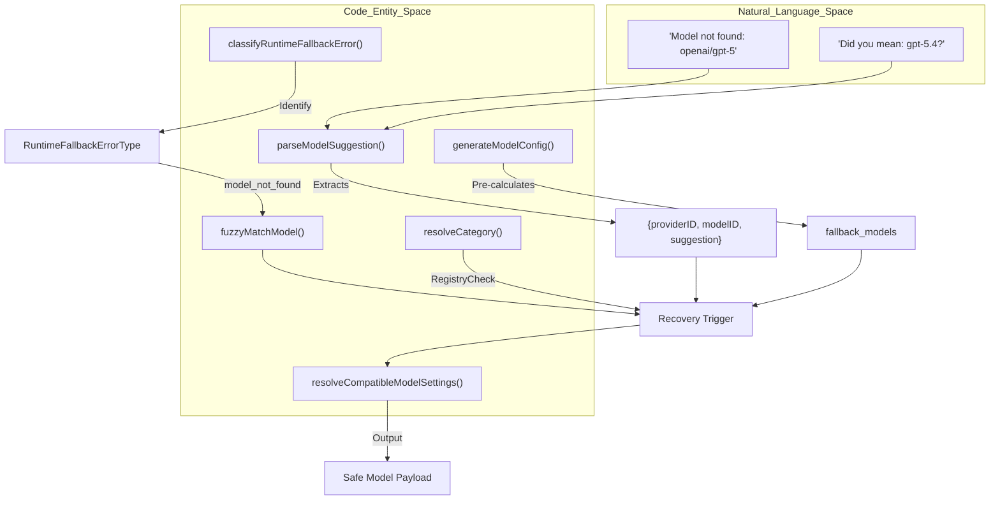
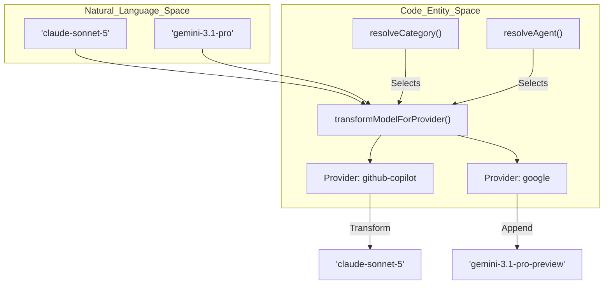

# Model Error Recovery

Relevant source files

The following files were used as context for generating this wiki page:

- [.omo/evidence/task-5-senpi-model-chain-overhaul.txt](https://github.com/code-yeongyu/oh-my-openagent/blob/HEAD/.omo/evidence/task-5-senpi-model-chain-overhaul.txt)
- [packages/delegate-core/src/model-selection.test.ts](https://github.com/code-yeongyu/oh-my-openagent/blob/HEAD/packages/delegate-core/src/model-selection.test.ts)
- [packages/delegate-core/src/model-selection.ts](https://github.com/code-yeongyu/oh-my-openagent/blob/HEAD/packages/delegate-core/src/model-selection.ts)
- [packages/model-core/src/agent-model-requirements.ts](https://github.com/code-yeongyu/oh-my-openagent/blob/HEAD/packages/model-core/src/agent-model-requirements.ts)
- [packages/model-core/src/category-model-requirements.ts](https://github.com/code-yeongyu/oh-my-openagent/blob/HEAD/packages/model-core/src/category-model-requirements.ts)
- [packages/model-core/src/category-routing-policy.test.ts](https://github.com/code-yeongyu/oh-my-openagent/blob/HEAD/packages/model-core/src/category-routing-policy.test.ts)
- [packages/model-core/src/connected-providers-cache.ts](https://github.com/code-yeongyu/oh-my-openagent/blob/HEAD/packages/model-core/src/connected-providers-cache.ts)
- [packages/model-core/src/gpt-5.6-copilot-resolution.test.ts](https://github.com/code-yeongyu/oh-my-openagent/blob/HEAD/packages/model-core/src/gpt-5.6-copilot-resolution.test.ts)
- [packages/model-core/src/model-availability.test.ts](https://github.com/code-yeongyu/oh-my-openagent/blob/HEAD/packages/model-core/src/model-availability.test.ts)
- [packages/model-core/src/model-availability.ts](https://github.com/code-yeongyu/oh-my-openagent/blob/HEAD/packages/model-core/src/model-availability.ts)
- [packages/model-core/src/model-capability-guardrails.test.ts](https://github.com/code-yeongyu/oh-my-openagent/blob/HEAD/packages/model-core/src/model-capability-guardrails.test.ts)
- [packages/model-core/src/model-requirements-agents.test.ts](https://github.com/code-yeongyu/oh-my-openagent/blob/HEAD/packages/model-core/src/model-requirements-agents.test.ts)
- [packages/model-core/src/model-requirements-categories.test.ts](https://github.com/code-yeongyu/oh-my-openagent/blob/HEAD/packages/model-core/src/model-requirements-categories.test.ts)
- [packages/model-core/src/model-resolution-pipeline.test.ts](https://github.com/code-yeongyu/oh-my-openagent/blob/HEAD/packages/model-core/src/model-resolution-pipeline.test.ts)
- [packages/model-core/src/model-resolution-pipeline.ts](https://github.com/code-yeongyu/oh-my-openagent/blob/HEAD/packages/model-core/src/model-resolution-pipeline.ts)
- [packages/model-core/src/model-resolver.test.ts](https://github.com/code-yeongyu/oh-my-openagent/blob/HEAD/packages/model-core/src/model-resolver.test.ts)
- [packages/omo-codex/plugin/components/teammode/AGENTS.md](https://github.com/code-yeongyu/oh-my-openagent/blob/HEAD/packages/omo-codex/plugin/components/teammode/AGENTS.md)
- [packages/omo-codex/plugin/components/teammode/test/v2-spawn-schema.test.ts](https://github.com/code-yeongyu/oh-my-openagent/blob/HEAD/packages/omo-codex/plugin/components/teammode/test/v2-spawn-schema.test.ts)
- [packages/omo-opencode/src/agents/gpt-5.6-warm-cache-registration.test.ts](https://github.com/code-yeongyu/oh-my-openagent/blob/HEAD/packages/omo-opencode/src/agents/gpt-5.6-warm-cache-registration.test.ts)
- [packages/omo-opencode/src/agents/utils.test.ts](https://github.com/code-yeongyu/oh-my-openagent/blob/HEAD/packages/omo-opencode/src/agents/utils.test.ts)
- [packages/omo-opencode/src/cli/config-manager/generate-omo-config.test.ts](https://github.com/code-yeongyu/oh-my-openagent/blob/HEAD/packages/omo-opencode/src/cli/config-manager/generate-omo-config.test.ts)
- [packages/omo-opencode/src/cli/model-fallback-providers.test.ts](https://github.com/code-yeongyu/oh-my-openagent/blob/HEAD/packages/omo-opencode/src/cli/model-fallback-providers.test.ts)
- [packages/omo-opencode/src/cli/model-fallback.test.ts](https://github.com/code-yeongyu/oh-my-openagent/blob/HEAD/packages/omo-opencode/src/cli/model-fallback.test.ts)
- [packages/omo-opencode/src/cli/openai-only-model-catalog.test.ts](https://github.com/code-yeongyu/oh-my-openagent/blob/HEAD/packages/omo-opencode/src/cli/openai-only-model-catalog.test.ts)
- [packages/omo-opencode/src/cli/openai-only-model-catalog.ts](https://github.com/code-yeongyu/oh-my-openagent/blob/HEAD/packages/omo-opencode/src/cli/openai-only-model-catalog.ts)
- [packages/omo-opencode/src/cli/provider-model-id-transform.test.ts](https://github.com/code-yeongyu/oh-my-openagent/blob/HEAD/packages/omo-opencode/src/cli/provider-model-id-transform.test.ts)
- [packages/omo-opencode/src/features/claude-code-agent-loader/opencode-config-agents-reader.test.ts](https://github.com/code-yeongyu/oh-my-openagent/blob/HEAD/packages/omo-opencode/src/features/claude-code-agent-loader/opencode-config-agents-reader.test.ts)
- [packages/omo-opencode/src/hooks/model-fallback/hook.test.ts](https://github.com/code-yeongyu/oh-my-openagent/blob/HEAD/packages/omo-opencode/src/hooks/model-fallback/hook.test.ts)
- [packages/omo-opencode/src/hooks/no-sisyphus-gpt/hook.ts](https://github.com/code-yeongyu/oh-my-openagent/blob/HEAD/packages/omo-opencode/src/hooks/no-sisyphus-gpt/hook.ts)
- [packages/omo-opencode/src/plugin-handlers/tool-config-handler-display-name.test.ts](https://github.com/code-yeongyu/oh-my-openagent/blob/HEAD/packages/omo-opencode/src/plugin-handlers/tool-config-handler-display-name.test.ts)
- [packages/omo-opencode/src/plugin-handlers/tool-config-handler.test.ts](https://github.com/code-yeongyu/oh-my-openagent/blob/HEAD/packages/omo-opencode/src/plugin-handlers/tool-config-handler.test.ts)
- [packages/omo-opencode/src/plugin-handlers/tool-config-handler.ts](https://github.com/code-yeongyu/oh-my-openagent/blob/HEAD/packages/omo-opencode/src/plugin-handlers/tool-config-handler.ts)
- [packages/omo-opencode/src/plugin/event.model-fallback.test.ts](https://github.com/code-yeongyu/oh-my-openagent/blob/HEAD/packages/omo-opencode/src/plugin/event.model-fallback.test.ts)
- [packages/omo-opencode/src/plugin/event.test.ts](https://github.com/code-yeongyu/oh-my-openagent/blob/HEAD/packages/omo-opencode/src/plugin/event.test.ts)
- [packages/omo-senpi/scripts/qa/task-runtime-fallback-e2e.mjs](https://github.com/code-yeongyu/oh-my-openagent/blob/HEAD/packages/omo-senpi/scripts/qa/task-runtime-fallback-e2e.mjs)
- [packages/omo-senpi/scripts/qa/task-runtime-fallback-mock-provider.ts](https://github.com/code-yeongyu/oh-my-openagent/blob/HEAD/packages/omo-senpi/scripts/qa/task-runtime-fallback-mock-provider.ts)
- [packages/omo-senpi/src/components/task/planner-agent-effort.test.ts](https://github.com/code-yeongyu/oh-my-openagent/blob/HEAD/packages/omo-senpi/src/components/task/planner-agent-effort.test.ts)
- [packages/omo-senpi/src/components/task/planner-runtime-fallback.test.ts](https://github.com/code-yeongyu/oh-my-openagent/blob/HEAD/packages/omo-senpi/src/components/task/planner-runtime-fallback.test.ts)
- [packages/omo-senpi/src/components/task/planner.test.ts](https://github.com/code-yeongyu/oh-my-openagent/blob/HEAD/packages/omo-senpi/src/components/task/planner.test.ts)
- [packages/omo-senpi/src/components/task/planner.ts](https://github.com/code-yeongyu/oh-my-openagent/blob/HEAD/packages/omo-senpi/src/components/task/planner.ts)
- [packages/senpi-task/scripts/manual-category-qa.ts](https://github.com/code-yeongyu/oh-my-openagent/blob/HEAD/packages/senpi-task/scripts/manual-category-qa.ts)
- [packages/senpi-task/src/agents/agent-builtin-chain-tuning.test.ts](https://github.com/code-yeongyu/oh-my-openagent/blob/HEAD/packages/senpi-task/src/agents/agent-builtin-chain-tuning.test.ts)
- [packages/senpi-task/src/agents/builtin/fallback-chains.test.ts](https://github.com/code-yeongyu/oh-my-openagent/blob/HEAD/packages/senpi-task/src/agents/builtin/fallback-chains.test.ts)
- [packages/senpi-task/src/agents/builtin/fallback-chains.ts](https://github.com/code-yeongyu/oh-my-openagent/blob/HEAD/packages/senpi-task/src/agents/builtin/fallback-chains.ts)
- [packages/senpi-task/src/agents/resolve-agent.test.ts](https://github.com/code-yeongyu/oh-my-openagent/blob/HEAD/packages/senpi-task/src/agents/resolve-agent.test.ts)
- [packages/senpi-task/src/agents/resolve-agent.ts](https://github.com/code-yeongyu/oh-my-openagent/blob/HEAD/packages/senpi-task/src/agents/resolve-agent.ts)
- [packages/senpi-task/src/category/__snapshots__/resolve-category.test.ts.snap](https://github.com/code-yeongyu/oh-my-openagent/blob/HEAD/packages/senpi-task/src/category/__snapshots__/resolve-category.test.ts.snap)
- [packages/senpi-task/src/category/anthropic-categories.test.ts](https://github.com/code-yeongyu/oh-my-openagent/blob/HEAD/packages/senpi-task/src/category/anthropic-categories.test.ts)
- [packages/senpi-task/src/category/anthropic-categories.ts](https://github.com/code-yeongyu/oh-my-openagent/blob/HEAD/packages/senpi-task/src/category/anthropic-categories.ts)
- [packages/senpi-task/src/category/available-categories.test.ts](https://github.com/code-yeongyu/oh-my-openagent/blob/HEAD/packages/senpi-task/src/category/available-categories.test.ts)
- [packages/senpi-task/src/category/category-routing-policy.test.ts](https://github.com/code-yeongyu/oh-my-openagent/blob/HEAD/packages/senpi-task/src/category/category-routing-policy.test.ts)
- [packages/senpi-task/src/category/fallback-chains.ts](https://github.com/code-yeongyu/oh-my-openagent/blob/HEAD/packages/senpi-task/src/category/fallback-chains.ts)
- [packages/senpi-task/src/category/gating.test.ts](https://github.com/code-yeongyu/oh-my-openagent/blob/HEAD/packages/senpi-task/src/category/gating.test.ts)
- [packages/senpi-task/src/category/google-categories.ts](https://github.com/code-yeongyu/oh-my-openagent/blob/HEAD/packages/senpi-task/src/category/google-categories.ts)
- [packages/senpi-task/src/category/index.ts](https://github.com/code-yeongyu/oh-my-openagent/blob/HEAD/packages/senpi-task/src/category/index.ts)
- [packages/senpi-task/src/category/openai-categories.ts](https://github.com/code-yeongyu/oh-my-openagent/blob/HEAD/packages/senpi-task/src/category/openai-categories.ts)
- [packages/senpi-task/src/category/resolve-category-boundary.test.ts](https://github.com/code-yeongyu/oh-my-openagent/blob/HEAD/packages/senpi-task/src/category/resolve-category-boundary.test.ts)
- [packages/senpi-task/src/category/resolve-category.test.ts](https://github.com/code-yeongyu/oh-my-openagent/blob/HEAD/packages/senpi-task/src/category/resolve-category.test.ts)
- [packages/senpi-task/src/category/resolver.ts](https://github.com/code-yeongyu/oh-my-openagent/blob/HEAD/packages/senpi-task/src/category/resolver.ts)
- [packages/senpi-task/src/category/types.ts](https://github.com/code-yeongyu/oh-my-openagent/blob/HEAD/packages/senpi-task/src/category/types.ts)
- [packages/senpi-task/src/manager/manager-runtime-fallback.test.ts](https://github.com/code-yeongyu/oh-my-openagent/blob/HEAD/packages/senpi-task/src/manager/manager-runtime-fallback.test.ts)
- [packages/senpi-task/src/manager/runtime-fallback-event.ts](https://github.com/code-yeongyu/oh-my-openagent/blob/HEAD/packages/senpi-task/src/manager/runtime-fallback-event.ts)
- [packages/senpi-task/src/manager/transcript-log.test.ts](https://github.com/code-yeongyu/oh-my-openagent/blob/HEAD/packages/senpi-task/src/manager/transcript-log.test.ts)
- [packages/senpi-task/src/manager/transcript-log.ts](https://github.com/code-yeongyu/oh-my-openagent/blob/HEAD/packages/senpi-task/src/manager/transcript-log.ts)
- [packages/senpi-task/src/model-chain.ts](https://github.com/code-yeongyu/oh-my-openagent/blob/HEAD/packages/senpi-task/src/model-chain.ts)
- [packages/senpi-task/src/runners/in-process-runtime-fallback.test.ts](https://github.com/code-yeongyu/oh-my-openagent/blob/HEAD/packages/senpi-task/src/runners/in-process-runtime-fallback.test.ts)
- [packages/senpi-task/src/runners/in-process/runtime-fallback-settings.ts](https://github.com/code-yeongyu/oh-my-openagent/blob/HEAD/packages/senpi-task/src/runners/in-process/runtime-fallback-settings.ts)
- [packages/senpi-task/src/tools/output/render.test.ts](https://github.com/code-yeongyu/oh-my-openagent/blob/HEAD/packages/senpi-task/src/tools/output/render.test.ts)
- [packages/senpi-task/src/tools/output/render.ts](https://github.com/code-yeongyu/oh-my-openagent/blob/HEAD/packages/senpi-task/src/tools/output/render.ts)
- [packages/utils/src/prompt-async-gate/pending-tool-turn.test.ts](https://github.com/code-yeongyu/oh-my-openagent/blob/HEAD/packages/utils/src/prompt-async-gate/pending-tool-turn.test.ts)
- [packages/utils/src/prompt-async-gate/pending-tool-turn.ts](https://github.com/code-yeongyu/oh-my-openagent/blob/HEAD/packages/utils/src/prompt-async-gate/pending-tool-turn.ts)
- [packages/utils/src/prompt-async-gate/prompt-message-state.ts](https://github.com/code-yeongyu/oh-my-openagent/blob/HEAD/packages/utils/src/prompt-async-gate/prompt-message-state.ts)

**Purpose**: This document describes the runtime model error recovery system that automatically handles API failures by switching to alternative models. When a model encounters an error (rate limits, service outages, authentication failures, or context window limits), the system attempts to retry the request using a fallback chain of alternative model+provider combinations.

**Scope**: Covers implementation details of `tryFallbackRetry`, fallback chain iteration, and error-triggered model switching across the core package layer and harness adapters.

---

## Overview

The model error recovery system operates through specialized hooks and shared classification logic. It monitors session events to detect failures. When a retryable error occurs, the system:

1.  **Classifies** the error (e.g., rate limit, invalid key, or quota exhaustion) using `classifyRuntimeFallbackError` [packages/model-core/src/runtime-fallback-error-classifier.ts:75-136](https://github.com/code-yeongyu/oh-my-openagent/blob/HEAD/packages/model-core/src/runtime-fallback-error-classifier.ts#L75-L136) and `isRuntimeFallbackRetryableError` [packages/model-core/src/runtime-fallback-error-classifier.ts:138-172](https://github.com/code-yeongyu/oh-my-openagent/blob/HEAD/packages/model-core/src/runtime-fallback-error-classifier.ts#L138-L172).
2.  **Identifies Suggestions**: For "model not found" errors, it parses the error message or structured data for suggested alternatives using `parseModelSuggestion` [packages/model-core/src/parse-model-suggestion.ts:28-70](https://github.com/code-yeongyu/oh-my-openagent/blob/HEAD/packages/model-core/src/parse-model-suggestion.ts#L28-L70).
3.  **Resolves** the fallback model using predefined fallback chains specific to the agent or task category.
4.  **Dispatches** an asynchronous retry to resume the task with the updated model payload via `prompt` or `promptAsync` calls [packages/omo-opencode/src/plugin/event.model-fallback.test.ts:46-66](https://github.com/code-yeongyu/oh-my-openagent/blob/HEAD/packages/omo-opencode/src/plugin/event.model-fallback.test.ts#L46-L66).

Sources: [packages/model-core/src/runtime-fallback-error-classifier.ts:75-172](https://github.com/code-yeongyu/oh-my-openagent/blob/HEAD/packages/model-core/src/runtime-fallback-error-classifier.ts#L75-L172), [packages/model-core/src/parse-model-suggestion.ts:28-70](https://github.com/code-yeongyu/oh-my-openagent/blob/HEAD/packages/model-core/src/parse-model-suggestion.ts#L28-L70), [packages/omo-opencode/src/plugin/event.model-fallback.test.ts:46-66](https://github.com/code-yeongyu/oh-my-openagent/blob/HEAD/packages/omo-opencode/src/plugin/event.model-fallback.test.ts#L46-L66)

---

## Fallback Chain Architecture

The system relies on a structured hierarchy of fallback models defined in the `model-core` package. These chains ensure that if a high-tier model fails, the system cascades down to compatible alternatives.

### Category and Agent Requirements
Fallback chains are defined for both functional categories and specific agents:
*   **Categories**: `CATEGORY_MODEL_REQUIREMENTS` defines chains for groups like `visual-engineering`, `ultrabrain`, and `quick` [packages/model-core/src/category-model-requirements.ts:3-161](https://github.com/code-yeongyu/oh-my-openagent/blob/HEAD/packages/model-core/src/category-model-requirements.ts#L3-L161).
*   **Agents**: `AGENT_MODEL_REQUIREMENTS` defines specialized chains for orchestrators like `sisyphus` and workers like `hephaestus` [packages/model-core/src/agent-model-requirements.ts:3-186](https://github.com/code-yeongyu/oh-my-openagent/blob/HEAD/packages/model-core/src/agent-model-requirements.ts#L3-L186).

### Chain Structure Example
The `visual-engineering` category follows a 4-rung chain [packages/model-core/src/category-model-requirements.ts:4-27](https://github.com/code-yeongyu/oh-my-openagent/blob/HEAD/packages/model-core/src/category-model-requirements.ts#L4-L27):
1.  **Primary**: Claude Opus 5 (Anthropic/Copilot/OpenCode/Vercel) [packages/model-core/src/category-model-requirements.ts:7-10](https://github.com/code-yeongyu/oh-my-openagent/blob/HEAD/packages/model-core/src/category-model-requirements.ts#L7-L10)
2.  **Secondary**: Kimi K3 (Kimi/Moonshot/OpenCode) [packages/model-core/src/category-model-requirements.ts:12-15](https://github.com/code-yeongyu/oh-my-openagent/blob/HEAD/packages/model-core/src/category-model-requirements.ts#L12-L15)
3.  **Tertiary**: GLM 5.2 (ZAI/OpenCode) [packages/model-core/src/category-model-requirements.ts:17-20](https://github.com/code-yeongyu/oh-my-openagent/blob/HEAD/packages/model-core/src/category-model-requirements.ts#L17-L20)
4.  **Final Fallback**: GPT-5.6 Sol Medium (OpenAI/Copilot/OpenCode) [packages/model-core/src/category-model-requirements.ts:22-25](https://github.com/code-yeongyu/oh-my-openagent/blob/HEAD/packages/model-core/src/category-model-requirements.ts#L22-L25)

Sources: [packages/model-core/src/category-model-requirements.ts:3-161](https://github.com/code-yeongyu/oh-my-openagent/blob/HEAD/packages/model-core/src/category-model-requirements.ts#L3-L161), [packages/model-core/src/agent-model-requirements.ts:3-186](https://github.com/code-yeongyu/oh-my-openagent/blob/HEAD/packages/model-core/src/agent-model-requirements.ts#L3-L186)

---

## Compatibility and Variant Normalization

Before a fallback model is dispatched, the system ensures the requested `variant` or `reasoningEffort` is compatible with the target model family using `resolveCompatibleModelSettings` [packages/model-core/src/model-settings-compatibility.ts:4-5](https://github.com/code-yeongyu/oh-my-openagent/blob/HEAD/packages/model-core/src/model-settings-compatibility.ts#L4-L5).

### Heuristic Family Detection
The `detectHeuristicModelFamily` function identifies model capabilities based on ID patterns [packages/model-core/src/model-capability-heuristics.ts:115-129](https://github.com/code-yeongyu/oh-my-openagent/blob/HEAD/packages/model-core/src/model-capability-heuristics.ts#L115-L129):
*   **Claude**: Supports `low`, `medium`, `high`, and `max` (Opus only) variants [packages/model-core/src/model-capability-heuristics.ts:14-25](https://github.com/code-yeongyu/oh-my-openagent/blob/HEAD/packages/model-core/src/model-capability-heuristics.ts#L14-L25).
*   **OpenAI Reasoning**: Maps `reasoningEffort` to `minimal`, `low`, `medium`, `high` [packages/model-core/src/model-capability-heuristics.ts:27-31](https://github.com/code-yeongyu/oh-my-openagent/blob/HEAD/packages/model-core/src/model-capability-heuristics.ts#L27-L31).

### Automatic Downgrades
If a provider does not support a high-tier variant (e.g., GitHub Copilot hanging on `max`), `generateModelConfig` automatically downgrades the request to a supported tier like `high` [packages/omo-opencode/src/cli/model-fallback.test.ts:41-72](https://github.com/code-yeongyu/oh-my-openagent/blob/HEAD/packages/omo-opencode/src/cli/model-fallback.test.ts#L41-L72).

Sources: [packages/model-core/src/model-settings-compatibility.ts:4-5](https://github.com/code-yeongyu/oh-my-openagent/blob/HEAD/packages/model-core/src/model-settings-compatibility.ts#L4-L5), [packages/model-core/src/model-capability-heuristics.ts:13-113](https://github.com/code-yeongyu/oh-my-openagent/blob/HEAD/packages/model-core/src/model-capability-heuristics.ts#L13-L113), [packages/omo-opencode/src/cli/model-fallback.test.ts:41-72](https://github.com/code-yeongyu/oh-my-openagent/blob/HEAD/packages/omo-opencode/src/cli/model-fallback.test.ts#L41-L72)

---

## Error Classification and Signals

### Retryable Signals
The system identifies transient failures through specific string patterns and status codes defined in `RUNTIME_FALLBACK_RETRYABLE_ERROR_PATTERNS` [packages/model-core/src/runtime-fallback-error-classifier.ts:27-55](https://github.com/code-yeongyu/oh-my-openagent/blob/HEAD/packages/model-core/src/runtime-fallback-error-classifier.ts#L27-L55).

| Signal Type | Implementation / Patterns | File Reference |
| :--- | :--- | :--- |
| **Auto-Retry Patterns** | `rate limit`, `too many requests`, `quota exceeded`, `overloaded` | [packages/model-core/src/runtime-fallback-error-classifier.ts:27-55](https://github.com/code-yeongyu/oh-my-openagent/blob/HEAD/packages/model-core/src/runtime-fallback-error-classifier.ts#L27-L55) |
| **Status Codes** | `429`, `503`, `529` (Standard Retryable) | [packages/model-core/src/runtime-fallback-error-classifier.ts:46-48](https://github.com/code-yeongyu/oh-my-openagent/blob/HEAD/packages/model-core/src/runtime-fallback-error-classifier.ts#L46-L48) |
| **Localized Errors** | Support for Chinese error messages like `使用上限`, `额度不足` | [packages/model-core/src/runtime-fallback-error-classifier.ts:49-54](https://github.com/code-yeongyu/oh-my-openagent/blob/HEAD/packages/model-core/src/runtime-fallback-error-classifier.ts#L49-L54) |

### Context Overflow Handling
When a `context_overflow` error is detected, the system specifically avoids standard fallback retries because native compaction logic should take over [packages/model-core/src/runtime-fallback-error-classifier.ts:148-148](https://github.com/code-yeongyu/oh-my-openagent/blob/HEAD/packages/model-core/src/runtime-fallback-error-classifier.ts#L148).

Sources: [packages/model-core/src/runtime-fallback-error-classifier.ts:27-148](https://github.com/code-yeongyu/oh-my-openagent/blob/HEAD/packages/model-core/src/runtime-fallback-error-classifier.ts#L27-L148)

---

## Model Resolution and Recovery Flow

The system uses a tiered resolution strategy to determine the active model, supporting both manual overrides and automatic fallback chains.

Title: "Model Resolution and Error Recovery Flow"

### Provider Availability and Selection
`generateModelConfig` evaluates available providers to build active fallback chains [packages/omo-opencode/src/cli/model-fallback.test.ts:37-79](https://github.com/code-yeongyu/oh-my-openagent/blob/HEAD/packages/omo-opencode/src/cli/model-fallback.test.ts#L37-L79).
*   **Copilot Downgrades**: Downgrades "max" and "xhigh" variants to "high" [packages/omo-opencode/src/cli/model-fallback.test.ts:41-72](https://github.com/code-yeongyu/oh-my-openagent/blob/HEAD/packages/omo-opencode/src/cli/model-fallback.test.ts#L41-L72).
*   **Bailian Qwen**: Limits Bailian to compatible utility routes like `librarian` and `explore` when it is the only provider [packages/omo-opencode/src/cli/model-fallback.test.ts:104-115](https://github.com/code-yeongyu/oh-my-openagent/blob/HEAD/packages/omo-opencode/src/cli/model-fallback.test.ts#L104-L115).

Sources: [packages/omo-opencode/src/cli/model-fallback.test.ts:37-79](https://github.com/code-yeongyu/oh-my-openagent/blob/HEAD/packages/omo-opencode/src/cli/model-fallback.test.ts#L37-L79), [packages/model-core/src/model-availability.ts:9-59](https://github.com/code-yeongyu/oh-my-openagent/blob/HEAD/packages/model-core/src/model-availability.ts#L9-L59)

---

## Harness-Specific Implementations

### Senpi Adapter (omo-senpi)
The Senpi adapter mirrors core fallback chains but adds registry-specific provider IDs (e.g., `kimi-coding`) [packages/senpi-task/src/category/fallback-chains.ts:5-18](https://github.com/code-yeongyu/oh-my-openagent/blob/HEAD/packages/senpi-task/src/category/fallback-chains.ts#L5-L18).
*   **Resolution Logic**: `resolveCategory` and `resolveAgent` iterate through chains using the `SenpiModelRegistryPort` [packages/senpi-task/src/category/resolver.ts:177-186](https://github.com/code-yeongyu/oh-my-openagent/blob/HEAD/packages/senpi-task/src/category/resolver.ts#L177-L186), [packages/senpi-task/src/agents/resolve-agent.ts:133-141](https://github.com/code-yeongyu/oh-my-openagent/blob/HEAD/packages/senpi-task/src/agents/resolve-agent.ts#L133-L141).
*   **Planner Integration**: `createTaskChildPlanner` coordinates model selection by checking explicit models, agents, and categories against the live registry [packages/omo-senpi/src/components/task/planner.ts:36-68](https://github.com/code-yeongyu/oh-my-openagent/blob/HEAD/packages/omo-senpi/src/components/task/planner.ts#L36-L68).

### OpenCode Adapter
The OpenCode harness utilizes the `model-fallback` hook to listen for `message.updated` events with error payloads [packages/omo-opencode/src/plugin/event.model-fallback.test.ts:105-140](https://github.com/code-yeongyu/oh-my-openagent/blob/HEAD/packages/omo-opencode/src/plugin/event.model-fallback.test.ts#L105-L140). It triggers `session.promptAsync` to re-execute the turn using the next model in the resolved `fallback_models` list.

Sources: [packages/senpi-task/src/category/fallback-chains.ts:1-140](https://github.com/code-yeongyu/oh-my-openagent/blob/HEAD/packages/senpi-task/src/category/fallback-chains.ts#L1-L140), [packages/senpi-task/src/agents/resolve-agent.ts:62-173](https://github.com/code-yeongyu/oh-my-openagent/blob/HEAD/packages/senpi-task/src/agents/resolve-agent.ts#L62-L173), [packages/omo-senpi/src/components/task/planner.ts:24-69](https://github.com/code-yeongyu/oh-my-openagent/blob/HEAD/packages/omo-senpi/src/components/task/planner.ts#L24-L69)

---

## Model ID Transformation

To ensure compatibility across gateways, the system applies transforms to Model IDs via `transformModelForProvider`.

Title: "Provider Model ID Transformation Logic"

*   **Claude Versioning**: Automatically handles hyphenated vs dotted versions for specific providers [packages/model-core/src/provider-model-id-transform.ts:16-18](https://github.com/code-yeongyu/oh-my-openagent/blob/HEAD/packages/model-core/src/provider-model-id-transform.ts#L16-L18).
*   **Gateway Prefixes**: Infers sub-providers for multi-model gateways like Vercel [packages/model-core/src/provider-model-id-transform.ts:31-43](https://github.com/code-yeongyu/oh-my-openagent/blob/HEAD/packages/model-core/src/provider-model-id-transform.ts#L31-L43).

Sources: [packages/model-core/src/provider-model-id-transform.ts:1-69](https://github.com/code-yeongyu/oh-my-openagent/blob/HEAD/packages/model-core/src/provider-model-id-transform.ts#L1-L69)54:T331a,# Tmux 