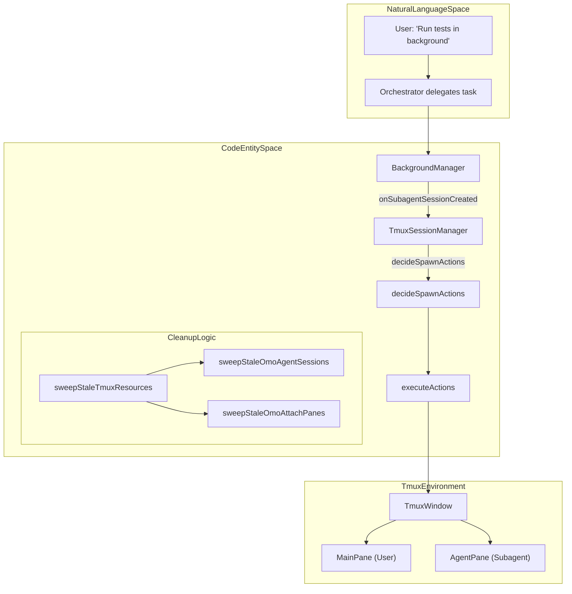
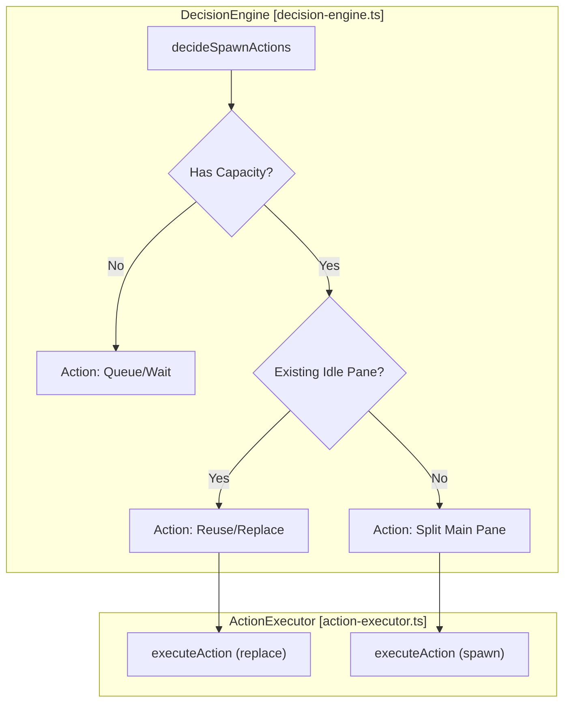
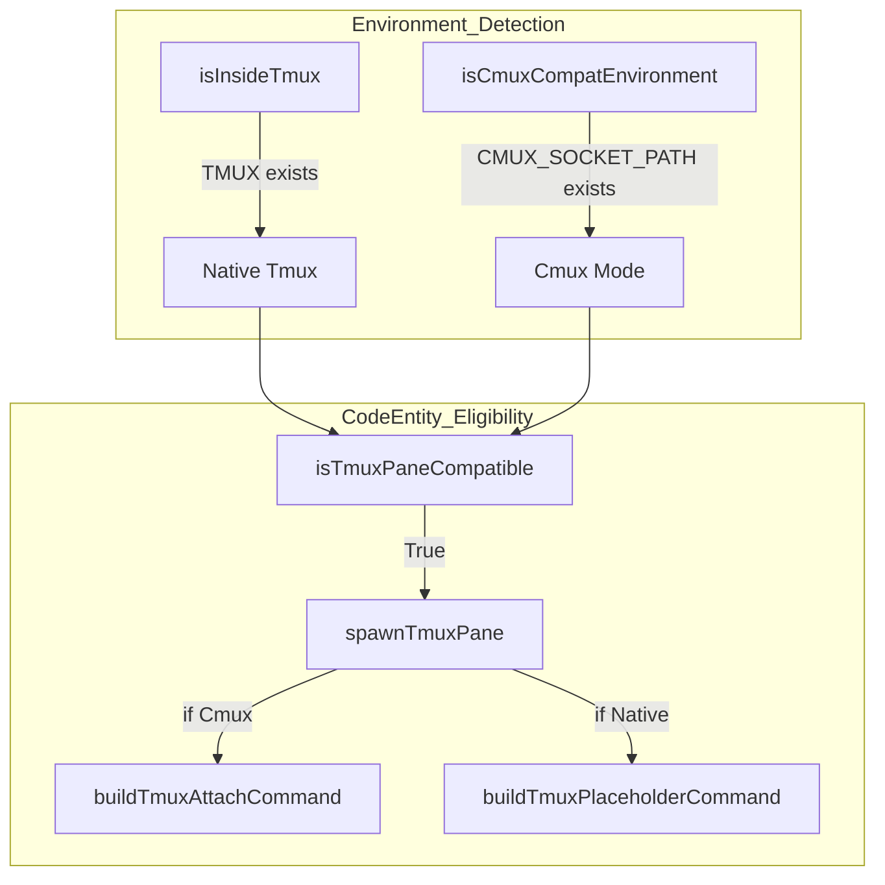

# Tmux Subagent Integration

Relevant source files

The following files were used as context for generating this wiki page:

- [packages/omo-opencode/src/create-hooks.ts](https://github.com/code-yeongyu/oh-my-openagent/blob/HEAD/packages/omo-opencode/src/create-hooks.ts)
- [packages/omo-opencode/src/create-managers.monitor.test.ts](https://github.com/code-yeongyu/oh-my-openagent/blob/HEAD/packages/omo-opencode/src/create-managers.monitor.test.ts)
- [packages/omo-opencode/src/create-managers.test.ts](https://github.com/code-yeongyu/oh-my-openagent/blob/HEAD/packages/omo-opencode/src/create-managers.test.ts)
- [packages/omo-opencode/src/create-managers.ts](https://github.com/code-yeongyu/oh-my-openagent/blob/HEAD/packages/omo-opencode/src/create-managers.ts)
- [packages/omo-opencode/src/create-tools.ts](https://github.com/code-yeongyu/oh-my-openagent/blob/HEAD/packages/omo-opencode/src/create-tools.ts)
- [packages/omo-opencode/src/features/background-agent/index.ts](https://github.com/code-yeongyu/oh-my-openagent/blob/HEAD/packages/omo-opencode/src/features/background-agent/index.ts)
- [packages/omo-opencode/src/features/tmux-subagent/manager.test.ts](https://github.com/code-yeongyu/oh-my-openagent/blob/HEAD/packages/omo-opencode/src/features/tmux-subagent/manager.test.ts)
- [packages/omo-opencode/src/features/tmux-subagent/manager.ts](https://github.com/code-yeongyu/oh-my-openagent/blob/HEAD/packages/omo-opencode/src/features/tmux-subagent/manager.ts)
- [packages/omo-opencode/src/features/tmux-subagent/stale-tmux-resource-sweeper.ts](https://github.com/code-yeongyu/oh-my-openagent/blob/HEAD/packages/omo-opencode/src/features/tmux-subagent/stale-tmux-resource-sweeper.ts)
- [packages/omo-opencode/src/features/tui-sidebar/mirror-manager.test.ts](https://github.com/code-yeongyu/oh-my-openagent/blob/HEAD/packages/omo-opencode/src/features/tui-sidebar/mirror-manager.test.ts)
- [packages/omo-opencode/src/features/tui-sidebar/mirror-manager.ts](https://github.com/code-yeongyu/oh-my-openagent/blob/HEAD/packages/omo-opencode/src/features/tui-sidebar/mirror-manager.ts)
- [packages/omo-opencode/src/features/tui-sidebar/qa/register-and-run.sh](https://github.com/code-yeongyu/oh-my-openagent/blob/HEAD/packages/omo-opencode/src/features/tui-sidebar/qa/register-and-run.sh)
- [packages/omo-opencode/src/features/tui-sidebar/snapshot-builder.test.ts](https://github.com/code-yeongyu/oh-my-openagent/blob/HEAD/packages/omo-opencode/src/features/tui-sidebar/snapshot-builder.test.ts)
- [packages/omo-opencode/src/features/tui-sidebar/snapshot-builder.ts](https://github.com/code-yeongyu/oh-my-openagent/blob/HEAD/packages/omo-opencode/src/features/tui-sidebar/snapshot-builder.ts)
- [packages/omo-opencode/src/hooks/atlas/session-last-agent.json.test.ts](https://github.com/code-yeongyu/oh-my-openagent/blob/HEAD/packages/omo-opencode/src/hooks/atlas/session-last-agent.json.test.ts)
- [packages/omo-opencode/src/hooks/atlas/session-last-agent.ts](https://github.com/code-yeongyu/oh-my-openagent/blob/HEAD/packages/omo-opencode/src/hooks/atlas/session-last-agent.ts)
- [packages/omo-opencode/src/plugin/event-session-lifecycle.ts](https://github.com/code-yeongyu/oh-my-openagent/blob/HEAD/packages/omo-opencode/src/plugin/event-session-lifecycle.ts)
- [packages/omo-opencode/src/plugin/event.monitor.test.ts](https://github.com/code-yeongyu/oh-my-openagent/blob/HEAD/packages/omo-opencode/src/plugin/event.monitor.test.ts)
- [packages/omo-opencode/src/plugin/event.ts](https://github.com/code-yeongyu/oh-my-openagent/blob/HEAD/packages/omo-opencode/src/plugin/event.ts)
- [packages/omo-opencode/src/plugin/hooks/create-core-hooks.ts](https://github.com/code-yeongyu/oh-my-openagent/blob/HEAD/packages/omo-opencode/src/plugin/hooks/create-core-hooks.ts)
- [packages/omo-opencode/src/shared/tmux/tmux-utils/adapter-deps.ts](https://github.com/code-yeongyu/oh-my-openagent/blob/HEAD/packages/omo-opencode/src/shared/tmux/tmux-utils/adapter-deps.ts)
- [packages/omo-opencode/src/shared/tmux/tmux-utils/pane-close.ts](https://github.com/code-yeongyu/oh-my-openagent/blob/HEAD/packages/omo-opencode/src/shared/tmux/tmux-utils/pane-close.ts)
- [packages/omo-opencode/src/shared/tmux/tmux-utils/pane-command.test.ts](https://github.com/code-yeongyu/oh-my-openagent/blob/HEAD/packages/omo-opencode/src/shared/tmux/tmux-utils/pane-command.test.ts)
- [packages/omo-opencode/src/tui.test.ts](https://github.com/code-yeongyu/oh-my-openagent/blob/HEAD/packages/omo-opencode/src/tui.test.ts)
- [packages/omo-opencode/src/tui.ts](https://github.com/code-yeongyu/oh-my-openagent/blob/HEAD/packages/omo-opencode/src/tui.ts)
- [packages/tmux-core/src/cmux-detect.test.ts](https://github.com/code-yeongyu/oh-my-openagent/blob/HEAD/packages/tmux-core/src/cmux-detect.test.ts)
- [packages/tmux-core/src/cmux-detect.ts](https://github.com/code-yeongyu/oh-my-openagent/blob/HEAD/packages/tmux-core/src/cmux-detect.ts)
- [packages/tmux-core/src/tmux-utils.test.ts](https://github.com/code-yeongyu/oh-my-openagent/blob/HEAD/packages/tmux-core/src/tmux-utils.test.ts)
- [packages/tmux-core/src/tmux-utils/pane-activate.ts](https://github.com/code-yeongyu/oh-my-openagent/blob/HEAD/packages/tmux-core/src/tmux-utils/pane-activate.ts)
- [packages/tmux-core/src/tmux-utils/pane-command.test.ts](https://github.com/code-yeongyu/oh-my-openagent/blob/HEAD/packages/tmux-core/src/tmux-utils/pane-command.test.ts)
- [packages/tmux-core/src/tmux-utils/pane-command.ts](https://github.com/code-yeongyu/oh-my-openagent/blob/HEAD/packages/tmux-core/src/tmux-utils/pane-command.ts)
- [packages/tmux-core/src/tmux-utils/pane-replace.test.ts](https://github.com/code-yeongyu/oh-my-openagent/blob/HEAD/packages/tmux-core/src/tmux-utils/pane-replace.test.ts)
- [packages/tmux-core/src/tmux-utils/pane-replace.ts](https://github.com/code-yeongyu/oh-my-openagent/blob/HEAD/packages/tmux-core/src/tmux-utils/pane-replace.ts)
- [packages/tmux-core/src/tmux-utils/pane-spawn-runner.test.ts](https://github.com/code-yeongyu/oh-my-openagent/blob/HEAD/packages/tmux-core/src/tmux-utils/pane-spawn-runner.test.ts)
- [packages/tmux-core/src/tmux-utils/pane-spawn.ts](https://github.com/code-yeongyu/oh-my-openagent/blob/HEAD/packages/tmux-core/src/tmux-utils/pane-spawn.ts)
- [packages/tmux-core/src/tmux-utils/session-spawn.ts](https://github.com/code-yeongyu/oh-my-openagent/blob/HEAD/packages/tmux-core/src/tmux-utils/session-spawn.ts)
- [packages/tmux-core/src/tmux-utils/window-spawn.test.ts](https://github.com/code-yeongyu/oh-my-openagent/blob/HEAD/packages/tmux-core/src/tmux-utils/window-spawn.test.ts)
- [packages/tmux-core/src/tmux-utils/window-spawn.ts](https://github.com/code-yeongyu/oh-my-openagent/blob/HEAD/packages/tmux-core/src/tmux-utils/window-spawn.ts)

The Tmux Subagent Integration provides a visual monitoring system for background agents by automatically managing a grid of tmux panes. When a background task is delegated, the `TmuxSessionManager` orchestrates the creation, layout, and cleanup of dedicated panes, allowing users to monitor multiple subagents in real-time within their existing terminal workspace.

## Overview

The system operates on a **state-first architecture** [packages/omo-opencode/src/features/tmux-subagent/manager.ts:59-66](https://github.com/code-yeongyu/oh-my-openagent/blob/HEAD/packages/omo-opencode/src/features/tmux-subagent/manager.ts#L59-L66). Instead of relying solely on internal state, it treats the actual tmux pane configuration as the source of truth. The lifecycle follows a Query-Decide-Execute-Update loop:

1.  **Query**: Fetch the current tmux window state (pane dimensions and positions) using `queryWindowState` [packages/omo-opencode/src/features/tmux-subagent/manager.ts:52-53](https://github.com/code-yeongyu/oh-my-openagent/blob/HEAD/packages/omo-opencode/src/features/tmux-subagent/manager.ts#L52-L53).
2.  **Decide**: A pure decision engine `decideSpawnActions` determines the necessary actions (spawn, close, or replace) based on capacity and layout rules [packages/omo-opencode/src/features/tmux-subagent/manager.ts:19-19](https://github.com/code-yeongyu/oh-my-openagent/blob/HEAD/packages/omo-opencode/src/features/tmux-subagent/manager.ts#L19).
3.  **Execute**: Actions are performed via `executeActions` which calls tmux CLI commands with verification [packages/omo-opencode/src/features/tmux-subagent/manager.ts:20-20](https://github.com/code-yeongyu/oh-my-openagent/blob/HEAD/packages/omo-opencode/src/features/tmux-subagent/manager.ts#L20).
4.  **Update**: Internal registries in `TmuxSessionManager` are updated only after tmux confirms success [packages/omo-opencode/src/features/tmux-subagent/manager.ts:116-124](https://github.com/code-yeongyu/oh-my-openagent/blob/HEAD/packages/omo-opencode/src/features/tmux-subagent/manager.ts#L116-L124).

### Sources
- [packages/omo-opencode/src/features/tmux-subagent/manager.ts:1-171](https://github.com/code-yeongyu/oh-my-openagent/blob/HEAD/packages/omo-opencode/src/features/tmux-subagent/manager.ts#L1-L171)
- [packages/omo-opencode/src/features/tmux-subagent/manager.ts:19-28](https://github.com/code-yeongyu/oh-my-openagent/blob/HEAD/packages/omo-opencode/src/features/tmux-subagent/manager.ts#L19-L28)

## Architecture and Data Flow

The following diagram illustrates the relationship between Natural Language intents (delegating a task) and the code entities that manage the tmux lifecycle.

**Tmux Subagent Integration Flow**

Sources: [packages/omo-opencode/src/features/tmux-subagent/manager.ts:19-28](https://github.com/code-yeongyu/oh-my-openagent/blob/HEAD/packages/omo-opencode/src/features/tmux-subagent/manager.ts#L19-L28), [packages/omo-opencode/src/features/tmux-subagent/manager.ts:156-164](https://github.com/code-yeongyu/oh-my-openagent/blob/HEAD/packages/omo-opencode/src/features/tmux-subagent/manager.ts#L156-L164), [packages/omo-opencode/src/features/tmux-subagent/manager.ts:29-29](https://github.com/code-yeongyu/oh-my-openagent/blob/HEAD/packages/omo-opencode/src/features/tmux-subagent/manager.ts#L29)

## TmuxSessionManager

The `TmuxSessionManager` is the central coordinator. It maintains a registry of tracked sessions and manages the lifecycle of tmux panes to ensure operations do not overlap and cause race conditions.

### Key Responsibilities:
- **Session Tracking**: Maps `sessionId` to its corresponding tmux pane or window using a `Map<string, TrackedSession>` [packages/omo-opencode/src/features/tmux-subagent/manager.ts:117-117](https://github.com/code-yeongyu/oh-my-openagent/blob/HEAD/packages/omo-opencode/src/features/tmux-subagent/manager.ts#L117).
- **Isolation Management**: Supports `window` or `session` isolation levels to keep subagent outputs separate from the main workspace [packages/omo-opencode/src/features/tmux-subagent/manager.ts:176-179](https://github.com/code-yeongyu/oh-my-openagent/blob/HEAD/packages/omo-opencode/src/features/tmux-subagent/manager.ts#L176-L179).
- **Resource Cleanup**: Periodically runs `sweepStaleTmuxResources` to prune orphaned panes and sessions [packages/omo-opencode/src/features/tmux-subagent/manager.ts:29-29](https://github.com/code-yeongyu/oh-my-openagent/blob/HEAD/packages/omo-opencode/src/features/tmux-subagent/manager.ts#L29).
- **Team Mode Awareness**: Uses `shouldSkipSession` to avoid double-tracking sessions that are already managed by the Team Mode layout engine [packages/omo-opencode/src/features/tmux-subagent/manager.ts:65-76](https://github.com/code-yeongyu/oh-my-openagent/blob/HEAD/packages/omo-opencode/src/features/tmux-subagent/manager.ts#L65-L76).

### Implementation Details:
- **`isInsideTmux()`**: Guard that ensures tmux operations only run if the `TMUX` environment variable is present [packages/omo-opencode/src/features/tmux-subagent/manager.ts:51-51](https://github.com/code-yeongyu/oh-my-openagent/blob/HEAD/packages/omo-opencode/src/features/tmux-subagent/manager.ts#L51).
- **`FailedReadinessCache`**: Tracks sessions that failed to attach properly to prevent repeated failed spawn attempts [packages/omo-opencode/src/features/tmux-subagent/manager.ts:27-27](https://github.com/code-yeongyu/oh-my-openagent/blob/HEAD/packages/omo-opencode/src/features/tmux-subagent/manager.ts#L27).
- **`TmuxPollingManager`**: Handles background polling of session statuses and pane health [packages/omo-opencode/src/features/tmux-subagent/manager.ts:21-21](https://github.com/code-yeongyu/oh-my-openagent/blob/HEAD/packages/omo-opencode/src/features/tmux-subagent/manager.ts#L21).

Sources: [packages/omo-opencode/src/features/tmux-subagent/manager.ts:109-171](https://github.com/code-yeongyu/oh-my-openagent/blob/HEAD/packages/omo-opencode/src/features/tmux-subagent/manager.ts#L109-L171), [packages/omo-opencode/src/features/tmux-subagent/manager.ts:27-29](https://github.com/code-yeongyu/oh-my-openagent/blob/HEAD/packages/omo-opencode/src/features/tmux-subagent/manager.ts#L27-L29)

## Decision Engine and Pane Planning

The system uses a grid planning algorithm to decide where to place new agent panes. It calculates the available space in the current window and determines if a new pane should be split from the main pane or if an existing idle pane should be reused.

**Pane Action Decision Flow**

Sources: [packages/omo-opencode/src/features/tmux-subagent/manager.ts:19-20](https://github.com/code-yeongyu/oh-my-openagent/blob/HEAD/packages/omo-opencode/src/features/tmux-subagent/manager.ts#L19-L20), [packages/omo-opencode/src/features/tmux-subagent/manager.ts:156-164](https://github.com/code-yeongyu/oh-my-openagent/blob/HEAD/packages/omo-opencode/src/features/tmux-subagent/manager.ts#L156-L164)

## Environment Compatibility and Cmux

The integration includes a sophisticated eligibility system to handle standard `tmux` as well as `cmux` (terminal multiplexer) environments.

### Cmux Eligibility
In environments where `TMUX` is absent but `CMUX_SOCKET_PATH` is present, the system enters "Cmux Compatibility Mode" [packages/tmux-core/src/cmux-detect.ts:1-10](https://github.com/code-yeongyu/oh-my-openagent/blob/HEAD/packages/tmux-core/src/cmux-detect.ts#L1-L10).
- **Inline Pane Support**: Cmux supports `split-window` operations to create inline panes even if it does not support full window or session isolation [packages/tmux-core/src/tmux-utils/pane-spawn.ts:87-89](https://github.com/code-yeongyu/oh-my-openagent/blob/HEAD/packages/tmux-core/src/tmux-utils/pane-spawn.ts#L87-L89).
- **Eager Attachment**: In Cmux, the system uses `buildTmuxAttachCommand` to eagerly attach the agent session during the split, rather than using a placeholder command [packages/tmux-core/src/tmux-utils/pane-spawn.ts:87-89](https://github.com/code-yeongyu/oh-my-openagent/blob/HEAD/packages/tmux-core/src/tmux-utils/pane-spawn.ts#L87-L89).
- **Security Gates**: Authenticated cmux panes are explicitly unsupported to prevent credential leakage in multiplexed environments [packages/tmux-core/src/tmux-utils/pane-spawn.ts:82-85](https://github.com/code-yeongyu/oh-my-openagent/blob/HEAD/packages/tmux-core/src/tmux-utils/pane-spawn.ts#L82-L85).

**Environment Logic Space**

Sources: [packages/tmux-core/src/tmux-utils/pane-spawn.ts:59-65](https://github.com/code-yeongyu/oh-my-openagent/blob/HEAD/packages/tmux-core/src/tmux-utils/pane-spawn.ts#L59-L65), [packages/tmux-core/src/tmux-utils/pane-spawn.ts:87-89](https://github.com/code-yeongyu/oh-my-openagent/blob/HEAD/packages/tmux-core/src/tmux-utils/pane-spawn.ts#L87-L89), [packages/tmux-core/src/cmux-detect.ts:1-10](https://github.com/code-yeongyu/oh-my-openagent/blob/HEAD/packages/tmux-core/src/cmux-detect.ts#L1-L10)

## Stability and Cleanup

To ensure terminal stability, the system includes aggressive cleanup logic for stale resources.

- **Stale Session Sweeping**: The `sweepStaleOmoAgentSessions` function identifies tmux sessions matching the `omo-agents-[PID]` pattern and kills them if the parent PID is no longer alive [packages/omo-opencode/src/shared/tmux/index.ts:14-14](https://github.com/code-yeongyu/oh-my-openagent/blob/HEAD/packages/omo-opencode/src/shared/tmux/index.ts#L14).
- **Stale Attach Pane Sweeping**: The `sweepStaleOmoAttachPanes` function scans all tmux panes for titles prefixed with `omo-subagent-` and verifies if the server is still responsive [packages/omo-opencode/src/shared/tmux/index.ts:15-15](https://github.com/code-yeongyu/oh-my-openagent/blob/HEAD/packages/omo-opencode/src/shared/tmux/index.ts#L15).
- **Graceful Shutdown**: The `replaceTmuxPane` helper ensures that panes are cleaned up by sending a `C-c` interrupt followed by a `respawn-pane` command to clear the process [packages/tmux-core/src/tmux-utils/pane-replace.ts:59-64](https://github.com/code-yeongyu/oh-my-openagent/blob/HEAD/packages/tmux-core/src/tmux-utils/pane-replace.ts#L59-L64).
- **Isolated Session Naming**: Isolated sessions are uniquely identified using the process PID and an optional manager ID to prevent naming collisions [packages/tmux-core/src/tmux-utils/session-spawn.ts:32-36](https://github.com/code-yeongyu/oh-my-openagent/blob/HEAD/packages/tmux-core/src/tmux-utils/session-spawn.ts#L32-L36).

Sources: [packages/omo-opencode/src/features/tmux-subagent/manager.ts:29-29](https://github.com/code-yeongyu/oh-my-openagent/blob/HEAD/packages/omo-opencode/src/features/tmux-subagent/manager.ts#L29), [packages/tmux-core/src/tmux-utils/pane-replace.ts:59-84](https://github.com/code-yeongyu/oh-my-openagent/blob/HEAD/packages/tmux-core/src/tmux-utils/pane-replace.ts#L59-L84), [packages/omo-opencode/src/features/tmux-subagent/stale-tmux-resource-sweeper.ts:1-20](https://github.com/code-yeongyu/oh-my-openagent/blob/HEAD/packages/omo-opencode/src/features/tmux-subagent/stale-tmux-resource-sweeper.ts#L1-L20), [packages/tmux-core/src/tmux-utils/session-spawn.ts:32-36](https://github.com/code-yeongyu/oh-my-openagent/blob/HEAD/packages/tmux-core/src/tmux-utils/session-spawn.ts#L32-L36)