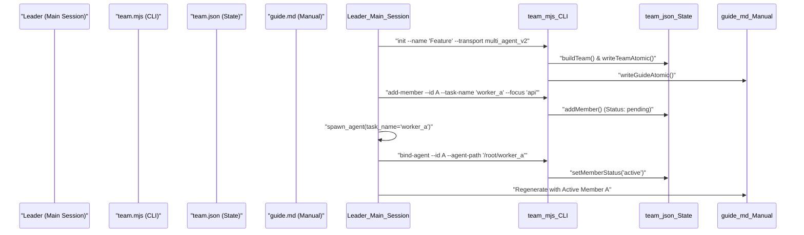

# Team Mode

<details>
<summary>Relevant source files</summary>

The following files were used as context for generating this wiki page:

- [packages/omo-codex/plugin/components/teammode/skills/teammode/SKILL.md](https://github.com/code-yeongyu/oh-my-openagent/blob/HEAD/packages/omo-codex/plugin/components/teammode/skills/teammode/SKILL.md)
- [packages/omo-codex/plugin/components/teammode/skills/teammode/scripts/team-guide.mjs](https://github.com/code-yeongyu/oh-my-openagent/blob/HEAD/packages/omo-codex/plugin/components/teammode/skills/teammode/scripts/team-guide.mjs)
- [packages/omo-codex/plugin/components/teammode/skills/teammode/scripts/team-state.mjs](https://github.com/code-yeongyu/oh-my-openagent/blob/HEAD/packages/omo-codex/plugin/components/teammode/skills/teammode/scripts/team-state.mjs)
- [packages/omo-codex/plugin/components/teammode/skills/teammode/scripts/team-transport.mjs](https://github.com/code-yeongyu/oh-my-openagent/blob/HEAD/packages/omo-codex/plugin/components/teammode/skills/teammode/scripts/team-transport.mjs)
- [packages/omo-codex/plugin/components/teammode/skills/teammode/scripts/team-worktree.mjs](https://github.com/code-yeongyu/oh-my-openagent/blob/HEAD/packages/omo-codex/plugin/components/teammode/skills/teammode/scripts/team-worktree.mjs)
- [packages/omo-codex/plugin/components/teammode/skills/teammode/scripts/team.mjs](https://github.com/code-yeongyu/oh-my-openagent/blob/HEAD/packages/omo-codex/plugin/components/teammode/skills/teammode/scripts/team.mjs)
- [packages/omo-codex/plugin/components/teammode/src/cli.ts](https://github.com/code-yeongyu/oh-my-openagent/blob/HEAD/packages/omo-codex/plugin/components/teammode/src/cli.ts)
- [packages/omo-codex/plugin/components/teammode/src/codex-hook.ts](https://github.com/code-yeongyu/oh-my-openagent/blob/HEAD/packages/omo-codex/plugin/components/teammode/src/codex-hook.ts)
- [packages/omo-codex/plugin/components/teammode/test/thread-title-hook.test.ts](https://github.com/code-yeongyu/oh-my-openagent/blob/HEAD/packages/omo-codex/plugin/components/teammode/test/thread-title-hook.test.ts)
- [packages/omo-codex/plugin/components/teammode/tsconfig.json](https://github.com/code-yeongyu/oh-my-openagent/blob/HEAD/packages/omo-codex/plugin/components/teammode/tsconfig.json)
- [packages/omo-codex/plugin/test/teammode-archive-ambiguity.test.mjs](https://github.com/code-yeongyu/oh-my-openagent/blob/HEAD/packages/omo-codex/plugin/test/teammode-archive-ambiguity.test.mjs)
- [packages/omo-codex/plugin/test/teammode-safety-fixture.mjs](https://github.com/code-yeongyu/oh-my-openagent/blob/HEAD/packages/omo-codex/plugin/test/teammode-safety-fixture.mjs)
- [packages/omo-codex/plugin/test/teammode-safety.test.mjs](https://github.com/code-yeongyu/oh-my-openagent/blob/HEAD/packages/omo-codex/plugin/test/teammode-safety.test.mjs)
- [packages/omo-codex/plugin/test/teammode-thread-links.test.mjs](https://github.com/code-yeongyu/oh-my-openagent/blob/HEAD/packages/omo-codex/plugin/test/teammode-thread-links.test.mjs)
- [packages/omo-codex/plugin/test/teammode-thread-title.test.mjs](https://github.com/code-yeongyu/oh-my-openagent/blob/HEAD/packages/omo-codex/plugin/test/teammode-thread-title.test.mjs)
- [packages/omo-codex/plugin/test/teammode-transport.test.mjs](https://github.com/code-yeongyu/oh-my-openagent/blob/HEAD/packages/omo-codex/plugin/test/teammode-transport.test.mjs)
- [packages/omo-codex/plugin/test/teammode-worktree.test.mjs](https://github.com/code-yeongyu/oh-my-openagent/blob/HEAD/packages/omo-codex/plugin/test/teammode-worktree.test.mjs)
- [packages/omo-opencode/src/features/background-agent/background-task-notification-template.test.ts](https://github.com/code-yeongyu/oh-my-openagent/blob/HEAD/packages/omo-opencode/src/features/background-agent/background-task-notification-template.test.ts)
- [packages/omo-opencode/src/features/background-agent/background-task-notification-template.ts](https://github.com/code-yeongyu/oh-my-openagent/blob/HEAD/packages/omo-opencode/src/features/background-agent/background-task-notification-template.ts)
- [packages/omo-opencode/src/features/hook-message-injector/injector.test.ts](https://github.com/code-yeongyu/oh-my-openagent/blob/HEAD/packages/omo-opencode/src/features/hook-message-injector/injector.test.ts)
- [packages/omo-opencode/src/features/hook-message-injector/sdk-message-lookup.ts](https://github.com/code-yeongyu/oh-my-openagent/blob/HEAD/packages/omo-opencode/src/features/hook-message-injector/sdk-message-lookup.ts)
- [packages/omo-opencode/src/features/team-mode/integration.test.ts](https://github.com/code-yeongyu/oh-my-openagent/blob/HEAD/packages/omo-opencode/src/features/team-mode/integration.test.ts)
- [packages/omo-opencode/src/features/team-mode/team-mailbox/poll.test.ts](https://github.com/code-yeongyu/oh-my-openagent/blob/HEAD/packages/omo-opencode/src/features/team-mode/team-mailbox/poll.test.ts)
- [packages/omo-opencode/src/features/team-mode/team-runtime/create.test.ts](https://github.com/code-yeongyu/oh-my-openagent/blob/HEAD/packages/omo-opencode/src/features/team-mode/team-runtime/create.test.ts)
- [packages/omo-opencode/src/features/team-mode/test-support/async-test-helpers.ts](https://github.com/code-yeongyu/oh-my-openagent/blob/HEAD/packages/omo-opencode/src/features/team-mode/test-support/async-test-helpers.ts)
- [packages/omo-opencode/src/hooks/atlas/tool-execute-after-background-launch.test.ts](https://github.com/code-yeongyu/oh-my-openagent/blob/HEAD/packages/omo-opencode/src/hooks/atlas/tool-execute-after-background-launch.test.ts)
- [packages/omo-opencode/src/hooks/atlas/tool-execute-after-subagent-completion.test.ts](https://github.com/code-yeongyu/oh-my-openagent/blob/HEAD/packages/omo-opencode/src/hooks/atlas/tool-execute-after-subagent-completion.test.ts)
- [packages/omo-opencode/src/hooks/atlas/tool-execute-after-subagent-completion.ts](https://github.com/code-yeongyu/oh-my-openagent/blob/HEAD/packages/omo-opencode/src/hooks/atlas/tool-execute-after-subagent-completion.ts)
- [packages/omo-opencode/src/hooks/atlas/tool-execute-after.ts](https://github.com/code-yeongyu/oh-my-openagent/blob/HEAD/packages/omo-opencode/src/hooks/atlas/tool-execute-after.ts)
- [packages/omo-opencode/src/hooks/atlas/types.ts](https://github.com/code-yeongyu/oh-my-openagent/blob/HEAD/packages/omo-opencode/src/hooks/atlas/types.ts)
- [packages/omo-opencode/src/shared/posthog-activity-state.ts](https://github.com/code-yeongyu/oh-my-openagent/blob/HEAD/packages/omo-opencode/src/shared/posthog-activity-state.ts)
- [packages/omo-opencode/src/shared/posthog.test.ts](https://github.com/code-yeongyu/oh-my-openagent/blob/HEAD/packages/omo-opencode/src/shared/posthog.test.ts)
- [packages/omo-opencode/src/shared/posthog.ts](https://github.com/code-yeongyu/oh-my-openagent/blob/HEAD/packages/omo-opencode/src/shared/posthog.ts)
- [packages/omo-opencode/src/shared/prompt-async-gate/pending-tool-turn.test.ts](https://github.com/code-yeongyu/oh-my-openagent/blob/HEAD/packages/omo-opencode/src/shared/prompt-async-gate/pending-tool-turn.test.ts)
- [packages/omo-senpi/scripts/qa/team-delete-6413-qa.mjs](https://github.com/code-yeongyu/oh-my-openagent/blob/HEAD/packages/omo-senpi/scripts/qa/team-delete-6413-qa.mjs)
- [packages/omo-senpi/src/components/task/team-service-delete.test.ts](https://github.com/code-yeongyu/oh-my-openagent/blob/HEAD/packages/omo-senpi/src/components/task/team-service-delete.test.ts)
- [packages/omo-senpi/src/components/task/team-service.test.ts](https://github.com/code-yeongyu/oh-my-openagent/blob/HEAD/packages/omo-senpi/src/components/task/team-service.test.ts)
- [packages/omo-senpi/src/components/task/team-service.ts](https://github.com/code-yeongyu/oh-my-openagent/blob/HEAD/packages/omo-senpi/src/components/task/team-service.ts)
- [packages/omo-senpi/src/extension/tool-capture-registry.test.ts](https://github.com/code-yeongyu/oh-my-openagent/blob/HEAD/packages/omo-senpi/src/extension/tool-capture-registry.test.ts)
- [packages/senpi-task/src/team/__fixtures__/runtime-fakes.ts](https://github.com/code-yeongyu/oh-my-openagent/blob/HEAD/packages/senpi-task/src/team/__fixtures__/runtime-fakes.ts)
- [packages/senpi-task/src/team/member-extension/index.ts](https://github.com/code-yeongyu/oh-my-openagent/blob/HEAD/packages/senpi-task/src/team/member-extension/index.ts)
- [packages/senpi-task/src/team/member-extension/self-poller.test.ts](https://github.com/code-yeongyu/oh-my-openagent/blob/HEAD/packages/senpi-task/src/team/member-extension/self-poller.test.ts)
- [packages/senpi-task/src/team/member-extension/self-poller.ts](https://github.com/code-yeongyu/oh-my-openagent/blob/HEAD/packages/senpi-task/src/team/member-extension/self-poller.ts)
- [packages/senpi-task/src/team/member-extension/tools.test.ts](https://github.com/code-yeongyu/oh-my-openagent/blob/HEAD/packages/senpi-task/src/team/member-extension/tools.test.ts)
- [packages/senpi-task/src/team/member-extension/tools.ts](https://github.com/code-yeongyu/oh-my-openagent/blob/HEAD/packages/senpi-task/src/team/member-extension/tools.ts)
- [packages/senpi-task/src/team/member-map.test.ts](https://github.com/code-yeongyu/oh-my-openagent/blob/HEAD/packages/senpi-task/src/team/member-map.test.ts)
- [packages/senpi-task/src/team/member-map.ts](https://github.com/code-yeongyu/oh-my-openagent/blob/HEAD/packages/senpi-task/src/team/member-map.ts)
- [packages/senpi-task/src/team/member-projection.test.ts](https://github.com/code-yeongyu/oh-my-openagent/blob/HEAD/packages/senpi-task/src/team/member-projection.test.ts)
- [packages/senpi-task/src/team/member-projection.ts](https://github.com/code-yeongyu/oh-my-openagent/blob/HEAD/packages/senpi-task/src/team/member-projection.ts)
- [packages/senpi-task/src/team/messaging/__fixtures__/messaging-fakes.ts](https://github.com/code-yeongyu/oh-my-openagent/blob/HEAD/packages/senpi-task/src/team/messaging/__fixtures__/messaging-fakes.ts)
- [packages/senpi-task/src/team/messaging/send.test.ts](https://github.com/code-yeongyu/oh-my-openagent/blob/HEAD/packages/senpi-task/src/team/messaging/send.test.ts)
- [packages/senpi-task/src/team/messaging/send.ts](https://github.com/code-yeongyu/oh-my-openagent/blob/HEAD/packages/senpi-task/src/team/messaging/send.ts)
- [packages/senpi-task/src/team/messaging/types.ts](https://github.com/code-yeongyu/oh-my-openagent/blob/HEAD/packages/senpi-task/src/team/messaging/types.ts)
- [packages/senpi-task/src/team/normalize.test.ts](https://github.com/code-yeongyu/oh-my-openagent/blob/HEAD/packages/senpi-task/src/team/normalize.test.ts)
- [packages/senpi-task/src/team/normalize.ts](https://github.com/code-yeongyu/oh-my-openagent/blob/HEAD/packages/senpi-task/src/team/normalize.ts)
- [packages/senpi-task/src/team/runtime-config.test.ts](https://github.com/code-yeongyu/oh-my-openagent/blob/HEAD/packages/senpi-task/src/team/runtime-config.test.ts)
- [packages/senpi-task/src/team/runtime-config.ts](https://github.com/code-yeongyu/oh-my-openagent/blob/HEAD/packages/senpi-task/src/team/runtime-config.ts)
- [packages/senpi-task/src/team/runtime-create-failure.test.ts](https://github.com/code-yeongyu/oh-my-openagent/blob/HEAD/packages/senpi-task/src/team/runtime-create-failure.test.ts)
- [packages/senpi-task/src/team/runtime-delete.test.ts](https://github.com/code-yeongyu/oh-my-openagent/blob/HEAD/packages/senpi-task/src/team/runtime-delete.test.ts)
- [packages/senpi-task/src/team/runtime-types.ts](https://github.com/code-yeongyu/oh-my-openagent/blob/HEAD/packages/senpi-task/src/team/runtime-types.ts)
- [packages/senpi-task/src/team/runtime.test.ts](https://github.com/code-yeongyu/oh-my-openagent/blob/HEAD/packages/senpi-task/src/team/runtime.test.ts)
- [packages/senpi-task/src/team/runtime.ts](https://github.com/code-yeongyu/oh-my-openagent/blob/HEAD/packages/senpi-task/src/team/runtime.ts)
- [packages/senpi-task/src/team/spawn-members-task-summary.test.ts](https://github.com/code-yeongyu/oh-my-openagent/blob/HEAD/packages/senpi-task/src/team/spawn-members-task-summary.test.ts)
- [packages/senpi-task/src/team/spawn-members.ts](https://github.com/code-yeongyu/oh-my-openagent/blob/HEAD/packages/senpi-task/src/team/spawn-members.ts)
- [packages/senpi-task/src/tools/team/__fixtures__/team-tool-fakes.ts](https://github.com/code-yeongyu/oh-my-openagent/blob/HEAD/packages/senpi-task/src/tools/team/__fixtures__/team-tool-fakes.ts)
- [packages/senpi-task/src/tools/team/lifecycle.test.ts](https://github.com/code-yeongyu/oh-my-openagent/blob/HEAD/packages/senpi-task/src/tools/team/lifecycle.test.ts)
- [packages/senpi-task/src/tools/team/lifecycle.ts](https://github.com/code-yeongyu/oh-my-openagent/blob/HEAD/packages/senpi-task/src/tools/team/lifecycle.ts)
- [packages/team-core/src/team-mailbox/poll.test.ts](https://github.com/code-yeongyu/oh-my-openagent/blob/HEAD/packages/team-core/src/team-mailbox/poll.test.ts)
- [packages/team-core/src/types.ts](https://github.com/code-yeongyu/oh-my-openagent/blob/HEAD/packages/team-core/src/types.ts)

</details>


Team Mode is a multi-agent orchestration system designed for high-stakes, parallelized work. It allows a lead agent to coordinate a squad of specialized workers through a shared environment with durable state, worktree isolation, and asynchronous mailbox communication. The system supports two primary transports: native **MultiAgentV2** (flat agents) and **Codex App threads** [packages/omo-codex/plugin/components/teammode/skills/teammode/SKILL.md:35-42](https://github.com/code-yeongyu/oh-my-openagent/blob/HEAD/packages/omo-codex/plugin/components/teammode/skills/teammode/SKILL.md#L35-L42).

## TeamSpec Lifecycle

The lifecycle of a team is governed by a state model managed by a dependency-free Node script (`team.mjs`) that replaces manual configuration with atomic JSON and Markdown artifacts [packages/omo-codex/plugin/components/teammode/skills/teammode/scripts/team.mjs:2-7](https://github.com/code-yeongyu/oh-my-openagent/blob/HEAD/packages/omo-codex/plugin/components/teammode/skills/teammode/scripts/team.mjs#L2-L7).

### 1. Specification and Initialization
Teams are initialized via the `init` command, which creates a dedicated directory under `.omo/teams/{sessionId}/` [packages/omo-codex/plugin/components/teammode/skills/teammode/scripts/team.mjs:104-105](https://github.com/code-yeongyu/oh-my-openagent/blob/HEAD/packages/omo-codex/plugin/components/teammode/skills/teammode/scripts/team.mjs#L104-L105).
- **State Model**: The `buildTeam` function initializes the `team.json` schema, defining the leader as the "main-session" and setting the transport (which is immutable for the team's lifetime) [packages/omo-codex/plugin/components/teammode/skills/teammode/scripts/team-state.mjs:45-72](https://github.com/code-yeongyu/oh-my-openagent/blob/HEAD/packages/omo-codex/plugin/components/teammode/skills/teammode/scripts/team-state.mjs#L45-L72).
- **Field Manual**: The system auto-generates `guide.md`, a "member field manual" that serves as the single source of truth for agent protocols, including communication rules and identity conventions [packages/omo-codex/plugin/components/teammode/skills/teammode/scripts/team-guide.mjs:24-24](https://github.com/code-yeongyu/oh-my-openagent/blob/HEAD/packages/omo-codex/plugin/components/teammode/skills/teammode/scripts/team-guide.mjs#L24).
- **Hyperplan Composition**: In the `senpi-task` implementation, teams can be created from an `inline_spec` (ad hoc) or a named `team_name` from the project registry [packages/senpi-task/src/tools/team/lifecycle.ts:46-55](https://github.com/code-yeongyu/oh-my-openagent/blob/HEAD/packages/senpi-task/src/tools/team/lifecycle.ts#L46-L55).

### 2. Member Composition and Binding
A team must consist of at least **2 distinct members** [packages/omo-codex/plugin/components/teammode/skills/teammode/scripts/team-state.mjs:30](https://github.com/code-yeongyu/oh-my-openagent/blob/HEAD/packages/omo-codex/plugin/components/teammode/skills/teammode/scripts/team-state.mjs#L30). 
1. **Add Member**: Members are added with a specific `focus` (code slice) and a `lens` (`area`, `ownership`, or `perspective`) [packages/omo-codex/plugin/components/teammode/skills/teammode/scripts/team-state.mjs:171-180](https://github.com/code-yeongyu/oh-my-openagent/blob/HEAD/packages/omo-codex/plugin/components/teammode/skills/teammode/scripts/team-state.mjs#L171-L180).
2. **Transport Activation**: 
    - For **MultiAgentV2**: The leader calls `spawn_agent` with a `task_name` [packages/omo-codex/plugin/components/teammode/skills/teammode/scripts/team.mjs:152-153](https://github.com/code-yeongyu/oh-my-openagent/blob/HEAD/packages/omo-codex/plugin/components/teammode/skills/teammode/scripts/team.mjs#L152-L153).
    - For **Codex App**: The leader calls `create_thread` [packages/omo-codex/plugin/components/teammode/skills/teammode/SKILL.md:40-42](https://github.com/code-yeongyu/oh-my-openagent/blob/HEAD/packages/omo-codex/plugin/components/teammode/skills/teammode/SKILL.md#L40-L42).
3. **Binding**: The `bind-agent` or `bind-thread` command links the unique transport ID to the member in `team.json`, transitioning their status from `pending` to `active` [packages/omo-codex/plugin/components/teammode/skills/teammode/scripts/team.mjs:157-171](https://github.com/code-yeongyu/oh-my-openagent/blob/HEAD/packages/omo-codex/plugin/components/teammode/skills/teammode/scripts/team.mjs#L157-L171).

### 3. Integration and Shutdown
- **Integration**: Member branches are integrated back to the base branch via the `integrateMemberBranch` utility [packages/omo-codex/plugin/components/teammode/skills/teammode/scripts/team.mjs:45](https://github.com/code-yeongyu/oh-my-openagent/blob/HEAD/packages/omo-codex/plugin/components/teammode/skills/teammode/scripts/team.mjs#L45).
- **Archive/Delete**: Teams can be archived to stop active coordination while preserving logs, or deleted to remove all on-disk state [packages/omo-codex/plugin/components/teammode/skills/teammode/scripts/team.mjs:15-16](https://github.com/code-yeongyu/oh-my-openagent/blob/HEAD/packages/omo-codex/plugin/components/teammode/skills/teammode/scripts/team.mjs#L15-L16). In `senpi-task`, `deleteTeam` ensures all background member tasks are cancelled and the runtime directory is removed [packages/senpi-task/src/team/runtime.ts:182-195](https://github.com/code-yeongyu/oh-my-openagent/blob/HEAD/packages/senpi-task/src/team/runtime.ts#L182-L195).

**Sources:** [packages/omo-codex/plugin/components/teammode/skills/teammode/scripts/team.mjs:9-16](https://github.com/code-yeongyu/oh-my-openagent/blob/HEAD/packages/omo-codex/plugin/components/teammode/skills/teammode/scripts/team.mjs#L9-L16), [packages/omo-codex/plugin/components/teammode/skills/teammode/scripts/team-state.mjs:45-72](https://github.com/code-yeongyu/oh-my-openagent/blob/HEAD/packages/omo-codex/plugin/components/teammode/skills/teammode/scripts/team-state.mjs#L45-L72), [packages/omo-codex/plugin/components/teammode/skills/teammode/SKILL.md:35-53](https://github.com/code-yeongyu/oh-my-openagent/blob/HEAD/packages/omo-codex/plugin/components/teammode/skills/teammode/SKILL.md#L35-L53), [packages/senpi-task/src/team/runtime.ts:182-195](https://github.com/code-yeongyu/oh-my-openagent/blob/HEAD/packages/senpi-task/src/team/runtime.ts#L182-L195), [packages/senpi-task/src/tools/team/lifecycle.ts:46-55](https://github.com/code-yeongyu/oh-my-openagent/blob/HEAD/packages/senpi-task/src/tools/team/lifecycle.ts#L46-L55)

## Roles and Communication

### Lead vs. Member Roles
- **Leader (Main Session)**: The leader orchestrates directly and never implements. It is responsible for splitting work, QA, and integration [packages/omo-codex/plugin/components/teammode/skills/teammode/SKILL.md:69-77](https://github.com/code-yeongyu/oh-my-openagent/blob/HEAD/packages/omo-codex/plugin/components/teammode/skills/teammode/SKILL.md#L69-L77).
- **Members**: Members own non-overlapping responsibilities. They are defined by concrete slices (e.g., `app-server-lifecycle`) rather than vague titles [packages/omo-codex/plugin/components/teammode/skills/teammode/SKILL.md:79-96](https://github.com/code-yeongyu/oh-my-openagent/blob/HEAD/packages/omo-codex/plugin/components/teammode/skills/teammode/SKILL.md#L79-L96).

### Communication Protocol
- **Transport Gating**: The `teammode` skill checks for `spawn_agent` (V2) or `codex_app.*` (App) tools before initialization [packages/omo-codex/plugin/components/teammode/skills/teammode/SKILL.md:32-47](https://github.com/code-yeongyu/oh-my-openagent/blob/HEAD/packages/omo-codex/plugin/components/teammode/skills/teammode/SKILL.md#L32-L47).
- **Mailbox Signals**: Members communicate using `send_message` or `followup_task`. The `guide.md` mandates status prefixes like `WORKING:`, `REPORTED:`, or `BLOCKED:` [packages/omo-codex/plugin/components/teammode/skills/teammode/scripts/team-guide.mjs:24-24](https://github.com/code-yeongyu/oh-my-openagent/blob/HEAD/packages/omo-codex/plugin/components/teammode/skills/teammode/scripts/team-guide.mjs#L24).
- **Task Management**: In the OpenCode adapter, tasks are managed via `createTask`, `claimTask`, and `updateTaskStatus` to track progress across the team [packages/omo-opencode/src/features/team-mode/integration.test.ts:48-48](https://github.com/code-yeongyu/oh-my-openagent/blob/HEAD/packages/omo-opencode/src/features/team-mode/integration.test.ts#L48).
- **Senpi Task Engine**: The `senpi-task` package provides a standardized task lifecycle (pending, running, completed, cancelled) [packages/senpi-task/src/team/runtime.ts:127-143](https://github.com/code-yeongyu/oh-my-openagent/blob/HEAD/packages/senpi-task/src/team/runtime.ts#L127-L143). It manages member spawning via `spawnTeamMembers`, enforcing `max_parallel_members` and wall-clock deadlines [packages/senpi-task/src/team/runtime.ts:66-74](https://github.com/code-yeongyu/oh-my-openagent/blob/HEAD/packages/senpi-task/src/team/runtime.ts#L66-L74).

### Technical Lifecycle Sequence
The following diagram illustrates the creation and binding flow.


**Sources:** [packages/omo-codex/plugin/components/teammode/skills/teammode/scripts/team.mjs:98-156](https://github.com/code-yeongyu/oh-my-openagent/blob/HEAD/packages/omo-codex/plugin/components/teammode/skills/teammode/scripts/team.mjs#L98-L156), [packages/omo-codex/plugin/components/teammode/skills/teammode/scripts/team-state.mjs:171-200](https://github.com/code-yeongyu/oh-my-openagent/blob/HEAD/packages/omo-codex/plugin/components/teammode/skills/teammode/scripts/team-state.mjs#L171-L200), [packages/senpi-task/src/team/runtime.ts:66-110](https://github.com/code-yeongyu/oh-my-openagent/blob/HEAD/packages/senpi-task/src/team/runtime.ts#L66-L110)

## Infrastructure and Isolation

### Worktree Isolation
When enabled, the system uses `git worktree` to ensure members cannot collide on the same files [packages/omo-codex/plugin/components/teammode/skills/teammode/scripts/team-state.mjs:65](https://github.com/code-yeongyu/oh-my-openagent/blob/HEAD/packages/omo-codex/plugin/components/teammode/skills/teammode/scripts/team-state.mjs#L65).
- **Branching**: Each member gets a derived branch (e.g., `team/{sessionId}/{memberId}`) [packages/omo-codex/plugin/components/teammode/skills/teammode/scripts/team.mjs:10](https://github.com/code-yeongyu/oh-my-openagent/blob/HEAD/packages/omo-codex/plugin/components/teammode/skills/teammode/scripts/team.mjs#L10).
- **Enforcement**: Members are instructed to `cd` into their assigned worktree immediately upon startup [packages/omo-codex/plugin/components/teammode/skills/teammode/scripts/team.mjs:11-12](https://github.com/code-yeongyu/oh-my-openagent/blob/HEAD/packages/omo-codex/plugin/components/teammode/skills/teammode/scripts/team.mjs#L11-L12).

### Codex-Native Components (omo-codex)
The `omo-codex` component provides specialized hooks for the Codex environment:
- **Thread Title Hook**: A `PostToolUse` hook monitors `create_thread` and forces the agent to call `set_thread_title` immediately to keep the UI manageable [packages/omo-codex/plugin/components/teammode/src/codex-hook.ts:39-51](https://github.com/code-yeongyu/oh-my-openagent/blob/HEAD/packages/omo-codex/plugin/components/teammode/src/codex-hook.ts#L39-L51).
- **Pending Worktree Guard**: If Codex returns a `pendingWorktreeId`, the hook warns the leader to wait for the real thread ID before binding [packages/omo-codex/plugin/components/teammode/src/codex-hook.ts:65-67](https://github.com/code-yeongyu/oh-my-openagent/blob/HEAD/packages/omo-codex/plugin/components/teammode/src/codex-hook.ts#L65-L67).

### Technical Entity Mapping
This diagram bridges the conceptual roles to the code entities.

```mermaid
graph DT
    subgraph Natural_Language_Space ["Natural Language Space"]
        TM["Team Mode"]
        Manual["Member Field Manual"]
        Isolation["Worktree Isolation"]
        TaskList["Team Task List"]
    end

    subgraph Code_Entity_Space ["Code Entity Space"]
        TS["team-state.mjs (State Logic)"]
        TG["team-guide.mjs (Markdown Builder)"]
        TW["team-worktree.mjs (Git Manager)"]
        CLI["team.mjs (Entry Point)"]
        PH["runPostToolUseHook (codex-hook.ts)"]
        RT["runtime.ts (Senpi Runtime)"]
        LC["lifecycle.ts (Team Tools)"]
        TSS["team-service.ts (Senpi Adapter)"]
    end

    TM --> CLI
    CLI --> TS
    CLI --> TG
    Manual --> TG
    Isolation --> TW
    TM --> PH
    TM --> RT
    TaskList --> LC
    RT --> TSS
```
**Sources:** [packages/omo-codex/plugin/components/teammode/skills/teammode/scripts/team.mjs:2-18](https://github.com/code-yeongyu/oh-my-openagent/blob/HEAD/packages/omo-codex/plugin/components/teammode/skills/teammode/scripts/team.mjs#L2-L18), [packages/omo-codex/plugin/components/teammode/src/codex-hook.ts:39-49](https://github.com/code-yeongyu/oh-my-openagent/blob/HEAD/packages/omo-codex/plugin/components/teammode/src/codex-hook.ts#L39-L49), [packages/senpi-task/src/team/runtime.ts:46-46](https://github.com/code-yeongyu/oh-my-openagent/blob/HEAD/packages/senpi-task/src/team/runtime.ts#L46), [packages/senpi-task/src/tools/team/lifecycle.ts:106-106](https://github.com/code-yeongyu/oh-my-openagent/blob/HEAD/packages/senpi-task/src/tools/team/lifecycle.ts#L106), [packages/omo-senpi/src/components/task/team-service.ts:126-126](https://github.com/code-yeongyu/oh-my-openagent/blob/HEAD/packages/omo-senpi/src/components/task/team-service.ts#L126)

## Constraints and Safety
- **Atomic Locking**: All mutations to `team.json` use `withTeamLock` (symlink-based) to prevent race conditions during concurrent `add-member` calls [packages/omo-codex/plugin/components/teammode/skills/teammode/scripts/team-state.mjs:38-40](https://github.com/code-yeongyu/oh-my-openagent/blob/HEAD/packages/omo-codex/plugin/components/teammode/skills/teammode/scripts/team-state.mjs#L38-L40), [packages/omo-codex/plugin/test/teammode-safety.test.mjs:87-138](https://github.com/code-yeongyu/oh-my-openagent/blob/HEAD/packages/omo-codex/plugin/test/teammode-safety.test.mjs#L87-L138).
- **Path Escape Guard**: `assertSafeTeamDir` ensures the team directory remains within `.omo/teams` and prevents directory traversal [packages/omo-codex/plugin/components/teammode/skills/teammode/scripts/team-state.mjs:35-37](https://github.com/code-yeongyu/oh-my-openagent/blob/HEAD/packages/omo-codex/plugin/components/teammode/skills/teammode/scripts/team-state.mjs#L35-L37).
- **Unique Identity**: The system enforces unique `focus`, `name`, and `taskName` across all members to prevent coordination ambiguity [packages/omo-codex/plugin/components/teammode/skills/teammode/scripts/team-state.mjs:99-158](https://github.com/code-yeongyu/oh-my-openagent/blob/HEAD/packages/omo-codex/plugin/components/teammode/skills/teammode/scripts/team-state.mjs#L99-L158).
- **8-Member Limit**: The `senpi-task` runtime enforces `max_members` bounds before spawning any members, defaulting to an 8-member limit in test fixtures [packages/senpi-task/src/team/runtime.ts:51-58](https://github.com/code-yeongyu/oh-my-openagent/blob/HEAD/packages/senpi-task/src/team/runtime.ts#L51-L58), [packages/senpi-task/src/team/__fixtures__/runtime-fakes.ts:37-37](https://github.com/code-yeongyu/oh-my-openagent/blob/HEAD/packages/senpi-task/src/team/__fixtures__/runtime-fakes.ts#L37).
- **Shutdown Handshake**: `deleteTeam` in the Senpi runtime performs a coordinated teardown, cancelling all member tasks and cleaning up sidecars [packages/senpi-task/src/team/runtime.ts:182-195](https://github.com/code-yeongyu/oh-my-openagent/blob/HEAD/packages/senpi-task/src/team/runtime.ts#L182-L195).
- **Eligibility Rules**: The system checks transport eligibility (e.g., presence of `spawn_agent` or `codex_app.*`) before allowing team creation [packages/omo-codex/plugin/components/teammode/skills/teammode/SKILL.md:32-47](https://github.com/code-yeongyu/oh-my-openagent/blob/HEAD/packages/omo-codex/plugin/components/teammode/skills/teammode/SKILL.md#L32-L47).
- **Curated Agent Gating**: Read-only curated agents (e.g., `momus`) are explicitly blocked from being team members to prevent architectural violations [packages/omo-senpi/src/components/task/team-service.test.ts:150-157](https://github.com/code-yeongyu/oh-my-openagent/blob/HEAD/packages/omo-senpi/src/components/task/team-service.test.ts#L150-L157).

**Sources:** [packages/omo-codex/plugin/components/teammode/skills/teammode/scripts/team-state.mjs:35-158](https://github.com/code-yeongyu/oh-my-openagent/blob/HEAD/packages/omo-codex/plugin/components/teammode/skills/teammode/scripts/team-state.mjs#L35-L158), [packages/senpi-task/src/team/runtime.ts:51-58](https://github.com/code-yeongyu/oh-my-openagent/blob/HEAD/packages/senpi-task/src/team/runtime.ts#L51-L58), [packages/omo-codex/plugin/test/teammode-safety.test.mjs:140-176](https://github.com/code-yeongyu/oh-my-openagent/blob/HEAD/packages/omo-codex/plugin/test/teammode-safety.test.mjs#L140-L176), [packages/omo-codex/plugin/components/teammode/skills/teammode/SKILL.md:32-47](https://github.com/code-yeongyu/oh-my-openagent/blob/HEAD/packages/omo-codex/plugin/components/teammode/skills/teammode/SKILL.md#L32-L47), [packages/omo-senpi/src/components/task/team-service.test.ts:150-157](https://github.com/code-yeongyu/oh-my-openagent/blob/HEAD/packages/omo-senpi/src/components/task/team-service.test.ts#L150-L157)