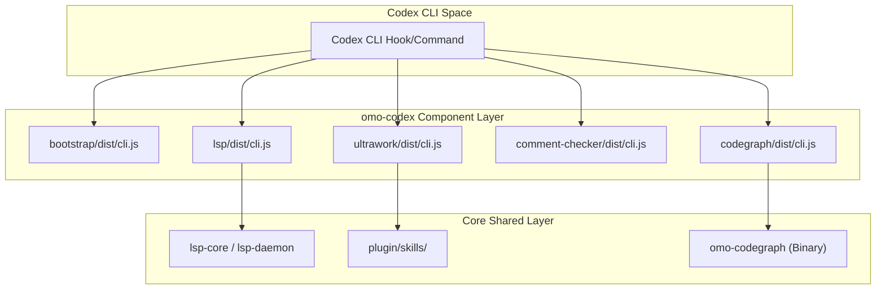
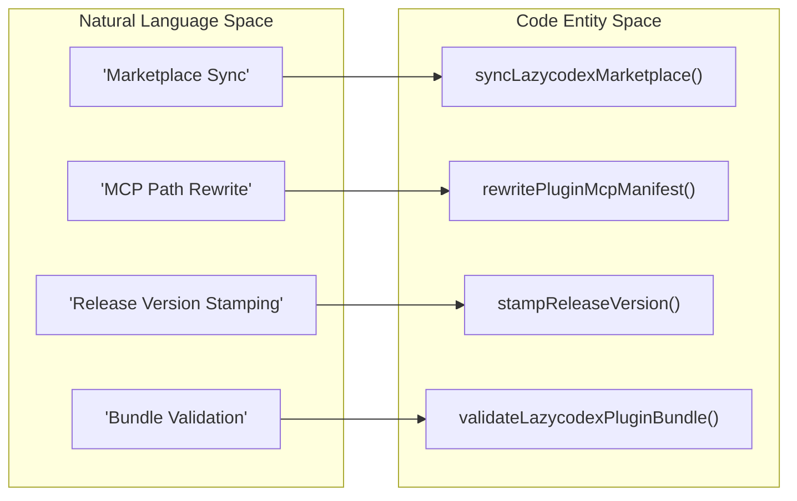

# LazyCodex (omo-codex) Light Edition

Relevant source files

The following files were used as context for generating this wiki page:

- [.omo/evidence/20260809-omo-ai-beta-release/task-10.txt](https://github.com/code-yeongyu/oh-my-openagent/blob/HEAD/.omo/evidence/20260809-omo-ai-beta-release/task-10.txt)
- [packages/memory-core/src/compile/cache.test.ts](https://github.com/code-yeongyu/oh-my-openagent/blob/HEAD/packages/memory-core/src/compile/cache.test.ts)
- [packages/omo-codex/AGENTS.md](https://github.com/code-yeongyu/oh-my-openagent/blob/HEAD/packages/omo-codex/AGENTS.md)
- [packages/omo-codex/package.json](https://github.com/code-yeongyu/oh-my-openagent/blob/HEAD/packages/omo-codex/package.json)
- [packages/omo-codex/plugin/.codex-plugin/plugin.json](https://github.com/code-yeongyu/oh-my-openagent/blob/HEAD/packages/omo-codex/plugin/.codex-plugin/plugin.json)
- [packages/omo-codex/plugin/components/codegraph/package.json](https://github.com/code-yeongyu/oh-my-openagent/blob/HEAD/packages/omo-codex/plugin/components/codegraph/package.json)
- [packages/omo-codex/plugin/components/comment-checker/package.json](https://github.com/code-yeongyu/oh-my-openagent/blob/HEAD/packages/omo-codex/plugin/components/comment-checker/package.json)
- [packages/omo-codex/plugin/components/git-bash/package.json](https://github.com/code-yeongyu/oh-my-openagent/blob/HEAD/packages/omo-codex/plugin/components/git-bash/package.json)
- [packages/omo-codex/plugin/components/lsp/package.json](https://github.com/code-yeongyu/oh-my-openagent/blob/HEAD/packages/omo-codex/plugin/components/lsp/package.json)
- [packages/omo-codex/plugin/components/rules/package.json](https://github.com/code-yeongyu/oh-my-openagent/blob/HEAD/packages/omo-codex/plugin/components/rules/package.json)
- [packages/omo-codex/plugin/components/start-work-continuation/package.json](https://github.com/code-yeongyu/oh-my-openagent/blob/HEAD/packages/omo-codex/plugin/components/start-work-continuation/package.json)
- [packages/omo-codex/plugin/components/telemetry/package.json](https://github.com/code-yeongyu/oh-my-openagent/blob/HEAD/packages/omo-codex/plugin/components/telemetry/package.json)
- [packages/omo-codex/plugin/components/ultrawork/package.json](https://github.com/code-yeongyu/oh-my-openagent/blob/HEAD/packages/omo-codex/plugin/components/ultrawork/package.json)
- [packages/omo-codex/plugin/components/ulw-loop/package.json](https://github.com/code-yeongyu/oh-my-openagent/blob/HEAD/packages/omo-codex/plugin/components/ulw-loop/package.json)
- [packages/omo-codex/plugin/package-lock.json](https://github.com/code-yeongyu/oh-my-openagent/blob/HEAD/packages/omo-codex/plugin/package-lock.json)
- [packages/omo-codex/plugin/package.json](https://github.com/code-yeongyu/oh-my-openagent/blob/HEAD/packages/omo-codex/plugin/package.json)
- [packages/omo-codex/plugin/scripts/auto-update-plan.mjs](https://github.com/code-yeongyu/oh-my-openagent/blob/HEAD/packages/omo-codex/plugin/scripts/auto-update-plan.mjs)
- [packages/omo-codex/plugin/scripts/auto-update-release-notes.mjs](https://github.com/code-yeongyu/oh-my-openagent/blob/HEAD/packages/omo-codex/plugin/scripts/auto-update-release-notes.mjs)
- [packages/omo-codex/plugin/scripts/auto-update.mjs](https://github.com/code-yeongyu/oh-my-openagent/blob/HEAD/packages/omo-codex/plugin/scripts/auto-update.mjs)
- [packages/omo-codex/plugin/scripts/build-bundled-mcp-runtimes.mjs](https://github.com/code-yeongyu/oh-my-openagent/blob/HEAD/packages/omo-codex/plugin/scripts/build-bundled-mcp-runtimes.mjs)
- [packages/omo-codex/plugin/scripts/build-components.mjs](https://github.com/code-yeongyu/oh-my-openagent/blob/HEAD/packages/omo-codex/plugin/scripts/build-components.mjs)
- [packages/omo-codex/plugin/scripts/hook-status-message.mjs](https://github.com/code-yeongyu/oh-my-openagent/blob/HEAD/packages/omo-codex/plugin/scripts/hook-status-message.mjs)
- [packages/omo-codex/plugin/scripts/install-flow.mjs](https://github.com/code-yeongyu/oh-my-openagent/blob/HEAD/packages/omo-codex/plugin/scripts/install-flow.mjs)
- [packages/omo-codex/plugin/scripts/migrate-codex-config.mjs](https://github.com/code-yeongyu/oh-my-openagent/blob/HEAD/packages/omo-codex/plugin/scripts/migrate-codex-config.mjs)
- [packages/omo-codex/plugin/scripts/migrate-codex-config/multi-agent-mode-guard.mjs](https://github.com/code-yeongyu/oh-my-openagent/blob/HEAD/packages/omo-codex/plugin/scripts/migrate-codex-config/multi-agent-mode-guard.mjs)
- [packages/omo-codex/plugin/scripts/migrate-codex-config/multi-agent-v2-guard.mjs](https://github.com/code-yeongyu/oh-my-openagent/blob/HEAD/packages/omo-codex/plugin/scripts/migrate-codex-config/multi-agent-v2-guard.mjs)
- [packages/omo-codex/plugin/scripts/migrate-codex-config/subagent-limit-guard.mjs](https://github.com/code-yeongyu/oh-my-openagent/blob/HEAD/packages/omo-codex/plugin/scripts/migrate-codex-config/subagent-limit-guard.mjs)
- [packages/omo-codex/plugin/scripts/migrate-codex-config/toml-section-editor.mjs](https://github.com/code-yeongyu/oh-my-openagent/blob/HEAD/packages/omo-codex/plugin/scripts/migrate-codex-config/toml-section-editor.mjs)
- [packages/omo-codex/plugin/scripts/spawn-command.mjs](https://github.com/code-yeongyu/oh-my-openagent/blob/HEAD/packages/omo-codex/plugin/scripts/spawn-command.mjs)
- [packages/omo-codex/plugin/scripts/sync-hook-status-messages.mjs](https://github.com/code-yeongyu/oh-my-openagent/blob/HEAD/packages/omo-codex/plugin/scripts/sync-hook-status-messages.mjs)
- [packages/omo-codex/plugin/test/aggregate-build.test.mjs](https://github.com/code-yeongyu/oh-my-openagent/blob/HEAD/packages/omo-codex/plugin/test/aggregate-build.test.mjs)
- [packages/omo-codex/plugin/test/aggregate-hooks.test.mjs](https://github.com/code-yeongyu/oh-my-openagent/blob/HEAD/packages/omo-codex/plugin/test/aggregate-hooks.test.mjs)
- [packages/omo-codex/plugin/test/aggregate-manifest.test.mjs](https://github.com/code-yeongyu/oh-my-openagent/blob/HEAD/packages/omo-codex/plugin/test/aggregate-manifest.test.mjs)
- [packages/omo-codex/plugin/test/aggregate-plugin-fixture.mjs](https://github.com/code-yeongyu/oh-my-openagent/blob/HEAD/packages/omo-codex/plugin/test/aggregate-plugin-fixture.mjs)
- [packages/omo-codex/plugin/test/aggregate.test.mjs](https://github.com/code-yeongyu/oh-my-openagent/blob/HEAD/packages/omo-codex/plugin/test/aggregate.test.mjs)
- [packages/omo-codex/plugin/test/auto-update-release-notes.test.mjs](https://github.com/code-yeongyu/oh-my-openagent/blob/HEAD/packages/omo-codex/plugin/test/auto-update-release-notes.test.mjs)
- [packages/omo-codex/plugin/test/auto-update-restart-notice.test.mjs](https://github.com/code-yeongyu/oh-my-openagent/blob/HEAD/packages/omo-codex/plugin/test/auto-update-restart-notice.test.mjs)
- [packages/omo-codex/plugin/test/auto-update.test.mjs](https://github.com/code-yeongyu/oh-my-openagent/blob/HEAD/packages/omo-codex/plugin/test/auto-update.test.mjs)
- [packages/omo-codex/plugin/test/component-bin-names.test.mjs](https://github.com/code-yeongyu/oh-my-openagent/blob/HEAD/packages/omo-codex/plugin/test/component-bin-names.test.mjs)
- [packages/omo-codex/plugin/test/component-bundled-cli.test.mjs](https://github.com/code-yeongyu/oh-my-openagent/blob/HEAD/packages/omo-codex/plugin/test/component-bundled-cli.test.mjs)
- [packages/omo-codex/plugin/test/component-hook-contract-cases.mjs](https://github.com/code-yeongyu/oh-my-openagent/blob/HEAD/packages/omo-codex/plugin/test/component-hook-contract-cases.mjs)
- [packages/omo-codex/plugin/test/hook-status-message.test.mjs](https://github.com/code-yeongyu/oh-my-openagent/blob/HEAD/packages/omo-codex/plugin/test/hook-status-message.test.mjs)
- [packages/omo-codex/plugin/test/index.js](https://github.com/code-yeongyu/oh-my-openagent/blob/HEAD/packages/omo-codex/plugin/test/index.js)
- [packages/omo-codex/plugin/test/install-time-build-runtime.test.mjs](https://github.com/code-yeongyu/oh-my-openagent/blob/HEAD/packages/omo-codex/plugin/test/install-time-build-runtime.test.mjs)
- [packages/omo-codex/plugin/test/migrate-codex-config.test.mjs](https://github.com/code-yeongyu/oh-my-openagent/blob/HEAD/packages/omo-codex/plugin/test/migrate-codex-config.test.mjs)
- [packages/omo-codex/plugin/test/multi-agent-v2-regression.test.mjs](https://github.com/code-yeongyu/oh-my-openagent/blob/HEAD/packages/omo-codex/plugin/test/multi-agent-v2-regression.test.mjs)
- [packages/omo-codex/plugin/test/subagent-limit-migration.test.mjs](https://github.com/code-yeongyu/oh-my-openagent/blob/HEAD/packages/omo-codex/plugin/test/subagent-limit-migration.test.mjs)
- [packages/omo-codex/plugin/test/sync-hook-status-messages.test.mjs](https://github.com/code-yeongyu/oh-my-openagent/blob/HEAD/packages/omo-codex/plugin/test/sync-hook-status-messages.test.mjs)
- [packages/omo-codex/scripts/install-config.test.mjs](https://github.com/code-yeongyu/oh-my-openagent/blob/HEAD/packages/omo-codex/scripts/install-config.test.mjs)
- [packages/omo-codex/scripts/install-generated-bundle.test.mjs](https://github.com/code-yeongyu/oh-my-openagent/blob/HEAD/packages/omo-codex/scripts/install-generated-bundle.test.mjs)
- [packages/omo-codex/src/install/codex-config-features.ts](https://github.com/code-yeongyu/oh-my-openagent/blob/HEAD/packages/omo-codex/src/install/codex-config-features.ts)
- [packages/omo-codex/src/install/codex-config-permissions.ts](https://github.com/code-yeongyu/oh-my-openagent/blob/HEAD/packages/omo-codex/src/install/codex-config-permissions.ts)
- [packages/omo-codex/src/install/codex-config-plugins.test.ts](https://github.com/code-yeongyu/oh-my-openagent/blob/HEAD/packages/omo-codex/src/install/codex-config-plugins.test.ts)
- [packages/omo-codex/src/install/codex-config-reasoning.test.ts](https://github.com/code-yeongyu/oh-my-openagent/blob/HEAD/packages/omo-codex/src/install/codex-config-reasoning.test.ts)
- [packages/omo-codex/src/install/codex-config-reasoning.ts](https://github.com/code-yeongyu/oh-my-openagent/blob/HEAD/packages/omo-codex/src/install/codex-config-reasoning.ts)
- [packages/omo-codex/src/install/codex-config-toml.test.ts](https://github.com/code-yeongyu/oh-my-openagent/blob/HEAD/packages/omo-codex/src/install/codex-config-toml.test.ts)
- [packages/omo-codex/src/install/codex-config-toml.ts](https://github.com/code-yeongyu/oh-my-openagent/blob/HEAD/packages/omo-codex/src/install/codex-config-toml.ts)
- [packages/omo-codex/src/install/codex-multi-agent-mode-config.ts](https://github.com/code-yeongyu/oh-my-openagent/blob/HEAD/packages/omo-codex/src/install/codex-multi-agent-mode-config.ts)
- [packages/omo-codex/src/install/codex-multi-agent-v2-config.test.ts](https://github.com/code-yeongyu/oh-my-openagent/blob/HEAD/packages/omo-codex/src/install/codex-multi-agent-v2-config.test.ts)
- [packages/omo-codex/src/install/codex-multi-agent-v2-config.ts](https://github.com/code-yeongyu/oh-my-openagent/blob/HEAD/packages/omo-codex/src/install/codex-multi-agent-v2-config.ts)
- [packages/omo-codex/src/install/codex-multi-agent-v2-regression.test.ts](https://github.com/code-yeongyu/oh-my-openagent/blob/HEAD/packages/omo-codex/src/install/codex-multi-agent-v2-regression.test.ts)
- [packages/omo-codex/src/install/codex-subagent-limit-config.test.ts](https://github.com/code-yeongyu/oh-my-openagent/blob/HEAD/packages/omo-codex/src/install/codex-subagent-limit-config.test.ts)
- [packages/omo-codex/src/install/install-codex-project-local-cleanup.test.ts](https://github.com/code-yeongyu/oh-my-openagent/blob/HEAD/packages/omo-codex/src/install/install-codex-project-local-cleanup.test.ts)
- [packages/omo-codex/src/install/toml-section-editor.ts](https://github.com/code-yeongyu/oh-my-openagent/blob/HEAD/packages/omo-codex/src/install/toml-section-editor.ts)
- [packages/omo-codex/src/install/toml-setting-reader.ts](https://github.com/code-yeongyu/oh-my-openagent/blob/HEAD/packages/omo-codex/src/install/toml-setting-reader.ts)
- [script/ci-job-summary-workflow.test.ts](https://github.com/code-yeongyu/oh-my-openagent/blob/HEAD/script/ci-job-summary-workflow.test.ts)
- [script/lazycodex-marketplace-validation.pin.test.ts](https://github.com/code-yeongyu/oh-my-openagent/blob/HEAD/script/lazycodex-marketplace-validation.pin.test.ts)
- [script/lazycodex-marketplace-validation.ts](https://github.com/code-yeongyu/oh-my-openagent/blob/HEAD/script/lazycodex-marketplace-validation.ts)
- [script/lazycodex-runtime-dists.ts](https://github.com/code-yeongyu/oh-my-openagent/blob/HEAD/script/lazycodex-runtime-dists.ts)
- [script/omo-ai-ci-job.test.ts](https://github.com/code-yeongyu/oh-my-openagent/blob/HEAD/script/omo-ai-ci-job.test.ts)
- [script/sync-lazycodex-marketplace-root-cli.test.ts](https://github.com/code-yeongyu/oh-my-openagent/blob/HEAD/script/sync-lazycodex-marketplace-root-cli.test.ts)
- [script/sync-lazycodex-marketplace.test.ts](https://github.com/code-yeongyu/oh-my-openagent/blob/HEAD/script/sync-lazycodex-marketplace.test.ts)
- [script/sync-lazycodex-marketplace.ts](https://github.com/code-yeongyu/oh-my-openagent/blob/HEAD/script/sync-lazycodex-marketplace.ts)

LazyCodex (implemented as the `@oh-my-opencode/omo-codex` package) is a high-performance, lightweight edition of the OpenAgent system specifically optimized for the Codex CLI environment [packages/omo-codex/AGENTS.md:31-33](https://github.com/code-yeongyu/oh-my-openagent/blob/HEAD/packages/omo-codex/AGENTS.md#L31-L33). It utilizes a modular plugin component architecture to deliver advanced agentic capabilities—such as Ultrawork, LSP integration, and CodeGraph—while maintaining a minimal footprint and providing seamless auto-updates and marketplace synchronization.

## Plugin Component Architecture

The `omo-codex` system is built on a decentralized component model where specific features are encapsulated into standalone sub-packages within the `packages/omo-codex/plugin/components/` directory [packages/omo-codex/AGENTS.md:50-50](https://github.com/code-yeongyu/oh-my-openagent/blob/HEAD/packages/omo-codex/AGENTS.md#L50). This architecture allows the Codex CLI to load only the necessary logic for specific hooks or commands via bundled entry points.

### Core Components

| Component | Role | Key Functionality |
| :--- | :--- | :--- |
| **bootstrap** | Initialization | Sets up binary links and environment prerequisites; built standalone outside the main workspace array [packages/omo-codex/AGENTS.md:50-50](https://github.com/code-yeongyu/oh-my-openagent/blob/HEAD/packages/omo-codex/AGENTS.md#L50). |
| **rules** | Policy Enforcement | Injects `.omo/rules/**` into context; wired to `SessionStart` and `UserPromptSubmit` hooks [packages/omo-codex/AGENTS.md:50-50](https://github.com/code-yeongyu/oh-my-openagent/blob/HEAD/packages/omo-codex/AGENTS.md#L50). |
| **lsp** | Intelligence | Provides Language Server Protocol diagnostics via diagnostics cache reset in `PostCompact` [packages/omo-codex/plugin/test/aggregate-hooks.test.mjs:90-104](https://github.com/code-yeongyu/oh-my-openagent/blob/HEAD/packages/omo-codex/plugin/test/aggregate-hooks.test.mjs#L90-L104). |
| **ultrawork** | Orchestration | Keyword detector that injects autonomous directives via a compact `<ultrawork-mode>` pointer [packages/omo-codex/AGENTS.md:54-54](https://github.com/code-yeongyu/oh-my-openagent/blob/HEAD/packages/omo-codex/AGENTS.md#L54). |
| **ulw-loop** | Persistence | Durable multi-goal orchestration backed by `.omo/ulw-loop/` evidence audit [packages/omo-codex/AGENTS.md:50-50](https://github.com/code-yeongyu/oh-my-openagent/blob/HEAD/packages/omo-codex/AGENTS.md#L50). |
| **teammode** | Collaboration | Handles multi-agent team synchronization, worktree isolation, and mailbox communication [packages/omo-codex/AGENTS.md:50-50](https://github.com/code-yeongyu/oh-my-openagent/blob/HEAD/packages/omo-codex/AGENTS.md#L50). |
| **codegraph** | Code Intelligence | Local graph-based indexing; uses a specialized daemon and `omo-codegraph` CLI [packages/omo-codex/plugin/package-lock.json:102-107](https://github.com/code-yeongyu/oh-my-openagent/blob/HEAD/packages/omo-codex/plugin/package-lock.json#L102-L107). |
| **comment-checker** | Quality Assurance | Runs validation after tool usage via `PostToolUse` events [packages/omo-codex/plugin/test/aggregate-hooks.test.mjs:25-42](https://github.com/code-yeongyu/oh-my-openagent/blob/HEAD/packages/omo-codex/plugin/test/aggregate-hooks.test.mjs#L25-L42). |
| **lazycodex-executor-verify** | Verification | Verifies executor evidence during `SubagentStop` events for worker agents [packages/omo-codex/plugin/test/aggregate-hooks.test.mjs:67-88](https://github.com/code-yeongyu/oh-my-openagent/blob/HEAD/packages/omo-codex/plugin/test/aggregate-hooks.test.mjs#L67-L88). |

### Data Flow: Component Execution
The following diagram illustrates how the `omo-codex` components interact with the host environment and the underlying shared logic.

**Component Interaction Diagram**

**Sources:** [packages/omo-codex/AGENTS.md:48-55](https://github.com/code-yeongyu/oh-my-openagent/blob/HEAD/packages/omo-codex/AGENTS.md#L48-L55), [packages/omo-codex/plugin/package-lock.json:102-107](https://github.com/code-yeongyu/oh-my-openagent/blob/HEAD/packages/omo-codex/plugin/package-lock.json#L102-L107)

---

## LazyCodex Marketplace Sync Pipeline

The synchronization pipeline packages the `omo-codex` plugin for distribution as the `lazycodex-ai` npm package [packages/omo-codex/AGENTS.md:31-33](https://github.com/code-yeongyu/oh-my-openagent/blob/HEAD/packages/omo-codex/AGENTS.md#L31-L33).

### Skill Sync and Adaptation
The `sync-skills.mjs` pipeline performs the following steps:
*   **Component Priority**: It copies component-specific skills first (e.g., `comment-checker`, `lsp`, `rules`, `teammode`) and skips same-named shared skills [packages/omo-codex/AGENTS.md:52-52](https://github.com/code-yeongyu/oh-my-openagent/blob/HEAD/packages/omo-codex/AGENTS.md#L52).
*   **Codex Adaptation**: `adaptSkillForCodex()` inserts Harness Tool Compatibility guidance and applies overlays for `start-work` / `review-work` [packages/omo-codex/AGENTS.md:52-52](https://github.com/code-yeongyu/oh-my-openagent/blob/HEAD/packages/omo-codex/AGENTS.md#L52).
*   **Metadata Stamping**: The pipeline writes `agents/openai.yaml` display metadata with the `(OmO) ` prefix [packages/omo-codex/AGENTS.md:52-52](https://github.com/code-yeongyu/oh-my-openagent/blob/HEAD/packages/omo-codex/AGENTS.md#L52).

### Sync Execution Logic
The `syncLazycodexMarketplace` function manages the transfer of assets from the source monorepo to the distribution target:
*   **Manifest Validation**: Validates that the marketplace name is `sisyphuslabs` and the plugin name is `omo` [script/sync-lazycodex-marketplace.ts:57-65](https://github.com/code-yeongyu/oh-my-openagent/blob/HEAD/script/sync-lazycodex-marketplace.ts#L57-L65).
*   **Path Rewriting**: Rewrites MCP server arguments to point to internal plugin component paths instead of monorepo workspace paths (e.g., rewriting `../../lsp-daemon/dist/cli.js` to `./components/lsp-daemon/dist/cli.js`) [script/sync-lazycodex-marketplace.ts:25-32](https://github.com/code-yeongyu/oh-my-openagent/blob/HEAD/script/sync-lazycodex-marketplace.ts#L25-L32), [script/sync-lazycodex-marketplace.ts:136-153](https://github.com/code-yeongyu/oh-my-openagent/blob/HEAD/script/sync-lazycodex-marketplace.ts#L136-L153).
*   **Release Stamping**: Stamps the `releaseVersion` into `plugin.json`, `package.json`, and all hook status messages [script/sync-lazycodex-marketplace.ts:155-163](https://github.com/code-yeongyu/oh-my-openagent/blob/HEAD/script/sync-lazycodex-marketplace.ts#L155-L163).

**Entity Mapping: Sync Pipeline to Code**

**Sources:** [script/sync-lazycodex-marketplace.ts:50-95](https://github.com/code-yeongyu/oh-my-openagent/blob/HEAD/script/sync-lazycodex-marketplace.ts#L50-L95), [script/sync-lazycodex-marketplace.ts:136-163](https://github.com/code-yeongyu/oh-my-openagent/blob/HEAD/script/sync-lazycodex-marketplace.ts#L136-L163)

---

## Auto-Update System

The `auto-update.mjs` script manages the background lifecycle of the LazyCodex plugin via the `SessionStart` hook [packages/omo-codex/plugin/scripts/auto-update.mjs:167-172](https://github.com/code-yeongyu/oh-my-openagent/blob/HEAD/packages/omo-codex/plugin/scripts/auto-update.mjs#L167-L172).

### Update Lifecycle
1.  **Plan Resolution**: `resolveAutoUpdatePlan` checks for `LAZYCODEX_AUTO_UPDATE_DISABLED` and detects the install flow (marketplace vs. npm) [packages/omo-codex/plugin/scripts/auto-update.mjs:80-85](https://github.com/code-yeongyu/oh-my-openagent/blob/HEAD/packages/omo-codex/plugin/scripts/auto-update.mjs#L80-L85).
2.  **Throttling**: Updates are restricted by `DEFAULT_INTERVAL_MS` (24 hours) and `DEFAULT_RETRY_INTERVAL_MS` (30 mins) [packages/omo-codex/plugin/scripts/auto-update.mjs:37-38](https://github.com/code-yeongyu/oh-my-openagent/blob/HEAD/packages/omo-codex/plugin/scripts/auto-update.mjs#L37-L38), [packages/omo-codex/plugin/scripts/auto-update.mjs:87-95](https://github.com/code-yeongyu/oh-my-openagent/blob/HEAD/packages/omo-codex/plugin/scripts/auto-update.mjs#L87-L95).
3.  **Marketplace Repair**: Triggers `marketplace-local-repair` if the marketplace installation detects missing local components [packages/omo-codex/plugin/scripts/auto-update.mjs:97-104](https://github.com/code-yeongyu/oh-my-openagent/blob/HEAD/packages/omo-codex/plugin/scripts/auto-update.mjs#L97-L104).
4.  **Version Comparison**: `resolveLazyCodexUpdatePlan` compares current and latest versions using semver logic [packages/omo-codex/plugin/scripts/auto-update.mjs:120-125](https://github.com/code-yeongyu/oh-my-openagent/blob/HEAD/packages/omo-codex/plugin/scripts/auto-update.mjs#L120-L125).
5.  **Atomic Execution**: The installer is launched (e.g., `npx --yes lazycodex-ai@latest install --no-tui --codex-autonomous`) [packages/omo-codex/plugin/test/auto-update.test.mjs:75-78](https://github.com/code-yeongyu/oh-my-openagent/blob/HEAD/packages/omo-codex/plugin/test/auto-update.test.mjs#L75-L78).

**Sources:** [packages/omo-codex/plugin/scripts/auto-update.mjs:80-140](https://github.com/code-yeongyu/oh-my-openagent/blob/HEAD/packages/omo-codex/plugin/scripts/auto-update.mjs#L80-L140), [packages/omo-codex/plugin/test/auto-update.test.mjs:68-78](https://github.com/code-yeongyu/oh-my-openagent/blob/HEAD/packages/omo-codex/plugin/test/auto-update.test.mjs#L68-L78)

---

## Config Migration and Maintenance

The `migrate-codex-config.mjs` utility ensures `config.toml` files remain compatible with model-specific behaviors and OMO features.

### Migration Routines
*   **Reasoning Unification**: `ensureCodexReasoningConfig` upgrades model parameters, such as setting `model = "gpt-5.6-sol"` and `model_reasoning_effort = "high"` [packages/omo-codex/plugin/test/migrate-codex-config.test.mjs:39-63](https://github.com/code-yeongyu/oh-my-openagent/blob/HEAD/packages/omo-codex/plugin/test/migrate-codex-config.test.mjs#L39-L63).
*   **Multi-Agent V2 Guard**: `forceDisableMultiAgentV2` clears managed disables for GPT-5.6 family models that reserve the `collaboration.spawn_agent` schema to avoid HTTP 400 errors caused by encrypted tool use mismatches [packages/omo-codex/plugin/scripts/migrate-codex-config/multi-agent-v2-guard.mjs:4-24](https://github.com/code-yeongyu/oh-my-openagent/blob/HEAD/packages/omo-codex/plugin/scripts/migrate-codex-config/multi-agent-v2-guard.mjs#L4-L24), [packages/omo-codex/plugin/scripts/migrate-codex-config/multi-agent-v2-guard.mjs:71-73](https://github.com/code-yeongyu/oh-my-openagent/blob/HEAD/packages/omo-codex/plugin/scripts/migrate-codex-config/multi-agent-v2-guard.mjs#L71-L73).
*   **Subagent Concurrency**: Sets `max_concurrent_threads_per_session = 16` within the `[features.multi_agent_v2]` section [packages/omo-codex/scripts/install-config.test.mjs:31-34](https://github.com/code-yeongyu/oh-my-openagent/blob/HEAD/packages/omo-codex/scripts/install-config.test.mjs#L31-L34).
*   **Symlink Safety**: Migration routines explicitly skip files that are symbolic links to prevent unintended corruption of shared configurations [packages/omo-codex/plugin/test/migrate-codex-config.test.mjs:88-118](https://github.com/code-yeongyu/oh-my-openagent/blob/HEAD/packages/omo-codex/plugin/test/migrate-codex-config.test.mjs#L88-L118).
*   **Legacy Mode Cleanup**: Removes unsupported root keys like `multi_agent_mode = "queue"` or `"steering"` [packages/omo-codex/scripts/install-config.test.mjs:37-62](https://github.com/code-yeongyu/oh-my-openagent/blob/HEAD/packages/omo-codex/scripts/install-config.test.mjs#L37-L62).

**Sources:** [packages/omo-codex/plugin/scripts/migrate-codex-config/multi-agent-v2-guard.mjs:58-98](https://github.com/code-yeongyu/oh-my-openagent/blob/HEAD/packages/omo-codex/plugin/scripts/migrate-codex-config/multi-agent-v2-guard.mjs#L58-L98), [packages/omo-codex/plugin/test/migrate-codex-config.test.mjs:39-63](https://github.com/code-yeongyu/oh-my-openagent/blob/HEAD/packages/omo-codex/plugin/test/migrate-codex-config.test.mjs#L39-L63), [packages/omo-codex/scripts/install-config.test.mjs:11-35](https://github.com/code-yeongyu/oh-my-openagent/blob/HEAD/packages/omo-codex/scripts/install-config.test.mjs#L11-L35)57:T