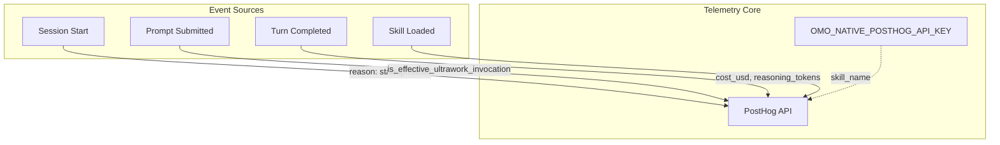
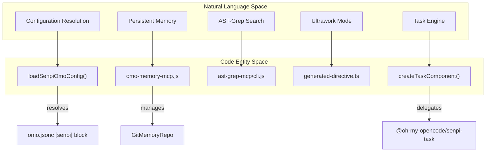

# Senpi (omo-senpi) Adapter

Relevant source files

The following files were used as context for generating this wiki page:

- [.agents/AGENTS.md](https://github.com/code-yeongyu/oh-my-openagent/blob/HEAD/.agents/AGENTS.md)
- [.omo/evidence/20260730-senpi-task-padding/green-prompt.txt](https://github.com/code-yeongyu/oh-my-openagent/blob/HEAD/.omo/evidence/20260730-senpi-task-padding/green-prompt.txt)
- [.omo/evidence/20260730-senpi-task-padding/red-prompt.txt](https://github.com/code-yeongyu/oh-my-openagent/blob/HEAD/.omo/evidence/20260730-senpi-task-padding/red-prompt.txt)
- [.omo/evidence/20260809-omo-ai-beta-release/task-2.txt](https://github.com/code-yeongyu/oh-my-openagent/blob/HEAD/.omo/evidence/20260809-omo-ai-beta-release/task-2.txt)
- [.omo/evidence/20260810-omo-native-telemetry/f1-fixes.md](https://github.com/code-yeongyu/oh-my-openagent/blob/HEAD/.omo/evidence/20260810-omo-native-telemetry/f1-fixes.md)
- [.omo/evidence/20260810-omo-native-telemetry/task-5.md](https://github.com/code-yeongyu/oh-my-openagent/blob/HEAD/.omo/evidence/20260810-omo-native-telemetry/task-5.md)
- [.omo/evidence/20260810-windows-root-ci-baseline/windows-round3.txt](https://github.com/code-yeongyu/oh-my-openagent/blob/HEAD/.omo/evidence/20260810-windows-root-ci-baseline/windows-round3.txt)
- [.omo/evidence/20260811-beta-6-release-state-fix/README.md](https://github.com/code-yeongyu/oh-my-openagent/blob/HEAD/.omo/evidence/20260811-beta-6-release-state-fix/README.md)
- [.omo/evidence/20260811-omo-native-geoip-on/fix.md](https://github.com/code-yeongyu/oh-my-openagent/blob/HEAD/.omo/evidence/20260811-omo-native-geoip-on/fix.md)
- [.opencode/AGENTS.md](https://github.com/code-yeongyu/oh-my-openagent/blob/HEAD/.opencode/AGENTS.md)
- [assets/omo.schema.json](https://github.com/code-yeongyu/oh-my-openagent/blob/HEAD/assets/omo.schema.json)
- [docs/AGENTS.md](https://github.com/code-yeongyu/oh-my-openagent/blob/HEAD/docs/AGENTS.md)
- [docs/guide/senpi-task.md](https://github.com/code-yeongyu/oh-my-openagent/blob/HEAD/docs/guide/senpi-task.md)
- [docs/reference/omo-json.md](https://github.com/code-yeongyu/oh-my-openagent/blob/HEAD/docs/reference/omo-json.md)
- [docs/reference/senpi-telemetry.md](https://github.com/code-yeongyu/oh-my-openagent/blob/HEAD/docs/reference/senpi-telemetry.md)
- [packages/memory-core/src/locks/acquire.ts](https://github.com/code-yeongyu/oh-my-openagent/blob/HEAD/packages/memory-core/src/locks/acquire.ts)
- [packages/model-core/AGENTS.md](https://github.com/code-yeongyu/oh-my-openagent/blob/HEAD/packages/model-core/AGENTS.md)
- [packages/omo-codex/plugin/components/start-work-continuation/AGENTS.md](https://github.com/code-yeongyu/oh-my-openagent/blob/HEAD/packages/omo-codex/plugin/components/start-work-continuation/AGENTS.md)
- [packages/omo-config-core/AGENTS.md](https://github.com/code-yeongyu/oh-my-openagent/blob/HEAD/packages/omo-config-core/AGENTS.md)
- [packages/omo-opencode/src/agents/hephaestus/AGENTS.md](https://github.com/code-yeongyu/oh-my-openagent/blob/HEAD/packages/omo-opencode/src/agents/hephaestus/AGENTS.md)
- [packages/omo-opencode/src/cli/doctor/AGENTS.md](https://github.com/code-yeongyu/oh-my-openagent/blob/HEAD/packages/omo-opencode/src/cli/doctor/AGENTS.md)
- [packages/omo-opencode/src/config/schema/categories.ts](https://github.com/code-yeongyu/oh-my-openagent/blob/HEAD/packages/omo-opencode/src/config/schema/categories.ts)
- [packages/omo-senpi/.gitignore](https://github.com/code-yeongyu/oh-my-openagent/blob/HEAD/packages/omo-senpi/.gitignore)
- [packages/omo-senpi/AGENTS.md](https://github.com/code-yeongyu/oh-my-openagent/blob/HEAD/packages/omo-senpi/AGENTS.md)
- [packages/omo-senpi/plugin/LICENSE](https://github.com/code-yeongyu/oh-my-openagent/blob/HEAD/packages/omo-senpi/plugin/LICENSE)
- [packages/omo-senpi/plugin/NOTICE](https://github.com/code-yeongyu/oh-my-openagent/blob/HEAD/packages/omo-senpi/plugin/NOTICE)
- [packages/omo-senpi/plugin/README.md](https://github.com/code-yeongyu/oh-my-openagent/blob/HEAD/packages/omo-senpi/plugin/README.md)
- [packages/omo-senpi/plugin/extensions/omo-init-deep-advisor.js](https://github.com/code-yeongyu/oh-my-openagent/blob/HEAD/packages/omo-senpi/plugin/extensions/omo-init-deep-advisor.js)
- [packages/omo-senpi/plugin/extensions/omo-member.js](https://github.com/code-yeongyu/oh-my-openagent/blob/HEAD/packages/omo-senpi/plugin/extensions/omo-member.js)
- [packages/omo-senpi/plugin/extensions/omo-memory-mcp.js](https://github.com/code-yeongyu/oh-my-openagent/blob/HEAD/packages/omo-senpi/plugin/extensions/omo-memory-mcp.js)
- [packages/omo-senpi/plugin/extensions/omo.js](https://github.com/code-yeongyu/oh-my-openagent/blob/HEAD/packages/omo-senpi/plugin/extensions/omo.js)
- [packages/omo-senpi/plugin/scripts/build-extension.mjs](https://github.com/code-yeongyu/oh-my-openagent/blob/HEAD/packages/omo-senpi/plugin/scripts/build-extension.mjs)
- [packages/omo-senpi/plugin/scripts/build-extension.test.mjs](https://github.com/code-yeongyu/oh-my-openagent/blob/HEAD/packages/omo-senpi/plugin/scripts/build-extension.test.mjs)
- [packages/omo-senpi/plugin/scripts/build-install.mjs](https://github.com/code-yeongyu/oh-my-openagent/blob/HEAD/packages/omo-senpi/plugin/scripts/build-install.mjs)
- [packages/omo-senpi/plugin/scripts/install.mjs](https://github.com/code-yeongyu/oh-my-openagent/blob/HEAD/packages/omo-senpi/plugin/scripts/install.mjs)
- [packages/omo-senpi/plugin/scripts/native-skill-sources.mjs](https://github.com/code-yeongyu/oh-my-openagent/blob/HEAD/packages/omo-senpi/plugin/scripts/native-skill-sources.mjs)
- [packages/omo-senpi/plugin/scripts/native-skill-sources.test.mjs](https://github.com/code-yeongyu/oh-my-openagent/blob/HEAD/packages/omo-senpi/plugin/scripts/native-skill-sources.test.mjs)
- [packages/omo-senpi/plugin/scripts/senpi-compatibility-guidance.mjs](https://github.com/code-yeongyu/oh-my-openagent/blob/HEAD/packages/omo-senpi/plugin/scripts/senpi-compatibility-guidance.mjs)
- [packages/omo-senpi/plugin/scripts/senpi-compatibility-guidance.test.mjs](https://github.com/code-yeongyu/oh-my-openagent/blob/HEAD/packages/omo-senpi/plugin/scripts/senpi-compatibility-guidance.test.mjs)
- [packages/omo-senpi/plugin/scripts/stage-agent-toolkit.mjs](https://github.com/code-yeongyu/oh-my-openagent/blob/HEAD/packages/omo-senpi/plugin/scripts/stage-agent-toolkit.mjs)
- [packages/omo-senpi/plugin/scripts/stage-agent-toolkit.test.mjs](https://github.com/code-yeongyu/oh-my-openagent/blob/HEAD/packages/omo-senpi/plugin/scripts/stage-agent-toolkit.test.mjs)
- [packages/omo-senpi/plugin/scripts/stage-ast-grep-mcp-runtime.mjs](https://github.com/code-yeongyu/oh-my-openagent/blob/HEAD/packages/omo-senpi/plugin/scripts/stage-ast-grep-mcp-runtime.mjs)
- [packages/omo-senpi/plugin/scripts/stage-lsp-daemon-runtime.d.mts](https://github.com/code-yeongyu/oh-my-openagent/blob/HEAD/packages/omo-senpi/plugin/scripts/stage-lsp-daemon-runtime.d.mts)
- [packages/omo-senpi/plugin/scripts/stage-lsp-daemon-runtime.mjs](https://github.com/code-yeongyu/oh-my-openagent/blob/HEAD/packages/omo-senpi/plugin/scripts/stage-lsp-daemon-runtime.mjs)
- [packages/omo-senpi/plugin/scripts/sync-skills.mjs](https://github.com/code-yeongyu/oh-my-openagent/blob/HEAD/packages/omo-senpi/plugin/scripts/sync-skills.mjs)
- [packages/omo-senpi/plugin/skills/onboarding/SKILL.md](https://github.com/code-yeongyu/oh-my-openagent/blob/HEAD/packages/omo-senpi/plugin/skills/onboarding/SKILL.md)
- [packages/omo-senpi/scripts/qa/lsp-e2e.mjs](https://github.com/code-yeongyu/oh-my-openagent/blob/HEAD/packages/omo-senpi/scripts/qa/lsp-e2e.mjs)
- [packages/omo-senpi/skills/hyperplan/SKILL.md](https://github.com/code-yeongyu/oh-my-openagent/blob/HEAD/packages/omo-senpi/skills/hyperplan/SKILL.md)
- [packages/omo-senpi/skills/onboarding/SKILL.md](https://github.com/code-yeongyu/oh-my-openagent/blob/HEAD/packages/omo-senpi/skills/onboarding/SKILL.md)
- [packages/omo-senpi/skills/onboarding/qa-savings-fixture.sh](https://github.com/code-yeongyu/oh-my-openagent/blob/HEAD/packages/omo-senpi/skills/onboarding/qa-savings-fixture.sh)
- [packages/omo-senpi/src/components/init-deep-advisor/component.test-support.ts](https://github.com/code-yeongyu/oh-my-openagent/blob/HEAD/packages/omo-senpi/src/components/init-deep-advisor/component.test-support.ts)
- [packages/omo-senpi/src/components/init-deep-advisor/component.test.ts](https://github.com/code-yeongyu/oh-my-openagent/blob/HEAD/packages/omo-senpi/src/components/init-deep-advisor/component.test.ts)
- [packages/omo-senpi/src/components/init-deep-advisor/component.ts](https://github.com/code-yeongyu/oh-my-openagent/blob/HEAD/packages/omo-senpi/src/components/init-deep-advisor/component.ts)
- [packages/omo-senpi/src/components/init-deep-advisor/eligibility.ts](https://github.com/code-yeongyu/oh-my-openagent/blob/HEAD/packages/omo-senpi/src/components/init-deep-advisor/eligibility.ts)
- [packages/omo-senpi/src/components/init-deep-advisor/index.ts](https://github.com/code-yeongyu/oh-my-openagent/blob/HEAD/packages/omo-senpi/src/components/init-deep-advisor/index.ts)
- [packages/omo-senpi/src/components/init-deep-advisor/init-deep-pre-amendment.md](https://github.com/code-yeongyu/oh-my-openagent/blob/HEAD/packages/omo-senpi/src/components/init-deep-advisor/init-deep-pre-amendment.md)
- [packages/omo-senpi/src/components/init-deep-advisor/proposed-data.ts](https://github.com/code-yeongyu/oh-my-openagent/blob/HEAD/packages/omo-senpi/src/components/init-deep-advisor/proposed-data.ts)
- [packages/omo-senpi/src/components/init-deep-advisor/runtime.ts](https://github.com/code-yeongyu/oh-my-openagent/blob/HEAD/packages/omo-senpi/src/components/init-deep-advisor/runtime.ts)
- [packages/omo-senpi/src/components/memory/tools.test.ts](https://github.com/code-yeongyu/oh-my-openagent/blob/HEAD/packages/omo-senpi/src/components/memory/tools.test.ts)
- [packages/omo-senpi/src/components/task/usage-guidance.test.ts](https://github.com/code-yeongyu/oh-my-openagent/blob/HEAD/packages/omo-senpi/src/components/task/usage-guidance.test.ts)
- [packages/omo-senpi/src/components/task/usage-guidance.ts](https://github.com/code-yeongyu/oh-my-openagent/blob/HEAD/packages/omo-senpi/src/components/task/usage-guidance.ts)
- [packages/omo-senpi/src/components/telemetry/omo-native-component.ts](https://github.com/code-yeongyu/oh-my-openagent/blob/HEAD/packages/omo-senpi/src/components/telemetry/omo-native-component.ts)
- [packages/omo-senpi/src/components/telemetry/omo-native-notice.test.ts](https://github.com/code-yeongyu/oh-my-openagent/blob/HEAD/packages/omo-senpi/src/components/telemetry/omo-native-notice.test.ts)
- [packages/omo-senpi/src/components/telemetry/product-identity.test.ts](https://github.com/code-yeongyu/oh-my-openagent/blob/HEAD/packages/omo-senpi/src/components/telemetry/product-identity.test.ts)
- [packages/omo-senpi/src/components/telemetry/product-identity.ts](https://github.com/code-yeongyu/oh-my-openagent/blob/HEAD/packages/omo-senpi/src/components/telemetry/product-identity.ts)
- [packages/omo-senpi/src/components/telemetry/schema-doc.test.ts](https://github.com/code-yeongyu/oh-my-openagent/blob/HEAD/packages/omo-senpi/src/components/telemetry/schema-doc.test.ts)
- [packages/omo-senpi/src/extension/index.test.ts](https://github.com/code-yeongyu/oh-my-openagent/blob/HEAD/packages/omo-senpi/src/extension/index.test.ts)
- [packages/omo-senpi/src/extension/index.ts](https://github.com/code-yeongyu/oh-my-openagent/blob/HEAD/packages/omo-senpi/src/extension/index.ts)
- [packages/omo-senpi/src/install/cli-local.test.ts](https://github.com/code-yeongyu/oh-my-openagent/blob/HEAD/packages/omo-senpi/src/install/cli-local.test.ts)
- [packages/omo-senpi/src/install/install-senpi-refresh.test.ts](https://github.com/code-yeongyu/oh-my-openagent/blob/HEAD/packages/omo-senpi/src/install/install-senpi-refresh.test.ts)
- [packages/omo-senpi/src/install/install-senpi.test.ts](https://github.com/code-yeongyu/oh-my-openagent/blob/HEAD/packages/omo-senpi/src/install/install-senpi.test.ts)
- [packages/omo-senpi/src/install/install-senpi.ts](https://github.com/code-yeongyu/oh-my-openagent/blob/HEAD/packages/omo-senpi/src/install/install-senpi.ts)
- [packages/omo-senpi/src/omo-native-capture-path.audit.test.ts](https://github.com/code-yeongyu/oh-my-openagent/blob/HEAD/packages/omo-senpi/src/omo-native-capture-path.audit.test.ts)
- [packages/omo-senpi/src/plugin-manifest.test.ts](https://github.com/code-yeongyu/oh-my-openagent/blob/HEAD/packages/omo-senpi/src/plugin-manifest.test.ts)
- [packages/omo-senpi/src/skills-sync.test.ts](https://github.com/code-yeongyu/oh-my-openagent/blob/HEAD/packages/omo-senpi/src/skills-sync.test.ts)
- [packages/senpi-task/AGENTS.md](https://github.com/code-yeongyu/oh-my-openagent/blob/HEAD/packages/senpi-task/AGENTS.md)
- [packages/senpi-task/src/tools/task/result-details.test.ts](https://github.com/code-yeongyu/oh-my-openagent/blob/HEAD/packages/senpi-task/src/tools/task/result-details.test.ts)
- [packages/senpi-task/src/tools/task/result-details.ts](https://github.com/code-yeongyu/oh-my-openagent/blob/HEAD/packages/senpi-task/src/tools/task/result-details.ts)
- [packages/shared-skills/AGENTS.md](https://github.com/code-yeongyu/oh-my-openagent/blob/HEAD/packages/shared-skills/AGENTS.md)
- [packages/shared-skills/skills/ultimate-browsing/engine/AGENTS.md](https://github.com/code-yeongyu/oh-my-openagent/blob/HEAD/packages/shared-skills/skills/ultimate-browsing/engine/AGENTS.md)
- [script/AGENTS.md](https://github.com/code-yeongyu/oh-my-openagent/blob/HEAD/script/AGENTS.md)
- [script/stage-agent-toolkit-install.test.ts](https://github.com/code-yeongyu/oh-my-openagent/blob/HEAD/script/stage-agent-toolkit-install.test.ts)
- [script/telemetry-schema-block.mjs](https://github.com/code-yeongyu/oh-my-openagent/blob/HEAD/script/telemetry-schema-block.mjs)

The `omo-senpi` adapter is a native TypeScript extension adapter for **Senpi/Pi**, providing a specialized bridge between the oh-my-openagent core logic and the Senpi runtime environment. Unlike the `omo-opencode` or `omo-codex` adapters which target CLI or marketplace-based platforms, `omo-senpi` is designed as a local-path Pi package that integrates directly with Senpi's `ExtensionAPI` [packages/omo-senpi/plugin/extensions/omo.js:2-2](https://github.com/code-yeongyu/oh-my-openagent/blob/HEAD/packages/omo-senpi/plugin/extensions/omo.js#L2).

## Overview and Purpose

The adapter functions as a composition layer that wires harness-neutral core packages into the Senpi lifecycle [packages/omo-senpi/AGENTS.md:12-12](https://github.com/code-yeongyu/oh-my-openagent/blob/HEAD/packages/omo-senpi/AGENTS.md#L12). It is strictly adapter-only; while it depends on core packages like `telemetry-core` and the Senpi-coupled `senpi-task` engine, these core packages remain agnostic of Senpi-specific types [packages/omo-senpi/AGENTS.md:5-5](https://github.com/code-yeongyu/oh-my-openagent/blob/HEAD/packages/omo-senpi/AGENTS.md#L5).

### Key Differences from OpenCode/Codex
- **ExtensionAPI Composition**: It uses a specialized composition layer to validate the required API surface and wire thirteen live components defensively [packages/omo-senpi/AGENTS.md:12-13](https://github.com/code-yeongyu/oh-my-openagent/blob/HEAD/packages/omo-senpi/AGENTS.md#L12-L13).
- **Local-Path Installation**: The implementation focuses on local installation via `SENPI_CODING_AGENT_DIR` or `~/.senpi/agent` settings rather than NPM or marketplace distribution [packages/omo-senpi/AGENTS.md:19-19](https://github.com/code-yeongyu/oh-my-openagent/blob/HEAD/packages/omo-senpi/AGENTS.md#L19), [packages/omo-senpi/plugin/scripts/install.mjs:138-141](https://github.com/code-yeongyu/oh-my-openagent/blob/HEAD/packages/omo-senpi/plugin/scripts/install.mjs#L138-L141).
- **Process Hygiene**: Includes specialized cleanup logic for CodeGraph and LSP daemons, ensuring environment sanity at session start [packages/omo-senpi/AGENTS.md:13-13](https://github.com/code-yeongyu/oh-my-openagent/blob/HEAD/packages/omo-senpi/AGENTS.md#L13).
- **Native Memory**: Integrates the `memory-core` package using a Git-backed markdown MemFS, specifically configured for the Senpi environment [packages/omo-senpi/AGENTS.md:13-13](https://github.com/code-yeongyu/oh-my-openagent/blob/HEAD/packages/omo-senpi/AGENTS.md#L13).

Sources: [packages/omo-senpi/AGENTS.md:1-25](https://github.com/code-yeongyu/oh-my-openagent/blob/HEAD/packages/omo-senpi/AGENTS.md#L1-L25), [packages/omo-senpi/plugin/extensions/omo.js:2-2](https://github.com/code-yeongyu/oh-my-openagent/blob/HEAD/packages/omo-senpi/plugin/extensions/omo.js#L2), [packages/omo-senpi/plugin/scripts/install.mjs:107-111](https://github.com/code-yeongyu/oh-my-openagent/blob/HEAD/packages/omo-senpi/plugin/scripts/install.mjs#L107-L111)

---

## Component Architecture

The adapter is composed of eleven core components (extended to thirteen in the latest composition) registered through the `createOmoSenpiComponents` factory [packages/omo-senpi/src/extension/index.ts:5-7](https://github.com/code-yeongyu/oh-my-openagent/blob/HEAD/packages/omo-senpi/src/extension/index.ts#L5-L7).

### 1. Config-Startup & Resolution
Runs the shared lock+journal migration engine (`runSenpiStartupMigration`) for legacy `oh-my-*` files before Senpi reads its unified configuration [packages/omo-senpi/AGENTS.md:23-23](https://github.com/code-yeongyu/oh-my-openagent/blob/HEAD/packages/omo-senpi/AGENTS.md#L23). It then loads the profile-selected `[senpi]` view through `config-resolution` [packages/omo-senpi/AGENTS.md:23-23](https://github.com/code-yeongyu/oh-my-openagent/blob/HEAD/packages/omo-senpi/AGENTS.md#L23).

### 2. Ultrawork
Injects the Senpi `ultrawork` directive as a hidden custom message (`pi.sendMessage({customType: 'omo-ultrawork:directive', ...})`) [packages/omo-senpi/AGENTS.md:25-25](https://github.com/code-yeongyu/oh-my-openagent/blob/HEAD/packages/omo-senpi/AGENTS.md#L25). It uses a `SessionArming` ledger to track activation status and appends a once-per-session `<system-reminder>` to the todo tool's first result to guide fan-out decisions [packages/omo-senpi/AGENTS.md:28-28](https://github.com/code-yeongyu/oh-my-openagent/blob/HEAD/packages/omo-senpi/AGENTS.md#L28).

### 3. Start-Work Continuation (Boulder)
Monitors `.omo/boulder.json` on `agent_end`. It uses `senpi:<session_id>` state produced by the `start-work` skill and suppresses repeats by a `work_id:updated_at:completed/total` signature [packages/omo-senpi/AGENTS.md:26-26](https://github.com/code-yeongyu/oh-my-openagent/blob/HEAD/packages/omo-senpi/AGENTS.md#L26).

### 4. ULW-Loop
Detects active `omo-agent-toolkit ulw-loop` state and injects continuation guidance when the cwd has an incomplete run [packages/omo-senpi/AGENTS.md:27-27](https://github.com/code-yeongyu/oh-my-openagent/blob/HEAD/packages/omo-senpi/AGENTS.md#L27).
- **Precedence**: Explicitly defers to `start-work-continuation` when boulder state is continuable for the same session [packages/omo-senpi/AGENTS.md:27-27](https://github.com/code-yeongyu/oh-my-openagent/blob/HEAD/packages/omo-senpi/AGENTS.md#L27).

### 5. Fallback-Architect
Monitors for model refusals (e.g., Anthropic Usage Policy rejections on `claude-fable-5`) [packages/omo-senpi/AGENTS.md:30-30](https://github.com/code-yeongyu/oh-my-openagent/blob/HEAD/packages/omo-senpi/AGENTS.md#L30).
- **Detection**: mirrors Senpi's `isClassifierRefusal` logic [packages/omo-senpi/AGENTS.md:30-30](https://github.com/code-yeongyu/oh-my-openagent/blob/HEAD/packages/omo-senpi/AGENTS.md#L30).
- **Notice**: Emits a visible `omo-fallback-architect:notice` custom message framing the switch as an upgrade where the fallback model drives execution while architectural reasoning remains reachable via the architect lane [packages/omo-senpi/AGENTS.md:30-30](https://github.com/code-yeongyu/oh-my-openagent/blob/HEAD/packages/omo-senpi/AGENTS.md#L30).

### 6. Task and Team Engine
Composes the task engine over `@oh-my-opencode/senpi-task`. It manages task status transitions and coordination between specialists [packages/omo-senpi/AGENTS.md:13-13](https://github.com/code-yeongyu/oh-my-openagent/blob/HEAD/packages/omo-senpi/AGENTS.md#L13).

### 7. Telemetry (OMO Native)
Controls product telemetry in Senpi. It is enabled by default (`telemetry.enabled: true`) and uses a specific PostHog API key for OMO Native [packages/omo-senpi/src/components/telemetry/product-identity.ts:14-14](https://github.com/code-yeongyu/oh-my-openagent/blob/HEAD/packages/omo-senpi/src/components/telemetry/product-identity.ts#L14), [docs/reference/omo-json.md:121-124](https://github.com/code-yeongyu/oh-my-openagent/blob/HEAD/docs/reference/omo-json.md#L121-L124).

Sources: [packages/omo-senpi/AGENTS.md:23-30](https://github.com/code-yeongyu/oh-my-openagent/blob/HEAD/packages/omo-senpi/AGENTS.md#L23-L30), [packages/omo-senpi/src/extension/index.ts:1-7](https://github.com/code-yeongyu/oh-my-openagent/blob/HEAD/packages/omo-senpi/src/extension/index.ts#L1-L7), [docs/reference/omo-json.md:103-103](https://github.com/code-yeongyu/oh-my-openagent/blob/HEAD/docs/reference/omo-json.md#L103)

---

## Data Flow: Native Telemetry and Skill Sync

The adapter maintains strict telemetry schemas and a specialized skill adaptation pipeline to ensure shared skills function correctly within the Senpi tool surface.

### Telemetry Event Flow

Sources: [packages/omo-senpi/src/components/telemetry/product-identity.ts:68-135](https://github.com/code-yeongyu/oh-my-openagent/blob/HEAD/packages/omo-senpi/src/components/telemetry/product-identity.ts#L68-L135), [docs/reference/omo-json.md:121-124](https://github.com/code-yeongyu/oh-my-openagent/blob/HEAD/docs/reference/omo-json.md#L121-L124)

### Skill Sync Pipeline
The `sync-skills.mjs` script performs "Tier 1 Adaptation" on shared skills [packages/omo-senpi/plugin/scripts/sync-skills.mjs:108-110](https://github.com/code-yeongyu/oh-my-openagent/blob/HEAD/packages/omo-senpi/plugin/scripts/sync-skills.mjs#L108-L110).
- **Naming Rewrite**: Converts "Codex" or "OpenCode" mentions to "omo-senpi" [packages/omo-senpi/plugin/scripts/sync-skills.mjs:48-58](https://github.com/code-yeongyu/oh-my-openagent/blob/HEAD/packages/omo-senpi/plugin/scripts/sync-skills.mjs#L48-L58).
- **Guidance Stripping**: Removes sections specific to Codex tool mapping or multi-agent orchestration [packages/omo-senpi/plugin/scripts/sync-skills.mjs:24-32](https://github.com/code-yeongyu/oh-my-openagent/blob/HEAD/packages/omo-senpi/plugin/scripts/sync-skills.mjs#L24-L32).
- **Compatibility Section**: For shared skills, it inserts a "Senpi Harness Tool Compatibility" section that translates OpenCode tools to their Senpi equivalents [packages/omo-senpi/src/skills-sync.test.ts:173-180](https://github.com/code-yeongyu/oh-my-openagent/blob/HEAD/packages/omo-senpi/src/skills-sync.test.ts#L173-L180).

Sources: [packages/omo-senpi/plugin/scripts/sync-skills.mjs:48-110](https://github.com/code-yeongyu/oh-my-openagent/blob/HEAD/packages/omo-senpi/plugin/scripts/sync-skills.mjs#L48-L110), [packages/omo-senpi/src/skills-sync.test.ts:157-180](https://github.com/code-yeongyu/oh-my-openagent/blob/HEAD/packages/omo-senpi/src/skills-sync.test.ts#L157-L180)

---

## Code Entity Map

### Entity Mapping: Adapter to Core

Sources: [packages/omo-senpi/AGENTS.md:13-25](https://github.com/code-yeongyu/oh-my-openagent/blob/HEAD/packages/omo-senpi/AGENTS.md#L13-L25), [packages/omo-senpi/plugin/extensions/omo-memory-mcp.js:1-10](https://github.com/code-yeongyu/oh-my-openagent/blob/HEAD/packages/omo-senpi/plugin/extensions/omo-memory-mcp.js#L1-L10), [docs/reference/omo-json.md:41-43](https://github.com/code-yeongyu/oh-my-openagent/blob/HEAD/docs/reference/omo-json.md#L41-L43)

### Companion Packages
- **pi-goal**: Persistent per-thread goal tracking. The `omo-senpi` installer identifies legacy versions of this package as "shadows" and removes them from Senpi settings to avoid conflicts [packages/omo-senpi/plugin/scripts/install.mjs:108-111](https://github.com/code-yeongyu/oh-my-openagent/blob/HEAD/packages/omo-senpi/plugin/scripts/install.mjs#L108-L111).
- **pi-webfetch**: Web fetch extension managed as a harness companion. The installer ensures only the current version is registered in the Senpi environment [packages/omo-senpi/plugin/scripts/install.mjs:108-111](https://github.com/code-yeongyu/oh-my-openagent/blob/HEAD/packages/omo-senpi/plugin/scripts/install.mjs#L108-L111).
- **omo-native (Native CLI)**: The `omo-ai` CLI launcher for Senpi. It sets `OMO_NATIVE="1"` and `SENPI_BRAND` to ensure the environment correctly identifies as the native OMO harness [packages/omo-senpi/plugin/scripts/install.mjs:53-53](https://github.com/code-yeongyu/oh-my-openagent/blob/HEAD/packages/omo-senpi/plugin/scripts/install.mjs#L53).

Sources: [packages/omo-senpi/plugin/scripts/install.mjs:19-53](https://github.com/code-yeongyu/oh-my-openagent/blob/HEAD/packages/omo-senpi/plugin/scripts/install.mjs#L19-L53), [packages/omo-senpi/plugin/scripts/install.mjs:107-111](https://github.com/code-yeongyu/oh-my-openagent/blob/HEAD/packages/omo-senpi/plugin/scripts/install.mjs#L107-L111)