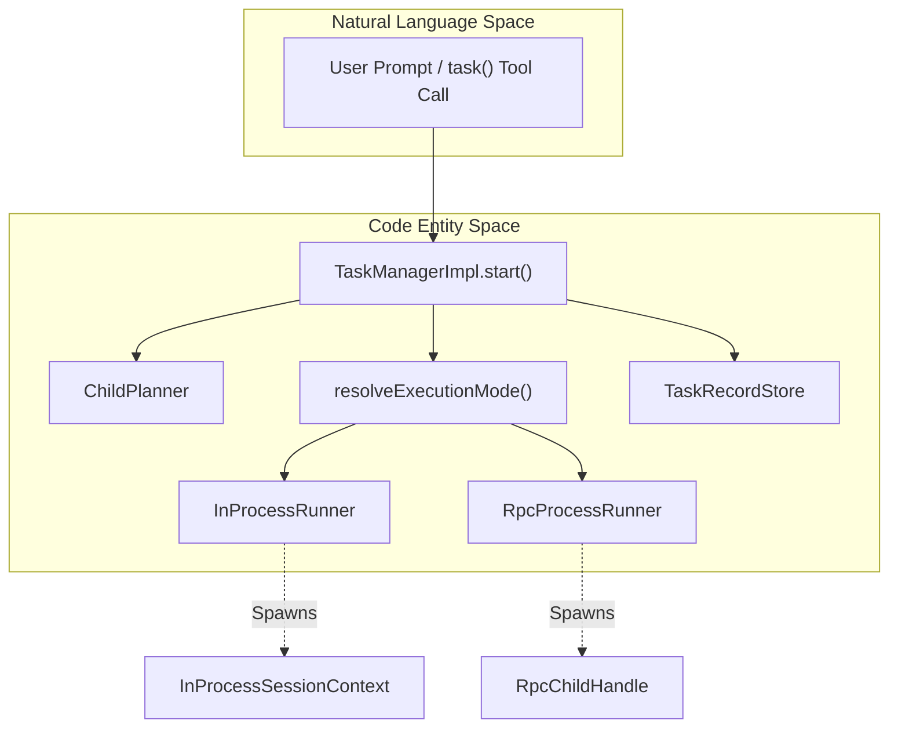
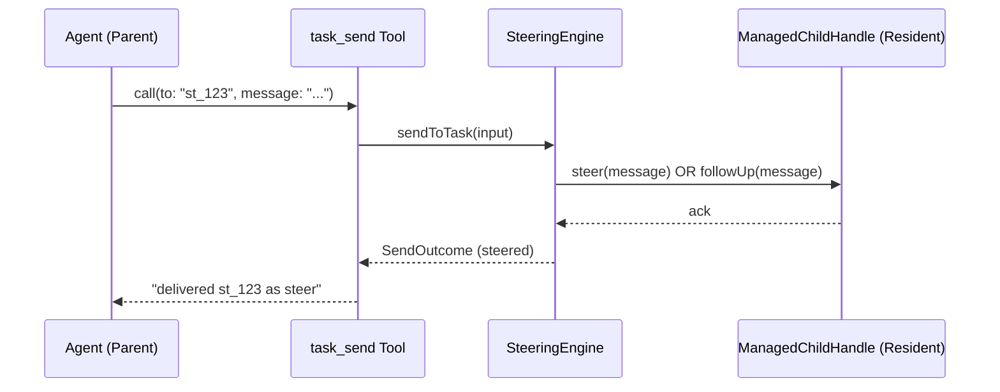
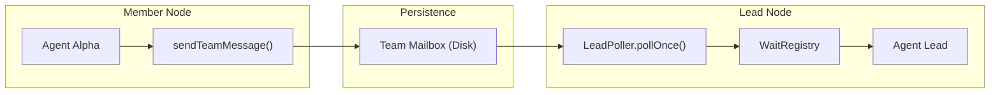

# Senpi Task Engine

Relevant source files

The following files were used as context for generating this wiki page:

- [.omo/evidence/20260810-senpi-extension-node-load/node-load-qa.sh](https://github.com/code-yeongyu/oh-my-openagent/blob/HEAD/.omo/evidence/20260810-senpi-extension-node-load/node-load-qa.sh)
- [.omo/evidence/20260810-senpi-extension-node-load/qa-output.txt](https://github.com/code-yeongyu/oh-my-openagent/blob/HEAD/.omo/evidence/20260810-senpi-extension-node-load/qa-output.txt)
- [.omo/evidence/task-13-subagent-session-resume-revival.txt](https://github.com/code-yeongyu/oh-my-openagent/blob/HEAD/.omo/evidence/task-13-subagent-session-resume-revival.txt)
- [.omo/evidence/task-16-subagent-session-resume-revival.txt](https://github.com/code-yeongyu/oh-my-openagent/blob/HEAD/.omo/evidence/task-16-subagent-session-resume-revival.txt)
- [changes.md](https://github.com/code-yeongyu/oh-my-openagent/blob/HEAD/changes.md)
- [packages/memory-core/src/reflection/assets/assets.ts](https://github.com/code-yeongyu/oh-my-openagent/blob/HEAD/packages/memory-core/src/reflection/assets/assets.ts)
- [packages/omo-senpi/changes.md](https://github.com/code-yeongyu/oh-my-openagent/blob/HEAD/packages/omo-senpi/changes.md)
- [packages/omo-senpi/scripts/qa/task-fallback-notification.mjs](https://github.com/code-yeongyu/oh-my-openagent/blob/HEAD/packages/omo-senpi/scripts/qa/task-fallback-notification.mjs)
- [packages/omo-senpi/scripts/qa/task-parent-restart-e2e.mjs](https://github.com/code-yeongyu/oh-my-openagent/blob/HEAD/packages/omo-senpi/scripts/qa/task-parent-restart-e2e.mjs)
- [packages/omo-senpi/scripts/qa/task-parent-restart-runtime.mjs](https://github.com/code-yeongyu/oh-my-openagent/blob/HEAD/packages/omo-senpi/scripts/qa/task-parent-restart-runtime.mjs)
- [packages/omo-senpi/scripts/qa/task-stats-renderer.mjs](https://github.com/code-yeongyu/oh-my-openagent/blob/HEAD/packages/omo-senpi/scripts/qa/task-stats-renderer.mjs)
- [packages/omo-senpi/src/components/task/completion-bridge.ts](https://github.com/code-yeongyu/oh-my-openagent/blob/HEAD/packages/omo-senpi/src/components/task/completion-bridge.ts)
- [packages/omo-senpi/src/components/task/engine.ts](https://github.com/code-yeongyu/oh-my-openagent/blob/HEAD/packages/omo-senpi/src/components/task/engine.ts)
- [packages/omo-senpi/src/components/task/event-bridge.ts](https://github.com/code-yeongyu/oh-my-openagent/blob/HEAD/packages/omo-senpi/src/components/task/event-bridge.ts)
- [packages/omo-senpi/src/components/task/index.test.ts](https://github.com/code-yeongyu/oh-my-openagent/blob/HEAD/packages/omo-senpi/src/components/task/index.test.ts)
- [packages/omo-senpi/src/components/task/index.ts](https://github.com/code-yeongyu/oh-my-openagent/blob/HEAD/packages/omo-senpi/src/components/task/index.ts)
- [packages/omo-senpi/src/components/task/runtime-context.ts](https://github.com/code-yeongyu/oh-my-openagent/blob/HEAD/packages/omo-senpi/src/components/task/runtime-context.ts)
- [packages/omo-senpi/src/components/task/session-cwd.test.ts](https://github.com/code-yeongyu/oh-my-openagent/blob/HEAD/packages/omo-senpi/src/components/task/session-cwd.test.ts)
- [packages/omo-senpi/src/components/task/skill-invocation-tracker-references.test.ts](https://github.com/code-yeongyu/oh-my-openagent/blob/HEAD/packages/omo-senpi/src/components/task/skill-invocation-tracker-references.test.ts)
- [packages/omo-senpi/src/components/task/skill-invocation-tracker.test.ts](https://github.com/code-yeongyu/oh-my-openagent/blob/HEAD/packages/omo-senpi/src/components/task/skill-invocation-tracker.test.ts)
- [packages/omo-senpi/src/components/task/skill-invocation-tracker.ts](https://github.com/code-yeongyu/oh-my-openagent/blob/HEAD/packages/omo-senpi/src/components/task/skill-invocation-tracker.ts)
- [packages/omo-senpi/src/components/task/store-mutation-observer.ts](https://github.com/code-yeongyu/oh-my-openagent/blob/HEAD/packages/omo-senpi/src/components/task/store-mutation-observer.ts)
- [packages/omo-senpi/src/extension-node-runtime-audit.test.ts](https://github.com/code-yeongyu/oh-my-openagent/blob/HEAD/packages/omo-senpi/src/extension-node-runtime-audit.test.ts)
- [packages/omo-senpi/src/extension/compose.test.ts](https://github.com/code-yeongyu/oh-my-openagent/blob/HEAD/packages/omo-senpi/src/extension/compose.test.ts)
- [packages/omo-senpi/src/extension/types.ts](https://github.com/code-yeongyu/oh-my-openagent/blob/HEAD/packages/omo-senpi/src/extension/types.ts)
- [packages/omo-senpi/src/install/senpi-settings.ts](https://github.com/code-yeongyu/oh-my-openagent/blob/HEAD/packages/omo-senpi/src/install/senpi-settings.ts)
- [packages/omo-senpi/test-support/fake-extension-api.ts](https://github.com/code-yeongyu/oh-my-openagent/blob/HEAD/packages/omo-senpi/test-support/fake-extension-api.ts)
- [packages/senpi-task/changes.md](https://github.com/code-yeongyu/oh-my-openagent/blob/HEAD/packages/senpi-task/changes.md)
- [packages/senpi-task/src/agents/index.ts](https://github.com/code-yeongyu/oh-my-openagent/blob/HEAD/packages/senpi-task/src/agents/index.ts)
- [packages/senpi-task/src/agents/interaction-policy.test.ts](https://github.com/code-yeongyu/oh-my-openagent/blob/HEAD/packages/senpi-task/src/agents/interaction-policy.test.ts)
- [packages/senpi-task/src/agents/interaction-policy.ts](https://github.com/code-yeongyu/oh-my-openagent/blob/HEAD/packages/senpi-task/src/agents/interaction-policy.ts)
- [packages/senpi-task/src/agents/invocation-guard.test.ts](https://github.com/code-yeongyu/oh-my-openagent/blob/HEAD/packages/senpi-task/src/agents/invocation-guard.test.ts)
- [packages/senpi-task/src/agents/invocation-guard.ts](https://github.com/code-yeongyu/oh-my-openagent/blob/HEAD/packages/senpi-task/src/agents/invocation-guard.ts)
- [packages/senpi-task/src/completion.test.ts](https://github.com/code-yeongyu/oh-my-openagent/blob/HEAD/packages/senpi-task/src/completion.test.ts)
- [packages/senpi-task/src/completion/model-visibility.test.ts](https://github.com/code-yeongyu/oh-my-openagent/blob/HEAD/packages/senpi-task/src/completion/model-visibility.test.ts)
- [packages/senpi-task/src/index.ts](https://github.com/code-yeongyu/oh-my-openagent/blob/HEAD/packages/senpi-task/src/index.ts)
- [packages/senpi-task/src/lifecycle/__fixtures__/lifecycle-fakes.ts](https://github.com/code-yeongyu/oh-my-openagent/blob/HEAD/packages/senpi-task/src/lifecycle/__fixtures__/lifecycle-fakes.ts)
- [packages/senpi-task/src/lifecycle/__fixtures__/reconcile-race-worker.ts](https://github.com/code-yeongyu/oh-my-openagent/blob/HEAD/packages/senpi-task/src/lifecycle/__fixtures__/reconcile-race-worker.ts)
- [packages/senpi-task/src/lifecycle/context.ts](https://github.com/code-yeongyu/oh-my-openagent/blob/HEAD/packages/senpi-task/src/lifecycle/context.ts)
- [packages/senpi-task/src/lifecycle/create.ts](https://github.com/code-yeongyu/oh-my-openagent/blob/HEAD/packages/senpi-task/src/lifecycle/create.ts)
- [packages/senpi-task/src/lifecycle/destroy.test.ts](https://github.com/code-yeongyu/oh-my-openagent/blob/HEAD/packages/senpi-task/src/lifecycle/destroy.test.ts)
- [packages/senpi-task/src/lifecycle/destroy.ts](https://github.com/code-yeongyu/oh-my-openagent/blob/HEAD/packages/senpi-task/src/lifecycle/destroy.ts)
- [packages/senpi-task/src/lifecycle/index.ts](https://github.com/code-yeongyu/oh-my-openagent/blob/HEAD/packages/senpi-task/src/lifecycle/index.ts)
- [packages/senpi-task/src/lifecycle/port.ts](https://github.com/code-yeongyu/oh-my-openagent/blob/HEAD/packages/senpi-task/src/lifecycle/port.ts)
- [packages/senpi-task/src/lifecycle/reconcile-multi-session.test.ts](https://github.com/code-yeongyu/oh-my-openagent/blob/HEAD/packages/senpi-task/src/lifecycle/reconcile-multi-session.test.ts)
- [packages/senpi-task/src/lifecycle/reconcile-reclamation.ts](https://github.com/code-yeongyu/oh-my-openagent/blob/HEAD/packages/senpi-task/src/lifecycle/reconcile-reclamation.ts)
- [packages/senpi-task/src/lifecycle/reconcile-revival.test.ts](https://github.com/code-yeongyu/oh-my-openagent/blob/HEAD/packages/senpi-task/src/lifecycle/reconcile-revival.test.ts)
- [packages/senpi-task/src/lifecycle/reconcile-revival.ts](https://github.com/code-yeongyu/oh-my-openagent/blob/HEAD/packages/senpi-task/src/lifecycle/reconcile-revival.ts)
- [packages/senpi-task/src/lifecycle/reconcile.test.ts](https://github.com/code-yeongyu/oh-my-openagent/blob/HEAD/packages/senpi-task/src/lifecycle/reconcile.test.ts)
- [packages/senpi-task/src/lifecycle/reconcile.ts](https://github.com/code-yeongyu/oh-my-openagent/blob/HEAD/packages/senpi-task/src/lifecycle/reconcile.ts)
- [packages/senpi-task/src/lifecycle/residency.test.ts](https://github.com/code-yeongyu/oh-my-openagent/blob/HEAD/packages/senpi-task/src/lifecycle/residency.test.ts)
- [packages/senpi-task/src/lifecycle/residency.ts](https://github.com/code-yeongyu/oh-my-openagent/blob/HEAD/packages/senpi-task/src/lifecycle/residency.ts)
- [packages/senpi-task/src/lifecycle/shutdown.test.ts](https://github.com/code-yeongyu/oh-my-openagent/blob/HEAD/packages/senpi-task/src/lifecycle/shutdown.test.ts)
- [packages/senpi-task/src/lifecycle/shutdown.ts](https://github.com/code-yeongyu/oh-my-openagent/blob/HEAD/packages/senpi-task/src/lifecycle/shutdown.ts)
- [packages/senpi-task/src/lifecycle/ttl.test.ts](https://github.com/code-yeongyu/oh-my-openagent/blob/HEAD/packages/senpi-task/src/lifecycle/ttl.test.ts)
- [packages/senpi-task/src/lifecycle/ttl.ts](https://github.com/code-yeongyu/oh-my-openagent/blob/HEAD/packages/senpi-task/src/lifecycle/ttl.ts)
- [packages/senpi-task/src/lifecycle/types.ts](https://github.com/code-yeongyu/oh-my-openagent/blob/HEAD/packages/senpi-task/src/lifecycle/types.ts)
- [packages/senpi-task/src/manager/__fixtures__/manager-fakes.ts](https://github.com/code-yeongyu/oh-my-openagent/blob/HEAD/packages/senpi-task/src/manager/__fixtures__/manager-fakes.ts)
- [packages/senpi-task/src/manager/child-handle.ts](https://github.com/code-yeongyu/oh-my-openagent/blob/HEAD/packages/senpi-task/src/manager/child-handle.ts)
- [packages/senpi-task/src/manager/index.ts](https://github.com/code-yeongyu/oh-my-openagent/blob/HEAD/packages/senpi-task/src/manager/index.ts)
- [packages/senpi-task/src/manager/manager-fallback.test.ts](https://github.com/code-yeongyu/oh-my-openagent/blob/HEAD/packages/senpi-task/src/manager/manager-fallback.test.ts)
- [packages/senpi-task/src/manager/manager-helpers.ts](https://github.com/code-yeongyu/oh-my-openagent/blob/HEAD/packages/senpi-task/src/manager/manager-helpers.ts)
- [packages/senpi-task/src/manager/manager-hygiene.test.ts](https://github.com/code-yeongyu/oh-my-openagent/blob/HEAD/packages/senpi-task/src/manager/manager-hygiene.test.ts)
- [packages/senpi-task/src/manager/manager-respawn-spec.test.ts](https://github.com/code-yeongyu/oh-my-openagent/blob/HEAD/packages/senpi-task/src/manager/manager-respawn-spec.test.ts)
- [packages/senpi-task/src/manager/manager-respawn.ts](https://github.com/code-yeongyu/oh-my-openagent/blob/HEAD/packages/senpi-task/src/manager/manager-respawn.ts)
- [packages/senpi-task/src/manager/manager.test.ts](https://github.com/code-yeongyu/oh-my-openagent/blob/HEAD/packages/senpi-task/src/manager/manager.test.ts)
- [packages/senpi-task/src/manager/manager.ts](https://github.com/code-yeongyu/oh-my-openagent/blob/HEAD/packages/senpi-task/src/manager/manager.ts)
- [packages/senpi-task/src/manager/run-stats-wiring.test.ts](https://github.com/code-yeongyu/oh-my-openagent/blob/HEAD/packages/senpi-task/src/manager/run-stats-wiring.test.ts)
- [packages/senpi-task/src/manager/start-failure-security.test.ts](https://github.com/code-yeongyu/oh-my-openagent/blob/HEAD/packages/senpi-task/src/manager/start-failure-security.test.ts)
- [packages/senpi-task/src/manager/types.ts](https://github.com/code-yeongyu/oh-my-openagent/blob/HEAD/packages/senpi-task/src/manager/types.ts)
- [packages/senpi-task/src/run-stats-eval.test.ts](https://github.com/code-yeongyu/oh-my-openagent/blob/HEAD/packages/senpi-task/src/run-stats-eval.test.ts)
- [packages/senpi-task/src/run-stats.test.ts](https://github.com/code-yeongyu/oh-my-openagent/blob/HEAD/packages/senpi-task/src/run-stats.test.ts)
- [packages/senpi-task/src/run-stats.ts](https://github.com/code-yeongyu/oh-my-openagent/blob/HEAD/packages/senpi-task/src/run-stats.ts)
- [packages/senpi-task/src/runners/index.ts](https://github.com/code-yeongyu/oh-my-openagent/blob/HEAD/packages/senpi-task/src/runners/index.ts)
- [packages/senpi-task/src/runners/rpc-process.test.ts](https://github.com/code-yeongyu/oh-my-openagent/blob/HEAD/packages/senpi-task/src/runners/rpc-process.test.ts)
- [packages/senpi-task/src/runners/rpc-process.ts](https://github.com/code-yeongyu/oh-my-openagent/blob/HEAD/packages/senpi-task/src/runners/rpc-process.ts)
- [packages/senpi-task/src/runners/rpc/__fixtures__/fake-child.mjs](https://github.com/code-yeongyu/oh-my-openagent/blob/HEAD/packages/senpi-task/src/runners/rpc/__fixtures__/fake-child.mjs)
- [packages/senpi-task/src/runners/rpc/__fixtures__/spawn-fake.ts](https://github.com/code-yeongyu/oh-my-openagent/blob/HEAD/packages/senpi-task/src/runners/rpc/__fixtures__/spawn-fake.ts)
- [packages/senpi-task/src/runners/rpc/errors.ts](https://github.com/code-yeongyu/oh-my-openagent/blob/HEAD/packages/senpi-task/src/runners/rpc/errors.ts)
- [packages/senpi-task/src/runners/rpc/exit-mapping.test.ts](https://github.com/code-yeongyu/oh-my-openagent/blob/HEAD/packages/senpi-task/src/runners/rpc/exit-mapping.test.ts)
- [packages/senpi-task/src/runners/rpc/exit-mapping.ts](https://github.com/code-yeongyu/oh-my-openagent/blob/HEAD/packages/senpi-task/src/runners/rpc/exit-mapping.ts)
- [packages/senpi-task/src/runners/rpc/handle.ts](https://github.com/code-yeongyu/oh-my-openagent/blob/HEAD/packages/senpi-task/src/runners/rpc/handle.ts)
- [packages/senpi-task/src/runners/rpc/parent-extensions.test.ts](https://github.com/code-yeongyu/oh-my-openagent/blob/HEAD/packages/senpi-task/src/runners/rpc/parent-extensions.test.ts)
- [packages/senpi-task/src/runners/rpc/parent-extensions.ts](https://github.com/code-yeongyu/oh-my-openagent/blob/HEAD/packages/senpi-task/src/runners/rpc/parent-extensions.ts)
- [packages/senpi-task/src/runners/rpc/protocol-client.test.ts](https://github.com/code-yeongyu/oh-my-openagent/blob/HEAD/packages/senpi-task/src/runners/rpc/protocol-client.test.ts)
- [packages/senpi-task/src/runners/rpc/protocol-client.ts](https://github.com/code-yeongyu/oh-my-openagent/blob/HEAD/packages/senpi-task/src/runners/rpc/protocol-client.ts)
- [packages/senpi-task/src/runners/rpc/spawn-node-runtime.test.ts](https://github.com/code-yeongyu/oh-my-openagent/blob/HEAD/packages/senpi-task/src/runners/rpc/spawn-node-runtime.test.ts)
- [packages/senpi-task/src/runners/rpc/spawn.test.ts](https://github.com/code-yeongyu/oh-my-openagent/blob/HEAD/packages/senpi-task/src/runners/rpc/spawn.test.ts)
- [packages/senpi-task/src/runners/rpc/spawn.ts](https://github.com/code-yeongyu/oh-my-openagent/blob/HEAD/packages/senpi-task/src/runners/rpc/spawn.ts)
- [packages/senpi-task/src/runners/types.ts](https://github.com/code-yeongyu/oh-my-openagent/blob/HEAD/packages/senpi-task/src/runners/types.ts)
- [packages/senpi-task/src/senpi/thinking-level.ts](https://github.com/code-yeongyu/oh-my-openagent/blob/HEAD/packages/senpi-task/src/senpi/thinking-level.ts)
- [packages/senpi-task/src/state/record.ts](https://github.com/code-yeongyu/oh-my-openagent/blob/HEAD/packages/senpi-task/src/state/record.ts)
- [packages/senpi-task/src/state/resolved-reasoning.test.ts](https://github.com/code-yeongyu/oh-my-openagent/blob/HEAD/packages/senpi-task/src/state/resolved-reasoning.test.ts)
- [packages/senpi-task/src/state/run-stats-record.test.ts](https://github.com/code-yeongyu/oh-my-openagent/blob/HEAD/packages/senpi-task/src/state/run-stats-record.test.ts)
- [packages/senpi-task/src/state/types.ts](https://github.com/code-yeongyu/oh-my-openagent/blob/HEAD/packages/senpi-task/src/state/types.ts)
- [packages/senpi-task/src/steering/engine-one-shot.test.ts](https://github.com/code-yeongyu/oh-my-openagent/blob/HEAD/packages/senpi-task/src/steering/engine-one-shot.test.ts)
- [packages/senpi-task/src/store/record-parse-v1.test.ts](https://github.com/code-yeongyu/oh-my-openagent/blob/HEAD/packages/senpi-task/src/store/record-parse-v1.test.ts)
- [packages/senpi-task/src/store/record-parse.ts](https://github.com/code-yeongyu/oh-my-openagent/blob/HEAD/packages/senpi-task/src/store/record-parse.ts)
- [packages/senpi-task/src/store/record-store.test.ts](https://github.com/code-yeongyu/oh-my-openagent/blob/HEAD/packages/senpi-task/src/store/record-store.test.ts)
- [packages/senpi-task/src/store/record-store.ts](https://github.com/code-yeongyu/oh-my-openagent/blob/HEAD/packages/senpi-task/src/store/record-store.ts)
- [packages/senpi-task/src/store/types.ts](https://github.com/code-yeongyu/oh-my-openagent/blob/HEAD/packages/senpi-task/src/store/types.ts)
- [packages/senpi-task/src/team/import-discipline.test.ts](https://github.com/code-yeongyu/oh-my-openagent/blob/HEAD/packages/senpi-task/src/team/import-discipline.test.ts)
- [packages/senpi-task/src/team/index.ts](https://github.com/code-yeongyu/oh-my-openagent/blob/HEAD/packages/senpi-task/src/team/index.ts)
- [packages/senpi-task/src/team/messaging/index.ts](https://github.com/code-yeongyu/oh-my-openagent/blob/HEAD/packages/senpi-task/src/team/messaging/index.ts)
- [packages/senpi-task/src/tools/control/renderers-result.test.ts](https://github.com/code-yeongyu/oh-my-openagent/blob/HEAD/packages/senpi-task/src/tools/control/renderers-result.test.ts)
- [packages/senpi-task/src/tools/task/__fixtures__/task-tool-fakes.ts](https://github.com/code-yeongyu/oh-my-openagent/blob/HEAD/packages/senpi-task/src/tools/task/__fixtures__/task-tool-fakes.ts)
- [packages/senpi-task/src/tools/task/call-renderer.ts](https://github.com/code-yeongyu/oh-my-openagent/blob/HEAD/packages/senpi-task/src/tools/task/call-renderer.ts)
- [packages/senpi-task/src/tools/task/description-plan-gated.test.ts](https://github.com/code-yeongyu/oh-my-openagent/blob/HEAD/packages/senpi-task/src/tools/task/description-plan-gated.test.ts)
- [packages/senpi-task/src/tools/task/execute-invocation-guard.test.ts](https://github.com/code-yeongyu/oh-my-openagent/blob/HEAD/packages/senpi-task/src/tools/task/execute-invocation-guard.test.ts)
- [packages/senpi-task/src/tools/task/execute-plan-review-contract.test.ts](https://github.com/code-yeongyu/oh-my-openagent/blob/HEAD/packages/senpi-task/src/tools/task/execute-plan-review-contract.test.ts)
- [packages/senpi-task/src/tools/task/execute-progress.test.ts](https://github.com/code-yeongyu/oh-my-openagent/blob/HEAD/packages/senpi-task/src/tools/task/execute-progress.test.ts)
- [packages/senpi-task/src/tools/task/execute-spawn.test.ts](https://github.com/code-yeongyu/oh-my-openagent/blob/HEAD/packages/senpi-task/src/tools/task/execute-spawn.test.ts)
- [packages/senpi-task/src/tools/task/execute.ts](https://github.com/code-yeongyu/oh-my-openagent/blob/HEAD/packages/senpi-task/src/tools/task/execute.ts)
- [packages/senpi-task/src/tools/task/index.ts](https://github.com/code-yeongyu/oh-my-openagent/blob/HEAD/packages/senpi-task/src/tools/task/index.ts)
- [packages/senpi-task/src/tools/task/invocation-gate.ts](https://github.com/code-yeongyu/oh-my-openagent/blob/HEAD/packages/senpi-task/src/tools/task/invocation-gate.ts)
- [packages/senpi-task/src/tools/task/model-visibility.test.ts](https://github.com/code-yeongyu/oh-my-openagent/blob/HEAD/packages/senpi-task/src/tools/task/model-visibility.test.ts)
- [packages/senpi-task/src/tools/task/plan-review-contract.ts](https://github.com/code-yeongyu/oh-my-openagent/blob/HEAD/packages/senpi-task/src/tools/task/plan-review-contract.ts)
- [packages/senpi-task/src/tools/task/renderers.test.ts](https://github.com/code-yeongyu/oh-my-openagent/blob/HEAD/packages/senpi-task/src/tools/task/renderers.test.ts)
- [packages/senpi-task/src/tools/task/renderers.ts](https://github.com/code-yeongyu/oh-my-openagent/blob/HEAD/packages/senpi-task/src/tools/task/renderers.ts)
- [packages/senpi-task/src/tools/task/spawn-policy.ts](https://github.com/code-yeongyu/oh-my-openagent/blob/HEAD/packages/senpi-task/src/tools/task/spawn-policy.ts)
- [packages/senpi-task/src/tools/task/tool.test.ts](https://github.com/code-yeongyu/oh-my-openagent/blob/HEAD/packages/senpi-task/src/tools/task/tool.test.ts)
- [packages/senpi-task/src/tools/task/tool.ts](https://github.com/code-yeongyu/oh-my-openagent/blob/HEAD/packages/senpi-task/src/tools/task/tool.ts)
- [packages/senpi-task/src/tools/task/types.ts](https://github.com/code-yeongyu/oh-my-openagent/blob/HEAD/packages/senpi-task/src/tools/task/types.ts)

The `senpi-task` package provides the core orchestration logic for asynchronous and multi-agent tasks within the Senpi adapter. It manages the full lifecycle of background and foreground tasks, including concurrency control, cross-agent messaging, and steering.

## Task Lifecycle and Statuses

The engine tracks tasks through a state machine comprising seven distinct statuses. Transitions are managed via `transitionTaskRecord` [packages/senpi-task/src/index.ts:10](https://github.com/code-yeongyu/oh-my-openagent/blob/HEAD/packages/senpi-task/src/index.ts#L10). The status determines if a task is "messageable" (eligible for steering, revival, or follow-ups) [packages/senpi-task/src/state/types.ts:22](https://github.com/code-yeongyu/oh-my-openagent/blob/HEAD/packages/senpi-task/src/state/types.ts#L22).

| Status | Type | Description |
| :--- | :--- | :--- |
| `pending` | Active | Task is queued and waiting for a concurrency slot [packages/senpi-task/src/state/types.ts:2](https://github.com/code-yeongyu/oh-my-openagent/blob/HEAD/packages/senpi-task/src/state/types.ts#L2). |
| `running` | Active | Task has been launched and is currently executing [packages/senpi-task/src/state/types.ts:3](https://github.com/code-yeongyu/oh-my-openagent/blob/HEAD/packages/senpi-task/src/state/types.ts#L3). |
| `completed` | Terminal | Task finished successfully with a final response [packages/senpi-task/src/state/types.ts:4](https://github.com/code-yeongyu/oh-my-openagent/blob/HEAD/packages/senpi-task/src/state/types.ts#L4). |
| `error` | Terminal | Task failed due to a runtime or model error [packages/senpi-task/src/state/types.ts:5](https://github.com/code-yeongyu/oh-my-openagent/blob/HEAD/packages/senpi-task/src/state/types.ts#L5). |
| `cancelled` | Terminal | Task was explicitly stopped by a user or parent agent [packages/senpi-task/src/state/types.ts:6](https://github.com/code-yeongyu/oh-my-openagent/blob/HEAD/packages/senpi-task/src/state/types.ts#L6). |
| `interrupted` | Terminal | Task was paused or preempted (e.g., host restart) [packages/senpi-task/src/state/types.ts:7](https://github.com/code-yeongyu/oh-my-openagent/blob/HEAD/packages/senpi-task/src/state/types.ts#L7). |
| `lost` | Terminal | Task state is unreconcilable or the process disappeared [packages/senpi-task/src/state/types.ts:8](https://github.com/code-yeongyu/oh-my-openagent/blob/HEAD/packages/senpi-task/src/state/types.ts#L8). |

Task records are persisted using `TaskRecordStore` [packages/senpi-task/src/index.ts:36](https://github.com/code-yeongyu/oh-my-openagent/blob/HEAD/packages/senpi-task/src/index.ts#L36), which handles JSON serialization/deserialization via `parseTaskRecord` [packages/senpi-task/src/store/record-parse.ts:13](https://github.com/code-yeongyu/oh-my-openagent/blob/HEAD/packages/senpi-task/src/store/record-parse.ts#L13).

**Sources:** [packages/senpi-task/src/index.ts:1-11](https://github.com/code-yeongyu/oh-my-openagent/blob/HEAD/packages/senpi-task/src/index.ts#L1-L11), [packages/senpi-task/src/state/types.ts:1-9](https://github.com/code-yeongyu/oh-my-openagent/blob/HEAD/packages/senpi-task/src/state/types.ts#L1-L9), [packages/senpi-task/src/store/record-parse.ts:13-73](https://github.com/code-yeongyu/oh-my-openagent/blob/HEAD/packages/senpi-task/src/store/record-parse.ts#L13-L73)

## Runner Architecture

The engine supports two primary execution modes for subagents, abstracted behind the `ManagedRunner` interface [packages/senpi-task/src/manager/types.ts:50-55](https://github.com/code-yeongyu/oh-my-openagent/blob/HEAD/packages/senpi-task/src/manager/types.ts#L50-L55).

### InProcessRunner
Executes the subagent within the same process as the orchestrator. This is used for lightweight coordination where low latency is preferred over isolation [packages/senpi-task/src/index.ts:99](https://github.com/code-yeongyu/oh-my-openagent/blob/HEAD/packages/senpi-task/src/index.ts#L99). It utilizes `InProcessRunnerOptions` to configure the child session [packages/senpi-task/src/index.ts:115](https://github.com/code-yeongyu/oh-my-openagent/blob/HEAD/packages/senpi-task/src/index.ts#L115).

### RpcProcessRunner
Spawns a separate OS process for the subagent (typically using `Bun` or `Node`) [packages/senpi-task/src/index.ts:123](https://github.com/code-yeongyu/oh-my-openagent/blob/HEAD/packages/senpi-task/src/index.ts#L123). Communication is handled via an RPC protocol over standard I/O, providing strict memory and fault isolation. It includes mechanisms for detecting binaries and handling malformed lines [packages/senpi-task/src/index.ts:122-137](https://github.com/code-yeongyu/oh-my-openagent/blob/HEAD/packages/senpi-task/src/index.ts#L122-L137).

### Runner Data Flow
The `TaskManager` selects the runner based on the `ExecutionMode` resolved during the planning phase via `resolveExecutionMode` [packages/senpi-task/src/manager/manager.ts:17](https://github.com/code-yeongyu/oh-my-openagent/blob/HEAD/packages/senpi-task/src/manager/manager.ts#L17).

**Sources:** [packages/senpi-task/src/manager/manager.ts:104-165](https://github.com/code-yeongyu/oh-my-openagent/blob/HEAD/packages/senpi-task/src/manager/manager.ts#L104-L165), [packages/senpi-task/src/manager/types.ts:50-55](https://github.com/code-yeongyu/oh-my-openagent/blob/HEAD/packages/senpi-task/src/manager/types.ts#L50-L55), [packages/senpi-task/src/index.ts:93-137](https://github.com/code-yeongyu/oh-my-openagent/blob/HEAD/packages/senpi-task/src/index.ts#L93-L137), [packages/senpi-task/src/manager/execution-mode.ts:1-19](https://github.com/code-yeongyu/oh-my-openagent/blob/HEAD/packages/senpi-task/src/manager/execution-mode.ts#L1-L19)

## Steering Engine and Control Tools

The `createSteeringEngine` factory produces a controller that allows parent agents to interact with running or terminal tasks [packages/senpi-task/src/index.ts:290](https://github.com/code-yeongyu/oh-my-openagent/blob/HEAD/packages/senpi-task/src/index.ts#L290). This is exposed to agents via the `task_send` and `task_cancel` tools.

### Steering Operations
*   **Steer:** Sends a message to a `running` task via `handle.steer(message)` to influence its current trajectory [packages/senpi-task/src/manager/child-handle.ts:49](https://github.com/code-yeongyu/oh-my-openagent/blob/HEAD/packages/senpi-task/src/manager/child-handle.ts#L49).
*   **Follow-up:** Appends a new prompt to a task via `handle.followUp(message)`, used for continuations [packages/senpi-task/src/manager/child-handle.ts:50](https://github.com/code-yeongyu/oh-my-openagent/blob/HEAD/packages/senpi-task/src/manager/child-handle.ts#L50).
*   **Revive:** Restarts a terminal task that has failed or been cancelled by advancing the `run_epoch` [packages/senpi-task/src/manager/manager.ts:30](https://github.com/code-yeongyu/oh-my-openagent/blob/HEAD/packages/senpi-task/src/manager/manager.ts#L30).
*   **Interrupt:** Transitions a task to `interrupted` and calls `handle.abort()` [packages/senpi-task/src/manager/manager.ts:12](https://github.com/code-yeongyu/oh-my-openagent/blob/HEAD/packages/senpi-task/src/manager/manager.ts#L12).

### Control Flow

**Sources:** [packages/senpi-task/src/index.ts:284-290](https://github.com/code-yeongyu/oh-my-openagent/blob/HEAD/packages/senpi-task/src/index.ts#L284-L290), [packages/senpi-task/src/manager/manager.ts:149-165](https://github.com/code-yeongyu/oh-my-openagent/blob/HEAD/packages/senpi-task/src/manager/manager.ts#L149-L165), [packages/senpi-task/src/manager/child-handle.ts:49-69](https://github.com/code-yeongyu/oh-my-openagent/blob/HEAD/packages/senpi-task/src/manager/child-handle.ts#L49-L69)

## Team Messaging and Coordination

The engine powers multi-agent coordination through a structured mailbox system defined in the `team` module [packages/senpi-task/src/index.ts:69](https://github.com/code-yeongyu/oh-my-openagent/blob/HEAD/packages/senpi-task/src/index.ts#L69).

*   **Mailbox Isolation:** Each team member has a dedicated inbox directory resolved via `resolveTeamMemberInboxDir` [packages/senpi-task/src/team/index.ts:65](https://github.com/code-yeongyu/oh-my-openagent/blob/HEAD/packages/senpi-task/src/team/index.ts#L65).
*   **Team Lead Sentinel:** A special identifier `TEAM_LEAD_SENTINEL` is used to route messages to the coordinating agent [packages/senpi-task/src/team/index.ts:60](https://github.com/code-yeongyu/oh-my-openagent/blob/HEAD/packages/senpi-task/src/team/index.ts#L60).
*   **Team Registry:** Loaded via `loadTeamRegistry` to manage the directory of active members and their ports [packages/senpi-task/src/team/index.ts:62](https://github.com/code-yeongyu/oh-my-openagent/blob/HEAD/packages/senpi-task/src/team/index.ts#L62).
*   **Runtime Directories:** Ensured via `ensureTeamRuntimeDirs` to provide storage for project-specific team state [packages/senpi-task/src/team/index.ts:61](https://github.com/code-yeongyu/oh-my-openagent/blob/HEAD/packages/senpi-task/src/team/index.ts#L61).

### Team Communication Diagram

**Sources:** [packages/senpi-task/src/team/index.ts:1-69](https://github.com/code-yeongyu/oh-my-openagent/blob/HEAD/packages/senpi-task/src/team/index.ts#L1-L69), [packages/senpi-task/src/index.ts:59-80](https://github.com/code-yeongyu/oh-my-openagent/blob/HEAD/packages/senpi-task/src/index.ts#L59-L80)

## Completion Routing and UI

When a task transitions to a terminal status, the `CompletionNotifier` determines how to alert the user or parent session [packages/senpi-task/src/index.ts:241](https://github.com/code-yeongyu/oh-my-openagent/blob/HEAD/packages/senpi-task/src/index.ts#L241).

### Notification Logic
1.  **Details Construction:** `buildCompletionDetails` generates a summary including status, mode, and execution metadata [packages/senpi-task/src/index.ts:238](https://github.com/code-yeongyu/oh-my-openagent/blob/HEAD/packages/senpi-task/src/index.ts#L238).
2.  **Routing:** `routeCompletion` decides if a notification should be delivered to the parent session or buffered [packages/senpi-task/src/index.ts:242](https://github.com/code-yeongyu/oh-my-openagent/blob/HEAD/packages/senpi-task/src/index.ts#L242).
3.  **Status Filtering:** `shouldNotifyStatus` determines if a specific status change warrants an immediate update [packages/senpi-task/src/index.ts:243](https://github.com/code-yeongyu/oh-my-openagent/blob/HEAD/packages/senpi-task/src/index.ts#L243).

### Rendering
The engine provides `composeStatusLine` and `taskIdentityLabel` to generate width-aware text for the terminal [packages/senpi-task/src/status-line.ts:39-45](https://github.com/code-yeongyu/oh-my-openagent/blob/HEAD/packages/senpi-task/src/status-line.ts#L39-L45).

| Feature | Function | Description |
| :--- | :--- | :--- |
| **Identity** | `taskIdentityLabel` | Selects the best label (summary > description > name > id) [packages/senpi-task/src/status-line.ts:45](https://github.com/code-yeongyu/oh-my-openagent/blob/HEAD/packages/senpi-task/src/status-line.ts#L45). |
| **Targeting** | `formatStatusTarget` | Formats `category:name(model:effort)` strings [packages/senpi-task/src/status-line.ts:42](https://github.com/code-yeongyu/oh-my-openagent/blob/HEAD/packages/senpi-task/src/status-line.ts#L42). |
| **Activity** | `formatToolActivity` | Renders tool usage progress counts [packages/senpi-task/src/progress.ts:53](https://github.com/code-yeongyu/oh-my-openagent/blob/HEAD/packages/senpi-task/src/progress.ts#L53). |
| **Spend** | `formatRunSpend` | Renders USD cost for the task run [packages/senpi-task/src/status-line.ts:41](https://github.com/code-yeongyu/oh-my-openagent/blob/HEAD/packages/senpi-task/src/status-line.ts#L41). |

**Sources:** [packages/senpi-task/src/index.ts:238-244](https://github.com/code-yeongyu/oh-my-openagent/blob/HEAD/packages/senpi-task/src/index.ts#L238-L244), [packages/senpi-task/src/status-line.ts:39-48](https://github.com/code-yeongyu/oh-my-openagent/blob/HEAD/packages/senpi-task/src/status-line.ts#L39-L48), [packages/senpi-task/src/progress.ts:53](https://github.com/code-yeongyu/oh-my-openagent/blob/HEAD/packages/senpi-task/src/progress.ts#L53)