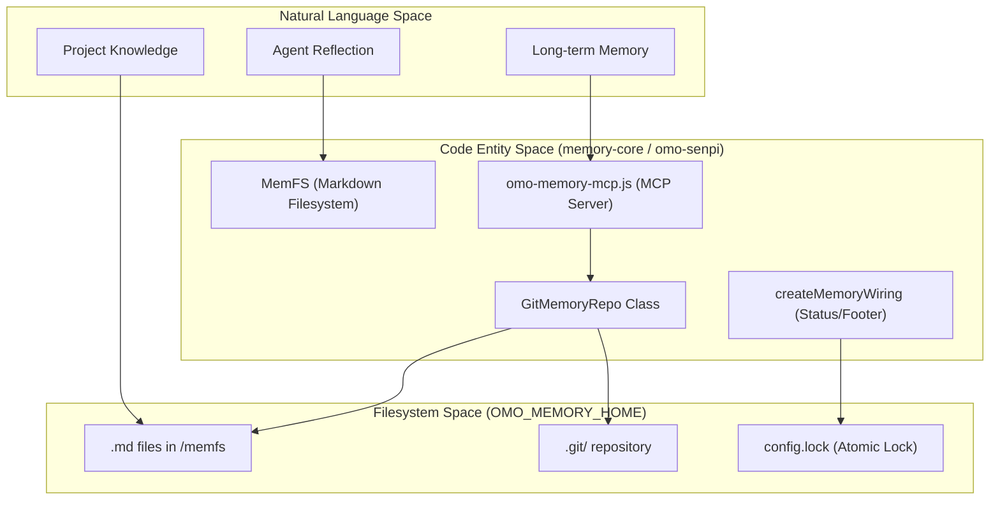
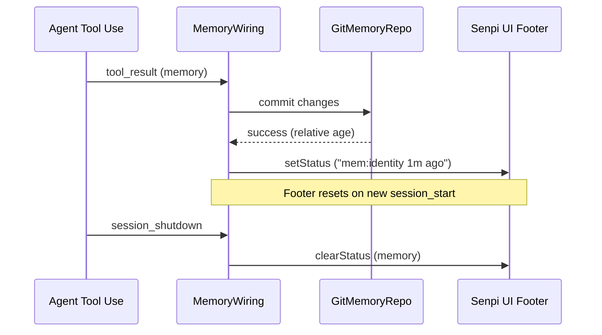

# Agent Memory System

Relevant source files

The following files were used as context for generating this wiki page:

- [.omo/evidence/20260810-memory-footer-first-use/QA.md](https://github.com/code-yeongyu/oh-my-openagent/blob/HEAD/.omo/evidence/20260810-memory-footer-first-use/QA.md)
- [.omo/evidence/20260810-memory-footer-first-use/final-dev-sync.txt](https://github.com/code-yeongyu/oh-my-openagent/blob/HEAD/.omo/evidence/20260810-memory-footer-first-use/final-dev-sync.txt)
- [.omo/evidence/20260810-memory-footer-first-use/final-git-free-wiring-harness.txt](https://github.com/code-yeongyu/oh-my-openagent/blob/HEAD/.omo/evidence/20260810-memory-footer-first-use/final-git-free-wiring-harness.txt)
- [.omo/evidence/20260810-memory-footer-first-use/final-latest-dev-sync.txt](https://github.com/code-yeongyu/oh-my-openagent/blob/HEAD/.omo/evidence/20260810-memory-footer-first-use/final-latest-dev-sync.txt)
- [.omo/evidence/20260810-memory-footer-first-use/final-review-lifecycle-green.txt](https://github.com/code-yeongyu/oh-my-openagent/blob/HEAD/.omo/evidence/20260810-memory-footer-first-use/final-review-lifecycle-green.txt)
- [.omo/evidence/20260810-memory-footer-first-use/final-windows-self-package-cleanup.txt](https://github.com/code-yeongyu/oh-my-openagent/blob/HEAD/.omo/evidence/20260810-memory-footer-first-use/final-windows-self-package-cleanup.txt)
- [.omo/evidence/20260810-memory-footer-first-use/final-windows-wiring-cleanup.txt](https://github.com/code-yeongyu/oh-my-openagent/blob/HEAD/.omo/evidence/20260810-memory-footer-first-use/final-windows-wiring-cleanup.txt)
- [.omo/evidence/20260810-memory-footer-first-use/memory-suite.txt](https://github.com/code-yeongyu/oh-my-openagent/blob/HEAD/.omo/evidence/20260810-memory-footer-first-use/memory-suite.txt)
- [.omo/evidence/20260810-memory-footer-first-use/tui-after/metadata.json](https://github.com/code-yeongyu/oh-my-openagent/blob/HEAD/.omo/evidence/20260810-memory-footer-first-use/tui-after/metadata.json)
- [.omo/evidence/20260810-memory-footer-first-use/tui-after/terminal-ansi.txt](https://github.com/code-yeongyu/oh-my-openagent/blob/HEAD/.omo/evidence/20260810-memory-footer-first-use/tui-after/terminal-ansi.txt)
- [.omo/evidence/20260810-memory-footer-first-use/tui-after/terminal.png](https://github.com/code-yeongyu/oh-my-openagent/blob/HEAD/.omo/evidence/20260810-memory-footer-first-use/tui-after/terminal.png)
- [.omo/evidence/20260810-memory-footer-first-use/tui-after/terminal.txt](https://github.com/code-yeongyu/oh-my-openagent/blob/HEAD/.omo/evidence/20260810-memory-footer-first-use/tui-after/terminal.txt)
- [.omo/evidence/20260810-memory-footer-first-use/tui-assertions.txt](https://github.com/code-yeongyu/oh-my-openagent/blob/HEAD/.omo/evidence/20260810-memory-footer-first-use/tui-assertions.txt)
- [.omo/evidence/20260810-memory-footer-first-use/tui-before/metadata.json](https://github.com/code-yeongyu/oh-my-openagent/blob/HEAD/.omo/evidence/20260810-memory-footer-first-use/tui-before/metadata.json)
- [.omo/evidence/20260810-memory-footer-first-use/tui-before/terminal-ansi.txt](https://github.com/code-yeongyu/oh-my-openagent/blob/HEAD/.omo/evidence/20260810-memory-footer-first-use/tui-before/terminal-ansi.txt)
- [.omo/evidence/20260810-omo-native-telemetry/f1-fixes.md](https://github.com/code-yeongyu/oh-my-openagent/blob/HEAD/.omo/evidence/20260810-omo-native-telemetry/f1-fixes.md)
- [.omo/evidence/20260810-posix-test-timeout-clobber/red-green-posix-timeout-clobber.md](https://github.com/code-yeongyu/oh-my-openagent/blob/HEAD/.omo/evidence/20260810-posix-test-timeout-clobber/red-green-posix-timeout-clobber.md)
- [.omo/evidence/20260811-beta-6-release-state-fix/README.md](https://github.com/code-yeongyu/oh-my-openagent/blob/HEAD/.omo/evidence/20260811-beta-6-release-state-fix/README.md)
- [.omo/evidence/20260811-omo-native-geoip-on/fix.md](https://github.com/code-yeongyu/oh-my-openagent/blob/HEAD/.omo/evidence/20260811-omo-native-geoip-on/fix.md)
- [docs/reference/senpi-telemetry.md](https://github.com/code-yeongyu/oh-my-openagent/blob/HEAD/docs/reference/senpi-telemetry.md)
- [packages/memory-core/src/locks/acquire.ts](https://github.com/code-yeongyu/oh-my-openagent/blob/HEAD/packages/memory-core/src/locks/acquire.ts)
- [packages/omo-codex/src/install/install-codex-git-bash-hooks.test.ts](https://github.com/code-yeongyu/oh-my-openagent/blob/HEAD/packages/omo-codex/src/install/install-codex-git-bash-hooks.test.ts)
- [packages/omo-config-core/src/schema/memory.test.ts](https://github.com/code-yeongyu/oh-my-openagent/blob/HEAD/packages/omo-config-core/src/schema/memory.test.ts)
- [packages/omo-config-core/src/schema/memory.ts](https://github.com/code-yeongyu/oh-my-openagent/blob/HEAD/packages/omo-config-core/src/schema/memory.ts)
- [packages/omo-senpi/plugin/extensions/omo-init-deep-advisor.js](https://github.com/code-yeongyu/oh-my-openagent/blob/HEAD/packages/omo-senpi/plugin/extensions/omo-init-deep-advisor.js)
- [packages/omo-senpi/plugin/extensions/omo-member.js](https://github.com/code-yeongyu/oh-my-openagent/blob/HEAD/packages/omo-senpi/plugin/extensions/omo-member.js)
- [packages/omo-senpi/plugin/extensions/omo-memory-mcp.js](https://github.com/code-yeongyu/oh-my-openagent/blob/HEAD/packages/omo-senpi/plugin/extensions/omo-memory-mcp.js)
- [packages/omo-senpi/plugin/extensions/omo.js](https://github.com/code-yeongyu/oh-my-openagent/blob/HEAD/packages/omo-senpi/plugin/extensions/omo.js)
- [packages/omo-senpi/plugin/scripts/build-extension.mjs](https://github.com/code-yeongyu/oh-my-openagent/blob/HEAD/packages/omo-senpi/plugin/scripts/build-extension.mjs)
- [packages/omo-senpi/plugin/scripts/build-extension.test.mjs](https://github.com/code-yeongyu/oh-my-openagent/blob/HEAD/packages/omo-senpi/plugin/scripts/build-extension.test.mjs)
- [packages/omo-senpi/src/components/memory/commands/memfs.test.ts](https://github.com/code-yeongyu/oh-my-openagent/blob/HEAD/packages/omo-senpi/src/components/memory/commands/memfs.test.ts)
- [packages/omo-senpi/src/components/memory/commands/memory-repository.test.ts](https://github.com/code-yeongyu/oh-my-openagent/blob/HEAD/packages/omo-senpi/src/components/memory/commands/memory-repository.test.ts)
- [packages/omo-senpi/src/components/memory/compaction-survival.test.ts](https://github.com/code-yeongyu/oh-my-openagent/blob/HEAD/packages/omo-senpi/src/components/memory/compaction-survival.test.ts)
- [packages/omo-senpi/src/components/memory/identity-runtime.ts](https://github.com/code-yeongyu/oh-my-openagent/blob/HEAD/packages/omo-senpi/src/components/memory/identity-runtime.ts)
- [packages/omo-senpi/src/components/memory/index.test.ts](https://github.com/code-yeongyu/oh-my-openagent/blob/HEAD/packages/omo-senpi/src/components/memory/index.test.ts)
- [packages/omo-senpi/src/components/memory/index.ts](https://github.com/code-yeongyu/oh-my-openagent/blob/HEAD/packages/omo-senpi/src/components/memory/index.ts)
- [packages/omo-senpi/src/components/memory/memory.test-support.ts](https://github.com/code-yeongyu/oh-my-openagent/blob/HEAD/packages/omo-senpi/src/components/memory/memory.test-support.ts)
- [packages/omo-senpi/src/components/memory/model-registry-resolver.test.ts](https://github.com/code-yeongyu/oh-my-openagent/blob/HEAD/packages/omo-senpi/src/components/memory/model-registry-resolver.test.ts)
- [packages/omo-senpi/src/components/memory/model-registry-resolver.ts](https://github.com/code-yeongyu/oh-my-openagent/blob/HEAD/packages/omo-senpi/src/components/memory/model-registry-resolver.ts)
- [packages/omo-senpi/src/components/memory/palace/command.test.ts](https://github.com/code-yeongyu/oh-my-openagent/blob/HEAD/packages/omo-senpi/src/components/memory/palace/command.test.ts)
- [packages/omo-senpi/src/components/memory/palace/generator.test.ts](https://github.com/code-yeongyu/oh-my-openagent/blob/HEAD/packages/omo-senpi/src/components/memory/palace/generator.test.ts)
- [packages/omo-senpi/src/components/memory/prompt.ts](https://github.com/code-yeongyu/oh-my-openagent/blob/HEAD/packages/omo-senpi/src/components/memory/prompt.ts)
- [packages/omo-senpi/src/components/memory/status.test.ts](https://github.com/code-yeongyu/oh-my-openagent/blob/HEAD/packages/omo-senpi/src/components/memory/status.test.ts)
- [packages/omo-senpi/src/components/memory/status.ts](https://github.com/code-yeongyu/oh-my-openagent/blob/HEAD/packages/omo-senpi/src/components/memory/status.ts)
- [packages/omo-senpi/src/components/memory/tool-surface.test.ts](https://github.com/code-yeongyu/oh-my-openagent/blob/HEAD/packages/omo-senpi/src/components/memory/tool-surface.test.ts)
- [packages/omo-senpi/src/components/memory/tools.test.ts](https://github.com/code-yeongyu/oh-my-openagent/blob/HEAD/packages/omo-senpi/src/components/memory/tools.test.ts)
- [packages/omo-senpi/src/components/memory/tools.ts](https://github.com/code-yeongyu/oh-my-openagent/blob/HEAD/packages/omo-senpi/src/components/memory/tools.ts)
- [packages/omo-senpi/src/components/memory/wiring.test.ts](https://github.com/code-yeongyu/oh-my-openagent/blob/HEAD/packages/omo-senpi/src/components/memory/wiring.test.ts)
- [packages/omo-senpi/src/components/memory/wiring.ts](https://github.com/code-yeongyu/oh-my-openagent/blob/HEAD/packages/omo-senpi/src/components/memory/wiring.ts)
- [packages/omo-senpi/src/components/telemetry/omo-native-component.ts](https://github.com/code-yeongyu/oh-my-openagent/blob/HEAD/packages/omo-senpi/src/components/telemetry/omo-native-component.ts)
- [packages/omo-senpi/src/components/telemetry/omo-native-notice.test.ts](https://github.com/code-yeongyu/oh-my-openagent/blob/HEAD/packages/omo-senpi/src/components/telemetry/omo-native-notice.test.ts)
- [packages/omo-senpi/src/components/telemetry/product-identity.test.ts](https://github.com/code-yeongyu/oh-my-openagent/blob/HEAD/packages/omo-senpi/src/components/telemetry/product-identity.test.ts)
- [packages/omo-senpi/src/components/telemetry/product-identity.ts](https://github.com/code-yeongyu/oh-my-openagent/blob/HEAD/packages/omo-senpi/src/components/telemetry/product-identity.ts)
- [packages/omo-senpi/src/components/telemetry/schema-doc.test.ts](https://github.com/code-yeongyu/oh-my-openagent/blob/HEAD/packages/omo-senpi/src/components/telemetry/schema-doc.test.ts)
- [packages/omo-senpi/src/extension/index.test.ts](https://github.com/code-yeongyu/oh-my-openagent/blob/HEAD/packages/omo-senpi/src/extension/index.test.ts)
- [packages/omo-senpi/src/extension/index.ts](https://github.com/code-yeongyu/oh-my-openagent/blob/HEAD/packages/omo-senpi/src/extension/index.ts)
- [packages/omo-senpi/src/mcp/memory-server.test.ts](https://github.com/code-yeongyu/oh-my-openagent/blob/HEAD/packages/omo-senpi/src/mcp/memory-server.test.ts)
- [packages/omo-senpi/src/omo-native-capture-path.audit.test.ts](https://github.com/code-yeongyu/oh-my-openagent/blob/HEAD/packages/omo-senpi/src/omo-native-capture-path.audit.test.ts)
- [packages/senpi-task/src/tools/task/result-details.test.ts](https://github.com/code-yeongyu/oh-my-openagent/blob/HEAD/packages/senpi-task/src/tools/task/result-details.test.ts)
- [packages/senpi-task/src/tools/task/result-details.ts](https://github.com/code-yeongyu/oh-my-openagent/blob/HEAD/packages/senpi-task/src/tools/task/result-details.ts)
- [script/telemetry-schema-block.mjs](https://github.com/code-yeongyu/oh-my-openagent/blob/HEAD/script/telemetry-schema-block.mjs)

The Agent Memory System is a specialized persistence layer within the `memory-core` package, designed to provide agents with a long-term, structured "working memory" that persists across sessions. It utilizes a Git-backed markdown filesystem (MemFS) to ensure atomic updates, conflict resolution, and versioned history of agent reflections and knowledge [packages/omo-senpi/plugin/extensions/omo-memory-mcp.js:1-10](https://github.com/code-yeongyu/oh-my-openagent/blob/HEAD/packages/omo-senpi/plugin/extensions/omo-memory-mcp.js#L1-L10).

## System Architecture

The memory system is integrated into the `omo-senpi` harness as a core component that bridges the agent's natural language reflections with a structured Git repository [packages/omo-senpi/src/extension/index.ts:1-7](https://github.com/code-yeongyu/oh-my-openagent/blob/HEAD/packages/omo-senpi/src/extension/index.ts#L1-L7).

### Data Flow and Entity Mapping

The following diagram illustrates how natural language concepts (Memory, Reflections) map to specific code entities and filesystem structures.

**Memory System Entity Mapping**

Sources: [packages/omo-senpi/plugin/extensions/omo-memory-mcp.js:1-20](https://github.com/code-yeongyu/oh-my-openagent/blob/HEAD/packages/omo-senpi/plugin/extensions/omo-memory-mcp.js#L1-L20), [packages/omo-senpi/src/components/memory/wiring.ts:85-114](https://github.com/code-yeongyu/oh-my-openagent/blob/HEAD/packages/omo-senpi/src/components/memory/wiring.ts#L85-L114), [packages/omo-senpi/src/components/memory/index.ts:9-15](https://github.com/code-yeongyu/oh-my-openagent/blob/HEAD/packages/omo-senpi/src/components/memory/index.ts#L9-L15)

## Core Components

### 1. Git-Backed Markdown MemFS
The memory storage is implemented as a Git repository where every memory entry is a markdown file. This allows the system to leverage Git's content-addressable storage for deduplication and its branching/merging capabilities for conflict resolution [packages/omo-senpi/plugin/extensions/omo-memory-mcp.js:150-180](https://github.com/code-yeongyu/oh-my-openagent/blob/HEAD/packages/omo-senpi/plugin/extensions/omo-memory-mcp.js#L150-L180).

*   **Atomic Operations**: The `GitMemoryRepo` ensures that every `memory_apply_patch` or `memory` tool call results in a discrete Git commit [packages/omo-senpi/plugin/extensions/omo-memory-mcp.js:200-220](https://github.com/code-yeongyu/oh-my-openagent/blob/HEAD/packages/omo-senpi/plugin/extensions/omo-memory-mcp.js#L200-L220).
*   **Lock Domains**: To prevent corruption during concurrent access, the system uses a locking mechanism centered around the `OMO_MEMORY_HOME` directory [packages/omo-senpi/plugin/extensions/omo-memory-mcp.js:120-140](https://github.com/code-yeongyu/oh-my-openagent/blob/HEAD/packages/omo-senpi/plugin/extensions/omo-memory-mcp.js#L120-L140).

### 2. Memory Tools (MCP Server)
The system exposes two primary atomic tools via an MCP (Model Context Protocol) server:
*   `memory`: Used for direct reading and writing of memory blocks [packages/omo-senpi/src/components/memory/wiring.test.ts:30-40](https://github.com/code-yeongyu/oh-my-openagent/blob/HEAD/packages/omo-senpi/src/components/memory/wiring.test.ts#L30-L40).
*   `memory_apply_patch`: Allows agents to perform partial updates to existing memory markdown files using a patch-based approach [packages/omo-senpi/src/components/memory/wiring.test.ts:46-50](https://github.com/code-yeongyu/oh-my-openagent/blob/HEAD/packages/omo-senpi/src/components/memory/wiring.test.ts#L46-L50).

### 3. Prompt Compilation and Reflection
Memory is not just static storage; it is dynamically compiled into the agent's system prompt.
*   **Prompt Compilation**: The `prompt.ts` logic fetches relevant memory segments based on the current project context and injects them into the agent's context window [packages/omo-senpi/src/components/memory/prompt.ts:1-20](https://github.com/code-yeongyu/oh-my-openagent/blob/HEAD/packages/omo-senpi/src/components/memory/prompt.ts#L1-L20).
*   **Reflection Scheduling**: The system tracks when an agent last performed a "reflection" and prompts for new memory updates if significant work has occurred or a session is ending [packages/omo-senpi/src/components/memory/index.test.ts:10-18](https://github.com/code-yeongyu/oh-my-openagent/blob/HEAD/packages/omo-senpi/src/components/memory/index.test.ts#L10-L18).

## Directory Layout (`OMO_MEMORY_HOME`)

The memory system organizes data under a specific home directory, typically resolved via environment variables or project config [packages/omo-senpi/src/components/memory/wiring.test.ts:149-153](https://github.com/code-yeongyu/oh-my-openagent/blob/HEAD/packages/omo-senpi/src/components/memory/wiring.test.ts#L149-L153).

| Path | Purpose |
| :--- | :--- |
| `identity/` | Contains the unique identity hash for the current memory context. |
| `memfs/` | The actual markdown files representing the agent's memory. |
| `.git/` | The Git repository tracking all changes to the `memfs`. |
| `transcripts/` | Cached session transcripts used for context retrieval. |
| `config.lock` | File-based lock to manage concurrent access. |

Sources: [packages/omo-senpi/src/components/memory/wiring.test.ts:146-160](https://github.com/code-yeongyu/oh-my-openagent/blob/HEAD/packages/omo-senpi/src/components/memory/wiring.test.ts#L146-L160), [packages/omo-senpi/plugin/extensions/omo-memory-mcp.js:120-130](https://github.com/code-yeongyu/oh-my-openagent/blob/HEAD/packages/omo-senpi/plugin/extensions/omo-memory-mcp.js#L120-L130)

## Synchronization and Status Wiring

The `MemoryWiring` component in `omo-senpi` manages the UI feedback and synchronization lifecycle [packages/omo-senpi/src/components/memory/wiring.ts:85-114](https://github.com/code-yeongyu/oh-my-openagent/blob/HEAD/packages/omo-senpi/src/components/memory/wiring.ts#L85-L114).

**Memory Lifecycle and UI Synchronization**

Sources: [packages/omo-senpi/src/components/memory/wiring.test.ts:30-53](https://github.com/code-yeongyu/oh-my-openagent/blob/HEAD/packages/omo-senpi/src/components/memory/wiring.test.ts#L30-L53), [packages/omo-senpi/src/components/memory/status.ts:162-168](https://github.com/code-yeongyu/oh-my-openagent/blob/HEAD/packages/omo-senpi/src/components/memory/status.ts#L162-L168)

### Key Implementation Details
*   **Lock Contention**: The system implements a retry budget (default 5-10 retries with backoff) for Windows `EPERM` or `EBUSY` errors when managing Git handles [.omo/evidence/20260810-memory-footer-first-use/final-windows-wiring-cleanup.txt:8-31](https://github.com/code-yeongyu/oh-my-openagent/blob/HEAD/.omo/evidence/20260810-memory-footer-first-use/final-windows-wiring-cleanup.txt#L8-L31).
*   **Footer Logic**: The memory status footer ("mem:identity Xm ago") is gated to show only after a successful memory tool result in a session to avoid cluttering the UI [.omo/evidence/20260810-memory-footer-first-use/final-review-lifecycle-green.txt:3-8](https://github.com/code-yeongyu/oh-my-openagent/blob/HEAD/.omo/evidence/20260810-memory-footer-first-use/final-review-lifecycle-green.txt#L3-L8).
*   **Seed Content**: Initial memory can be seeded from `.agents/memory.md` or global config templates during the first initialization of a repository [packages/omo-senpi/src/components/memory/index.ts:1-15](https://github.com/code-yeongyu/oh-my-openagent/blob/HEAD/packages/omo-senpi/src/components/memory/index.ts#L1-L15).

Sources: [packages/omo-senpi/src/components/memory/wiring.test.ts:1-137](https://github.com/code-yeongyu/oh-my-openagent/blob/HEAD/packages/omo-senpi/src/components/memory/wiring.test.ts#L1-L137), [packages/omo-senpi/plugin/extensions/omo-memory-mcp.js:1-250](https://github.com/code-yeongyu/oh-my-openagent/blob/HEAD/packages/omo-senpi/plugin/extensions/omo-memory-mcp.js#L1-L250), [.omo/evidence/20260810-memory-footer-first-use/memory-suite.txt:1-20](https://github.com/code-yeongyu/oh-my-openagent/blob/HEAD/.omo/evidence/20260810-memory-footer-first-use/memory-suite.txt#L1-L20)