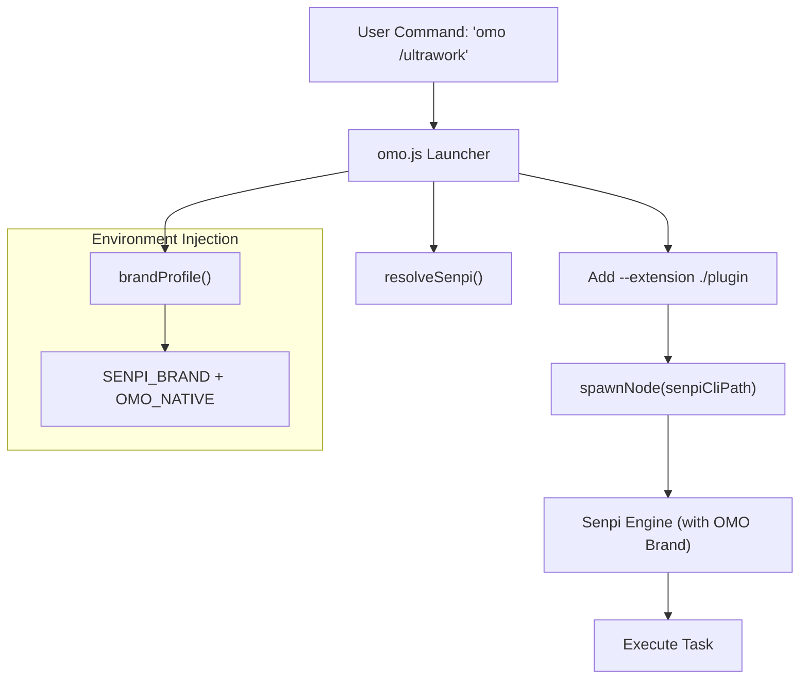
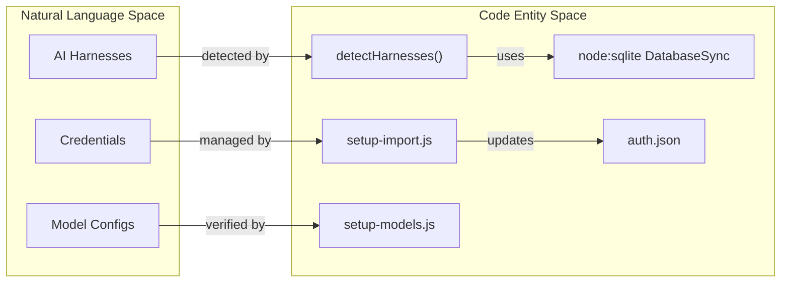

# omo-native (Native CLI)

Relevant source files

The following files were used as context for generating this wiki page:

- [.gitattributes](https://github.com/code-yeongyu/oh-my-openagent/blob/HEAD/.gitattributes)
- [.omo/evidence/20260809-omo-ai-beta-release/task-13.txt](https://github.com/code-yeongyu/oh-my-openagent/blob/HEAD/.omo/evidence/20260809-omo-ai-beta-release/task-13.txt)
- [.omo/evidence/20260809-omo-ai-beta-release/task-14.txt](https://github.com/code-yeongyu/oh-my-openagent/blob/HEAD/.omo/evidence/20260809-omo-ai-beta-release/task-14.txt)
- [.omo/evidence/20260809-omo-ai-beta-release/task-6.txt](https://github.com/code-yeongyu/oh-my-openagent/blob/HEAD/.omo/evidence/20260809-omo-ai-beta-release/task-6.txt)
- [.omo/evidence/20260809-omo-ai-beta-release/task-7.txt](https://github.com/code-yeongyu/oh-my-openagent/blob/HEAD/.omo/evidence/20260809-omo-ai-beta-release/task-7.txt)
- [.omo/evidence/20260809-omo-ai-beta-release/task-9.txt](https://github.com/code-yeongyu/oh-my-openagent/blob/HEAD/.omo/evidence/20260809-omo-ai-beta-release/task-9.txt)
- [.omo/evidence/20260812-omo-native-bun-update/windows-ci-fix.txt](https://github.com/code-yeongyu/oh-my-openagent/blob/HEAD/.omo/evidence/20260812-omo-native-bun-update/windows-ci-fix.txt)
- [bun.lock](https://github.com/code-yeongyu/oh-my-openagent/blob/HEAD/bun.lock)
- [package.json](https://github.com/code-yeongyu/oh-my-openagent/blob/HEAD/package.json)
- [packages/memory-core/src/identity/confinement.test.ts](https://github.com/code-yeongyu/oh-my-openagent/blob/HEAD/packages/memory-core/src/identity/confinement.test.ts)
- [packages/memory-core/src/identity/layout.test.ts](https://github.com/code-yeongyu/oh-my-openagent/blob/HEAD/packages/memory-core/src/identity/layout.test.ts)
- [packages/memory-core/src/identity/resolve.test.ts](https://github.com/code-yeongyu/oh-my-openagent/blob/HEAD/packages/memory-core/src/identity/resolve.test.ts)
- [packages/memory-core/src/locks/lock-record.test.ts](https://github.com/code-yeongyu/oh-my-openagent/blob/HEAD/packages/memory-core/src/locks/lock-record.test.ts)
- [packages/memory-core/src/memfs/hooks.test.ts](https://github.com/code-yeongyu/oh-my-openagent/blob/HEAD/packages/memory-core/src/memfs/hooks.test.ts)
- [packages/memory-core/src/reflection/completion-validation.test.ts](https://github.com/code-yeongyu/oh-my-openagent/blob/HEAD/packages/memory-core/src/reflection/completion-validation.test.ts)
- [packages/memory-core/src/tools/memory.test.ts](https://github.com/code-yeongyu/oh-my-openagent/blob/HEAD/packages/memory-core/src/tools/memory.test.ts)
- [packages/omo-codex/scripts/install-dist/install-local.mjs](https://github.com/code-yeongyu/oh-my-openagent/blob/HEAD/packages/omo-codex/scripts/install-dist/install-local.mjs)
- [packages/omo-native/.gitignore](https://github.com/code-yeongyu/oh-my-openagent/blob/HEAD/packages/omo-native/.gitignore)
- [packages/omo-native/bin/lib/child-process.js](https://github.com/code-yeongyu/oh-my-openagent/blob/HEAD/packages/omo-native/bin/lib/child-process.js)
- [packages/omo-native/bin/lib/doctor.js](https://github.com/code-yeongyu/oh-my-openagent/blob/HEAD/packages/omo-native/bin/lib/doctor.js)
- [packages/omo-native/bin/lib/launcher.js](https://github.com/code-yeongyu/oh-my-openagent/blob/HEAD/packages/omo-native/bin/lib/launcher.js)
- [packages/omo-native/bin/lib/package-paths.js](https://github.com/code-yeongyu/oh-my-openagent/blob/HEAD/packages/omo-native/bin/lib/package-paths.js)
- [packages/omo-native/bin/lib/setup-detect.js](https://github.com/code-yeongyu/oh-my-openagent/blob/HEAD/packages/omo-native/bin/lib/setup-detect.js)
- [packages/omo-native/bin/lib/setup-import.js](https://github.com/code-yeongyu/oh-my-openagent/blob/HEAD/packages/omo-native/bin/lib/setup-import.js)
- [packages/omo-native/bin/lib/setup-models.js](https://github.com/code-yeongyu/oh-my-openagent/blob/HEAD/packages/omo-native/bin/lib/setup-models.js)
- [packages/omo-native/bin/lib/setup-report.js](https://github.com/code-yeongyu/oh-my-openagent/blob/HEAD/packages/omo-native/bin/lib/setup-report.js)
- [packages/omo-native/bin/omo-agent-toolkit.js](https://github.com/code-yeongyu/oh-my-openagent/blob/HEAD/packages/omo-native/bin/omo-agent-toolkit.js)
- [packages/omo-native/bin/omo.js](https://github.com/code-yeongyu/oh-my-openagent/blob/HEAD/packages/omo-native/bin/omo.js)
- [packages/omo-native/package.json](https://github.com/code-yeongyu/oh-my-openagent/blob/HEAD/packages/omo-native/package.json)
- [packages/omo-native/test/brand-contract-pin.test.ts](https://github.com/code-yeongyu/oh-my-openagent/blob/HEAD/packages/omo-native/test/brand-contract-pin.test.ts)
- [packages/omo-native/test/doctor.test.ts](https://github.com/code-yeongyu/oh-my-openagent/blob/HEAD/packages/omo-native/test/doctor.test.ts)
- [packages/omo-native/test/launcher.test.ts](https://github.com/code-yeongyu/oh-my-openagent/blob/HEAD/packages/omo-native/test/launcher.test.ts)
- [packages/omo-native/test/package-shape.test.ts](https://github.com/code-yeongyu/oh-my-openagent/blob/HEAD/packages/omo-native/test/package-shape.test.ts)
- [packages/omo-native/test/payload.test.ts](https://github.com/code-yeongyu/oh-my-openagent/blob/HEAD/packages/omo-native/test/payload.test.ts)
- [packages/omo-native/test/senpi-pin.test.ts](https://github.com/code-yeongyu/oh-my-openagent/blob/HEAD/packages/omo-native/test/senpi-pin.test.ts)
- [packages/omo-native/test/setup-detect.test.ts](https://github.com/code-yeongyu/oh-my-openagent/blob/HEAD/packages/omo-native/test/setup-detect.test.ts)
- [packages/omo-native/test/setup-import.test.ts](https://github.com/code-yeongyu/oh-my-openagent/blob/HEAD/packages/omo-native/test/setup-import.test.ts)
- [packages/omo-native/test/sqlite-import-discipline.test.ts](https://github.com/code-yeongyu/oh-my-openagent/blob/HEAD/packages/omo-native/test/sqlite-import-discipline.test.ts)
- [packages/omo-native/test/tty-driver.py](https://github.com/code-yeongyu/oh-my-openagent/blob/HEAD/packages/omo-native/test/tty-driver.py)
- [packages/omo-senpi/package.json](https://github.com/code-yeongyu/oh-my-openagent/blob/HEAD/packages/omo-senpi/package.json)
- [packages/omo-senpi/plugin/package.json](https://github.com/code-yeongyu/oh-my-openagent/blob/HEAD/packages/omo-senpi/plugin/package.json)
- [packages/omo-senpi/src/install/local-launcher.test.ts](https://github.com/code-yeongyu/oh-my-openagent/blob/HEAD/packages/omo-senpi/src/install/local-launcher.test.ts)
- [packages/omo-senpi/src/install/local-launcher.ts](https://github.com/code-yeongyu/oh-my-openagent/blob/HEAD/packages/omo-senpi/src/install/local-launcher.ts)
- [packages/omo-senpi/src/package-shape.test.ts](https://github.com/code-yeongyu/oh-my-openagent/blob/HEAD/packages/omo-senpi/src/package-shape.test.ts)
- [packages/senpi-task/package.json](https://github.com/code-yeongyu/oh-my-openagent/blob/HEAD/packages/senpi-task/package.json)
- [script/build-omo-native.ts](https://github.com/code-yeongyu/oh-my-openagent/blob/HEAD/script/build-omo-native.ts)
- [script/omo-ai-publish-shape.test.ts](https://github.com/code-yeongyu/oh-my-openagent/blob/HEAD/script/omo-ai-publish-shape.test.ts)

The `omo-native` package (published as `omo-ai`) provides the native CLI harness for OhMyOpenAgent. It acts as a specialized launcher and management layer built on top of the **Senpi** engine, offering a standalone experience distinct from the `oh-my-opencode` plugin [packages/omo-native/package.json:2-8](https://github.com/code-yeongyu/oh-my-openagent/blob/HEAD/packages/omo-native/package.json#L2-L8).

## Launcher Architecture

The `omo` binary is a brand-aware wrapper around the Senpi CLI. It manages environment injection, extension loading, and version pinning to ensure a consistent "Native OMO" experience [packages/omo-native/bin/lib/launcher.js:27-44](https://github.com/code-yeongyu/oh-my-openagent/blob/HEAD/packages/omo-native/bin/lib/launcher.js#L27-L44).

### Brand Contract and Environment
When the launcher executes, it generates a `brandProfile` that identifies the installation as "omo" rather than the generic engine name. This profile controls the display version, configuration directory (`.omo`), and update channels [packages/omo-native/bin/lib/launcher.js:27-44](https://github.com/code-yeongyu/oh-my-openagent/blob/HEAD/packages/omo-native/bin/lib/launcher.js#L27-L44).

Key environment variables injected by the launcher:
*   `OMO_NATIVE`: Set to `"1"` to signal the engine to use OMO-specific UI elements [packages/omo-native/bin/lib/launcher.js:61](https://github.com/code-yeongyu/oh-my-openagent/blob/HEAD/packages/omo-native/bin/lib/launcher.js#L61).
*   `SENPI_BRAND`: A JSON-stringified profile containing branding metadata [packages/omo-native/bin/lib/launcher.js:62](https://github.com/code-yeongyu/oh-my-openagent/blob/HEAD/packages/omo-native/bin/lib/launcher.js#L62).
*   `OMO_BIN`: Points back to the `omo.js` launcher to ensure sub-processes maintain branding [packages/omo-native/bin/lib/launcher.js:74](https://github.com/code-yeongyu/oh-my-openagent/blob/HEAD/packages/omo-native/bin/lib/launcher.js#L74).
*   `OMO_AGENT_TOOLKIT_BIN`: Points to the internal agent toolkit CLI [packages/omo-native/bin/lib/launcher.js:58](https://github.com/code-yeongyu/oh-my-openagent/blob/HEAD/packages/omo-native/bin/lib/launcher.js#L58).

### Data Flow: CLI Execution
The following diagram illustrates how a command passed to `omo` is processed and delegated to the underlying Senpi engine.

**CLI Delegation Flow**

Sources: [packages/omo-native/bin/lib/launcher.js:78-84](https://github.com/code-yeongyu/oh-my-openagent/blob/HEAD/packages/omo-native/bin/lib/launcher.js#L78-L84), [packages/omo-native/bin/lib/launcher.js:27-44](https://github.com/code-yeongyu/oh-my-openagent/blob/HEAD/packages/omo-native/bin/lib/launcher.js#L27-L44)

## Setup and Diagnostics

The `omo-native` package includes a "Doctor" and "Setup" system to help users migrate from other harnesses (like `oh-my-pi` or `gajae-code`) and verify their environment.

### Harness Detection
The `detectHarnesses` function scans the system for existing AI agent installations, checking for configuration files and SQLite databases associated with:
*   **Senpi**: Default engine [packages/omo-native/bin/lib/setup-detect.js:93-98](https://github.com/code-yeongyu/oh-my-openagent/blob/HEAD/packages/omo-native/bin/lib/setup-detect.js#L93-L98).
*   **OpenCode**: The plugin harness [packages/omo-native/bin/lib/setup-detect.js:93-98](https://github.com/code-yeongyu/oh-my-openagent/blob/HEAD/packages/omo-native/bin/lib/setup-detect.js#L93-L98).
*   **oh-my-pi**: Legacy Pi-based harness [packages/omo-native/bin/lib/setup-detect.js:93-98](https://github.com/code-yeongyu/oh-my-openagent/blob/HEAD/packages/omo-native/bin/lib/setup-detect.js#L93-L98).
*   **gajae-code**: Specialized harness variant [packages/omo-native/bin/lib/setup-detect.js:93-98](https://github.com/code-yeongyu/oh-my-openagent/blob/HEAD/packages/omo-native/bin/lib/setup-detect.js#L93-L98).

### Credential Import Logic
The `omo setup` command facilitates safe credential migration. It implements a strict mapping to ensure only supported providers are imported into the OMO environment [packages/omo-native/test/setup-import.test.ts:124-149](https://github.com/code-yeongyu/oh-my-openagent/blob/HEAD/packages/omo-native/test/setup-import.test.ts#L124-L149).

| Feature | Implementation Detail |
| :--- | :--- |
| **API Keys** | Imported and mapped to `api_key` type [packages/omo-native/test/setup-import.test.ts:140-142](https://github.com/code-yeongyu/oh-my-openagent/blob/HEAD/packages/omo-native/test/setup-import.test.ts#L140-L142). |
| **OAuth** | Generally skipped during automated setup to ensure security re-auth [packages/omo-native/test/setup-import.test.ts:143](https://github.com/code-yeongyu/oh-my-openagent/blob/HEAD/packages/omo-native/test/setup-import.test.ts#L143). |
| **SQLite Support** | Uses `node:sqlite` (when available) to read legacy `agent.db` files [packages/omo-native/test/setup-import.test.ts:150-160](https://github.com/code-yeongyu/oh-my-openagent/blob/HEAD/packages/omo-native/test/setup-import.test.ts#L150-L160). |
| **Safety** | Original source files are never modified (read-only snapshotting) [packages/omo-native/test/setup-import.test.ts:108-114](https://github.com/code-yeongyu/oh-my-openagent/blob/HEAD/packages/omo-native/test/setup-import.test.ts#L108-L114). |

**Entity Mapping: Setup Detection**

Sources: [packages/omo-native/bin/lib/setup-detect.js:8-9](https://github.com/code-yeongyu/oh-my-openagent/blob/HEAD/packages/omo-native/bin/lib/setup-detect.js#L8-L9), [packages/omo-native/bin/lib/setup-import.js](https://github.com/code-yeongyu/oh-my-openagent/blob/HEAD/packages/omo-native/bin/lib/setup-import.js), [packages/omo-native/test/setup-import.test.ts:24-27](https://github.com/code-yeongyu/oh-my-openagent/blob/HEAD/packages/omo-native/test/setup-import.test.ts#L24-L27)

## Package Shape and Constraints

The `omo-ai` package follows a strict published contract to maintain its role as a lightweight launcher [packages/omo-native/test/package-shape.test.ts:7-9](https://github.com/code-yeongyu/oh-my-openagent/blob/HEAD/packages/omo-native/test/package-shape.test.ts#L7-L9).

*   **Binaries**: Only exposes the `omo` command [packages/omo-native/package.json:6-8](https://github.com/code-yeongyu/oh-my-openagent/blob/HEAD/packages/omo-native/package.json#L6-L8).
*   **Dependencies**: Pins a specific version of `@code-yeongyu/senpi` to prevent runtime incompatibilities [packages/omo-native/package.json:16-18](https://github.com/code-yeongyu/oh-my-openagent/blob/HEAD/packages/omo-native/package.json#L16-L18).
*   **Engines**: Requires Node.js `>=24.0.0` [packages/omo-native/package.json:13-15](https://github.com/code-yeongyu/oh-my-openagent/blob/HEAD/packages/omo-native/package.json#L13-L15).
*   **Files**: Includes only the `bin` and `plugin` directories to minimize install size [packages/omo-native/package.json:9-12](https://github.com/code-yeongyu/oh-my-openagent/blob/HEAD/packages/omo-native/package.json#L9-L12).

## Comparison: omo-native vs. oh-my-opencode

While both provide access to OMO agents, they serve different operational environments:

| Feature | `omo-native` (omo-ai) | `oh-my-opencode` |
| :--- | :--- | :--- |
| **Host** | Standalone Terminal (via Senpi) | OpenCode Plugin |
| **Binary** | `omo` | `oh-my-opencode` |
| **Config Dir** | `~/.omo` | `~/.opencode` |
| **Extension** | Bundled in `plugin/` | Internal to plugin |
| **Purpose** | Native CLI workflow | Integrated IDE/Editor workflow |

Sources: [packages/omo-native/bin/lib/launcher.js:27-44](https://github.com/code-yeongyu/oh-my-openagent/blob/HEAD/packages/omo-native/bin/lib/launcher.js#L27-L44), [package.json:1-46](https://github.com/code-yeongyu/oh-my-openagent/blob/HEAD/package.json#L1-L46)