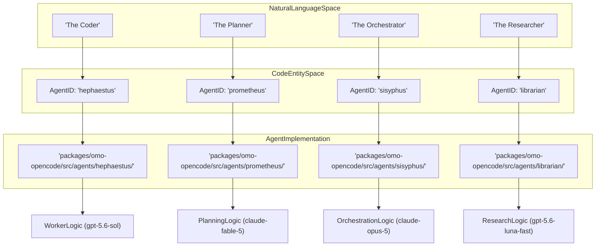
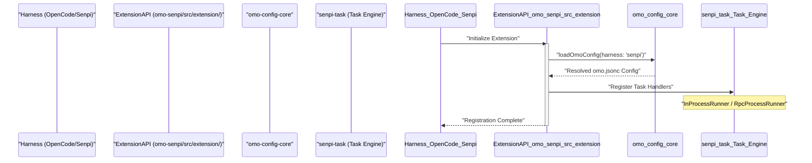

# Glossary

Relevant source files

The following files were used as context for generating this wiki page:

- [.agents/AGENTS.md](https://github.com/code-yeongyu/oh-my-openagent/blob/HEAD/.agents/AGENTS.md)
- [.agents/skills/work-with-pr-workspace/iteration-1/eval-5/with_skill/outputs/execution-plan.md](https://github.com/code-yeongyu/oh-my-openagent/blob/HEAD/.agents/skills/work-with-pr-workspace/iteration-1/eval-5/with_skill/outputs/execution-plan.md)
- [.omo/evidence/20260730-senpi-task-padding/green-prompt.txt](https://github.com/code-yeongyu/oh-my-openagent/blob/HEAD/.omo/evidence/20260730-senpi-task-padding/green-prompt.txt)
- [.omo/evidence/20260730-senpi-task-padding/red-prompt.txt](https://github.com/code-yeongyu/oh-my-openagent/blob/HEAD/.omo/evidence/20260730-senpi-task-padding/red-prompt.txt)
- [.omo/evidence/20260809-omo-agent-toolkit-rename/task-5.txt](https://github.com/code-yeongyu/oh-my-openagent/blob/HEAD/.omo/evidence/20260809-omo-agent-toolkit-rename/task-5.txt)
- [.omo/evidence/20260812-init-deep/hierarchy-green.txt](https://github.com/code-yeongyu/oh-my-openagent/blob/HEAD/.omo/evidence/20260812-init-deep/hierarchy-green.txt)
- [.omo/evidence/20260812-init-deep/hierarchy-red.txt](https://github.com/code-yeongyu/oh-my-openagent/blob/HEAD/.omo/evidence/20260812-init-deep/hierarchy-red.txt)
- [.omo/evidence/20260812-init-deep/manual-review.md](https://github.com/code-yeongyu/oh-my-openagent/blob/HEAD/.omo/evidence/20260812-init-deep/manual-review.md)
- [.omo/evidence/20260812-init-deep/qa-summary.md](https://github.com/code-yeongyu/oh-my-openagent/blob/HEAD/.omo/evidence/20260812-init-deep/qa-summary.md)
- [.omo/evidence/20260812-init-deep/scoring.md](https://github.com/code-yeongyu/oh-my-openagent/blob/HEAD/.omo/evidence/20260812-init-deep/scoring.md)
- [.omo/evidence/20260812-init-deep/validation-green.txt](https://github.com/code-yeongyu/oh-my-openagent/blob/HEAD/.omo/evidence/20260812-init-deep/validation-green.txt)
- [.omo/evidence/20260812-init-deep/validation-red.txt](https://github.com/code-yeongyu/oh-my-openagent/blob/HEAD/.omo/evidence/20260812-init-deep/validation-red.txt)
- [.opencode/AGENTS.md](https://github.com/code-yeongyu/oh-my-openagent/blob/HEAD/.opencode/AGENTS.md)
- [.opencode/skills/work-with-pr-workspace/iteration-1/eval-5/with_skill/outputs/execution-plan.md](https://github.com/code-yeongyu/oh-my-openagent/blob/HEAD/.opencode/skills/work-with-pr-workspace/iteration-1/eval-5/with_skill/outputs/execution-plan.md)
- [AGENTS.md](https://github.com/code-yeongyu/oh-my-openagent/blob/HEAD/AGENTS.md)
- [CHANGELOG.md](https://github.com/code-yeongyu/oh-my-openagent/blob/HEAD/CHANGELOG.md)
- [README.ja.md](https://github.com/code-yeongyu/oh-my-openagent/blob/HEAD/README.ja.md)
- [README.ko.md](https://github.com/code-yeongyu/oh-my-openagent/blob/HEAD/README.ko.md)
- [README.md](https://github.com/code-yeongyu/oh-my-openagent/blob/HEAD/README.md)
- [README.ru.md](https://github.com/code-yeongyu/oh-my-openagent/blob/HEAD/README.ru.md)
- [README.zh-cn.md](https://github.com/code-yeongyu/oh-my-openagent/blob/HEAD/README.zh-cn.md)
- [assets/oh-my-opencode.schema.json](https://github.com/code-yeongyu/oh-my-openagent/blob/HEAD/assets/oh-my-opencode.schema.json)
- [assets/omo.schema.json](https://github.com/code-yeongyu/oh-my-openagent/blob/HEAD/assets/omo.schema.json)
- [changes.md](https://github.com/code-yeongyu/oh-my-openagent/blob/HEAD/changes.md)
- [docs/AGENTS.md](https://github.com/code-yeongyu/oh-my-openagent/blob/HEAD/docs/AGENTS.md)
- [docs/examples/coding-focused.jsonc](https://github.com/code-yeongyu/oh-my-openagent/blob/HEAD/docs/examples/coding-focused.jsonc)
- [docs/examples/default.jsonc](https://github.com/code-yeongyu/oh-my-openagent/blob/HEAD/docs/examples/default.jsonc)
- [docs/examples/planning-focused.jsonc](https://github.com/code-yeongyu/oh-my-openagent/blob/HEAD/docs/examples/planning-focused.jsonc)
- [docs/guide/agent-model-matching.md](https://github.com/code-yeongyu/oh-my-openagent/blob/HEAD/docs/guide/agent-model-matching.md)
- [docs/guide/installation.md](https://github.com/code-yeongyu/oh-my-openagent/blob/HEAD/docs/guide/installation.md)
- [docs/guide/orchestration.md](https://github.com/code-yeongyu/oh-my-openagent/blob/HEAD/docs/guide/orchestration.md)
- [docs/guide/overview.md](https://github.com/code-yeongyu/oh-my-openagent/blob/HEAD/docs/guide/overview.md)
- [docs/guide/senpi-task.md](https://github.com/code-yeongyu/oh-my-openagent/blob/HEAD/docs/guide/senpi-task.md)
- [docs/guide/team-mode.md](https://github.com/code-yeongyu/oh-my-openagent/blob/HEAD/docs/guide/team-mode.md)
- [docs/reference/cli.md](https://github.com/code-yeongyu/oh-my-openagent/blob/HEAD/docs/reference/cli.md)
- [docs/reference/codex-telemetry.md](https://github.com/code-yeongyu/oh-my-openagent/blob/HEAD/docs/reference/codex-telemetry.md)
- [docs/reference/configuration.md](https://github.com/code-yeongyu/oh-my-openagent/blob/HEAD/docs/reference/configuration.md)
- [docs/reference/features.md](https://github.com/code-yeongyu/oh-my-openagent/blob/HEAD/docs/reference/features.md)
- [docs/reference/known-issues.md](https://github.com/code-yeongyu/oh-my-openagent/blob/HEAD/docs/reference/known-issues.md)
- [docs/reference/omo-json.md](https://github.com/code-yeongyu/oh-my-openagent/blob/HEAD/docs/reference/omo-json.md)
- [docs/reference/prompt-async-gate-rfc.md](https://github.com/code-yeongyu/oh-my-openagent/blob/HEAD/docs/reference/prompt-async-gate-rfc.md)
- [docs/reference/rules-injection-cross-module-comparison.md](https://github.com/code-yeongyu/oh-my-openagent/blob/HEAD/docs/reference/rules-injection-cross-module-comparison.md)
- [packages/AGENTS.md](https://github.com/code-yeongyu/oh-my-openagent/blob/HEAD/packages/AGENTS.md)
- [packages/memory-core/AGENTS.md](https://github.com/code-yeongyu/oh-my-openagent/blob/HEAD/packages/memory-core/AGENTS.md)
- [packages/model-core/AGENTS.md](https://github.com/code-yeongyu/oh-my-openagent/blob/HEAD/packages/model-core/AGENTS.md)
- [packages/omo-codex/README.md](https://github.com/code-yeongyu/oh-my-openagent/blob/HEAD/packages/omo-codex/README.md)
- [packages/omo-codex/plugin/README.md](https://github.com/code-yeongyu/oh-my-openagent/blob/HEAD/packages/omo-codex/plugin/README.md)
- [packages/omo-codex/plugin/components/start-work-continuation/AGENTS.md](https://github.com/code-yeongyu/oh-my-openagent/blob/HEAD/packages/omo-codex/plugin/components/start-work-continuation/AGENTS.md)
- [packages/omo-codex/tsconfig.json](https://github.com/code-yeongyu/oh-my-openagent/blob/HEAD/packages/omo-codex/tsconfig.json)
- [packages/omo-config-core/AGENTS.md](https://github.com/code-yeongyu/oh-my-openagent/blob/HEAD/packages/omo-config-core/AGENTS.md)
- [packages/omo-config-core/src/index.ts](https://github.com/code-yeongyu/oh-my-openagent/blob/HEAD/packages/omo-config-core/src/index.ts)
- [packages/omo-config-core/src/internal/index.ts](https://github.com/code-yeongyu/oh-my-openagent/blob/HEAD/packages/omo-config-core/src/internal/index.ts)
- [packages/omo-config-core/src/internal/jsonc-parse.ts](https://github.com/code-yeongyu/oh-my-openagent/blob/HEAD/packages/omo-config-core/src/internal/jsonc-parse.ts)
- [packages/omo-config-core/src/internal/plain-object.ts](https://github.com/code-yeongyu/oh-my-openagent/blob/HEAD/packages/omo-config-core/src/internal/plain-object.ts)
- [packages/omo-config-core/src/internal/posix-path.ts](https://github.com/code-yeongyu/oh-my-openagent/blob/HEAD/packages/omo-config-core/src/internal/posix-path.ts)
- [packages/omo-config-core/src/loader/legacy-user-config-purge.test.ts](https://github.com/code-yeongyu/oh-my-openagent/blob/HEAD/packages/omo-config-core/src/loader/legacy-user-config-purge.test.ts)
- [packages/omo-config-core/src/loader/loader.test.ts](https://github.com/code-yeongyu/oh-my-openagent/blob/HEAD/packages/omo-config-core/src/loader/loader.test.ts)
- [packages/omo-config-core/src/loader/paths.test.ts](https://github.com/code-yeongyu/oh-my-openagent/blob/HEAD/packages/omo-config-core/src/loader/paths.test.ts)
- [packages/omo-config-core/src/loader/paths.ts](https://github.com/code-yeongyu/oh-my-openagent/blob/HEAD/packages/omo-config-core/src/loader/paths.ts)
- [packages/omo-config-core/src/loader/project-config-path-discovery.test.ts](https://github.com/code-yeongyu/oh-my-openagent/blob/HEAD/packages/omo-config-core/src/loader/project-config-path-discovery.test.ts)
- [packages/omo-config-core/src/loader/resolution.test.ts](https://github.com/code-yeongyu/oh-my-openagent/blob/HEAD/packages/omo-config-core/src/loader/resolution.test.ts)
- [packages/omo-config-core/src/loader/types.ts](https://github.com/code-yeongyu/oh-my-openagent/blob/HEAD/packages/omo-config-core/src/loader/types.ts)
- [packages/omo-config-core/src/migration/backup-move.ts](https://github.com/code-yeongyu/oh-my-openagent/blob/HEAD/packages/omo-config-core/src/migration/backup-move.ts)
- [packages/omo-config-core/src/migration/batch.test.ts](https://github.com/code-yeongyu/oh-my-openagent/blob/HEAD/packages/omo-config-core/src/migration/batch.test.ts)
- [packages/omo-config-core/src/migration/batch.ts](https://github.com/code-yeongyu/oh-my-openagent/blob/HEAD/packages/omo-config-core/src/migration/batch.ts)
- [packages/omo-config-core/src/migration/commit.ts](https://github.com/code-yeongyu/oh-my-openagent/blob/HEAD/packages/omo-config-core/src/migration/commit.ts)
- [packages/omo-config-core/src/migration/engine.ts](https://github.com/code-yeongyu/oh-my-openagent/blob/HEAD/packages/omo-config-core/src/migration/engine.ts)
- [packages/omo-config-core/src/migration/journal.ts](https://github.com/code-yeongyu/oh-my-openagent/blob/HEAD/packages/omo-config-core/src/migration/journal.ts)
- [packages/omo-config-core/src/migration/lock.test.ts](https://github.com/code-yeongyu/oh-my-openagent/blob/HEAD/packages/omo-config-core/src/migration/lock.test.ts)
- [packages/omo-config-core/src/migration/lock.ts](https://github.com/code-yeongyu/oh-my-openagent/blob/HEAD/packages/omo-config-core/src/migration/lock.ts)
- [packages/omo-config-core/src/migration/merge-commit.test.ts](https://github.com/code-yeongyu/oh-my-openagent/blob/HEAD/packages/omo-config-core/src/migration/merge-commit.test.ts)
- [packages/omo-config-core/src/migration/merge.ts](https://github.com/code-yeongyu/oh-my-openagent/blob/HEAD/packages/omo-config-core/src/migration/merge.ts)
- [packages/omo-config-core/src/migration/migration-test-support.ts](https://github.com/code-yeongyu/oh-my-openagent/blob/HEAD/packages/omo-config-core/src/migration/migration-test-support.ts)
- [packages/omo-config-core/src/migration/predicate.test.ts](https://github.com/code-yeongyu/oh-my-openagent/blob/HEAD/packages/omo-config-core/src/migration/predicate.test.ts)
- [packages/omo-config-core/src/migration/predicate.ts](https://github.com/code-yeongyu/oh-my-openagent/blob/HEAD/packages/omo-config-core/src/migration/predicate.ts)
- [packages/omo-config-core/src/migration/recovery.test.ts](https://github.com/code-yeongyu/oh-my-openagent/blob/HEAD/packages/omo-config-core/src/migration/recovery.test.ts)
- [packages/omo-config-core/src/migration/recovery.ts](https://github.com/code-yeongyu/oh-my-openagent/blob/HEAD/packages/omo-config-core/src/migration/recovery.ts)
- [packages/omo-config-core/src/migration/transaction.test.ts](https://github.com/code-yeongyu/oh-my-openagent/blob/HEAD/packages/omo-config-core/src/migration/transaction.test.ts)
- [packages/omo-config-core/src/migration/types.ts](https://github.com/code-yeongyu/oh-my-openagent/blob/HEAD/packages/omo-config-core/src/migration/types.ts)
- [packages/omo-config-core/src/models/index.ts](https://github.com/code-yeongyu/oh-my-openagent/blob/HEAD/packages/omo-config-core/src/models/index.ts)
- [packages/omo-config-core/src/models/model-catalog-cycles.ts](https://github.com/code-yeongyu/oh-my-openagent/blob/HEAD/packages/omo-config-core/src/models/model-catalog-cycles.ts)
- [packages/omo-config-core/src/models/model-reference-resolution.test.ts](https://github.com/code-yeongyu/oh-my-openagent/blob/HEAD/packages/omo-config-core/src/models/model-reference-resolution.test.ts)
- [packages/omo-config-core/src/models/model-reference-resolution.ts](https://github.com/code-yeongyu/oh-my-openagent/blob/HEAD/packages/omo-config-core/src/models/model-reference-resolution.ts)
- [packages/omo-config-core/src/writer/types.ts](https://github.com/code-yeongyu/oh-my-openagent/blob/HEAD/packages/omo-config-core/src/writer/types.ts)
- [packages/omo-config-core/src/writer/writer-security.test.ts](https://github.com/code-yeongyu/oh-my-openagent/blob/HEAD/packages/omo-config-core/src/writer/writer-security.test.ts)
- [packages/omo-config-core/src/writer/writer.test.ts](https://github.com/code-yeongyu/oh-my-openagent/blob/HEAD/packages/omo-config-core/src/writer/writer.test.ts)
- [packages/omo-config-core/src/writer/writer.ts](https://github.com/code-yeongyu/oh-my-openagent/blob/HEAD/packages/omo-config-core/src/writer/writer.ts)
- [packages/omo-opencode/src/agents/hephaestus/AGENTS.md](https://github.com/code-yeongyu/oh-my-openagent/blob/HEAD/packages/omo-opencode/src/agents/hephaestus/AGENTS.md)
- [packages/omo-opencode/src/cli/doctor/AGENTS.md](https://github.com/code-yeongyu/oh-my-openagent/blob/HEAD/packages/omo-opencode/src/cli/doctor/AGENTS.md)
- [packages/omo-opencode/src/config/schema/categories.ts](https://github.com/code-yeongyu/oh-my-openagent/blob/HEAD/packages/omo-opencode/src/config/schema/categories.ts)
- [packages/omo-opencode/src/shared/markdown-link-audit.test.ts](https://github.com/code-yeongyu/oh-my-openagent/blob/HEAD/packages/omo-opencode/src/shared/markdown-link-audit.test.ts)
- [packages/omo-opencode/src/startup-migration.test.ts](https://github.com/code-yeongyu/oh-my-openagent/blob/HEAD/packages/omo-opencode/src/startup-migration.test.ts)
- [packages/omo-senpi/AGENTS.md](https://github.com/code-yeongyu/oh-my-openagent/blob/HEAD/packages/omo-senpi/AGENTS.md)
- [packages/omo-senpi/changes.md](https://github.com/code-yeongyu/oh-my-openagent/blob/HEAD/packages/omo-senpi/changes.md)
- [packages/omo-senpi/scripts/qa/task-parent-restart-e2e.mjs](https://github.com/code-yeongyu/oh-my-openagent/blob/HEAD/packages/omo-senpi/scripts/qa/task-parent-restart-e2e.mjs)
- [packages/omo-senpi/scripts/qa/task-parent-restart-runtime.mjs](https://github.com/code-yeongyu/oh-my-openagent/blob/HEAD/packages/omo-senpi/scripts/qa/task-parent-restart-runtime.mjs)
- [packages/omo-senpi/src/components/task/completion-bridge.ts](https://github.com/code-yeongyu/oh-my-openagent/blob/HEAD/packages/omo-senpi/src/components/task/completion-bridge.ts)
- [packages/omo-senpi/src/components/task/engine.ts](https://github.com/code-yeongyu/oh-my-openagent/blob/HEAD/packages/omo-senpi/src/components/task/engine.ts)
- [packages/omo-senpi/src/components/task/event-bridge.ts](https://github.com/code-yeongyu/oh-my-openagent/blob/HEAD/packages/omo-senpi/src/components/task/event-bridge.ts)
- [packages/omo-senpi/src/components/task/index.test.ts](https://github.com/code-yeongyu/oh-my-openagent/blob/HEAD/packages/omo-senpi/src/components/task/index.test.ts)
- [packages/omo-senpi/src/components/task/index.ts](https://github.com/code-yeongyu/oh-my-openagent/blob/HEAD/packages/omo-senpi/src/components/task/index.ts)
- [packages/omo-senpi/src/components/task/runtime-context.ts](https://github.com/code-yeongyu/oh-my-openagent/blob/HEAD/packages/omo-senpi/src/components/task/runtime-context.ts)
- [packages/omo-senpi/src/components/task/session-cwd.test.ts](https://github.com/code-yeongyu/oh-my-openagent/blob/HEAD/packages/omo-senpi/src/components/task/session-cwd.test.ts)
- [packages/omo-senpi/src/components/task/store-mutation-observer.ts](https://github.com/code-yeongyu/oh-my-openagent/blob/HEAD/packages/omo-senpi/src/components/task/store-mutation-observer.ts)
- [packages/omo-senpi/src/components/task/usage-guidance.test.ts](https://github.com/code-yeongyu/oh-my-openagent/blob/HEAD/packages/omo-senpi/src/components/task/usage-guidance.test.ts)
- [packages/omo-senpi/src/components/task/usage-guidance.ts](https://github.com/code-yeongyu/oh-my-openagent/blob/HEAD/packages/omo-senpi/src/components/task/usage-guidance.ts)
- [packages/omo-senpi/src/extension/compose.test.ts](https://github.com/code-yeongyu/oh-my-openagent/blob/HEAD/packages/omo-senpi/src/extension/compose.test.ts)
- [packages/omo-senpi/src/extension/types.ts](https://github.com/code-yeongyu/oh-my-openagent/blob/HEAD/packages/omo-senpi/src/extension/types.ts)
- [packages/omo-senpi/src/install/senpi-settings.ts](https://github.com/code-yeongyu/oh-my-openagent/blob/HEAD/packages/omo-senpi/src/install/senpi-settings.ts)
- [packages/omo-senpi/test-support/fake-extension-api.ts](https://github.com/code-yeongyu/oh-my-openagent/blob/HEAD/packages/omo-senpi/test-support/fake-extension-api.ts)
- [packages/senpi-task/AGENTS.md](https://github.com/code-yeongyu/oh-my-openagent/blob/HEAD/packages/senpi-task/AGENTS.md)
- [packages/senpi-task/src/index.ts](https://github.com/code-yeongyu/oh-my-openagent/blob/HEAD/packages/senpi-task/src/index.ts)
- [packages/senpi-task/src/manager/index.ts](https://github.com/code-yeongyu/oh-my-openagent/blob/HEAD/packages/senpi-task/src/manager/index.ts)
- [packages/senpi-task/src/team/import-discipline.test.ts](https://github.com/code-yeongyu/oh-my-openagent/blob/HEAD/packages/senpi-task/src/team/import-discipline.test.ts)
- [packages/senpi-task/src/team/index.ts](https://github.com/code-yeongyu/oh-my-openagent/blob/HEAD/packages/senpi-task/src/team/index.ts)
- [packages/senpi-task/src/team/messaging/index.ts](https://github.com/code-yeongyu/oh-my-openagent/blob/HEAD/packages/senpi-task/src/team/messaging/index.ts)
- [packages/senpi-task/src/tools/task/index.ts](https://github.com/code-yeongyu/oh-my-openagent/blob/HEAD/packages/senpi-task/src/tools/task/index.ts)
- [packages/shared-skills/AGENTS.md](https://github.com/code-yeongyu/oh-my-openagent/blob/HEAD/packages/shared-skills/AGENTS.md)
- [packages/shared-skills/skills/ultimate-browsing/engine/AGENTS.md](https://github.com/code-yeongyu/oh-my-openagent/blob/HEAD/packages/shared-skills/skills/ultimate-browsing/engine/AGENTS.md)
- [postinstall.test.ts](https://github.com/code-yeongyu/oh-my-openagent/blob/HEAD/postinstall.test.ts)
- [script/AGENTS.md](https://github.com/code-yeongyu/oh-my-openagent/blob/HEAD/script/AGENTS.md)

This glossary defines the technical terms, internal jargon, and abbreviations used within the `oh-my-openagent` codebase. It serves as a reference for onboarding engineers to understand the implementation details and data flows associated with these concepts.

## Core Concepts

### Ultrawork (`ulw`)
A high-level orchestration mode that engages the full suite of specialized agents to work autonomously on a task until completion. It bypasses manual intervention by leveraging the `Ralph Loop` and `Boulder` mechanisms to ensure progress.
- **Implementation**: Triggered via the `ultrawork` or `ulw` commands, which activate the `Sisyphus` orchestrator in a continuous loop [README.md:109-109](https://github.com/code-yeongyu/oh-my-openagent/blob/HEAD/README.md#L109). In the Senpi adapter, it injects a hidden directive to steer the model [packages/omo-senpi/AGENTS.md:25-25](https://github.com/code-yeongyu/oh-my-openagent/blob/HEAD/packages/omo-senpi/AGENTS.md#L25).
- **Data Flow**: User Input -> `IntentGate` -> `Sisyphus` -> Specialized Subagents -> Task Completion.
- **Sources**: [README.md:109-109](https://github.com/code-yeongyu/oh-my-openagent/blob/HEAD/README.md#L109), [docs/guide/installation.md:5-5](https://github.com/code-yeongyu/oh-my-openagent/blob/HEAD/docs/guide/installation.md#L5), [docs/reference/configuration.md:114-120](https://github.com/code-yeongyu/oh-my-openagent/blob/HEAD/docs/reference/configuration.md#L114-L120), [packages/omo-senpi/AGENTS.md:25-25](https://github.com/code-yeongyu/oh-my-openagent/blob/HEAD/packages/omo-senpi/AGENTS.md#L25)

### Discipline Agent
A term used to describe agents (specifically `Sisyphus`) that are programmed to be "self-disciplined"—meaning they strictly follow verification loops, check their own work, and do not stop until the defined goal is met [README.md:81-82](https://github.com/code-yeongyu/oh-my-openagent/blob/HEAD/README.md#L81-L82).
- **Sources**: [README.md:81-82](https://github.com/code-yeongyu/oh-my-openagent/blob/HEAD/README.md#L81-L82)

### IntentGate
A pre-processing layer that analyzes the user's natural language input to determine the underlying intent (e.g., refactoring, searching, or planning) before delegating to a specific agent.
- **Implementation**: Described as a keyword detector for intents like search, analyze, or team [AGENTS.md:49-49](https://github.com/code-yeongyu/oh-my-openagent/blob/HEAD/AGENTS.md#L49).
- **Sources**: [AGENTS.md:49-49](https://github.com/code-yeongyu/oh-my-openagent/blob/HEAD/AGENTS.md#L49)

### Process Hygiene
A set of runtime constraints and cleanup procedures to ensure that background agents, sub-processes (like MCP servers), and tmux sessions do not leak resources or persist beyond their intended lifecycle.
- **Implementation**: Managed by the `BackgroundManager` and `TmuxSessionManager` [docs/reference/configuration.md:25-25](https://github.com/code-yeongyu/oh-my-openagent/blob/HEAD/docs/reference/configuration.md#L25). In the Senpi adapter, this involves identifying and cleaning up orphaned LSP or agent processes to prevent resource exhaustion.
- **Sources**: [docs/reference/configuration.md:25-25](https://github.com/code-yeongyu/oh-my-openagent/blob/HEAD/docs/reference/configuration.md#L25), [packages/omo-senpi/AGENTS.md:13-13](https://github.com/code-yeongyu/oh-my-openagent/blob/HEAD/packages/omo-senpi/AGENTS.md#L13)

## Configuration & Architecture

### omo.jsonc
The unified configuration file for every harness (OpenCode, Senpi, Codex). It supports comments and trailing commas [docs/reference/configuration.md:3-3](https://github.com/code-yeongyu/oh-my-openagent/blob/HEAD/docs/reference/configuration.md#L3).
- **Resolution**: Merges shared base keys, harness blocks, and profiles [docs/reference/configuration.md:52-60](https://github.com/code-yeongyu/oh-my-openagent/blob/HEAD/docs/reference/configuration.md#L52-L60).
- **Sources**: [docs/reference/configuration.md:3-60](https://github.com/code-yeongyu/oh-my-openagent/blob/HEAD/docs/reference/configuration.md#L3-L60)

### Harness Block
Harness-specific configuration sections within `omo.jsonc`, denoted as `[opencode]`, `[senpi]`, or `[codex]`. These blocks override shared settings for that specific execution environment [docs/reference/configuration.md:57-57](https://github.com/code-yeongyu/oh-my-openagent/blob/HEAD/docs/reference/configuration.md#L57).
- **Sources**: [docs/reference/configuration.md:57-61](https://github.com/code-yeongyu/oh-my-openagent/blob/HEAD/docs/reference/configuration.md#L57-L61)

### Profile
A named configuration overlay activated by environment variables or CLI flags.
- **Activation Priority**: `OMO_PROFILE` > `OCX_PROFILE` > `OPENCODE_CONFIG_DIR` suffix [docs/reference/configuration.md:65-70](https://github.com/code-yeongyu/oh-my-openagent/blob/HEAD/docs/reference/configuration.md#L65-L70).
- **Sources**: [docs/reference/configuration.md:63-72](https://github.com/code-yeongyu/oh-my-openagent/blob/HEAD/docs/reference/configuration.md#L63-L72)

### Models Catalog
A top-level `models` record in the configuration that maps short names (aliases) to specific model IDs, variants, and reasoning settings [docs/reference/configuration.md:74-77](https://github.com/code-yeongyu/oh-my-openagent/blob/HEAD/docs/reference/configuration.md#L74-L77).
- **Sources**: [docs/reference/configuration.md:74-77](https://github.com/code-yeongyu/oh-my-openagent/blob/HEAD/docs/reference/configuration.md#L74-L77)

### omo-config-core
The core package responsible for loading, merging, validating, and migrating configurations across the system.
- **Implementation**: It defines the logic for walking project directories to resolve `.omo/omo.jsonc` files [docs/reference/configuration.md:49-50](https://github.com/code-yeongyu/oh-my-openagent/blob/HEAD/docs/reference/configuration.md#L49-L50).
- **Sources**: [docs/reference/configuration.md:43-61](https://github.com/code-yeongyu/oh-my-openagent/blob/HEAD/docs/reference/configuration.md#L43-L61)

### Lock+Journal Migration
The migration engine that imports legacy `oh-my-opencode.json` files into the unified `omo.jsonc`. It uses a "journal" to ensure atomicity and resume interrupted migrations [docs/reference/configuration.md:96-102](https://github.com/code-yeongyu/oh-my-openagent/blob/HEAD/docs/reference/configuration.md#L96-L102).
- **Sources**: [docs/reference/configuration.md:96-105](https://github.com/code-yeongyu/oh-my-openagent/blob/HEAD/docs/reference/configuration.md#L96-L105)

## Agent System

### Sisyphus
The primary orchestrator agent. Its role is to break down complex tasks, delegate them to specialized subagents, and verify the results.
- **Role**: Default orchestrator using Claude-optimized prompts [docs/reference/features.md:13-13](https://github.com/code-yeongyu/oh-my-openagent/blob/HEAD/docs/reference/features.md#L13).
- **Reasoning Unification**: Supports the `:level` suffix (e.g., `model: "gpt-5.6-sol:high"`) to specify reasoning effort directly in the model string. This is unified across the `reasoning` and `reasoningEffort` fields in the schema [assets/oh-my-opencode.schema.json:121-155](https://github.com/code-yeongyu/oh-my-openagent/blob/HEAD/assets/oh-my-opencode.schema.json#L121-L155).
- **Sources**: [docs/reference/features.md:13-13](https://github.com/code-yeongyu/oh-my-openagent/blob/HEAD/docs/reference/features.md#L13), [docs/guide/agent-model-matching.md:47-58](https://github.com/code-yeongyu/oh-my-openagent/blob/HEAD/docs/guide/agent-model-matching.md#L47-L58), [assets/oh-my-opencode.schema.json:121-155](https://github.com/code-yeongyu/oh-my-openagent/blob/HEAD/assets/oh-my-opencode.schema.json#L121-L155)

### Memory System
- **memory-core**: The package providing git-backed markdown storage for agent memory [packages/omo-senpi/AGENTS.md:31-31](https://github.com/code-yeongyu/oh-my-openagent/blob/HEAD/packages/omo-senpi/AGENTS.md#L31).
- **GitMemoryRepo**: The implementation class for managing atomic memory tools and transcript search [packages/omo-senpi/AGENTS.md:31-31](https://github.com/code-yeongyu/oh-my-openagent/blob/HEAD/packages/omo-senpi/AGENTS.md#L31).
- **OMO_MEMORY_HOME**: The environment variable defining the directory layout for stored agent memories [packages/omo-senpi/AGENTS.md:31-31](https://github.com/code-yeongyu/oh-my-openagent/blob/HEAD/packages/omo-senpi/AGENTS.md#L31).
- **Reflection Scheduling**: The mechanism for agents to review past transcripts and consolidate learnings into long-term memory [packages/omo-senpi/AGENTS.md:31-31](https://github.com/code-yeongyu/oh-my-openagent/blob/HEAD/packages/omo-senpi/AGENTS.md#L31).
- **Sources**: [packages/omo-senpi/AGENTS.md:31-31](https://github.com/code-yeongyu/oh-my-openagent/blob/HEAD/packages/omo-senpi/AGENTS.md#L31)

### Specialized Agents & Skills
- **Hephaestus**: Autonomous deep worker for multi-file reasoning [docs/reference/features.md:14-14](https://github.com/code-yeongyu/oh-my-openagent/blob/HEAD/docs/reference/features.md#L14).
- **Data-Scientist Skill**: A specialized skill for data analysis and scientific computing [AGENTS.md:43-43](https://github.com/code-yeongyu/oh-my-openagent/blob/HEAD/AGENTS.md#L43).
- **Fallback-Architect**: A Senpi component that manages model fallback from Fable-5 to weaker models by injecting decomposition directives [packages/omo-senpi/AGENTS.md:30-30](https://github.com/code-yeongyu/oh-my-openagent/blob/HEAD/packages/omo-senpi/AGENTS.md#L30).
- **CodeGraph Daemon**: A background service that maintains a graph of codebase symbols and relationships to assist agent navigation [docs/reference/configuration.md:31-31](https://github.com/code-yeongyu/oh-my-openagent/blob/HEAD/docs/reference/configuration.md#L31).
- **Sources**: [docs/reference/features.md:14-14](https://github.com/code-yeongyu/oh-my-openagent/blob/HEAD/docs/reference/features.md#L14), [AGENTS.md:43-43](https://github.com/code-yeongyu/oh-my-openagent/blob/HEAD/AGENTS.md#L43), [packages/omo-senpi/AGENTS.md:30-30](https://github.com/code-yeongyu/oh-my-openagent/blob/HEAD/packages/omo-senpi/AGENTS.md#L30), [docs/reference/configuration.md:31-31](https://github.com/code-yeongyu/oh-my-openagent/blob/HEAD/docs/reference/configuration.md#L31)

### Agent-Code Mapping
The following diagram bridges natural language agent roles to their specific code identifiers and typical model targets.

**Agent Mapping: Natural Language to Code Entity**

Sources: [docs/reference/features.md:11-32](https://github.com/code-yeongyu/oh-my-openagent/blob/HEAD/docs/reference/features.md#L11-L32), [docs/guide/agent-model-matching.md:43-70](https://github.com/code-yeongyu/oh-my-openagent/blob/HEAD/docs/guide/agent-model-matching.md#L43-L70), [packages/omo-opencode/src/agents/prometheus/AGENTS.md:1-5](https://github.com/code-yeongyu/oh-my-openagent/blob/HEAD/packages/omo-opencode/src/agents/prometheus/AGENTS.md#L1-L5)

## Technical Infrastructure

### omo-native & omo-ai
The native CLI environment based on the Senpi harness.
- **omo-native**: The package containing the native OMO harness and launcher architecture [packages/omo-senpi/AGENTS.md:1-5](https://github.com/code-yeongyu/oh-my-openagent/blob/HEAD/packages/omo-senpi/AGENTS.md#L1-L5).
- **omo-ai**: The CLI entrypoint for the native edition, providing `doctor` diagnostics and setup detection.
- **Sources**: [packages/omo-senpi/AGENTS.md:1-5](https://github.com/code-yeongyu/oh-my-openagent/blob/HEAD/packages/omo-senpi/AGENTS.md#L1-L5)

### Task Runners
- **InProcessRunner**: Executes tasks within the same process as the harness, used for low-latency utility tasks.
- **RpcProcessRunner**: Executes tasks in a separate process via RPC, used for isolation and background agents [packages/omo-senpi/AGENTS.md:30-30](https://github.com/code-yeongyu/oh-my-openagent/blob/HEAD/packages/omo-senpi/AGENTS.md#L30).
- **Sources**: [packages/omo-senpi/AGENTS.md:30-30](https://github.com/code-yeongyu/oh-my-openagent/blob/HEAD/packages/omo-senpi/AGENTS.md#L30)

### Plugin Pipeline
The initialization sequence for the `oh-my-openagent` plugin across different harnesses.

**Plugin Initialization Flow**

Sources: [packages/omo-senpi/AGENTS.md:12-13](https://github.com/code-yeongyu/oh-my-openagent/blob/HEAD/packages/omo-senpi/AGENTS.md#L12-L13), [docs/reference/configuration.md:52-60](https://github.com/code-yeongyu/oh-my-openagent/blob/HEAD/docs/reference/configuration.md#L52-L60), [packages/omo-senpi/AGENTS.md:23-23](https://github.com/code-yeongyu/oh-my-openagent/blob/HEAD/packages/omo-senpi/AGENTS.md#L23)

## Abbreviations

| Abbreviation | Full Term | Description |
| :--- | :--- | :--- |
| **OmO** | Oh My OpenCode | The primary plugin identifier and legacy package name [README.md:133-133](https://github.com/code-yeongyu/oh-my-openagent/blob/HEAD/README.md#L133). |
| **ulw** | Ultrawork | The command for autonomous multi-agent execution [README.md:109-109](https://github.com/code-yeongyu/oh-my-openagent/blob/HEAD/README.md#L109). |
| **MCP** | Model Context Protocol | Standard for tool and server integration [AGENTS.md:49-49](https://github.com/code-yeongyu/oh-my-openagent/blob/HEAD/AGENTS.md#L49). |
| **LSP** | Language Server Protocol | Used for code intelligence tools (goto, symbols) [docs/guide/installation.md:6-6](https://github.com/code-yeongyu/oh-my-openagent/blob/HEAD/docs/guide/installation.md#L6). |
| **JSONC** | JSON with Comments | Format for configuration files like `omo.jsonc` [docs/reference/configuration.md:3-3](https://github.com/code-yeongyu/oh-my-openagent/blob/HEAD/docs/reference/configuration.md#L3). |

Sources: [README.md:109-133](https://github.com/code-yeongyu/oh-my-openagent/blob/HEAD/README.md#L109-L133), [AGENTS.md:49-49](https://github.com/code-yeongyu/oh-my-openagent/blob/HEAD/AGENTS.md#L49), [docs/guide/installation.md:6-6](https://github.com/code-yeongyu/oh-my-openagent/blob/HEAD/docs/guide/installation.md#L6), [docs/reference/configuration.md:3-3](https://github.com/code-yeongyu/oh-my-openagent/blob/HEAD/docs/reference/configuration.md#L3)5: