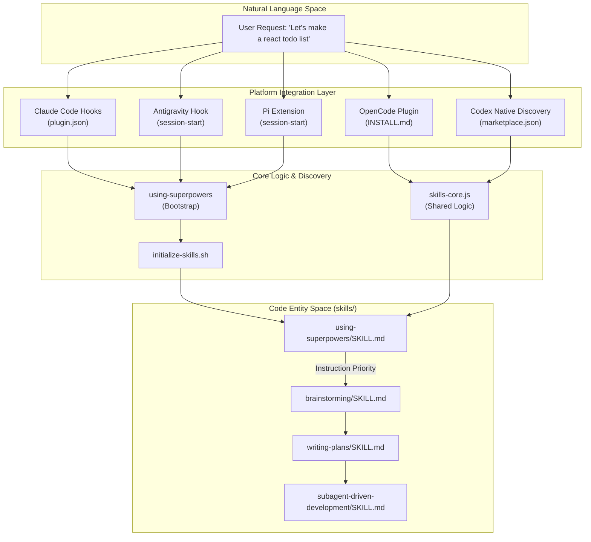
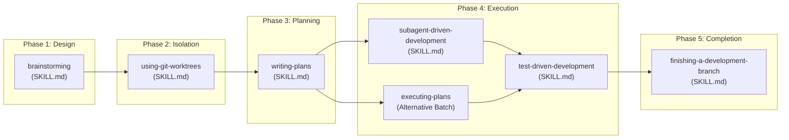

# Overview

Relevant source files

The following files were used as context for generating this wiki page:

- [.claude-plugin/marketplace.json](https://github.com/obra/superpowers/blob/HEAD/.claude-plugin/marketplace.json)
- [.claude-plugin/plugin.json](https://github.com/obra/superpowers/blob/HEAD/.claude-plugin/plugin.json)
- [.gitignore](https://github.com/obra/superpowers/blob/HEAD/.gitignore)
- [CLAUDE.md](https://github.com/obra/superpowers/blob/HEAD/CLAUDE.md)
- [README.md](https://github.com/obra/superpowers/blob/HEAD/README.md)
- [RELEASE-NOTES.md](https://github.com/obra/superpowers/blob/HEAD/RELEASE-NOTES.md)

Superpowers is a complete software development methodology for coding agents, built on a foundation of composable skills and a mandatory instruction protocol [[README.md:3-4](https://github.com/obra/superpowers/blob/HEAD/[README.md:3-4)] [[README.md:204-204](https://github.com/obra/superpowers/blob/HEAD/[README.md:204-204)]. It acts as a multi-platform plugin that provides structured development workflows and AI skills across **Claude Code**, **Antigravity**, **Codex**, **OpenCode**, **Cursor**, **Kimi Code**, **Pi**, and **GitHub Copilot CLI** [[README.md:14-14](https://github.com/obra/superpowers/blob/HEAD/[README.md:14-14)] [[README.md:186-186](https://github.com/obra/superpowers/blob/HEAD/[README.md:186-186)].

The system is currently at version `6.1.1` [[.claude-plugin/plugin.json:4-4](https://github.com/obra/superpowers/blob/HEAD/[.claude-plugin/plugin.json:4-4)] and is maintained at [https://github.com/obra/superpowers](https://github.com/obra/superpowers) [[.claude-plugin/plugin.json:9-10](https://github.com/obra/superpowers/blob/HEAD/[.claude-plugin/plugin.json:9-10)].

Sources: [README.md:1-15](https://github.com/obra/superpowers/blob/HEAD/README.md#L1-L15), [.claude-plugin/plugin.json:1-13](https://github.com/obra/superpowers/blob/HEAD/.claude-plugin/plugin.json#L1-L13), [RELEASE-NOTES.md:3-4](https://github.com/obra/superpowers/blob/HEAD/RELEASE-NOTES.md#L3-L4)

---

## Core Purpose and Philosophy

The fundamental goal of Superpowers is to transform AI coding agents from reactive code-writers into systematic engineers. It prevents agents from jumping directly into code by enforcing a "step back" approach to tease out specifications and sign off on designs before implementation begins [[README.md:18-19](https://github.com/obra/superpowers/blob/HEAD/[README.md:18-19)].

### The 1% Rule and Meta-Skill
The system is anchored by the `using-superpowers` meta-skill [[README.md:204-204](https://github.com/obra/superpowers/blob/HEAD/[README.md:204-204)]. It enforces a strict protocol where the agent checks for relevant skills before any task; these are treated as mandatory workflows, not suggestions [[README.md:204-204](https://github.com/obra/superpowers/blob/HEAD/[README.md:204-204)]. As of v6.1.0, this bootstrap has been compressed to reduce per-session token costs while maintaining the "Red Flags" rationalization and user-instruction precedence rules [[RELEASE-NOTES.md:18-20](https://github.com/obra/superpowers/blob/HEAD/[RELEASE-NOTES.md:18-20)].

### Key Principles
| Principle | Implementation in Code |
| :--- | :--- |
| **Test-Driven Development** | Enforced via `test-driven-development` skill RED-GREEN-REFACTOR cycle [[README.md:198-199](https://github.com/obra/superpowers/blob/HEAD/[README.md:198-199)]. |
| **Systematic over Ad-hoc** | Replaces intuition with 4-phase processes in `systematic-debugging` [[README.md:206-206](https://github.com/obra/superpowers/blob/HEAD/[README.md:206-206)]. |
| **Complexity Reduction** | Emphasizes YAGNI (You Aren't Gonna Need It) and DRY (Don't Repeat Yourself) [[README.md:22-22](https://github.com/obra/superpowers/blob/HEAD/[README.md:22-22)]. |
| **Isolation & Safety** | Mandatory use of git worktrees for workspace isolation and clean baselines [[README.md:192-193](https://github.com/obra/superpowers/blob/HEAD/[README.md:192-193), [README.md:207-207](https://github.com/obra/superpowers/blob/HEAD/README.md#L207)]. |

Sources: [README.md:18-22](https://github.com/obra/superpowers/blob/HEAD/README.md#L18-L22), [README.md:190-207](https://github.com/obra/superpowers/blob/HEAD/README.md#L190-L207), [RELEASE-NOTES.md:16-20](https://github.com/obra/superpowers/blob/HEAD/RELEASE-NOTES.md#L16-L20)

---

## Multi-Platform Architecture

Superpowers uses a single source of truth (the `skills/` directory) but integrates uniquely with various AI environments through platform-specific hooks and configuration files. Gemini CLI support was officially removed in v6.1.0 following its EOL [[RELEASE-NOTES.md:30-30](https://github.com/obra/superpowers/blob/HEAD/[RELEASE-NOTES.md:30-30)].

### Platform Integration Mapping

| Platform | Integration Mechanism | Key Configuration File / Command |
| :--- | :--- | :--- |
| **Claude Code** | Native marketplace/hooks | `.claude-plugin/plugin.json` [[.claude-plugin/plugin.json:1-20](https://github.com/obra/superpowers/blob/HEAD/[.claude-plugin/plugin.json:1-20)] |
| **Antigravity** | Session-start hook | `agy plugin install` [[README.md:69-72](https://github.com/obra/superpowers/blob/HEAD/[README.md:69-72)] |
| **Codex** | Native skill discovery | `.agents/plugins/marketplace.json` [[RELEASE-NOTES.md:25-26](https://github.com/obra/superpowers/blob/HEAD/[RELEASE-NOTES.md:25-26)] |
| **Cursor** | Marketplace/hooks | `/add-plugin superpowers` [[README.md:106-106](https://github.com/obra/superpowers/blob/HEAD/[README.md:106-106)] |
| **OpenCode** | JS plugin / prompt transform | `.opencode/INSTALL.md` [[README.md:167-167](https://github.com/obra/superpowers/blob/HEAD/[README.md:167-167)] |
| **Pi** | Session-start extension | `pi install` [[README.md:177-186](https://github.com/obra/superpowers/blob/HEAD/[README.md:177-186)] |

### Data Flow: Natural Language to Code Entity
The following diagram illustrates how a user's natural language request is routed through the platform-specific "Shim" into the core logic and finally to the specific skill files.

**Request Routing and Skill Discovery:**

Sources: [README.md:64-186](https://github.com/obra/superpowers/blob/HEAD/README.md#L64-L186), [RELEASE-NOTES.md:25-30](https://github.com/obra/superpowers/blob/HEAD/RELEASE-NOTES.md#L25-L30), [RELEASE-NOTES.md:64-71](https://github.com/obra/superpowers/blob/HEAD/RELEASE-NOTES.md#L64-L71)

---

## Technical Implementation Details

### Subagent Workspace Management
As of v6.0.3, SDD scratch files (task briefs, implementer reports, progress ledgers) have moved from `.git/` to a self-ignoring `.superpowers/sdd/` directory in the working tree [[RELEASE-NOTES.md:36-36](https://github.com/obra/superpowers/blob/HEAD/[RELEASE-NOTES.md:36-36)]. This avoids permission issues in environments like Claude Code that protect the `.git/` directory [[RELEASE-NOTES.md:36-36](https://github.com/obra/superpowers/blob/HEAD/[RELEASE-NOTES.md:36-36)].

### Subagent-Driven Development (SDD) v6.0 Evolution
In v6.0.0, the SDD process was significantly streamlined:
- **Reviewer Consolidation**: The separate `spec-reviewer-prompt.md` and `code-quality-reviewer-prompt.md` were replaced by a single `task-reviewer-prompt.md` [[RELEASE-NOTES.md:61-61](https://github.com/obra/superpowers/blob/HEAD/[RELEASE-NOTES.md:61-61)].
- **Worktree Localization**: The legacy global worktree directory (`~/.config/superpowers/worktrees/`) was removed in favor of project-local `.worktrees/` directories [[RELEASE-NOTES.md:62-62](https://github.com/obra/superpowers/blob/HEAD/[RELEASE-NOTES.md:62-62)].
- **Efficiency**: The new flow is designed to be stricter and harder to "game," resulting in roughly 50% fewer tokens used in evaluations [[RELEASE-NOTES.md:53-55](https://github.com/obra/superpowers/blob/HEAD/[RELEASE-NOTES.md:53-55)].

### Codex Packaging
Maintainers use `package-codex-plugin.sh` to produce deterministic Codex portal archives [[RELEASE-NOTES.md:12-12](https://github.com/obra/superpowers/blob/HEAD/[RELEASE-NOTES.md:12-12)]. To prevent Codex from falling back to Claude Code's auto-discovered hooks, the Codex manifest explicitly declares an empty hooks object (`hooks: {}`) [[RELEASE-NOTES.md:7-7](https://github.com/obra/superpowers/blob/HEAD/[RELEASE-NOTES.md:7-7)].

Sources: [RELEASE-NOTES.md:7-12](https://github.com/obra/superpowers/blob/HEAD/RELEASE-NOTES.md#L7-L12), [RELEASE-NOTES.md:36-36](https://github.com/obra/superpowers/blob/HEAD/RELEASE-NOTES.md#L36), [RELEASE-NOTES.md:53-63](https://github.com/obra/superpowers/blob/HEAD/RELEASE-NOTES.md#L53-L63)

---

## Structured Workflow Pipeline

Superpowers enforces a linear pipeline from idea to merged code.

**Workflow Entity Diagram:**

### Key Workflow Steps
1. **brainstorming**: Refines ideas through questions and saves a design document before code is written [[README.md:190-190](https://github.com/obra/superpowers/blob/HEAD/[README.md:190-190)].
2. **writing-plans**: Breaks work into 2-5 minute tasks with exact file paths and verification steps [[README.md:194-195](https://github.com/obra/superpowers/blob/HEAD/[README.md:194-195)].
3. **subagent-driven-development**: Dispatches a fresh subagent per task with a unified review stage [[README.md:196-196](https://github.com/obra/superpowers/blob/HEAD/[README.md:196-196), [RELEASE-NOTES.md:74-74](https://github.com/obra/superpowers/blob/HEAD/RELEASE-NOTES.md#L74)].
4. **test-driven-development**: Enforces the RED-GREEN-REFACTOR cycle, deleting code written before tests [[README.md:198-199](https://github.com/obra/superpowers/blob/HEAD/[README.md:198-199)].

Sources: [README.md:190-202](https://github.com/obra/superpowers/blob/HEAD/README.md#L190-L202), [RELEASE-NOTES.md:61-62](https://github.com/obra/superpowers/blob/HEAD/RELEASE-NOTES.md#L61-L62), [RELEASE-NOTES.md:74-74](https://github.com/obra/superpowers/blob/HEAD/RELEASE-NOTES.md#L74)