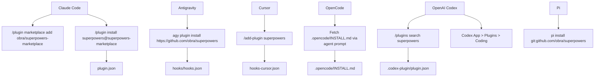
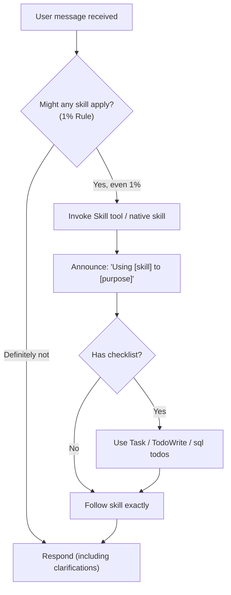

# Getting Started

<details>
<summary>Relevant source files</summary>

The following files were used as context for generating this wiki page:

- [.claude-plugin/plugin.json](https://github.com/obra/superpowers/blob/HEAD/.claude-plugin/plugin.json)
- [.gitignore](https://github.com/obra/superpowers/blob/HEAD/.gitignore)
- [CLAUDE.md](https://github.com/obra/superpowers/blob/HEAD/CLAUDE.md)
- [README.md](https://github.com/obra/superpowers/blob/HEAD/README.md)
- [RELEASE-NOTES.md](https://github.com/obra/superpowers/blob/HEAD/RELEASE-NOTES.md)

</details>


This page guides you through installing Superpowers on your AI coding agent platform. Superpowers provides a complete software development methodology built on a set of composable "skills" and initial instructions that ensure your agent uses them [README.md:1-5](https://github.com/obra/superpowers/blob/HEAD/README.md#L1-L5). Installation integrates the Superpowers framework with your specific environment, enabling automated workflows like TDD, systematic debugging, and subagent-driven development [README.md:188-204](https://github.com/obra/superpowers/blob/HEAD/README.md#L188-L204).

For background on the system's purpose, see [Overview](01_1-overview.md). For details on the architecture, see [Architecture](13_4-architecture.md). For how skills work after installation, see [Core Concepts](08_3-core-concepts.md).

---

## Platform Overview

Superpowers supports multiple platforms including Claude Code, Antigravity, Cursor, OpenAI Codex, OpenCode, Kimi Code, and Pi [README.md:12-14](https://github.com/obra/superpowers/blob/HEAD/README.md#L12-L14). Installation methods range from official plugin marketplaces to manual setup via repository cloning. Note that Gemini CLI support was removed in v6.1.0 following Google's EOL of the tool [RELEASE-NOTES.md:29-31](https://github.com/obra/superpowers/blob/HEAD/RELEASE-NOTES.md#L29-L31).

| Platform | Install Method | Primary Config/Entry | Detailed Guide |
|---|---|---|---|
| Claude Code | Plugin marketplace | `plugin.json` | [Installing on Claude Code](03_2.1-installing-on-claude-code.md) |
| Antigravity | `agy plugin install` | `hooks/hooks.json` | N/A |
| Cursor | Marketplace / `/add-plugin` | `hooks-cursor.json` | [Installing on Cursor](04_2.2-installing-on-cursor.md) |
| OpenCode | Remote INSTALL.md | `opencode.json` | [Installing on OpenCode](05_2.3-installing-on-opencode.md) |
| OpenAI Codex | App/CLI Plugin search | Native discovery | [Installing on Codex](06_2.4-installing-on-codex.md) |
| Kimi Code | Marketplace / `/plugins` | `plugin.json` | N/A |
| Pi | `pi install` | Native skills | N/A |

Sources: [README.md:32-186](https://github.com/obra/superpowers/blob/HEAD/README.md#L32-L186), [.claude-plugin/plugin.json:1-20](https://github.com/obra/superpowers/blob/HEAD/.claude-plugin/plugin.json#L1-L20), [RELEASE-NOTES.md:29-31](https://github.com/obra/superpowers/blob/HEAD/RELEASE-NOTES.md#L29-L31), [RELEASE-NOTES.md:64-71](https://github.com/obra/superpowers/blob/HEAD/RELEASE-NOTES.md#L64-L71)

---

## Installation Methods by Platform

**Platform-to-install-mechanism mapping:**



Sources: [README.md:32-186](https://github.com/obra/superpowers/blob/HEAD/README.md#L32-L186), [RELEASE-NOTES.md:47-49](https://github.com/obra/superpowers/blob/HEAD/RELEASE-NOTES.md#L47-L49), [RELEASE-NOTES.md:64-71](https://github.com/obra/superpowers/blob/HEAD/RELEASE-NOTES.md#L64-L71)

---

## Quick Installation Reference

### Claude Code (Official Marketplace)

Install from the official Claude plugin marketplace [README.md:36-46](https://github.com/obra/superpowers/blob/HEAD/README.md#L36-L46):

```bash
/plugin install superpowers@claude-plugins-official
```

Alternatively, you can add the developer marketplace to access pre-release versions [README.md:48-62](https://github.com/obra/superpowers/blob/HEAD/README.md#L48-L62):

```bash
/plugin marketplace add obra/superpowers-marketplace
/plugin install superpowers@superpowers-marketplace
```

See [Installing on Claude Code](03_2.1-installing-on-claude-code.md) for full details.

### Antigravity

Install directly from the repository. Antigravity runs the `session-start` hook, making Superpowers active from the first message [README.md:64-73](https://github.com/obra/superpowers/blob/HEAD/README.md#L64-L73):

```bash
agy plugin install https://github.com/obra/superpowers
```

### Cursor

In the Cursor Agent chat, use the marketplace command [README.md:101-110](https://github.com/obra/superpowers/blob/HEAD/README.md#L101-L110):

```text
/add-plugin superpowers
```

This installation utilizes the `hooks-cursor.json` configuration for integration. See [Installing on Cursor](04_2.2-installing-on-cursor.md) for full details.

### OpenCode

Tell OpenCode to fetch the installation instructions directly [README.md:159-170](https://github.com/obra/superpowers/blob/HEAD/README.md#L159-L170):

```text
Fetch and follow instructions from https://raw.githubusercontent.com/obra/superpowers/refs/heads/main/.opencode/INSTALL.md
```

See [Installing on OpenCode](05_2.3-installing-on-opencode.md) for full details.

### OpenAI Codex

Codex now uses native skill discovery and no longer requires a `SessionStart` hook [RELEASE-NOTES.md:26-27](https://github.com/obra/superpowers/blob/HEAD/RELEASE-NOTES.md#L26-L27). For the CLI, use the plugin search interface [README.md:83-100](https://github.com/obra/superpowers/blob/HEAD/README.md#L83-L100):

```bash
/plugins
# then search:
superpowers
```

For the App, navigate to **Plugins > Coding** and click the `+` next to Superpowers [README.md:75-82](https://github.com/obra/superpowers/blob/HEAD/README.md#L75-L82). See [Installing on Codex](06_2.4-installing-on-codex.md) for full details.

---

## What Gets Activated After Installation

Once installed, the system enforces a mandatory skill check protocol. The agent is instructed to check for relevant skills before any task [README.md:204](https://github.com/obra/superpowers/blob/HEAD/README.md#L204). This ensures that the agent follows structured workflows rather than ad-hoc guessing. The `using-superpowers` bootstrap is injected into every session to shape agent behavior [RELEASE-NOTES.md:16-20](https://github.com/obra/superpowers/blob/HEAD/RELEASE-NOTES.md#L16-L20).

**Skill Discovery and Invocation Flow:**



The system uses a "1% rule" where if there is even a minor chance a skill applies, the agent **must** invoke it [README.md:204](https://github.com/obra/superpowers/blob/HEAD/README.md#L204). Platform-specific tools are mapped via reference files, though modern agents are increasingly vendor-neutral in their tool calls [RELEASE-NOTES.md:21-22](https://github.com/obra/superpowers/blob/HEAD/RELEASE-NOTES.md#L21-L22), [RELEASE-NOTES.md:57-58](https://github.com/obra/superpowers/blob/HEAD/RELEASE-NOTES.md#L57-L58).

Sources: [README.md:204](https://github.com/obra/superpowers/blob/HEAD/README.md#L204), [RELEASE-NOTES.md:16-22](https://github.com/obra/superpowers/blob/HEAD/RELEASE-NOTES.md#L16-L22), [RELEASE-NOTES.md:57-58](https://github.com/obra/superpowers/blob/HEAD/RELEASE-NOTES.md#L57-L58)

---

## Verification

After installation, start a new session and describe a task that should trigger a skill. The standard acceptance test for new harness support is [CLAUDE.md:78-82](https://github.com/obra/superpowers/blob/HEAD/CLAUDE.md#L78-L82):

> "Let's make a react todo list"

A working integration will auto-trigger the `brainstorming` skill before any code is written [README.md:190](https://github.com/obra/superpowers/blob/HEAD/README.md#L190), [CLAUDE.md:89-90](https://github.com/obra/superpowers/blob/HEAD/CLAUDE.md#L89-L90).

Other verification points based on the basic workflow [README.md:188-202](https://github.com/obra/superpowers/blob/HEAD/README.md#L188-L202):
- *"Let's debug this issue"* — should trigger the `systematic-debugging` skill.
- *"I'm ready to start coding the plan"* — should trigger `subagent-driven-development`.

Sources: [README.md:188-204](https://github.com/obra/superpowers/blob/HEAD/README.md#L188-L204), [CLAUDE.md:78-90](https://github.com/obra/superpowers/blob/HEAD/CLAUDE.md#L78-L90)

---

## Updating

Superpowers updates are platform-dependent:

- **Claude Code**: `/plugin update superpowers`
- **Antigravity / Pi**: Re-run the install command to update from the repository [README.md:73](https://github.com/obra/superpowers/blob/HEAD/README.md#L73).
- **Cursor**: Updates are typically handled via the marketplace or re-running the `/add-plugin` command.
- **Codex**: Updates are handled via the Codex plugin manager or marketplace sync [RELEASE-NOTES.md:49-50](https://github.com/obra/superpowers/blob/HEAD/RELEASE-NOTES.md#L49-L50).

Sources: [README.md:73](https://github.com/obra/superpowers/blob/HEAD/README.md#L73), [RELEASE-NOTES.md:49-50](https://github.com/obra/superpowers/blob/HEAD/RELEASE-NOTES.md#L49-L50)19:T