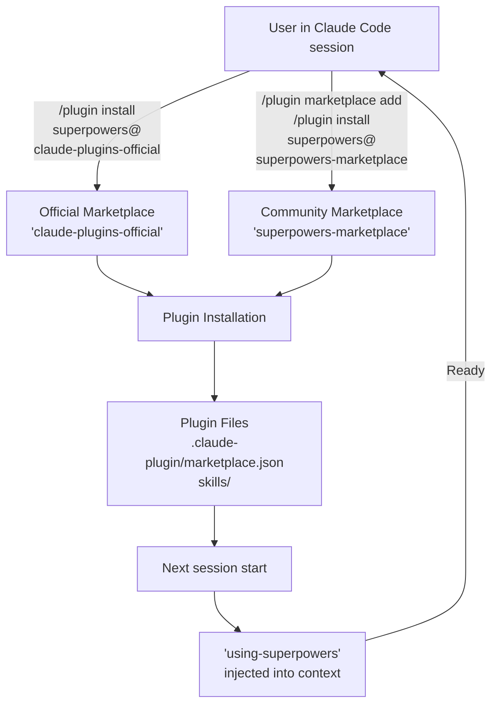
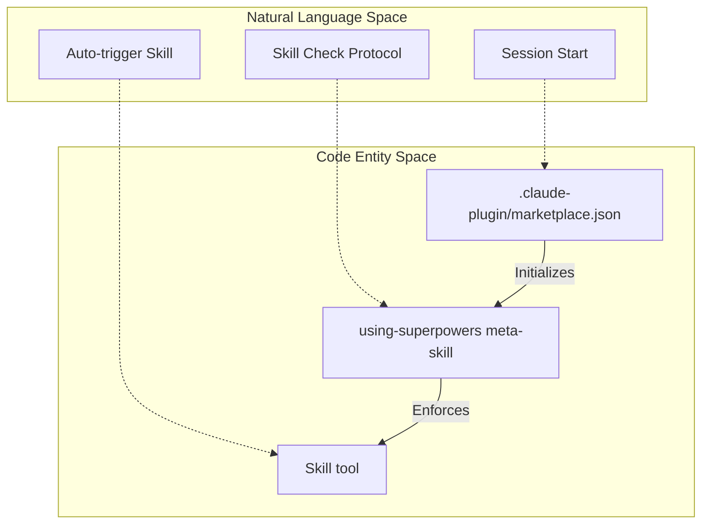
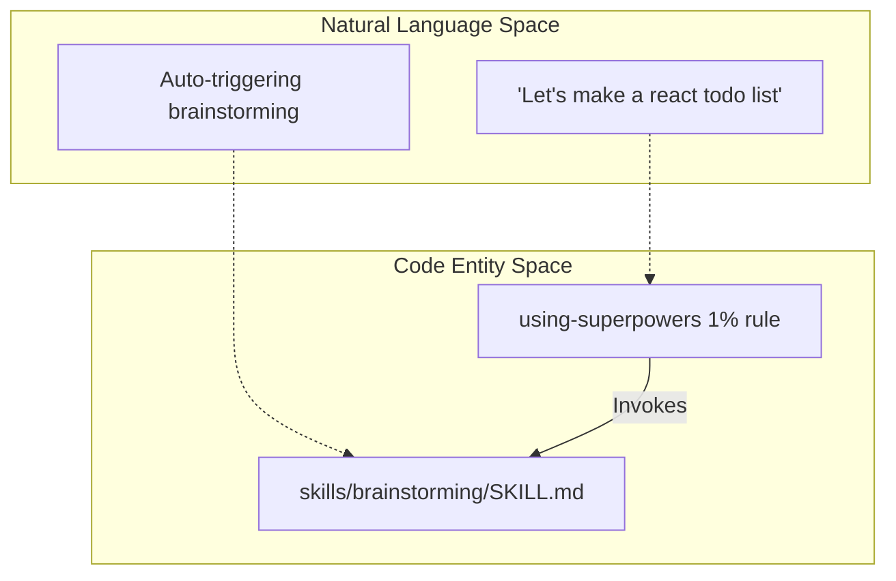

# Installing on Claude Code

<details>
<summary>Relevant source files</summary>

The following files were used as context for generating this wiki page:

- [.claude-plugin/marketplace.json](https://github.com/obra/superpowers/blob/HEAD/.claude-plugin/marketplace.json)
- [.gitignore](https://github.com/obra/superpowers/blob/HEAD/.gitignore)
- [CLAUDE.md](https://github.com/obra/superpowers/blob/HEAD/CLAUDE.md)
- [README.md](https://github.com/obra/superpowers/blob/HEAD/README.md)

</details>


## Purpose and Scope

This page covers installation of Superpowers on Claude Code, including plugin marketplace setup, verification, and session initialization. For installation on other platforms, see [Installing on Cursor](04_2.2-installing-on-cursor.md), [Installing on OpenCode](05_2.3-installing-on-opencode.md), [Installing on Codex](06_2.4-installing-on-codex.md), or [Installing on Gemini CLI](07_2.5-installing-on-gemini-cli.md). For details on how Claude Code's native integration works, see [Claude Code Integration](21_5.1-claude-code-integration.md).

## Installation Methods

Claude Code supports installation via the official Claude plugin marketplace or the Superpowers community marketplace. Both methods install the same core skills library defined in the repository metadata [README.md:36-62](https://github.com/obra/superpowers/blob/HEAD/README.md#L36-L62).

### Official Claude Marketplace

The official marketplace provides Superpowers as a verified plugin. This is the recommended path for most users [README.md:40-46](https://github.com/obra/superpowers/blob/HEAD/README.md#L40-L46).

```bash
/plugin install superpowers@claude-plugins-official
```

### Superpowers Community Marketplace

The Superpowers marketplace provides Superpowers and other related development plugins. You can register this marketplace to access the latest development manifests [README.md:48-62](https://github.com/obra/superpowers/blob/HEAD/README.md#L48-L62).

```bash
/plugin marketplace add obra/superpowers-marketplace
/plugin install superpowers@superpowers-marketplace
```

**Installation Flow:**



**Sources:** [README.md:40-62](https://github.com/obra/superpowers/blob/HEAD/README.md#L40-L62), [.claude-plugin/marketplace.json:1-20](https://github.com/obra/superpowers/blob/HEAD/.claude-plugin/marketplace.json#L1-L20)

## Plugin Lifecycle and Hooks

Claude Code utilizes a hooks system to manage session lifecycles. The Superpowers plugin registers hooks that trigger on specific session events to ensure the AI agent is always aware of its available skills [README.md:25-26](https://github.com/obra/superpowers/blob/HEAD/README.md#L25-L26).

### Hook Execution Mechanism
A real integration loads the `using-superpowers` bootstrap at session start. This bootstrap is what causes skills to auto-trigger at the right moments. Without it, the skills are present on disk but never invoked [CLAUDE.md:75-77](https://github.com/obra/superpowers/blob/HEAD/CLAUDE.md#L75-L77).

| Component | Role | File Pointer |
|------------|-------------------|------------------|
| `marketplace.json` | Defines plugin metadata and source | [.claude-plugin/marketplace.json:1-20](https://github.com/obra/superpowers/blob/HEAD/.claude-plugin/marketplace.json#L1-L20) |
| `using-superpowers` | Meta-skill for bootstrap and 1% rule | [README.md:205-205](https://github.com/obra/superpowers/blob/HEAD/README.md#L205) |
| `Skill` tool | Native tool for skill invocation | [README.md:205-205](https://github.com/obra/superpowers/blob/HEAD/README.md#L205) |

**Natural Language to Code Entity Space: Hook Lifecycle**



**Sources:** [.claude-plugin/marketplace.json:1-20](https://github.com/obra/superpowers/blob/HEAD/.claude-plugin/marketplace.json#L1-L20), [CLAUDE.md:72-83](https://github.com/obra/superpowers/blob/HEAD/CLAUDE.md#L72-L83), [README.md:205-205](https://github.com/obra/superpowers/blob/HEAD/README.md#L205)

## Session Initialization and Context Injection

Once installed, the `superpowers` plugin is active in every Claude Code session. The primary mechanism for enforcement is the `using-superpowers` meta-skill. This skill establishes the "1% rule" (the mandatory skill check protocol) and defines the instruction priority hierarchy [README.md:205-205](https://github.com/obra/superpowers/blob/HEAD/README.md#L205).

The injection ensures that:
1. The agent prioritizes project-specific instructions (e.g., `CLAUDE.md`) over general Superpowers skills [CLAUDE.md:1-20](https://github.com/obra/superpowers/blob/HEAD/CLAUDE.md#L1-L20).
2. The agent uses the `Skill` tool for discovery rather than manually reading markdown files in the `skills/` directory [README.md:205-205](https://github.com/obra/superpowers/blob/HEAD/README.md#L205).

**Sources:** [README.md:205-205](https://github.com/obra/superpowers/blob/HEAD/README.md#L205), [CLAUDE.md:1-20](https://github.com/obra/superpowers/blob/HEAD/CLAUDE.md#L1-L20)

## Verification

To verify that the installation was successful, you can check the installed plugins within Claude Code:

```bash
/plugin list
```

**The Acceptance Test:**
To confirm the bootstrap is working correctly, open a clean session and send the following message:
> Let's make a react todo list

A working integration MUST auto-trigger the `brainstorming` skill before any code is written [CLAUDE.md:78-83](https://github.com/obra/superpowers/blob/HEAD/CLAUDE.md#L78-L83).

**Natural Language to Code Entity Space: Verification**



**Sources:** [CLAUDE.md:72-83](https://github.com/obra/superpowers/blob/HEAD/CLAUDE.md#L72-L83), [README.md:188-190](https://github.com/obra/superpowers/blob/HEAD/README.md#L188-L190)

## Update Process

To update the Superpowers plugin to the latest version available in your configured marketplace:

```bash
/plugin update superpowers
```

Updates pull the latest skill definitions and hook configurations. The system enforces a shift from legacy slash commands to direct skill invocation via the `Skill` tool [README.md:25-26](https://github.com/obra/superpowers/blob/HEAD/README.md#L25-L26).

**Sources:** [README.md:25-26](https://github.com/obra/superpowers/blob/HEAD/README.md#L25-L26), [.claude-plugin/marketplace.json:12-13](https://github.com/obra/superpowers/blob/HEAD/.claude-plugin/marketplace.json#L12-L13)