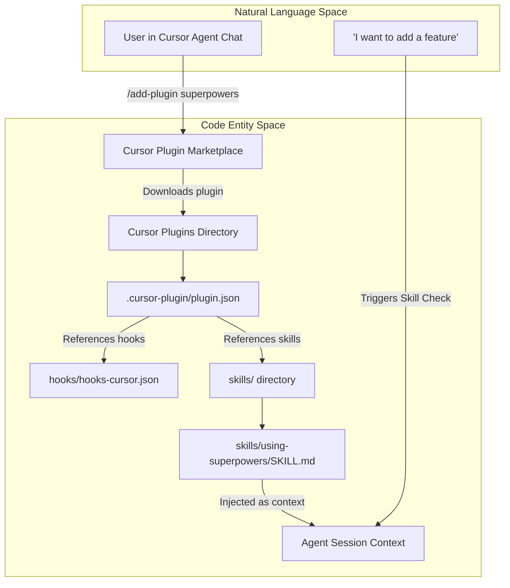
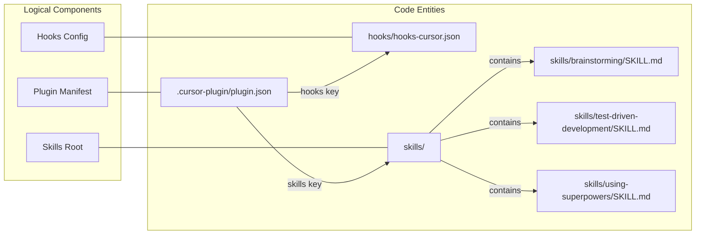

# Installing on Cursor

<details>
<summary>Relevant source files</summary>

The following files were used as context for generating this wiki page:

- [.cursor-plugin/plugin.json](https://github.com/obra/superpowers/blob/HEAD/.cursor-plugin/plugin.json)
- [.gitignore](https://github.com/obra/superpowers/blob/HEAD/.gitignore)
- [CLAUDE.md](https://github.com/obra/superpowers/blob/HEAD/CLAUDE.md)
- [README.md](https://github.com/obra/superpowers/blob/HEAD/README.md)
- [gemini-extension.json](https://github.com/obra/superpowers/blob/HEAD/gemini-extension.json)

</details>


This document provides step-by-step installation instructions for Superpowers on Cursor IDE. For installation on other platforms, see [Installing on Claude Code](https://github.com/obra/superpowers/blob/HEAD/2.1), [Installing on OpenCode](https://github.com/obra/superpowers/blob/HEAD/2.3), or [Installing on Codex](https://github.com/obra/superpowers/blob/HEAD/2.4).

## Overview

Cursor provides a built-in plugin marketplace that simplifies installation. The Superpowers plugin integrates via Cursor's hook system to inject skill context at session start. Unlike platforms requiring manual git clones, Cursor handles plugin distribution automatically through its marketplace.

**What this installation does:**
- Installs plugin code containing hooks and skills [[.cursor-plugin/plugin.json:1-23](https://github.com/obra/superpowers/blob/HEAD/[.cursor-plugin/plugin.json:1-23)]
- Registers a hook system via `hooks-cursor.json` to manage lifecycle events [[.cursor-plugin/plugin.json:22](https://github.com/obra/superpowers/blob/HEAD/[.cursor-plugin/plugin.json:22)]
- Makes skills accessible via Cursor's native discovery mechanisms [[.cursor-plugin/plugin.json:21](https://github.com/obra/superpowers/blob/HEAD/[.cursor-plugin/plugin.json:21)]
- Enables automatic skill checking through the mandatory first response protocol [[README.md:204-205](https://github.com/obra/superpowers/blob/HEAD/[README.md:204-205)]

Sources: [.cursor-plugin/plugin.json:1-23](https://github.com/obra/superpowers/blob/HEAD/.cursor-plugin/plugin.json#L1-L23), [README.md:204-205](https://github.com/obra/superpowers/blob/HEAD/README.md#L204-L205)

## Installation Architecture



**Figure: Cursor installation and bootstrap flow from marketplace command to agent context injection**

Sources: [.cursor-plugin/plugin.json:1-23](https://github.com/obra/superpowers/blob/HEAD/.cursor-plugin/plugin.json#L1-L23), [README.md:101-107](https://github.com/obra/superpowers/blob/HEAD/README.md#L101-L107)

## Installation Command

Execute this command in Cursor's Agent chat:

```text
/add-plugin superpowers
```

Alternatively, users can search for "superpowers" in the built-in plugin marketplace UI [[README.md:101-109](https://github.com/obra/superpowers/blob/HEAD/[README.md:101-109)].

Cursor will:
1. Query its marketplace for the `superpowers` plugin [[.cursor-plugin/plugin.json:2](https://github.com/obra/superpowers/blob/HEAD/[.cursor-plugin/plugin.json:2)]
2. Download the plugin to its local environment.
3. Register the plugin's skills and hooks [[.cursor-plugin/plugin.json:21-22](https://github.com/obra/superpowers/blob/HEAD/[.cursor-plugin/plugin.json:21-22)]
4. Activate the defined hooks for all subsequent sessions [[.cursor-plugin/plugin.json:22](https://github.com/obra/superpowers/blob/HEAD/[.cursor-plugin/plugin.json:22)]

**No additional configuration required.** The plugin is immediately active.

Sources: [.cursor-plugin/plugin.json:1-23](https://github.com/obra/superpowers/blob/HEAD/.cursor-plugin/plugin.json#L1-L23), [README.md:101-109](https://github.com/obra/superpowers/blob/HEAD/README.md#L101-L109)

## Plugin Structure

The installed plugin contains these directories and metadata referenced by the manifest [[.cursor-plugin/plugin.json:1-23](https://github.com/obra/superpowers/blob/HEAD/[.cursor-plugin/plugin.json:1-23)]:

| Component | Path | Purpose |
|-----------|------|---------|
| **Skills** | `./skills/` | Skill definitions in markdown format [[.cursor-plugin/plugin.json:21](https://github.com/obra/superpowers/blob/HEAD/[.cursor-plugin/plugin.json:21)] |
| **Hooks** | `./hooks/hooks-cursor.json` | Lifecycle hooks configuration [[.cursor-plugin/plugin.json:22](https://github.com/obra/superpowers/blob/HEAD/[.cursor-plugin/plugin.json:22)] |
| **Metadata** | `.cursor-plugin/plugin.json` | Plugin definition and entry points [[.cursor-plugin/plugin.json:1-23](https://github.com/obra/superpowers/blob/HEAD/[.cursor-plugin/plugin.json:1-23)] |

Sources: [.cursor-plugin/plugin.json:1-23](https://github.com/obra/superpowers/blob/HEAD/.cursor-plugin/plugin.json#L1-L23)

### Plugin Metadata

The manifest for Cursor defines the entry points for the IDE to discover Superpowers capabilities. Note the use of `hooks-cursor.json` for hook configuration specific to the Cursor environment [[.cursor-plugin/plugin.json:22](https://github.com/obra/superpowers/blob/HEAD/[.cursor-plugin/plugin.json:22)]:

```json
{
  "name": "superpowers",
  "displayName": "Superpowers",
  "version": "6.1.1",
  "skills": "./skills/",
  "hooks": "./hooks/hooks-cursor.json"
}
```

Sources: [.cursor-plugin/plugin.json:1-23](https://github.com/obra/superpowers/blob/HEAD/.cursor-plugin/plugin.json#L1-L23)

## Verification Steps

### 1. Verify Plugin Installation

Start a new Cursor session and describe a task. The agent should **not** immediately start coding. Instead, it should check for relevant skills based on the mandatory protocol [[README.md:204-205](https://github.com/obra/superpowers/blob/HEAD/[README.md:204-205)].

**Test prompt:**
```text
I need to build a new feature that handles user authentication
```

**Expected behavior:**
- Agent identifies the need for a structured workflow.
- Agent finds and loads the `brainstorming` skill [[README.md:190](https://github.com/obra/superpowers/blob/HEAD/[README.md:190)].
- Agent asks clarifying questions about requirements before writing code.

Sources: [.cursor-plugin/plugin.json:1-23](https://github.com/obra/superpowers/blob/HEAD/.cursor-plugin/plugin.json#L1-L23), [README.md:190-205](https://github.com/obra/superpowers/blob/HEAD/README.md#L190-L205)

### 2. Verify Skills Accessibility

Directly request a skill to confirm the skills directory is correctly mapped:

**Test command:**
```text
Show me the test-driven-development skill
```

**Expected behavior:**
- Agent accesses the content in the `skills/` directory [[.cursor-plugin/plugin.json:21](https://github.com/obra/superpowers/blob/HEAD/[.cursor-plugin/plugin.json:21)].
- Agent displays the skill content, including the RED-GREEN-REFACTOR cycle [[README.md:198](https://github.com/obra/superpowers/blob/HEAD/[README.md:198)].

Sources: [.cursor-plugin/plugin.json:21](https://github.com/obra/superpowers/blob/HEAD/.cursor-plugin/plugin.json#L21), [README.md:198](https://github.com/obra/superpowers/blob/HEAD/README.md#L198)

## Troubleshooting

### Agent Not Using Skills

**Symptom:** Agent responds to requests without checking for or invoking skills.

**Diagnosis:**
1. Verify plugin installation: Confirm `superpowers` appears in your installed plugins.
2. Check version: Ensure you are on version `6.1.1` or higher [[.cursor-plugin/plugin.json:5](https://github.com/obra/superpowers/blob/HEAD/[.cursor-plugin/plugin.json:5)].

**Fix:**
- Reinstall plugin: Remove and run `/add-plugin superpowers` again.
- Restart Cursor to ensure the hook system re-initializes.

Sources: [.cursor-plugin/plugin.json:1-23](https://github.com/obra/superpowers/blob/HEAD/.cursor-plugin/plugin.json#L1-L23)

### Skill Discovery Failure

**Symptom:** Agent says it cannot find a specific skill like `brainstorming`.

**Diagnosis:** The agent may not be looking in the correct plugin directory.

**Fix:** Remind the agent that skills are located in the plugin's `skills/` directory as defined in the plugin manifest [[.cursor-plugin/plugin.json:21](https://github.com/obra/superpowers/blob/HEAD/[.cursor-plugin/plugin.json:21)].

Sources: [.cursor-plugin/plugin.json:21](https://github.com/obra/superpowers/blob/HEAD/.cursor-plugin/plugin.json#L21)

## File Mapping Reference

This diagram maps logical components to actual files in the Cursor plugin:



**Figure: Mapping of logical components to file paths in the Cursor plugin structure**

Sources: [.cursor-plugin/plugin.json:1-23](https://github.com/obra/superpowers/blob/HEAD/.cursor-plugin/plugin.json#L1-L23)