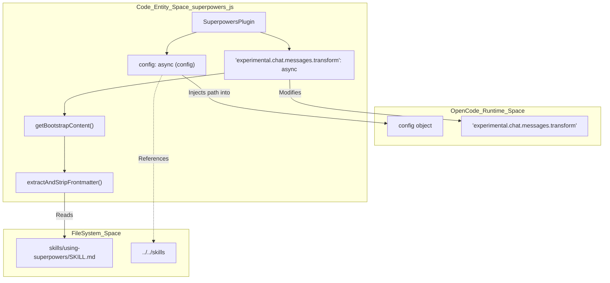
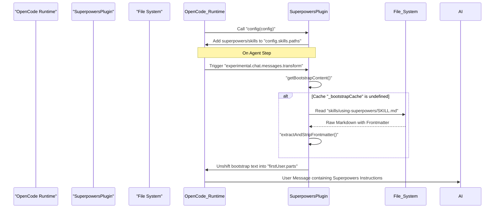

# Installing on OpenCode

<details>
<summary>Relevant source files</summary>

The following files were used as context for generating this wiki page:

- [.gitignore](https://github.com/obra/superpowers/blob/HEAD/.gitignore)
- [.opencode/INSTALL.md](https://github.com/obra/superpowers/blob/HEAD/.opencode/INSTALL.md)
- [.opencode/plugins/superpowers.js](https://github.com/obra/superpowers/blob/HEAD/.opencode/plugins/superpowers.js)
- [CLAUDE.md](https://github.com/obra/superpowers/blob/HEAD/CLAUDE.md)
- [README.md](https://github.com/obra/superpowers/blob/HEAD/README.md)
- [docs/README.opencode.md](https://github.com/obra/superpowers/blob/HEAD/docs/README.opencode.md)
- [docs/testing.md](https://github.com/obra/superpowers/blob/HEAD/docs/testing.md)

</details>


This page documents the installation process for Superpowers on [OpenCode.ai](https://opencode.ai). It covers the modern one-line configuration method, the underlying plugin implementation, and the automatic skill discovery mechanism.

## Installation Overview

Superpowers integrates with OpenCode via a JavaScript plugin that automates environment setup. Unlike previous versions that required manual symlinks, the current installation is handled by adding a single entry to your `opencode.json` configuration file. The plugin auto-installs via OpenCode's plugin manager and registers all skills automatically upon restart.

**Sources:** [.opencode/INSTALL.md:1-18](https://github.com/obra/superpowers/blob/HEAD/.opencode/INSTALL.md#L1-L18), [docs/README.opencode.md:1-17](https://github.com/obra/superpowers/blob/HEAD/docs/README.opencode.md#L1-L17)

---

## One-Line Installation

To install Superpowers, add the repository URL to the `plugin` array in your global or project-level `opencode.json` file.

### Configuration

```json
{
  "plugin": ["superpowers@git+https://github.com/obra/superpowers.git"]
}
```

### Pinning Versions
To use a specific release or branch, append a fragment to the URL:

```json
{
  "plugin": ["superpowers@git+https://github.com/obra/superpowers.git#v5.0.3"]
}
```

After modifying the file, **restart OpenCode**. The system will automatically fetch the repository and register the plugin hooks.

**Sources:** [.opencode/INSTALL.md:9-15](https://github.com/obra/superpowers/blob/HEAD/.opencode/INSTALL.md#L9-L15), [docs/README.opencode.md:7-13](https://github.com/obra/superpowers/blob/HEAD/docs/README.opencode.md#L7-L13), [.opencode/INSTALL.md:58-64](https://github.com/obra/superpowers/blob/HEAD/.opencode/INSTALL.md#L58-L64)

---

## Migration from Legacy Setup

If you previously installed Superpowers using the manual `git clone` and symlink method, you must remove the old files to avoid conflicts with the new automated plugin.

```bash
# Remove old symlinks
rm -f ~/.config/opencode/plugins/superpowers.js
rm -rf ~/.config/opencode/skills/superpowers

# Optionally remove the cloned repo
rm -rf ~/.config/opencode/superpowers

# Remove skills.paths from opencode.json if you added one for superpowers
```

**Sources:** [.opencode/INSTALL.md:25-38](https://github.com/obra/superpowers/blob/HEAD/.opencode/INSTALL.md#L25-L38), [docs/README.opencode.md:24-36](https://github.com/obra/superpowers/blob/HEAD/docs/README.opencode.md#L24-L36)

---

## Plugin Implementation and Data Flow

The OpenCode integration is powered by `.opencode/plugins/superpowers.js`. This plugin performs two primary functions:
1. **Context Injection**: Uses the `experimental.chat.messages.transform` hook to inject the `using-superpowers` meta-skill into the first user message of every session [[.opencode/plugins/superpowers.js:124-138](https://github.com/obra/superpowers/blob/HEAD/[.opencode/plugins/superpowers.js:124-138)].
2. **Skill Registration**: Uses the `config` hook to dynamically add the plugin's `skills/` directory to OpenCode's discovery path [[.opencode/plugins/superpowers.js:107-113](https://github.com/obra/superpowers/blob/HEAD/[.opencode/plugins/superpowers.js:107-113)].

### System Architecture Diagram

The following diagram maps the Natural Language requirements of the plugin to the specific code entities in the `SuperpowersPlugin`.

Title: "OpenCode Plugin Architecture and Entity Mapping"


**Sources:** [.opencode/plugins/superpowers.js:55-139](https://github.com/obra/superpowers/blob/HEAD/.opencode/plugins/superpowers.js#L55-L139), [docs/README.opencode.md:98-104](https://github.com/obra/superpowers/blob/HEAD/docs/README.opencode.md#L98-L104)

### Logic Flow: Session Initialization

When a session starts, the plugin ensures the AI is aware of its "Superpowers" by reading the core meta-skill and prepending it to the first user message. This avoids token bloat associated with repeating system messages and prevents breaking models that only support a single system message [[.opencode/plugins/superpowers.js:115-123](https://github.com/obra/superpowers/blob/HEAD/[.opencode/plugins/superpowers.js:115-123)]. The plugin uses a module-level cache `_bootstrapCache` to eliminate redundant disk I/O on every agent step [[.opencode/plugins/superpowers.js:49-53](https://github.com/obra/superpowers/blob/HEAD/[.opencode/plugins/superpowers.js:49-53)].

Title: "Session Initialization and Bootstrap Injection Flow"


**Sources:** [.opencode/plugins/superpowers.js:49-138](https://github.com/obra/superpowers/blob/HEAD/.opencode/plugins/superpowers.js#L49-L138), [docs/README.opencode.md:98-104](https://github.com/obra/superpowers/blob/HEAD/docs/README.opencode.md#L98-L104)

---

## Tool Mapping Layer

OpenCode users should be aware that skills written for Claude Code use specific tool names. The OpenCode plugin provides a mapping layer to ensure compatibility with native OpenCode tools.

| Claude Code Action | OpenCode Tool | Implementation Detail |
| :--- | :--- | :--- |
| Invoke a skill | `skill` | Uses OpenCode's native `skill` tool [[.opencode/INSTALL.md:105](https://github.com/obra/superpowers/blob/HEAD/[.opencode/INSTALL.md:105)] |
| Create/update todos | `todowrite` | Direct mapping [[.opencode/INSTALL.md:103](https://github.com/obra/superpowers/blob/HEAD/[.opencode/INSTALL.md:103)] |
| Subagent (general) | `task` | Uses `subagent_type: "general"` [[.opencode/INSTALL.md:104](https://github.com/obra/superpowers/blob/HEAD/[.opencode/INSTALL.md:104)] |
| Read files | `read` | Standard filesystem tool [[.opencode/plugins/superpowers.js:81](https://github.com/obra/superpowers/blob/HEAD/[.opencode/plugins/superpowers.js:81)] |
| Edit/Create/Delete | `apply_patch` | Standard file modification tool [[.opencode/plugins/superpowers.js:82](https://github.com/obra/superpowers/blob/HEAD/[.opencode/plugins/superpowers.js:82)] |
| Run shell command | `bash` | Standard shell tool [[.opencode/plugins/superpowers.js:83](https://github.com/obra/superpowers/blob/HEAD/[.opencode/plugins/superpowers.js:83)] |
| Search files | `grep`, `glob` | Standard search tools [[.opencode/plugins/superpowers.js:84](https://github.com/obra/superpowers/blob/HEAD/[.opencode/plugins/superpowers.js:84)] |

**Sources:** [.opencode/INSTALL.md:99-110](https://github.com/obra/superpowers/blob/HEAD/.opencode/INSTALL.md#L99-L110), [docs/README.opencode.md:105-113](https://github.com/obra/superpowers/blob/HEAD/docs/README.opencode.md#L105-L113), [.opencode/plugins/superpowers.js:76-87](https://github.com/obra/superpowers/blob/HEAD/.opencode/plugins/superpowers.js#L76-L87)

---

## Verification

After installation and restart, verify the setup by interacting with the agent:

1.  **Check Bootstrap**: Ask "Tell me about your superpowers". The agent should describe the workflow (brainstorming, writing-plans, etc.) because the `using-superpowers` content is injected into the session via `getBootstrapContent` [[.opencode/plugins/superpowers.js:62-97](https://github.com/obra/superpowers/blob/HEAD/[.opencode/plugins/superpowers.js:62-97)].
2.  **List Skills**: Run the command `use skill tool to list skills`. You should see `superpowers/brainstorming` and other library skills in the list [[docs/README.opencode.md:42-49](https://github.com/obra/superpowers/blob/HEAD/[docs/README.opencode.md:42-49)].
3.  **Check Logs**: If the plugin fails to load, run:
    `opencode run --print-logs "hello" 2>&1 | grep -i superpowers` [[.opencode/INSTALL.md:70](https://github.com/obra/superpowers/blob/HEAD/[.opencode/INSTALL.md:70)]

**Sources:** [.opencode/INSTALL.md:20-20](https://github.com/obra/superpowers/blob/HEAD/.opencode/INSTALL.md#L20), [.opencode/INSTALL.md:44-49](https://github.com/obra/superpowers/blob/HEAD/.opencode/INSTALL.md#L44-L49), [docs/README.opencode.md:120-127](https://github.com/obra/superpowers/blob/HEAD/docs/README.opencode.md#L120-L127)

---

## Skill Priority

OpenCode resolves skills using a tiered priority system. If a skill name exists in multiple locations, the higher priority one is used:

1.  **Project Skills**: `.opencode/skills/` (Highest Priority) [[docs/README.opencode.md:79-81](https://github.com/obra/superpowers/blob/HEAD/[docs/README.opencode.md:79-81)]
2.  **Personal Skills**: `~/.config/opencode/skills/` [[docs/README.opencode.md:58-62](https://github.com/obra/superpowers/blob/HEAD/[docs/README.opencode.md:58-62)]
3.  **Superpowers Skills**: The plugin's internal library (Lowest Priority) [[docs/README.opencode.md:81-81](https://github.com/obra/superpowers/blob/HEAD/[docs/README.opencode.md:81-81)]

This allows users to "shadow" or override standard Superpowers skills by placing a modified `SKILL.md` in their project or personal config directory.

**Sources:** [docs/README.opencode.md:56-81](https://github.com/obra/superpowers/blob/HEAD/docs/README.opencode.md#L56-L81), [.opencode/plugins/superpowers.js:107-113](https://github.com/obra/superpowers/blob/HEAD/.opencode/plugins/superpowers.js#L107-L113)