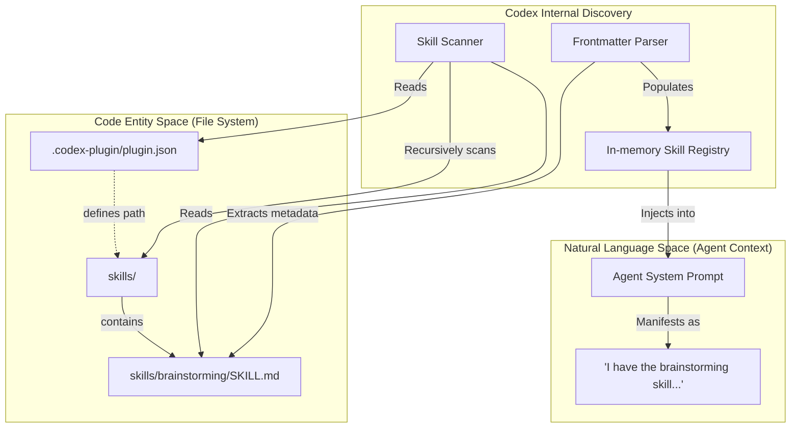
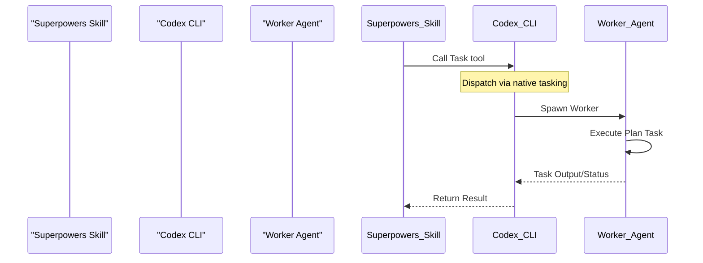

# Installing on Codex

<details>
<summary>Relevant source files</summary>

The following files were used as context for generating this wiki page:

- [.agents/plugins/marketplace.json](https://github.com/obra/superpowers/blob/HEAD/.agents/plugins/marketplace.json)
- [.codex-plugin/plugin.json](https://github.com/obra/superpowers/blob/HEAD/.codex-plugin/plugin.json)
- [.gitignore](https://github.com/obra/superpowers/blob/HEAD/.gitignore)
- [CLAUDE.md](https://github.com/obra/superpowers/blob/HEAD/CLAUDE.md)
- [README.md](https://github.com/obra/superpowers/blob/HEAD/README.md)
- [tests/codex/test-marketplace-manifest.sh](https://github.com/obra/superpowers/blob/HEAD/tests/codex/test-marketplace-manifest.sh)

</details>


This page provides technical documentation for installing Superpowers on OpenAI Codex. Codex uses native skill discovery, which eliminates the need for bootstrap scripts and relies on a simple symlink-based integration or marketplace installation.

---

## Installation Approach

Codex integration utilizes native skill discovery. The Codex CLI and App scan for skills at startup by looking into specific directories, parsing `SKILL.md` frontmatter, and indexing them for the agent. Superpowers provides these skills through a defined `skills` path in the manifest. [[.codex-plugin/plugin.json:23-23]]()

**Key differences from other platforms:**
- **Native Discovery**: No session hooks or initialization scripts are required as Codex natively indexes the `skills/` directory defined in the manifest. [[.codex-plugin/plugin.json:23-23]]()
- **Marketplace Integration**: Superpowers is available through the official Codex plugin marketplace for both CLI and App environments. [[README.md:77-77]](), [[README.md:85-85]]()
- **Automatic Enforcement**: The `using-superpowers` meta-skill is discovered and enforced automatically once indexed, ensuring the agent checks for relevant skills before any task. [[README.md:203-204]]()
- **Hook Suppression**: Unlike Claude Code, Codex does not use the `hooks/hooks.json` file. The Codex manifest explicitly sets `"hooks": {}` to suppress auto-discovery of the Claude Code `SessionStart` hook, which would otherwise trigger an unnecessary trust prompt. [[.codex-plugin/plugin.json:24-24]](), [[tests/codex/test-marketplace-manifest.sh:69-73]]()

**Sources:** [[README.md:77-85]](), [[README.md:203-204]](), [[.codex-plugin/plugin.json:23-24]](), [[tests/codex/test-marketplace-manifest.sh:69-73]]()

---

## Installation Methods

### 1. Codex CLI Marketplace (Recommended)

The most straightforward way to install Superpowers on the Codex CLI is via the built-in marketplace interface. [[README.md:83-99]]()

```bash
/plugins
# Search for "superpowers"
# Select "Install Plugin"
```

**Sources:** [[README.md:83-99]]()

### 2. Codex App Marketplace

For users of the Codex GUI application, the plugin is available in the sidebar. [[README.md:75-81]]()

1. In the Codex app, click on **Plugins** in the sidebar.
2. Locate **Superpowers** in the **Coding** section.
3. Click the **+** icon next to Superpowers and follow the prompts.

**Sources:** [[README.md:75-81]]()

### 3. Manual Installation (Git + Symlink)

For developers wanting to track the `main` branch directly or test local changes, manual installation involves cloning the repository and linking the skills.

#### Step 1: Clone the Repository
```bash
git clone https://github.com/obra/superpowers.git ~/.codex/superpowers
```

#### Step 2: Create Skills Symlink
Codex typically looks for skills in a centralized directory (e.g., `~/.agents/skills`). Link the Superpowers skills directory there:
```bash
mkdir -p ~/.agents/skills
ln -s ~/.codex/superpowers/skills ~/.agents/skills/superpowers
```

**Sources:** [[README.md:1-2]](), [[.codex-plugin/plugin.json:23-23]]()

---

## Directory Structure and Discovery

The following diagram illustrates how the Codex CLI process bridges the physical file system (Code Entity Space) to the agent's understanding of available capabilities (Natural Language Space).

**Codex Skill Discovery Mapping**


**Implementation Details:**
- **Manifest**: The `.codex-plugin/plugin.json` file defines the plugin metadata, including the `skills` path pointing to `./skills/`. [[.codex-plugin/plugin.json:1-23]]()
- **Capabilities**: The `interface` section in the manifest defines capabilities like `Interactive`, `Read`, and `Write`, which Codex uses to grant permissions. [[.codex-plugin/plugin.json:31-35]]()
- **Metadata**: The `displayName` ("Superpowers") and `shortDescription` are used by the Codex UI for marketplace listings. [[.codex-plugin/plugin.json:26-27]]()

**Sources:** [[.codex-plugin/plugin.json:1-48]](), [[README.md:188-200]]()

---

## Tool Mapping Reference

Skills in the Superpowers library are authored using Claude Code tool names. Codex maps these to its internal toolset.

| Claude Code Tool (Skill Reference) | Codex Equivalent | Purpose |
|------------------------------------|------------------|---------|
| `Skill` | `skill` | Executes a specific skill file |
| `Task` | `task` | Dispatches a subagent for a task |
| `Read` / `Write` / `Edit` | `view` / `create` / `edit` | File system operations |
| `Bash` | `bash` | Execute shell commands |

### Subagent Dispatch Flow

When a skill calls the `Task` tool (e.g., in `subagent-driven-development`), Codex translates this into an agent spawning operation. [[README.md:196-196]]()

**Subagent Execution Flow**


**Sources:** [[README.md:196-196]](), [[.codex-plugin/plugin.json:13-21]]()

---

## Marketplace Manifest Validation

The project includes a test suite to ensure the Codex marketplace manifest (`.agents/plugins/marketplace.json`) remains synchronized with the plugin manifest (`.codex-plugin/plugin.json`). [[tests/codex/test-marketplace-manifest.sh:1-8]]()

**Key Validations:**
- **Source Integrity**: Ensures the plugin source is set to the repository root (`./`). [[tests/codex/test-marketplace-manifest.sh:40-40]]()
- **Policy Enforcement**: Verifies that installation is `AVAILABLE` and authentication is required `ON_INSTALL`. [[tests/codex/test-marketplace-manifest.sh:41-45]]()
- **Hook Safety**: Confirms that the Codex manifest explicitly defines an empty `hooks` object to prevent the unintended execution of Claude-specific session hooks. [[tests/codex/test-marketplace-manifest.sh:69-73]]()

**Sources:** [[tests/codex/test-marketplace-manifest.sh:1-77]](), [[.agents/plugins/marketplace.json:1-20]]()

---

## Troubleshooting

### Verification
To verify that the installation is successful and Codex can see the skills:
1. Launch Codex.
2. Type `/plugins` to see if "Superpowers" is listed as active. [[README.md:90-90]]()
3. Ask the agent: "What skills do you have available?" It should list `brainstorming`, `writing-plans`, and others. [[README.md:190-202]]()

### Common Issues
- **Missing Skills**: Ensure the symlink points to the `skills/` subdirectory of the repo, not the repo root. [[.codex-plugin/plugin.json:23-23]]()
- **Permission Denied**: Check that the `capabilities` in `.codex-plugin/plugin.json` include `Read` and `Write`. [[.codex-plugin/plugin.json:31-35]]()

**Sources:** [[README.md:90-90]](), [[README.md:190-202]](), [[.codex-plugin/plugin.json:23-35]]()