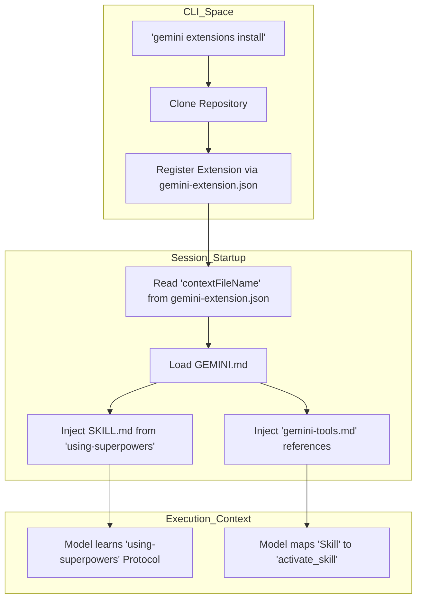
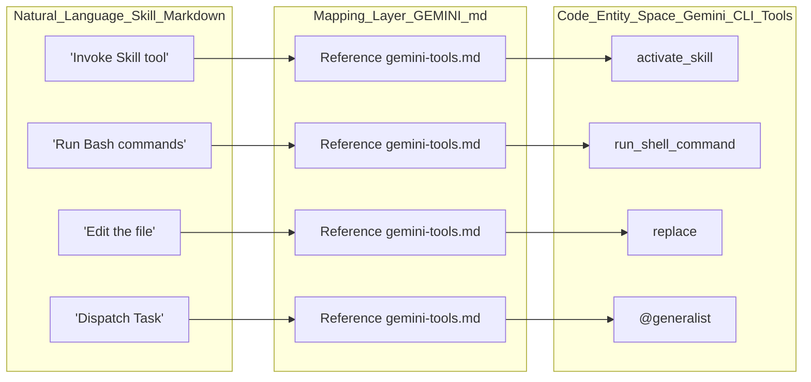

# Installing on Gemini CLI

<details>
<summary>Relevant source files</summary>

The following files were used as context for generating this wiki page:

- [.cursor-plugin/plugin.json](https://github.com/obra/superpowers/blob/HEAD/.cursor-plugin/plugin.json)
- [.gitignore](https://github.com/obra/superpowers/blob/HEAD/.gitignore)
- [CLAUDE.md](https://github.com/obra/superpowers/blob/HEAD/CLAUDE.md)
- [GEMINI.md](https://github.com/obra/superpowers/blob/HEAD/GEMINI.md)
- [README.md](https://github.com/obra/superpowers/blob/HEAD/README.md)
- [gemini-extension.json](https://github.com/obra/superpowers/blob/HEAD/gemini-extension.json)

</details>


The Superpowers system integrates with the Gemini CLI through a native extension mechanism. This installation path enables the Gemini model to discover, load, and execute the skills library using Gemini-specific tool mappings and a persistent context file (`GEMINI.md`) [gemini-extension.json:1-6](https://github.com/obra/superpowers/blob/HEAD/gemini-extension.json#L1-L6).

## Installation Process

Installation is handled via the `gemini extensions` command suite, which clones the repository and registers the extension metadata defined in `gemini-extension.json` [gemini-extension.json:1-7](https://github.com/obra/superpowers/blob/HEAD/gemini-extension.json#L1-L7).

### 1. Initial Install
To install Superpowers on Gemini CLI, execute the following command in your terminal:

```bash
gemini extensions install https://github.com/obra/superpowers
```

### 2. Updating
As skills evolve, you can pull the latest versions using the update command:

```bash
gemini extensions update superpowers
```

### 3. Verification
Start a new session and trigger a skill by asking for assistance with a task, such as "help me plan this feature". The agent should respond by invoking the `activate_skill` tool defined in the Gemini tool mapping [GEMINI.md:1-3](https://github.com/obra/superpowers/blob/HEAD/GEMINI.md#L1-L3).

**Sources:** [gemini-extension.json:1-7](https://github.com/obra/superpowers/blob/HEAD/gemini-extension.json#L1-L7), [README.md:1-14](https://github.com/obra/superpowers/blob/HEAD/README.md#L1-L14)

---

## Configuration and Metadata

The integration relies on two primary files within the repository root to define behavior and context.

### gemini-extension.json
This manifest file identifies the extension to the Gemini CLI and specifies the context injection file.

| Field | Value | Description |
| :--- | :--- | :--- |
| `name` | `"superpowers"` | Unique identifier for the extension [gemini-extension.json:2-2](https://github.com/obra/superpowers/blob/HEAD/gemini-extension.json#L2) |
| `version` | `"6.1.1"` | Current version of the skills library [gemini-extension.json:4-4](https://github.com/obra/superpowers/blob/HEAD/gemini-extension.json#L4) |
| `contextFileName` | `"GEMINI.md"` | The file Gemini reads at session start for instructions [gemini-extension.json:5-5](https://github.com/obra/superpowers/blob/HEAD/gemini-extension.json#L5) |

### GEMINI.md Context File
The `GEMINI.md` file acts as the entry point for the Gemini model. It uses the `@` include syntax to inject the core meta-skill and the Gemini-specific tool mapping into the model's initial context:
*   `@./skills/using-superpowers/SKILL.md` [GEMINI.md:1-1](https://github.com/obra/superpowers/blob/HEAD/GEMINI.md#L1)
*   `@./skills/using-superpowers/references/gemini-tools.md` [GEMINI.md:2-2](https://github.com/obra/superpowers/blob/HEAD/GEMINI.md#L2)

**Sources:** [gemini-extension.json:1-7](https://github.com/obra/superpowers/blob/HEAD/gemini-extension.json#L1-L7), [GEMINI.md:1-3](https://github.com/obra/superpowers/blob/HEAD/GEMINI.md#L1-L3)

---

## Tool Mapping Layer

Skills in the Superpowers library are written using Claude Code tool names (e.g., `Read`, `Write`, `Skill`). The Gemini CLI integration provides an automatic mapping layer so the model knows which native Gemini tools to use when a skill references a Claude Code equivalent.

### Core Mapping Table

| Claude Code Reference | Gemini CLI Equivalent | Purpose |
| :--- | :--- | :--- |
| `Read` | `read_file` | Reading file contents |
| `Write` | `write_file` | Creating new files |
| `Edit` | `replace` | Modifying existing files |
| `Bash` | `run_shell_command` | Executing terminal commands |
| `Grep` | `grep_search` | Search file content |
| `Glob` | `glob` | Search files by name |
| `Skill` | `activate_skill` | Loading and following a superpower skill |
| `TodoWrite` | `write_todos` | Tracking task progress |
| `Task` | `@generalist` | Subagent dispatching via `@` syntax |
| `WebSearch` | `google_web_search` | Web search capabilities |

### Subagent and Memory Support
Gemini CLI supports subagents natively via the `@` syntax. 

*   **Generalist Dispatch:** Use `@generalist` to dispatch tasks defined in skill templates.
*   **Memory Persistence:** The `save_memory` tool allows the agent to persist facts to `GEMINI.md` across sessions, ensuring context is maintained even after session resets [gemini-extension.json:5-5](https://github.com/obra/superpowers/blob/HEAD/gemini-extension.json#L5).
*   **Plan Mode:** `enter_plan_mode` and `exit_plan_mode` allow the model to enter a read-only research state before applying changes.

**Sources:** [GEMINI.md:1-3](https://github.com/obra/superpowers/blob/HEAD/GEMINI.md#L1-L3), [gemini-extension.json:1-7](https://github.com/obra/superpowers/blob/HEAD/gemini-extension.json#L1-L7)

---

## Data Flow and Architecture

The following diagrams illustrate how Gemini CLI interacts with the Superpowers skill library and maps natural language requests to code entities.

### Installation and Activation Flow
This diagram shows the relationship between the CLI commands and the resulting filesystem/context state.

Title: Gemini CLI Extension Lifecycle

**Sources:** [GEMINI.md:1-3](https://github.com/obra/superpowers/blob/HEAD/GEMINI.md#L1-L3), [gemini-extension.json:1-7](https://github.com/obra/superpowers/blob/HEAD/gemini-extension.json#L1-L7)

### Tool Execution Mapping
This diagram bridges the Natural Language instructions found in skills to the actual Tool entities executed by the Gemini CLI.

Title: Natural Language to Code Entity Mapping

**Sources:** [GEMINI.md:1-3](https://github.com/obra/superpowers/blob/HEAD/GEMINI.md#L1-L3), [gemini-extension.json:1-7](https://github.com/obra/superpowers/blob/HEAD/gemini-extension.json#L1-L7)