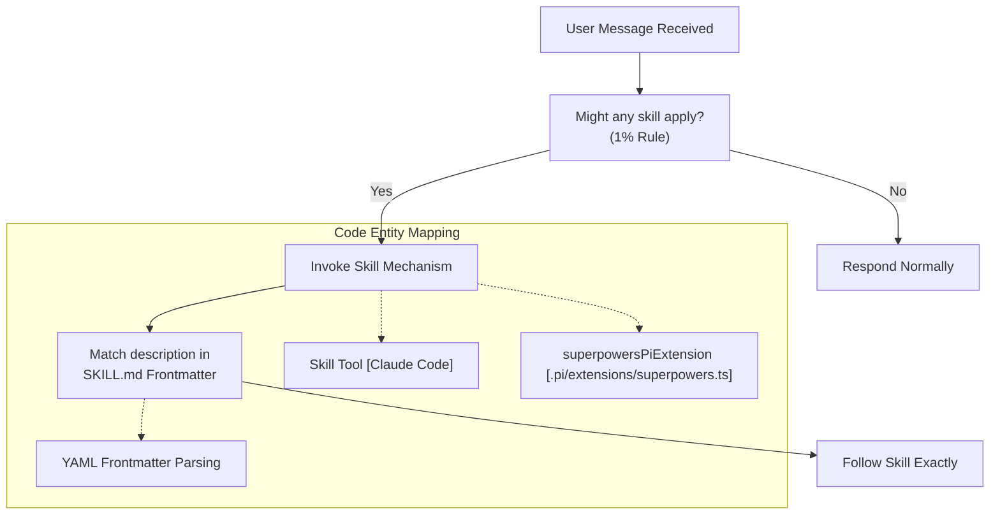
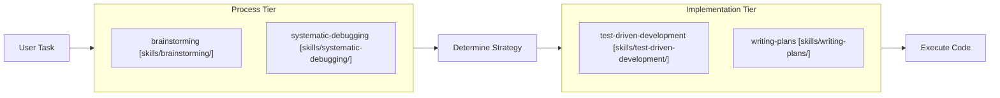

# Core Concepts

<details>
<summary>Relevant source files</summary>

The following files were used as context for generating this wiki page:

- [.gitignore](https://github.com/obra/superpowers/blob/HEAD/.gitignore)
- [.pi/extensions/superpowers.ts](https://github.com/obra/superpowers/blob/HEAD/.pi/extensions/superpowers.ts)
- [CLAUDE.md](https://github.com/obra/superpowers/blob/HEAD/CLAUDE.md)
- [README.md](https://github.com/obra/superpowers/blob/HEAD/README.md)
- [skills/using-superpowers/SKILL.md](https://github.com/obra/superpowers/blob/HEAD/skills/using-superpowers/SKILL.md)
- [tests/pi/test-pi-extension.mjs](https://github.com/obra/superpowers/blob/HEAD/tests/pi/test-pi-extension.mjs)

</details>


This page explains the fundamental concepts that underpin the Superpowers system: what skills are, how they are structured, and the mandatory protocols that ensure AI agents follow them across various platforms.

## What Are Skills

Skills are reusable, modular units of AI guidance that provide structured workflows for coding agents. Unlike static prompts, skills are dynamic instructions that agents discover and invoke via specific tools based on the current task [README.md:3-5](https://github.com/obra/superpowers/blob/HEAD/README.md#L3-L5). They represent the core logic of the Superpowers methodology, transforming an AI from a simple code generator into a disciplined engineering partner [README.md:16-26](https://github.com/obra/superpowers/blob/HEAD/README.md#L16-L26).

### Skill File Structure

Every skill is defined in a `SKILL.md` file within a dedicated directory [README.md:181-182](https://github.com/obra/superpowers/blob/HEAD/README.md#L181-L182). They follow a specific format that combines metadata for discovery and content for execution.

**Part 1: YAML Frontmatter**
The frontmatter contains the skill's identity and its "trigger" description, which the agent uses to match the current context [skills/using-superpowers/SKILL.md:1-4](https://github.com/obra/superpowers/blob/HEAD/skills/using-superpowers/SKILL.md#L1-L4).

```yaml
---
name: brainstorming
description: Use when starting any creative work—creating features, building components, adding functionality, or modifying behavior
---
```

**Part 2: Markdown Content**
The body of the skill contains the actual instructions, often including:
*   **Instruction Priority**: Defining how the skill interacts with user instructions [skills/using-superpowers/SKILL.md:60-63](https://github.com/obra/superpowers/blob/HEAD/skills/using-superpowers/SKILL.md#L60-L63).
*   **Process Flow**: Defined instructions that ensure unambiguous execution [skills/using-superpowers/SKILL.md:18-25](https://github.com/obra/superpowers/blob/HEAD/skills/using-superpowers/SKILL.md#L18-L25).
*   **Red Flags**: A table of common rationalizations agents use to skip the skill, with corresponding reality checks [skills/using-superpowers/SKILL.md:33-51](https://github.com/obra/superpowers/blob/HEAD/skills/using-superpowers/SKILL.md#L33-L51).

**Sources:** [skills/using-superpowers/SKILL.md:1-4](https://github.com/obra/superpowers/blob/HEAD/skills/using-superpowers/SKILL.md#L1-L4), [skills/using-superpowers/SKILL.md:18-25](https://github.com/obra/superpowers/blob/HEAD/skills/using-superpowers/SKILL.md#L18-L25), [skills/using-superpowers/SKILL.md:33-51](https://github.com/obra/superpowers/blob/HEAD/skills/using-superpowers/SKILL.md#L33-L51), [skills/using-superpowers/SKILL.md:60-63](https://github.com/obra/superpowers/blob/HEAD/skills/using-superpowers/SKILL.md#L60-L63), [README.md:181-182](https://github.com/obra/superpowers/blob/HEAD/README.md#L181-L182)

### Platform Tool Mapping

While skills are written using Claude Code tool names (like `Skill`, `Task`, and `TodoWrite`), they are designed to be cross-platform. The system maps these to native equivalents on other platforms [skills/using-superpowers/SKILL.md:52-59](https://github.com/obra/superpowers/blob/HEAD/skills/using-superpowers/SKILL.md#L52-L59). For instance, Pi uses a specialized extension to map these to its native `read`, `write`, and `bash` tools [pi/extensions/superpowers.ts:88-97](https://github.com/obra/superpowers/blob/HEAD/pi/extensions/superpowers.ts#L88-L97).

| Claude Code Tool | Pi Equivalent | Codex Equivalent |
| :--- | :--- | :--- |
| `Skill` | Native Skill system / `read` | `references/codex-tools.md` |
| `TodoWrite` | `TODO.md` / task tool | Native plan tracking |
| `Task` | `subagent` (if available) | `spawn_agent` |
| `Read`/`Write`/`Edit` | `read`/`write`/`edit` | Native file tools |

**Sources:** [skills/using-superpowers/SKILL.md:52-59](https://github.com/obra/superpowers/blob/HEAD/skills/using-superpowers/SKILL.md#L52-L59), [.pi/extensions/superpowers.ts:88-97](https://github.com/obra/superpowers/blob/HEAD/.pi/extensions/superpowers.ts#L88-L97), [tests/pi/test-pi-extension.mjs:121-128](https://github.com/obra/superpowers/blob/HEAD/tests/pi/test-pi-extension.mjs#L121-L128)

For details, see [What Are Skills](09_3.1-what-are-skills.md).

## The Mandatory Skill Check Protocol

Superpowers is built on a "Mandatory, not Suggested" philosophy. This is enforced by the `using-superpowers` meta-skill, which establishes how to find and use skills [skills/using-superpowers/SKILL.md:2-3](https://github.com/obra/superpowers/blob/HEAD/skills/using-superpowers/SKILL.md#L2-L3).

### The 1% Rule
The system enforces a strict discipline: if there is even a **1% chance** a skill might apply to the current task, the agent **must** invoke the skill [skills/using-superpowers/SKILL.md:10-16](https://github.com/obra/superpowers/blob/HEAD/skills/using-superpowers/SKILL.md#L10-L16). This check must happen before any response, including clarifying questions or exploring the codebase [skills/using-superpowers/SKILL.md:18-20](https://github.com/obra/superpowers/blob/HEAD/skills/using-superpowers/SKILL.md#L18-L20).

### Instruction Priority Hierarchy
To ensure the user remains in control, Superpowers follows a strict priority:
1.  **User's explicit instructions** (e.g., `CLAUDE.md`, `AGENTS.md`, `GEMINI.md`, direct requests) — **Highest** [skills/using-superpowers/SKILL.md:60-62](https://github.com/obra/superpowers/blob/HEAD/skills/using-superpowers/SKILL.md#L60-L62)
2.  **Superpowers skills** — Overrides default behavior [skills/using-superpowers/SKILL.md:62-63](https://github.com/obra/superpowers/blob/HEAD/skills/using-superpowers/SKILL.md#L62-L63)
3.  **Default system behavior** — **Lowest** [skills/using-superpowers/SKILL.md:62-63](https://github.com/obra/superpowers/blob/HEAD/skills/using-superpowers/SKILL.md#L62-L63)

**Sources:** [skills/using-superpowers/SKILL.md:10-20](https://github.com/obra/superpowers/blob/HEAD/skills/using-superpowers/SKILL.md#L10-L20), [skills/using-superpowers/SKILL.md:60-63](https://github.com/obra/superpowers/blob/HEAD/skills/using-superpowers/SKILL.md#L60-L63)

For details, see [The Mandatory Skill Check Protocol](10_3.2-the-mandatory-skill-check-protocol.md).

## Finding and Invoking Skills

Agents do not "know" all skills at once. Instead, they use a discovery mechanism to find the right tool for the job.

### Discovery Flow
When an agent receives a message, it follows this logic:

**Skill Discovery and Invocation Logic**


**Sources:** [skills/using-superpowers/SKILL.md:10-25](https://github.com/obra/superpowers/blob/HEAD/skills/using-superpowers/SKILL.md#L10-L25), [.pi/extensions/superpowers.ts:16-21](https://github.com/obra/superpowers/blob/HEAD/.pi/extensions/superpowers.ts#L16-L21), [tests/pi/test-pi-extension.mjs:63-70](https://github.com/obra/superpowers/blob/HEAD/tests/pi/test-pi-extension.mjs#L63-L70)

For details, see [Finding and Invoking Skills](11_3.3-finding-and-invoking-skills.md).

## Skill Priority and Overriding

When multiple skills apply, the system follows a specific resolution order to prevent conflicting instructions and ensure process discipline.

### Process vs. Implementation
If multiple core skills apply, agents are instructed to prioritize **Process skills** (like `brainstorming` or `systematic-debugging`) over **Implementation skills**. This ensures the "How" is decided before the "What" is executed [skills/using-superpowers/SKILL.md:26-32](https://github.com/obra/superpowers/blob/HEAD/skills/using-superpowers/SKILL.md#L26-L32).

**Workflow Tier Hierarchy**


**Sources:** [skills/using-superpowers/SKILL.md:26-32](https://github.com/obra/superpowers/blob/HEAD/skills/using-superpowers/SKILL.md#L26-L32), [README.md:188-203](https://github.com/obra/superpowers/blob/HEAD/README.md#L188-L203)

For details, see [Skill Priority and Overriding](12_3.4-skill-priority-and-overriding.md).1f:T2599