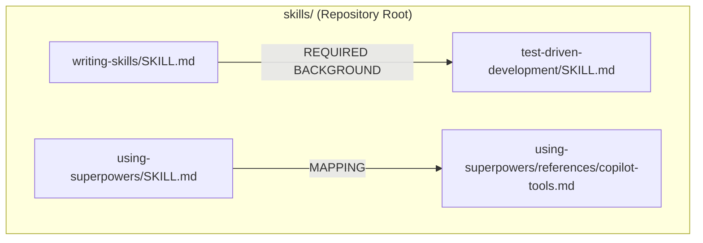
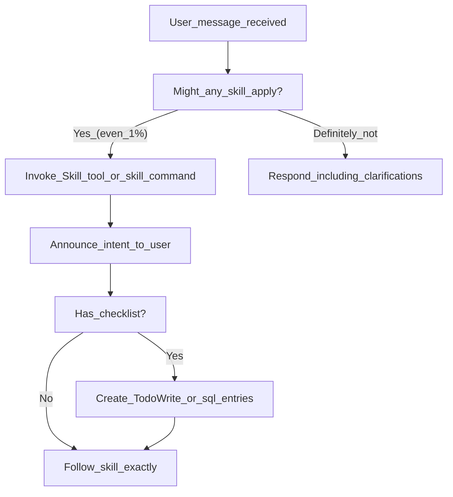

# What Are Skills

<details>
<summary>Relevant source files</summary>

The following files were used as context for generating this wiki page:

- [.gitignore](https://github.com/obra/superpowers/blob/HEAD/.gitignore)
- [CLAUDE.md](https://github.com/obra/superpowers/blob/HEAD/CLAUDE.md)
- [README.md](https://github.com/obra/superpowers/blob/HEAD/README.md)
- [skills/executing-plans/SKILL.md](https://github.com/obra/superpowers/blob/HEAD/skills/executing-plans/SKILL.md)
- [skills/writing-skills/SKILL.md](https://github.com/obra/superpowers/blob/HEAD/skills/writing-skills/SKILL.md)
- [skills/writing-skills/anthropic-best-practices.md](https://github.com/obra/superpowers/blob/HEAD/skills/writing-skills/anthropic-best-practices.md)

</details>


This page defines skills as a technical construct within the Superpowers system, explaining their structure, discovery mechanisms, and how they differ from conventional documentation. For information about how agents are required to use skills, see [3.2. The Mandatory Skill Check Protocol](10_3.2-the-mandatory-skill-check-protocol.md). For practical guidance on discovering and invoking skills, see [3.3. Finding and Invoking Skills](11_3.3-finding-and-invoking-skills.md).

## Definition

A **skill** is a structured markdown document that defines a reusable capability for AI coding assistants. Skills are stored as `SKILL.md` files with YAML frontmatter metadata and follow a standardized format designed for machine discovery and human readability [skills/writing-skills/SKILL.md:22-26](https://github.com/obra/superpowers/blob/HEAD/skills/writing-skills/SKILL.md#L22-L26).

Skills are not passive reference documentation. They are active process definitions that agents must check for and invoke before performing related tasks. The system enforces this through the `using-superpowers` meta-skill loaded at session start [skills/using-superpowers/SKILL.md:1-4](https://github.com/obra/superpowers/blob/HEAD/skills/using-superpowers/SKILL.md#L1-L4).

**Key distinguishing characteristics:**

| Characteristic | Skills | Regular Documentation |
|---------------|--------|---------------------|
| Discovery | Searchable via tool calls | Manual browsing required |
| Invocation | Platform-native tool integration | Read tool or direct file access |
| Optimization | Claude Search Optimization (CSO) | Standard technical writing |
| Validation | Pressure-tested with TDD methodology | Typically untested |
| Enforcement | Mandatory checking protocol (1% rule) | Optional reference |
| Structure | Strict YAML frontmatter + sections | Freeform markdown |

**Sources:** [README.md:204-207](https://github.com/obra/superpowers/blob/HEAD/README.md#L204-L207), [skills/using-superpowers/SKILL.md:1-16](https://github.com/obra/superpowers/blob/HEAD/skills/using-superpowers/SKILL.md#L1-L16), [skills/writing-skills/SKILL.md:10-18](https://github.com/obra/superpowers/blob/HEAD/skills/writing-skills/SKILL.md#L10-L18), [skills/writing-skills/SKILL.md:140-143](https://github.com/obra/superpowers/blob/HEAD/skills/writing-skills/SKILL.md#L140-L143)

## File Structure

### SKILL.md Format

Every skill must contain a `SKILL.md` file as its primary definition. Skills are stored in flat namespaces within the `skills/` directory [skills/writing-skills/SKILL.md:72-82](https://github.com/obra/superpowers/blob/HEAD/skills/writing-skills/SKILL.md#L72-L82). The file consists of two parts:

**YAML Frontmatter:**
```yaml
---
name: using-superpowers
description: Use when starting any conversation - establishes how to find and use skills, requiring Skill tool invocation before ANY response including clarifying questions
---
```

**Required frontmatter fields:**
- `name`: Lowercase kebab-case matching directory name. Use letters, numbers, and hyphens only [skills/writing-skills/SKILL.md:98](https://github.com/obra/superpowers/blob/HEAD/skills/writing-skills/SKILL.md#L98).
- `description`: CSO-optimized trigger description. It must be third-person and describe ONLY when to use (triggering conditions), never summarizing the workflow [skills/writing-skills/SKILL.md:99-103](https://github.com/obra/superpowers/blob/HEAD/skills/writing-skills/SKILL.md#L99-L103), [skills/writing-skills/SKILL.md:150-158](https://github.com/obra/superpowers/blob/HEAD/skills/writing-skills/SKILL.md#L150-L158).

**Standard sections defined in the library:**
1. **Overview** - Core principle in 1-2 sentences [skills/writing-skills/SKILL.md:113-114](https://github.com/obra/superpowers/blob/HEAD/skills/writing-skills/SKILL.md#L113-L114).
2. **When to Use** - Symptoms and use cases, often including a flowchart [skills/writing-skills/SKILL.md:116-120](https://github.com/obra/superpowers/blob/HEAD/skills/writing-skills/SKILL.md#L116-L120).
3. **Core Pattern** - Before/after code comparisons for techniques [skills/writing-skills/SKILL.md:122-123](https://github.com/obra/superpowers/blob/HEAD/skills/writing-skills/SKILL.md#L122-L123).
4. **Implementation** - Inline code for simple patterns or links to heavy reference files [skills/writing-skills/SKILL.md:128-130](https://github.com/obra/superpowers/blob/HEAD/skills/writing-skills/SKILL.md#L128-L130).
5. **Common Mistakes** - Loopholes and fixes [skills/writing-skills/SKILL.md:132-133](https://github.com/obra/superpowers/blob/HEAD/skills/writing-skills/SKILL.md#L132-L133).

**Sources:** [skills/writing-skills/SKILL.md:93-137](https://github.com/obra/superpowers/blob/HEAD/skills/writing-skills/SKILL.md#L93-L137), [skills/writing-skills/SKILL.md:150-158](https://github.com/obra/superpowers/blob/HEAD/skills/writing-skills/SKILL.md#L150-L158)

### Directory Structure



**Diagram: Actual Skill Directory Structure and Dependencies**

Supporting files and platform-specific mappings are bundled within the skill directory. For example, `writing-skills` explicitly requires understanding `test-driven-development` [skills/writing-skills/SKILL.md:18](https://github.com/obra/superpowers/blob/HEAD/skills/writing-skills/SKILL.md#L18). Platform mappings like `copilot-tools.md` ensure tool names are translated correctly for different harnesses [skills/using-superpowers/references/copilot-tools.md:1-21](https://github.com/obra/superpowers/blob/HEAD/skills/using-superpowers/references/copilot-tools.md#L1-L21).

**Sources:** [skills/writing-skills/SKILL.md:18](https://github.com/obra/superpowers/blob/HEAD/skills/writing-skills/SKILL.md#L18), [skills/writing-skills/SKILL.md:72-80](https://github.com/obra/superpowers/blob/HEAD/skills/writing-skills/SKILL.md#L72-L80), [skills/using-superpowers/references/copilot-tools.md:1-21](https://github.com/obra/superpowers/blob/HEAD/skills/using-superpowers/references/copilot-tools.md#L1-L21)

## Claude Search Optimization (CSO)

Skills use **Claude Search Optimization** to ensure agents discover them through semantic search. The `description` field is the primary CSO surface and is critical because Claude uses it to decide whether to load the full `SKILL.md` [skills/writing-skills/SKILL.md:140-146](https://github.com/obra/superpowers/blob/HEAD/skills/writing-skills/SKILL.md#L140-L146).

**CSO Requirements:**
1. **Trigger-focused** - Start with "Use when..." to focus on conditions [skills/writing-skills/SKILL.md:148](https://github.com/obra/superpowers/blob/HEAD/skills/writing-skills/SKILL.md#L148).
2. **Third Person** - Descriptions are injected into the system prompt; consistent POV prevents discovery issues [skills/writing-skills/anthropic-best-practices.md:189-195](https://github.com/obra/superpowers/blob/HEAD/skills/writing-skills/anthropic-best-practices.md#L189-L195).
3. **No workflow details** - If the description summarizes the process, Claude may follow the summary instead of reading the full skill content, leading to skipped steps [skills/writing-skills/SKILL.md:150-158](https://github.com/obra/superpowers/blob/HEAD/skills/writing-skills/SKILL.md#L150-L158).

**Sources:** [skills/writing-skills/SKILL.md:140-158](https://github.com/obra/superpowers/blob/HEAD/skills/writing-skills/SKILL.md#L140-L158), [skills/writing-skills/anthropic-best-practices.md:185-200](https://github.com/obra/superpowers/blob/HEAD/skills/writing-skills/anthropic-best-practices.md#L185-L200)

## Skill Types and Categories

Skills are categorized by their role and flexibility [skills/writing-skills/SKILL.md:61-71](https://github.com/obra/superpowers/blob/HEAD/skills/writing-skills/SKILL.md#L61-L71):

### Technique
A concrete method with specific steps to follow, such as `root-cause-tracing` [skills/writing-skills/SKILL.md:63-64](https://github.com/obra/superpowers/blob/HEAD/skills/writing-skills/SKILL.md#L63-L64).

### Pattern
A way of thinking about problems or code organization, such as `test-invariants` [skills/writing-skills/SKILL.md:66-67](https://github.com/obra/superpowers/blob/HEAD/skills/writing-skills/SKILL.md#L66-L67).

### Reference
Static information including API docs, syntax guides, or tool documentation [skills/writing-skills/SKILL.md:69-70](https://github.com/obra/superpowers/blob/HEAD/skills/writing-skills/SKILL.md#L69-L70).

### Flexibility Levels
As defined in authoring best practices [skills/writing-skills/anthropic-best-practices.md:59-131](https://github.com/obra/superpowers/blob/HEAD/skills/writing-skills/anthropic-best-practices.md#L59-L131):
- **Low Freedom**: Fragile operations like database migrations that must follow an exact sequence [skills/writing-skills/anthropic-best-practices.md:105-125](https://github.com/obra/superpowers/blob/HEAD/skills/writing-skills/anthropic-best-practices.md#L105-L125).
- **Medium Freedom**: Preferred patterns where some variation is acceptable [skills/writing-skills/anthropic-best-practices.md:82-89](https://github.com/obra/superpowers/blob/HEAD/skills/writing-skills/anthropic-best-practices.md#L82-L89).
- **High Freedom**: Context-dependent tasks like code reviews where multiple approaches are valid [skills/writing-skills/anthropic-best-practices.md:63-71](https://github.com/obra/superpowers/blob/HEAD/skills/writing-skills/anthropic-best-practices.md#L63-L71).

**Sources:** [skills/writing-skills/SKILL.md:61-71](https://github.com/obra/superpowers/blob/HEAD/skills/writing-skills/SKILL.md#L61-L71), [skills/writing-skills/anthropic-best-practices.md:59-131](https://github.com/obra/superpowers/blob/HEAD/skills/writing-skills/anthropic-best-practices.md#L59-L131)

## Platform Adaptation and Tool Mapping

Skills are authored using Claude Code tool names. To maintain modularity, Superpowers provides a mapping layer for other platforms like GitHub Copilot CLI [skills/using-superpowers/references/copilot-tools.md:1-3](https://github.com/obra/superpowers/blob/HEAD/skills/using-superpowers/references/copilot-tools.md#L1-L3).

### Tool Mapping Implementation

| Claude Code Tool | Copilot CLI Equivalent | Purpose |
|------------------|-----------------------|---------|
| `Skill` | `skill` [skills/using-superpowers/references/copilot-tools.md:13](https://github.com/obra/superpowers/blob/HEAD/skills/using-superpowers/references/copilot-tools.md#L13) | Invoke a skill |
| `TodoWrite` | `sql` with `todos` table [skills/using-superpowers/references/copilot-tools.md:18](https://github.com/obra/superpowers/blob/HEAD/skills/using-superpowers/references/copilot-tools.md#L18) | Task tracking |
| `Task` | `task` [skills/using-superpowers/references/copilot-tools.md:15](https://github.com/obra/superpowers/blob/HEAD/skills/using-superpowers/references/copilot-tools.md#L15) | Dispatch subagent |
| `Bash` | `bash` [skills/using-superpowers/references/copilot-tools.md:10](https://github.com/obra/superpowers/blob/HEAD/skills/using-superpowers/references/copilot-tools.md#L10) | Run commands |
| `Edit` | `edit` [skills/using-superpowers/references/copilot-tools.md:9](https://github.com/obra/superpowers/blob/HEAD/skills/using-superpowers/references/copilot-tools.md#L9) | File editing |

**Sources:** [skills/using-superpowers/references/copilot-tools.md:1-21](https://github.com/obra/superpowers/blob/HEAD/skills/using-superpowers/references/copilot-tools.md#L1-L21)

## Enforcement Mechanisms

### The 1% Rule
The core enforcement mechanism: if there is even a 1% chance a skill applies, the agent **must** invoke it [README.md:204-207](https://github.com/obra/superpowers/blob/HEAD/README.md#L204-L207).



**Diagram: Skill Invocation Logic Flow (bridging `Skill` and `TodoWrite` tool equivalents)**

### TDD for Skills
Skills are developed using a RED-GREEN-REFACTOR cycle adapted for documentation [skills/writing-skills/SKILL.md:10-14](https://github.com/obra/superpowers/blob/HEAD/skills/writing-skills/SKILL.md#L10-L14):
1. **RED**: Create a "pressure scenario" and watch the agent fail or violate rules without the skill [skills/writing-skills/SKILL.md:36-40](https://github.com/obra/superpowers/blob/HEAD/skills/writing-skills/SKILL.md#L36-L40).
2. **GREEN**: Write the minimal `SKILL.md` content required to make the agent comply [skills/writing-skills/SKILL.md:37-42](https://github.com/obra/superpowers/blob/HEAD/skills/writing-skills/SKILL.md#L37-L42).
3. **REFACTOR**: Close loopholes and find new ways the agent might rationalize ignoring the instructions [skills/writing-skills/SKILL.md:38-43](https://github.com/obra/superpowers/blob/HEAD/skills/writing-skills/SKILL.md#L38-L43).

**Sources:** [skills/writing-skills/SKILL.md:10-45](https://github.com/obra/superpowers/blob/HEAD/skills/writing-skills/SKILL.md#L10-L45), [README.md:204-207](https://github.com/obra/superpowers/blob/HEAD/README.md#L204-L207)