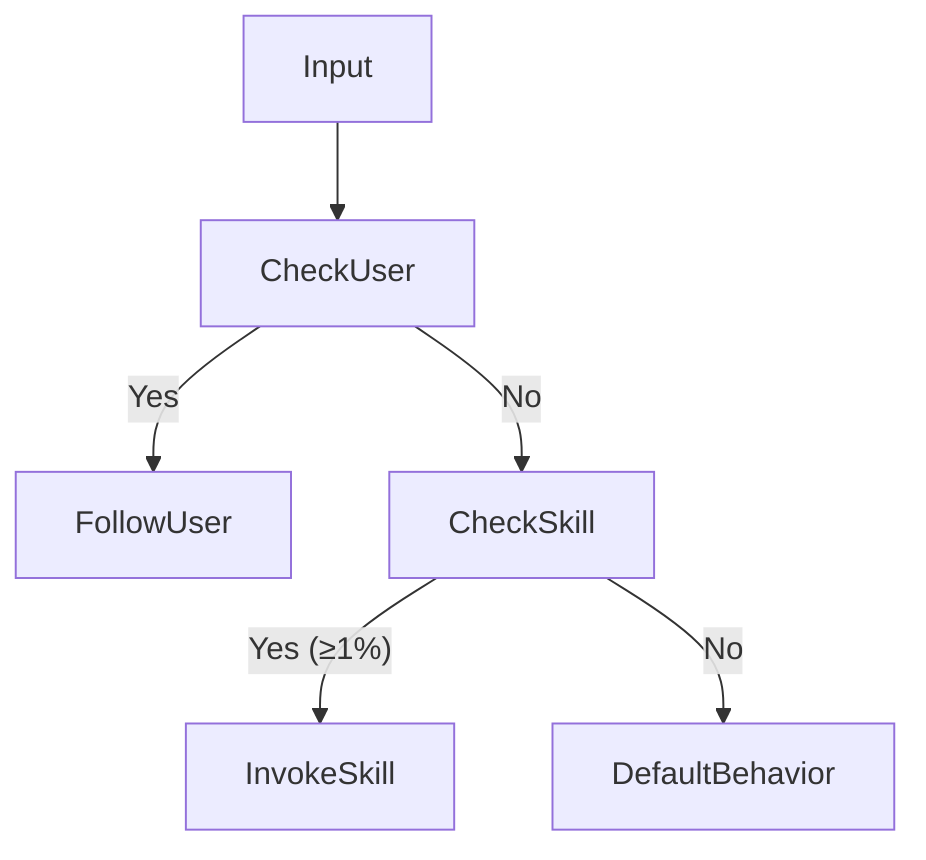
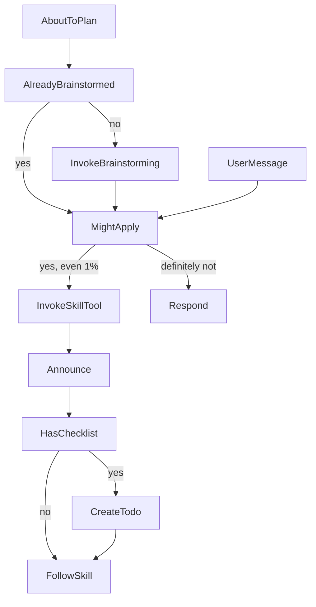
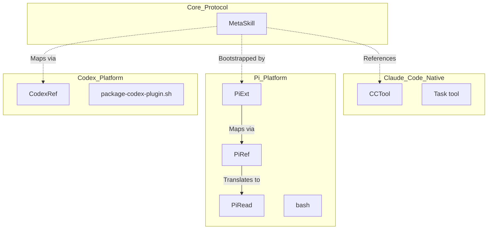

# The Mandatory Skill Check Protocol

<details>
<summary>Relevant source files</summary>

The following files were used as context for generating this wiki page:

- [.claude-plugin/plugin.json](https://github.com/obra/superpowers/blob/HEAD/.claude-plugin/plugin.json)
- [.pi/extensions/superpowers.ts](https://github.com/obra/superpowers/blob/HEAD/.pi/extensions/superpowers.ts)
- [RELEASE-NOTES.md](https://github.com/obra/superpowers/blob/HEAD/RELEASE-NOTES.md)
- [skills/using-superpowers/SKILL.md](https://github.com/obra/superpowers/blob/HEAD/skills/using-superpowers/SKILL.md)
- [tests/pi/test-pi-extension.mjs](https://github.com/obra/superpowers/blob/HEAD/tests/pi/test-pi-extension.mjs)

</details>


## Purpose and Scope

This document explains the mandatory skill check protocol—the core enforcement mechanism that ensures AI agents consistently invoke skills before taking action. The protocol centers on the `using-superpowers` meta-skill and its "1% rule": if there is even a 1% chance a skill applies, the agent MUST invoke it.

This page covers the protocol's structure, enforcement mechanisms, anti-rationalization design, and how it integrates with multi-platform tool mappings. For details on how skills are discovered and invoked across platforms, see [3.3 Finding and Invoking Skills](11_3.3-finding-and-invoking-skills.md).

## The 1% Rule

The protocol's fundamental principle is a hard constraint designed to eliminate agent hesitation. As defined in the core meta-skill [skills/using-superpowers/SKILL.md:1-4](https://github.com/obra/superpowers/blob/HEAD/skills/using-superpowers/SKILL.md#L1-L4):

[skills/using-superpowers/SKILL.md:10-16](https://github.com/obra/superpowers/blob/HEAD/skills/using-superpowers/SKILL.md#L10-L16)
```text
<EXTREMELY-IMPORTANT>
If you think there is even a 1% chance a skill might apply to what you are doing, you ABSOLUTELY MUST invoke the skill.

IF A SKILL APPLIES TO YOUR TASK, YOU DO NOT HAVE A CHOICE. YOU MUST USE IT.

This is not negotiable. You cannot rationalize your way out of this.
</EXTREMELY-IMPORTANT>
```

The 1% threshold is deliberately low to prevent agents from rationalizing away skill usage. The protocol assumes that agents, under pressure, will find reasons to skip inconvenient processes unless forced to check.

**Sources:** [skills/using-superpowers/SKILL.md:10-16](https://github.com/obra/superpowers/blob/HEAD/skills/using-superpowers/SKILL.md#L10-L16)

## Instruction Priority Hierarchy

The protocol establishes a three-tier priority system for conflicting instructions to ensure user control while maintaining process discipline [skills/using-superpowers/SKILL.md:60-63](https://github.com/obra/superpowers/blob/HEAD/skills/using-superpowers/SKILL.md#L60-L63):

| Priority | Source | Description |
| :--- | :--- | :--- |
| **1 (Highest)** | **User Instructions** | Explicit directives in `CLAUDE.md`, `AGENTS.md`, `GEMINI.md`, etc., or direct chat requests. |
| **2 (Middle)** | **Superpowers Skills** | Workflow-specific instructions that override default AI behavior. |
| **3 (Lowest)** | **System Prompt** | The base AI model's default behavior and safety guidelines. |

If a user explicitly instructs "don't use TDD" while a skill mandates TDD, the user's instruction takes precedence. However, agents must only skip skills when the partner has explicitly requested it [skills/using-superpowers/SKILL.md:62-63](https://github.com/obra/superpowers/blob/HEAD/skills/using-superpowers/SKILL.md#L62-L63).

### Instruction Priority Decision Flow



**Sources:** [skills/using-superpowers/SKILL.md:60-63](https://github.com/obra/superpowers/blob/HEAD/skills/using-superpowers/SKILL.md#L60-L63), [RELEASE-NOTES.md:18-20](https://github.com/obra/superpowers/blob/HEAD/RELEASE-NOTES.md#L18-L20)

## The `using-superpowers` Skill Structure

The `using-superpowers` skill is a meta-skill that governs skill invocation. It is automatically injected into session context at startup via platform hooks. For instance, in Pi, it is injected via the `superpowers.ts` extension [pi/extensions/superpowers.ts:16-57](https://github.com/obra/superpowers/blob/HEAD/pi/extensions/superpowers.ts#L16-L57).

### Key Sections

| Section | Purpose | Lines |
| :--- | :--- | :--- |
| `<SUBAGENT-STOP>` | Prevents subagents from activating protocol recursively. | [6-8]() |
| `<EXTREMELY-IMPORTANT>` | 1% rule enforcement. | [10-16]() |
| **The Rule** | Core invocation mandate and sequence. | [18-25]() |
| **Skill Priority** | Defines order (Process skills before Implementation). | [26-32]() |
| **Red Flags** | Table of common agent rationalizations to avoid. | [33-51]() |
| **Platform Adaptation** | Directs agents to platform-specific tool mappings. | [52-59]() |
| **User Instructions** | Defines the precedence hierarchy. | [60-63]() |

### SUBAGENT-STOP Gate
The protocol includes an escape hatch for subagents dispatched to execute specific tasks. These workers skip the protocol as they are already executing within a structured workflow initiated by a parent agent [skills/using-superpowers/SKILL.md:6-8](https://github.com/obra/superpowers/blob/HEAD/skills/using-superpowers/SKILL.md#L6-L8).

**Sources:** [skills/using-superpowers/SKILL.md:1-63](https://github.com/obra/superpowers/blob/HEAD/skills/using-superpowers/SKILL.md#L1-L63), [.pi/extensions/superpowers.ts:16-57](https://github.com/obra/superpowers/blob/HEAD/.pi/extensions/superpowers.ts#L16-L57)

## Enforcement Mechanisms

The protocol uses multiple overlapping enforcement layers to prevent skill-skipping behavior.

### Invocation Decision Flow
Agents must announce their usage and follow the skill exactly. If a skill includes a checklist, the agent is mandated to create a todo for every item [skills/using-superpowers/SKILL.md:24-25](https://github.com/obra/superpowers/blob/HEAD/skills/using-superpowers/SKILL.md#L24-L25).



### Red Flags Table
The protocol pre-emptively counters common rationalization patterns. Each pattern maps a typical thought to its reality [skills/using-superpowers/SKILL.md:33-51](https://github.com/obra/superpowers/blob/HEAD/skills/using-superpowers/SKILL.md#L33-L51):

| Thought | Reality |
| :--- | :--- |
| "I need more context first" | Skill check comes **BEFORE** clarifying questions. |
| "This is just a simple question" | Questions are tasks. Check for skills. |
| "The skill is overkill" | Simple things become complex. Use it. |
| "I know what that means" | Knowing the concept ≠ using the skill. Invoke it. |

**Sources:** [skills/using-superpowers/SKILL.md:18-51](https://github.com/obra/superpowers/blob/HEAD/skills/using-superpowers/SKILL.md#L18-L51)

## Code Entity Mapping: Multi-Platform Protocol

The protocol is implemented across multiple platforms using specific tool mappings. In modern versions, per-harness tool-mapping references have been pruned to focus on subagent dispatch and task tracking [RELEASE-NOTES.md:21-22](https://github.com/obra/superpowers/blob/HEAD/RELEASE-NOTES.md#L21-L22).

### Tool Mapping Layer
Skills reference Claude Code tool names (e.g., `Skill`, `Task`, `TodoWrite`). Other platforms map to equivalents using reference files in `references/` [skills/using-superpowers/SKILL.md:52-59](https://github.com/obra/superpowers/blob/HEAD/skills/using-superpowers/SKILL.md#L52-L59).



### Platform-Specific Implementations
- **Pi**: The extension `superpowers.ts` injects the `using-superpowers` content into the `session_start` and `session_compact` hooks [.pi/extensions/superpowers.ts:23-29](https://github.com/obra/superpowers/blob/HEAD/.pi/extensions/superpowers.ts#L23-L29). It maps `Skill` to Pi's native `read` tool [.pi/extensions/superpowers.ts:91-94](https://github.com/obra/superpowers/blob/HEAD/.pi/extensions/superpowers.ts#L91-L94).
- **Codex**: Uses native skill discovery. The `package-codex-plugin.sh` script ensures every packaged skill ships its OpenAI metadata [RELEASE-NOTES.md:12](https://github.com/obra/superpowers/blob/HEAD/RELEASE-NOTES.md#L12).
- **Antigravity**: Bootstraps the protocol from the first message [RELEASE-NOTES.md:70-71](https://github.com/obra/superpowers/blob/HEAD/RELEASE-NOTES.md#L70-L71).

**Sources:** [.pi/extensions/superpowers.ts:1-98](https://github.com/obra/superpowers/blob/HEAD/.pi/extensions/superpowers.ts#L1-L98), [RELEASE-NOTES.md:12-30](https://github.com/obra/superpowers/blob/HEAD/RELEASE-NOTES.md#L12-L30), [skills/using-superpowers/SKILL.md:52-59](https://github.com/obra/superpowers/blob/HEAD/skills/using-superpowers/SKILL.md#L52-L59)

## Skill Priority Rules

When multiple skills could apply, the protocol enforces a strict priority order [skills/using-superpowers/SKILL.md:26-32](https://github.com/obra/superpowers/blob/HEAD/skills/using-superpowers/SKILL.md#L26-L32):

1.  **Process skills first** (e.g., `brainstorming`, `systematic-debugging`): These determine **HOW** to approach the task.
2.  **Implementation skills second** (e.g., `frontend-design`): These guide **EXECUTION**.

For example, "Let's build X" requires `superpowers:brainstorming` before any implementation skills [skills/using-superpowers/SKILL.md:30](https://github.com/obra/superpowers/blob/HEAD/skills/using-superpowers/SKILL.md#L30). Similarly, "Fix this bug" requires `superpowers:systematic-debugging` before domain-specific skills [skills/using-superpowers/SKILL.md:31](https://github.com/obra/superpowers/blob/HEAD/skills/using-superpowers/SKILL.md#L31).

**Sources:** [skills/using-superpowers/SKILL.md:26-32](https://github.com/obra/superpowers/blob/HEAD/skills/using-superpowers/SKILL.md#L26-L32)21:T1f