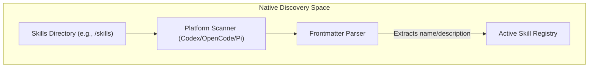
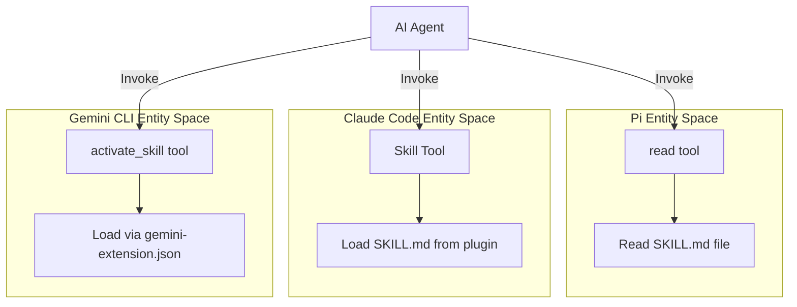
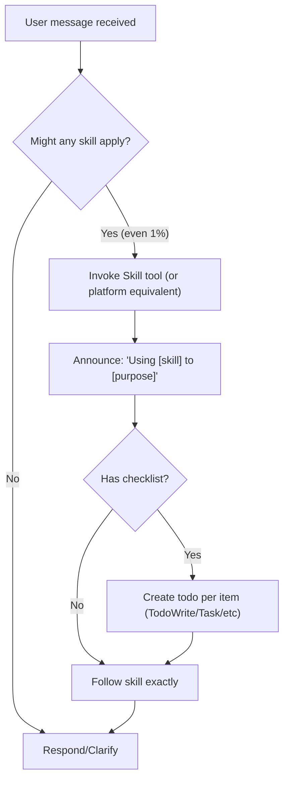

# Finding and Invoking Skills

Relevant source files

The following files were used as context for generating this wiki page:

- [.pi/extensions/superpowers.ts](https://github.com/obra/superpowers/blob/HEAD/.pi/extensions/superpowers.ts)
- [skills/executing-plans/SKILL.md](https://github.com/obra/superpowers/blob/HEAD/skills/executing-plans/SKILL.md)
- [skills/using-superpowers/SKILL.md](https://github.com/obra/superpowers/blob/HEAD/skills/using-superpowers/SKILL.md)
- [skills/writing-skills/SKILL.md](https://github.com/obra/superpowers/blob/HEAD/skills/writing-skills/SKILL.md)
- [skills/writing-skills/anthropic-best-practices.md](https://github.com/obra/superpowers/blob/HEAD/skills/writing-skills/anthropic-best-practices.md)
- [tests/pi/test-pi-extension.mjs](https://github.com/obra/superpowers/blob/HEAD/tests/pi/test-pi-extension.mjs)

## Purpose and Scope

This page explains how AI agents find and invoke skills in the Superpowers system across multiple platforms. It documents the platform-specific tools used to load skills (like `Skill`, `skill`, `activate_skill`, and `read`), the discovery mechanisms (native vs. extension-driven), and the mandatory protocol for skill activation.

For the protocol governing *when* agents check for skills (the 1% rule), see page 3.2. For the priority system (Project > Personal > Superpowers), see page 3.4.

Sources: [skills/using-superpowers/SKILL.md:1-4](https://github.com/obra/superpowers/blob/HEAD/skills/using-superpowers/SKILL.md#L1-L4), [skills/using-superpowers/SKILL.md:26-32](https://github.com/obra/superpowers/blob/HEAD/skills/using-superpowers/SKILL.md#L26-L32)

---

## Skill Discovery Mechanisms

Skills are discovered through three primary mechanisms: **Native Skill Discovery** (Codex/OpenCode/Pi), **Plugin-Driven Injection** (Claude Code/Cursor), and **Metadata Loading** (Gemini CLI).

### Native Skill Discovery (Codex, OpenCode, and Pi)

These platforms support native skill discovery by scanning specific directories for `SKILL.md` files containing YAML frontmatter.

- **Codex:** Scans `~/.agents/skills/`. The Superpowers repository is typically linked via a symlink or Windows junction at `~/.agents/skills/superpowers` [[skills/using-superpowers/SKILL.md:56-56](https://github.com/obra/superpowers/blob/HEAD/[skills/using-superpowers/SKILL.md:56-56).
- **OpenCode:** Discovers skills via the `config` hook in the `SuperpowersPlugin`. It injects the `superpowersSkillsDir` into the `config.skills.paths` array at runtime.
- **Pi:** The Pi extension uses the `resources_discover` hook to contribute the `skillsDir` to the agent's searchable path [[.pi/extensions/superpowers.ts:19-21](https://github.com/obra/superpowers/blob/HEAD/[.pi/extensions/superpowers.ts:19-21), [tests/pi/test-pi-extension.mjs:63-70](https://github.com/obra/superpowers/blob/HEAD/tests/pi/test-pi-extension.mjs#L63-L70).

**Discovery Logic Flow**

Sources: [.pi/extensions/superpowers.ts:19-21](https://github.com/obra/superpowers/blob/HEAD/.pi/extensions/superpowers.ts#L19-L21), [tests/pi/test-pi-extension.mjs:63-70](https://github.com/obra/superpowers/blob/HEAD/tests/pi/test-pi-extension.mjs#L63-L70), [skills/using-superpowers/SKILL.md:56-58](https://github.com/obra/superpowers/blob/HEAD/skills/using-superpowers/SKILL.md#L56-L58)

### Bootstrap Context Injection

To ensure agents are aware of the skill system before they even search for a specific skill, the `using-superpowers` content is injected into the initial session context.

- **Pi Extension:** The extension listens for `session_start` and `context` events [[.pi/extensions/superpowers.ts:23-35](https://github.com/obra/superpowers/blob/HEAD/[.pi/extensions/superpowers.ts:23-35). It reads `using-superpowers/SKILL.md`, strips the frontmatter, and injects it as a `user` message wrapped in an `<EXTREMELY_IMPORTANT>` marker [[.pi/extensions/superpowers.ts:59-81](https://github.com/obra/superpowers/blob/HEAD/[.pi/extensions/superpowers.ts:59-81). This occurs at the start of a session and after a `session_compact` event to ensure the instructions remain in the context window [[.pi/extensions/superpowers.ts:27-29](https://github.com/obra/superpowers/blob/HEAD/[.pi/extensions/superpowers.ts:27-29), [tests/pi/test-pi-extension.mjs:103-119](https://github.com/obra/superpowers/blob/HEAD/tests/pi/test-pi-extension.mjs#L103-L119).
- **Gemini CLI:** The `GEMINI.md` file (if present) serves as the primary context injector, often including instructions on how to use the `activate_skill` tool.

Sources: [.pi/extensions/superpowers.ts:23-56](https://github.com/obra/superpowers/blob/HEAD/.pi/extensions/superpowers.ts#L23-L56), [.pi/extensions/superpowers.ts:59-81](https://github.com/obra/superpowers/blob/HEAD/.pi/extensions/superpowers.ts#L59-L81), [tests/pi/test-pi-extension.mjs:72-90](https://github.com/obra/superpowers/blob/HEAD/tests/pi/test-pi-extension.mjs#L72-L90)

---

## Invocation via Platform Tools

When an agent identifies that a skill applies, it uses a platform-specific tool to load the full skill definition. 

| Platform | Invocation Tool | Discovery Mechanism |
| :--- | :--- | :--- |
| **Claude Code** | `Skill` | Native plugin search [[skills/using-superpowers/SKILL.md:30-30](https://github.com/obra/superpowers/blob/HEAD/[skills/using-superpowers/SKILL.md:30-30)] |
| **OpenCode** | `skill` | Native `skill` tool (registers via `config` hook) |
| **Codex** | *Automatic* | Native discovery; activated by name or description [[skills/using-superpowers/SKILL.md:56-56](https://github.com/obra/superpowers/blob/HEAD/[skills/using-superpowers/SKILL.md:56-56)] |
| **Gemini CLI** | `activate_skill` | Metadata loaded via `gemini-extension.json` |
| **Pi** | `read` | Native skill system or manual `read` of `SKILL.md` [[.pi/extensions/superpowers.ts:89-92](https://github.com/obra/superpowers/blob/HEAD/[.pi/extensions/superpowers.ts:89-92)] |

**Mapping Invocation to Code Entity Tools**

Sources: [.pi/extensions/superpowers.ts:89-92](https://github.com/obra/superpowers/blob/HEAD/.pi/extensions/superpowers.ts#L89-L92), [skills/using-superpowers/SKILL.md:30-34](https://github.com/obra/superpowers/blob/HEAD/skills/using-superpowers/SKILL.md#L30-L34), [tests/pi/test-pi-extension.mjs:121-128](https://github.com/obra/superpowers/blob/HEAD/tests/pi/test-pi-extension.mjs#L121-L128)

---

## The Skill Invocation Protocol

The `using-superpowers` skill defines a strict workflow for how skills must be used once identified.

### The 1% Rule and Announcement
If there is even a 1% chance a skill applies, the agent MUST invoke it [[skills/using-superpowers/SKILL.md:10-16](https://github.com/obra/superpowers/blob/HEAD/[skills/using-superpowers/SKILL.md:10-16)]. This is non-negotiable and applies before clarifying questions or codebase exploration [[skills/using-superpowers/SKILL.md:18-20](https://github.com/obra/superpowers/blob/HEAD/[skills/using-superpowers/SKILL.md:18-20). Upon invocation, the agent must announce: `"Using [skill] to [purpose]"` [[skills/using-superpowers/SKILL.md:24-24](https://github.com/obra/superpowers/blob/HEAD/[skills/using-superpowers/SKILL.md:24-24)].

### Logic Flow
The following flowchart illustrates the decision process:

**Skill Invocation Logic Gate**

Sources: [skills/using-superpowers/SKILL.md:10-25](https://github.com/obra/superpowers/blob/HEAD/skills/using-superpowers/SKILL.md#L10-L25), [skills/using-superpowers/SKILL.md:33-51](https://github.com/obra/superpowers/blob/HEAD/skills/using-superpowers/SKILL.md#L33-L51)

---

## Cross-Platform Tool Mapping

Skills are written using Claude Code tool names (e.g., `TodoWrite`, `Task`). Other platforms map these to their native equivalents via documentation injected into the context.

### Mapping Table

| Claude Code Tool | Pi Equivalent | Codex Equivalent |
| :--- | :--- | :--- |
| `Skill` | `read` (manual load) [[.pi/extensions/superpowers.ts:91-91](https://github.com/obra/superpowers/blob/HEAD/[.pi/extensions/superpowers.ts:91-91)] | *Native* [[skills/using-superpowers/SKILL.md:56-56](https://github.com/obra/superpowers/blob/HEAD/[skills/using-superpowers/SKILL.md:56-56)] |
| `TodoWrite` | Plan files or `TODO.md` [[.pi/extensions/superpowers.ts:97-97](https://github.com/obra/superpowers/blob/HEAD/[.pi/extensions/superpowers.ts:97-97)] | `update_plan` |
| `Task` (Subagent) | `subagent` (if installed) [[.pi/extensions/superpowers.ts:95-95](https://github.com/obra/superpowers/blob/HEAD/[.pi/extensions/superpowers.ts:95-95)] | `spawn_agent` |
| `Read` | `read` [[.pi/extensions/superpowers.ts:93-93](https://github.com/obra/superpowers/blob/HEAD/[.pi/extensions/superpowers.ts:93-93)] | `read` |
| `Bash` | `bash` [[.pi/extensions/superpowers.ts:93-93](https://github.com/obra/superpowers/blob/HEAD/[.pi/extensions/superpowers.ts:93-93)] | `bash` |

### Pi Specific Mappings
Pi does not expose a native `Skill` tool like Claude Code. The Superpowers Pi extension explicitly instructs the agent to use Pi's native `read` tool to load `SKILL.md` files when a skill applies [[.pi/extensions/superpowers.ts:89-92](https://github.com/obra/superpowers/blob/HEAD/[.pi/extensions/superpowers.ts:89-92). For task tracking, Pi agents are instructed to use repo-local `TODO.md` files or plan files if a dedicated task tool is unavailable [[.pi/extensions/superpowers.ts:96-97](https://github.com/obra/superpowers/blob/HEAD/[.pi/extensions/superpowers.ts:96-97).

Sources: [.pi/extensions/superpowers.ts:88-98](https://github.com/obra/superpowers/blob/HEAD/.pi/extensions/superpowers.ts#L88-L98), [tests/pi/test-pi-extension.mjs:121-128](https://github.com/obra/superpowers/blob/HEAD/tests/pi/test-pi-extension.mjs#L121-L128), [skills/using-superpowers/SKILL.md:56-58](https://github.com/obra/superpowers/blob/HEAD/skills/using-superpowers/SKILL.md#L56-L58)