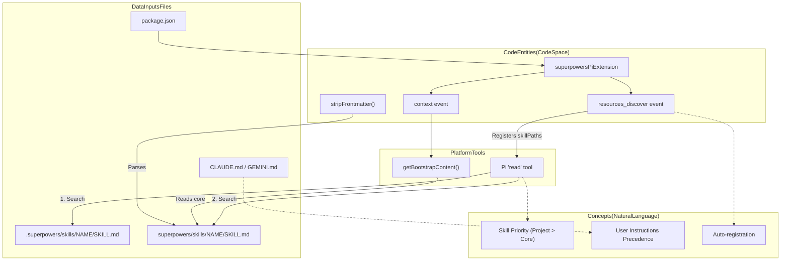
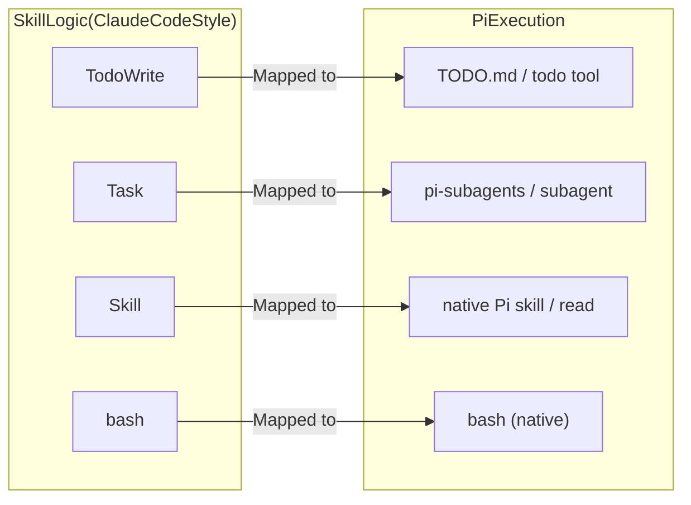

# Skill Priority and Overriding

<details>
<summary>Relevant source files</summary>

The following files were used as context for generating this wiki page:

- [.gitignore](https://github.com/obra/superpowers/blob/HEAD/.gitignore)
- [.pi/extensions/superpowers.ts](https://github.com/obra/superpowers/blob/HEAD/.pi/extensions/superpowers.ts)
- [CLAUDE.md](https://github.com/obra/superpowers/blob/HEAD/CLAUDE.md)
- [README.md](https://github.com/obra/superpowers/blob/HEAD/README.md)
- [skills/using-superpowers/SKILL.md](https://github.com/obra/superpowers/blob/HEAD/skills/using-superpowers/SKILL.md)
- [tests/pi/test-pi-extension.mjs](https://github.com/obra/superpowers/blob/HEAD/tests/pi/test-pi-extension.mjs)

</details>


This page explains how the Superpowers system resolves conflicts when the same skill name exists in multiple locations. It details the three-tier priority order, the directory paths that define each tier across platforms, and the shadowing mechanism that allows for project-specific or user-specific overrides of the core library.

## The Three-Tier Priority System

When an agent or user requests a skill by name, the runtime searches skill locations in a fixed priority order. This "shadowing" mechanism allows users and projects to customize workflows without modifying the core Superpowers repository.

| Priority | Tier | Purpose | Typical Location |
| :--- | :--- | :--- | :--- |
| 1 (Highest) | **User Instructions** | Direct explicit instructions in specific context files. | `CLAUDE.md`, `GEMINI.md`, `AGENTS.md` |
| 2 | **Project Skills** | Project-specific workflows (e.g., custom TDD rules for a specific repo). | `.claude/skills/`, `.superpowers/skills/` |
| 3 | **Personal Skills** | User-specific preferences across all projects. | `~/.config/superpowers/skills/` |
| 4 (Lowest) | **Superpowers** | Standard library provided by the Superpowers repository. | `.../superpowers/skills/` |

**Note on Precedence:** Explicit user instructions (e.g., `CLAUDE.md`, `GEMINI.md`, `AGENTS.md`) always take the highest precedence over any skill [skills/using-superpowers/SKILL.md:62-63](https://github.com/obra/superpowers/blob/HEAD/skills/using-superpowers/SKILL.md#L62-L63). If a skill says "always use TDD" but `CLAUDE.md` says "don't use TDD," the user instruction wins [skills/using-superpowers/SKILL.md:62-63](https://github.com/obra/superpowers/blob/HEAD/skills/using-superpowers/SKILL.md#L62-L63).

Sources: [skills/using-superpowers/SKILL.md:26-32](https://github.com/obra/superpowers/blob/HEAD/skills/using-superpowers/SKILL.md#L26-L32), [skills/using-superpowers/SKILL.md:60-63](https://github.com/obra/superpowers/blob/HEAD/skills/using-superpowers/SKILL.md#L60-L63), [.gitignore:3-4](https://github.com/obra/superpowers/blob/HEAD/.gitignore#L3-L4)

---

## Technical Implementation: Resolution Logic

The resolution logic determines which physical file on disk corresponds to a requested skill name. In platform integrations like **Pi**, the system uses a resource discovery mechanism to locate these paths.

### Logic Flow
1. **Resource Discovery**: The system registers the core `skills` directory during startup [package.json:50-50](https://github.com/obra/superpowers/blob/HEAD/package.json#L50), [.pi/extensions/superpowers.ts:19-21](https://github.com/obra/superpowers/blob/HEAD/.pi/extensions/superpowers.ts#L19-L21).
2. **Path Precedence**: Platforms search registered skill paths in order. Local project paths are typically prioritized by the harness before the plugin-provided library path [skills/using-superpowers/SKILL.md:26-32](https://github.com/obra/superpowers/blob/HEAD/skills/using-superpowers/SKILL.md#L26-L32).
3. **Skill Discovery**: The system looks for a directory matching the skill name containing a `SKILL.md` file with valid YAML frontmatter [skills/using-superpowers/SKILL.md:1-4](https://github.com/obra/superpowers/blob/HEAD/skills/using-superpowers/SKILL.md#L1-L4), [.pi/extensions/superpowers.ts:83-86](https://github.com/obra/superpowers/blob/HEAD/.pi/extensions/superpowers.ts#L83-L86).
4. **Tool Execution**: When the `Skill` tool (or platform equivalent like `read` in Pi) is called, it loads the content of the first `SKILL.md` found in the prioritized path list [.pi/extensions/superpowers.ts:89-91](https://github.com/obra/superpowers/blob/HEAD/.pi/extensions/superpowers.ts#L89-L91).

### Code Entity Space to Natural Language Space

The following diagram maps the logical priority concepts to the specific code entities and configuration hooks that implement them in the Pi integration.

Title: "Mapping Priority Logic to Pi Code Entities"

Sources: [.pi/extensions/superpowers.ts:16-57](https://github.com/obra/superpowers/blob/HEAD/.pi/extensions/superpowers.ts#L16-L57), [.pi/extensions/superpowers.ts:59-81](https://github.com/obra/superpowers/blob/HEAD/.pi/extensions/superpowers.ts#L59-L81), [package.json:50-51](https://github.com/obra/superpowers/blob/HEAD/package.json#L50-L51), [skills/using-superpowers/SKILL.md:62-63](https://github.com/obra/superpowers/blob/HEAD/skills/using-superpowers/SKILL.md#L62-L63)

---

## The Bootstrap Mechanism and Priority

Unlike standard skills which are loaded on demand via tools, the `using-superpowers` meta-skill is injected automatically at the start of every session to establish the "1% Rule" and instruction priority [skills/using-superpowers/SKILL.md:10-16](https://github.com/obra/superpowers/blob/HEAD/skills/using-superpowers/SKILL.md#L10-L16), [.pi/extensions/superpowers.ts:35-57](https://github.com/obra/superpowers/blob/HEAD/.pi/extensions/superpowers.ts#L35-L57).

1. **Injection Point**: The `context` hook (in Pi) or session-start hooks (in other harnesses) modify the message stream to include bootstrap content [.pi/extensions/superpowers.ts:35-57](https://github.com/obra/superpowers/blob/HEAD/.pi/extensions/superpowers.ts#L35-L57).
2. **Content Source**: It specifically loads the core `using-superpowers/SKILL.md` from the plugin's internal directory to ensure the base protocol is always available [.pi/extensions/superpowers.ts:12-14](https://github.com/obra/superpowers/blob/HEAD/.pi/extensions/superpowers.ts#L12-L14), [.pi/extensions/superpowers.ts:59-81](https://github.com/obra/superpowers/blob/HEAD/.pi/extensions/superpowers.ts#L59-L81).
3. **Tool Mapping**: The bootstrap process also injects a platform-specific tool mapping (e.g., mapping `Skill` to `read` or `Task` to `subagent`) to ensure skills written for Claude Code function correctly in other environments [.pi/extensions/superpowers.ts:88-97](https://github.com/obra/superpowers/blob/HEAD/.pi/extensions/superpowers.ts#L88-L97).

Sources: [.pi/extensions/superpowers.ts:35-57](https://github.com/obra/superpowers/blob/HEAD/.pi/extensions/superpowers.ts#L35-L57), [.pi/extensions/superpowers.ts:59-81](https://github.com/obra/superpowers/blob/HEAD/.pi/extensions/superpowers.ts#L59-L81), [.pi/extensions/superpowers.ts:88-97](https://github.com/obra/superpowers/blob/HEAD/.pi/extensions/superpowers.ts#L88-L97)

---

## Platform-Specific Priority and Tool Mapping

While the priority logic remains consistent, the directory structures and tool names vary by platform.

### Directory Mapping
* **Claude Code Project**: `.claude/skills/` [README.md:36-38](https://github.com/obra/superpowers/blob/HEAD/README.md#L36-L38).
* **Pi Integration**: Registered via `skillPaths` in `resources_discover` [.pi/extensions/superpowers.ts:19-21](https://github.com/obra/superpowers/blob/HEAD/.pi/extensions/superpowers.ts#L19-L21).
* **Gemini CLI**: Driven by `GEMINI.md` context file [README.md:186-186](https://github.com/obra/superpowers/blob/HEAD/README.md#L186).

### Tool Mapping and Execution
When a skill is loaded, it may refer to tools that exist under different names. The system handles this through a mapping layer defined during bootstrap.

Title: "Cross-Platform Tool Mapping (Pi Example)"

Sources: [.pi/extensions/superpowers.ts:88-97](https://github.com/obra/superpowers/blob/HEAD/.pi/extensions/superpowers.ts#L88-L97), [tests/pi/test-pi-extension.mjs:121-128](https://github.com/obra/superpowers/blob/HEAD/tests/pi/test-pi-extension.mjs#L121-L128), [skills/using-superpowers/SKILL.md:52-59](https://github.com/obra/superpowers/blob/HEAD/skills/using-superpowers/SKILL.md#L52-L59)

---

## Creating Overrides

To create an override, a developer places a `SKILL.md` file in a higher-priority directory using the same directory name as the skill they wish to shadow.

1. **Identify the target**: e.g., `brainstorming`.
2. **Create the directory**: `mkdir -p .superpowers/skills/brainstorming`.
3. **Define the skill**: Create `SKILL.md` with the required frontmatter.

**Example Override Structure:**
```text
my-project/
├── .superpowers/
│   └── skills/
│       └── brainstorming/
│           └── SKILL.md  <-- This will be used instead of the core skill
└── src/
```

Sources: [skills/using-superpowers/SKILL.md:26-32](https://github.com/obra/superpowers/blob/HEAD/skills/using-superpowers/SKILL.md#L26-L32), [.gitignore:4-4](https://github.com/obra/superpowers/blob/HEAD/.gitignore#L4)23:T2003,# Architecture

<details>
<