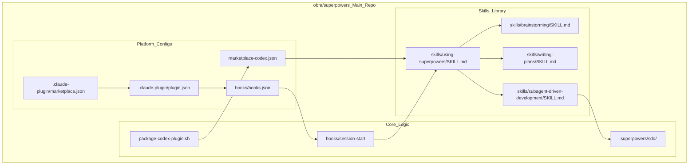
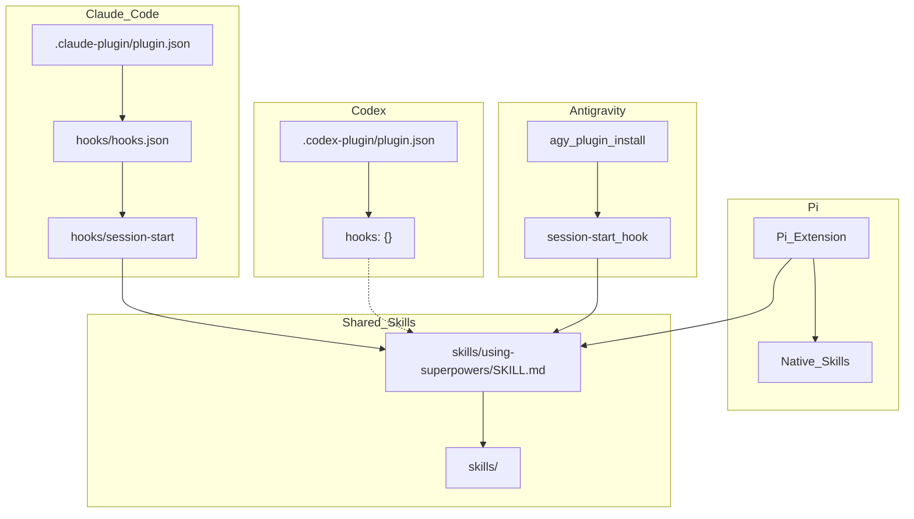

# Architecture

Relevant source files

The following files were used as context for generating this wiki page:

- [.claude-plugin/plugin.json](https://github.com/obra/superpowers/blob/HEAD/.claude-plugin/plugin.json)
- [.gitignore](https://github.com/obra/superpowers/blob/HEAD/.gitignore)
- [CLAUDE.md](https://github.com/obra/superpowers/blob/HEAD/CLAUDE.md)
- [README.md](https://github.com/obra/superpowers/blob/HEAD/README.md)
- [RELEASE-NOTES.md](https://github.com/obra/superpowers/blob/HEAD/RELEASE-NOTES.md)

This page describes the overall structure of `obra/superpowers`, its major components, and how it integrates with multiple AI coding platforms. It covers scope at the system level; see child pages for subsystem detail: [Dual Repository Design](14_4.1-dual-repository-design.md), [Skills Repository Management](15_4.2-skills-repository-management.md), [Multi-Platform Integration](16_4.3-multi-platform-integration.md), [Session Lifecycle and Bootstrap](17_4.4-session-lifecycle-and-bootstrap.md), [Skills Discovery and Resolution](18_4.5-skills-discovery-and-resolution.md), and [Tool Mapping Layer](19_4.6-tool-mapping-layer.md).

---

## System Overview

Superpowers uses a **unified repository architecture** to consolidate platform shims and the skills library into a single codebase, simplifying installation and versioning.

The system consists of:

- **Platform Manifests**: Configuration files like `.claude-plugin/plugin.json`, `hooks/hooks.json`, and `.codex-plugin/plugin.json` that register Superpowers with various AI environments. [[.claude-plugin/plugin.json:1-20](https://github.com/obra/superpowers/blob/HEAD/[.claude-plugin/plugin.json:1-20)] [[RELEASE-NOTES.md:47-48](https://github.com/obra/superpowers/blob/HEAD/[RELEASE-NOTES.md:47-48)]
- **Session Hooks**: Scripts in `hooks/` (e.g., `hooks/session-start`) that inject bootstrap context and the `using-superpowers` meta-skill at the start of every session. [[RELEASE-NOTES.md:7-8](https://github.com/obra/superpowers/blob/HEAD/[RELEASE-NOTES.md:7-8)] [[RELEASE-NOTES.md:18-20](https://github.com/obra/superpowers/blob/HEAD/[RELEASE-NOTES.md:18-20)]
- **Skills Library**: A collection of modular markdown files in `skills/` that define workflows like `brainstorming`, `writing-plans`, and `subagent-driven-development`. [[README.md:189-202](https://github.com/obra/superpowers/blob/HEAD/[README.md:189-202)] [[.claude-plugin/plugin.json:3-4](https://github.com/obra/superpowers/blob/HEAD/[.claude-plugin/plugin.json:3-4)]
- **Tool Mapping Layer**: Logic and documentation that translates platform-specific tools into a consistent interface. In v6.1.0, this layer was pruned to focus on essential harness-specific notes like subagent dispatch and task tracking. [[RELEASE-NOTES.md:21-22](https://github.com/obra/superpowers/blob/HEAD/[RELEASE-NOTES.md:21-22)]

The central design goal is that agents automatically discover and invoke skills. By providing a `using-superpowers` skill as the entry point, the agent is instructed to check the `skills/` directory before performing any task.

Sources: [.claude-plugin/plugin.json:1-20](https://github.com/obra/superpowers/blob/HEAD/.claude-plugin/plugin.json#L1-L20), [RELEASE-NOTES.md:18-22](https://github.com/obra/superpowers/blob/HEAD/RELEASE-NOTES.md#L18-L22), [README.md:189-202](https://github.com/obra/superpowers/blob/HEAD/README.md#L189-L202)

---

## Repository Architecture

**Diagram: Repository Structure and Platform Entry Points**

Sources: [.claude-plugin/plugin.json:1-20](https://github.com/obra/superpowers/blob/HEAD/.claude-plugin/plugin.json#L1-L20), [RELEASE-NOTES.md:10-12](https://github.com/obra/superpowers/blob/HEAD/RELEASE-NOTES.md#L10-L12), [RELEASE-NOTES.md:25-26](https://github.com/obra/superpowers/blob/HEAD/RELEASE-NOTES.md#L25-L26), [RELEASE-NOTES.md:36-37](https://github.com/obra/superpowers/blob/HEAD/RELEASE-NOTES.md#L36-L37)

---

## Multi-Platform Integration Architecture

Each platform has a different plugin API. Superpowers abstracts these differences so core skills remain portable. Recent updates focus on native skill discovery where possible (e.g., Codex and Pi).

**Diagram: Platform Integration Points and Code Entities**

Sources: [RELEASE-NOTES.md:7-8](https://github.com/obra/superpowers/blob/HEAD/RELEASE-NOTES.md#L7-L8), [RELEASE-NOTES.md:68-71](https://github.com/obra/superpowers/blob/HEAD/RELEASE-NOTES.md#L68-L71), [README.md:185-187](https://github.com/obra/superpowers/blob/HEAD/README.md#L185-L187), [RELEASE-NOTES.md:25-26](https://github.com/obra/superpowers/blob/HEAD/RELEASE-NOTES.md#L25-L26)

---

## Platform Integration Summary

| Platform | Entry point | Hook mechanism | Bootstrap delivery | Special requirements |
|----------|-------------|----------------|-------------------|---------------------|
| **Claude Code** | `.claude-plugin/plugin.json` | SessionStart Hook | `hooks/session-start` | Official marketplace support [[README.md:38-45](https://github.com/obra/superpowers/blob/HEAD/[README.md:38-45)] |
| **Codex** | `.codex-plugin/plugin.json` | Native Discovery | Manifest `hooks: {}` | Avoids auto-discovery fallback [[RELEASE-NOTES.md:7-8](https://github.com/obra/superpowers/blob/HEAD/[RELEASE-NOTES.md:7-8)] |
| **Pi** | `pi install` | Session Extension | `using-superpowers` | Injected after compaction [[README.md:185-187](https://github.com/obra/superpowers/blob/HEAD/[README.md:185-187)] |
| **Antigravity** | `agy plugin install` | SessionStart Hook | First message bootstrap | Verified via React Todo test [[RELEASE-NOTES.md:70-71](https://github.com/obra/superpowers/blob/HEAD/[RELEASE-NOTES.md:70-71)] |
| **Kimi Code** | `/plugins install` | Manifest | Plugin Marketplace | Manifest-based registration [[README.md:151-155](https://github.com/obra/superpowers/blob/HEAD/[README.md:151-155)] |

---

## Key Architectural Components

### 1. The `using-superpowers` Bootstrap
The `using-superpowers` skill is injected into every session. In v6.1.0, this bootstrap was compressed to lower per-session token costs, replacing complex diagrams with prose while maintaining the "Red Flags" rationalization and user-instruction precedence. [[RELEASE-NOTES.md:18-20](https://github.com/obra/superpowers/blob/HEAD/[RELEASE-NOTES.md:18-20)]

### 2. SDD Workspace Management
Subagent-Driven Development (SDD) uses a self-ignoring `.superpowers/sdd/` directory in the working tree for scratch files (task briefs, reports, progress ledgers). This architecture avoids protected paths like `.git/` which are denied by some harnesses like Claude Code. [[RELEASE-NOTES.md:36-37](https://github.com/obra/superpowers/blob/HEAD/[RELEASE-NOTES.md:36-37)]

### 3. Codex Portal Packaging
Codex integrations use a deterministic "portal" package created by `package-codex-plugin.sh`. This script normalizes timestamps and verifies that every skill includes required OpenAI metadata, ensuring consistent behavior across marketplace and manual installs. [[RELEASE-NOTES.md:10-12](https://github.com/obra/superpowers/blob/HEAD/[RELEASE-NOTES.md:10-12)]

### 4. Consolidated Reviewer Prompts
The review architecture has been streamlined from two reviewers (spec and quality) into a single `task-reviewer-prompt.md`. This change makes the review process cheaper and stricter by reducing model-choice overhead. [[RELEASE-NOTES.md:53-55](https://github.com/obra/superpowers/blob/HEAD/[RELEASE-NOTES.md:53-55), [RELEASE-NOTES.md:61-62](https://github.com/obra/superpowers/blob/HEAD/RELEASE-NOTES.md#L61-L62)]

---

## Architectural Decisions

**Unified Repository.** Consolidation ensures platform manifests and skill logic never drift. The repository serves as the source of truth for all supported harnesses. [[README.md:32-34](https://github.com/obra/superpowers/blob/HEAD/[README.md:32-34)]

**Harness-Agnostic Skills.** Skills are written in markdown to be vendor-neutral. Platform-specific nuances are handled by the tool-mapping layer and harness-specific references rather than modifying core skill logic. [[RELEASE-NOTES.md:21-22](https://github.com/obra/superpowers/blob/HEAD/[RELEASE-NOTES.md:21-22), [RELEASE-NOTES.md:57-58](https://github.com/obra/superpowers/blob/HEAD/RELEASE-NOTES.md#L57-L58)]

**Local Worktree Isolation.** The system enforces the use of git worktrees for development to ensure a clean baseline and prevent uncommitted changes from polluting the agent's context. [[README.md:192-193](https://github.com/obra/superpowers/blob/HEAD/[README.md:192-193)]

**Strict Contributor Protocol.** To maintain architectural integrity, the repo enforces a 94% PR rejection rate, requiring human review of all diffs and session transcripts for new harness integrations. [[CLAUDE.md:7-12](https://github.com/obra/superpowers/blob/HEAD/[CLAUDE.md:7-12), [CLAUDE.md:72-74](https://github.com/obra/superpowers/blob/HEAD/CLAUDE.md#L72-L74)]

Sources: [RELEASE-NOTES.md:10-62](https://github.com/obra/superpowers/blob/HEAD/RELEASE-NOTES.md#L10-L62), [README.md:32-193](https://github.com/obra/superpowers/blob/HEAD/README.md#L32-L193), [CLAUDE.md:7-74](https://github.com/obra/superpowers/blob/HEAD/CLAUDE.md#L7-L74)