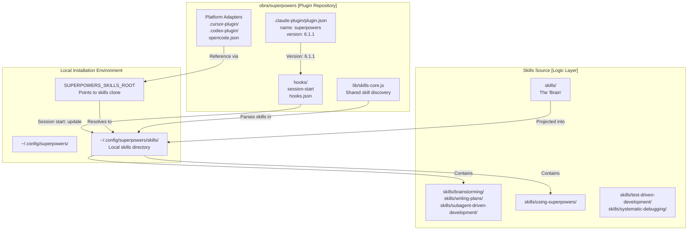
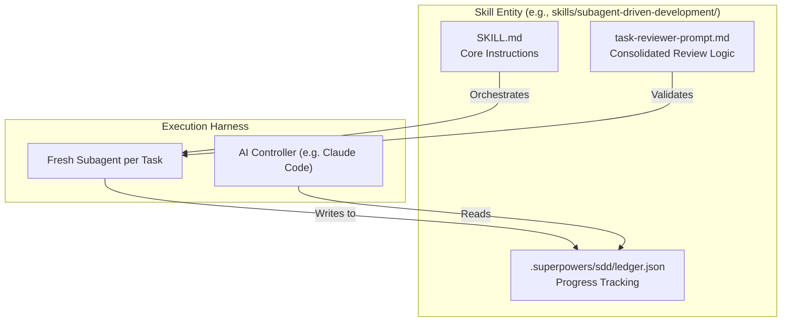

# Dual Repository Design

Relevant source files

The following files were used as context for generating this wiki page:

- [.claude-plugin/plugin.json](https://github.com/obra/superpowers/blob/HEAD/.claude-plugin/plugin.json)
- [.gitignore](https://github.com/obra/superpowers/blob/HEAD/.gitignore)
- [CLAUDE.md](https://github.com/obra/superpowers/blob/HEAD/CLAUDE.md)
- [README.md](https://github.com/obra/superpowers/blob/HEAD/README.md)
- [RELEASE-NOTES.md](https://github.com/obra/superpowers/blob/HEAD/RELEASE-NOTES.md)

## Purpose and Scope

This document explains the dual repository architecture introduced in v2.0.0 and refined through v6.1.1, which separates the Superpowers system into two components: a lightweight plugin shim (the primary repository `obra/superpowers`) and a separate skills repository (referenced via `SUPERPOWERS_SKILLS_ROOT`). This separation enables independent versioning, multi-platform support across Claude Code, Codex, Cursor, and others, and automatic skill updates without requiring a full plugin reinstallation for every prompt refinement.

## Architectural Separation

The Superpowers system is structured as a two-component system. The plugin repository contains the infrastructure, platform-specific manifests, and session-start hooks, while the skills repository contains the actual logic, prompts, and behavioral guidance.

**Repository Separation Architecture**

**Sources:** [RELEASE-NOTES.md:3-4](https://github.com/obra/superpowers/blob/HEAD/RELEASE-NOTES.md#L3-L4), [.claude-plugin/plugin.json:1-4](https://github.com/obra/superpowers/blob/HEAD/.claude-plugin/plugin.json#L1-L4), [README.md:1-26](https://github.com/obra/superpowers/blob/HEAD/README.md#L1-L26)

## Plugin Repository (obra/superpowers)

The plugin repository acts as the entry point for AI assistants. It contains the metadata and hooks required to bootstrap the environment and map platform-specific tools to Superpowers logic.

### Plugin Contents

| Component | Path | Purpose |
|-----------|------|---------|
| Plugin manifest | `.claude-plugin/plugin.json` | Core metadata and version (v6.1.1) [[.claude-plugin/plugin.json:1-4](https://github.com/obra/superpowers/blob/HEAD/[.claude-plugin/plugin.json:1-4)] |
| Session hooks | `hooks/hooks.json` | Defines the `SessionStart` trigger [[RELEASE-NOTES.md:7-7](https://github.com/obra/superpowers/blob/HEAD/[RELEASE-NOTES.md:7-7)] |
| Codex Manifest | `.codex-plugin/plugin.json` | Metadata for OpenAI Codex marketplace [[RELEASE-NOTES.md:48-48](https://github.com/obra/superpowers/blob/HEAD/[RELEASE-NOTES.md:48-48)] |
| SDD Workspace | `.superpowers/sdd/` | Local scratch space for subagent logs and ledgers [[RELEASE-NOTES.md:36-36](https://github.com/obra/superpowers/blob/HEAD/[RELEASE-NOTES.md:36-36)] |

The plugin manifest defines the plugin identity and versioning:
[[.claude-plugin/plugin.json:1-21](https://github.com/obra/superpowers/blob/HEAD/[.claude-plugin/plugin.json:1-21)]

### Shared Logic and SDD Management
To support multiple platforms, the system uses shared logic for skill discovery and state management. In v6.0.3, the `subagent-driven-development` (SDD) state was moved to a self-ignoring `.superpowers/sdd/` directory within the working tree to bypass protection restrictions in harnesses like Claude Code [[RELEASE-NOTES.md:36-36](https://github.com/obra/superpowers/blob/HEAD/[RELEASE-NOTES.md:36-36)]. This is resolved per worktree by a shared `sdd-workspace` helper [[RELEASE-NOTES.md:36-36](https://github.com/obra/superpowers/blob/HEAD/[RELEASE-NOTES.md:36-36)].

**Sources:** [RELEASE-NOTES.md:36-36](https://github.com/obra/superpowers/blob/HEAD/RELEASE-NOTES.md#L36), [RELEASE-NOTES.md:48-48](https://github.com/obra/superpowers/blob/HEAD/RELEASE-NOTES.md#L48), [.claude-plugin/plugin.json:1-21](https://github.com/obra/superpowers/blob/HEAD/.claude-plugin/plugin.json#L1-L21)

## Skills Repository Logic

The skills repository is the "brain" of the system. As of v6.0.0, the system has transitioned to a more vendor-neutral tool calling structure [[RELEASE-NOTES.md:57-58](https://github.com/obra/superpowers/blob/HEAD/[RELEASE-NOTES.md:57-58)].

### Consolidation and Review Logic
The v6.0.0 release significantly restructured how skills like `subagent-driven-development` operate to reduce token costs and improve strictness:
- **Reviewer Consolidation**: The two per-task reviewer prompts (`spec-reviewer-prompt.md` and `code-quality-reviewer-prompt.md`) were merged into a single `task-reviewer-prompt.md` [[RELEASE-NOTES.md:60-61](https://github.com/obra/superpowers/blob/HEAD/[RELEASE-NOTES.md:60-61)].
- **Worktree Isolation**: The legacy global worktree directory (`~/.config/superpowers/worktrees/`) was removed in favor of project-local `.worktrees/` directories to ensure better isolation and context awareness [[RELEASE-NOTES.md:62-63](https://github.com/obra/superpowers/blob/HEAD/[RELEASE-NOTES.md:62-63)].

**Skill Execution and Code Entity Mapping**

**Sources:** [RELEASE-NOTES.md:36-36](https://github.com/obra/superpowers/blob/HEAD/RELEASE-NOTES.md#L36), [RELEASE-NOTES.md:53-58](https://github.com/obra/superpowers/blob/HEAD/RELEASE-NOTES.md#L53-L58), [RELEASE-NOTES.md:60-63](https://github.com/obra/superpowers/blob/HEAD/RELEASE-NOTES.md#L60-L63)

## Versioning Strategy

The dual repository design uses a decoupled versioning strategy to balance platform stability with rapid skill improvement.

| Aspect | Plugin Repository (`obra/superpowers`) | Skills Layer |
|--------|---------------------------------------|---------------------------------------------|
| **Version** | Semantic (e.g., `6.1.1`) [[.claude-plugin/plugin.json:4-4](https://github.com/obra/superpowers/blob/HEAD/[.claude-plugin/plugin.json:4-4)] | Rolling / Commit-based |
| **Release** | Infrastructure changes (e.g., SDD path moves) | Continuous (Skill refinements) |
| **Update** | Manual/Marketplace update [[README.md:45-45](https://github.com/obra/superpowers/blob/HEAD/[README.md:45-45)] | Automatic (Git pull or session-start hook) |
| **Harnesses** | Claude, Codex, Cursor, Kimi, Pi, etc. [[README.md:14-14](https://github.com/obra/superpowers/blob/HEAD/[README.md:14-14)] | Unified across all harnesses |

### Platform Deprecation and EOL
The versioning strategy also accounts for platform lifecycles. For example, Gemini CLI support was explicitly removed in v6.1.0 following Google's EOL of the tool [[RELEASE-NOTES.md:30-31](https://github.com/obra/superpowers/blob/HEAD/[RELEASE-NOTES.md:30-31)].

**Sources:** [.claude-plugin/plugin.json:4-4](https://github.com/obra/superpowers/blob/HEAD/.claude-plugin/plugin.json#L4), [README.md:14-14](https://github.com/obra/superpowers/blob/HEAD/README.md#L14), [RELEASE-NOTES.md:30-31](https://github.com/obra/superpowers/blob/HEAD/RELEASE-NOTES.md#L30-L31)

## Multi-Platform Integration

The design allows a single set of skills to be projected into multiple AI environments, each with its own bootstrap mechanism.

**Platform Entry Points and Hooks**

| Platform | Entry Point | Integration Mechanism |
|----------|-------------|-----------------------|
| **Claude Code** | `/plugin install` | Official Marketplace or `obra/superpowers-marketplace` [[README.md:45-55](https://github.com/obra/superpowers/blob/HEAD/[README.md:45-55)] |
| **Codex** | `.codex-plugin/` | Manifest with `hooks: {}` to prevent redundant auto-discovery [[RELEASE-NOTES.md:7-8](https://github.com/obra/superpowers/blob/HEAD/[RELEASE-NOTES.md:7-8)] |
| **Pi** | `pi install` | Session-start extension that injects `using-superpowers` [[README.md:186-186](https://github.com/obra/superpowers/blob/HEAD/[README.md:186-186)] |
| **Antigravity** | `agy plugin install` | Runs session-start hook from first message [[README.md:72-73](https://github.com/obra/superpowers/blob/HEAD/[README.md:72-73)] |
| **Kimi Code** | `/plugins` | Native marketplace or direct repo install [[README.md:146-154](https://github.com/obra/superpowers/blob/HEAD/[README.md:146-154)] |

### Codex-Specific Implementation
In v6.1.1, the Codex integration was refined to handle the `SessionStart` hook more cleanly. By declaring an explicit empty hooks object (`hooks: {}`), Codex avoids falling back to auto-discovering the Claude Code `hooks/hooks.json` from the repository root, preventing redundant trust prompts [[RELEASE-NOTES.md:7-7](https://github.com/obra/superpowers/blob/HEAD/[RELEASE-NOTES.md:7-7)]. The `package-codex-plugin.sh` script is used to produce deterministic portal archives for the Codex marketplace [[RELEASE-NOTES.md:12-12](https://github.com/obra/superpowers/blob/HEAD/[RELEASE-NOTES.md:12-12)].

**Sources:** [RELEASE-NOTES.md:7-12](https://github.com/obra/superpowers/blob/HEAD/RELEASE-NOTES.md#L7-L12), [README.md:45-186](https://github.com/obra/superpowers/blob/HEAD/README.md#L45-L186)