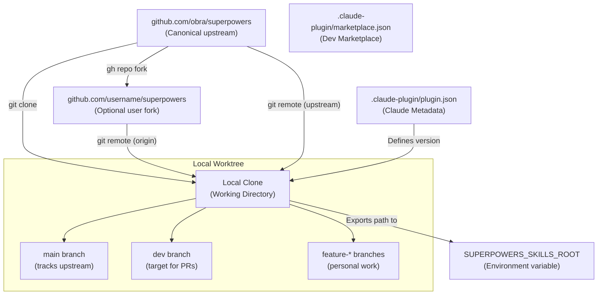
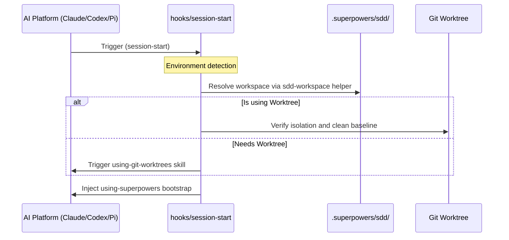
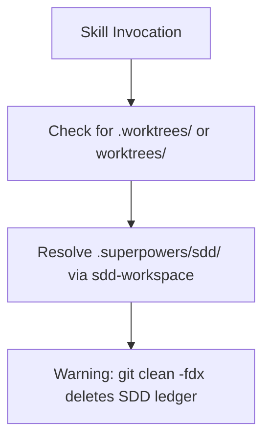

# Skills Repository Management

<details>
<summary>Relevant source files</summary>

The following files were used as context for generating this wiki page:

- [.claude-plugin/plugin.json](https://github.com/obra/superpowers/blob/HEAD/.claude-plugin/plugin.json)
- [.gitignore](https://github.com/obra/superpowers/blob/HEAD/.gitignore)
- [CLAUDE.md](https://github.com/obra/superpowers/blob/HEAD/CLAUDE.md)
- [README.md](https://github.com/obra/superpowers/blob/HEAD/README.md)
- [RELEASE-NOTES.md](https://github.com/obra/superpowers/blob/HEAD/RELEASE-NOTES.md)

</details>


This document covers the lifecycle of the skills repository in Superpowers: initial cloning, forking, auto-updates, and branch-based development workflows. In the v6.x architecture, the skills repository is the primary source of truth for AI guidance, managed as a Git repository that is automatically initialized and updated across multiple platforms including Claude Code, Cursor, OpenCode, Codex, and others.

For information about how skills are discovered and loaded at runtime, see [Skills Discovery and Resolution](18_4.5-skills-discovery-and-resolution.md). For platform-specific integration details, see [Multi-Platform Integration](16_4.3-multi-platform-integration.md). For the overall plugin architecture, see [Dual Repository Design](14_4.1-dual-repository-design.md).

## Repository Architecture

The skills repository operates as an independently-versioned Git repository that is cloned and managed locally by the plugin. This separation enables community contributions through standard GitHub workflows while maintaining automatic updates for end users.

### Repository Relationships and Code Entities

The following diagram maps the high-level repository relationships to the specific configuration files and environment variables that define them in the codebase.



**Sources:** [.claude-plugin/plugin.json:1-11](https://github.com/obra/superpowers/blob/HEAD/.claude-plugin/plugin.json#L1-L11), [CLAUDE.md:32-32](https://github.com/obra/superpowers/blob/HEAD/CLAUDE.md#L32), [README.md:9-10](https://github.com/obra/superpowers/blob/HEAD/README.md#L9-L10)

| Component | Location | Purpose |
|-----------|----------|---------|
| Upstream Repository | `github.com/obra/superpowers` | Canonical source for all skills and plugin logic [[.claude-plugin/plugin.json:9-10](https://github.com/obra/superpowers/blob/HEAD/[.claude-plugin/plugin.json:9-10)] |
| Local Clone | Current Working Directory | The active repository where the AI is operating |
| User Fork | `github.com/username/superpowers` | Optional fork for contributions [[CLAUDE.md:60-62](https://github.com/obra/superpowers/blob/HEAD/[CLAUDE.md:60-62)] |
| Plugin Shim | `.claude-plugin/` | Claude Code specific integration metadata [[.claude-plugin/plugin.json:1-4](https://github.com/obra/superpowers/blob/HEAD/[.claude-plugin/plugin.json:1-4)] |
| Version Tracker | `plugin.json` | Hardcoded version string used for release tracking [[.claude-plugin/plugin.json:4](https://github.com/obra/superpowers/blob/HEAD/[.claude-plugin/plugin.json:4)] |

**Sources:** [.claude-plugin/plugin.json:1-11](https://github.com/obra/superpowers/blob/HEAD/.claude-plugin/plugin.json#L1-L11), [CLAUDE.md:60-62](https://github.com/obra/superpowers/blob/HEAD/CLAUDE.md#L60-L62), [README.md:1-11](https://github.com/obra/superpowers/blob/HEAD/README.md#L1-L11)

## Initial Setup and Cloning

The system handles repository setup through platform-specific commands. Unlike earlier versions, many platforms now support direct marketplace installation or direct Git URL installation.

### Installation and Hook Flow

The system uses a `session-start` hook (where supported) to inject the `using-superpowers` bootstrap. In v6.1.1, Codex uses an explicit empty hooks object (`hooks: {}`) to avoid auto-discovery fallbacks while still utilizing native skill discovery [[RELEASE-NOTES.md:5-9](https://github.com/obra/superpowers/blob/HEAD/[RELEASE-NOTES.md:5-9)].



**Sources:** [RELEASE-NOTES.md:5-9](https://github.com/obra/superpowers/blob/HEAD/RELEASE-NOTES.md#L5-L9), [RELEASE-NOTES.md:34-36](https://github.com/obra/superpowers/blob/HEAD/RELEASE-NOTES.md#L34-L36), [README.md:188-203](https://github.com/obra/superpowers/blob/HEAD/README.md#L188-L203)

### Platform-Specific Metadata

Different platforms utilize different configuration files to register the skills library:

| Platform | Configuration File | Role |
|----------|--------------------|------|
| **Claude Code** | `.claude-plugin/plugin.json` | Marketplace and local plugin registration [[.claude-plugin/plugin.json:1-11](https://github.com/obra/superpowers/blob/HEAD/[.claude-plugin/plugin.json:1-11)] |
| **Codex** | `.codex-plugin/plugin.json` | Mirroring and marketplace metadata; used as version fallback [[RELEASE-NOTES.md:47-48](https://github.com/obra/superpowers/blob/HEAD/[RELEASE-NOTES.md:47-48)] |
| **Kimi Code** | `plugin manifest` | Marketplace and repo-direct installation [[RELEASE-NOTES.md:67-69](https://github.com/obra/superpowers/blob/HEAD/[RELEASE-NOTES.md:67-69)] |
| **Antigravity** | `plugin manifest` | Direct repo installation and session-start hook [[README.md:64-73](https://github.com/obra/superpowers/blob/HEAD/[README.md:64-73)] |

**Sources:** [.claude-plugin/plugin.json:1-11](https://github.com/obra/superpowers/blob/HEAD/.claude-plugin/plugin.json#L1-L11), [RELEASE-NOTES.md:47-48](https://github.com/obra/superpowers/blob/HEAD/RELEASE-NOTES.md#L47-L48), [RELEASE-NOTES.md:67-69](https://github.com/obra/superpowers/blob/HEAD/RELEASE-NOTES.md#L67-L69), [README.md:64-73](https://github.com/obra/superpowers/blob/HEAD/README.md#L64-L73)

## Auto-Update and Versioning

Superpowers follows a semantic versioning strategy. Updates are delivered via Git or platform-specific plugin update commands.

### Versioning Strategy

The repository version is tracked in multiple locations to ensure compatibility. If `package.json` is missing (as in some packaged Codex plugins), the system falls back to `.codex-plugin/plugin.json` via the `readSuperpowersVersion()` function [[RELEASE-NOTES.md:47-48](https://github.com/obra/superpowers/blob/HEAD/[RELEASE-NOTES.md:47-48)].

### Update Mechanism

Updates are typically handled by the platform's plugin manager:
- **Antigravity**: Reinstall with `agy plugin install` [[README.md:73-73](https://github.com/obra/superpowers/blob/HEAD/[README.md:73-73)]
- **Claude Code**: `/plugin install` from the marketplace [[README.md:45-45](https://github.com/obra/superpowers/blob/HEAD/[README.md:45-45)]
- **Pi**: `pi install git:github.com/obra/superpowers` [[README.md:177-177](https://github.com/obra/superpowers/blob/HEAD/[README.md:177-177)]

**Sources:** [RELEASE-NOTES.md:3-4](https://github.com/obra/superpowers/blob/HEAD/RELEASE-NOTES.md#L3-L4), [README.md:45-73](https://github.com/obra/superpowers/blob/HEAD/README.md#L45-L73), [README.md:177-177](https://github.com/obra/superpowers/blob/HEAD/README.md#L177)

## Forking and Branch-Based Development

Superpowers enforces a branch-based workflow for creating and modifying skills. Contributors must target the `dev` branch, not `main` [[CLAUDE.md:32-32](https://github.com/obra/superpowers/blob/HEAD/[CLAUDE.md:32-32)].

### Worktree and Scratch File Management

As of v6.0.3, scratch files for `subagent-driven-development` (SDD) have moved from `.git/` to a self-ignoring `.superpowers/sdd/` directory in the working tree to comply with Claude Code security policies [[RELEASE-NOTES.md:34-36](https://github.com/obra/superpowers/blob/HEAD/[RELEASE-NOTES.md:34-36)].



**Sources:** [RELEASE-NOTES.md:34-36](https://github.com/obra/superpowers/blob/HEAD/RELEASE-NOTES.md#L34-L36), [RELEASE-NOTES.md:61-62](https://github.com/obra/superpowers/blob/HEAD/RELEASE-NOTES.md#L61-L62), [.gitignore:1-4](https://github.com/obra/superpowers/blob/HEAD/.gitignore#L1-L4)

### Contributor Requirements

The repository has a high rejection rate (94%) for automated "slop" PRs. Contributors must:
- **Target `dev` branch**: Active work lands on `dev` first [[CLAUDE.md:32-32](https://github.com/obra/superpowers/blob/HEAD/[CLAUDE.md:32-32)].
- **Use Worktrees**: `using-git-worktrees` is mandatory for isolation [[README.md:192-193](https://github.com/obra/superpowers/blob/HEAD/[README.md:192-193)].
- **Identify Environment**: Must disclose model, harness, and version [[CLAUDE.md:17-17](https://github.com/obra/superpowers/blob/HEAD/[CLAUDE.md:17-17)].
- **Avoid Dependencies**: Superpowers is a zero-dependency plugin [[CLAUDE.md:36-38](https://github.com/obra/superpowers/blob/HEAD/[CLAUDE.md:36-38)].

**Sources:** [CLAUDE.md:7-32](https://github.com/obra/superpowers/blob/HEAD/CLAUDE.md#L7-L32), [CLAUDE.md:36-38](https://github.com/obra/superpowers/blob/HEAD/CLAUDE.md#L36-L38), [README.md:192-193](https://github.com/obra/superpowers/blob/HEAD/README.md#L192-L193)

## Directory Structure (v6.1.x)

The repository is structured to support multiple AI harnesses while keeping skills modular.

```text
/ (Repo Root)
├── .claude-plugin/          # Claude Code integration metadata [plugin.json]
├── .codex-plugin/           # Codex integration metadata [plugin.json]
├── .superpowers/            # Persistent scratch space [sdd/ progress ledger]
│   └── sdd/                 # SDD task briefs, reports, and review diffs
├── .worktrees/              # Default local worktree directory
├── hooks/                   # Session lifecycle hooks
│   ├── hooks.json           # Hook registration
│   └── session-start        # Main bootstrap injector
├── scripts/                 # Maintenance tools [package-codex-plugin.sh]
├── skills/                  # THE SKILLS REPOSITORY
│   ├── brainstorming/       # Design and discovery
│   ├── writing-plans/       # Task decomposition
│   └── ...                  # Modular AI guidance
└── tests/                   # Test suite (Fast, Integration, Harness-specific)
```

**Sources:** [RELEASE-NOTES.md:12-12](https://github.com/obra/superpowers/blob/HEAD/RELEASE-NOTES.md#L12), [RELEASE-NOTES.md:34-36](https://github.com/obra/superpowers/blob/HEAD/RELEASE-NOTES.md#L34-L36), [RELEASE-NOTES.md:61-62](https://github.com/obra/superpowers/blob/HEAD/RELEASE-NOTES.md#L61-L62), [.claude-plugin/plugin.json:1-11](https://github.com/obra/superpowers/blob/HEAD/.claude-plugin/plugin.json#L1-L11), [.gitignore:1-4](https://github.com/obra/superpowers/blob/HEAD/.gitignore#L1-L4)26:T1f10,# Multi-Platform Integration

<details>
<summary>Relevant source files</summary>

The f