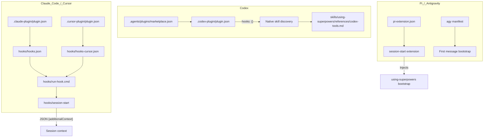
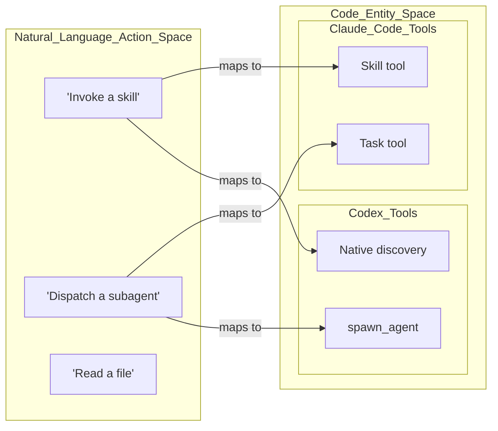

# Multi-Platform Integration

Relevant source files

The following files were used as context for generating this wiki page:

- [.agents/plugins/marketplace.json](https://github.com/obra/superpowers/blob/HEAD/.agents/plugins/marketplace.json)
- [.claude-plugin/plugin.json](https://github.com/obra/superpowers/blob/HEAD/.claude-plugin/plugin.json)
- [.codex-plugin/plugin.json](https://github.com/obra/superpowers/blob/HEAD/.codex-plugin/plugin.json)
- [.cursor-plugin/plugin.json](https://github.com/obra/superpowers/blob/HEAD/.cursor-plugin/plugin.json)
- [RELEASE-NOTES.md](https://github.com/obra/superpowers/blob/HEAD/RELEASE-NOTES.md)
- [docs/porting-to-a-new-harness.md](https://github.com/obra/superpowers/blob/HEAD/docs/porting-to-a-new-harness.md)
- [docs/windows/polyglot-hooks.md](https://github.com/obra/superpowers/blob/HEAD/docs/windows/polyglot-hooks.md)
- [gemini-extension.json](https://github.com/obra/superpowers/blob/HEAD/gemini-extension.json)
- [tests/codex/test-marketplace-manifest.sh](https://github.com/obra/superpowers/blob/HEAD/tests/codex/test-marketplace-manifest.sh)
- [tests/hooks/test-session-start.sh](https://github.com/obra/superpowers/blob/HEAD/tests/hooks/test-session-start.sh)

This page describes how the Superpowers plugin hooks into each supported AI coding platform at a technical level: what files are involved, how context is injected, and what mechanism each platform uses for skill discovery. For detail on what the bootstrap content contains and how it is constructed, see [4.4](https://github.com/obra/superpowers/blob/HEAD/4.4). For how skills are located on disk after bootstrap, see [4.5](https://github.com/obra/superpowers/blob/HEAD/4.5).

---

## Integration Mechanism Overview

Superpowers targets multiple platforms, each with a different plugin API. The system provides a unified interface for skills while adapting to platform-specific tool names and capabilities.

| Platform | Registration | Context Injection Hook | Skill Discovery |
|---|---|---|---|
| **Claude Code** | `.claude-plugin/plugin.json` | `SessionStart` via `hooks.json` | Claude Code `Skill` tool |
| **Cursor** | `.cursor-plugin/plugin.json` | `sessionStart` via `hooks-cursor.json` | Cursor `Skill` tool |
| **Codex** | `.codex-plugin/plugin.json` | Native discovery | Native `~/.agents/skills/` scan |
| **Kimi Code** | `plugin.json` (Kimi) | Native marketplace/repo | Native skill loading |
| **Pi** | `pi-extension.json` | `session-start` extension | Native skills |
| **Antigravity** | `agy` manifest | First-message bootstrap | Native tool calls |

> **Note:** Gemini CLI support was removed in v6.1.0 following its EOL on 2026-06-18 [[RELEASE-NOTES.md:29-31]]().

Sources: [.claude-plugin/plugin.json:1-20](https://github.com/obra/superpowers/blob/HEAD/.claude-plugin/plugin.json#L1-L20), [.cursor-plugin/plugin.json:1-23](https://github.com/obra/superpowers/blob/HEAD/.cursor-plugin/plugin.json#L1-L23), [.codex-plugin/plugin.json:1-48](https://github.com/obra/superpowers/blob/HEAD/.codex-plugin/plugin.json#L1-L48), [RELEASE-NOTES.md:29-31](https://github.com/obra/superpowers/blob/HEAD/RELEASE-NOTES.md#L29-L31), [RELEASE-NOTES.md:64-71](https://github.com/obra/superpowers/blob/HEAD/RELEASE-NOTES.md#L64-L71)

---

## How Each Platform Connects

The integration architecture bridges the gap between the platform's native environment and the shared Superpowers skill library.

Sources: [.codex-plugin/plugin.json:24-24](https://github.com/obra/superpowers/blob/HEAD/.codex-plugin/plugin.json#L24), [docs/windows/polyglot-hooks.md:20-31](https://github.com/obra/superpowers/blob/HEAD/docs/windows/polyglot-hooks.md#L20-L31), [RELEASE-NOTES.md:64-71](https://github.com/obra/superpowers/blob/HEAD/RELEASE-NOTES.md#L64-L71), [tests/codex/test-marketplace-manifest.sh:69-73](https://github.com/obra/superpowers/blob/HEAD/tests/codex/test-marketplace-manifest.sh#L69-L73)

---

## Claude Code & Cursor Integration

These platforms share a hook-based architecture using the `run-hook.cmd` polyglot dispatcher to ensure cross-platform compatibility [[docs/windows/polyglot-hooks.md:20-22]]().

### Polyglot Dispatcher (`run-hook.cmd`)
To support Windows (CMD.exe) and Unix (bash/sh), Superpowers uses a single generic dispatcher [[docs/windows/polyglot-hooks.md:3-5]]().
1. **Windows**: CMD treats the first block as batch commands. It searches for `bash.exe` (Git for Windows) and executes the extensionless hook script [[docs/windows/polyglot-hooks.md:66-78]]().
2. **Unix**: Shells treat the CMD block as a no-op heredoc (`: << 'CMDBLOCK'`) and execute the script directly [[docs/windows/polyglot-hooks.md:80-86]]().

### Hook Specifics
- **Claude Code**: Uses `hooks/hooks.json` with a matcher for `startup|clear|compact` [[docs/windows/polyglot-hooks.md:33-52]]().
- **Cursor**: Uses `hooks/hooks-cursor.json` with a `sessionStart` matcher [[docs/windows/polyglot-hooks.md:142-144]]().
- **Output Shape**: The `session-start` script detects the environment and adjusts the JSON output. Claude Code expects a nested `hookSpecificOutput.additionalContext`, while Cursor expects a top-level `additional_context` [[tests/hooks/test-session-start.sh:77-116]]().

Sources: [docs/windows/polyglot-hooks.md:1-94](https://github.com/obra/superpowers/blob/HEAD/docs/windows/polyglot-hooks.md#L1-L94), [tests/hooks/test-session-start.sh:77-116](https://github.com/obra/superpowers/blob/HEAD/tests/hooks/test-session-start.sh#L77-L116)

---

## Codex Integration

Codex integration shifted in v6.1.0 to rely primarily on native skill discovery rather than session-start hooks [[RELEASE-NOTES.md:5-9]]().

### Suppression of Auto-Discovery
Codex auto-discovers `hooks/hooks.json` if the `hooks` field is absent in the manifest. To prevent Codex from incorrectly registering the Claude Code `SessionStart` hook, the Superpowers manifest explicitly declares an empty hooks object: `"hooks": {}` [[.codex-plugin/plugin.json:24-24]](), [[tests/codex/test-marketplace-manifest.sh:69-73]]().

### Marketplace and Packaging
Codex plugins can be installed via a local marketplace manifest at `.agents/plugins/marketplace.json` [[tests/codex/test-marketplace-manifest.sh:6-19]](). A maintainer script, `package-codex-plugin.sh`, produces deterministic archives for distribution [[RELEASE-NOTES.md:10-13]]().

Sources: [.codex-plugin/plugin.json:24-24](https://github.com/obra/superpowers/blob/HEAD/.codex-plugin/plugin.json#L24), [RELEASE-NOTES.md:5-13](https://github.com/obra/superpowers/blob/HEAD/RELEASE-NOTES.md#L5-L13), [tests/codex/test-marketplace-manifest.sh:55-73](https://github.com/obra/superpowers/blob/HEAD/tests/codex/test-marketplace-manifest.sh#L55-L73)

---

## Tool Mapping Layer

Skills are written using abstract actions (e.g., "dispatch a subagent") to remain harness-agnostic [[docs/porting-to-a-new-harness.md:37-41]](). Each harness translates these actions into native tools via a reference file in `skills/using-superpowers/references/` [[docs/porting-to-a-new-harness.md:43-48]]().

### Codex Mapping
| Abstract Action | Codex Native Tool |
|---|---|
| Dispatch subagent | `spawn_agent` |
| Track progress | `update_plan` |
| Invoke skill | Native loading |

Codex requires `multi_agent = true` to support skills like `subagent-driven-development` [[docs/porting-to-a-new-harness.md:115-115]]().

### Unified Reviewer
As of v6.0.0, the separate spec and code quality reviewers were consolidated into a single `task-reviewer-prompt.md` [[RELEASE-NOTES.md:60-62]](). This simplifies the tool mapping for subagent dispatch across all platforms.

Sources: [docs/porting-to-a-new-harness.md:31-56](https://github.com/obra/superpowers/blob/HEAD/docs/porting-to-a-new-harness.md#L31-L56), [RELEASE-NOTES.md:60-62](https://github.com/obra/superpowers/blob/HEAD/RELEASE-NOTES.md#L60-L62), [RELEASE-NOTES.md:72-80](https://github.com/obra/superpowers/blob/HEAD/RELEASE-NOTES.md#L72-L80)