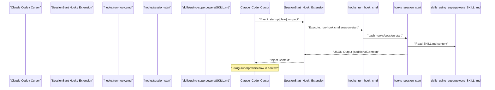
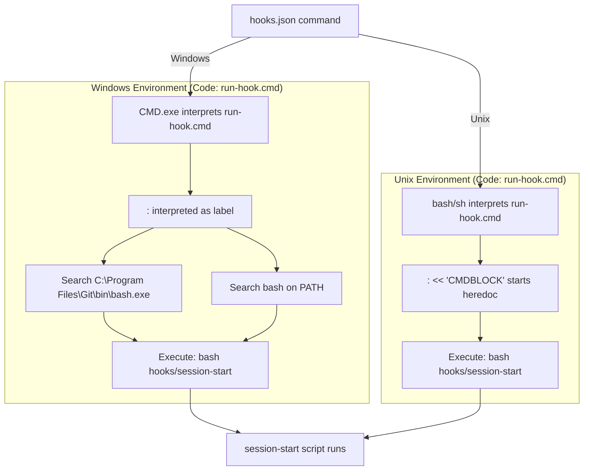

# Session Lifecycle and Bootstrap

<details>
<summary>Relevant source files</summary>

The following files were used as context for generating this wiki page:

- [.claude-plugin/plugin.json](https://github.com/obra/superpowers/blob/HEAD/.claude-plugin/plugin.json)
- [.gitattributes](https://github.com/obra/superpowers/blob/HEAD/.gitattributes)
- [LICENSE](https://github.com/obra/superpowers/blob/HEAD/LICENSE)
- [RELEASE-NOTES.md](https://github.com/obra/superpowers/blob/HEAD/RELEASE-NOTES.md)
- [hooks/hooks-cursor.json](https://github.com/obra/superpowers/blob/HEAD/hooks/hooks-cursor.json)
- [hooks/hooks.json](https://github.com/obra/superpowers/blob/HEAD/hooks/hooks.json)
- [hooks/run-hook.cmd](https://github.com/obra/superpowers/blob/HEAD/hooks/run-hook.cmd)
- [hooks/session-start](https://github.com/obra/superpowers/blob/HEAD/hooks/session-start)

</details>


This document explains how Superpowers initializes when a session starts, including the hook execution mechanism, context injection, and cross-platform compatibility across Claude Code, Cursor, and other platforms.

## Purpose and Scope

The session lifecycle and bootstrap process ensures that the `using-superpowers` meta-skill content is available in the session context from the very first user message. This involves:

- Triggering on session lifecycle events (startup, clear, compact) via `hooks.json` [hooks/hooks.json:1-16](https://github.com/obra/superpowers/blob/HEAD/hooks/hooks.json#L1-L16).
- Executing hook scripts cross-platform using a polyglot wrapper [hooks/run-hook.cmd:1-40](https://github.com/obra/superpowers/blob/HEAD/hooks/run-hook.cmd#L1-L40).
- Reading skill content from the plugin directory [hooks/session-start:7-11](https://github.com/obra/superpowers/blob/HEAD/hooks/session-start#L7-L11).
- Injecting formatted context into the session based on the host platform (Claude Code vs. Cursor) [hooks/session-start:38-47](https://github.com/obra/superpowers/blob/HEAD/hooks/session-start#L38-L47).

**Sources:** [hooks/hooks.json:1-16](https://github.com/obra/superpowers/blob/HEAD/hooks/hooks.json#L1-L16), [hooks/run-hook.cmd:1-40](https://github.com/obra/superpowers/blob/HEAD/hooks/run-hook.cmd#L1-L40), [hooks/session-start:1-50](https://github.com/obra/superpowers/blob/HEAD/hooks/session-start#L1-L50)

---

## Session Lifecycle Events

The `SessionStart` hook triggers on session lifecycle events defined in the plugin configuration.

| Event | Description | When It Fires |
|-------|-------------|---------------|
| `startup` | New session created | User starts a fresh conversation |
| `clear` | Session context cleared | User clears conversation history |
| `compact` | Context compacted | System reduces context window size |

The hook matcher uses the regex `startup|clear|compact` [hooks/hooks.json:5](https://github.com/obra/superpowers/blob/HEAD/hooks/hooks.json#L5). This ensures skills context is present whenever the session state is initialized or reset.

**Sources:** [hooks/hooks.json:1-16](https://github.com/obra/superpowers/blob/HEAD/hooks/hooks.json#L1-L16)

---

## Hook Execution Flow

### High-Level Session Start Flow

The following diagram bridges the "Natural Language Space" (the user starting a session) to the "Code Entity Space" (the specific scripts and files involved).



**Sources:** [hooks/hooks.json:1-16](https://github.com/obra/superpowers/blob/HEAD/hooks/hooks.json#L1-L16), [hooks/session-start:1-50](https://github.com/obra/superpowers/blob/HEAD/hooks/session-start#L1-L50), [hooks/run-hook.cmd:1-47](https://github.com/obra/superpowers/blob/HEAD/hooks/run-hook.cmd#L1-L47)

---

## Cross-Platform Hook Execution

### The Polyglot Wrapper Pattern

The `run-hook.cmd` file is a polyglot script valid in both Windows CMD and Unix bash [hooks/run-hook.cmd:1-47](https://github.com/obra/superpowers/blob/HEAD/hooks/run-hook.cmd#L1-L47). This is necessary because different platforms and OS environments invoke hooks using different default shells.



**Key Mechanisms:**

1.  **Windows (CMD)** [hooks/run-hook.cmd:1-40](https://github.com/obra/superpowers/blob/HEAD/hooks/run-hook.cmd#L1-L40):
    *   `: << 'CMDBLOCK'` is seen as a label followed by ignored text [hooks/run-hook.cmd:1](https://github.com/obra/superpowers/blob/HEAD/hooks/run-hook.cmd#L1).
    *   It searches for `bash.exe` in standard Git for Windows locations or on the system `PATH` [hooks/run-hook.cmd:21-33](https://github.com/obra/superpowers/blob/HEAD/hooks/run-hook.cmd#L21-L33).
    *   If found, it executes the bash script and exits with the appropriate `%ERRORLEVEL%` [hooks/run-hook.cmd:23](https://github.com/obra/superpowers/blob/HEAD/hooks/run-hook.cmd#L23).
2.  **Unix (bash)** [hooks/run-hook.cmd:42-47](https://github.com/obra/superpowers/blob/HEAD/hooks/run-hook.cmd#L42-L47):
    *   `: << 'CMDBLOCK'` starts a heredoc, causing bash to ignore the batch code until `CMDBLOCK` [hooks/run-hook.cmd:42](https://github.com/obra/superpowers/blob/HEAD/hooks/run-hook.cmd#L42).
    *   It then executes the named script directly using `exec bash` [hooks/run-hook.cmd:46](https://github.com/obra/superpowers/blob/HEAD/hooks/run-hook.cmd#L46).

**Sources:** [hooks/run-hook.cmd:1-47](https://github.com/obra/superpowers/blob/HEAD/hooks/run-hook.cmd#L1-L47)

---

## Session Start Script Logic

### Script Execution Steps

The `session-start` script [hooks/session-start:1-50](https://github.com/obra/superpowers/blob/HEAD/hooks/session-start#L1-L50) follows a precise sequence to prepare the session:

1.  **Environment Setup**: Sets `pipefail` and determines the `PLUGIN_ROOT` relative to the script location [hooks/session-start:4-8](https://github.com/obra/superpowers/blob/HEAD/hooks/session-start#L4-L8).
2.  **Content Retrieval**: Reads the content of the `using-superpowers` meta-skill [hooks/session-start:11](https://github.com/obra/superpowers/blob/HEAD/hooks/session-start#L11).
3.  **JSON Escaping**: Uses a high-performance bash-native `escape_for_json` function utilizing parameter substitution `${s//old/new}` to prepare the markdown for embedding in a JSON string [hooks/session-start:16-24](https://github.com/obra/superpowers/blob/HEAD/hooks/session-start#L16-L24).
4.  **Context Construction**: Wraps the skill content in `<EXTREMELY_IMPORTANT>` tags with specific instructions for the AI to use the `Skill` tool for other skills [hooks/session-start:27](https://github.com/obra/superpowers/blob/HEAD/hooks/session-start#L27).
5.  **Platform-Aware Output**:
    *   If `CURSOR_PLUGIN_ROOT` is set, it outputs the `additional_context` field (snake_case) [hooks/session-start:38-40](https://github.com/obra/superpowers/blob/HEAD/hooks/session-start#L38-L40).
    *   If `CLAUDE_PLUGIN_ROOT` is set (and not `COPILOT_CLI`), it outputs `hookSpecificOutput.additionalContext` (nested) [hooks/session-start:41-44](https://github.com/obra/superpowers/blob/HEAD/hooks/session-start#L41-L44).
    *   Otherwise (e.g., Copilot CLI), it uses the top-level `additionalContext` field (SDK standard) [hooks/session-start:45-47](https://github.com/obra/superpowers/blob/HEAD/hooks/session-start#L45-L47).

**Sources:** [hooks/session-start:1-50](https://github.com/obra/superpowers/blob/HEAD/hooks/session-start#L1-L50)

---

## Context Injection Format

### JSON Output Structure

The `session-start` script targets specific fields based on the host AI's plugin API requirements.

| Field | Platform | Code Reference |
|-------|----------|----------------|
| `additional_context` | Cursor | [hooks/session-start:40](https://github.com/obra/superpowers/blob/HEAD/hooks/session-start#L40) |
| `hookSpecificOutput.additionalContext` | Claude Code | [hooks/session-start:43](https://github.com/obra/superpowers/blob/HEAD/hooks/session-start#L43) |
| `additionalContext` | Copilot CLI / SDK Standard | [hooks/session-start:46](https://github.com/obra/superpowers/blob/HEAD/hooks/session-start#L46) |

### Content Structure

The injected context follows a strict hierarchy [hooks/session-start:27](https://github.com/obra/superpowers/blob/HEAD/hooks/session-start#L27):

```text
<EXTREMELY_IMPORTANT>
You have superpowers.

**Below is the full content of your 'superpowers:using-superpowers' skill - your introduction to using skills. For all other skills, use the 'Skill' tool:**

[Content of using-superpowers/SKILL.md]
</EXTREMELY_IMPORTANT>
```

The use of `<EXTREMELY_IMPORTANT>` tags ensures the model prioritizes these instructions over general system prompts. Note that as of v6.1.0, the `using-superpowers` bootstrap has been compressed to lower per-session token costs [RELEASE-NOTES.md:18-20](https://github.com/obra/superpowers/blob/HEAD/RELEASE-NOTES.md#L18-L20).

**Sources:** [hooks/session-start:27-47](https://github.com/obra/superpowers/blob/HEAD/hooks/session-start#L27-L47), [RELEASE-NOTES.md:14-22](https://github.com/obra/superpowers/blob/HEAD/RELEASE-NOTES.md#L14-L22)

---

## Code Entity Reference

### Key Files and Definitions

| Entity | Location | Role |
|--------|----------|------|
| `SessionStart` | [hooks/hooks.json:3](https://github.com/obra/superpowers/blob/HEAD/hooks/hooks.json#L3) | Hook event identifier in Claude Code configuration. |
| `run-hook.cmd` | [hooks/run-hook.cmd:1](https://github.com/obra/superpowers/blob/HEAD/hooks/run-hook.cmd#L1) | Entry point for shell hooks; handles OS-specific shell dispatch. |
| `session-start` | [hooks/session-start:1](https://github.com/obra/superpowers/blob/HEAD/hooks/session-start#L1) | Bash script that generates the startup context JSON for Claude Code/Cursor. |
| `hooks-cursor.json` | [hooks/hooks-cursor.json:1-11](https://github.com/obra/superpowers/blob/HEAD/hooks/hooks-cursor.json#L1-L11) | Cursor-specific hook configuration mapping `sessionStart` to the script. |
| `using-superpowers` | [skills/using-superpowers/SKILL.md](https://github.com/obra/superpowers/blob/HEAD/skills/using-superpowers/SKILL.md) | The meta-skill injected at startup to guide the agent's behavior. |
| `*.sh` | [.gitattributes:2-3](https://github.com/obra/superpowers/blob/HEAD/.gitattributes#L2-L3) | Forced LF line endings to ensure compatibility with bash in polyglot environments. |

**Sources:** [hooks/hooks.json:1-16](https://github.com/obra/superpowers/blob/HEAD/hooks/hooks.json#L1-L16), [hooks/run-hook.cmd:1-47](https://github.com/obra/superpowers/blob/HEAD/hooks/run-hook.cmd#L1-L47), [hooks/session-start:1-50](https://github.com/obra/superpowers/blob/HEAD/hooks/session-start#L1-L50), [.gitattributes:1-21](https://github.com/obra/superpowers/blob/HEAD/.gitattributes#L1-L21)