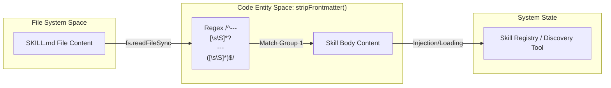
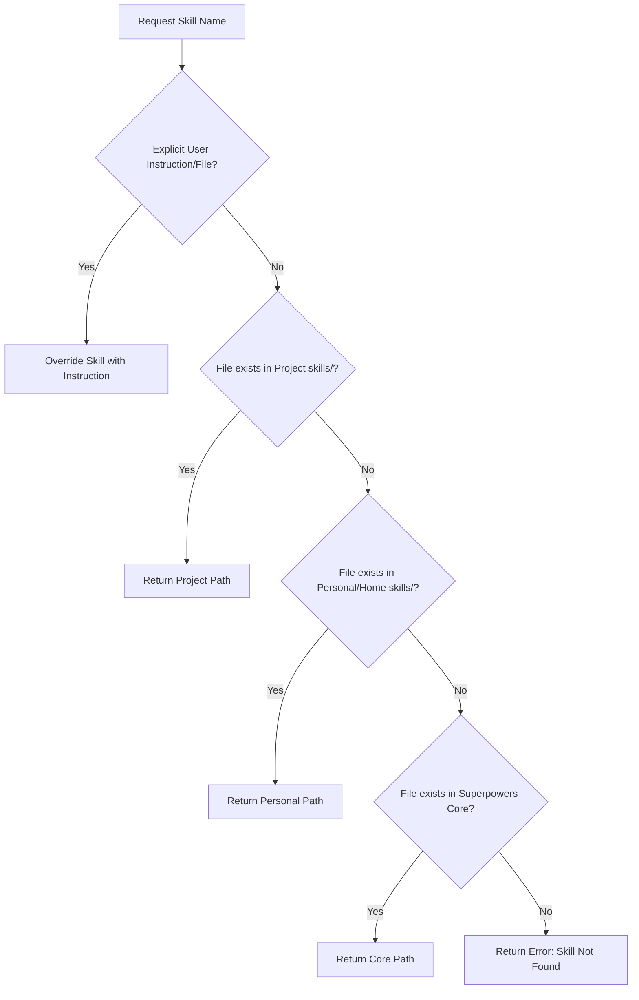
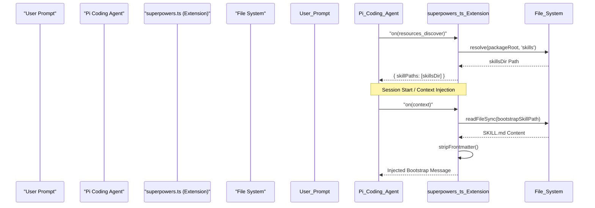

# Skills Discovery and Resolution

Relevant source files

The following files were used as context for generating this wiki page:

- [.pi/extensions/superpowers.ts](https://github.com/obra/superpowers/blob/HEAD/.pi/extensions/superpowers.ts)
- [skills/executing-plans/SKILL.md](https://github.com/obra/superpowers/blob/HEAD/skills/executing-plans/SKILL.md)
- [skills/using-superpowers/SKILL.md](https://github.com/obra/superpowers/blob/HEAD/skills/using-superpowers/SKILL.md)
- [skills/writing-skills/SKILL.md](https://github.com/obra/superpowers/blob/HEAD/skills/writing-skills/SKILL.md)
- [skills/writing-skills/anthropic-best-practices.md](https://github.com/obra/superpowers/blob/HEAD/skills/writing-skills/anthropic-best-practices.md)
- [tests/pi/test-pi-extension.mjs](https://github.com/obra/superpowers/blob/HEAD/tests/pi/test-pi-extension.mjs)

This page documents the technical implementation of how skills are discovered on disk, how their metadata is parsed from frontmatter, and the algorithm used to resolve a skill name to a specific file path across multiple priority tiers.

## Overview

The Superpowers system treats skills as modular directories containing a `SKILL.md` file. The discovery and resolution engine must perform three primary tasks:
1.  **Scanning**: Recursively or iteratively searching root directories to find all available skill definitions.
2.  **Parsing**: Extracting YAML frontmatter from `SKILL.md` to identify the skill's `name` and `description` for tool-based discovery.
3.  **Resolving**: Determining which version of a skill to load when a name collision occurs across Project, Personal, and Superpowers tiers.

Sources: [skills/writing-skills/SKILL.md:72-82](https://github.com/obra/superpowers/blob/HEAD/skills/writing-skills/SKILL.md#L72-L82), [skills/using-superpowers/SKILL.md:26-32](https://github.com/obra/superpowers/blob/HEAD/skills/using-superpowers/SKILL.md#L26-L32), [.pi/extensions/superpowers.ts:19-21](https://github.com/obra/superpowers/blob/HEAD/.pi/extensions/superpowers.ts#L19-L21)

---

## Skill File Structure and Parsing

Every skill is a self-contained directory. The core of the skill is the `SKILL.md` file, which uses a specific structure to facilitate machine discovery.

### Frontmatter Specification
The system identifies skills by parsing the YAML block at the top of `SKILL.md`. This block is delimited by triple dashes (`---`) [skills/using-superpowers/SKILL.md:1-4](https://github.com/obra/superpowers/blob/HEAD/skills/using-superpowers/SKILL.md#L1-L4).

| Field | Purpose | Requirement |
| :--- | :--- | :--- |
| `name` | Unique identifier used for invocation (e.g., `Skill(name="brainstorming")`) | Required. Letters, numbers, and hyphens only [skills/writing-skills/SKILL.md:98-98](https://github.com/obra/superpowers/blob/HEAD/skills/writing-skills/SKILL.md#L98). |
| `description` | Semantic description used by LLMs to find relevant skills via discovery tools | Required. Max 1024 characters [skills/writing-skills/SKILL.md:97-97](https://github.com/obra/superpowers/blob/HEAD/skills/writing-skills/SKILL.md#L97). |

### Parsing Logic
The parsing implementation (such as `stripFrontmatter` in the Pi extension) identifies the block using a regular expression to isolate the body from the metadata [.pi/extensions/superpowers.ts:83-86](https://github.com/obra/superpowers/blob/HEAD/.pi/extensions/superpowers.ts#L83-L86). The description is critical for Skill Discovery Optimization (SDO); it must focus on triggering conditions ("Use when...") rather than summarizing the workflow to prevent agents from skipping the full skill content [skills/writing-skills/SKILL.md:140-160](https://github.com/obra/superpowers/blob/HEAD/skills/writing-skills/SKILL.md#L140-L160).

**Frontmatter Extraction Data Flow:**

Sources: [.pi/extensions/superpowers.ts:59-86](https://github.com/obra/superpowers/blob/HEAD/.pi/extensions/superpowers.ts#L59-L86), [skills/writing-skills/SKILL.md:93-104](https://github.com/obra/superpowers/blob/HEAD/skills/writing-skills/SKILL.md#L93-L104), [skills/writing-skills/SKILL.md:140-160](https://github.com/obra/superpowers/blob/HEAD/skills/writing-skills/SKILL.md#L140-L160)

---

## The Resolution Algorithm

Superpowers implements a hierarchical shadowing system. This allows users to override global library skills with project-specific instructions without modifying the core repository.

### Priority Tiers
The resolution logic searches directories in a strict descending order of priority:

1.  **User Instructions**: `CLAUDE.md`, `AGENTS.md`, `GEMINI.md`, or direct requests take absolute precedence [skills/using-superpowers/SKILL.md:62-63](https://github.com/obra/superpowers/blob/HEAD/skills/using-superpowers/SKILL.md#L62-L63).
2.  **Process Skills**: Common process skills like `brainstorming` or `systematic-debugging` set the approach before implementation skills [skills/using-superpowers/SKILL.md:26-32](https://github.com/obra/superpowers/blob/HEAD/skills/using-superpowers/SKILL.md#L26-L32).
3.  **Tiered Discovery**: Discovery typically looks in Project-local skills, then Personal/Global skills, then the Superpowers core library.

### Invocation Rules
The `using-superpowers` meta-skill enforces that if there is even a "1% chance" a skill applies, it must be invoked [skills/using-superpowers/SKILL.md:10-16](https://github.com/obra/superpowers/blob/HEAD/skills/using-superpowers/SKILL.md#L10-L16). The resolution happens at the moment of tool call or session start.

**Skill Resolution Logic (Conceptual):**

Sources: [skills/using-superpowers/SKILL.md:10-16](https://github.com/obra/superpowers/blob/HEAD/skills/using-superpowers/SKILL.md#L10-L16), [skills/using-superpowers/SKILL.md:26-32](https://github.com/obra/superpowers/blob/HEAD/skills/using-superpowers/SKILL.md#L26-L32), [skills/using-superpowers/SKILL.md:62-63](https://github.com/obra/superpowers/blob/HEAD/skills/using-superpowers/SKILL.md#L62-L63), [skills/writing-skills/SKILL.md:12-14](https://github.com/obra/superpowers/blob/HEAD/skills/writing-skills/SKILL.md#L12-L14)

---

## Platform-Specific Discovery Implementation

While the logic is consistent, the integration points vary by platform to utilize native hooks.

### Pi Extension Discovery
The Pi extension (`superpowers.ts`) implements discovery via the `resources_discover` hook, contributing the bundled `skillsDir` to the agent's environment [.pi/extensions/superpowers.ts:19-21](https://github.com/obra/superpowers/blob/HEAD/.pi/extensions/superpowers.ts#L19-L21). It also handles session-level injection by inserting the `using-superpowers` bootstrap into the message history [.pi/extensions/superpowers.ts:35-56](https://github.com/obra/superpowers/blob/HEAD/.pi/extensions/superpowers.ts#L35-L56).

**Discovery Architecture (Natural Language to Code Entities):**

Sources: [.pi/extensions/superpowers.ts:9-21](https://github.com/obra/superpowers/blob/HEAD/.pi/extensions/superpowers.ts#L9-L21), [.pi/extensions/superpowers.ts:35-56](https://github.com/obra/superpowers/blob/HEAD/.pi/extensions/superpowers.ts#L35-L56), [tests/pi/test-pi-extension.mjs:63-70](https://github.com/obra/superpowers/blob/HEAD/tests/pi/test-pi-extension.mjs#L63-L70)

---

## Tool Mapping and Adaptation

During resolution and loading, skills written for Claude Code are adapted to the local environment. This is handled either by a bootstrap injection or a reference document.

| Platform | Mapping Mechanism | Key Tool Translation |
| :--- | :--- | :--- |
| **Pi** | `piToolMapping()` injection | `Skill` → native `read`, `Task` → `pi-subagents` [.pi/extensions/superpowers.ts:88-97](https://github.com/obra/superpowers/blob/HEAD/.pi/extensions/superpowers.ts#L88-L97) |
| **Codex** | `codex-tools.md` reference | `Skill` → native, `Task` → `spawn_agent` [skills/using-superpowers/SKILL.md:56-56](https://github.com/obra/superpowers/blob/HEAD/skills/using-superpowers/SKILL.md#L56) |
| **Claude Code** | Native | `Skill`, `Task`, `TodoWrite` [skills/executing-plans/SKILL.md:14-14](https://github.com/obra/superpowers/blob/HEAD/skills/executing-plans/SKILL.md#L14) |

### Bootstrap Caching
To avoid redundant disk I/O, the Pi extension caches the parsed bootstrap content in `cachedBootstrap` [.pi/extensions/superpowers.ts:14-14](https://github.com/obra/superpowers/blob/HEAD/.pi/extensions/superpowers.ts#L14). This content includes the `using-superpowers` skill body and the `piToolMapping()` which explains how to use native tools like `read`, `write`, and `bash` in place of Claude-specific tools [.pi/extensions/superpowers.ts:59-81](https://github.com/obra/superpowers/blob/HEAD/.pi/extensions/superpowers.ts#L59-L81).

### Subagent Handling
When resolving skills that require subagents (like `subagent-driven-development`), the system checks for platform-specific capabilities. For example, if no subagent tool is available on Pi, the agent is instructed to do the work in the current session or explain the missing capability instead of inventing `Task` calls [.pi/extensions/superpowers.ts:95-97](https://github.com/obra/superpowers/blob/HEAD/.pi/extensions/superpowers.ts#L95-L97).

Sources: [.pi/extensions/superpowers.ts:59-97](https://github.com/obra/superpowers/blob/HEAD/.pi/extensions/superpowers.ts#L59-L97), [skills/executing-plans/SKILL.md:14-14](https://github.com/obra/superpowers/blob/HEAD/skills/executing-plans/SKILL.md#L14), [tests/pi/test-pi-extension.mjs:81-90](https://github.com/obra/superpowers/blob/HEAD/tests/pi/test-pi-extension.mjs#L81-L90)29:T1e6e