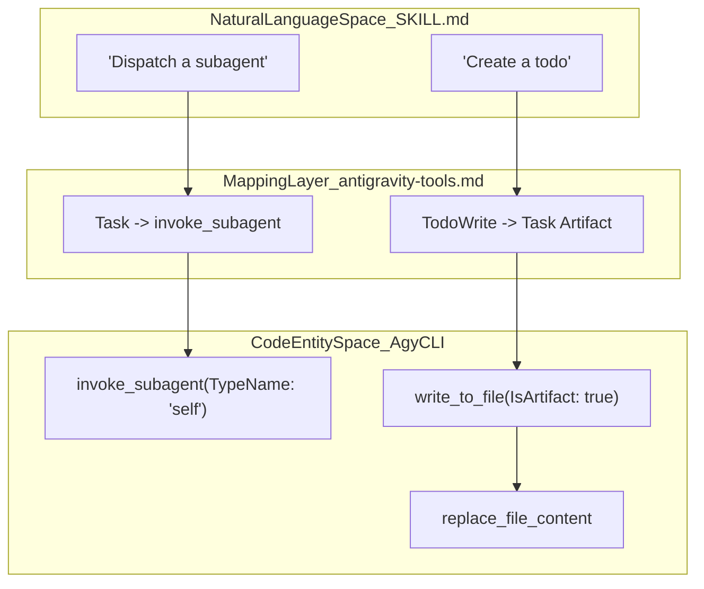
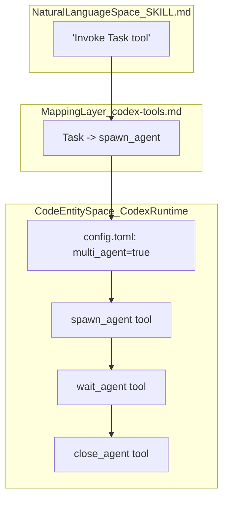

# Tool Mapping Layer

Relevant source files

The following files were used as context for generating this wiki page:

- [.claude-plugin/plugin.json](https://github.com/obra/superpowers/blob/HEAD/.claude-plugin/plugin.json)
- [RELEASE-NOTES.md](https://github.com/obra/superpowers/blob/HEAD/RELEASE-NOTES.md)
- [docs/superpowers/specs/2026-05-05-platform-neutral-config-refs-design.md](https://github.com/obra/superpowers/blob/HEAD/docs/superpowers/specs/2026-05-05-platform-neutral-config-refs-design.md)
- [skills/receiving-code-review/SKILL.md](https://github.com/obra/superpowers/blob/HEAD/skills/receiving-code-review/SKILL.md)
- [skills/using-superpowers/references/antigravity-tools.md](https://github.com/obra/superpowers/blob/HEAD/skills/using-superpowers/references/antigravity-tools.md)
- [skills/using-superpowers/references/codex-tools.md](https://github.com/obra/superpowers/blob/HEAD/skills/using-superpowers/references/codex-tools.md)
- [skills/using-superpowers/references/pi-tools.md](https://github.com/obra/superpowers/blob/HEAD/skills/using-superpowers/references/pi-tools.md)

The Tool Mapping Layer is a conceptual and technical bridge that allows Superpowers skills—written using Claude Code's tool vocabulary (e.g., `Skill`, `Task`, `TodoWrite`)—to function across different platforms like Codex, Pi, and Antigravity. Instead of rewriting skills for every environment, Superpowers provides a translation map that instructs the AI agent on how to substitute its native tools for the ones referenced in the skill files [docs/superpowers/specs/2026-05-05-platform-neutral-config-refs-design.md:30-37](https://github.com/obra/superpowers/blob/HEAD/docs/superpowers/specs/2026-05-05-platform-neutral-config-refs-design.md#L30-L37).

---

## The Problem: Tool Vocabulary Mismatch

Superpowers skills are authored as Markdown files. They frequently instruct the agent to perform specific actions using Claude Code's native toolset:

- **`Skill`**: To load and follow another skill.
- **`TodoWrite`**: To track progress against a checklist.
- **`Task`**: To dispatch a subagent for parallel or isolated work [RELEASE-NOTES.md:21-22](https://github.com/obra/superpowers/blob/HEAD/RELEASE-NOTES.md#L21-L22).

When these skills are loaded into other harnesses, the agent sees instructions for tools it does not technically possess. The Tool Mapping Layer resolves this by providing platform-specific reference files in `skills/using-superpowers/references/` [RELEASE-NOTES.md:65-67](https://github.com/obra/superpowers/blob/HEAD/RELEASE-NOTES.md#L65-L67).

---

## Platform Mapping Reference

Following the EOL of Gemini CLI and the removal of its tool-mapping references in v6.1.0, the system now focuses on modern harnesses [RELEASE-NOTES.md:29-31](https://github.com/obra/superpowers/blob/HEAD/RELEASE-NOTES.md#L29-L31).

| Claude Code Reference | Antigravity CLI (`agy`) | Pi Equivalent | Codex Equivalent |
|:---|:---|:---|:---|
| `Skill` | Native discovery | Native discovery | Native discovery |
| `TodoWrite` | Task Artifact (`write_to_file`) | `TODO.md` or Plan file | `update_plan` |
| `Task` (Subagent) | `invoke_subagent` | `subagent` (via `pi-subagents`) | `spawn_agent` |
| `Read` | `read_file` | Native file tools | Native file tools |
| `Write` | `write_to_file` | Native file tools | Native file tools |

**Sources:** [skills/using-superpowers/references/antigravity-tools.md:5-8](https://github.com/obra/superpowers/blob/HEAD/skills/using-superpowers/references/antigravity-tools.md#L5-L8), [skills/using-superpowers/references/pi-tools.md:5-8](https://github.com/obra/superpowers/blob/HEAD/skills/using-superpowers/references/pi-tools.md#L5-L8), [skills/using-superpowers/references/codex-tools.md:1-10](https://github.com/obra/superpowers/blob/HEAD/skills/using-superpowers/references/codex-tools.md#L1-L10), [RELEASE-NOTES.md:21-22](https://github.com/obra/superpowers/blob/HEAD/RELEASE-NOTES.md#L21-L22)

---

## Implementation by Platform

### 1. Antigravity CLI (`agy`): Artifact-Based Tracking
Antigravity has no native "todo" tool. Instead, it uses **task artifacts** to maintain state [skills/using-superpowers/references/antigravity-tools.md:12-14](https://github.com/obra/superpowers/blob/HEAD/skills/using-superpowers/references/antigravity-tools.md#L12-L14).

- **Task Tracking**: Skills requesting `TodoWrite` are mapped to `write_to_file` with `IsArtifact: true` and `ArtifactType: "task"` [skills/using-superpowers/references/antigravity-tools.md:8](https://github.com/obra/superpowers/blob/HEAD/skills/using-superpowers/references/antigravity-tools.md#L8).
- **Subagent Support**: Uses `invoke_subagent` with a `TypeName`. The value `self` is used for full-capability work, while `research` is used for read-only tasks [skills/using-superpowers/references/antigravity-tools.md:7](https://github.com/obra/superpowers/blob/HEAD/skills/using-superpowers/references/antigravity-tools.md#L7).

**Sources:** [skills/using-superpowers/references/antigravity-tools.md:1-24](https://github.com/obra/superpowers/blob/HEAD/skills/using-superpowers/references/antigravity-tools.md#L1-L24)

### 2. Pi: Extension-Based Mapping
Pi uses a session-start extension to register skills and inject the bootstrap [RELEASE-NOTES.md:69-70](https://github.com/obra/superpowers/blob/HEAD/RELEASE-NOTES.md#L69-L70).

- **Subagents**: Pi core does not ship a standard subagent tool. It relies on the optional `pi-subagents` package. If missing, the agent executes sequentially in the current session [skills/using-superpowers/references/pi-tools.md:12](https://github.com/obra/superpowers/blob/HEAD/skills/using-superpowers/references/pi-tools.md#L12).
- **Task Lists**: Maps `TodoWrite` to Superpowers plan files or a repo-local `TODO.md` [skills/using-superpowers/references/pi-tools.md:16-17](https://github.com/obra/superpowers/blob/HEAD/skills/using-superpowers/references/pi-tools.md#L16-L17).

**Sources:** [skills/using-superpowers/references/pi-tools.md:1-17](https://github.com/obra/superpowers/blob/HEAD/skills/using-superpowers/references/pi-tools.md#L1-L17), [RELEASE-NOTES.md:69-70](https://github.com/obra/superpowers/blob/HEAD/RELEASE-NOTES.md#L69-L70)

### 3. Codex: Native Discovery & Feature Flags
Codex reliably triggers skills on its own and no longer requires a SessionStart hook as of v6.1.0 [RELEASE-NOTES.md:26-27](https://github.com/obra/superpowers/blob/HEAD/RELEASE-NOTES.md#L26-L27).

- **Subagent Dispatch**: Requires `multi_agent = true` in `~/.codex/config.toml`. This enables `spawn_agent`, `wait_agent`, and `close_agent` [skills/using-superpowers/references/codex-tools.md:3-10](https://github.com/obra/superpowers/blob/HEAD/skills/using-superpowers/references/codex-tools.md#L3-L10).
- **Environment Detection**: Uses read-only git commands (e.g., `git rev-parse --git-dir`) to determine if the agent is in a linked worktree or a detached HEAD sandbox [skills/using-superpowers/references/codex-tools.md:14-24](https://github.com/obra/superpowers/blob/HEAD/skills/using-superpowers/references/codex-tools.md#L14-L24).
- **App Finishing**: In sandboxed environments, the agent guides the user to use the App's native "Create branch" or "Hand off to local" controls [skills/using-superpowers/references/codex-tools.md:29-36](https://github.com/obra/superpowers/blob/HEAD/skills/using-superpowers/references/codex-tools.md#L29-L36).

**Sources:** [skills/using-superpowers/references/codex-tools.md:1-40](https://github.com/obra/superpowers/blob/HEAD/skills/using-superpowers/references/codex-tools.md#L1-L40), [RELEASE-NOTES.md:7-8](https://github.com/obra/superpowers/blob/HEAD/RELEASE-NOTES.md#L7-L8)

---

## Tool Mapping Architecture

The following diagrams illustrate how the system bridges "Natural Language Space" (the instructions in the skill) to "Code Entity Space" (the actual tools available in the runtime).

**Diagram: Antigravity Tool Resolution**

**Sources:** [skills/using-superpowers/references/antigravity-tools.md:1-24](https://github.com/obra/superpowers/blob/HEAD/skills/using-superpowers/references/antigravity-tools.md#L1-L24)

**Diagram: Codex Subagent Workflow**

**Sources:** [skills/using-superpowers/references/codex-tools.md:1-11](https://github.com/obra/superpowers/blob/HEAD/skills/using-superpowers/references/codex-tools.md#L1-L11)

---

## Instruction Priority and Neutrality

To support multi-platform environments, Superpowers has transitioned from platform-specific filenames (like `CLAUDE.md`) to generic terms like "your instructions file" within skill prose [docs/superpowers/specs/2026-05-05-platform-neutral-config-refs-design.md:30-37](https://github.com/obra/superpowers/blob/HEAD/docs/superpowers/specs/2026-05-05-platform-neutral-config-refs-design.md#L30-L37).

The instruction hierarchy remains:
1.  **User's explicit instructions**: (Highest) Found in `CLAUDE.md`, `AGENTS.md`, or `GEMINI.md` (historical) [docs/superpowers/specs/2026-05-05-platform-neutral-config-refs-design.md:18](https://github.com/obra/superpowers/blob/HEAD/docs/superpowers/specs/2026-05-05-platform-neutral-config-refs-design.md#L18).
2.  **Superpowers skills**: Override default system behavior [RELEASE-NOTES.md:20](https://github.com/obra/superpowers/blob/HEAD/RELEASE-NOTES.md#L20).
3.  **Default system prompt**: (Lowest) Base AI model instructions.

**Sources:** [docs/superpowers/specs/2026-05-05-platform-neutral-config-refs-design.md:1-78](https://github.com/obra/superpowers/blob/HEAD/docs/superpowers/specs/2026-05-05-platform-neutral-config-refs-design.md#L1-L78), [RELEASE-NOTES.md:18-22](https://github.com/obra/superpowers/blob/HEAD/RELEASE-NOTES.md#L18-L22)2a:T