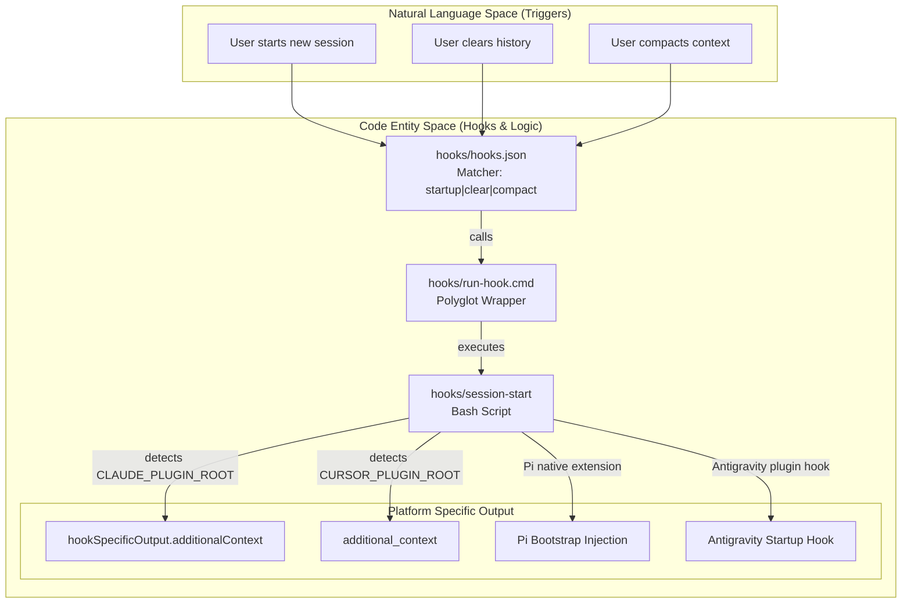
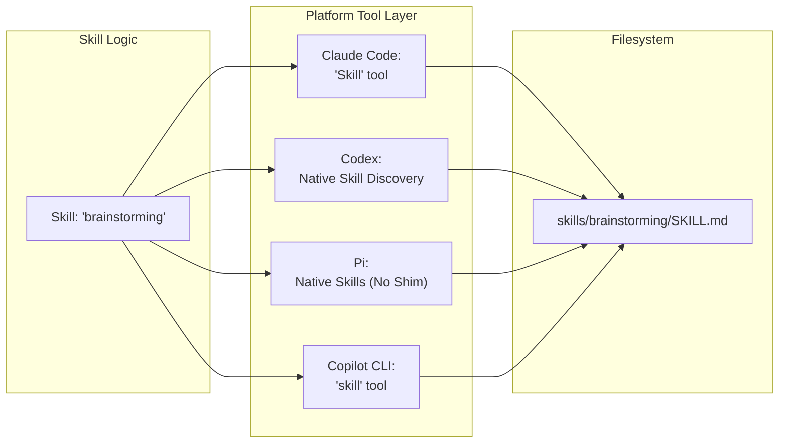

# Platform-Specific Features

Relevant source files

The following files were used as context for generating this wiki page:

- [.claude-plugin/plugin.json](https://github.com/obra/superpowers/blob/HEAD/.claude-plugin/plugin.json)
- [.gitignore](https://github.com/obra/superpowers/blob/HEAD/.gitignore)
- [CLAUDE.md](https://github.com/obra/superpowers/blob/HEAD/CLAUDE.md)
- [README.md](https://github.com/obra/superpowers/blob/HEAD/README.md)
- [RELEASE-NOTES.md](https://github.com/obra/superpowers/blob/HEAD/RELEASE-NOTES.md)

This page documents how Superpowers integrates with different AI development platforms. Each platform has unique integration requirements, tool mappings, and configuration mechanisms, but all share the same underlying skills repository.

**Note on Platform Deprecation:** As of June 18, 2026, Gemini CLI support has been removed following the tool's end-of-life. References to Gemini CLI are for historical context regarding v5.x and early v6.x releases.

---

## Platform Integration Architecture

Superpowers uses a **dual repository design** where a lightweight plugin shim in each platform loads and manages a shared skills repository. The plugin manifests are platform-specific, but the skills themselves are platform-agnostic.

### Plugin Manifest Locations

| Platform | Manifest File | Installation Type |
|----------|--------------|-------------------|
| Claude Code | `.claude-plugin/plugin.json` | Official or Custom Marketplace |
| Codex | `.codex-plugin/plugin.json` | Native skill discovery / Marketplace |
| Kimi Code | `kimi-plugin.json` | Marketplace / Repository URL |
| Pi | `pi-extension.json` | Native package |
| Antigravity | `agy-plugin.json` | Direct Repository Install |
| Cursor | `hooks-cursor.json` | Plugin system |

**Sources:** [.claude-plugin/plugin.json:1-20](https://github.com/obra/superpowers/blob/HEAD/.claude-plugin/plugin.json#L1-L20), [RELEASE-NOTES.md:65-71](https://github.com/obra/superpowers/blob/HEAD/RELEASE-NOTES.md#L65-L71), [README.md:32-187](https://github.com/obra/superpowers/blob/HEAD/README.md#L32-L187)

### Session Initialization Flow

The following diagram bridges the high-level initialization concept to the specific shell scripts and environment detection used to inject the `using-superpowers` bootstrap context.

**Sources:** [hooks/hooks.json:1-17](https://github.com/obra/superpowers/blob/HEAD/hooks/hooks.json#L1-L17), [RELEASE-NOTES.md:65-73](https://github.com/obra/superpowers/blob/HEAD/RELEASE-NOTES.md#L65-L73), [README.md:72-73](https://github.com/obra/superpowers/blob/HEAD/README.md#L72-L73), [README.md:185-187](https://github.com/obra/superpowers/blob/HEAD/README.md#L185-L187)

---

## Claude Code Integration

Claude Code is the **canonical platform** for Superpowers. It uses the official Claude plugin marketplace or the Superpowers-specific marketplace at `obra/superpowers-marketplace`.

### Plugin Manifest
The manifest defines the core metadata, versioning (v6.1.1), and keywords for discovery within the Claude ecosystem.
[ .claude-plugin/plugin.json:1-20](https://github.com/obra/superpowers/blob/HEAD/.claude-plugin/plugin.json#L1-L20)

### Hooks Configuration
Claude Code triggers the `session-start` script via `hooks/hooks.json` on `startup`, `clear`, and `compact` events to ensure the `using-superpowers` instructions are always present.
[hooks/hooks.json:1-16](https://github.com/obra/superpowers/blob/HEAD/hooks/hooks.json#L1-L16)

For details, see [Claude Code Integration](21_5.1-claude-code-integration.md).

---

## Codex Integration

Codex support includes both a CLI and an App interface. It utilizes native skill discovery and an explicit hook configuration.

### Hook Management
In v6.1.1, Codex uses an explicit empty hooks object (`hooks: {}`) in its manifest to prevent falling back to auto-discovering the Claude Code `SessionStart` hook, which previously caused redundant trust prompts.
[RELEASE-NOTES.md:5-9](https://github.com/obra/superpowers/blob/HEAD/RELEASE-NOTES.md#L5-L9)

### Packaging and Sync
The `package-codex-plugin.sh` script produces deterministic archives for the Codex portal, ensuring OpenAI metadata is included for every skill.
[RELEASE-NOTES.md:10-13](https://github.com/obra/superpowers/blob/HEAD/RELEASE-NOTES.md#L10-L13)

For details, see [Codex Integration](22_5.2-codex-integration.md).

---

## New Harness Support (Kimi, Pi, Antigravity)

Superpowers v6.0.0 introduced support for several new platforms, each with unique bootstrapping methods.

- **Kimi Code:** Installs via marketplace or repository URL; uses a standard plugin manifest. [RELEASE-NOTES.md:68-69](https://github.com/obra/superpowers/blob/HEAD/RELEASE-NOTES.md#L68-L69)
- **Pi:** Uses a native package system. It injects the `using-superpowers` bootstrap at session startup and again after context compaction. [RELEASE-NOTES.md:69-70](https://github.com/obra/superpowers/blob/HEAD/RELEASE-NOTES.md#L69-L70), [README.md:185-187](https://github.com/obra/superpowers/blob/HEAD/README.md#L185-L187)
- **Antigravity (`agy`):** Installs directly from the repository and runs the plugin's session-start hook from the first message. [RELEASE-NOTES.md:70-71](https://github.com/obra/superpowers/blob/HEAD/RELEASE-NOTES.md#L70-L71), [README.md:64-73](https://github.com/obra/superpowers/blob/HEAD/README.md#L64-L73)

---

## Platform Tool Mapping

This diagram illustrates how platform-neutral skill requests are transformed into platform-specific tool calls across different environments.

**Sources:** [RELEASE-NOTES.md:65-71](https://github.com/obra/superpowers/blob/HEAD/RELEASE-NOTES.md#L65-L71), [README.md:185-187](https://github.com/obra/superpowers/blob/HEAD/README.md#L185-L187), [RELEASE-NOTES.md:20-22](https://github.com/obra/superpowers/blob/HEAD/RELEASE-NOTES.md#L20-L22)

### Shared Logic
The `skills-core.js` shared module provides the underlying logic for skill discovery and path resolution used by non-Claude platforms.

For details, see [skills-core.js Shared Module](25_5.5-skills-core-js-shared-module.md).